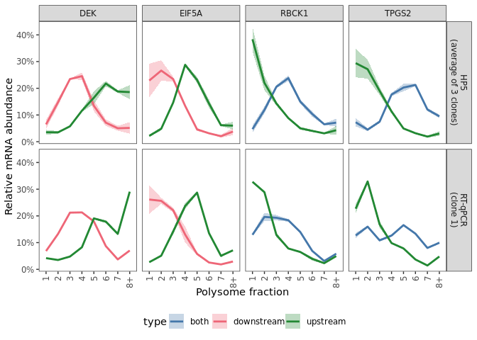

s10-1 Validation of HP5 by RT-qPCR
================
Yoichiro Sugimoto
24 May, 2022

  - [Overview](#overview)
  - [Environment setup](#environment-setup)
  - [Load and preprocess HP5 and 5’ end-Seq
    data](#load-and-preprocess-hp5-and-5-end-seq-data)
      - [RNA standard normalised data](#rna-standard-normalised-data)
      - [RNA expression data](#rna-expression-data)
  - [Analysis of polysome distribution of the selected mRNA isoforms
    using the HP5
    data](#analysis-of-polysome-distribution-of-the-selected-mrna-isoforms-using-the-hp5-data)
  - [Analysis of polysome distribution of the selected mRNA isoforms
    using RT-qPCR
    data](#analysis-of-polysome-distribution-of-the-selected-mrna-isoforms-using-rt-qpcr-data)
  - [Comparison of the HP5 data and
    RT-qPCR](#comparison-of-the-hp5-data-and-rt-qpcr)
  - [Session information](#session-information)

# Overview

The ability of HP5 to resolve mRNA isoforms will be evaluated in this
script. For this purpose, the polysome distribution of selected mRNA
isoforms estimated by the HP5 data (the average of three clones of RCC4
VHL) was compared with that estimated by RT-qPCR (RCC4 VHL clone 1).

# Environment setup

``` r
temp <- sapply(list.files("../functions", full.names = TRUE), source)
temp <- sapply(list.files("./functions", full.names = TRUE), source, chdir = TRUE)

library("readxl")

processors <- 8

set.seed(0)
```

``` r
## sample.file <- file.path("../../data/sample_data/processed_sample_file.csv")
annot.dir <- normalizePath(file.path("../../annotation/"))
annot.ps.dir <- file.path(annot.dir, "hg38_annotation/processed_data/")
annot.R.file <- list.files(
    annot.ps.dir,
    pattern = glob2rx("*primary_transcript_annotation*.rdata"),
    full.names = TRUE
)
load(annot.R.file)

results.dir <- file.path("../../results")

s8.dir <- file.path(results.dir, "s8-analysis-of-translation")
s8.1.dir <- file.path(s8.dir, "s8-1-differentially-translated-mRNAs")
s8.1.2.dir <- file.path(s8.1.dir, "tx-level-dte")

create.dirs(c(
))

sq.dir <- file.path(results.dir, "sq-for-publication")
source.data.dir <- file.path(sq.dir, "sq1-source-data")
source.data.by.panel.dir <- file.path(source.data.dir, "by_panel")

## Load differential expression analysis
source(file.path("../s6-differential-expression-and-tss-usage/functions/load_total_analysis_results.R"), chdir = TRUE)
```

    ## [1] "Sample file used: /camp/lab/ratcliffep/home/users/sugimoy/CAMP_HPC/projects/20211102_HP5_HIF_mTOR/data/sample_data/processed_sample_file.csv"
    ## [1] "The following R objects were exported: total.sample.dt, total.coldata.df, total.comparison.dt"
    ## [1] "Comparison information was loaded"
    ## [1] "/camp/lab/ratcliffep/home/users/sugimoy/CAMP_HPC/projects/20211102_HP5_HIF_mTOR/results"
    ## [1] "The following objects were loaded: tss.de.res.dt, tss.ratio.res.dt, diff.tss.res.dt"

# Load and preprocess HP5 and 5’ end-Seq data

## RNA standard normalised data

``` r
norm.count.dt <- fread(
    file.path(
        s8.1.2.dir,
        "RCC4_VHL_EIF4E2_yy_xx__Torin1_vs_NA-normalized_count.csv"
    )
)
```

## RNA expression data

``` r
rcc4.tss.de.res.dt <- tss.de.res.dt[
    comparison_name == "RCC4_xx_HIF1B_N__noVHL_vs_VHL"
]

rcc4.tss.de.res.dt[
  , meanNormCount_base_gene_max := max(meanNormCount_base, na.rm = TRUE),
    by = gene_id
]

## Only isoforms expressed more than 10% of the most highly expressed isoform were analysed
rcc4.tss.de.res.dt <- rcc4.tss.de.res.dt[
    meanNormCount_base > meanNormCount_base_gene_max * 0.1
]
```

# Analysis of polysome distribution of the selected mRNA isoforms using the HP5 data

``` r
sl.genes <- c("DEK", "EIF5A", "RBCK1", "TPGS2")

print("The following genes and isoforms will be analysed:")
```

    ## [1] "The following genes and isoforms will be analysed:"

``` r
rcc4.tss.de.res.dt[
    gene_name %in% sl.genes, .(gene_id, gene_name, tss_name)
]
```

    ##             gene_id gene_name          tss_name
    ##  1: ENSG00000124795       DEK ENSG00000124795_1
    ##  2: ENSG00000124795       DEK ENSG00000124795_2
    ##  3: ENSG00000125826     RBCK1 ENSG00000125826_2
    ##  4: ENSG00000125826     RBCK1 ENSG00000125826_3
    ##  5: ENSG00000125826     RBCK1 ENSG00000125826_4
    ##  6: ENSG00000132507     EIF5A ENSG00000132507_1
    ##  7: ENSG00000132507     EIF5A ENSG00000132507_2
    ##  8: ENSG00000132507     EIF5A ENSG00000132507_3
    ##  9: ENSG00000134779     TPGS2 ENSG00000134779_1
    ## 10: ENSG00000134779     TPGS2 ENSG00000134779_2

``` r
tss.per.gene.dts <- list(
    DEK = data.table(
        gene_name = "DEK",
        tss_class = c("upstream", "downstream"),
        tss_name = c("ENSG00000124795_1", "ENSG00000124795_2")
    ),
    EIF5A = data.table(
        gene_name = "EIF5A",
        tss_class = c("upstream", "upstream", "downstream"),
        tss_name = c(
            "ENSG00000132507_1",
            "ENSG00000132507_2",
            "ENSG00000132507_3"
        )
    ),
    RBCK1 = data.table(
        gene_name = "RBCK1",
        tss_class = c("upstream", "both", "both"),
        tss_name = c(
            "ENSG00000125826_2",
            "ENSG00000125826_3",
            "ENSG00000125826_4"
        )
    ),
    TPGS2 = data.table(
        gene_name = "TPGS2",
        tss_class = c("upstream", "both"),
        tss_name = c("ENSG00000134779_1", "ENSG00000134779_2")
    )
)
```

``` r
sl.norm.count.dt <- merge(
    rbindlist(tss.per.gene.dts)[, .(tss_name, tss_class)],
    norm.count.dt,
    by = "tss_name"
)

sl.norm.count.dt[, tss_name := paste0(gene_name, "_", tss_class)]

## Collapse count data for multiple TSSs
sl.norm.count.dt <- sl.norm.count.dt[
  , lapply(.SD, sum, na.rm = TRUE), by = tss_name,
    .SDcols = grep("RCC4", colnames(sl.norm.count.dt)) 
]

calcNormCountStats <- function(norm.count.dt, ref.col = "tss_name", grep.col = "^RCC4"){

    m.norm.count.dt <- melt(
        norm.count.dt,
        id.vars = ref.col,
        measure.vars = grep(
            grep.col,
            colnames(norm.count.dt)
        ),
        variable.name = "sample_name",
        value.name = "norm_count"
    ) %>%
        {.[, `:=`(
             cell = str_split_fixed(sample_name, "_", n = 8)[, 1],
             VHL = str_split_fixed(sample_name, "_", n = 8)[, 2],
             EIF4E2 = str_split_fixed(sample_name, "_", n = 8)[, 3],
             clone = str_split_fixed(sample_name, "_", n = 8)[, 5],
             treatment = str_split_fixed(sample_name, "_", n = 8)[, 6],
             fraction = str_split_fixed(sample_name, "_", n = 8)[, 7]
         )]}

    m.norm.count.dt[
      , norm_count_sum := sum(norm_count),
        by = list(get(ref.col), VHL, EIF4E2, clone, treatment) 
    ][, norm_count_ratio := norm_count / norm_count_sum]
    
    m.norm.count.dt[, `:=`(
        norm_count_ratio_mean = mean(norm_count_ratio),
        norm_count_ratio_sd = sd(norm_count_ratio)
    ), by = list(get(ref.col), VHL, EIF4E2, treatment, fraction)]

    norm.count.summary.dt <- dcast(
        m.norm.count.dt,
        paste(
            paste(
                unique(ref.col, "gene_id"),
                "cell", "VHL", "EIF4E2",
                "treatment", "fraction",
                "norm_count_ratio_mean", "norm_count_ratio_sd",
                sep = " + "
            ),
            "~",
            "clone"
        ),
        value.var = c("norm_count", "norm_count_ratio")
    )
    
    return(norm.count.summary.dt)
}

norm.count.summary.dt <- calcNormCountStats(
    sl.norm.count.dt,
    ref.col = "tss_name",
    grep.col = "RCC4_VHL_EIF4E2_NA_[[:digit:]]_NA_ribo[[:digit:]]"
)

norm.count.summary.dt[, `:=`(
    gene = str_split_fixed(tss_name, "_", n = 2)[, 1],
    type = str_split_fixed(tss_name, "_", n = 2)[, 2],
    experiment = "HP5\n(average of 3 clones)"
)]

for.export.norm.count.summary.dt <- copy(norm.count.summary.dt)

for.export.norm.count.summary.dt[, experiment := "HP5"]

temp <- exportSourceData(
    dt = for.export.norm.count.summary.dt,
    original.colnames = c(
        "experiment", "gene", "type",
        "norm_count_ratio_mean", "norm_count_ratio_sd",
        "norm_count_1", "norm_count_3", "norm_count_4"
    ),
    export.colnames = c(
        "Experiment", "gene", "TSS type",
        "Proportion (mean)", "Proportion (sd)",
        "mRNA abundance (clone 1)", "mRNA abundance (clone 3)", "mRNA abundance (clone 4)"
    ),
    export.file.name =
        "Extended Data Fig. 3a HP5 stats.csv"
)
```

# Analysis of polysome distribution of the selected mRNA isoforms using RT-qPCR data

``` r
qpcr.res.file <- file.path("../../data/others/RT-qPCR_all-results.xlsx")

qpcr.res.dt <- rbind(
    read_excel(qpcr.res.file, sheet = "replicate_1") %>% data.table %>%
    {.[, replicate := 1]},
    read_excel(qpcr.res.file, sheet = "replicate_2") %>% data.table %>%
    {.[, replicate := 2]}
)[
  , c("fraction", "gene", "type", "Ct", "replicate"), with = FALSE
][!is.na(fraction)]

qpcr.res.dt[, `:=`(
    type = case_when(
        type == "dist" ~ "upstream",
        type == "proxy" ~ "downstream",
        TRUE ~ type
    )
)]

## Export Ct value as the source data
ct.raw.for.export.dt <- dcast(
    qpcr.res.dt,
    gene + type + fraction ~ replicate,
    value.var = "Ct"
) 

ct.raw.for.export.dt <- ct.raw.for.export.dt[
    order(
        match(gene, names(tss.per.gene.dts)),
        match(type, c("upstream", "downstream", "both", "all"))
    )
]

temp <- exportSourceData(
    dt = ct.raw.for.export.dt,
    original.colnames = c(
        "gene", "type", "fraction", "1", "2"
    ),
    export.colnames = c(
        "gene", "TSS type", "Polysome fraction", "Ct for replicate 1", "Ct for replicate 2"
    ),
    export.file.name = "Extended Data Fig. 3a qPCR raw.csv"
)
### Up to here: export for source data

## Calculation of primer efficiency
qpcr.standard.dt <- rbind(
    read_excel(qpcr.res.file, sheet = "standard_1") %>% data.table,
    read_excel(qpcr.res.file, sheet = "standard_2") %>% data.table
)[, c("dilution", "gene", "type", "Ct"), with = FALSE]

qpcr.standard.summary.dt <- qpcr.standard.dt[
  , replicate := 1:.N, by = list(gene, type, dilution)
]

qpcr.standard.dt[, `:=`(
    type = case_when(
        type == "dist" ~ "upstream",
        type == "proxy" ~ "downstream",
        TRUE ~ type
    )
)]

## Export Ct value as the source data (qPCR standard)
std.ct.raw.for.export.dt <- dcast(
    qpcr.standard.dt,
    gene + type + dilution ~ replicate,
    value.var = "Ct"
) 

std.ct.raw.for.export.dt <- std.ct.raw.for.export.dt[
    order(
        match(gene, names(tss.per.gene.dts)),
        match(type, c("upstream", "downstream", "both", "all"))
    )
]

temp <- exportSourceData(
    dt = std.ct.raw.for.export.dt,
    original.colnames = c(
        "gene", "type", "dilution", "1", "2"
    ),
    export.colnames = c(
        "gene", "TSS type", "Dilution", "Ct for replicate 1", "Ct for replicate 2"
    ),
    export.file.name =
        "Extended Data Fig. 3a qPCR for standard curve raw.csv"
)
### Up to here: export for source data

qpcr.standard.summary.dt <- qpcr.standard.dt[, list(
    Ct_mean = mean(Ct),
    Ct_sd = sd(Ct)
), by = list(gene, type, dilution)]

qpcr.primer.eff.dt <- qpcr.standard.summary.dt[, as.list(
    coef(lm(Ct_mean ~ log10(1/dilution)))
), by = list(gene, type)][
  , primer_eff := 10^(-1/ get("log10(1/dilution)")) - 1
][order(gene == "ERCC-00002", gene, type)]

print(qpcr.primer.eff.dt)
```

    ##          gene       type (Intercept) log10(1/dilution) primer_eff
    ## 1:        DEK downstream    28.52501         -3.597852  0.8964597
    ## 2:        DEK   upstream    27.47227         -3.598420  0.8962682
    ## 3:      EIF5A downstream    29.82663         -3.418213  0.9613293
    ## 4:      EIF5A   upstream    25.16280         -3.518094  0.9241762
    ## 5:      RBCK1       both    30.58086         -3.399781  0.9685053
    ## 6:      RBCK1   upstream    29.69608         -3.418198  0.9613352
    ## 7:      TPGS2       both    28.47028         -3.439025  0.9533500
    ## 8:      TPGS2   upstream    29.09549         -3.453525  0.9478666
    ## 9: ERCC-00002        all    29.97927         -3.363186  0.9830659

``` r
print("Rsquared values for confirmation:")
```

    ## [1] "Rsquared values for confirmation:"

``` r
qpcr.standard.summary.dt[, list(
    rsq = summary(lm(Ct_mean ~ log10(1/dilution)))$r.squared
), by = list(gene, type)][order(gene == "ERCC-00002", gene, type)]
```

    ##          gene       type       rsq
    ## 1:        DEK downstream 0.9990893
    ## 2:        DEK   upstream 0.9998573
    ## 3:      EIF5A downstream 0.9997558
    ## 4:      EIF5A   upstream 0.9996073
    ## 5:      RBCK1       both 0.9956700
    ## 6:      RBCK1   upstream 0.9916796
    ## 7:      TPGS2       both 0.9998838
    ## 8:      TPGS2   upstream 0.9992406
    ## 9: ERCC-00002        all 0.9994574

``` r
quant.dt <- merge(
    qpcr.res.dt,
    qpcr.primer.eff.dt[, .(gene, type, primer_eff)],
    by = c("gene", "type")
)

ercc.quant.dt <- quant.dt[gene == "ERCC-00002"]
ercc.quant.dt[, `:=`(
    ercc_input = (2 * primer_eff)^(-Ct)
)]

gene.quant.dt <- quant.dt[gene != "ERCC-00002"]
gene.quant.dt[, `:=`(
    gene_input = (2 * primer_eff)^(-Ct)
)]

all.quant.dt <- merge(
    gene.quant.dt,
    ercc.quant.dt[
      , c("replicate", "fraction", "ercc_input"), with = FALSE
    ],
    by = c("replicate", "fraction")
)

all.quant.dt[, `:=`(
    norm_input = gene_input / ercc_input
)]
all.quant.dt[
  , norm_input_sum := sum(norm_input), by = list(replicate, gene, type)
]
all.quant.dt[
    , norm_input_ratio := norm_input / norm_input_sum
]

all.quant.dt[, `:=`(
    norm_count_ratio_mean = mean(norm_input_ratio),
    norm_count_ratio_sd = sd(norm_input_ratio),
    experiment = "RT-qPCR\n(clone 1)"
), by = list(gene, type, fraction)]

qpcr.all.quant.res.dt <- dcast(
    all.quant.dt,
    gene + type + fraction +
    norm_count_ratio_mean + norm_count_ratio_sd + experiment ~
        replicate,
    value.var = c("norm_input", "norm_input_ratio")
)

for.export.qpcr.all.quant.res.dt <- copy(qpcr.all.quant.res.dt)
for.export.qpcr.all.quant.res.dt[, experiment := "RT-qPCR"]

temp <- exportSourceData(
    dt = for.export.qpcr.all.quant.res.dt,
    original.colnames = c(
        "experiment", "gene", "type",
        "norm_count_ratio_mean", "norm_count_ratio_sd",
        "norm_input_1", "norm_input_2"
    ),
    export.colnames = c(
        "Experiment", "gene", "TSS type",
        "Proportion (mean)", "Proportion (sd)",
        "mRNA abundance (replicate 1)", "mRNA abundance (replicate 2)"
    ),
    export.file.name =
        "Extended Data Fig. 3a qPCR stats.csv"
)
```

# Comparison of the HP5 data and RT-qPCR

``` r
all.res.dt <- rbind(
    norm.count.summary.dt,
    qpcr.all.quant.res.dt,
    use.names = TRUE,
    fill = TRUE
)

all.res.dt[
  , fraction := case_when(
        fraction == "ribo8" ~ "8+",
        TRUE ~ gsub("ribo", "", fraction)
    )
]

ggplot(
    data = all.res.dt,
    aes(
        x = fraction,
        y = norm_count_ratio_mean,
        ymin = norm_count_ratio_mean - norm_count_ratio_sd,
        ymax = norm_count_ratio_mean + norm_count_ratio_sd,
        color = type,
        fill = type,
        group = type
    )
) +
    geom_ribbon(alpha = 0.3, color = NA) +
    geom_line(size = 1) +
    facet_grid(experiment ~ gene) +
    theme_bw() +
    theme(
        legend.position = "bottom",
        panel.grid.major = element_blank(),
        panel.grid.minor = element_blank()
    ) +
    scale_x_discrete(guide = guide_axis(angle = 90)) +
    scale_y_continuous(labels = scales::percent_format(accuracy = 1)) +
    scale_color_bright() +
    scale_fill_bright() +
    ylab("Relative mRNA abundance") +
    xlab("Polysome fraction")
```

<!-- -->

# Session information

``` r
sessionInfo()
```

    ## R version 4.0.0 (2020-04-24)
    ## Platform: x86_64-conda_cos6-linux-gnu (64-bit)
    ## Running under: CentOS Linux 7 (Core)
    ## 
    ## Matrix products: default
    ## BLAS/LAPACK: /camp/lab/ratcliffep/home/users/sugimoy/CAMP_HPC/software/miniconda3_20200606/envs/hydroxylation_by_JMJD6/lib/libopenblasp-r0.3.10.so
    ## 
    ## locale:
    ##  [1] LC_CTYPE=en_GB.UTF-8       LC_NUMERIC=C              
    ##  [3] LC_TIME=en_GB.UTF-8        LC_COLLATE=en_GB.UTF-8    
    ##  [5] LC_MONETARY=en_GB.UTF-8    LC_MESSAGES=en_GB.UTF-8   
    ##  [7] LC_PAPER=en_GB.UTF-8       LC_NAME=C                 
    ##  [9] LC_ADDRESS=C               LC_TELEPHONE=C            
    ## [11] LC_MEASUREMENT=en_GB.UTF-8 LC_IDENTIFICATION=C       
    ## 
    ## attached base packages:
    ## [1] parallel  stats     graphics  grDevices utils     datasets  methods  
    ## [8] base     
    ## 
    ## other attached packages:
    ## [1] readxl_1.3.1      knitr_1.28        stringr_1.4.0     magrittr_1.5     
    ## [5] data.table_1.12.8 dplyr_1.0.0       khroma_1.3.0      ggplot2_3.3.1    
    ## [9] rmarkdown_2.2    
    ## 
    ## loaded via a namespace (and not attached):
    ##  [1] Rcpp_1.0.4.6     pillar_1.4.4     compiler_4.0.0   cellranger_1.1.0
    ##  [5] tools_4.0.0      digest_0.6.25    evaluate_0.14    lifecycle_0.2.0 
    ##  [9] tibble_3.0.1     gtable_0.3.0     pkgconfig_2.0.3  rlang_0.4.11    
    ## [13] yaml_2.2.1       xfun_0.14        withr_2.2.0      generics_0.0.2  
    ## [17] vctrs_0.3.1      grid_4.0.0       tidyselect_1.1.0 glue_1.4.1      
    ## [21] R6_2.4.1         farver_2.0.3     purrr_0.3.4      scales_1.1.1    
    ## [25] ellipsis_0.3.1   htmltools_0.4.0  colorspace_1.4-1 labeling_0.3    
    ## [29] stringi_1.4.6    munsell_0.5.0    crayon_1.3.4
