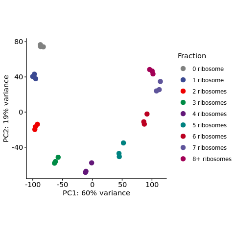
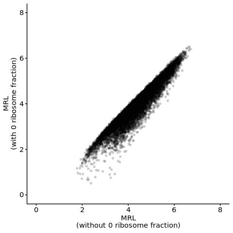
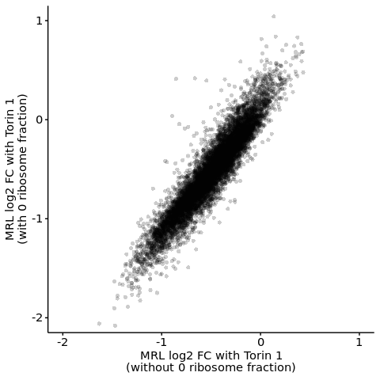
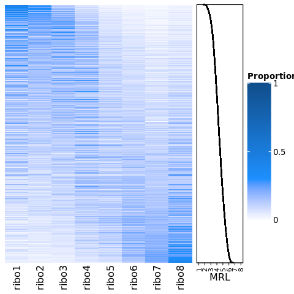

s10-2 Analysis of HP5 dynamic range
================
Yoichiro Sugimoto
10 February, 2022

  - [Overview](#overview)
  - [Environment setup](#environment-setup)
  - [PCA](#pca)
  - [Assess the effect of omitting 0 ribosome
    fraction](#assess-the-effect-of-omitting-0-ribosome-fraction)
  - [Assess the distribution of mRNAs across
    fractions](#assess-the-distribution-of-mrnas-across-fractions)
  - [Session information](#session-information)

# Overview

The ability of HP5 to dynamically assess translation will be evaluated.

# Environment setup

``` r
library("DESeq2")

temp <- sapply(list.files("../functions", full.names = TRUE), source)
temp <- sapply(list.files("./functions", full.names = TRUE), source, chdir = TRUE)

processors <- 8

set.seed(0)
```

``` r
sample.file <- file.path("../../data/sample_data/processed_sample_file.csv")

annot.dir <- normalizePath(file.path("../../annotation/"))
annot.ps.dir <- file.path(annot.dir, "hg38_annotation/processed_data/")
annot.R.file <- list.files(
    annot.ps.dir,
    pattern = glob2rx("*primary_transcript_annotation*.rdata"),
    full.names = TRUE
)
load(annot.R.file)

results.dir <- file.path("../../results")

s2.alignment.dir <- file.path(results.dir, "s2-read-alignment")
s2.2.processed.bam.dir <-  file.path(s2.alignment.dir, "s2-2-processed-data")
s2.2.4.gene.count.dir <- file.path(s2.2.processed.bam.dir, "s2-2-4-gene-count")
s2.2.4.1.gene.count.total.dir <- file.path(s2.2.4.gene.count.dir, "s2-2-4-1-gene-count-total")

s8.dir <- file.path(results.dir, "s8-analysis-of-translation")
s8.1.dir <- file.path(s8.dir, "s8-1-differentially-translated-mRNAs")
s8.1.1.dir <- file.path(s8.1.dir, "gene-level-dte")
s8.1.2.dir <- file.path(s8.1.dir, "tx-level-dte")
s8.3.dir <- file.path(s8.dir, "s8-3-validation-of-method")

create.dirs(c(
))
```

# PCA

``` r
sample.dt <- fread(sample.file)
sample.names <- sample.dt[, sample_name]

total.count.file <- file.path(s2.2.4.1.gene.count.total.dir, "total_gene_count_table.csv")
total.count.dt <- fread(total.count.file)

## collapase ribo 0A and ribo0B fraction for this analysis
id.colnames <- c("gene_id", "gene_name", "biotype") 

m.total.count.dt <- melt(
    total.count.dt,
    id.vars = id.colnames,
    variable.name = "sample_name",
    value.name = "count"
)

m.total.count.dt <- m.total.count.dt[grepl("^polysome", sample_name)]

m.total.count.dt[, `:=`(
    sample_group =
        gsub("(_ribo[[:digit:]]$|_ribo[[:digit:]][[:alpha:]]$)", "", sample_name),
    fraction = str_split_fixed(sample_name, "_", n = 8)[, 8] %>%
        {gsub("(A$|B$)", "", .)}
)]

m.collapsed.total.count.dt <- m.total.count.dt[
  , list(sum_count = sum(count)),
    by = list(gene_id, gene_name, biotype, sample_group, fraction)
]

collapsed.total.count.dt <- dcast(
    m.collapsed.total.count.dt,
    gene_id + gene_name + biotype ~ sample_group + fraction,
    value.var = "sum_count", sep = "_"
) 

collapsed.sample.dt <- copy(sample.dt)
collapsed.sample.dt[, `:=`(
    sample_name = gsub("(A$|B$)", "", sample_name),
    fraction = gsub("(A$|B$)", "", fraction) %>%
        str_extract("[[:digit:]]$") %>% as.integer %>%
        {case_when(
             . %in% c(0, 1) ~ paste(., "ribosome"),
             . == 8 ~ paste0(., "+ ribosomes"),
             TRUE ~ paste(., "ribosomes")
         )}
)]

collapsed.sample.dt <- collapsed.sample.dt[!duplicated(sample_name)]

sl.sample.names <- grep(
    "polysome_RCC4_VHL_EIF4E2_NA_[[:digit:]]_NA",
    collapsed.sample.dt[, sample_name],
    value = TRUE
)

sl.sample.dt <- collapsed.sample.dt[sample_name %in% sl.sample.names]

count.dt <- collapsed.total.count.dt[biotype == "protein_coding"]
count.df <- count.dt[, sl.sample.names, with = FALSE] %>% as.data.frame
rownames(count.df) <- count.dt[, gene_id]

dds <- DESeqDataSetFromMatrix(
    countData = count.df,
    colData = sl.sample.dt,
    design = ~ 1
)

dds <- estimateSizeFactors(dds)
vsd <- vst(dds, blind = TRUE)
```

    ## -- note: fitType='parametric', but the dispersion trend was not well captured by the
    ##    function: y = a/x + b, and a local regression fit was automatically substituted.
    ##    specify fitType='local' or 'mean' to avoid this message next time.

``` r
roll <- function(x , n){
    ## https://stackoverflow.com/questions/18791212/circular-shift-of-vector-equivalent-to-numpy-roll
    if(n == 0)
        return(x)
    c(tail(x, n), head(x, -n))
}

plotPCA(vsd, intgroup = "fraction", ntop = round(nrow(assay(vsd)) / 4)) +
    theme(
        aspect.ratio = 1
    ) +
    scale_color_manual(
        values = roll(
            ggsci::pal_aaas(palette = c("default"), alpha = 1)(9), 1
        ),
        name = "Fraction"
    )
```

<!-- -->

``` r
print(paste0("The number of tx analysed: ", round(nrow(assay(vsd))/4)))
```

    ## [1] "The number of tx analysed: 4902"

# Assess the effect of omitting 0 ribosome fraction

``` r
mrl.with.ribo0.dt <- fread(
    file.path(
        s8.1.1.dir,
        "RCC4_VHL_EIF4E2_yy_xx__Torin1_vs_NA-mean_ribosome_loading-with_ribo0.csv"
    )
)

mrl.with.ribo0.dt <- mrl.with.ribo0.dt[
  , c("gene_id", "MRL_treated", "MRL_base", "MRL_log2fc")
]

setnames(
    mrl.with.ribo0.dt,
    old = colnames(mrl.with.ribo0.dt),
    new = gsub("MRL", "MRL_with_ribo0", colnames(mrl.with.ribo0.dt))
)

mrl.without.ribo0.dt <- fread(
    file.path(
        s8.1.1.dir,
        "RCC4_VHL_EIF4E2_yy_xx__Torin1_vs_NA-mean_ribosome_loading.csv"
    )
)

all.mrl.dt <- merge(
    mrl.without.ribo0.dt,
    mrl.with.ribo0.dt,
    by = "gene_id"
)

all.filtered.gene.dt <- file.path(
    s8.3.dir,
    "filtered_gene_for_polysome_analysis.csv"
) %>% fread

all.mrl.dt[
    gene_id %in% all.filtered.gene.dt[RCC4_VHL_NA == TRUE, gene_id]
] %T>%
    {print(
         ggplot(
             data = .,
             aes(
                 x = MRL_base,
                 y = MRL_with_ribo0_base
             )
         ) +
         geom_point(alpha = 0.2, shape = 16) +
         ## geom_smooth(method = "lm") +
         coord_cartesian(xlim = c(0, 8), ylim = c(0, 8)) +
         xlab("MRL\n(without 0 ribosome fraction)") +
         ylab("MRL\n(with 0 ribosome fraction)")
     )} %$%
    cor.test(x = MRL_base, y = MRL_with_ribo0_base)
```

    ## Warning: Removed 1 rows containing missing values (geom_point).

<!-- -->

    ## 
    ##  Pearson's product-moment correlation
    ## 
    ## data:  MRL_base and MRL_with_ribo0_base
    ## t = 314.95, df = 10212, p-value < 2.2e-16
    ## alternative hypothesis: true correlation is not equal to 0
    ## 95 percent confidence interval:
    ##  0.9503434 0.9539650
    ## sample estimates:
    ##       cor 
    ## 0.9521876

``` r
all.mrl.dt[
    gene_id %in% all.filtered.gene.dt[
                     RCC4_VHL_NA == TRUE &
                     RCC4_VHL_Torin1 == TRUE,
                     gene_id
                 ]
] %T>%
    {print(
         ggplot(
             data = .,
             aes(
                 x = MRL_log2fc,
                 y = MRL_with_ribo0_log2fc
             )
         ) +
         geom_point(alpha = 0.2, shape = 16) +
         ## geom_smooth(method = "lm") +
         coord_cartesian(xlim = c(-2, 1), ylim = c(-2, 1)) +
         xlab("MRL log2 FC with Torin 1\n(without 0 ribosome fraction)") +
         ylab("MRL log2 FC with Torin 1\n(with 0 ribosome fraction)")
     )} %$%
    cor.test(x = MRL_base, y = MRL_with_ribo0_base)
```

<!-- -->

    ## 
    ##  Pearson's product-moment correlation
    ## 
    ## data:  MRL_base and MRL_with_ribo0_base
    ## t = 301.58, df = 9459, p-value < 2.2e-16
    ## alternative hypothesis: true correlation is not equal to 0
    ## 95 percent confidence interval:
    ##  0.9497983 0.9535962
    ## sample estimates:
    ##       cor 
    ## 0.9517337

# Assess the distribution of mRNAs across fractions

``` r
norm.count.dt <- fread(
    file.path(
        s8.1.1.dir,
        "RCC4_VHL_EIF4E2_yy_xx__Torin1_vs_NA-normalized_count.csv"
    )
)
 
calcNormCountStats <- function(norm.count.dt, ref.col = "tss_name", grep.col = "^RCC4"){

    m.norm.count.dt <- melt(
        norm.count.dt,
        id.vars = ref.col,
        measure.vars = grep(
            grep.col,
            colnames(norm.count.dt)
        ),
        variable.name = "sample_name",
        value.name = "norm_count"
    ) %>%
        {.[, `:=`(
             VHL = str_split_fixed(sample_name, "_", n = 8)[, 2],
             EIF4E2 = str_split_fixed(sample_name, "_", n = 8)[, 3],
             clone = str_split_fixed(sample_name, "_", n = 8)[, 5],
             treatment = str_split_fixed(sample_name, "_", n = 8)[, 6],
             fraction = str_split_fixed(sample_name, "_", n = 8)[, 7]
         )]}

    m.norm.count.dt[
      , norm_count_sum := sum(norm_count),
        by = list(get(ref.col), VHL, EIF4E2, clone, treatment) 
    ][, norm_count_ratio := norm_count / norm_count_sum]
    
    norm.count.summary.dt <- m.norm.count.dt[, list(
        norm_count_ratio_mean = mean(norm_count_ratio),
        norm_count_ratio_sd = sd(norm_count_ratio)
    ), by = list(get(ref.col), VHL, EIF4E2, treatment, fraction)]

    setnames(norm.count.summary.dt, old = "get", new = ref.col)
    
    return(norm.count.summary.dt)
}

norm.count.summary.dt <- calcNormCountStats(
    norm.count.dt[
        gene_id %in% all.filtered.gene.dt[RCC4_VHL_NA == TRUE, gene_id]
    ],
    ref.col = "gene_id",
    grep.col = "RCC4_VHL_EIF4E2_NA_[[:digit:]]_NA_ribo[[:digit:]]"
)

## Sorted by MRL only
sorted.mrl.without.ribo0.dt <- mrl.without.ribo0.dt[
    order(MRL_base)
][gene_id %in% norm.count.summary.dt[, gene_id]]

d.norm.count.summary.mat <- dcast(
    norm.count.summary.dt,
    gene_id ~ fraction,
    value.var = "norm_count_ratio_mean"
) %>%
    {.[order(
         match(gene_id, sorted.mrl.without.ribo0.dt[, gene_id])
     )]} %>%
    as.matrix(rownames = "gene_id")

library("ComplexHeatmap")
```

    ## Loading required package: grid

    ## ========================================
    ## ComplexHeatmap version 2.4.3
    ## Bioconductor page: http://bioconductor.org/packages/ComplexHeatmap/
    ## Github page: https://github.com/jokergoo/ComplexHeatmap
    ## Documentation: http://jokergoo.github.io/ComplexHeatmap-reference
    ## 
    ## If you use it in published research, please cite:
    ## Gu, Z. Complex heatmaps reveal patterns and correlations in multidimensional 
    ##   genomic data. Bioinformatics 2016.
    ## 
    ## This message can be suppressed by:
    ##   suppressPackageStartupMessages(library(ComplexHeatmap))
    ## ========================================

``` r
library("circlize")
```

    ## Warning: package 'circlize' was built under R version 4.0.5

    ## ========================================
    ## circlize version 0.4.13
    ## CRAN page: https://cran.r-project.org/package=circlize
    ## Github page: https://github.com/jokergoo/circlize
    ## Documentation: https://jokergoo.github.io/circlize_book/book/
    ## 
    ## If you use it in published research, please cite:
    ## Gu, Z. circlize implements and enhances circular visualization
    ##   in R. Bioinformatics 2014.
    ## 
    ## This message can be suppressed by:
    ##   suppressPackageStartupMessages(library(circlize))
    ## ========================================

``` r
col_fun = colorRamp2(c(0, 0.3, 1), c("white", "dodgerblue", "dodgerblue4"))

ht.list <- Heatmap(
    d.norm.count.summary.mat,
    cluster_columns = FALSE,
    cluster_rows = FALSE,
    show_row_names = FALSE,
    col = col_fun,
    heatmap_legend_param = list(
        col_fun = col_fun,
        title = "Proportion",
        legend_height = unit(6, "cm"),
        grid_width = unit(1, "cm")
    )
) +
    rowAnnotation(
        MRL = anno_points(
            sorted.mrl.without.ribo0.dt[, MRL_base],
            pch = 16, size = unit(1, "mm"),
            ylim = c(1, 8),
            axis_param = list(
                at = 1:8, 
                labels = 1:8
            ),
            width = unit(2, "cm")
        )
    )

draw(ht.list)
```

<!-- -->

# Session information

``` r
sessionInfo()
```

    ## R version 4.0.0 (2020-04-24)
    ## Platform: x86_64-conda_cos6-linux-gnu (64-bit)
    ## Running under: CentOS Linux 7 (Core)
    ## 
    ## Matrix products: default
    ## BLAS/LAPACK: /camp/lab/ratcliffep/home/users/sugimoy/CAMP_HPC/software/miniconda3_20200606/envs/hydroxylation_by_JMJD6/lib/libopenblasp-r0.3.10.so
    ## 
    ## locale:
    ##  [1] LC_CTYPE=en_GB.UTF-8       LC_NUMERIC=C              
    ##  [3] LC_TIME=en_GB.UTF-8        LC_COLLATE=en_GB.UTF-8    
    ##  [5] LC_MONETARY=en_GB.UTF-8    LC_MESSAGES=en_GB.UTF-8   
    ##  [7] LC_PAPER=en_GB.UTF-8       LC_NAME=C                 
    ##  [9] LC_ADDRESS=C               LC_TELEPHONE=C            
    ## [11] LC_MEASUREMENT=en_GB.UTF-8 LC_IDENTIFICATION=C       
    ## 
    ## attached base packages:
    ##  [1] grid      parallel  stats4    stats     graphics  grDevices utils    
    ##  [8] datasets  methods   base     
    ## 
    ## other attached packages:
    ##  [1] circlize_0.4.13             ComplexHeatmap_2.4.3       
    ##  [3] knitr_1.28                  stringr_1.4.0              
    ##  [5] magrittr_1.5                data.table_1.12.8          
    ##  [7] dplyr_1.0.0                 khroma_1.3.0               
    ##  [9] ggplot2_3.3.1               DESeq2_1.28.0              
    ## [11] SummarizedExperiment_1.18.1 DelayedArray_0.14.0        
    ## [13] matrixStats_0.56.0          Biobase_2.48.0             
    ## [15] GenomicRanges_1.40.0        GenomeInfoDb_1.24.0        
    ## [17] IRanges_2.22.1              S4Vectors_0.26.0           
    ## [19] BiocGenerics_0.34.0         rmarkdown_2.2              
    ## 
    ## loaded via a namespace (and not attached):
    ##  [1] bit64_0.9-7            splines_4.0.0          blob_1.2.1            
    ##  [4] GenomeInfoDbData_1.2.3 yaml_2.2.1             pillar_1.4.4          
    ##  [7] RSQLite_2.2.0          lattice_0.20-41        glue_1.4.1            
    ## [10] digest_0.6.25          RColorBrewer_1.1-2     XVector_0.28.0        
    ## [13] colorspace_1.4-1       htmltools_0.4.0        Matrix_1.2-18         
    ## [16] XML_3.99-0.3           pkgconfig_2.0.3        GetoptLong_1.0.5      
    ## [19] genefilter_1.70.0      zlibbioc_1.34.0        purrr_0.3.4           
    ## [22] xtable_1.8-4           scales_1.1.1           BiocParallel_1.22.0   
    ## [25] tibble_3.0.1           annotate_1.66.0        generics_0.0.2        
    ## [28] farver_2.0.3           ellipsis_0.3.1         cachem_1.0.5          
    ## [31] withr_2.2.0            survival_3.1-12        crayon_1.3.4          
    ## [34] memoise_2.0.0          evaluate_0.14          tools_4.0.0           
    ## [37] GlobalOptions_0.1.2    lifecycle_0.2.0        munsell_0.5.0         
    ## [40] locfit_1.5-9.4         cluster_2.1.0          ggsci_2.9             
    ## [43] AnnotationDbi_1.50.0   compiler_4.0.0         rlang_0.4.11          
    ## [46] RCurl_1.98-1.2         rjson_0.2.20           bitops_1.0-6          
    ## [49] labeling_0.3           gtable_0.3.0           DBI_1.1.0             
    ## [52] R6_2.4.1               fastmap_1.0.1          bit_1.1-15.2          
    ## [55] clue_0.3-57            shape_1.4.4            stringi_1.4.6         
    ## [58] Rcpp_1.0.4.6           vctrs_0.3.1            geneplotter_1.66.0    
    ## [61] png_0.1-7              tidyselect_1.1.0       xfun_0.14
