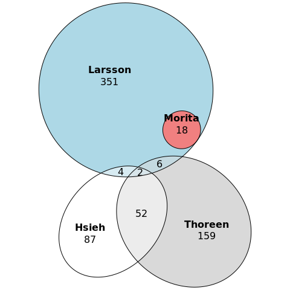
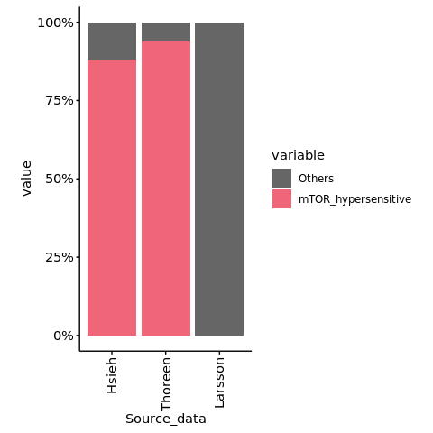
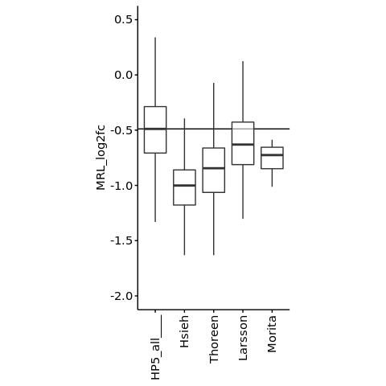
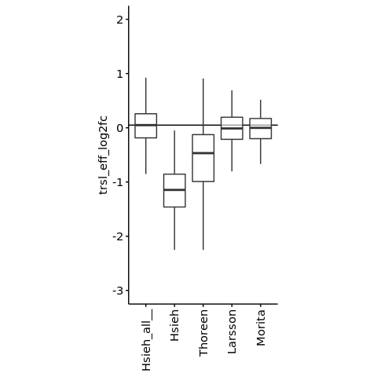
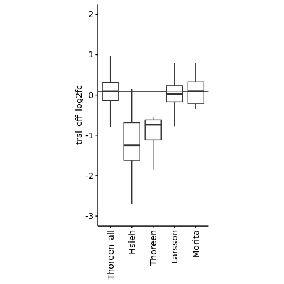
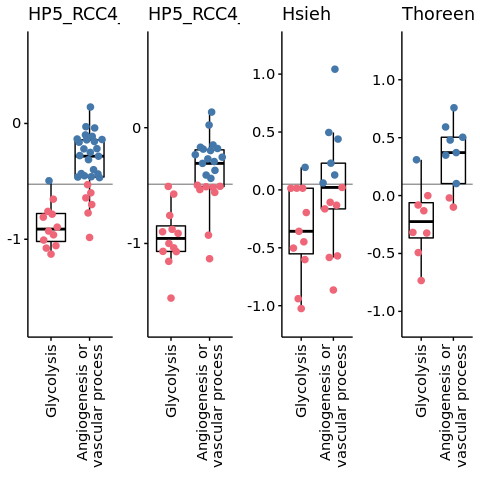

s10-3 Comparison with orthgonal methods
================
Yoichiro Sugimoto
19 May, 2022

  - [Overview](#overview)
  - [Environment setup](#environment-setup)
  - [Import the results of previous
    studies](#import-the-results-of-previous-studies)
      - [Comparison of previously reported mTOR target
        genes](#comparison-of-previously-reported-mtor-target-genes)
      - [Analysis of typical TOP genes in reported
        targets](#analysis-of-typical-top-genes-in-reported-targets)
  - [Analysis of the ability of HP5 to identify differential translation
    of previously reported
    targets](#analysis-of-the-ability-of-hp5-to-identify-differential-translation-of-previously-reported-targets)
      - [Using Hsieh et al. data as the
        base](#using-hsieh-et-al.-data-as-the-base)
      - [Using Thoreen et al. data as the
        base](#using-thoreen-et-al.-data-as-the-base)
  - [Orthogonal validation of mTOR dependency of HIF-target
    genes](#orthogonal-validation-of-mtor-dependency-of-hif-target-genes)
  - [Session information](#session-information)

# Overview

The ability of HP5 to assess translation will be evaluated compared to
orthogonal methods was analysed..

# Environment setup

``` r
temp <- sapply(list.files("../functions", full.names = TRUE), source)
temp <- sapply(list.files("./functions", full.names = TRUE), source, chdir = TRUE)

library("readxl")
library("ggbeeswarm")

processors <- 8

set.seed(0)
```

``` r
sample.file <- file.path("../../data/sample_data/processed_sample_file.csv")

annot.dir <- normalizePath(file.path("../../annotation/"))
annot.ps.dir <- file.path(annot.dir, "hg38_annotation/processed_data/")
annot.R.file <- list.files(
    annot.ps.dir,
    pattern = glob2rx("*primary_transcript_annotation*.rdata"),
    full.names = TRUE
)
load(annot.R.file)

results.dir <- file.path("../../results")

s8.dir <- file.path(results.dir, "s8-analysis-of-translation")
s8.1.dir <- file.path(s8.dir, "s8-1-differentially-translated-mRNAs")
s8.1.1.dir <- file.path(s8.1.dir, "gene-level-dte")
s8.3.dir <- file.path(s8.dir, "s8-3-validation-of-method")

s9.dir <- file.path(results.dir, "s9-integrative-analysis")

s10.dir <- file.path(results.dir, "s10-additional-analysis")

sq.dir <- file.path(results.dir, "sq-for-publication")
source.data.dir <- file.path(sq.dir, "sq1-source-data")
source.data.by.panel.dir <- file.path(source.data.dir, "by_panel")

create.dirs(c(
    s10.dir
))
```

# Import the results of previous studies

``` r
ref.dt <- file.path("../../data/others/20201127_previously_reported_mTOR_target_genes.csv") %>%
    fread
```

``` r
Hsieh.all.dt <- read_excel(
    "../../data/others/PMID27041671_SD3.xlsx", sheet = "TE"
) %>%
    data.table

Hsieh.key.cols <- c("gene_id", "trsl_eff_log2fc")
setnames(
    Hsieh.all.dt,
    old = c("Ensembl_ID", "TE_change(log2FC)"), new = Hsieh.key.cols
)

Hsieh.all.dt <- Hsieh.all.dt[, Hsieh.key.cols, with = FALSE]

## To filter data
Hsieh.all.count.dt <- read_excel(
    "../../data/others/PMID27041671_SD3.xlsx", sheet = "counts", skip = 1
) %>%
    data.table %>% {.[, 1:9]}
```

    ## New names:
    ## * `control1(mRNA)` -> `control1(mRNA)...2`
    ## * `control2(mRNA)` -> `control2(mRNA)...3`
    ## * `treat1(mRNA)` -> `treat1(mRNA)...4`
    ## * `treat2(mRNA)` -> `treat2(mRNA)...5`
    ## * `control1(RPF)` -> `control1(RPF)...6`
    ## * ...

``` r
setnames(
    Hsieh.all.count.dt,
    old = colnames(Hsieh.all.count.dt),
    new = c(
        "gene_id",
        "mRNA_control_1", "mRNA_control_2",
        "mRNA_Torin1_1", "mRNA_Torin1_2",
        "RPF_control_1", "RPF_control_2",
        "RPF_Torin1_1", "RPF_Torin1_2"
    )
)

m.Hsieh.all.count.dt <- melt(
    Hsieh.all.count.dt,
    id.vars = "gene_id",
    variable.name = "data_type",
    value.name = "count"
)

m.Hsieh.all.count.dt <- m.Hsieh.all.count.dt[
    grepl("^mRNA_", data_type)
][
  , `:=`(
        condition = str_split_fixed(data_type, "_", n = 3)[, 2],
        replicate = str_split_fixed(data_type, "_", n = 3)[, 3]
)]

gene.passed.count.th <- m.Hsieh.all.count.dt[
    count > 256
][, N := .N, by = gene_id][N == 4][!duplicated(gene_id)][, gene_id]

## Filtration performed
Hsieh.all.dt <- Hsieh.all.dt[gene_id %in% gene.passed.count.th]

Hsieh.all.dt <- merge(
    ref.dt[method == "Ribosome profiling", "gene_id", with = FALSE],
    Hsieh.all.dt,
    by = "gene_id",
    all = TRUE
)

Hsieh.all.dt[
  , translational_regulation := case_when(
        gene_id %in% ref.dt[method == "Ribosome profiling", gene_id] ~
            "Down",
        TRUE ~ "Unclassified"
    )
]
```

``` r
Thoreen.all.dt <- file.path(s8.3.dir, "Thoreen_et_al_with_human_gene_id.csv") %>%
    fread
```

``` r
ref.dt[, translational_regulation := "Down"]

Larsson.all.dt <- ref.dt[
    method == "Polysome profiling" &
    PP242_FDR < 0.15 & PP242_log2fc < -log2(1.5) #thereshold of PMID: 22611195 ("For identification of differential translation of each drug treatment to control we used a cut off of false discovery rate (FDR) < 0.15 for differential translation and an effect < −log2(1.5)")
]

Morita.all.dt <- ref.dt[mitochondrial_function == TRUE]
```

## Comparison of previously reported mTOR target genes

``` r
library("eulerr")

venn.dt <- data.table(
    gene_id = unique(
        c(
            Hsieh.all.dt[translational_regulation == "Down", gene_id],
            Thoreen.all.dt[translational_regulation == "Down", gene_id],
            Larsson.all.dt[translational_regulation == "Down", gene_id],
            Morita.all.dt[translational_regulation == "Down", gene_id]
        )
    )
)

venn.dt[, `:=`(
    Hsieh = gene_id %in%
        Hsieh.all.dt[translational_regulation == "Down", gene_id],
    Thoreen = gene_id %in%
        Thoreen.all.dt[translational_regulation == "Down", gene_id],
    Larsson = gene_id %in%
        Larsson.all.dt[translational_regulation == "Down", gene_id],
    Morita = gene_id %in%
        Morita.all.dt[translational_regulation == "Down", gene_id]
)]

plot(euler(venn.dt[
  , colnames(venn.dt)[!grepl("gene_id", colnames(venn.dt))], with = FALSE
], shape = "ellipse"), quantities = TRUE)
```

<!-- -->

``` r
venn.dt <- merge(
    primary.tx.dt[!duplicated(gene_id), .(gene_id, gene_name)],
    venn.dt,
    by = "gene_id",
    all.y = TRUE
)

fwrite(
    venn.dt,
    file = file.path(source.data.by.panel.dir, "Extended Data Fig. 4a.csv")
)

print("Sanity check: overlap between Hsieh and Larsson, reported by Larsson et al.")
```

    ## [1] "Sanity check: overlap between Hsieh and Larsson, reported by Larsson et al."

``` r
venn.dt[gene_name == "YBX1"]
```

    ##            gene_id gene_name Hsieh Thoreen Larsson Morita
    ## 1: ENSG00000065978      YBX1  TRUE   FALSE    TRUE  FALSE

## Analysis of typical TOP genes in reported targets

### Load “known” TOP mRNAs

``` r
known.top.dt <- read_excel(
    "../../data/others/PMID32094190_SD01.xlsx", col_names = FALSE
) %>%    
    data.table
```

    ## New names:
    ## * `` -> ...1

``` r
setnames(known.top.dt, "...1", "top_genes")

## Correct nomenclature
known.top.dt[, gene_name := ifelse(top_genes == "GNB2L1", "RACK1", top_genes)]

known.top.dt <- merge(
    known.top.dt,
    primary.tx.dt[!duplicated(gene_id), .(gene_name, gene_id)],
    all.x = TRUE,
    by = "gene_name"
)

print(paste0("The number of known TOP mRNA: ", nrow(known.top.dt)))
```

    ## [1] "The number of known TOP mRNA: 97"

``` r
venn.dt[, known_TOP_mRNA := gene_name %in% known.top.dt[, gene_name]]

m.venn.dt <- melt(
    venn.dt,
    id.vars = c("gene_id", "gene_name", "known_TOP_mRNA"),
    variable.name = "Source_data"
)

m.venn.dt <- m.venn.dt[value == TRUE]
```

### Import probe information for the microarray used by Larsson et al.

``` r
probe.dt <- fread("../../data/others/GPL14877_HGU133Plus2_Hs_ENTREZG_desc.txt")

probe.dt[, entrez := gsub("_at", "", get("Probe Set Name"))]

library("gprofiler2")
set_base_url("https://biit.cs.ut.ee/gprofiler_archive3/e102_eg49_p15") 

entrez2ensembl.dt <- gconvert(
    query = as.integer(probe.dt[, entrez]),
    organism = "hsapiens",
    target="ENSG", mthreshold = Inf, filter_na = TRUE,
    numeric_ns = "ENTREZGENE_ACC"
) %>%
    data.table

setnames(
    entrez2ensembl.dt,
    old = c("input", "target", "name"), new = c("entrez", "gene_id", "gene_name")
)

probe.with.id.dt <- merge(
    probe.dt,
    entrez2ensembl.dt[, c("entrez", "gene_id", "gene_name"), with = FALSE],
    by = "entrez"
)

probe.with.id.dt[, table(gene_id %in% known.top.dt[, gene_id])]
```

    ## 
    ## FALSE  TRUE 
    ## 18091    58

### Analysis of the proportion of “known” TOP mRNAs identified as mTOR hypersensitive by each study

``` r
top.hyp.ratio.dt <- m.venn.dt[, table(Source_data, known_TOP_mRNA)] %>%
    data.table %>%
    {.[known_TOP_mRNA == TRUE & Source_data != "Morita"]}

top.hyp.ratio.dt[
  , total_N := case_when(
        Source_data == "Hsieh" ~
            nrow(Hsieh.all.dt[gene_id %in% known.top.dt[, gene_id]]),
        Source_data == "Thoreen" ~
            nrow(Thoreen.all.dt[gene_id %in% known.top.dt[, gene_id]]),
        Source_data == "Larsson" ~
            nrow(probe.with.id.dt[gene_id %in% known.top.dt[, gene_id]])
    )]

top.hyp.ratio.dt
```

    ##    Source_data known_TOP_mRNA  N total_N
    ## 1:       Hsieh           TRUE 82      93
    ## 2:     Thoreen           TRUE 45      48
    ## 3:     Larsson           TRUE  0      58

``` r
top.hyp.ratio.dt[, `:=`(
    mTOR_hypersensitive = N,
    Others = total_N - N
)]

m.top.hyp.ratio.dt <- melt(
    top.hyp.ratio.dt,
    id.vars = "Source_data",
    measure.vars = c("mTOR_hypersensitive", "Others")
)

m.top.hyp.ratio.dt[, `:=`(
    Source_data = factor(Source_data, levels = c("Hsieh", "Thoreen", "Larsson")),
    variable = factor(variable, levels = c("Others", "mTOR_hypersensitive"))
)]

ggplot(
    m.top.hyp.ratio.dt,
    aes(
        x = Source_data,
        y = value,
        fill = variable
    )
) +
    geom_bar(stat = "identity", position = "fill") +
    scale_fill_manual(values = c(
                          "mTOR_hypersensitive" = "#EE6677", "Others" = "gray40"
                      )) +
    scale_x_discrete(guide = guide_axis(angle = 90)) +
    scale_y_continuous(labels = scales::percent_format(accuracy = 1)) +
    theme(aspect.ratio = 2)
```

<!-- -->

# Analysis of the ability of HP5 to identify differential translation of previously reported targets

``` r
rcc4.diff.trsl.dt <- file.path(
    s8.1.1.dir, "RCC4_VHL_EIF4E2_yy_xx__Torin1_vs_NA.csv"
) %>%
    fread

all.filtered.gene.dt <- file.path(
    s8.3.dir,
    "filtered_gene_for_polysome_analysis.csv"
) %>% fread

sl.rcc4.diff.trsl.dt <- rcc4.diff.trsl.dt[
    gene_id %in% all.filtered.gene.dt[
                     RCC4_VHL_NA == TRUE &
                     RCC4_VHL_Torin1 == TRUE,
                     gene_id
                 ]
] %>% copy %>% {.[, data_source := "HP5_all"]}
```

``` r
compareWithBase <- function(
                            base.dt,
                            base.data.source,
                            subject.dts,
                            subject.data.sources,
                            value.col,
                            yaxis.title,
                            ylim.range
                            ){

    base.dt[, data_source := base.data.source]
    
    subsetRows <- function(dt, mtor.target.dt, data.source){
        sl.dt <- dt[
            gene_id %in% mtor.target.dt[
                             translational_regulation == "Down", gene_id
                         ]
        ] %>% copy
        sl.dt[, data_source := data.source]
        return(sl.dt)
    }

    all.subjects.dt <- mapply(
        subsetRows,
        dt = list(base.dt),
        mtor.target.dt = subject.dts,
        data.source = subject.data.sources,
        SIMPLIFY = FALSE
    ) %>%
        rbindlist

    all.dt <- rbind(
        base.dt, all.subjects.dt
    )

    all.dt[
      , data_source := factor(data_source, levels = c(
                                               base.data.source,
                                               subject.data.sources
                                           ))]
    
    all.dt <- all.dt[!is.na(get(value.col))]
   
    g1 <- ggplot(
        data = all.dt,
        aes_string(
            x = "data_source",
            y = value.col
        )
    ) +
        geom_hline(
            yintercept = quantile(
                all.dt[data_source == base.data.source, get(value.col)],
                probs = c(0.5)
            ),
            linetype = c("solid")
        ) +
        geom_boxplot(fill = "white", outlier.shape = NA, alpha = 0.6) +
        scale_color_manual(values = c("gray60" = "gray60", "NA" = NA)) +
        scale_fill_manual(values = c("gray60" = "gray60", "NA" = NA)) +
        theme(
            aspect.ratio = 2,
            legend.position = "none",
            axis.title.x = element_blank()
        ) +
        scale_x_discrete(guide = guide_axis(angle = 90)) +
        coord_cartesian(ylim = ylim.range)
        ylab(yaxis.title)

    print(g1)

    print("The number of samples")
    print(all.dt[, .N, by = data_source])

    print("The statistical significance")

    all.dt %$%
        pairwise.wilcox.test(
            x = get(value.col), g = data_source, p.adjust.method = "none"
        )$p.value[, base.data.source] %>%
        p.adjust(method = "holm") %>%
        print
    
    return(all.dt)
}

hp5.vs.others.dt <- compareWithBase(
    base.dt = sl.rcc4.diff.trsl.dt,
    base.data.source = "HP5_all____",
    subject.dts = list(
        Hsieh.all.dt,
        Thoreen.all.dt,
        Larsson.all.dt,
        Morita.all.dt
    ),
    subject.data.sources = c(
        "Hsieh", "Thoreen", "Larsson", "Morita"
    ),
    value.col = "MRL_log2fc",
    yaxis.title = "MRL log2 fold change with Torin 1\n(defined by HP5 data)",
    ylim.range = c(-2, 0.5)
)
```

<!-- -->

    ## [1] "The number of samples"
    ##    data_source    N
    ## 1: HP5_all____ 9461
    ## 2:       Hsieh  134
    ## 3:     Thoreen  205
    ## 4:     Larsson  315
    ## 5:      Morita   18
    ## [1] "The statistical significance"
    ##        Hsieh      Thoreen      Larsson       Morita 
    ## 8.953303e-51 4.180839e-42 9.927490e-12 1.361096e-04

## Using Hsieh et al. data as the base

``` r
Hsieh.vs.others.dt <- compareWithBase(
    base.dt = Hsieh.all.dt,
    base.data.source = "Hsieh_all__",
    subject.dts = list(
        Hsieh.all.dt,
        Thoreen.all.dt,
        Larsson.all.dt,
        Morita.all.dt
    ),
    subject.data.sources = c(
        "Hsieh", "Thoreen", "Larsson", "Morita"
    ),
    value.col = "trsl_eff_log2fc",
    yaxis.title = "Translation efficiency log2 fold change with Torin 1\n(defined by Hsieh et al. data)",
    ylim.range = c(-3, 2)
)
```

<!-- -->

    ## [1] "The number of samples"
    ##    data_source    N
    ## 1: Hsieh_all__ 6607
    ## 2:       Hsieh  136
    ## 3:     Thoreen  185
    ## 4:     Larsson  238
    ## 5:      Morita   13
    ## [1] "The statistical significance"
    ##        Hsieh      Thoreen      Larsson       Morita 
    ## 9.726852e-78 9.195979e-41 3.160438e-02 5.268393e-01

## Using Thoreen et al. data as the base

``` r
Thoreen.vs.others.dt <- compareWithBase(
    base.dt = Thoreen.all.dt,
    base.data.source = "Thoreen_all",
    subject.dts = list(
        Hsieh.all.dt,
        Thoreen.all.dt,
        Larsson.all.dt,
        Morita.all.dt
    ),
    subject.data.sources = c(
        "Hsieh", "Thoreen", "Larsson", "Morita"
    ),
    value.col = "trsl_eff_log2fc",
    yaxis.title = "Translation efficiency log2 fold change with Torin 1\n(defined by Thoreen et al. data)",
    ylim.range = c(-3, 2)
)
```

<!-- -->

    ## [1] "The number of samples"
    ##    data_source    N
    ## 1: Thoreen_all 4528
    ## 2:       Hsieh   67
    ## 3:     Thoreen  219
    ## 4:     Larsson  193
    ## 5:      Morita    7
    ## [1] "The statistical significance"
    ##         Hsieh       Thoreen       Larsson        Morita 
    ##  4.506924e-37 8.200258e-125  1.796886e-02  9.686585e-01

# Orthogonal validation of mTOR dependency of HIF-target genes

``` r
rcc4.noVHL.diff.trsl.dt <- file.path(
    s8.1.1.dir, "RCC4_noVHL_EIF4E2_yy_xx__Torin1_vs_NA.csv"
) %>%
    fread

sl.rcc4.noVHL.diff.trsl.dt <- rcc4.noVHL.diff.trsl.dt[
    gene_id %in% all.filtered.gene.dt[
                     RCC4_noVHL_NA == TRUE &
                     RCC4_noVHL_Torin1 == TRUE,
                     gene_id
                 ]
] 
```

``` r
mtor.hif.dt <- fread(
    file.path(s9.dir, "mTOR_sensitivity_of_HIF_targets_by_class.csv")
)

mtor.hif.dt <- mtor.hif.dt[Functional_classes != "Others"]

mtor.hif.dt[
  , Functional_classes := factor(
        Functional_classes,
        levels = c("Glycolysis", "Angiogenesis or vascular process")
    )]

mtor.hif.dt <- mtor.hif.dt[order(
    Functional_classes,
    MRL_log2FC_with_Torin_1
)][, gene_name := factor(gene_name, levels = gene_name)]

mergeWithClassDt <- function(mtor.hif.dt, dt, data.source){

    if(
    (any(colnames(dt) == "MRL_log2fc")) &
     !(any(colnames(dt) == "trsl_eff_log2fc"))
    ){
        dt[, trsl_eff_log2fc := MRL_log2fc]
    } else {}

    dt[, median_trsl_eff_log2fc := median(trsl_eff_log2fc, na.rm = TRUE)]
    dt[, translational_change := case_when(
             trsl_eff_log2fc < median_trsl_eff_log2fc ~ "Downregulated",
             TRUE ~ "Presearved / Upregulated",
         )]
    
    merged.dt <- merge(
        mtor.hif.dt,
        dt[, .(gene_id, trsl_eff_log2fc, median_trsl_eff_log2fc, translational_change)],
        by = "gene_id"
    )
    merged.dt[, data_source := data.source]
    return(merged.dt)
}


all.mtor.hif.dt <- rbindlist(list(
    mergeWithClassDt(
        mtor.hif.dt, dt = sl.rcc4.noVHL.diff.trsl.dt,
        data.source = "HP5_RCC4_noVHL"
    ),
    mergeWithClassDt(
        mtor.hif.dt, dt = sl.rcc4.diff.trsl.dt,
        data.source = "HP5_RCC4_VHL"
    ),
    mergeWithClassDt(
        mtor.hif.dt, dt = Hsieh.all.dt,
        data.source = "Hsieh"
    ),
    mergeWithClassDt(
        mtor.hif.dt, dt = Thoreen.all.dt,
        data.source = "Thoreen"
    )
))

all.mtor.hif.dt[, data_source := factor(
                      data_source,
                      levels = c("HP5_RCC4_noVHL", "HP5_RCC4_VHL", "Hsieh", "Thoreen")
                  )]
```

``` r
print(all.mtor.hif.dt[, table(data_source, Functional_classes)])
```

    ##                 Functional_classes
    ## data_source      Glycolysis Angiogenesis or vascular process
    ##   HP5_RCC4_noVHL         12                               29
    ##   HP5_RCC4_VHL           12                               23
    ##   Hsieh                  11                               13
    ##   Thoreen                 8                                9

``` r
gs <- lapply(
    unique(all.mtor.hif.dt[, data_source]),
    FUN = function(x){

        med.val <- all.mtor.hif.dt[
            data_source == x
        ][!duplicated(data_source)][, median_trsl_eff_log2fc]

        g <- ggplot(
            data = all.mtor.hif.dt[data_source == x],
            aes(
                x = gsub("or", "or\n", Functional_classes),
                y = trsl_eff_log2fc,
                color = translational_change
            )
        ) +
            geom_hline(
                yintercept = med.val,
                color = "gray60"
            ) +
            geom_boxplot(
                outlier.shape = NA, fill = NA, color = "black"
            ) +
            geom_quasirandom(size = 2, varwidth = TRUE) +
            scale_x_discrete(
                guide = guide_axis(angle = 90), limits = rev
            ) +
            scale_color_manual(values = c(
                                   "Downregulated" = "#EE6677",
                                   "Presearved / Upregulated" = "#4477AA"
                               )) +
            theme(
                legend.position = "none",
                axis.title = element_blank()
            ) +
            ylab("Changes in MRL or translation with Torin 1") +
            ggtitle(x) +
            coord_cartesian(ylim = c(med.val - 1.2, med.val + 1.2))
        print(as.character(x))
        all.mtor.hif.dt[data_source == x] %$%
            pairwise.wilcox.test(
                x = trsl_eff_log2fc, g = Functional_classes
            ) %>%
            print
        return(g)
    }
)
```

    ## [1] "HP5_RCC4_noVHL"
    ## 
    ##  Pairwise comparisons using Wilcoxon rank sum exact test 
    ## 
    ## data:  trsl_eff_log2fc and Functional_classes 
    ## 
    ##                                  Glycolysis
    ## Angiogenesis or vascular process 2.3e-07   
    ## 
    ## P value adjustment method: holm 
    ## [1] "HP5_RCC4_VHL"
    ## 
    ##  Pairwise comparisons using Wilcoxon rank sum exact test 
    ## 
    ## data:  trsl_eff_log2fc and Functional_classes 
    ## 
    ##                                  Glycolysis
    ## Angiogenesis or vascular process 6.2e-06   
    ## 
    ## P value adjustment method: holm 
    ## [1] "Hsieh"
    ## 
    ##  Pairwise comparisons using Wilcoxon rank sum exact test 
    ## 
    ## data:  trsl_eff_log2fc and Functional_classes 
    ## 
    ##                                  Glycolysis
    ## Angiogenesis or vascular process 0.072     
    ## 
    ## P value adjustment method: holm 
    ## [1] "Thoreen"
    ## 
    ##  Pairwise comparisons using Wilcoxon rank sum exact test 
    ## 
    ## data:  trsl_eff_log2fc and Functional_classes 
    ## 
    ##                                  Glycolysis
    ## Angiogenesis or vascular process 0.0025    
    ## 
    ## P value adjustment method: holm

``` r
cowplot::plot_grid(plotlist = gs, nrow = 1)
```

<!-- -->

# Session information

``` r
sessionInfo()
```

    ## R version 4.0.0 (2020-04-24)
    ## Platform: x86_64-conda_cos6-linux-gnu (64-bit)
    ## Running under: CentOS Linux 7 (Core)
    ## 
    ## Matrix products: default
    ## BLAS/LAPACK: /camp/lab/ratcliffep/home/users/sugimoy/CAMP_HPC/software/miniconda3_20200606/envs/hydroxylation_by_JMJD6/lib/libopenblasp-r0.3.10.so
    ## 
    ## locale:
    ##  [1] LC_CTYPE=en_GB.UTF-8       LC_NUMERIC=C              
    ##  [3] LC_TIME=en_GB.UTF-8        LC_COLLATE=en_GB.UTF-8    
    ##  [5] LC_MONETARY=en_GB.UTF-8    LC_MESSAGES=en_GB.UTF-8   
    ##  [7] LC_PAPER=en_GB.UTF-8       LC_NAME=C                 
    ##  [9] LC_ADDRESS=C               LC_TELEPHONE=C            
    ## [11] LC_MEASUREMENT=en_GB.UTF-8 LC_IDENTIFICATION=C       
    ## 
    ## attached base packages:
    ## [1] parallel  stats     graphics  grDevices utils     datasets  methods  
    ## [8] base     
    ## 
    ## other attached packages:
    ##  [1] gprofiler2_0.1.9  eulerr_6.1.0      ggbeeswarm_0.6.0  readxl_1.3.1     
    ##  [5] knitr_1.28        stringr_1.4.0     magrittr_1.5      data.table_1.12.8
    ##  [9] dplyr_1.0.0       khroma_1.3.0      ggplot2_3.3.1     rmarkdown_2.2    
    ## 
    ## loaded via a namespace (and not attached):
    ##  [1] beeswarm_0.2.3    tidyselect_1.1.0  xfun_0.14         purrr_0.3.4      
    ##  [5] colorspace_1.4-1  vctrs_0.3.1       generics_0.0.2    htmltools_0.4.0  
    ##  [9] viridisLite_0.3.0 yaml_2.2.1        plotly_4.9.2.1    rlang_0.4.11     
    ## [13] pillar_1.4.4      glue_1.4.1        withr_2.2.0       lifecycle_0.2.0  
    ## [17] munsell_0.5.0     gtable_0.3.0      cellranger_1.1.0  htmlwidgets_1.5.1
    ## [21] evaluate_0.14     labeling_0.3      vipor_0.4.5       Rcpp_1.0.4.6     
    ## [25] scales_1.1.1      jsonlite_1.6.1    farver_2.0.3      digest_0.6.25    
    ## [29] stringi_1.4.6     polyclip_1.10-0   grid_4.0.0        cowplot_1.0.0    
    ## [33] tools_4.0.0       bitops_1.0-6      lazyeval_0.2.2    RCurl_1.98-1.2   
    ## [37] tibble_3.0.1      crayon_1.3.4      tidyr_1.1.0       pkgconfig_2.0.3  
    ## [41] ellipsis_0.3.1    polylabelr_0.2.0  httr_1.4.1        R6_2.4.1         
    ## [45] compiler_4.0.0
