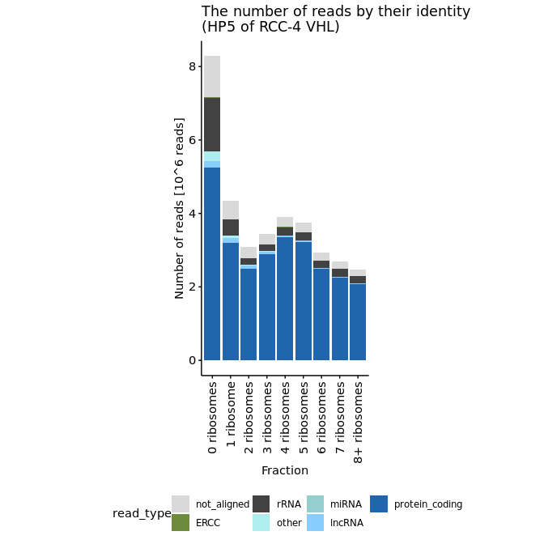

s3-1 Alignment statistics
================
Yoichiro Sugimoto
28 April, 2022

  - [Overview](#overview)
  - [Functions to extract read
    numbers](#functions-to-extract-read-numbers)
  - [Alignment statistics by the RNA
    source](#alignment-statistics-by-the-rna-source)
      - [rRNA and ERCC spike-in RNA aligned read
        counts](#rrna-and-ercc-spike-in-rna-aligned-read-counts)
      - [RNA source analysis](#rna-source-analysis)
  - [Session information](#session-information)

# Overview

The number of reads by the RNA source is analysed.

``` r
## Bioconductor packages
library("GenomicAlignments")
library("Biostrings")
library("GenomicFeatures")

## Specify the number of CPUs to be used
processors <- 8

temp <- sapply(list.files("../functions", full.names = TRUE), source)
```

``` r
sample.file <- file.path("../../data/sample_data/processed_sample_file.csv")

## Input annotation
annot.dir <- file.path("../../annotation/")

annot.ps.dir <- file.path(annot.dir, "hg38_annotation/processed_data/")
annot.R.file <- list.files(
    annot.ps.dir,
    pattern = glob2rx("*primary_transcript_annotation*.rdata"),
    full.names = TRUE
)
load(annot.R.file)

## Input files
lib2fqfilename.file <- file.path("../../data/sample_data/20210306_libname_to_fq_filename.csv")

results.dir <- file.path("../../results")

processed.fq.dir <- file.path(results.dir, "s1-processed_fastq")
processed.fq.step0.dir <- file.path(processed.fq.dir, "s1-1-Step0")
processed.fq.step4.0.dir <- file.path(processed.fq.dir, "s1-1-Step4-0")
processed.fq.step4.dir <- file.path(processed.fq.dir, "s1-1-Step4")
processed.fq.step4.2.dir <- file.path(processed.fq.dir, "s1-1-Step4-2-rRNA-ERCC")

s2.alignment.dir <- file.path(results.dir, "s2-read-alignment")
star.aligned.bam.dir <- file.path(s2.alignment.dir, "s2-1-b-star-aligned_bam")
s2.2.processed.bam.dir <-  file.path(s2.alignment.dir, "s2-2-processed-data")
s2.2.1.tss.bam.dir <- file.path(s2.2.processed.bam.dir, "s2-2-1-tss-bam")
s2.2.2.dedup.tss.bam.dir <- file.path(s2.2.processed.bam.dir, "s2-2-2-dedup-tss-bam")
s2.2.3.dedup.bam.dir <- file.path(s2.2.processed.bam.dir, "s2-2-3-dedup-bam") 
s2.2.4.gene.count.dir <- file.path(s2.2.processed.bam.dir, "s2-2-4-gene-count")
s2.2.4.1.gene.count.total.dir <- file.path(s2.2.4.gene.count.dir, "s2-2-4-1-gene-count-total")
s2.2.4.2.gene.count.dedup.dir <- file.path(s2.2.4.gene.count.dir, "s2-2-4-2-gene-count-dedup")

s3.alignment.stats.dir <- file.path(results.dir, "s3-alignment-statistics")

sq.dir <- file.path(results.dir, "sq-for-publication")
source.data.dir <- file.path(sq.dir, "sq1-source-data")

create.dirs(
    c(s3.alignment.stats.dir, sq.dir, source.data.dir)
)
```

``` r
sample.dt <- fread(sample.file)
sample.names <- sample.dt[, sample_name]

total.count.file <- file.path(s2.2.4.1.gene.count.total.dir, "total_gene_count_table.csv")
total.count.dt <- fread(total.count.file)
```

# Functions to extract read numbers

``` r
countReadsFromFq <- function(sample.name, fq.dir, use.fq.filename = FALSE){
 
    if(use.fq.filename){
        input.fq <- file.path(fq.dir, sample.name)
    } else {
        input.fq <- list.files(
            fq.dir,
            pattern = paste0(
                "(", sample.name, ".*R1.fastq.gz|",
                sample.name, ".*fastq.1.gz)"
            ),
            full.names = TRUE
        )
    }
    
    rnum <- as.integer(
            system.cat(paste("zcat", input.fq, "| echo $((`wc -l`/4))")) 
    )

    return(rnum)
}


countReadsFromTssBam <- function(sample.name, bam.dir){

    input.bam <- list.files(
        bam.dir,
        pattern = glob2rx(paste0(sample.name, "*.bam")),
        full.names = TRUE
    )

    rnum <- countBam(input.bam)$records

    return(rnum)
}
```

# Alignment statistics by the RNA source

## rRNA and ERCC spike-in RNA aligned read counts

``` r
ercc.fa.file <- file.path("../../data/ERCC_sequence/SRM2374_putative_T7_products_NoPolyA_v1.fasta.txt")

ercc.seq <- readDNAStringSet(ercc.fa.file, format = "fasta")
ercc.count.ref.dt <- data.table(
   RNA_source = c(names(ercc.seq), "rRNA_prerRNA", "others")
)
ercc.count.ref.dt <- ercc.count.ref.dt[order(RNA_source)][
    RNA_source != "080418_Consensus_Vector_Sequence_NIST_SEQUENCING_ASSEMBLY_noRestrict_rev"
]

countERCC.rRNA <- function(sample.name, processed.fq.step4.2.dir){

    ## print(sample.name)
    
    rrna.ercc.bam.file <- file.path(
        processed.fq.step4.2.dir,
        paste0(sample.name, ".sorted.bam")
    )

    rrna.ercc.bam <- readGAlignmentPairs(
        rrna.ercc.bam.file,
        param = ScanBamParam(what = "mapq"),
        use.names = TRUE
    )

    rrna.ercc.unique.dt <- rrna.ercc.bam %>%
        as.data.frame %>%
    data.table(keep.rownames = "rname")

    ## sanity check
    if(nrow(rrna.ercc.unique.dt) != nrow(rrna.ercc.unique.dt[!duplicated(rname)])){
        stop("Duplicated reads!!")
    } else {"OK"}

    rrna.ids <- unique(rrna.ercc.unique.dt[, seqnames.first]) %>%
        {.[!grepl("^ERCC-", .)]}
    
    ## For ERCC counting, only considering reads uniquly aligned
    rrna.ercc.unique.dt[, `:=`(
        counting_flag = case_when(
            seqnames.first == seqnames.last &
            grepl("^ERCC-", seqnames.first) &
            strand.first == "+" & strand.last == "-" &
            mapq.first > 5 & mapq.last > 5 ~ as.character(seqnames.first),
            strand.first == "+" & strand.last == "-" &
            seqnames.first == seqnames.last &
            seqnames.first %in% rrna.ids &
            seqnames.last %in% rrna.ids ~ "rRNA_prerRNA",
            TRUE ~ "others"
        )
    )]
        
    rrna.ercc.count.dt <- rrna.ercc.unique.dt[, .N, by = counting_flag]

    setnames(
        rrna.ercc.count.dt,
        old = c("counting_flag", "N"),
        new = c("RNA_source", sample.name)
    )
    
    return(rrna.ercc.count.dt)
}

rrna.ercc.count.dts <- mclapply(
    sample.names,
    countERCC.rRNA,
    processed.fq.step4.2.dir = processed.fq.step4.2.dir,
    mc.cores = processors
)

rrna.ercc.count.dt <- Reduce(
    function(...) merge(..., all = TRUE, by = "RNA_source"),
    c(list(ercc.count.ref.dt), rrna.ercc.count.dts)
)

setnafill(
    rrna.ercc.count.dt,
    fill = 0,
    cols = sample.names
)

ercc.count.dt <- copy(rrna.ercc.count.dt)[grepl("^ERCC-", RNA_source)]
setnames(ercc.count.dt, old = "RNA_source", new = "ERCC_id")

ercc.count.file <- file.path(
    s3.alignment.stats.dir,
    "ERCC_count_per_sample.csv"
)

fwrite(
    ercc.count.dt, file = ercc.count.file
)

file.path(
    s3.alignment.stats.dir,
    "rRNA_ERCC_count_per_sample.csv"
) %>%
    {fwrite(rrna.ercc.count.dt, file = .)}

rrna.ercc.count.dt[, simplified_RNA_source := str_split_fixed(RNA_source, "-", n = 2)[, 1]]

sum.rrna.ercc.count.dt <- rrna.ercc.count.dt[
  , lapply(.SD, sum), .SDcols = sample.names, by = simplified_RNA_source
]
```

## RNA source analysis

``` r
## Step 3: All adapter trimmed reads
all.rnums <- mclapply(
    sample.names,
    countReadsFromFq,
    fq.dir = processed.fq.step4.0.dir,
    mc.cores = processors
) %>% unlist
names(all.rnums) <- sample.names

## Step 4: All reads after rRNA removals
no.rRNA.rnums <- mclapply(
    sample.names,
    countReadsFromFq,
    fq.dir = processed.fq.step4.dir,
    mc.cores = processors
) %>% unlist
names(no.rRNA.rnums) <- sample.names

## All uniquly aligned reads
nodedup.rnums <- mclapply(
    sample.names,
    countReadsFromTssBam,
    bam.dir = s2.2.1.tss.bam.dir,
    mc.cores = processors
) %>% unlist
names(nodedup.rnums) <- sample.names

file.path(
    s3.alignment.stats.dir,
    "all-objects.Rdata"
) %>%
    {save(
         all.rnums, no.rRNA.rnums, nodedup.rnums, sum.rrna.ercc.count.dt,
         total.count.dt,
         file = .
     )}

createReadNumberDt <- function(all.rnums, no.rRNA.rnums, sum.rrna.ercc.count.dt, nodedup.rnums, count.dt, sample.dt, s3.alignment.stats.dir, out.prefix = "", dedup.flag = FALSE){

    aligned.rnums <- count.dt[, lapply(.SD, sum), .SDcols = sample.names] %>%
        unlist

    ercc.rnums <- sum.rrna.ercc.count.dt[
        simplified_RNA_source == "ERCC", sample.names, with = FALSE
    ] %>% unlist

    rrna.rnums <- sum.rrna.ercc.count.dt[
        simplified_RNA_source == "rRNA_prerRNA", sample.names, with = FALSE
    ] %>% unlist

    
    ## Sanity check
    if(
        all(names(aligned.rnums) == names(no.rRNA.rnums)) &
        all(names(no.rRNA.rnums) == names(ercc.rnums)) &
        all(names(ercc.rnums) == names(rrna.rnums))
    ){
        "OK"
    } else {stop()}

    not.aligned.rnums <- all.rnums - aligned.rnums - ercc.rnums - rrna.rnums
    
    annotated.rnums.dt <- count.dt[
      , lapply(.SD, sum), by = list(biotype), .SDcols = sample.names
    ] %>%
        melt(
            id.vars = "biotype",
            variable.name = "sample_name"
        ) %>%
        dcast(
            sample_name ~ biotype
        )

    annotated.rnums.dt <- annotated.rnums.dt[order(match(sample_name, sample.names))]

    if(all(names(aligned.rnums) == annotated.rnums.dt[, sample_name])){
        "OK"
    } else {stop()}
    
    if(dedup.flag){
        ## (TODO) Unaligned vs deduplication is not well defined here.
        stop("dedup.flag = TRUE is not currently supported")
    } else {
        annotated.rnums.dt[, `:=`(
            rRNA_prerRNA = rrna.rnums,
            ERCC = ercc.rnums,
            not_aligned = not.aligned.rnums
        )]
    }

    ## rRNA annotation from rRNA alignment and gtf annotation merged as this is confusing
    annotated.rnums.dt[, rRNA := rRNA + rRNA_prerRNA]
    annotated.rnums.dt[, rRNA_prerRNA := NULL]
    
    type.ordered <- c(
        "protein_coding", "lncRNA", "miRNA", "other",
        "duplicated", "rRNA", "ERCC", "not_aligned"
    )

    annotated.rnums.dt <- annotated.rnums.dt[, c(
        "sample_name",
        type.ordered[type.ordered %in% colnames(annotated.rnums.dt)]
    ), with = FALSE]

    for.export.annotated.rnums.dt <- copy(annotated.rnums.dt)[
      , all_read := Reduce("+", .SD),
        .SDcols = type.ordered[type.ordered %in% colnames(annotated.rnums.dt)]
    ]

    for.export.annotated.rnums.dt <- merge(
        sample.dt[, .(
            sample_name, experiment, cell, VHL, HIF1B, EIF4E2, gRNA_id, oxygen, clone, treatment, fraction, input_volume
        )],
        for.export.annotated.rnums.dt,
        by = "sample_name"
    )

    for.export.annotated.rnums.dt <- for.export.annotated.rnums.dt[
        order(match(sample_name, sample.names))
    ]

    for.export.annotated.rnums.dt[, `:=`(
        experiment = case_when(
            experiment == "polysome" ~ "HP5",
            experiment == "total" ~ "5' end-Seq"
        )
    )]
    
    file.path(
        s3.alignment.stats.dir, paste0(out.prefix, "alignment-statistics.csv")
    ) %>%
        {fwrite(
             for.export.annotated.rnums.dt[
                 !grepl("(ribo0A|ribo0B)", fraction)
             ], file = .
         )}
    
    m.annotated.rnums.dt <- melt(
        annotated.rnums.dt,
        id.vars = "sample_name",
        variable.name = "read_type",
        value = "read_count"
    )

    m.annotated.rnums.dt[, read_type := factor(read_type, levels = rev(type.ordered))]

    m.annotated.rnums.dt[, `:=`(
        experiment_type = str_split_fixed(sample_name, "_", n = 5)[, 1],
        cell = str_split_fixed(sample_name, "_", n = 5)[, 2],
        oxygen = case_when(
            grepl("^total_", sample_name) ~ str_split_fixed(sample_name, "_", n = 6)[, 5]
        ) %>%
            {factor(., levels = c("N", "H"))},
        VHL = str_split_fixed(sample_name, "_", n = 5)[, 3] %>%
            {factor(., levels = c("noVHL", "VHL"))},
        treatment = case_when(
            str_split_fixed(sample_name, "_", n = 5)[, 1] == "total" ~ NA_character_,
            TRUE ~ str_split_fixed(sample_name, "_", n = 9)[, 7]
        ),
        fraction = case_when(
            str_split_fixed(sample_name, "_", n = 5)[, 1] == "total" ~ NA_character_,
            TRUE ~ str_split_fixed(sample_name, "_", n = 9)[, 8]
        ),
        HIF1BorEIF4E2 = str_split_fixed(sample_name, "_", n = 5)[, 4],
        short_sample_name = str_split_fixed(sample_name, "_", n = 3)[, 3] %>%
            {gsub("_NA", "", .)} %>%
            {gsub("(_HIF1B|_noHIF1B|_EIF4E2|noEIF4E2)", "", .)}
    )]

    m.annotated.rnums.dt <- merge(
        sample.dt[, .(sample_name, library_ID)],
        m.annotated.rnums.dt,
        by = "sample_name"
    ) 

    ## Summarize HP5 for RCC-4 VHL stats to report
    hp5.r4vhl.m.annotated.rnums.dt <- m.annotated.rnums.dt[
        experiment_type == "polysome" &
        cell == "RCC4" &
        VHL == "VHL" &
        treatment == "NA"
    ]

    hp5.r4vhl.m.annotated.rnums.dt[
      , read_count_per_library := sum(read_count), by = sample_name
    ]

    hp5.r4vhl.m.annotated.rnums.dt[, `:=`(
        count_ratio = read_count / read_count_per_library
    )]

    print("Average number of reads for HP5 (RCC-4 VHL)")
    hp5.r4vhl.m.annotated.rnums.dt[
        read_type == "protein_coding",
        list(
            read_number =
                mean(read_count_per_library) %>%
                prettyNum(big.mark = ",",scientific = FALSE)
        )
    ] %>% print

    print("Average number of reads per fraction (RCC-4 VHL)")
    hp5.r4vhl.m.annotated.rnums.dt[
        read_type == "protein_coding",
        list(
            read_number = mean(read_count_per_library)
        ), by = fraction
    ] %T>%
        print %>%
        {.[,
        list(
            read_number =
                mean(read_number) %>%
                prettyNum(big.mark = ",",scientific = FALSE)
        )           
        ]} %>% print

    print("Proportion of reads from mRNA per fraction (RCC-4 VHL)")
    hp5.r4vhl.m.annotated.rnums.dt[
        read_type == "protein_coding",
        list(
            ratio_of_reads = mean(count_ratio)
        ), by = fraction
    ] %T>%
        print %>%
        {.[,
           list(
               read_number =
                   mean(ratio_of_reads) %>%
                   {sprintf("%1.0f%%", 100*.)}
           )           
           ]} %>% print

    print("Proportion of reads from ERCC per fraction (RCC-4 VHL)")
    hp5.r4vhl.m.annotated.rnums.dt[
        read_type == "ERCC",
        list(
            ratio_of_reads = mean(count_ratio)
        ), by = fraction
    ] %T>%
        print %>%
        {.[,
           list(
               read_number =
                   mean(ratio_of_reads) %>%
                   {sprintf("%1.2f%%", 100*.)}
           )           
           ]} %>% print

    read.type.colors <- c(
        "protein_coding" = "#2166AC",
        "lncRNA" = "skyblue1",
        "miRNA" = "paleturquoise3",
        "other" = "paleturquoise2",
        "not_annotated" = "paleturquoise1",
        "duplicated" = "papayawhip",
        "not_aligned" = "gray85",
        "rRNA" = "gray26",
        "ERCC" = "darkolivegreen4"        
    )
    
    g1 <- hp5.r4vhl.m.annotated.rnums.dt[
        ,
        list(
            read_number = mean(read_count)
        ), by = list(fraction, read_type)
    ] %>%
        ggplot(
            aes(
                x = str_extract(fraction, "[[:digit:]]") %>%
                    {case_when(
                         . == "1" ~ paste0(., " ribosome"),
                         . == "8" ~ paste0(., "+ ribosomes"),
                         TRUE ~ paste0(., " ribosomes")
                    )},
                y = read_number / 10^6,
                fill = read_type
            )
        ) +
        geom_bar(stat = "identity") +
        theme(
            axis.text.x = element_text(angle = 90, vjust = 0.5, hjust = 1),
            aspect.ratio = 2,
            legend.position = "bottom"
        ) +
        xlab("Fraction") +
        ylab("Number of reads [10^6 reads]") +
        scale_fill_manual(
            values = read.type.colors
        ) +
        ggtitle("The number of reads by their identity\n(HP5 of RCC-4 VHL)")

    print(g1)
        
    return(for.export.annotated.rnums.dt)
}

total.for.export.annotated.rnums.dt <- createReadNumberDt(
    all.rnums = all.rnums,
    no.rRNA.rnums = no.rRNA.rnums,
    sum.rrna.ercc.count.dt = sum.rrna.ercc.count.dt,
    nodedup.rnums = nodedup.rnums,
    count.dt = total.count.dt,
    sample.dt = sample.dt,
    s3.alignment.stats.dir = s3.alignment.stats.dir,
    out.prefix = "",
    dedup.flag = FALSE
)
```

    ## [1] "Average number of reads for HP5 (RCC-4 VHL)"
    ##    read_number
    ## 1:   3,490,490
    ## [1] "Average number of reads per fraction (RCC-4 VHL)"
    ##     fraction read_number
    ##  1:   ribo0A     1643093
    ##  2:   ribo0B     6642110
    ##  3:    ribo1     4348908
    ##  4:    ribo2     3086370
    ##  5:    ribo3     3437579
    ##  6:    ribo4     3912157
    ##  7:    ribo5     3744135
    ##  8:    ribo6     2927857
    ##  9:    ribo7     2685902
    ## 10:    ribo8     2476788
    ##    read_number
    ## 1:   3,490,490
    ## [1] "Proportion of reads from mRNA per fraction (RCC-4 VHL)"
    ##     fraction ratio_of_reads
    ##  1:   ribo0A      0.5753763
    ##  2:   ribo0B      0.6471005
    ##  3:    ribo1      0.7372843
    ##  4:    ribo2      0.8101363
    ##  5:    ribo3      0.8403227
    ##  6:    ribo4      0.8531309
    ##  7:    ribo5      0.8539350
    ##  8:    ribo6      0.8469202
    ##  9:    ribo7      0.8395160
    ## 10:    ribo8      0.8307743
    ##    read_number
    ## 1:         78%
    ## [1] "Proportion of reads from ERCC per fraction (RCC-4 VHL)"
    ##     fraction ratio_of_reads
    ##  1:   ribo0A   0.0004798832
    ##  2:   ribo0B   0.0009919191
    ##  3:    ribo1   0.0006356504
    ##  4:    ribo2   0.0009172954
    ##  5:    ribo3   0.0008878090
    ##  6:    ribo4   0.0008853225
    ##  7:    ribo5   0.0012026413
    ##  8:    ribo6   0.0013062497
    ##  9:    ribo7   0.0016556181
    ## 10:    ribo8   0.0013815000
    ##    read_number
    ## 1:       0.10%

<!-- -->

# Session information

``` r
sessionInfo()
```

    ## R version 4.0.0 (2020-04-24)
    ## Platform: x86_64-conda_cos6-linux-gnu (64-bit)
    ## Running under: CentOS Linux 7 (Core)
    ## 
    ## Matrix products: default
    ## BLAS/LAPACK: /camp/lab/ratcliffep/home/users/sugimoy/CAMP_HPC/software/miniconda3_20200606/envs/five_prime_seq_for_VHL_loss_v0.1.1/lib/libopenblasp-r0.3.9.so
    ## 
    ## locale:
    ##  [1] LC_CTYPE=en_GB.UTF-8       LC_NUMERIC=C              
    ##  [3] LC_TIME=en_GB.UTF-8        LC_COLLATE=en_GB.UTF-8    
    ##  [5] LC_MONETARY=en_GB.UTF-8    LC_MESSAGES=en_GB.UTF-8   
    ##  [7] LC_PAPER=en_GB.UTF-8       LC_NAME=C                 
    ##  [9] LC_ADDRESS=C               LC_TELEPHONE=C            
    ## [11] LC_MEASUREMENT=en_GB.UTF-8 LC_IDENTIFICATION=C       
    ## 
    ## attached base packages:
    ## [1] stats4    parallel  stats     graphics  grDevices utils     datasets 
    ## [8] methods   base     
    ## 
    ## other attached packages:
    ##  [1] knitr_1.28                  stringr_1.4.0              
    ##  [3] magrittr_1.5                data.table_1.12.8          
    ##  [5] dplyr_1.0.0                 khroma_1.3.0               
    ##  [7] ggplot2_3.3.1               GenomicFeatures_1.40.0     
    ##  [9] AnnotationDbi_1.50.0        GenomicAlignments_1.24.0   
    ## [11] Rsamtools_2.4.0             Biostrings_2.56.0          
    ## [13] XVector_0.28.0              SummarizedExperiment_1.18.1
    ## [15] DelayedArray_0.14.0         matrixStats_0.56.0         
    ## [17] Biobase_2.48.0              GenomicRanges_1.40.0       
    ## [19] GenomeInfoDb_1.24.0         IRanges_2.22.1             
    ## [21] S4Vectors_0.26.0            BiocGenerics_0.34.0        
    ## [23] rmarkdown_2.2              
    ## 
    ## loaded via a namespace (and not attached):
    ##  [1] httr_1.4.1             bit64_0.9-7            assertthat_0.2.1      
    ##  [4] askpass_1.1            BiocFileCache_1.12.0   blob_1.2.1            
    ##  [7] GenomeInfoDbData_1.2.3 yaml_2.2.1             progress_1.2.2        
    ## [10] pillar_1.4.4           RSQLite_2.2.0          lattice_0.20-41       
    ## [13] glue_1.4.1             digest_0.6.25          colorspace_1.4-1      
    ## [16] htmltools_0.4.0        Matrix_1.2-18          XML_3.99-0.3          
    ## [19] pkgconfig_2.0.3        biomaRt_2.44.0         zlibbioc_1.34.0       
    ## [22] purrr_0.3.4            scales_1.1.1           BiocParallel_1.22.0   
    ## [25] tibble_3.0.1           openssl_1.4.1          generics_0.0.2        
    ## [28] farver_2.0.3           ellipsis_0.3.1         withr_2.2.0           
    ## [31] crayon_1.3.4           memoise_1.1.0          evaluate_0.14         
    ## [34] tools_4.0.0            prettyunits_1.1.1      hms_0.5.3             
    ## [37] lifecycle_0.2.0        munsell_0.5.0          compiler_4.0.0        
    ## [40] rlang_0.4.6            grid_4.0.0             RCurl_1.98-1.2        
    ## [43] rappdirs_0.3.1         bitops_1.0-6           labeling_0.3          
    ## [46] gtable_0.3.0           DBI_1.1.0              curl_4.3              
    ## [49] R6_2.4.1               rtracklayer_1.48.0     bit_1.1-15.2          
    ## [52] stringi_1.4.6          Rcpp_1.0.4.6           vctrs_0.3.1           
    ## [55] dbplyr_1.4.4           tidyselect_1.1.0       xfun_0.14
