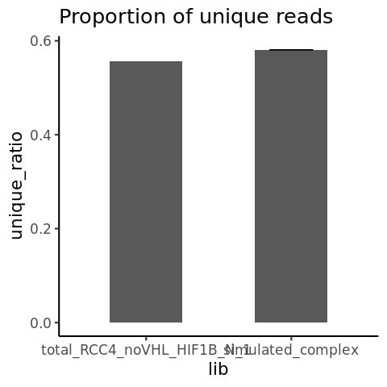

s3-2 Evaluation of UMI based deduplication
================
Yoichiro Sugimoto
22 May, 2022

  - [Overview](#overview)
  - [Set-up](#set-up)
  - [Generate simulated libraries with reduced level of read
    duplications](#generate-simulated-libraries-with-reduced-level-of-read-duplications)
  - [Deduplicate mixed sample bam
    files](#deduplicate-mixed-sample-bam-files)
  - [Comparison of the proportion of unique reads in the actual data and
    the simulated high complexity
    data](#comparison-of-the-proportion-of-unique-reads-in-the-actual-data-and-the-simulated-high-complexity-data)
  - [Session information](#session-information)

# Overview

Deduplication by UMI was not working as expected for the 5’end-Seq data
presumably because the sequence depth exceeds the diversity of UMI per
transcription start sites. To evaluate this, the proportion of reads
identified as “duplicate” will be examined in the following settings:

1.  Actual library: total\_RCC4\_noVHL\_HIF1B\_N\_1
2.  Simulated library with a reduced read duplication: A simulated
    library has the same read number as
    total\_RCC4\_noVHL\_HIF1B\_N\_1\_1 but the reads were randomly
    sampled from the following libraries:

<!-- end list -->

  - total\_RCC4\_noVHL\_HIF1B\_N\_1
  - total\_RCC4\_noVHL\_HIF1B\_N\_3
  - total\_RCC4\_noVHL\_HIF1B\_N\_4
  - total\_RCC4\_noVHL\_HIF1B\_H\_1
  - total\_RCC4\_noVHL\_HIF1B\_H\_3
  - total\_RCC4\_noVHL\_HIF1B\_H\_4

If UMI based deduplication worked as expected, the proportion of
duplicated reads in the library 1 should be larger than that of 2.
However, if the sequence depth exceeds UMI diversity, the proportion
should be similar.

# Set-up

``` r
library("GenomicAlignments")
library("rtracklayer")

## Specify the number of CPUs to be used
processors <- 6

temp <- sapply(list.files("../functions", full.names = TRUE), source)
```

``` r
sample.file <- file.path("../../data/sample_data/processed_sample_file.csv")

## Input annotation
annot.dir <- file.path("../../annotation/")
annot.ps.dir <- file.path(annot.dir, "hg38_annotation/processed_data/")
annot.R.file <- list.files(
    annot.ps.dir,
    pattern = glob2rx("*primary_transcript_annotation*.rdata"),
    full.names = TRUE
)
load(annot.R.file)

## Input files
results.dir <- file.path("../../results")

s2.alignment.dir <- file.path(results.dir, "s2-read-alignment")
s2.2.processed.bam.dir <-  file.path(s2.alignment.dir, "s2-2-processed-data")
s2.2.1.tss.bam.dir <- file.path(s2.2.processed.bam.dir, "s2-2-1-tss-bam")
s2.2.2.dedup.tss.bam.dir <- file.path(s2.2.processed.bam.dir, "s2-2-2-dedup-tss-bam")

s3.dir <- file.path(results.dir, "s3-alignment-statistics")
s3.2.dir <- file.path(s3.dir, "s3-2-dedup-evaluation")
s3.2.1.mixed.sample.bam.dir <- file.path(s3.2.dir, "s3-2-1-mixed-sample-bam")
s3.2.2.mixed.sample.dedup.dir <- file.path(s3.2.dir, "s3-2-2-mixed-sample-dedup-bam")

create.dirs(c(
    s3.dir,
    s3.2.dir,
    s3.2.1.mixed.sample.bam.dir,
    s3.2.2.mixed.sample.dedup.dir
))
```

``` r
sample.dt <- fread(sample.file)
sample.names <- sample.dt[, sample_name]
```

# Generate simulated libraries with reduced level of read duplications

``` r
r4.sample.names <- sample.names[grepl("total_RCC4_noVHL_HIF1B_(N|H)", sample.names)]

ref.r4.sample.name <- "total_RCC4_noVHL_HIF1B_N_1"

countReadsFromTssBam <- function(sample.name, bam.dir){

    input.bam <- list.files(
        bam.dir,
        pattern = glob2rx(paste0(sample.name, "*.bam$")),
        full.names = TRUE
    )

    rnum <- countBam(input.bam)$records

    return(rnum)
}


input.rnum <- countReadsFromTssBam(ref.r4.sample.name, s2.2.1.tss.bam.dir)

set.seed(1)

generateMixedSampleBam <- function(read.num, input.sample.names, input.bam.dir, s3.2.1.mixed.sample.bam.dir, mixed.sample.num = 6){

    ## mixed.sample.num: the number of randomly sampled bam files to be tested.
    
    input.bam.files <- list.files(
        input.bam.dir,
        pattern = paste0(
            "(", paste(input.sample.names, collapse = "|"), ").*\\.bam$"),
        full.names = TRUE
    )

    input.bams <- mclapply(
        input.bam.files,
        readGAlignments,
        use.names = TRUE,
        mc.cores = processors
    )

    all.bams <- Reduce(append, input.bams)

    all.bams <- sort(all.bams)
    
    for(i in 1:mixed.sample.num){
        sub.bam <- sample(all.bams, size = read.num, replace = FALSE)

        out.sub.bam.file <- file.path(
            s3.2.1.mixed.sample.bam.dir,
            paste0("mixed.sample_bam_", i, ".bam")
        )

        rtracklayer::export(sub.bam, con = out.sub.bam.file, format = "bam")
    }
    
    return()
}

temp <- generateMixedSampleBam(
    read.num = input.rnum,
    input.sample.names = r4.sample.names,
    input.bam.dir = s2.2.1.tss.bam.dir,
    s3.2.1.mixed.sample.bam.dir = s3.2.1.mixed.sample.bam.dir,
    mixed.sample.num = 10
)
```

# Deduplicate mixed sample bam files

Deduplication of mixed sample bam files will be performed here. The PCR
duplication rate should be lower than the bam files from a single
sample.

``` r
input.bams <- list.files(s3.2.1.mixed.sample.bam.dir, pattern = "bam$", full.names = TRUE)

dedupMixedSampleBam <- function(input.bam, s3.2.2.mixed.sample.dedup.dir){

    output.bam <- file.path(
        s3.2.2.mixed.sample.dedup.dir,
        gsub(".bam", ".dedup.tss.bam", basename(input.bam))
    )

    umi.dedup.cmd <- paste(
        "umi_tools",
        "dedup",
        "-I", input.bam,
        ## paste0("--output-stats=", dedup.stats.out),
        "-S", output.bam
    )

    dedup.out <- system.cat(umi.dedup.cmd)

    return(dedup.out)
}

dedup.outs <- mclapply(
    input.bams,
    dedupMixedSampleBam,
    s3.2.2.mixed.sample.dedup.dir = s3.2.2.mixed.sample.dedup.dir,
    mc.cores = processors
)
```

# Comparison of the proportion of unique reads in the actual data and the simulated high complexity data

``` r
## Reference data
input.dedup.rnum <- countReadsFromTssBam(ref.r4.sample.name, s2.2.2.dedup.tss.bam.dir)

sim.bams <- gsub(
    "\\.bam$",
    "",
    list.files(s3.2.2.mixed.sample.dedup.dir, pattern = "bam$", full.names = FALSE)
)

simulated.dedup.rnums <- mclapply(
    sim.bams,
    countReadsFromTssBam,
    bam.dir = s3.2.2.mixed.sample.dedup.dir,
    mc.cores = processors
)


input.unique.ratio <- input.dedup.rnum / input.rnum 

sim.unique.ratios <- sapply(
    simulated.dedup.rnums, "/",
    input.rnum
)

ratio.dt <- data.table(
    unique_ratio = c(input.unique.ratio, sim.unique.ratios),
    lib = c(ref.r4.sample.name, rep("simulated_complex", times = length(sim.unique.ratios)))
)

ratio.summary.dt <- data.table(
    lib = factor(c(ref.r4.sample.name, "simulated_complex"), levels = c(ref.r4.sample.name, "simulated_complex")),
    unique_ratio = c(input.unique.ratio, mean(sim.unique.ratios)),
    stdev = c(NA, sd(sim.unique.ratios))
)

ggplot(ratio.summary.dt, aes(x = lib, y = unique_ratio)) +
    geom_bar(
        width = 0.5,
        stat = "identity"
    ) +
    geom_errorbar(aes(ymin = unique_ratio - stdev, ymax = unique_ratio + stdev),
                  width = 0.3) +
    ggtitle("Proportion of unique reads") +
    expand_limits(y = 0) +
    theme_classic(16)
```

<!-- -->

# Session information

``` r
sessionInfo()
```

    ## R version 4.0.0 (2020-04-24)
    ## Platform: x86_64-conda_cos6-linux-gnu (64-bit)
    ## Running under: CentOS Linux 7 (Core)
    ## 
    ## Matrix products: default
    ## BLAS/LAPACK: /camp/lab/ratcliffep/home/users/sugimoy/CAMP_HPC/software/miniconda3_20200606/envs/five_prime_seq_for_VHL_loss_v0.1.1/lib/libopenblasp-r0.3.9.so
    ## 
    ## locale:
    ##  [1] LC_CTYPE=en_GB.UTF-8       LC_NUMERIC=C              
    ##  [3] LC_TIME=en_GB.UTF-8        LC_COLLATE=en_GB.UTF-8    
    ##  [5] LC_MONETARY=en_GB.UTF-8    LC_MESSAGES=en_GB.UTF-8   
    ##  [7] LC_PAPER=en_GB.UTF-8       LC_NAME=C                 
    ##  [9] LC_ADDRESS=C               LC_TELEPHONE=C            
    ## [11] LC_MEASUREMENT=en_GB.UTF-8 LC_IDENTIFICATION=C       
    ## 
    ## attached base packages:
    ## [1] stats4    parallel  stats     graphics  grDevices utils     datasets 
    ## [8] methods   base     
    ## 
    ## other attached packages:
    ##  [1] knitr_1.28                  stringr_1.4.0              
    ##  [3] magrittr_1.5                data.table_1.12.8          
    ##  [5] dplyr_1.0.0                 khroma_1.3.0               
    ##  [7] ggplot2_3.3.1               rtracklayer_1.48.0         
    ##  [9] GenomicAlignments_1.24.0    Rsamtools_2.4.0            
    ## [11] Biostrings_2.56.0           XVector_0.28.0             
    ## [13] SummarizedExperiment_1.18.1 DelayedArray_0.14.0        
    ## [15] matrixStats_0.56.0          Biobase_2.48.0             
    ## [17] GenomicRanges_1.40.0        GenomeInfoDb_1.24.0        
    ## [19] IRanges_2.22.1              S4Vectors_0.26.0           
    ## [21] BiocGenerics_0.34.0         rmarkdown_2.2              
    ## 
    ## loaded via a namespace (and not attached):
    ##  [1] tidyselect_1.1.0       xfun_0.14              purrr_0.3.4           
    ##  [4] lattice_0.20-41        colorspace_1.4-1       vctrs_0.3.1           
    ##  [7] generics_0.0.2         htmltools_0.4.0        yaml_2.2.1            
    ## [10] XML_3.99-0.3           rlang_0.4.6            pillar_1.4.4          
    ## [13] glue_1.4.1             withr_2.2.0            BiocParallel_1.22.0   
    ## [16] GenomeInfoDbData_1.2.3 lifecycle_0.2.0        zlibbioc_1.34.0       
    ## [19] munsell_0.5.0          gtable_0.3.0           evaluate_0.14         
    ## [22] labeling_0.3           Rcpp_1.0.4.6           scales_1.1.1          
    ## [25] farver_2.0.3           digest_0.6.25          stringi_1.4.6         
    ## [28] grid_4.0.0             tools_4.0.0            bitops_1.0-6          
    ## [31] RCurl_1.98-1.2         tibble_3.0.1           crayon_1.3.4          
    ## [34] pkgconfig_2.0.3        ellipsis_0.3.1         Matrix_1.2-18         
    ## [37] R6_2.4.1               compiler_4.0.0
