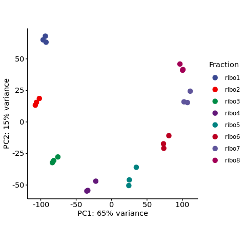
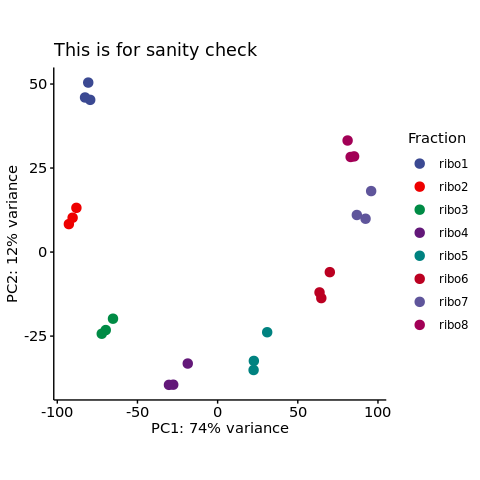

s3-3 PCA
================
Yoichiro Sugimoto
22 May, 2022

  - [Overview](#overview)
  - [PCA for HP5 of RCC-4 VHL](#pca-for-hp5-of-rcc-4-vhl)
  - [Sanity check](#sanity-check)
  - [Session information](#session-information)

# Overview

Principle component analysis will be performed to evaluate the
reproducibility of HP5.

``` r
## Bioconductor packages
library("DESeq2")

## Specify the number of CPUs to be used
processors <- 8

temp <- sapply(list.files("../functions", full.names = TRUE), source)
```

``` r
sample.file <- file.path("../../data/sample_data/processed_sample_file.csv")

## Input annotation
annot.dir <- file.path("../../annotation/")

annot.ps.dir <- file.path(annot.dir, "hg38_annotation/processed_data/")
annot.R.file <- list.files(
    annot.ps.dir,
    pattern = glob2rx("*primary_transcript_annotation*.rdata"),
    full.names = TRUE
)
load(annot.R.file)

## Input files
results.dir <- file.path("../../results")
s2.alignment.dir <- file.path(results.dir, "s2-read-alignment")
s2.2.processed.bam.dir <-  file.path(s2.alignment.dir, "s2-2-processed-data")
s2.2.4.gene.count.dir <- file.path(s2.2.processed.bam.dir, "s2-2-4-gene-count")
s2.2.4.1.gene.count.total.dir <- file.path(s2.2.4.gene.count.dir, "s2-2-4-1-gene-count-total")
s2.2.4.2.gene.count.dedup.dir <- file.path(s2.2.4.gene.count.dir, "s2-2-4-2-gene-count-dedup")
```

``` r
sample.dt <- fread(sample.file)
sample.names <- sample.dt[, sample_name]

total.count.file <- file.path(s2.2.4.1.gene.count.total.dir, "total_gene_count_table.csv")
total.count.dt <- fread(total.count.file)
```

# PCA for HP5 of RCC-4 VHL

``` r
sl.sample.names <- grep(
    "polysome_RCC4_VHL_EIF4E2_NA_[[:digit:]]_NA_ribo[[:digit:]]$",
    sample.names,
    value = TRUE
)

sl.sample.dt <- sample.dt[sample_name %in% sl.sample.names]

count.dt <- total.count.dt[biotype == "protein_coding"]
count.df <- count.dt[, sl.sample.names, with = FALSE] %>% as.data.frame
rownames(count.df) <- count.dt[, gene_id]

dds <- DESeqDataSetFromMatrix(
    countData = count.df,
    colData = sl.sample.dt,
    design = ~ 1
)
dds <- estimateSizeFactors(dds)

vsd <- vst(dds, blind = TRUE)
```

    ## -- note: fitType='parametric', but the dispersion trend was not well captured by the
    ##    function: y = a/x + b, and a local regression fit was automatically substituted.
    ##    specify fitType='local' or 'mean' to avoid this message next time.

``` r
plotPCA(vsd, intgroup = "fraction", ntop = round(nrow(assay(vsd)) / 4)) +
    theme(
        aspect.ratio = 1
    ) +
    ggsci::scale_color_aaas(name = "Fraction")
```

<!-- -->

``` r
print(paste0("The number of tx analysed: ", round(nrow(assay(vsd))/4)))
```

    ## [1] "The number of tx analysed: 4902"

# Sanity check

``` r
dds2 <- dds[matrixStats::rowMins(counts(dds)) > 0, ]

vsd2 <- vst(dds2, blind = TRUE)
```

    ## -- note: fitType='parametric', but the dispersion trend was not well captured by the
    ##    function: y = a/x + b, and a local regression fit was automatically substituted.
    ##    specify fitType='local' or 'mean' to avoid this message next time.

``` r
plotPCA(vsd2, intgroup = "fraction", ntop = round(nrow(assay(vsd2)) / 4)) +
    theme(
        aspect.ratio = 1
    ) +
    ggsci::scale_color_aaas(name = "Fraction") +
    ggtitle("This is for sanity check")
```

<!-- -->

``` r
print(paste0("The number of tx analysed (for sanity check): ", round(nrow(assay(vsd2))/4)))
```

    ## [1] "The number of tx analysed (for sanity check): 2531"

# Session information

``` r
sessionInfo()
```

    ## R version 4.0.0 (2020-04-24)
    ## Platform: x86_64-conda_cos6-linux-gnu (64-bit)
    ## Running under: CentOS Linux 7 (Core)
    ## 
    ## Matrix products: default
    ## BLAS/LAPACK: /camp/lab/ratcliffep/home/users/sugimoy/CAMP_HPC/software/miniconda3_20200606/envs/five_prime_seq_for_VHL_loss_v0.2.1/lib/libopenblasp-r0.3.10.so
    ## 
    ## locale:
    ##  [1] LC_CTYPE=en_GB.UTF-8       LC_NUMERIC=C              
    ##  [3] LC_TIME=en_GB.UTF-8        LC_COLLATE=en_GB.UTF-8    
    ##  [5] LC_MONETARY=en_GB.UTF-8    LC_MESSAGES=en_GB.UTF-8   
    ##  [7] LC_PAPER=en_GB.UTF-8       LC_NAME=C                 
    ##  [9] LC_ADDRESS=C               LC_TELEPHONE=C            
    ## [11] LC_MEASUREMENT=en_GB.UTF-8 LC_IDENTIFICATION=C       
    ## 
    ## attached base packages:
    ## [1] parallel  stats4    stats     graphics  grDevices utils     datasets 
    ## [8] methods   base     
    ## 
    ## other attached packages:
    ##  [1] knitr_1.28                  stringr_1.4.0              
    ##  [3] magrittr_1.5                data.table_1.12.8          
    ##  [5] dplyr_1.0.0                 khroma_1.3.0               
    ##  [7] ggplot2_3.3.1               DESeq2_1.28.0              
    ##  [9] SummarizedExperiment_1.18.1 DelayedArray_0.14.0        
    ## [11] matrixStats_0.56.0          Biobase_2.48.0             
    ## [13] GenomicRanges_1.40.0        GenomeInfoDb_1.24.0        
    ## [15] IRanges_2.22.1              S4Vectors_0.26.0           
    ## [17] BiocGenerics_0.34.0         rmarkdown_2.2              
    ## 
    ## loaded via a namespace (and not attached):
    ##  [1] Rcpp_1.0.4.6           locfit_1.5-9.4         lattice_0.20-41       
    ##  [4] digest_0.6.25          R6_2.4.1               RSQLite_2.2.0         
    ##  [7] evaluate_0.14          pillar_1.4.4           zlibbioc_1.34.0       
    ## [10] rlang_0.4.10           annotate_1.66.0        blob_1.2.1            
    ## [13] Matrix_1.2-18          labeling_0.3           splines_4.0.0         
    ## [16] BiocParallel_1.22.0    geneplotter_1.66.0     RCurl_1.98-1.2        
    ## [19] bit_1.1-15.2           munsell_0.5.0          compiler_4.0.0        
    ## [22] xfun_0.14              pkgconfig_2.0.3        htmltools_0.4.0       
    ## [25] tidyselect_1.1.0       tibble_3.0.1           GenomeInfoDbData_1.2.3
    ## [28] XML_3.99-0.3           crayon_1.3.4           withr_2.4.1           
    ## [31] bitops_1.0-6           grid_4.0.0             xtable_1.8-4          
    ## [34] gtable_0.3.0           lifecycle_0.2.0        DBI_1.1.0             
    ## [37] scales_1.1.1           stringi_1.4.6          farver_2.0.3          
    ## [40] XVector_0.28.0         genefilter_1.70.0      ellipsis_0.3.1        
    ## [43] vctrs_0.3.1            generics_0.0.2         ggsci_2.9             
    ## [46] RColorBrewer_1.1-2     tools_4.0.0            bit64_0.9-7           
    ## [49] glue_1.4.1             purrr_0.3.4            survival_3.1-12       
    ## [52] yaml_2.2.1             AnnotationDbi_1.50.0   colorspace_1.4-1      
    ## [55] memoise_1.1.0
