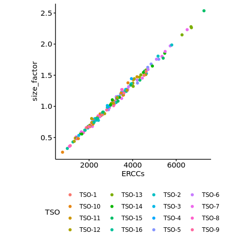
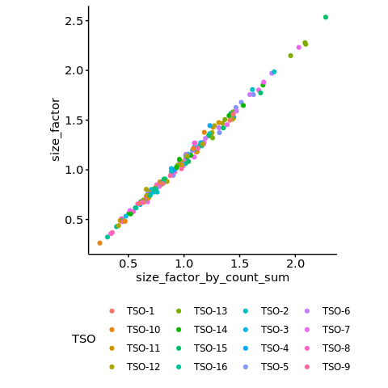
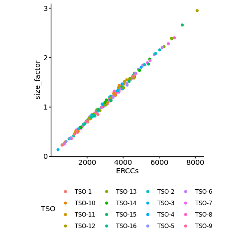
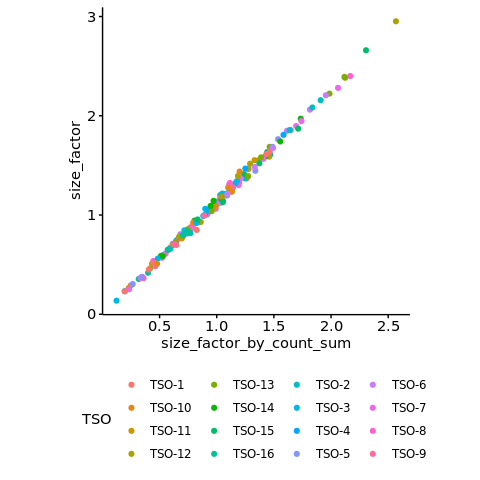

s3-4 Evaluation of ERCC control
================
Yoichiro Sugimoto
17 May, 2022

  - [Overview](#overview)
  - [Calculate sum of reads from ERCC
    RNAs](#calculate-sum-of-reads-from-ercc-rnas)
  - [Excluding ribo 0A and 0B
    fraction](#excluding-ribo-0a-and-0b-fraction)
      - [Calculate library size factor based on read counts of ERCC
        RNAs](#calculate-library-size-factor-based-on-read-counts-of-ercc-rnas)
      - [Comparison of DESeq2 calculated size factors and total read
        counts from ERCC
        RNAs](#comparison-of-deseq2-calculated-size-factors-and-total-read-counts-from-ercc-rnas)
      - [Export size factors](#export-size-factors)
  - [Including ribo 0A and 0B
    fraction](#including-ribo-0a-and-0b-fraction)
      - [Calculate library size factor based on read counts of ERCC
        RNAs](#calculate-library-size-factor-based-on-read-counts-of-ercc-rnas-1)
      - [Comparison of DESeq2 calculated size factors and total read
        counts from ERCC
        RNAs](#comparison-of-deseq2-calculated-size-factors-and-total-read-counts-from-ercc-rnas-1)
      - [Export size factors with
        ribo0](#export-size-factors-with-ribo0)
  - [Session information](#session-information)

# Overview

ERCC spike-in RNA was added to polysome fractionated samples. Library
normalization factors will be calculated based on the reads counts of
ERCC RNAs.

``` r
## Bioconductor
library("DESeq2")

## Specify the number of CPUs to be used
processors <- 8

temp <- sapply(list.files("../functions", full.names = TRUE), source)
```

``` r
sample.file <- file.path("../../data/sample_data/processed_sample_file.csv")

## Input annotation
annot.dir <- file.path("../../annotation/")

annot.ps.dir <- file.path(annot.dir, "hg38_annotation/processed_data/")
annot.R.file <- list.files(
    annot.ps.dir,
    pattern = glob2rx("*primary_transcript_annotation*.rdata"),
    full.names = TRUE
)
load(annot.R.file)

## Input files
results.dir <- file.path("../../results")
s3.alignment.stats.dir <- file.path(results.dir, "s3-alignment-statistics")
s3.4.poly.size.factor.dir <- file.path(s3.alignment.stats.dir, "polysome_size_factor")

create.dirs(c(s3.4.poly.size.factor.dir))
```

``` r
sample.dt <- fread(sample.file)
sample.names <- sample.dt[, sample_name]

ercc.count.dt <- file.path(
    s3.alignment.stats.dir,
    "ERCC_count_per_sample.csv"
) %>% fread
```

# Calculate sum of reads from ERCC RNAs

``` r
## Sample with ERCC data are selected here
sl.sample.names <- sample.dt[
    ERCC == "Yes",
    sample_name
]

m.ercc.count.dt <- melt(
    ercc.count.dt,
    id.vars = "ERCC_id",
    variable.name = "sample_name",
    value.name = "count"
)

m.ercc.count.dt[
  , seqgroup := ifelse(grepl("^ERCC", ERCC_id), "ERCCs", ERCC_id)
]

ercc.sum.count.dt <- m.ercc.count.dt[
  , .(sum_count = sum(count)), by = list(sample_name, seqgroup)
]

d.ercc.sum.count.dt <- dcast(
    ercc.sum.count.dt,
    sample_name ~ seqgroup,
    value.var = "sum_count"
)
```

# Excluding ribo 0A and 0B fraction

This is a default procedure.

## Calculate library size factor based on read counts of ERCC RNAs

``` r
non0.sl.sample.names <-
    sl.sample.names[!grepl("(ribo0A|ribo0B)", sl.sample.names)]

dds <- DESeqDataSetFromMatrix(
    countData = ercc.count.dt[
        grepl("^ERCC-", ERCC_id),
        non0.sl.sample.names,
        with = FALSE
    ],
    colData = sample.dt[
        sample_name %in% non0.sl.sample.names
    ],
    design = ~ 1
) %>%
    estimateSizeFactors

## Sanity check
all(rownames(colData(dds)) == colnames(assay(dds)))
```

    ## [1] TRUE

``` r
sizefactor.dt <- sizeFactors(dds) %>%
    data.frame %>%
    data.table(keep.rownames = TRUE)

setnames(
    sizefactor.dt,
    old = c("rn", "."),
    new = c("sample_name", "size_factor")
)

sample.count.with.sizefactor.dt <- merge(
    sample.dt,
    sizefactor.dt,
    by = "sample_name",
    all.y = TRUE
) %>%
    merge(
        y = d.ercc.sum.count.dt,
        by = "sample_name",
        all.x = TRUE
    )
```

## Comparison of DESeq2 calculated size factors and total read counts from ERCC RNAs

The analysis below indicates that the choice between using DESeq2
calculated size factors and total read counts of ERCC spike-in RNAs does
not have a significant impact on the downstream analyses. Thus, I
decided to use the DESeq2 calculated size factors.

``` r
poly.sample.count.with.sizefactor.dt <- sample.count.with.sizefactor.dt[
    grepl("^ribo", fraction)
]

ercc.total.size.factor.lm <- lm(
    ERCCs ~ size_factor,
    data = poly.sample.count.with.sizefactor.dt
)

poly.sample.count.with.sizefactor.dt[
    , residual2lm_ERCC_sizefactor := resid(ercc.total.size.factor.lm)
]

poly.sample.count.with.sizefactor.dt[, `:=`(
    size_factor_by_count_sum = ERCCs / mean(ERCCs)
)]

ggplot(
    data = poly.sample.count.with.sizefactor.dt,
    aes(
        x = ERCCs,
        y = size_factor,
        color = TSO
    )
) +
    geom_point() +
    theme(
        legend.position = "bottom",
        aspect.ratio = 1
    )
```

<!-- -->

``` r
ggplot(
    data = poly.sample.count.with.sizefactor.dt,
    aes(
        x = size_factor_by_count_sum,
        y = size_factor,
        color = TSO
    )
) +
    geom_point() +
    theme(
        legend.position = "bottom",
        aspect.ratio = 1
    )
```

<!-- -->

## Export size factors

``` r
poly.sample.count.with.sizefactor.dt[
   , .(sample_name, size_factor, size_factor_by_count_sum)
] %>%
    fwrite(
        file = file.path(
            s3.4.poly.size.factor.dir,
            "library_size_factor_by_ERCC.csv"
            )
    )
```

# Including ribo 0A and 0B fraction

## Calculate library size factor based on read counts of ERCC RNAs

``` r
dds <- DESeqDataSetFromMatrix(
    countData = ercc.count.dt[
        grepl("^ERCC-", ERCC_id),
        sl.sample.names,
        with = FALSE
    ],
    colData = sample.dt[
        sample_name %in% sl.sample.names
    ],
    design = ~ 1
) %>%
    estimateSizeFactors

## Sanity check
all(rownames(colData(dds)) == colnames(assay(dds)))
```

    ## [1] TRUE

``` r
sizefactor.dt <- sizeFactors(dds) %>%
    data.frame %>%
    data.table(keep.rownames = TRUE)

setnames(
    sizefactor.dt,
    old = c("rn", "."),
    new = c("sample_name", "size_factor")
)

sample.count.with.sizefactor.with0.dt <- merge(
    sample.dt,
    sizefactor.dt,
    by = "sample_name",
    all.y = TRUE
) %>%
    merge(
        y = d.ercc.sum.count.dt,
        by = "sample_name",
        all.x = TRUE
    )
```

## Comparison of DESeq2 calculated size factors and total read counts from ERCC RNAs

The analysis below indicates that the choice between using DESeq2
calculated size factors and total read counts of ERCC spike-in RNAs does
not have a significant impact on the downstream analyses. Thus, I
decided to use the DESeq2 calculated size factors.

``` r
poly.sample.count.with.sizefactor.with0.dt <- sample.count.with.sizefactor.with0.dt[
    grepl("^ribo", fraction)
]

poly.sample.count.with.sizefactor.with0.dt[, `:=`(
    size_factor_by_count_sum = ERCCs / mean(ERCCs)
)]

ercc.total.size.factor.lm <- lm(
    ERCCs ~ size_factor,
    data = poly.sample.count.with.sizefactor.with0.dt
)

poly.sample.count.with.sizefactor.with0.dt[
   , residual2lm_ERCC_sizefactor := resid(ercc.total.size.factor.lm)
]


ggplot(
    data = poly.sample.count.with.sizefactor.with0.dt,
    aes(
        x = ERCCs,
        y = size_factor,
        color = TSO
    )
) +
    geom_point() +
    theme(
        legend.position = "bottom",
        aspect.ratio = 1
    )
```

<!-- -->

``` r
ggplot(
    data = poly.sample.count.with.sizefactor.with0.dt,
    aes(
        x = size_factor_by_count_sum,
        y = size_factor,
        color = TSO
    )
) +
    geom_point() +
    theme(
        legend.position = "bottom",
        aspect.ratio = 1
    )
```

<!-- -->

## Export size factors with ribo0

``` r
poly.sample.count.with.sizefactor.with0.dt[
   , .(sample_name, size_factor, size_factor_by_count_sum)
] %>%
    fwrite(
        file = file.path(
            s3.4.poly.size.factor.dir,
            "library_size_factor_with_ribo0_by_ERCC.csv"
            )
    )
```

# Session information

``` r
sessionInfo()
```

    ## R version 4.0.0 (2020-04-24)
    ## Platform: x86_64-conda_cos6-linux-gnu (64-bit)
    ## Running under: CentOS Linux 7 (Core)
    ## 
    ## Matrix products: default
    ## BLAS/LAPACK: /camp/lab/ratcliffep/home/users/sugimoy/CAMP_HPC/software/miniconda3_20200606/envs/five_prime_seq_for_VHL_loss_v0.2.1/lib/libopenblasp-r0.3.10.so
    ## 
    ## locale:
    ##  [1] LC_CTYPE=en_GB.UTF-8       LC_NUMERIC=C              
    ##  [3] LC_TIME=en_GB.UTF-8        LC_COLLATE=en_GB.UTF-8    
    ##  [5] LC_MONETARY=en_GB.UTF-8    LC_MESSAGES=en_GB.UTF-8   
    ##  [7] LC_PAPER=en_GB.UTF-8       LC_NAME=C                 
    ##  [9] LC_ADDRESS=C               LC_TELEPHONE=C            
    ## [11] LC_MEASUREMENT=en_GB.UTF-8 LC_IDENTIFICATION=C       
    ## 
    ## attached base packages:
    ## [1] parallel  stats4    stats     graphics  grDevices utils     datasets 
    ## [8] methods   base     
    ## 
    ## other attached packages:
    ##  [1] knitr_1.28                  stringr_1.4.0              
    ##  [3] magrittr_1.5                data.table_1.12.8          
    ##  [5] dplyr_1.0.0                 khroma_1.3.0               
    ##  [7] ggplot2_3.3.1               DESeq2_1.28.0              
    ##  [9] SummarizedExperiment_1.18.1 DelayedArray_0.14.0        
    ## [11] matrixStats_0.56.0          Biobase_2.48.0             
    ## [13] GenomicRanges_1.40.0        GenomeInfoDb_1.24.0        
    ## [15] IRanges_2.22.1              S4Vectors_0.26.0           
    ## [17] BiocGenerics_0.34.0         rmarkdown_2.2              
    ## 
    ## loaded via a namespace (and not attached):
    ##  [1] Rcpp_1.0.4.6           locfit_1.5-9.4         lattice_0.20-41       
    ##  [4] digest_0.6.25          R6_2.4.1               RSQLite_2.2.0         
    ##  [7] evaluate_0.14          pillar_1.4.4           zlibbioc_1.34.0       
    ## [10] rlang_0.4.10           annotate_1.66.0        blob_1.2.1            
    ## [13] Matrix_1.2-18          labeling_0.3           splines_4.0.0         
    ## [16] BiocParallel_1.22.0    geneplotter_1.66.0     RCurl_1.98-1.2        
    ## [19] bit_1.1-15.2           munsell_0.5.0          compiler_4.0.0        
    ## [22] xfun_0.14              pkgconfig_2.0.3        htmltools_0.4.0       
    ## [25] tidyselect_1.1.0       tibble_3.0.1           GenomeInfoDbData_1.2.3
    ## [28] XML_3.99-0.3           crayon_1.3.4           withr_2.4.1           
    ## [31] bitops_1.0-6           grid_4.0.0             xtable_1.8-4          
    ## [34] gtable_0.3.0           lifecycle_0.2.0        DBI_1.1.0             
    ## [37] scales_1.1.1           stringi_1.4.6          farver_2.0.3          
    ## [40] XVector_0.28.0         genefilter_1.70.0      ellipsis_0.3.1        
    ## [43] vctrs_0.3.1            generics_0.0.2         RColorBrewer_1.1-2    
    ## [46] tools_4.0.0            bit64_0.9-7            glue_1.4.1            
    ## [49] purrr_0.3.4            survival_3.1-12        yaml_2.2.1            
    ## [52] AnnotationDbi_1.50.0   colorspace_1.4-1       memoise_1.1.0
