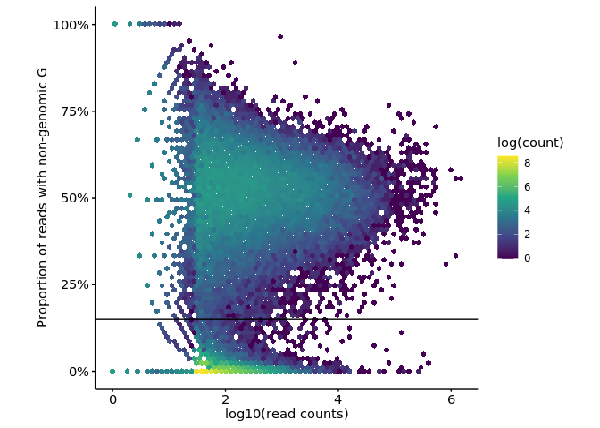
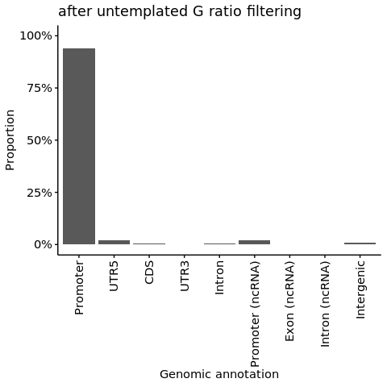
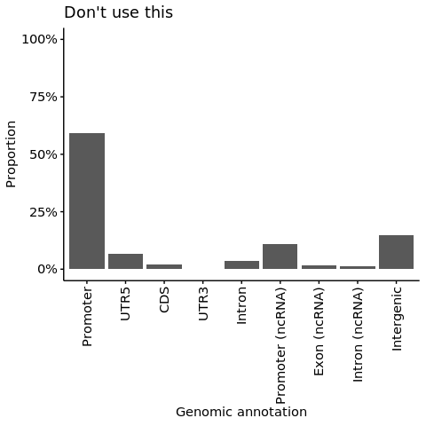
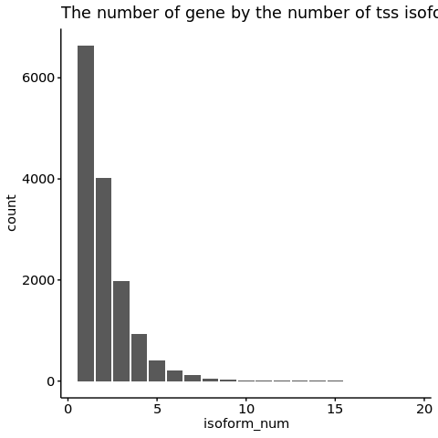
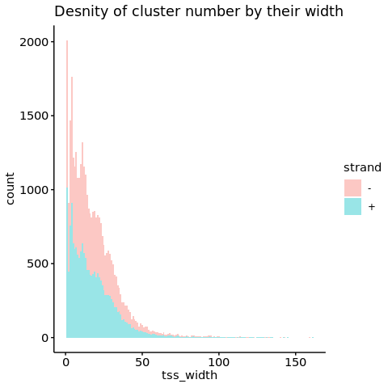

s4-1-1 Definition of TSS
================
Yoichiro Sugimoto
01 March, 2022

  - [Overview](#overview)
  - [Selecting samples used to define
    TSS](#selecting-samples-used-to-define-tss)
  - [1. Pooling of tss data per sample
    group](#pooling-of-tss-data-per-sample-group)
  - [2. Pooling of all the total 5’ end-Seq of total mRNA
    data](#pooling-of-all-the-total-5-end-seq-of-total-mrna-data)
  - [3. Definition of cluster areas](#definition-of-cluster-areas)
  - [4. Definition of TSS clusters within cluster
    areas](#definition-of-tss-clusters-within-cluster-areas)
      - [Data preparation](#data-preparation)
      - [Decomposition-based peak identification
        (DPI)](#decomposition-based-peak-identification-dpi)
      - [Define cluster boundaries](#define-cluster-boundaries)
  - [5. Quality controls and filters](#quality-controls-and-filters)
      - [Filtering by the untemplated G
        ratio](#filtering-by-the-untemplated-g-ratio)
      - [Filtering by the TSS usage](#filtering-by-the-tss-usage)
      - [Final assignment of TSS boundries and
        annotation](#final-assignment-of-tss-boundries-and-annotation)
  - [6. Define TSS ranges and width](#define-tss-ranges-and-width)
  - [Export useful data and
    functions](#export-useful-data-and-functions)
  - [Session information](#session-information)

# Overview

TSS will be defined in the following ways:

1.  Pooling of the 5’ end-Seq of total mRNA data from the following
    samples: generate pooled bedgraph file
      - RCC4, RCC4 VHL, 786-O, and 786-O VHL
2.  Pooling of all the 5’ end-Seq of total mRNA data above
3.  Definition of cluster areas
4.  Definition of TSS clusters within cluster areas
5.  Quality controls and filters
      - Filtering TSS based on the untemplated G ratio (\< 15%)
      - Filtering TSS with very low usage (\< 10% to the most used TSS)

<!-- end list -->

``` r
## Bioconductor
library("rtracklayer")
library("GenomicFeatures")
library("GenomicAlignments")
library("Rsubread")

## Specify the number of CPUs to be used
processors <- 8

temp <- sapply(list.files("../functions", full.names = TRUE), source)

analysis.variable.dt <- fread("../../data/sample_data/analysis_variables.csv")

software.paths.dt <- fread("../../data/environment/software_path.csv")
paraclu.dir <- software.paths.dt[software_name == "paraclu", path]
dpi.dir <- software.paths.dt[software_name == "dpi", path]

fantom.cage.res.dir <- file.path(
    "../../data/FANTOM/CAGE_ctss"
)

chrom.size.file <- "../../annotation/hg38_annotation/star_indices/chrNameLength.txt"
chrom.size.dt <- fread(chrom.size.file)


sample.file <- file.path("../../data/sample_data/processed_sample_file.csv")

annot.dir <- normalizePath(file.path("../../annotation/"))
annot.ps.dir <- file.path(annot.dir, "hg38_annotation/processed_data/")

all.tx.gtf <- file.path(
    annot.ps.dir,
    "all-transcript.gtf"
)

annot.ps.dir <- file.path(annot.dir, "hg38_annotation/processed_data/")
annot.R.file <- list.files(
    annot.ps.dir,
    pattern = glob2rx("*primary_transcript_annotation*.rdata"),
    full.names = TRUE
)
load(annot.R.file)

results.dir <- file.path("../../results")

## Input data
s2.alignment.dir <- file.path(results.dir, "s2-read-alignment")
## star.aligned.bam.dir <- file.path(s2.alignment.dir, "s2-1-b-star-aligned_bam")
s2.2.processed.bam.dir <-  file.path(s2.alignment.dir, "s2-2-processed-data")

tss.bam.dir <- ifelse(
    analysis.variable.dt[variable_name == "umi_dedup", selected_variable] == "dedup",
    file.path(s2.2.processed.bam.dir, "s2-2-2-dedup-tss-bam"),
    file.path(s2.2.processed.bam.dir, "s2-2-1-tss-bam")
)

tss.bam.postfix <- ifelse(
    analysis.variable.dt[variable_name == "umi_dedup", selected_variable] == "dedup",
    ".tss.dedup.tss.bam$",
    ".tss.bam$"
)

## Define output directory
s4.tss.dir <- file.path(results.dir, "s4-tss-definition-and-tx-assignment")
s4.1.tss.def.dir <- file.path(s4.tss.dir, "s4-1-tss-definition")
s4.1.temp.dir <- file.path(s4.1.tss.def.dir, "temp")
s4.1.1.pooled.tss.per.sample.dir <- file.path(s4.1.tss.def.dir, "s4-1-1-pooled-tss-per-sample")
s4.1.2.pooled.tss.dir <- file.path(s4.1.tss.def.dir, "s4-1-2-pooled-tss")
s4.1.3.paraclu.tss.dir <- file.path(s4.1.tss.def.dir, "s4-1-3-tss-by-paraclu")
s4.1.4.dpi.tss.dir <- file.path(s4.1.tss.def.dir, "s4-1-4-tss-by-dpi")
s4.1.4.0.dpi.temp.in.bed.dir <- file.path(s4.1.4.dpi.tss.dir, "temp-dpi-input-bed")
s4.1.4.1.dpi.in.bed.dir <- file.path(s4.1.4.dpi.tss.dir, "dpi-input-bed")
s4.1.4.2.dpi.out.dir <- file.path(s4.1.4.dpi.tss.dir, "dpi-output-bed")
s4.1.4.3.split.tss.dir <- file.path(s4.1.4.dpi.tss.dir, "split-tss") 
s4.1.5.tss.filtering.dir <- file.path(s4.1.tss.def.dir, "s4-1-5-tss-filtering")
s4.1.5.1.tss.bam.with.untemplated.G.dir <- file.path(s4.1.5.tss.filtering.dir, "tss-bam-with-untemplated-G")
s4.1.5.2.tss.bam.without.untemplated.G.dir <- file.path(s4.1.5.tss.filtering.dir, "tss-bam-without-untemplated-G")
s4.1.5.3.tss.table.dir <- file.path(s4.1.5.tss.filtering.dir, "tss-table")
s4.1.5.4.count.per.tss.perG.dir <- file.path(s4.1.5.tss.filtering.dir, "count-per-tss-per-G")
s4.1.6.filtered.tss.dir <- file.path(s4.1.tss.def.dir, "s4-1-6-filtered-tss")
s4.1.fantom.input.list.dir <- file.path(s4.1.tss.def.dir, "s4-1-FANTOM-CAGE-input-list")

create.dirs(c(
    s4.tss.dir,
    s4.1.tss.def.dir,
    s4.1.temp.dir,
    s4.1.1.pooled.tss.per.sample.dir,
    s4.1.2.pooled.tss.dir,
    s4.1.3.paraclu.tss.dir,
    s4.1.4.dpi.tss.dir,
    s4.1.4.0.dpi.temp.in.bed.dir,
    s4.1.4.1.dpi.in.bed.dir,
    s4.1.4.2.dpi.out.dir,
    s4.1.4.3.split.tss.dir,
    s4.1.5.tss.filtering.dir,
    s4.1.5.1.tss.bam.with.untemplated.G.dir,
    s4.1.5.2.tss.bam.without.untemplated.G.dir,
    s4.1.5.3.tss.table.dir,
    s4.1.5.4.count.per.tss.perG.dir,
    s4.1.6.filtered.tss.dir,
    s4.1.fantom.input.list.dir
))
```

# Selecting samples used to define TSS

``` r
sample.dt <- fread(sample.file)
sample.names <- sample.dt[, sample_name]

## All total and HIF1B positive 5' end-Seq data will be used

sl.sample.names <- grep("total_", sample.names, value = TRUE) %>%
    {grep("_HIF1B_", ., value = TRUE)} %>%
    {grep("_N_", ., value = TRUE)}


print("The following samples will be used for TSS definition")
```

    ## [1] "The following samples will be used for TSS definition"

``` r
print(sl.sample.names)
```

    ##  [1] "total_RCC4_VHL_HIF1B_N_1"   "total_RCC4_VHL_HIF1B_N_3"  
    ##  [3] "total_RCC4_VHL_HIF1B_N_4"   "total_RCC4_noVHL_HIF1B_N_1"
    ##  [5] "total_RCC4_noVHL_HIF1B_N_3" "total_RCC4_noVHL_HIF1B_N_4"
    ##  [7] "total_786O_VHL_HIF1B_N_1"   "total_786O_VHL_HIF1B_N_2"  
    ##  [9] "total_786O_VHL_HIF1B_N_3"   "total_786O_VHL_HIF1B_N_4"  
    ## [11] "total_786O_noVHL_HIF1B_N_1" "total_786O_noVHL_HIF1B_N_2"
    ## [13] "total_786O_noVHL_HIF1B_N_3" "total_786O_noVHL_HIF1B_N_4"

``` r
sample.groups <- unique(paste(
    str_split_fixed(sl.sample.names, "_", n = 6)[, 1], 
    str_split_fixed(sl.sample.names, "_", n = 6)[, 2],
    str_split_fixed(sl.sample.names, "_", n = 6)[, 3],
    str_split_fixed(sl.sample.names, "_", n = 6)[, 4],
    str_split_fixed(sl.sample.names, "_", n = 6)[, 5],
    sep = "_"
))
```

# 1\. Pooling of tss data per sample group

Also, split TSS bam file as a function of untemplated G

``` r
runPoolTssPerSampleGorup <- function(sample.group, tss.bam.dir, s4.1.5.1.tss.bam.with.untemplated.G.dir, s4.1.5.2.tss.bam.without.untemplated.G.dir, s4.1.5.3.tss.table.dir, processors){

    poolTssPerSampleGorup.rscript <- "./functions/poolTssPerSampleGorup.R"
    
    runPoolTssPerSampleGorup.cmd <- paste(
        "Rscript",
        poolTssPerSampleGorup.rscript,
        "--sample_group", sample.group,
        "--bam_file_dir", tss.bam.dir,
        "--with_g_output_directory", s4.1.5.1.tss.bam.with.untemplated.G.dir,
        "--without_g_output_directory", s4.1.5.2.tss.bam.without.untemplated.G.dir,
        "--tss_table_output_directory", s4.1.5.3.tss.table.dir,
        "--processors", processors
        )

    system.cat(runPoolTssPerSampleGorup.cmd)
}

temp <- lapply(
    sample.groups,
    runPoolTssPerSampleGorup,
    tss.bam.dir = tss.bam.dir,
    s4.1.5.1.tss.bam.with.untemplated.G.dir = s4.1.5.1.tss.bam.with.untemplated.G.dir,
    s4.1.5.2.tss.bam.without.untemplated.G.dir = s4.1.5.2.tss.bam.without.untemplated.G.dir,
    s4.1.5.3.tss.table.dir = s4.1.5.3.tss.table.dir,
    processors = processors
)
```

# 2\. Pooling of all the total 5’ end-Seq of total mRNA data

``` r
all.tss.dt <- lapply(
    list.files(s4.1.5.3.tss.table.dir, full.names = TRUE),
    fread
) %>% rbindlist
setkey(all.tss.dt, chr, strand, start)

all.tss.count.dt <- all.tss.dt[, .N, by = list(chr, strand, start)]
setnames(all.tss.count.dt, old = "N", new = "count")
setkey(all.tss.count.dt, chr, strand, start)

all.tss.paraclu.input.file <- file.path(
    s4.1.2.pooled.tss.dir,
    paste0("all-tss.paracluIn")
)

fwrite(all.tss.count.dt, all.tss.paraclu.input.file, sep = "\t", col.names = FALSE)

all.tss.count.dt <- fread(all.tss.paraclu.input.file)
setnames(all.tss.count.dt, old = colnames(all.tss.count.dt), new = c("Chr", "strand", "start", "score"))
```

# 3\. Definition of cluster areas

[paraclu](http://cbrc3.cbrc.jp/~martin/paraclu/) software will be used

``` r
tss.cluster.file <- file.path(
    s4.1.3.paraclu.tss.dir,
    "tss.clusters.paracluOut"
)

filtered.tss.file <- file.path(
    s4.1.3.paraclu.tss.dir,
    "tss.clusters.filtered.paracluOut"
)

filtered.paraclu.out2bed <- function(filtered.tss.file, chrom.size.file){

    tss.cluster.dt <- fread(filtered.tss.file, skip = 1)
    setnames(
        tss.cluster.dt,
        old = colnames(tss.cluster.dt),
        new = c("Chromosome", "Strand", "Start", "End", "nPos", "score", "min_density", "max_density")
    )
    tss.cluster.dt[, cluster_name := paste0("cluster_", 1:nrow(tss.cluster.dt))]

    ## ugfilter.input.cluster.file <- gsub(
    ##     ".paracluOut$", ".ugfilterIn",
    ##     filtered.tss.file
    ## ) 

    ## fwrite(tss.cluster.dt, file = ugfilter.input.cluster.file)

    ## paraclu bed file for IGV visualization
    bed.tss.cluster.dt <- tss.cluster.dt[, .(
        Chromosome,
        Start0 = Start - 1,
        End,
        name = paste0("cluster_", 1:nrow(tss.cluster.dt)),
        Score = round(1000 * score / max(score)),
        Strand
    )]

    paraclu.bed.out <- gsub(
        ".paracluOut$", ".paracluOut.bed",
        filtered.tss.file
    ) 

    fwrite(bed.tss.cluster.dt, file = paraclu.bed.out, col.names = FALSE, sep = "\t")

    bed.sort.cmd <- paste(
        "bedtools", "sort",
        "-g", chrom.size.file,
        "-i", paraclu.bed.out,
        ">", gsub(
                ".paracluOut$", ".paracluOut.sorted.bed",
                filtered.tss.file
            )
    )

    system.cat(bed.sort.cmd)

    return(tss.cluster.dt)
}

paraclu.cmd <- paste(
    file.path(paraclu.dir, "paraclu"),
    30,
    all.tss.paraclu.input.file,
    ">", 
    tss.cluster.file
)

temp <- system.cat(paraclu.cmd)

tss.filtering.cluster.cmd <- paste(
    file.path(paraclu.dir, "paraclu-cut.sh"),
    tss.cluster.file,
    ">",
    filtered.tss.file
)

temp <- system.cat(tss.filtering.cluster.cmd)

tss.cluster.dt <- filtered.paraclu.out2bed(filtered.tss.file, chrom.size.file = chrom.size.file)
```

# 4\. Definition of TSS clusters within cluster areas

[dpi](https://github.com/hkawaji/dpi1) will be used to define TSS
clusters. In order to robustly identify TSS clusters, the TSS from 5’
end-Seq data and CAGE data (from FANTOM project) will be used as the
input.

First, TSS data (from both 5’ end-Seq and FANTOM CAGE) overlapping with
paraclu identified cluster areas will be selected.

## Data preparation

Processing FANTOM CAGE data

``` r
## First process FANTOM CAGE data
paraclu.tss.bed.file <- file.path(
    s4.1.3.paraclu.tss.dir,
    "tss.clusters.filtered.paracluOut.sorted.bed"
)

paraclu.extended.tss.bed.file <- file.path(
    s4.1.3.paraclu.tss.dir,
    "tss.clusters.filtered.paracluOut.sorted.extended.bed"
)

paraclu.extend.bed.cmd <- paste(
    "bedtools", "slop",
    "-i", paraclu.tss.bed.file,
    "-g", chrom.size.file,
    "-l", 20, "-r", 20,
    "-s",
    "|",
    "bedtools", "merge",
    "-s",
    "-i", "stdin",
    "-c", "4,5,6",
    "-o", "distinct,sum,distinct",
    ">", paraclu.extended.tss.bed.file
)

temp <- system.cat(paraclu.extend.bed.cmd)


intersectFantomBed <- function(fantom.bed.file, s4.1.4.1.dpi.in.bed.dir, paraclu.extended.tss.bed.file, chrom.size.file){
    bed.intersect.cmd <- paste(
        "bedtools", "sort",
        "-g", chrom.size.file,
        "-i", fantom.bed.file,
        "|",
        "bedtools", "intersect",
        "-a", "stdin",
        "-b", paraclu.extended.tss.bed.file,
        "-u", # Write original A entry once if any overlaps found in B. In other words, just report the fact at least one overlap was found in B. Restricted by -f and -r.
        "-s",
        "|", "gzip", ">", file.path(
                              s4.1.4.1.dpi.in.bed.dir,
                              gsub(
                                  ".ctss.bed.gz", ".filtered.ctss.bed.gz",
                                  basename(fantom.bed.file)
                              ) %>%
                              {gsub("(%20|%28|%29)", "_", .)} %>% #%20 = "\s", %28, %29= (, )
                              {gsub("%3a", "__", .)} %>% # %3A = ":"
                              {gsub("%2c", "--", .)} %>% # %2c = ","
                              {gsub("%27", "", .)} %>% # %27 = "'"
                              {gsub("%2b", "_and_", .)} # %2b = "+"
                          )
    )

    system.cat(bed.intersect.cmd)

    return()
}

temp <- mclapply(
    list.files(
        file.path(fantom.cage.res.dir, "human.cell_line.hCAGE"),
        pattern = ".ctss.bed.gz$",
        full.names = TRUE
    ),
    intersectFantomBed,
    s4.1.4.1.dpi.in.bed.dir = s4.1.4.1.dpi.in.bed.dir,
    paraclu.extended.tss.bed.file = paraclu.extended.tss.bed.file,
    chrom.size.file = chrom.size.file, 
    mc.cores = processors
)

temp <- mclapply(
    list.files(
        file.path(fantom.cage.res.dir, "human.primary_cell.hCAGE"),
        pattern = ".ctss.bed.gz$",
        full.names = TRUE
    ),
    intersectFantomBed,
    s4.1.4.1.dpi.in.bed.dir = s4.1.4.1.dpi.in.bed.dir,
    paraclu.extended.tss.bed.file = paraclu.extended.tss.bed.file,
    chrom.size.file = chrom.size.file, 
    mc.cores = processors
)

temp <- mclapply(
    list.files(
        file.path(fantom.cage.res.dir, "human.tissue.hCAGE"),
        pattern = ".ctss.bed.gz$",
        full.names = TRUE
    ),
    intersectFantomBed,
    s4.1.4.1.dpi.in.bed.dir = s4.1.4.1.dpi.in.bed.dir,
    paraclu.extended.tss.bed.file = paraclu.extended.tss.bed.file,
    chrom.size.file = chrom.size.file, 
    mc.cores = processors
)

file.path(
    fantom.cage.res.dir,
    c("human.cell_line.hCAGE", "human.primary_cell.hCAGE", "human.tissue.hCAGE")
) %>%
    lapply(
        list.files,
        pattern = "\\.ctss\\.bed\\.gz$"
    ) %>% unlist %>%
    {data.table(FANTOM_CAGE_file_name = .)} %>%
    fwrite(file = file.path(
               s4.1.fantom.input.list.dir,
               "list-of-FANTOM-CAGE-data-used.csv"
           ))
```

Processing 5’ end-Seq data

``` r
bed2ctss <- function(sample.name, tss.bam.dir, s4.1.4.0.dpi.temp.in.bed.dir){

    readTssBam <- function(bam.file){

        param <- ScanBamParam(
            flag = scanBamFlag(isSecondaryAlignment = FALSE),
            what = c("flag"),
            tag = c("XG") # this tag will define reads containing untemplated G
        ) # uniquely mapped
        bam <- readGAlignments(bam.file, use.names = TRUE, param = param)
        
        bam.dt <- as.data.table(bam)
        bam.dt <- bam.dt[, .(seqnames, strand, start)]
        setnames(bam.dt, old = "seqnames", new = "chr")
        setkey(bam.dt, chr, strand, start)
        return(bam.dt)
    }

    tss.dt <- file.path(tss.bam.dir, paste0(sample.name, gsub("\\$$", "", tss.bam.postfix))) %>%
        {readTssBam(.)} %>%
        {.[, .N, by = list(chr, strand, start)]}
    setnames(tss.dt, old = "N", new = "count")
    tss.dt <- tss.dt[!duplicated(paste(chr, "-", start, "-", strand))]
    
    ## This is essential to output begraph
    options(scipen = 20)
    file.path(s4.1.4.0.dpi.temp.in.bed.dir , paste0(sample.name, ".ctss.bed.gz")) %>%
        {fwrite(
             tss.dt[, list(
                 chr, start - 1, start,
                 paste0(chr, ":", start - 1, "..", start, ",", strand),
                 count,
                 strand
                 )][order(chr, strand == "-", start)],
             file = .,
             sep = "\t", col.names = FALSE
        )}
    return()
}


temp <- mclapply(
    sl.sample.names,
    bed2ctss,
    tss.bam.dir = tss.bam.dir,
    s4.1.4.0.dpi.temp.in.bed.dir  = s4.1.4.0.dpi.temp.in.bed.dir ,
    mc.cores = processors
)

temp <- mclapply(
    list.files(
        s4.1.4.0.dpi.temp.in.bed.dir,
        pattern = ".ctss.bed.gz$",
        full.names = TRUE
    ),
    intersectFantomBed,
    s4.1.4.1.dpi.in.bed.dir = s4.1.4.1.dpi.in.bed.dir,
    paraclu.extended.tss.bed.file = paraclu.extended.tss.bed.file,
    chrom.size.file = chrom.size.file,
    mc.cores = processors
)
```

## Decomposition-based peak identification (DPI)

The original script was modified to be able to run on slurm.

``` r
dpi.cmd <- paste(
    file.path(dpi.dir, "identify_tss_peaks_for_slurm_v2.sh"),
    "-g", normalizePath(chrom.size.file),
    "-i", paste0("'", file.path(s4.1.4.1.dpi.in.bed.dir, "*.ctss.bed.gz"), "'"),
    "-d", "y",
    "-o", s4.1.4.2.dpi.out.dir
)
temp <- system.cat(dpi.cmd)
```

## Define cluster boundaries

``` r
## Development
## paraclu.tss.bed.file <- file.path(
##     s4.1.3.paraclu.tss.dir,
##     "tss.clusters.filtered.paracluOut.sorted.bed"
## )
 
paraclu.tss.dt <- fread(paraclu.tss.bed.file)

dpi.tss.dt <- file.path(
    s4.1.4.2.dpi.out.dir,
    "outPooled/tc.decompose_smoothing_merged.ctssMaxCounts11_ctssMaxTpm1.bed.gz" # dpi peak from 'robust' threshold
) %>% {fread(cmd = paste("zcat", .))}


temp.ref.bed.file <- file.path(
    s4.1.4.3.split.tss.dir,
    "temp-paraclu-dpi-TSS-merged.bed"
)

rbind(
    paraclu.tss.dt,
    dpi.tss.dt[, 1:6, with = FALSE]
) %>%
    fwrite(
        file = temp.ref.bed.file,
        sep = "\t",
        col.names = FALSE
    )

ref.bed.file <- file.path(
    s4.1.4.3.split.tss.dir,
    "paraclu-dpi-TSS-merged.bed"
)

temp <- paste(
    "bedtools", "sort",
    "-g", chrom.size.file,
    "-i", temp.ref.bed.file,
    "|",
    "bedtools", "merge",
    "-s",
    "-i", "stdin",
    "-c", "4,5,6",
    "-o", "distinct,sum,distinct",
    ">", ref.bed.file
) %>% system.cat

## Preprocess dpi file
setnames(
    dpi.tss.dt,
    old = paste0("V", 1:6),
    new = paste0("dpi_", c("chr", "start", "end", "cluster", "score", "strand"))
)

dpi.tss.dt[, dpi_start := dpi_start + 1] # Since bed file's start is 0-base


splitRefTssByDpiTss <- function(ref.bed.file, dpi.tss.dt, only.ol = FALSE, s4.1.4.3.split.tss.dir, out.filename.core){
    ref.tss.range.dt <- fread(ref.bed.file) 

    setnames(
        ref.tss.range.dt,
        old = paste0("V", 1:6),
        new = c(paste0("paraclu_", c("chr", "start", "end", "cluster", "score", "strand")))
    )

    ref.tss.range.dt[, paraclu_start := paraclu_start + 1] # Since bed file's start is 0-base

    ref.tss.range.gr <- makeGRangesFromDataFrame(
        ref.tss.range.dt,
        seqnames.field = "paraclu_chr",
        start.field = "paraclu_start", end.field = "paraclu_end",
        strand.field = "paraclu_strand"
    )

    dpi.tss.dt <- dpi.tss.dt[order(dpi_chr, dpi_strand, dpi_start)]
    
    dpi.tss.gr <- makeGRangesFromDataFrame(
        dpi.tss.dt,
        seqnames.field = "dpi_chr",
        start.field = "dpi_start", end.field = "dpi_end",
        strand.field = "dpi_strand"
    )

    ol.dt <- findOverlaps(
        query = dpi.tss.gr,
        subject = ref.tss.range.gr,
        type = "within" #  If type is within, the query interval must be wholly contained within the subject interval.
    ) %>%
        as.data.frame %>%
    data.table

    paraclu.dpi.dt <- cbind(
        ref.tss.range.dt[ol.dt[, subjectHits]],
        dpi.tss.dt[ol.dt[, queryHits]]
    ) %>%
        {.[order(
             paraclu_cluster, paraclu_start
         )]}

    paraclu.nondpi.dt <- ref.tss.range.dt[
        !(1:nrow(ref.tss.range.dt) %in% ol.dt[, subjectHits])
    ]

    ## Sanity check
    if(nrow(paraclu.dpi.dt[!duplicated(paraclu_cluster)]) + nrow(paraclu.nondpi.dt) !=
       nrow(ref.tss.range.dt)){
        stop("")
    } else {"OK"}

    ## This is for development
    ## paraclu.dpi.dt <- data.table(
    ##     paraclu_cluster = rep(c("cluster_1", "cluster_2"), each = 3),
    ##     paraclu_strand = rep(c("+", "-"), each = 3),
    ##     paraclu_start = 20,
    ##     paraclu_end = 100,
    ##     dpi_start = c(40, 60, 90, 40, 60, 90),
    ##     dpi_end = c(51, 80, 95, 51, 80, 95)
    ## )

    ## Split paraclu TSS according to dpi
    paraclu.dpi.dt[, `:=`(
        start =
            ceiling(
            (
                ifelse(paraclu_strand == "+", 0.1, 0) +
                dpi_start + data.table::shift(dpi_end, n = 1, type = "lag")) / 2
            ),
        end =
            floor(
                ifelse(paraclu_strand == "+", 0, -0.1) +
                (dpi_end + data.table::shift(dpi_start, n = 1, type = "lead")) / 2
            )
    ), by = paraclu_cluster] %>%
        {.[, `:=`(
             start = ifelse(is.na(start), paraclu_start, start),
             end = ifelse(is.na(end), paraclu_end,end)
         )]}

    core.cols <- c("chr", "start", "end", "strand")

    setnames(
        paraclu.dpi.dt,
        old = c("paraclu_chr", "paraclu_strand"),
        new = c("chr", "strand")
    )

    setnames(
        paraclu.nondpi.dt,
        old = paste0("paraclu_", core.cols),
        new = core.cols
    )

    if(only.ol == TRUE){
        temp.dt <- paraclu.dpi.dt[, core.cols, with = FALSE]
    } else {
        temp.dt <- rbind(
            paraclu.dpi.dt[, core.cols, with = FALSE],
            paraclu.nondpi.dt[, core.cols, with = FALSE]            
        )
    }
    
    all.tss.dt <- temp.dt%>%
        {.[, chr := factor(chr, levels = chrom.size.dt[, V1])]} %>%
        {.[order(chr, strand != "+", start)]} %>%
        {.[, `:=`(
             all_TSS_index = paste0("all_TSS_", 1:.N),
             score = 1000
         )]} %>%
        {.[, .(chr, start, end, all_TSS_index, score, strand)]}

    all.tss.bed.file <- file.path(
        s4.1.4.3.split.tss.dir,
        paste0(out.filename.core, ".bed.gz")
    )

    all.tss.bed.dt <- copy(all.tss.dt)

    all.tss.bed.dt[, start := start - 1] %>%
        {fwrite(
             .,
             file = all.tss.bed.file,
             sep = "\t",
             col.names = FALSE
         )}

    fwrite(
        all.tss.dt,
        file.path(s4.1.4.3.split.tss.dir, paste0(out.filename.core, ".csv.gz"))
    )

    return()
}

temp <- splitRefTssByDpiTss(
    ref.bed.file = ref.bed.file,
    dpi.tss.dt = dpi.tss.dt,
    only.ol = FALSE,
    s4.1.4.3.split.tss.dir = s4.1.4.3.split.tss.dir,
    out.filename.core = "all.tss.without.filter"
)
```

# 5\. Quality controls and filters

## Filtering by the untemplated G ratio

Note that genes in chrM won’t be filtered by G ratio as mitchodrial
mRNAs does not have a conventional cap.

``` r
all.tss.dt <- file.path(
    s4.1.4.3.split.tss.dir, "all.tss.without.filter.csv.gz"
) %>%
    fread

all.tss.dt[, chr := factor(chr, levels = chrom.size.dt[, V1])]
all.tss.dt <- all.tss.dt[order(chr, strand != "+", start)]

all.tss.dt[, `:=`(
    dpi_TSS_index = paste0("dpi_tss_", 1:.N) %>% {factor(., levels = .)}
)] # Since bed file's start is 0-base
all.tss.dt <- all.tss.dt[, c("chr", "start", "end", "strand", "dpi_TSS_index"), with = FALSE]

dpi.tss.gr <- sort(makeGRangesFromDataFrame(all.tss.dt, keep.extra.columns = TRUE))

count.per.tss.with.G.file <- file.path(
    s4.1.5.4.count.per.tss.perG.dir,
    "cluster_per_count_with_untemplated_G.csv"
)

count.per.tss.with.G.dt <- countPerRangeFromBams(
    input.bam.files = list.files(
        s4.1.5.1.tss.bam.with.untemplated.G.dir,
        ".bam$",
        full.names = TRUE
    ),
    gr = dpi.tss.gr,
    out.file.name = count.per.tss.with.G.file,
    sample.names = sl.sample.names,
    processors = processors,
    range.name = "dpi_TSS_index",
    bam.file.prefix = tss.bam.postfix
)

count.per.tss.without.G.file <- file.path(
    s4.1.5.4.count.per.tss.perG.dir,
    "cluster_per_count_without_untemplated_G.csv"
)

count.per.tss.without.G.dt <- countPerRangeFromBams(
    input.bam.files = list.files(
        s4.1.5.2.tss.bam.without.untemplated.G.dir,
        ".bam$",
        full.names = TRUE
    ),
    gr = dpi.tss.gr,
    out.file.name = count.per.tss.without.G.file,
    sample.names = sl.sample.names,
    processors = processors,
    range.name = "dpi_TSS_index",
    bam.file.prefix = tss.bam.postfix
)
```

``` r
count.per.tss.with.G.dt <- fread(count.per.tss.with.G.file)
count.per.tss.without.G.dt <- fread(count.per.tss.without.G.file)

count.per.tss.with.G.dt[, withG_sum := rowSums(.SD), .SDcols = sl.sample.names]
count.per.tss.without.G.dt[, withoutG_sum := rowSums(.SD), .SDcols = sl.sample.names]

untemplated.G.sum.dt <- merge(
    count.per.tss.with.G.dt[, .(dpi_TSS_index, withG_sum)],
    count.per.tss.without.G.dt[, .(dpi_TSS_index, withoutG_sum)],
    by = "dpi_TSS_index"
)

untemplated.G.sum.dt[, `:=`(
    total_count = withG_sum + withoutG_sum,
    untemplated_G_ratio = withG_sum / (withG_sum + withoutG_sum)
)]

G.ratio.cutoff <- 0.15

ggplot(untemplated.G.sum.dt[complete.cases(untemplated.G.sum.dt)]) +
    geom_hex(
        aes(x = log10(total_count),
            y = untemplated_G_ratio,
            fill = stat(log(count))
            ), bins = 70) +
    geom_hline(yintercept = G.ratio.cutoff) +
    scale_y_continuous(labels = scales::percent_format(accuracy = 1)) +
    scale_fill_continuous(type = "viridis") +
    theme(aspect.ratio = 1) +
    ylab("Proportion of reads with non-genomic G") +
    xlab("log10(read counts)")
```

<!-- -->

``` r
G.filtered.tss.dt <- merge(
    all.tss.dt, untemplated.G.sum.dt,
    by = "dpi_TSS_index"
) %>%
    {.[
         untemplated_G_ratio > G.ratio.cutoff |
         chr == "chrM"
     ]} %>%
    {.[, dpi_TSS_index := factor(
             dpi_TSS_index,
             levels =
                 paste0(
                     "dpi_tss_",
                     1:nrow(all.tss.dt)
                 )
         )][order(dpi_TSS_index)]}
```

## Filtering by the TSS usage

### Annotation preprocessing

``` r
all.primary.tx.dt <- file.path(
    annot.ps.dir,
    "all_GENCODE_RefSeq_transcript_info.csv"
) %>% fread

all.primary.tx.gr <- rtracklayer::import(all.tx.gtf)

all.primary.tx.gr <- all.primary.tx.gr[(
    mcols(all.primary.tx.gr)[, "transcript_id"] %in%
    all.primary.tx.dt[fusion_gene_flag == FALSE | chromosome_name == "chrM", transcript_id]
)]

primary.txdb <- makeTxDbFromGRanges(all.primary.tx.gr)
```

    ## Warning in .get_cds_IDX(mcols0$type, mcols0$phase): The "phase" metadata column contains non-NA values for features of type
    ##   stop_codon. This information was ignored.

    ## Warning in .find_exon_cds(exons, cds): The following transcripts have exons that contain more than one CDS
    ##   (only the first CDS was kept for each exon): NM_001134939.1,
    ##   NM_001301020.1, NM_001301302.1, NM_001301371.1, NM_002537.3,
    ##   NM_004152.3, NM_016178.2

``` r
txid2biotype <- setNames(
    all.primary.tx.dt[, biotype],
    nm = all.primary.tx.dt[, transcript_id]
)

txid2txlen <- setNames(
    all.primary.tx.dt[, tx_len],
    nm = all.primary.tx.dt[, transcript_id]
)

extractGrWithAnnotation <- function(exp.pc.gr, annot.type.e, txid2txlen){

    exp.pc.dj.gr <- disjoin(exp.pc.gr)
    exp.pc.dj.dt <- data.table(as.data.frame(exp.pc.dj.gr))
    ol.dt <- data.table(as.data.frame(findOverlaps(exp.pc.dj.gr, exp.pc.gr)))

    exp.pc.dj.dt[, `:=`(
        annot = annot.type.e
    )]

    exp.pc.dj.dt <- exp.pc.dj.dt[ol.dt[, queryHits]]

    exp.pc.dj.dt[, transcript_id := mcols(exp.pc.gr)[, "tx_name"][ol.dt[, subjectHits]]]
    exp.pc.dj.dt[, tx_len := txid2txlen[transcript_id]]

    exp.pc.dj.dt <- exp.pc.dj.dt[order(transcript_id, -tx_len)]

    exp.pc.dj.dt <- exp.pc.dj.dt[!duplicated(paste(seqnames, start, end, sep = "-"))]

    exp.pc.dj.gr <- makeGRangesFromDataFrame(exp.pc.dj.dt, keep.extra.columns = TRUE)

    exp.pc.dj.gr <- sort(exp.pc.dj.gr)
    
    return(exp.pc.dj.gr)
}

setdiffWithAnnotation <- function(nc.gr, pc.gr){

    exp.nc.gr <- disjoin(nc.gr)
    
    nred.nc.gr <- setdiff(exp.nc.gr, pc.gr)
    nred.nc.dt <- data.table(as.data.frame(nred.nc.gr))

    ol.dt <- data.table(as.data.frame(findOverlaps(nred.nc.gr, nc.gr)))

    nred.nc.dt <- nred.nc.dt[ol.dt[, queryHits]]

    nred.nc.dt <- cbind(
        nred.nc.dt,
        data.table(as.data.frame(
            mcols(nc.gr[ol.dt[, subjectHits]])
        ))
    )

    nred.nc.dt <- nred.nc.dt[order(transcript_id, -tx_len)]
    nred.nc.dt <- nred.nc.dt[!duplicated(paste(seqnames, start, end, sep = "-"))]

    nred.nc.gr <- makeGRangesFromDataFrame(nred.nc.dt, keep.extra.columns = TRUE)

    nred.nc.gr <- sort(nred.nc.gr)
    
    return(nred.nc.gr)

}

splitGr2NcAndPc <- function(gr, txid2biotype, txid2txlen, annot.type, pc.prefix.flag = TRUE){

    tx.name.DF <- mcols(gr)[, "tx_name"]
    tx.name.DF.len <- sapply(tx.name.DF, length)

    exp.gr <- gr[rep(1:length(gr), times = tx.name.DF.len)]
    mcols(exp.gr)["tx_name"] <- unlist(mcols(gr)[, "tx_name"])
    mcols(exp.gr)["biotype"] <- txid2biotype[mcols(exp.gr)[, "tx_name"]]

    exp.pc.gr <- exp.gr[mcols(exp.gr)[, "biotype"] %in% "protein_coding"]
    exp.nc.gr <- exp.gr[!(mcols(exp.gr)[, "biotype"] %in% "protein_coding")]
    
    pc.gr <- extractGrWithAnnotation(exp.pc.gr, ifelse(pc.prefix.flag, paste0("pc_", annot.type), annot.type), txid2txlen)
    nc.gr <- extractGrWithAnnotation(exp.nc.gr, annot.type.e <- paste0("nc_", annot.type), txid2txlen)

    nc.exons <- setdiffWithAnnotation(nc.gr, pc.gr)

    return(list(pc = pc.gr, nc = nc.exons))
}

grl2grWithTxid <- function(grl, txid2biotype, pc.flag = TRUE){

    if(pc.flag){
        grl <- grl[names(grl) %in% names(txid2biotype[txid2biotype == "protein_coding"])]
    } else {
        grl <- grl[names(grl) %in% names(txid2biotype[txid2biotype != "protein_coding"])]
    }
    
    gr <- unlist(grl, use.names = TRUE)
    mcols(gr)$tx_name <- names(gr)
    mcols(gr)$biotype <- txid2biotype[mcols(gr)[, "tx_name"]]

    return(gr)
    
}

## Define promorters
primary.promoters <- promoters(primary.txdb, upstream = 50, downstream = 50, columns=c("tx_name"))
primary.promoter.list <- splitGr2NcAndPc(primary.promoters, txid2biotype, txid2txlen, annot.type = "promoter", pc.prefix.flag = FALSE)

pc.primary.promoters <- primary.promoter.list[["pc"]]
nc.primary.promoters <- primary.promoter.list[["nc"]]

## Define UTR5
grl.5utr <- fiveUTRsByTranscript(primary.txdb, use.names = TRUE)
primary.5utr <- grl2grWithTxid(grl.5utr, txid2biotype)
primary.5utr <- extractGrWithAnnotation(primary.5utr, "UTR5", txid2txlen)

primary.5utr <- setdiffWithAnnotation(
    primary.5utr, Reduce(union, list(pc.primary.promoters, nc.primary.promoters))
)

## Define CDS
primary.cds <- cds(primary.txdb, columns=c("tx_name"))
primary.cds <- splitGr2NcAndPc(primary.cds, txid2biotype, txid2txlen, annot.type = "CDS", pc.prefix.flag = FALSE)[["pc"]]

primary.cds <- setdiffWithAnnotation(
    primary.cds,
    Reduce(union, list(pc.primary.promoters, nc.primary.promoters, primary.5utr))
)


## Define UTR3
grl.3utr <- threeUTRsByTranscript(primary.txdb, use.names = TRUE)
primary.3utr <- grl2grWithTxid(grl.3utr, txid2biotype)
primary.3utr <- extractGrWithAnnotation(primary.3utr, "UTR3", txid2txlen)

primary.3utr <- setdiffWithAnnotation(
    primary.3utr, Reduce(union, list(pc.primary.promoters, nc.primary.promoters, primary.5utr, primary.cds))
)


## Define nc_exon
primary.exons <- exons(primary.txdb, columns=c("tx_name"))
primary.nc.exons <- splitGr2NcAndPc(primary.exons, txid2biotype, txid2txlen, annot.type = "exon")[["nc"]]
primary.nc.exons <- setdiffWithAnnotation(
    primary.nc.exons,
    Reduce(union, list(pc.primary.promoters, nc.primary.promoters, primary.5utr, primary.cds, primary.3utr))
)


## Define intron
grl.intron <- intronsByTranscript(primary.txdb, use.names = TRUE)

pc.intron <- grl2grWithTxid(grl.intron, txid2biotype)
nc.intron <- grl2grWithTxid(grl.intron, txid2biotype, pc.flag = FALSE)

pc.intron <- extractGrWithAnnotation(pc.intron, "intron", txid2txlen) 
nc.intron <- extractGrWithAnnotation(nc.intron, "nc_intron", txid2txlen)

pc.intron <- setdiffWithAnnotation(
    pc.intron,
    Reduce(union, list(pc.primary.promoters, nc.primary.promoters, primary.5utr, primary.cds, primary.3utr, primary.nc.exons))
)
nc.intron <- setdiffWithAnnotation(
    nc.intron,
    Reduce(union, list(pc.primary.promoters, nc.primary.promoters, primary.5utr, primary.cds, primary.3utr, primary.nc.exons, pc.intron))
)

## summary

annotation.gr <- c(
    pc.primary.promoters,
    nc.primary.promoters,
    primary.5utr,
    primary.cds,
    primary.3utr,
    primary.nc.exons,
    pc.intron,
    nc.intron
)

annotation.gr <- sort(annotation.gr)
```

### TSS annotation

``` r
annotateTSS <- function(tss.dt, annotation.gr, all.primary.tx.dt, plot.title, range.name = "dpi_TSS_index", score.name = "total_count", yaxis.title = "Proportion"){

    input.tss.dt <- copy(tss.dt)
    input.tss.dt <- input.tss.dt[, c(range.name, "chr", "start", "end", "strand", score.name), with = FALSE]
    
    tss.cluster.gr <- makeGRangesFromDataFrame(
        input.tss.dt, keep.extra.columns = TRUE
    )
    
    biotype.levels <- c("promoter", "UTR5", "CDS", "UTR3", "intron", "nc_promoter", "nc_exon", "nc_intron", "intergenic")
    
    biotype.levels.to.report <- setNames(
         c("Promoter", "UTR5", "CDS", "UTR3", "Intron", "Promoter (ncRNA)", "Exon (ncRNA)", "Intron (ncRNA)", "Intergenic"),
        nm = biotype.levels
    )
    
    ol.dt <- data.table(as.data.frame(findOverlaps(tss.cluster.gr, annotation.gr)))

    ol.dt <- cbind(
        ol.dt,
        data.table(as.data.frame(
            mcols(annotation.gr[ol.dt[, subjectHits]])
        ))
    )

    ol.dt[, annot := factor(annot, levels = biotype.levels)]

    ol.dt <- ol.dt[order(queryHits, annot, -tx_len, decreasing = FALSE)]
    ol.dt <- ol.dt[!duplicated(queryHits)]

    input.tss.dt[, `:=`(
        annot = "intergenic",
        transcript_id = "intergenic",
        tx_len = 0
    )]

    input.tss.dt[["annot"]][ol.dt[, queryHits]] <- as.character(ol.dt[, annot])
    input.tss.dt[["transcript_id"]][ol.dt[, queryHits]] <- ol.dt[, transcript_id]
    input.tss.dt[["tx_len"]][ol.dt[, queryHits]] <- ol.dt[, tx_len]
     
    input.tss.dt[, annot := factor(annot, levels = biotype.levels)]
    
    def.col.order <- colnames(input.tss.dt)
    setkey(input.tss.dt, transcript_id)

    gene.id.name.dt <- all.primary.tx.dt[, .(transcript_id, gene_id, gene_name)]
    setkey(gene.id.name.dt, transcript_id)

    input.tss.dt <- merge(input.tss.dt, gene.id.name.dt, all.x = TRUE)
    input.tss.dt <- input.tss.dt[, c(def.col.order, "gene_id", "gene_name"), with = FALSE]

    to.plot.input.tss.dt <- copy(input.tss.dt)
    to.plot.input.tss.dt[, annot_for_plot := factor(
                               biotype.levels.to.report[as.character(annot)],
                               levels = biotype.levels.to.report
                           )]
    
    ##     g1 <- ggplot(data = input.tss.dt, aes(x = "", fill = annot)) +
    ##         geom_bar(aes_string(weight = score.name)) +
    ##         coord_polar("y", start=0) +
    ##         ggtitle(plot.title) +
    ##         scale_fill_brewer(palette = "Set3") +
    ##         theme(
    ##             axis.line=element_blank(),
    ##             axis.text.x = element_blank(),
    ##             axis.title.x = element_blank(),
    ##             axis.title.y = element_blank(),
    ##             panel.border = element_blank(),
    ##             panel.grid=element_blank(),
    ##             axis.ticks = element_blank()
    ##         )

    g1 <- ggplot(data = to.plot.input.tss.dt, aes(x = annot_for_plot, y = (..count..)/sum(..count..))) +
        geom_bar(aes_string(weight = score.name)) +
        ggtitle(plot.title) +
        ## scale_fill_brewer(palette = "Set3") +
        theme(
            axis.text.x = element_text(angle = 90, vjust = 0.5, hjust = 1)
        ) +
        scale_y_continuous(labels = scales::percent, limits = c(0, 1)) +
        xlab("Genomic annotation") +
        ylab(yaxis.title)
    
    print(g1)
    
    return(input.tss.dt)
}


exp.filtering.tss.dt <- annotateTSS(
    G.filtered.tss.dt,
    annotation.gr = annotation.gr,
    all.primary.tx.dt = all.primary.tx.dt,
    plot.title = "after untemplated G ratio filtering",
    range.name = "dpi_TSS_index",
    score.name = "total_count"
)
```

<!-- -->

``` r
exp.filtering.tss.dt <- exp.filtering.tss.dt[
    order(chr, gene_id, ifelse(strand == "+", 1, -1) * start)
][, dpi_per_gene_TSS_index := paste0(gene_id, "_", 1:.N), by = gene_id]
```

### Filtering mitchodrial TSS

Since mitchodrial mRNA does not have a typical 5’ cap, the TSS were
filtered by the annotation

``` r
exp.filtering.tss.dt <- exp.filtering.tss.dt[chr != "chrM" | annot == "promoter"]
```

### Filtering TSS of the nuclear genome

``` r
isoform.filter.ratio <- 0.1
min.cluster.sum.count <- 5 ## If the sum of the counts in a cluster has less than this value, discrard is 

all.G.filtered.tss.count.file <- file.path(
    s4.1.5.tss.filtering.dir,
    "all-G-filtered-tss-count.txt"
)

all.G.filtered.tss.count.dt <- list.files(
    tss.bam.dir,
    pattern = "tss.bam$",
    full.names = TRUE
) %>%
    {grep(paste0("(", paste(sl.sample.names, collapse = "|"), ")"), ., value = TRUE)} %>%
    {
        countPerRangeFromBams(
            .,
            gr = makeGRangesFromDataFrame(exp.filtering.tss.dt, keep.extra.columns = TRUE),
            out.file.name = all.G.filtered.tss.count.file,
            sample.names = sl.sample.names,
            processors = processors,
            range.name = "dpi_per_gene_TSS_index",
            bam.file.prefix = tss.bam.postfix
        )        
    }

m.all.G.filtered.tss.count.dt <- melt(
    all.G.filtered.tss.count.dt,
    id.vars = "dpi_per_gene_TSS_index",
    variable.name = "sample_name",
    measure.vars = sl.sample.names,
    value.name = "count"
)

m.all.G.filtered.tss.count.dt[, sample_group :=
                                           gsub("_[1-4]", "", gsub("total_", "", sample_name))
                                         ]

m.all.G.filtered.tss.count.dt[, group_sum := sum(count), by = list(dpi_per_gene_TSS_index, sample_group)]
m.all.G.filtered.tss.count.dt <- m.all.G.filtered.tss.count.dt[
    !duplicated(paste(dpi_per_gene_TSS_index, sample_group, sep = "_"))
][, c("count", "sample_name") := NULL]

setkey(m.all.G.filtered.tss.count.dt, dpi_per_gene_TSS_index, sample_group)
m.all.G.filtered.tss.count.dt[, gene_id := str_split_fixed(dpi_per_gene_TSS_index, "_", n = 2)[, 1]]

m.all.G.filtered.tss.count.dt[, cluster_sum := sum(group_sum), by = dpi_per_gene_TSS_index]

m.all.G.filtered.tss.count.non0.dt <-
  m.all.G.filtered.tss.count.dt[cluster_sum > min.cluster.sum.count] ## filter cluster by the minimum number of counts

m.all.G.filtered.tss.count.genic.dt <- m.all.G.filtered.tss.count.non0.dt[gene_id != "NA"]
m.all.G.filtered.tss.count.genic.dt[, gene_max := max(group_sum), by = list(gene_id, sample_group)]
m.all.G.filtered.tss.count.genic.dt[, ratio_to_main_isoform := group_sum / gene_max]
filtered.m.all.G.filtered.tss.count.genic.dt <- m.all.G.filtered.tss.count.genic.dt[
    ratio_to_main_isoform > isoform.filter.ratio
]
filtered.tss.names <- c(
    filtered.m.all.G.filtered.tss.count.genic.dt[!duplicated(dpi_per_gene_TSS_index), dpi_per_gene_TSS_index],
    m.all.G.filtered.tss.count.non0.dt[
    (gene_id == "NA") & !duplicated(dpi_per_gene_TSS_index), dpi_per_gene_TSS_index
    ]
)

exp.filtered.tss.dt <- exp.filtering.tss.dt[
    dpi_per_gene_TSS_index %in% filtered.tss.names
]

fwrite(
    exp.filtered.tss.dt,
    file.path(s4.1.5.tss.filtering.dir, "pre-resplit-filtered-tss.csv")
)
```

## Final assignment of TSS boundries and annotation

``` r
exp.filtered.tss.dt <- fread(
    file.path(s4.1.5.tss.filtering.dir, "pre-resplit-filtered-tss.csv")
)

setnames(
    exp.filtered.tss.dt,
    old = c("chr", "strand", "start", "end"),
    new = paste0("dpi_", c("chr", "strand", "start", "end"))
)

temp <- splitRefTssByDpiTss(
    ref.bed.file = ref.bed.file,
    dpi.tss.dt = exp.filtered.tss.dt,
    only.ol = TRUE,
    s4.1.4.3.split.tss.dir = s4.1.5.tss.filtering.dir,
    out.filename.core = "post-resplit-filtered-tss"
)

post.resplit.tss.dt <- fread(
    file.path(s4.1.5.tss.filtering.dir, "post-resplit-filtered-tss.csv.gz")
)

post.resplit.tss.dt <- annotateTSS(
    post.resplit.tss.dt,
    annotation.gr = annotation.gr,
    all.primary.tx.dt = all.primary.tx.dt,
    plot.title = "Don't use this",
    range.name = "all_TSS_index",
    score.name = "score"
)
```

<!-- -->

``` r
## index should be smaller if it is 5' side
post.resplit.tss.dt <- post.resplit.tss.dt[
    order(gene_id, chr, ifelse(strand == "+", 1, -1) * start)
]
post.resplit.tss.dt[, `:=`(
    tss_name = paste(gene_id, 1:.N, sep = "_")
), by = gene_id]

post.resplit.tss.dt[, `:=`(
    all_TSS_index = NULL,
    score = NULL
)]

copy(post.resplit.tss.dt)[!is.na(gene_id)][
    , isoform_num := max(as.integer(str_split_fixed(tss_name, "_", n = 2)[, 2])), by = gene_id
][!duplicated(gene_id)] %>%
    ggplot() +
    geom_bar(aes(
        x = isoform_num
    )) +
    ggtitle("The number of gene by the number of tss isoform")
```

<!-- -->

# 6\. Define TSS ranges and width

Cluster width information will be extracted here. The following ranges
will be also extracted.

  - 0.  0.1, 0.5, 0.9, 1

<!-- end list -->

``` r
filtered.tss.gr <- makeGRangesFromDataFrame(post.resplit.tss.dt, keep.extra.columns = TRUE)
all.tss.count.gr <- makeGRangesFromDataFrame(all.tss.count.dt[, end := start], keep.extra.columns = TRUE)

ol.dt <- findOverlaps(all.tss.count.gr, filtered.tss.gr) %>%
    as.data.frame %>%
    data.table

all.tss.count.gr <- all.tss.count.gr[ol.dt[, queryHits]]
mcols(all.tss.count.gr)$subjectIds <- ol.dt[, subjectHits]

tss.per.tss.grl <- split(all.tss.count.gr, mcols(all.tss.count.gr)$subjectIds)

calcQuantiles <- function(tss.per.tss.gr){

    ## Is this fair for both plus starnd and minus strand?
    Qs <- Hmisc::wtd.quantile(
        start(tss.per.tss.gr),
        weights = score(tss.per.tss.gr),
        probs = c(0, 0.25, 0.5, 0.75, 1)
    )
    
    return(Qs)
}

q.list <- mclapply(
    tss.per.tss.grl,
    calcQuantiles,
    mc.cores = processors
)

quantile.dt <- data.table(as.data.frame(do.call(rbind, q.list)))

setnames(
    quantile.dt,
    old = colnames(quantile.dt),
    new = c("q0", "q25", "q50", "q75", "q100")
)

quantile.dt <- quantile.dt[, lapply(.SD, as.integer)]

quantile.dt[, `:=`(
    tss_width = q75 - q25 + 1
)]

filtered.tss.with.quantile.dt <- cbind(
    post.resplit.tss.dt[as.integer(names(tss.per.tss.grl))],
    quantile.dt
)

filtered.tss.with.quantile.dt <- filtered.tss.with.quantile.dt[
  , .(
        tss_name, gene_id, gene_name, annot, chr, start, end, strand,
        tss_width, q0, q25, q50, q75, q100
    )
]

filtered.tss.with.quantile.dt[, `:=`(
    start = q0,
    end = q100
)]

filtered.cluster.with.quantile.file <- file.path(
    s4.1.6.filtered.tss.dir,
    "filtered-tss-with-quantile.csv"
)

fwrite(filtered.tss.with.quantile.dt, filtered.cluster.with.quantile.file)

filtered.tss.with.quantile.dt <- fread(filtered.cluster.with.quantile.file)

ggplot(data = filtered.tss.with.quantile.dt) +
    geom_histogram(
        aes(x = tss_width, fill = strand),
        alpha = 0.4,
        binwidth = 1
    ) +
    ggtitle("Desnity of cluster number by their width")
```

<!-- -->

``` r
bed.filtered.tss.with.quantile.dt <- copy(filtered.tss.with.quantile.dt)

bed.columns <- c(
  "chr", "start", "end", "tss_name", "score", "strand",
  "thickStart", "thickEnd", "itemRgb",
  "blockCount", "blockSizes", "blockStarts"
)

bed.filtered.tss.with.quantile.dt[, `:=`(
  start = start - 1,
  end = end,
  score = 0,
  thickStart = q50 - 1,
  thickEnd = q50,
  itemRgb = ifelse(strand == "+", "0,0,255", "255,0,0")
)]

assignBlockPrams <- function(q0, q25, q75, q100){

  if(q25 > q0){
    if(q100 > q75){
      blockCount <- 3
      blockSizes <- paste(c(1, q75 - q25 + 1, 1), collapse = ",")
      blockStarts <- paste(c(0, q25 - q0, q100 - q0), collapse = ",")
    } else {
      blockCount <- 2
      blockSizes <- paste(c(1, q75 - q25 + 1), collapse = ",")
      blockStarts <- paste(c(0, q25 - q0), collapse = ",")
    }
  } else {
    if(q100 > q75){
      blockCount <- 2
      blockSizes <- paste(c(q75 - q25 + 1, 1), collapse = ",")
      blockStarts <- paste(c(0, q100 - q0), collapse = ",")
    } else {
      blockCount <- 1
      blockSizes <- paste(c(q75 - q25 + 1), collapse = ",")
      blockStarts <- paste(c(0), collapse = ",")
    }
  }

  return(list(blockCount = blockCount, blockSizes = blockSizes, blockStarts = blockStarts))

}

bed.filtered.tss.with.quantile.dt[
  , c("blockCount", "blockSizes", "blockStarts") :=
        assignBlockPrams(q0, q25, q75, q100),
    by = seq_len(nrow(bed.filtered.tss.with.quantile.dt))
]

bed.filtered.tss.with.quantile.dt <- bed.filtered.tss.with.quantile.dt[
  , bed.columns, with = FALSE
]

bed.filtered.cluster.with.quantile.file <- file.path(
  s4.1.6.filtered.tss.dir,
  "filtered-tss-with-quantile.bed"
)

fwrite(bed.filtered.tss.with.quantile.dt, bed.filtered.cluster.with.quantile.file, sep = "\t", col.names = FALSE)


gpf.filtered.cluster.with.quantile.file <- file.path(
  normalizePath(s4.1.6.filtered.tss.dir),
  "filtered-tss-with-quantile.gpf"
)

gtf.filtered.cluster.with.quantile.file <- file.path(
  normalizePath(s4.1.6.filtered.tss.dir),
  "filtered-tss-with-quantile.gtf"
)


bed2gpf.cmd <- paste(
  "bedToGenePred",
  normalizePath(bed.filtered.cluster.with.quantile.file),
  gpf.filtered.cluster.with.quantile.file
)

temp <- system.cat(bed2gpf.cmd)

bed2gtf.cmd <- paste(
  "genePredToGtf",
  '"file"',
  gpf.filtered.cluster.with.quantile.file,
  gtf.filtered.cluster.with.quantile.file
)

temp <- system.cat(bed2gtf.cmd)
```

# Export useful data and functions

``` r
save( 
    annotation.gr, annotateTSS,
    file = file.path(s4.1.tss.def.dir, "TSS-annotation-data.RData")
)
```

# Session information

``` r
sessionInfo()
```

    ## R version 3.6.3 (2020-02-29)
    ## Platform: x86_64-conda_cos6-linux-gnu (64-bit)
    ## Running under: CentOS Linux 7 (Core)
    ## 
    ## Matrix products: default
    ## BLAS/LAPACK: /camp/lab/ratcliffep/home/users/sugimoy/CAMP_HPC/software/miniconda3_20200606/envs/run_dpi_v2/lib/libopenblasp-r0.3.10.so
    ## 
    ## locale:
    ##  [1] LC_CTYPE=en_GB.UTF-8       LC_NUMERIC=C              
    ##  [3] LC_TIME=en_GB.UTF-8        LC_COLLATE=en_GB.UTF-8    
    ##  [5] LC_MONETARY=en_GB.UTF-8    LC_MESSAGES=en_GB.UTF-8   
    ##  [7] LC_PAPER=en_GB.UTF-8       LC_NAME=C                 
    ##  [9] LC_ADDRESS=C               LC_TELEPHONE=C            
    ## [11] LC_MEASUREMENT=en_GB.UTF-8 LC_IDENTIFICATION=C       
    ## 
    ## attached base packages:
    ## [1] parallel  stats4    stats     graphics  grDevices utils     datasets 
    ## [8] methods   base     
    ## 
    ## other attached packages:
    ##  [1] knitr_1.29                  stringr_1.4.0              
    ##  [3] magrittr_1.5                data.table_1.12.8          
    ##  [5] dplyr_1.0.0                 khroma_1.4.0               
    ##  [7] ggplot2_3.3.2               Rsubread_2.0.0             
    ##  [9] GenomicAlignments_1.22.0    Rsamtools_2.2.0            
    ## [11] Biostrings_2.54.0           XVector_0.26.0             
    ## [13] SummarizedExperiment_1.16.0 DelayedArray_0.12.0        
    ## [15] BiocParallel_1.20.0         matrixStats_0.56.0         
    ## [17] GenomicFeatures_1.38.0      AnnotationDbi_1.48.0       
    ## [19] Biobase_2.46.0              rtracklayer_1.46.0         
    ## [21] GenomicRanges_1.38.0        GenomeInfoDb_1.22.0        
    ## [23] IRanges_2.20.0              S4Vectors_0.24.0           
    ## [25] BiocGenerics_0.32.0         rmarkdown_2.3              
    ## 
    ## loaded via a namespace (and not attached):
    ##  [1] httr_1.4.1             bit64_0.9-7.1          viridisLite_0.3.0     
    ##  [4] R.utils_2.10.1         assertthat_0.2.1       askpass_1.1           
    ##  [7] BiocFileCache_1.10.0   blob_1.2.1             GenomeInfoDbData_1.2.2
    ## [10] yaml_2.2.1             progress_1.2.2         pillar_1.4.6          
    ## [13] RSQLite_2.2.0          lattice_0.20-41        glue_1.4.1            
    ## [16] digest_0.6.25          colorspace_1.4-1       htmltools_0.5.0       
    ## [19] Matrix_1.2-18          R.oo_1.24.0            XML_3.99-0.3          
    ## [22] pkgconfig_2.0.3        biomaRt_2.42.0         zlibbioc_1.32.0       
    ## [25] purrr_0.3.4            scales_1.1.1           tibble_3.0.3          
    ## [28] openssl_1.4.2          farver_2.0.3           generics_0.0.2        
    ## [31] ellipsis_0.3.1         withr_2.2.0            hexbin_1.28.1         
    ## [34] crayon_1.3.4           memoise_1.1.0          evaluate_0.14         
    ## [37] R.methodsS3_1.8.1      tools_3.6.3            prettyunits_1.1.1     
    ## [40] hms_0.5.3              lifecycle_0.2.0        munsell_0.5.0         
    ## [43] compiler_3.6.3         rlang_0.4.7            grid_3.6.3            
    ## [46] RCurl_1.98-1.2         rappdirs_0.3.1         labeling_0.3          
    ## [49] bitops_1.0-6           gtable_0.3.0           DBI_1.1.0             
    ## [52] curl_4.3               R6_2.4.1               bit_1.1-15.2          
    ## [55] stringi_1.4.6          Rcpp_1.0.5             vctrs_0.3.2           
    ## [58] dbplyr_1.4.4           tidyselect_1.1.0       xfun_0.15
