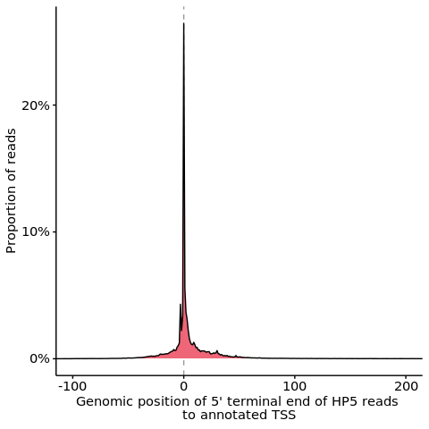

s5-1 Validation of TSS
================
Yoichiro Sugimoto
02 March, 2022

  - [Overview](#overview)
  - [Analysis of HP5 identified TSS position to the annotated
    TSS](#analysis-of-hp5-identified-tss-position-to-the-annotated-tss)
  - [Session information](#session-information)

# Overview

Ability of HP5 to identify TSS will be validated by analysing position
of 5’ termini of the reads to the annotated TSS.

``` r
## Bioconductor
library("rtracklayer")
library("GenomicFeatures")
library("GenomicAlignments")
library("Rsubread")

## Specify the number of CPUs to be used
processors <- 8
temp <- sapply(list.files("../functions", full.names = TRUE), source)

annot.dir <- normalizePath(file.path("../../annotation/"))
ref.seq.dir <- file.path(annot.dir, "hg38_annotation/ref_sequences/")
genome.fa.file <- list.files(ref.seq.dir, pattern = "_genome.fa$", full.names = TRUE)

annot.ps.dir <- file.path(annot.dir, "hg38_annotation/processed_data/")
annot.R.file <- list.files(
    annot.ps.dir,
    pattern = glob2rx("*primary_transcript_annotation*.rdata"),
    full.names = TRUE
)
load(annot.R.file)

results.dir <- file.path("../../results")

s2.alignment.dir <- file.path(results.dir, "s2-read-alignment")
s2.2.processed.bam.dir <-  file.path(s2.alignment.dir, "s2-2-processed-data")
s2.2.1.tss.bam.dir <- file.path(s2.2.processed.bam.dir, "s2-2-1-tss-bam")

s4.tss.dir <- file.path(results.dir, "s4-tss-definition-and-tx-assignment")
s4.1.tss.def.dir <- file.path(s4.tss.dir, "s4-1-tss-definition")
s4.1.6.filtered.tss.dir <- file.path(s4.1.tss.def.dir, "s4-1-6-filtered-tss")
s4.1.7.count.per.tss.dir <- file.path(s4.1.tss.def.dir, "s4-1-7-count-per-tss")

## create.dirs(c())
```

# Analysis of HP5 identified TSS position to the annotated TSS

``` r
all.primary.tx.dt <- file.path(
    annot.ps.dir,
    "all_GENCODE_RefSeq_transcript_info.csv"
) %>% fread

## Import annotation data
all.tx.gtf <- file.path(
    annot.ps.dir,
    "all-transcript.gtf"
)

all.tx.gr <- rtracklayer::import(all.tx.gtf)

grToPromoter <- function(gr){

    sl.gr <- gr[(
    mcols(gr)[, "transcript_id"] %in%
    all.primary.tx.dt[
        fusion_gene_flag == FALSE | chromosome_name == "chrM",
        transcript_id
    ]
    )]

    sl.txdb <- makeTxDbFromGRanges(sl.gr)

    ## Only promoters for mRNA and lncRNA are analyzed
    promoter.gr <- promoters(sl.txdb, upstream = 0, downstream = 1)

    promoter.gr <- promoter.gr[
        mcols(promoter.gr)[, "tx_name"] %in%
        all.primary.tx.dt[biotype %in% c("protein_coding"), transcript_id]
    ]

    return(promoter.gr)
}

promoter.gr <- grToPromoter(all.tx.gr)
```

    ## Warning in .get_cds_IDX(mcols0$type, mcols0$phase): The "phase" metadata column contains non-NA values for features of type
    ##   stop_codon. This information was ignored.

    ## Warning in .find_exon_cds(exons, cds): The following transcripts have exons that contain more than one CDS
    ##   (only the first CDS was kept for each exon): NM_001134939.1,
    ##   NM_001301020.1, NM_001301302.1, NM_001301371.1, NM_002537.3,
    ##   NM_004152.3, NM_016178.2

``` r
## Import TSS data
hp5.r4vhl.prefix <- "^polysome_RCC4_VHL_EIF4E2_NA_[[:digit:]]_NA_ribo[[:digit:]]"

input.bams <- list.files(
    s2.2.1.tss.bam.dir,
    pattern = paste0(hp5.r4vhl.prefix, "\\.tss.bam$"),
    full.names = TRUE
)

print("The following samples are analysed for the TSS analysis")
```

    ## [1] "The following samples are analysed for the TSS analysis"

``` r
print(basename(input.bams))
```

    ##  [1] "polysome_RCC4_VHL_EIF4E2_NA_1_NA_ribo1.tss.bam"
    ##  [2] "polysome_RCC4_VHL_EIF4E2_NA_1_NA_ribo2.tss.bam"
    ##  [3] "polysome_RCC4_VHL_EIF4E2_NA_1_NA_ribo3.tss.bam"
    ##  [4] "polysome_RCC4_VHL_EIF4E2_NA_1_NA_ribo4.tss.bam"
    ##  [5] "polysome_RCC4_VHL_EIF4E2_NA_1_NA_ribo5.tss.bam"
    ##  [6] "polysome_RCC4_VHL_EIF4E2_NA_1_NA_ribo6.tss.bam"
    ##  [7] "polysome_RCC4_VHL_EIF4E2_NA_1_NA_ribo7.tss.bam"
    ##  [8] "polysome_RCC4_VHL_EIF4E2_NA_1_NA_ribo8.tss.bam"
    ##  [9] "polysome_RCC4_VHL_EIF4E2_NA_3_NA_ribo1.tss.bam"
    ## [10] "polysome_RCC4_VHL_EIF4E2_NA_3_NA_ribo2.tss.bam"
    ## [11] "polysome_RCC4_VHL_EIF4E2_NA_3_NA_ribo3.tss.bam"
    ## [12] "polysome_RCC4_VHL_EIF4E2_NA_3_NA_ribo4.tss.bam"
    ## [13] "polysome_RCC4_VHL_EIF4E2_NA_3_NA_ribo5.tss.bam"
    ## [14] "polysome_RCC4_VHL_EIF4E2_NA_3_NA_ribo6.tss.bam"
    ## [15] "polysome_RCC4_VHL_EIF4E2_NA_3_NA_ribo7.tss.bam"
    ## [16] "polysome_RCC4_VHL_EIF4E2_NA_3_NA_ribo8.tss.bam"
    ## [17] "polysome_RCC4_VHL_EIF4E2_NA_4_NA_ribo1.tss.bam"
    ## [18] "polysome_RCC4_VHL_EIF4E2_NA_4_NA_ribo2.tss.bam"
    ## [19] "polysome_RCC4_VHL_EIF4E2_NA_4_NA_ribo3.tss.bam"
    ## [20] "polysome_RCC4_VHL_EIF4E2_NA_4_NA_ribo4.tss.bam"
    ## [21] "polysome_RCC4_VHL_EIF4E2_NA_4_NA_ribo5.tss.bam"
    ## [22] "polysome_RCC4_VHL_EIF4E2_NA_4_NA_ribo6.tss.bam"
    ## [23] "polysome_RCC4_VHL_EIF4E2_NA_4_NA_ribo7.tss.bam"
    ## [24] "polysome_RCC4_VHL_EIF4E2_NA_4_NA_ribo8.tss.bam"

``` r
param <- ScanBamParam(flag = scanBamFlag(isSecondaryAlignment = FALSE)) # Unique alignment

input.gr <- mclapply(
    input.bams, 
    readGAlignments,
    param = param,
    mc.cores = processors
) %>% {Reduce(c, .)}

## Only analyze TSS aligned within 100 bp distance from protein coding genes
all.primary.tx.txdb <- makeTxDbFromGRanges(all.tx.gr)
```

    ## Warning in .get_cds_IDX(mcols0$type, mcols0$phase): The "phase" metadata column contains non-NA values for features of type
    ##   stop_codon. This information was ignored.
    
    ## Warning in .get_cds_IDX(mcols0$type, mcols0$phase): The following transcripts have exons that contain more than one CDS
    ##   (only the first CDS was kept for each exon): NM_001134939.1,
    ##   NM_001301020.1, NM_001301302.1, NM_001301371.1, NM_002537.3,
    ##   NM_004152.3, NM_016178.2

``` r
all.primary.tx.range.gr <- transcripts(all.primary.tx.txdb)

all.primary.tx.range.gr <- all.primary.tx.range.gr[
    mcols(all.primary.tx.range.gr)[["tx_name"]] %in%
    all.primary.tx.dt[biotype == "protein_coding", transcript_id]
]

start(all.primary.tx.range.gr) <- start(all.primary.tx.range.gr) - 100
end(all.primary.tx.range.gr) <- end(all.primary.tx.range.gr) + 100

genic.filtered.tss.gr <- subsetByOverlaps(
    input.gr,
    all.primary.tx.range.gr
)

## Indeitify nearest annotated TSS for 5' end-Seq defined TSS
nearest.promoter.index <- nearest(
    GRanges(genic.filtered.tss.gr),
    promoter.gr,
    ignore.strand = FALSE
)

dist.vec <- ifelse(
    strand(genic.filtered.tss.gr) == "+",
    start(genic.filtered.tss.gr) - start(promoter.gr[nearest.promoter.index]),
    -1 * (start(genic.filtered.tss.gr) - start(promoter.gr[nearest.promoter.index]))
)

dist.dt <- table(dist.vec) %>% data.table
setnames(dist.dt, old = "dist.vec", new = "genomic_position")

dist.dt[, `:=`(
    genomic_position = as.integer(genomic_position),
    N_proportion = N / sum(dist.dt[, N])
)]

ggplot(
    data = dist.dt[genomic_position > -150 & genomic_position < 250],
    aes(
        x = genomic_position,
        y = N_proportion
    )
) +
    geom_vline(xintercept = 0, color = "gray60", linetype = "dashed") +
    geom_area(color = "black", fill = "#EE6677") +
    coord_cartesian(xlim = c(-100, 200)) +
    scale_y_continuous(labels = scales::percent_format(accuracy = 1)) +
    xlab("Genomic position of 5' terminal end of HP5 reads \nto annotated TSS") +
    ylab("Proportion of reads")
```

<!-- -->

# Session information

``` r
sessionInfo()
```

    ## R version 4.0.0 (2020-04-24)
    ## Platform: x86_64-conda_cos6-linux-gnu (64-bit)
    ## Running under: CentOS Linux 7 (Core)
    ## 
    ## Matrix products: default
    ## BLAS/LAPACK: /camp/lab/ratcliffep/home/users/sugimoy/CAMP_HPC/software/miniconda3_20200606/envs/five_prime_seq_for_VHL_loss_v0.2.1/lib/libopenblasp-r0.3.10.so
    ## 
    ## locale:
    ##  [1] LC_CTYPE=en_GB.UTF-8       LC_NUMERIC=C              
    ##  [3] LC_TIME=en_GB.UTF-8        LC_COLLATE=en_GB.UTF-8    
    ##  [5] LC_MONETARY=en_GB.UTF-8    LC_MESSAGES=en_GB.UTF-8   
    ##  [7] LC_PAPER=en_GB.UTF-8       LC_NAME=C                 
    ##  [9] LC_ADDRESS=C               LC_TELEPHONE=C            
    ## [11] LC_MEASUREMENT=en_GB.UTF-8 LC_IDENTIFICATION=C       
    ## 
    ## attached base packages:
    ## [1] parallel  stats4    stats     graphics  grDevices utils     datasets 
    ## [8] methods   base     
    ## 
    ## other attached packages:
    ##  [1] knitr_1.28                  stringr_1.4.0              
    ##  [3] magrittr_1.5                data.table_1.12.8          
    ##  [5] dplyr_1.0.0                 khroma_1.3.0               
    ##  [7] ggplot2_3.3.1               Rsubread_2.2.1             
    ##  [9] GenomicAlignments_1.24.0    Rsamtools_2.4.0            
    ## [11] Biostrings_2.56.0           XVector_0.28.0             
    ## [13] SummarizedExperiment_1.18.1 DelayedArray_0.14.0        
    ## [15] matrixStats_0.56.0          GenomicFeatures_1.40.0     
    ## [17] AnnotationDbi_1.50.0        Biobase_2.48.0             
    ## [19] rtracklayer_1.48.0          GenomicRanges_1.40.0       
    ## [21] GenomeInfoDb_1.24.0         IRanges_2.22.1             
    ## [23] S4Vectors_0.26.0            BiocGenerics_0.34.0        
    ## [25] rmarkdown_2.2              
    ## 
    ## loaded via a namespace (and not attached):
    ##  [1] httr_1.4.2             bit64_0.9-7            assertthat_0.2.1      
    ##  [4] askpass_1.1            BiocFileCache_1.12.0   blob_1.2.1            
    ##  [7] GenomeInfoDbData_1.2.3 yaml_2.2.1             progress_1.2.2        
    ## [10] pillar_1.4.4           RSQLite_2.2.0          lattice_0.20-41       
    ## [13] glue_1.4.1             digest_0.6.25          colorspace_1.4-1      
    ## [16] htmltools_0.4.0        Matrix_1.2-18          XML_3.99-0.3          
    ## [19] pkgconfig_2.0.3        biomaRt_2.44.0         zlibbioc_1.34.0       
    ## [22] purrr_0.3.4            scales_1.1.1           BiocParallel_1.22.0   
    ## [25] tibble_3.0.1           openssl_1.4.1          generics_0.0.2        
    ## [28] farver_2.0.3           ellipsis_0.3.1         withr_2.4.1           
    ## [31] crayon_1.3.4           memoise_1.1.0          evaluate_0.14         
    ## [34] tools_4.0.0            prettyunits_1.1.1      hms_0.5.3             
    ## [37] lifecycle_0.2.0        munsell_0.5.0          compiler_4.0.0        
    ## [40] rlang_0.4.10           grid_4.0.0             RCurl_1.98-1.2        
    ## [43] rappdirs_0.3.1         bitops_1.0-6           labeling_0.3          
    ## [46] gtable_0.3.0           DBI_1.1.0              curl_4.3              
    ## [49] R6_2.4.1               bit_1.1-15.2           stringi_1.4.6         
    ## [52] Rcpp_1.0.4.6           vctrs_0.3.1            dbplyr_1.4.4          
    ## [55] tidyselect_1.1.0       xfun_0.14
