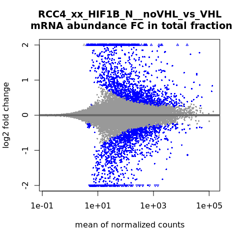

s6-2 Transcript level mRNA abundance changes and differential TSS
analysis
================
Yoichiro Sugimoto
23 May, 2022

  - [Overview](#overview)
  - [Differential TSS usage analysis by
    DEXSeq](#differential-tss-usage-analysis-by-dexseq)
  - [Differential expression analysis by
    DESeq2](#differential-expression-analysis-by-deseq2)
  - [Identifying genes manifesting differential TSS
    usage](#identifying-genes-manifesting-differential-tss-usage)
  - [Session information](#session-information)

# Overview

Alternative TSS usage is analysed here.

``` r
## Biocoductor
library("DRIMSeq")
library("DESeq2")
library("DEXSeq")
library("stageR")

## Prallelization
library("BiocParallel")
## Specify the number of CPUs to be used
processors <- 8
BPPARAM <- MulticoreParam(processors)

temp <- sapply(list.files("../functions", full.names = TRUE), source)
source(file.path("./functions/load_total_sample_data.R"), chdir = TRUE)
```

    ## [1] "Sample file used: /camp/lab/ratcliffep/home/users/sugimoy/CAMP_HPC/projects/20211102_HP5_HIF_mTOR/data/sample_data/processed_sample_file.csv"
    ## [1] "The following R objects were exported: total.sample.dt, total.coldata.df, total.comparison.dt"

``` r
source(file.path("./functions/test_differential_expression.R"), chdir = TRUE)
```

    ## [1] "The following functions are exported: calcMeanCount(), analyzeDE()"

``` r
set.seed(0)
```

``` r
annot.dir <- normalizePath(file.path("../../annotation/"))
annot.ps.dir <- file.path(annot.dir, "hg38_annotation/processed_data/")
annot.R.file <- list.files(
    annot.ps.dir,
    pattern = glob2rx("*primary_transcript_annotation*.rdata"),
    full.names = TRUE
)
load(annot.R.file)

results.dir <- file.path("../../results")
s4.tss.dir <- file.path(results.dir, "s4-tss-definition-and-tx-assignment")
s4.1.tss.def.dir <- file.path(s4.tss.dir, "s4-1-tss-definition")
s4.1.6.filtered.tss.dir <- file.path(s4.1.tss.def.dir, "s4-1-6-filtered-tss")
s4.1.7.count.per.tss.dir <- file.path(s4.1.tss.def.dir, "s4-1-7-count-per-tss") 

s6.dir <- file.path(results.dir, "s6-differential-regulation-analysis")
s6.2.dir <- file.path(s6.dir, "s6-2-differentially-TSS")
s6.2.1.tss.ratio.dir <- file.path(s6.2.dir, "TSS_ratio_change")
s6.2.2.tss.de.dir <- file.path(s6.2.dir, "TSS_differential_expression")
s6.2.3.diff.tss.dir <- file.path(s6.2.dir, "Differential_TSS_usage")

create.dirs(c(
    s6.2.dir,
    s6.2.1.tss.ratio.dir,
    s6.2.2.tss.de.dir,
    s6.2.3.diff.tss.dir
))
```

# Differential TSS usage analysis by DEXSeq

``` r
filtered.tss.with.quantile.file <- file.path(
  s4.1.6.filtered.tss.dir,
  "filtered-tss-with-quantile.csv"
)

filtered.tss.with.quantile.dt <- fread(filtered.tss.with.quantile.file)


tss.count.dt <- fread(
    file.path(s4.1.7.count.per.tss.dir, "count-per-confident-tss.csv")
)
## Analyze only TSS asigned to genes
tss.count.dt <- tss.count.dt[!grepl("^NA_", tss_name)]

total.tss.count.dt <- tss.count.dt[, c(
    "tss_name",
    grep("total_", colnames(tss.count.dt), value = TRUE)
), with = FALSE]

setnames(
    total.tss.count.dt,
    old = colnames(total.tss.count.dt),
    new = colnames(total.tss.count.dt) %>% gsub("total_", "", .)
)
```

``` r
diffTSS.ratioAnalysis <- function(
                                  total.tss.count.dt,
                                  total.coldata.df,
                                  filtered.tss.with.quantile.dt = NULL,
                                  s6.2.1.tss.ratio.dir,
                                  comparison.name,
                                  exp.design,
                                  filtered.tss = NA,
                                  tss.name = "tss_name"
                                  ){
    ## Extract analysis conditions
    comparison.regex <- gsub(
        "xx",
        paste0(
            "(",
            gsub("_vs_", "|", str_split_fixed(comparison.name, "__", n = 2)[, 2] ),
            ")"
        ),
        str_split_fixed(comparison.name, "__", n = 2)[, 1]
    )

    exp.design.elements  <-
        Reduce(paste, deparse(exp.design)) %>%
        gsub("~", "", .) %>%
        gsub(" ", "", .) %>%
        str_split(., "\\+") %>%
        .[[1]]
    exp.compare.element <- exp.design.elements[length(exp.design.elements)]

    base.sample.name <- str_split_fixed(comparison.name, "__", n = 2)[, 1]
    base.comps <- str_split_fixed(comparison.name, "__", n = 2)[, 2] %>%
        str_split_fixed(., "_vs_", n = 2) %>%
        .[1, ]

    base.input.names <- unlist(lapply(
        base.comps,
        function(x){gsub("xx", x, base.sample.name)}
    ))
    
    ## drimseq.coef <- paste0(base.comps[2], base.comps[1])
        
    ## Subset data analyzed in this function
    selected.samples <- colnames(total.tss.count.dt)[
        grepl(comparison.regex, colnames(total.tss.count.dt))
    ] 

    selected.total.tss.count.dt <- total.tss.count.dt[
      , c("tss_name", selected.samples), with = FALSE
    ]

    selected.coldata.df <- total.coldata.df[selected.samples, ]
    
    ## Generate count matrix
    count.df <- cbind(
        data.frame(
            gene_id = str_split_fixed(
                selected.total.tss.count.dt[, get(tss.name)], "_", n = 2)[, 1],
            feature_id = selected.total.tss.count.dt[, get(tss.name)]
        ),
        selected.total.tss.count.dt[, selected.samples, with = FALSE]
    )

    if(all(is.na(filtered.tss))){
        ## The data are pre-filtereed (genes without multiple isoforms with sufficient expression are filtered out)
        ## This count data is for DEXSeq
        drimseq.count.data <- dmDSdata(
            counts = count.df,
            samples = data.frame(sample_id = rownames(selected.coldata.df)) %>%
                cbind(., selected.coldata.df)
        ) %>%
            dmFilter(
                min_samps_feature_expr = 2,
                min_feature_expr = 5, 
                min_samps_feature_prop = 2,
                min_feature_prop = 0.05,
                min_samps_gene_expr = 2,
                min_gene_expr = 20
            )
    } else {
        drimseq.count.data <- dmDSdata(
            counts = count.df,
            samples = data.frame(sample_id = rownames(selected.coldata.df)) %>%
                cbind(., selected.coldata.df)
        ) %>%
            dmFilter(
                min_samps_gene_expr = 2,
                min_gene_expr = 20
            )
    }
    ## DRIMSeq version (I currently did not see much difference from DEXSeq. I decedied to use only proportion estimate from DRIMseq, since many analyses are dependent on some form of DEXSeq output)
    exp.design.matrix <- model.matrix(exp.design, data = DRIMSeq::samples(drimseq.count.data))
    drimseq.count.data <- dmPrecision(
        drimseq.count.data,
        design = exp.design.matrix,
        ## one_way = FALSE,
        add_uniform = TRUE,
        BPPARAM = BPPARAM
    ) %>%
        dmFit(
            design = exp.design.matrix,
            add_uniform = TRUE,
            ## one_way = FALSE,
            BPPARAM = BPPARAM
        ) ## %>%
        ## dmTest(
        ##     coef = drimseq.coef,
        ##     BPPARAM = BPPARAM
        ## )

    proportion.dt <- DRIMSeq::proportions(drimseq.count.data) %>%
        data.table %>%
        {.[, c(
             "gene_id", "feature_id",
             grep(base.input.names[1], colnames(.),
                  value = TRUE)[1],
             grep(base.input.names[2], colnames(.),
                  value = TRUE)[1]
        ), with = FALSE]}

    setnames(
        proportion.dt,
        old = colnames(proportion.dt)[2:4],
        new = c(
            tss.name,
            paste0("proportion_treated"),
            paste0("proportion_base")
        )
    )

    if(all(is.na(filtered.tss))){
        ## DEXSeq analysis
        char.formula.elements <- str_split(as.character(exp.design)[2], " \\+ ")[[1]]
        char.formula <- paste(char.formula.elements, "exon", sep = ":")

        formula.full.model <- formula(paste(c("~sample", "exon", char.formula), collapse  = " + "))
        formula.reduced.model <- formula(
            paste(c("~sample", "exon", char.formula[1:length(char.formula) - 1]), collapse  = " + ")
        )
        
        dxd <- DEXSeqDataSet(
            countData = as.matrix(counts(drimseq.count.data)[,-c(1:2)]),
            sampleData = selected.coldata.df,
            design = formula.full.model,
            groupID = counts(drimseq.count.data)$gene_id,
            featureID = counts(drimseq.count.data)$feature_id
        ) %>%
            estimateSizeFactors %>%
        estimateDispersions(BPPARAM = BPPARAM, quiet = TRUE) %>%
        testForDEU(
            reducedModel = formula.reduced.model,
            BPPARAM = BPPARAM
        ) %>%
        estimateExonFoldChanges(
            fitExpToVar = exp.compare.element, BPPARAM = BPPARAM
        )

        dxd.res <- DEXSeqResults(dxd)
        ## plotDispEsts(dxd)
        ## plotMA(dxd.res)
        res.dt <- data.table(as.data.frame(dxd.res))

        setnames(
            res.dt,
            old = c("groupID", "featureID", grep("^log2fold_", colnames(res.dt), value = TRUE)),
            new = c("gene_id", tss.name, "log2fc")
        )
        
        setnames(
            res.dt,
            old = grep("^countData.", colnames(res.dt), value = TRUE),
            new = gsub(
                "^countData.",
                "countData__",
                grep("^countData.", colnames(res.dt), value = TRUE)
            )
        )

        ## Calculate per gene FDR
        per.gene.qval <- perGeneQValue(dxd.res)

        per.gene.qval.dt <- stack(per.gene.qval) %>%
            data.table
        
        setnames(
            per.gene.qval.dt,
            old = c("values", "ind"),
            new = c("gene_qvalue", "gene_id")
        )

        res.dt <- merge(
            res.dt,
            per.gene.qval.dt,
            by = "gene_id"
        )

        ## Add normalized count
        norm.count.dt <- data.table(
            counts(dxd.res, normalized  = TRUE), keep.rownames = TRUE
        ) %>%
            {.[, rn := str_split_fixed(rn, ":", n = 2)[, 2]]}
        setnames(norm.count.dt, old = "rn", new = "tss_name")
        
        mean.norm.count.dt <- lapply(
            base.input.names,
            calcMeanCount,
            count.dt = norm.count.dt
        ) %>%
            {merge(.[[1]], .[[2]], by = "tss_name")}

        setnames(
            mean.norm.count.dt,
            old = paste0("meanNormCount_", base.input.names),
            new = paste0("meanNormCount_", c("treated", "base"))
        )

        ## Convert to TPM like values
        norm.factor <-
            10^6 /
            mean(colSums(mean.norm.count.dt[, .(meanNormCount_treated, meanNormCount_base)]))

        mean.norm.count.dt[, `:=`(
            meanNormCount_treated = meanNormCount_treated * norm.factor,
            meanNormCount_base = meanNormCount_base * norm.factor,
            treated_basename = base.input.names[1],
            base_basename = base.input.names[2]
        )]
        
        ## Merge result data.table with normalized count data
        res.dt <- merge(
            res.dt,
            mean.norm.count.dt,
            by = "tss_name", all = TRUE
        )

        ## Two stage testing using stageR package
        ## per.gene.qval <- perGeneQValue(dxd.res) ## calculated above
        tx.p.mat <- matrix(dxd.res$pvalue, ncol = 1)
        dimnames(tx.p.mat) <- list(dxd.res$featureID, "transcript")
        
        tx2gene.df <- as.data.frame(dxd.res[, c("featureID", "groupID")])

        stageRObj <- stageRTx(
            pScreen = per.gene.qval,
            pConfirmation = tx.p.mat,
            pScreenAdjusted = TRUE,
            tx2gene = tx2gene.df
        ) %>%
            stageWiseAdjustment(
                method = "dtu",
                alpha = 0.1
            )
        
        gene.tx.padj.dt <- data.table(getAdjustedPValues(
            stageRObj,
            order = FALSE,
            onlySignificantGenes = FALSE
        ))

        setnames(
            gene.tx.padj.dt,
            old = c("geneID", "txID", "gene", "transcript"),
            new = c("gene_id", tss.name, "gene_FDR", "tx_FDR")
        )
        
        ## Print analysis conditions and quick summary
        print(paste("Analyzing", comparison.name))
        print(
            paste(
                "With the full model formula of",
                Reduce(paste, deparse(formula.full.model))
            ))
        print(
            paste(
                "With the reduced model formula of",
                Reduce(paste, deparse(formula.reduced.model))
            ))
        print(data.table(as.data.frame(colData(dxd))))
        
        print(paste0("The number of differentially used tss"))
        print(table(res.dt[, padj] < 0.1))

        print(paste0("The number of genes with differential tss usage"))
        print(table(res.dt[!duplicated(gene_id), gene_qvalue] < 0.1))

        ## Merge outputs to export the results
        all.res.dt <- merge(
            x = gene.tx.padj.dt,
            y = res.dt[, c(
                "gene_id", "tss_name", 
                "exonBaseMean", "gene_qvalue", "padj", "log2fc", "dispersion", "stat", "pvalue",
                "treated_basename", "base_basename",
                "meanNormCount_treated", "meanNormCount_base"                
            )],
            by = c("tss_name", "gene_id")
        ) %>%
            merge(
                y = proportion.dt,
                by = c("tss_name", "gene_id")
            )

        if(is.data.frame(filtered.tss.with.quantile.dt)){
            all.res.dt <- merge(
                x = filtered.tss.with.quantile.dt[
                  , c("tss_name", "gene_id", "gene_name",
                      "chr", "strand", "start", "end", "annot"), with = FALSE
                ],
                y = all.res.dt,
                by = c("tss_name", "gene_id")
            )
        } else {"No additional annotation"}
    } else {
        print("No DEXSeq analysis")
        all.res.dt <- proportion.dt
    }
    
    out.file <- file.path(
        s6.2.1.tss.ratio.dir,
        paste0(comparison.name, ".csv")
    )

    fwrite(all.res.dt, file = out.file)

    return(all.res.dt)
}


r4.res.dt <- diffTSS.ratioAnalysis(
    total.tss.count.dt = total.tss.count.dt,
    total.coldata.df = total.coldata.df,
    filtered.tss.with.quantile.dt = filtered.tss.with.quantile.dt,
    s6.2.1.tss.ratio.dir = s6.2.1.tss.ratio.dir,
    comparison.name = "RCC4_xx_HIF1B_N__noVHL_vs_VHL",
    exp.design = ~ VHL,
    filtered.tss = NA
)
```

    ## ! Using a subset of 0.1 genes to estimate common precision !

    ## ! Using common_precision = 720.5717 as prec_init !

    ## ! Using loess fit as a shrinkage factor !

    ## converting counts to integer mode

    ## Warning in DESeqDataSet(rse, design, ignoreRank = TRUE): some variables in
    ## design formula are characters, converting to factors

    ## The returned adjusted p-values are based on a stage-wise testing approach and are only valid for the provided target OFDR level of 10%. If a different target OFDR level is of interest,the entire adjustment should be re-run.

    ## [1] "Analyzing RCC4_xx_HIF1B_N__noVHL_vs_VHL"
    ## [1] "With the full model formula of ~sample + exon + VHL:exon"
    ## [1] "With the reduced model formula of ~sample + exon"
    ##                   sample cell   VHL HIF1B oxygen clone   exon sizeFactor
    ##  1:   RCC4_VHL_HIF1B_N_1 RCC4   VHL HIF1B      N    11   this  1.1149102
    ##  2:   RCC4_VHL_HIF1B_N_3 RCC4   VHL HIF1B      N    13   this  1.0759106
    ##  3:   RCC4_VHL_HIF1B_N_4 RCC4   VHL HIF1B      N    14   this  1.0824922
    ##  4: RCC4_noVHL_HIF1B_N_1 RCC4 noVHL HIF1B      N     1   this  1.2209801
    ##  5: RCC4_noVHL_HIF1B_N_3 RCC4 noVHL HIF1B      N     3   this  0.8822508
    ##  6: RCC4_noVHL_HIF1B_N_4 RCC4 noVHL HIF1B      N     4   this  0.7623490
    ##  7:   RCC4_VHL_HIF1B_N_1 RCC4   VHL HIF1B      N    11 others  1.1149102
    ##  8:   RCC4_VHL_HIF1B_N_3 RCC4   VHL HIF1B      N    13 others  1.0759106
    ##  9:   RCC4_VHL_HIF1B_N_4 RCC4   VHL HIF1B      N    14 others  1.0824922
    ## 10: RCC4_noVHL_HIF1B_N_1 RCC4 noVHL HIF1B      N     1 others  1.2209801
    ## 11: RCC4_noVHL_HIF1B_N_3 RCC4 noVHL HIF1B      N     3 others  0.8822508
    ## 12: RCC4_noVHL_HIF1B_N_4 RCC4 noVHL HIF1B      N     4 others  0.7623490
    ## [1] "The number of differentially used tss"
    ## 
    ## FALSE  TRUE 
    ## 17098  1724 
    ## [1] "The number of genes with differential tss usage"
    ## 
    ## FALSE  TRUE 
    ##  5867   802

``` r
## Data other than RCC4_xx_HIF1B_N__noVHL_vs_VHL are only used for the comparison of proportional change.
tss.ratio.res.dts <- mapply(
    diffTSS.ratioAnalysis,
    total.tss.count.dt = list(total.tss.count.dt),
    total.coldata.df = list(total.coldata.df),
    filtered.tss.with.quantile.dt = list(filtered.tss.with.quantile.dt),
    s6.2.1.tss.ratio.dir = list(s6.2.1.tss.ratio.dir),
    comparison.name = total.comparison.dt[
        comparison != "RCC4_xx_HIF1B_N__noVHL_vs_VHL", comparison
    ],
    exp.design = total.comparison.dt[
        comparison != "RCC4_xx_HIF1B_N__noVHL_vs_VHL", exp_formula
    ],
    filtered.tss = list(r4.res.dt[, tss_name]),
    SIMPLIFY = FALSE
)
```

    ## ! Using a subset of 0.1 genes to estimate common precision !

    ## ! Using common_precision = 433.6339 as prec_init !

    ## ! Using loess fit as a shrinkage factor !

    ## [1] "No DEXSeq analysis"

    ## ! Using a subset of 0.1 genes to estimate common precision !

    ## ! Using common_precision = 152.9447 as prec_init !

    ## ! Using loess fit as a shrinkage factor !

    ## [1] "No DEXSeq analysis"

    ## ! Using a subset of 0.1 genes to estimate common precision !

    ## ! Using common_precision = 155.9224 as prec_init !

    ## ! Using 0 as a shrinkage factor !

    ## [1] "No DEXSeq analysis"

    ## ! Using a subset of 0.1 genes to estimate common precision !

    ## ! Using common_precision = 50.446 as prec_init !

    ## ! Using 0 as a shrinkage factor !

    ## [1] "No DEXSeq analysis"

# Differential expression analysis by DESeq2

``` r
countDt2Df <- function(count.dt, primary.tx.dt){

    count.dt <- copy(count.dt)

    annot.dt <- data.table(
        tss_name = count.dt[, tss_name],
        gene_id = str_split_fixed(count.dt[, tss_name], "_", n = 2)[, 1]
    )

    count.dt <- cbind(
        annot.dt,
        count.dt[, tss_name := NULL]
    )
    
    count.dt <- merge(
        primary.tx.dt[!duplicated(gene_id), .(gene_id, gene_name, biotype)],
        count.dt,
        by = "gene_id",
        all.y = TRUE
    )
    
    temp.count.dt <- copy(count.dt[biotype != ""])
    count.df <- as.data.frame(temp.count.dt)
    rownames(count.df) <- count.df[, "tss_name"]
    annot.df <- count.df[, c("tss_name", "gene_id", "gene_name", "biotype")]
    count.df <- dropColumnDf(count.df, drop.vec = c("tss_name", "gene_id", "gene_name", "biotype"))
    return(list(count.df = count.df, annot.df = annot.df))
}

deseq2.in.list <- countDt2Df(
    total.tss.count.dt[, c("tss_name", rownames(total.coldata.df)), with = FALSE],
    primary.tx.dt
)

if(!all(colnames(deseq2.in.list$count.df) == rownames(total.coldata.df))){
    stop("colnames of count.df does not match with rownames of total.coldata.df")
} else {"OK"}
```

    ## [1] "OK"

``` r
## This analysis is only necessary for RCC4 VHL loss
tss.de.res.dts <- mapply(
    analyzeDE,
    total.count.dt = list(total.tss.count.dt),
    annot.dt = list(data.table(deseq2.in.list$annot.df)),
    ref.column.name = list("tss_name"),
    input.sample.data.df = list(total.coldata.df),
    comparison.name = total.comparison.dt[
        comparison == "RCC4_xx_HIF1B_N__noVHL_vs_VHL", comparison
    ],
    exp.design = total.comparison.dt[
        comparison == "RCC4_xx_HIF1B_N__noVHL_vs_VHL", exp_formula
    ],
    out.dir = list(s6.2.2.tss.de.dir),
    SIMPLIFY = FALSE
)
```

    ## [1] "Analyzing RCC4_xx_HIF1B_N__noVHL_vs_VHL"
    ## [1] "With the formula of ~VHL"
    ## DataFrame with 6 rows and 6 columns
    ##                          cell      VHL    HIF1B   oxygen    clone sizeFactor
    ##                      <factor> <factor> <factor> <factor> <factor>  <numeric>
    ## RCC4_VHL_HIF1B_N_1       RCC4    VHL      HIF1B        N       11   1.110244
    ## RCC4_VHL_HIF1B_N_3       RCC4    VHL      HIF1B        N       13   1.077824
    ## RCC4_VHL_HIF1B_N_4       RCC4    VHL      HIF1B        N       14   1.079516
    ## RCC4_noVHL_HIF1B_N_1     RCC4    noVHL    HIF1B        N       1    1.216250
    ## RCC4_noVHL_HIF1B_N_3     RCC4    noVHL    HIF1B        N       3    0.880912
    ## RCC4_noVHL_HIF1B_N_4     RCC4    noVHL    HIF1B        N       4    0.766273

<!-- -->

    ## [1] "Summary of analysis results"
    ##                  reg_direction
    ## stat_significance    Up  Down   Sum
    ##   padj < 0.1       1464  1306  2770
    ##   not significant 11586 11980 23566
    ##   Sum             13050 13286 26336

# Identifying genes manifesting differential TSS usage

Alternate TSS were defined as those showing the largest fold change upon
VHL loss (FDR \< 0.1) and a base TSS was those showing the highest
expression in the presence of VHL.

VHL-dependent alternative TSS usage were further filtered by the
following criteria: - Proportional change \> 5% - Absolute fold change
\> 1.5 - Non-overlapping of the 95% confidence interval of alternate TSS
vs base TSS.

``` r
extractGeneLevelTssReg <- function(comparison.name,
                                   filtered.tss.with.quantile.dt,
                                   s6.2.1.tss.ratio.dir,
                                   s6.2.2.tss.de.dir,
                                   s6.2.3.diff.tss.dir,
                                   diff.proportion.threshold = 0.05, 
                                   log2fc.threshold = log2(1.5)
                                   ){
    diff.tss.ratio.dt <- fread(
        file.path(s6.2.1.tss.ratio.dir, paste0(comparison.name, ".csv"))
    )

    diff.tss.de.dt <- fread(
        file.path(s6.2.2.tss.de.dir, paste0(comparison.name, "_DE.csv"))
    )

    ## Rename columns to merge the two files
    ratio.data.cols <- c(
        "ratio_gene_FDR", "ratio_tx_FDR",
        "ratio_log2fc", "ratio_padj",
        "treated_basename", "base_basename",
        "meanNormCount_treated", "meanNormCount_base",
        "proportion_treated", "proportion_base"
    )
    ratio.original.data.cols <- gsub("^ratio_", "", ratio.data.cols)
    exp.data.cols <- c("exp_baseMean", "exp_shrlog2fc", "exp_lfcSE" , "exp_padj")

    setnames(
        diff.tss.ratio.dt,
        old = ratio.original.data.cols,
        new = ratio.data.cols
    )
    
    setnames(
        diff.tss.de.dt,
        old = gsub("exp_", "", exp.data.cols),
        new = exp.data.cols
    )

    ## Merge the two files
    tss.data.cols <- c(
        "gene_id", "gene_name", "annot", "tss_width",
        "chr", "strand", "start", "end"
    )

    tss.m.dt <- Reduce(
        function(...) merge(..., all = TRUE, by = "tss_name"),
        list(
            filtered.tss.with.quantile.dt[, c(
                "tss_name", tss.data.cols
            ), with = FALSE],
            diff.tss.de.dt[, c("tss_name", "biotype", exp.data.cols), with = FALSE],
            diff.tss.ratio.dt[, c("tss_name", ratio.data.cols), with = FALSE]
        ))

    tss.m.dt <- tss.m.dt[!grepl("^NA", tss_name)]
    tss.m.dt <- tss.m.dt[ratio_gene_FDR < 0.1][!is.na(ratio_tx_FDR)]
    tss.m.dt[, dProportion := proportion_treated - proportion_base]
    
    tss.m.dt[, `:=`(
        min_ratio_log2fc = min(ratio_log2fc),
        max_ratio_log2fc = max(ratio_log2fc)
    ), by = gene_id]
    
    genes.with.diff.tss <- tss.m.dt[
        exp_padj < 0.1 & ratio_tx_FDR < 0.1 &
        abs(exp_shrlog2fc) > log2fc.threshold &
        abs(dProportion) > diff.proportion.threshold
    ][!duplicated(gene_id), gene_id]
    
    print(comparison.name)
    ## print(paste0(
    ##     "The number of genes with alternative TSS usage (before filtering): ",
    ##     length(genes.with.diff.tss)
    ## ))

    ## Exclude intervened genes
    genes.with.diff.tss <- genes.with.diff.tss[!(
        genes.with.diff.tss %in% c(
                                     "ENSG00000134086" #VHL
                                 ))]
        
    ## 2. Define the regulatory direction of TSS
    tss.m.dt[
       , tss_reg_dir := ifelse(
             exp_padj < 0.1, ifelse(exp_shrlog2fc > 0, "Up", "Down"), "Unchanged"
         )
    ]
    
    sig.multi.tss.m.dt <- copy(tss.m.dt[gene_id %in% genes.with.diff.tss])
    
    defineAltTss <- function(sl.gene.id, sig.multi.tss.m.dt){

        sl.dt <- copy(sig.multi.tss.m.dt[gene_id %in% sl.gene.id])

        alternative.tss.dt <- sl.dt[
            exp_padj < 0.1 & ratio_tx_FDR < 0.1 &
            ## Adding filter here maximise the number of significant genes
            abs(exp_shrlog2fc) > log2fc.threshold &
            abs(dProportion) > diff.proportion.threshold            
        ][order(abs(exp_shrlog2fc), decreasing = TRUE)][1]

        base.tss.dt <- sl.dt[!(tss_name %in% alternative.tss.dt[, tss_name])][
            order(proportion_base, decreasing = TRUE)
        ][1]

        opposite.all.dt <- sl.dt[
            !(sign(ratio_log2fc) %in% sign(alternative.tss.dt[, ratio_log2fc]))
        ]
        reg.dir.levels <- c("Up", "Down")
        
        opposite.all.dt <- opposite.all.dt[
            ratio_tx_FDR < 0.1
        ][
            order(
                tss_reg_dir == alternative.tss.dt[, tss_reg_dir],
                ## Different regulatory direction prioritised
                -abs(exp_shrlog2fc) ## Then sort by the effect size
            )]
        
        opposite.dt <- opposite.all.dt[1]
        
        if(
            nrow(alternative.tss.dt[!is.na(tss_name)]) > 0 &
            nrow(base.tss.dt[!is.na(tss_name)]) > 0
        ){

            ## Filter out alternative TSS events by the degree of the change
            extract.ci <- function(input.dt, conf.int.range = 0.05/2){
                log2fc.ci <- c(
                    "center" = input.dt[, exp_shrlog2fc],
                    "lower" = input.dt[, exp_shrlog2fc] -
                        abs(qnorm(conf.int.range)) *  input.dt[, exp_lfcSE],
                    "upper" = input.dt[, exp_shrlog2fc] +
                        abs(qnorm(conf.int.range)) *  input.dt[, exp_lfcSE]
                )
                return(log2fc.ci)
            }

            alternative.tss.ci <- extract.ci(alternative.tss.dt)
            base.tss.ci <- extract.ci(base.tss.dt)

            alt.base.ol <- DescTools::Overlap(
                                          x = alternative.tss.ci[c("lower", "upper")],
                                          y = base.tss.ci[c("lower", "upper")]
                           )

            alt.tss.flag <- (alt.base.ol == 0)

        } else {
            alt.tss.flag <- FALSE
        }

        if(alt.tss.flag == TRUE){
            ## 2-6. Depending on the pair of the regulatory direction, define the group described above
            gene.sum.dt <- cbind(
                alternative.tss.dt[, .(
                    gene_id, gene_name, biotype
                )],
                data.table(
                    exp_baseMean_base = base.tss.dt[, exp_baseMean],
                    exp_padj_base = base.tss.dt[, exp_padj],
                    exp_shrlog2fc_base = base.tss.dt[, exp_shrlog2fc],
                    ratio_log2fc_base = base.tss.dt[, ratio_log2fc],
                    ratio_tx_FDR_base = base.tss.dt[, ratio_tx_FDR],
                    ##
                    exp_baseMean_alternative = alternative.tss.dt[, exp_baseMean],
                    exp_padj_alternative = alternative.tss.dt[, exp_padj],
                    exp_shrlog2fc_alternative = alternative.tss.dt[, exp_shrlog2fc],
                    ratio_log2fc_alternative = alternative.tss.dt[, ratio_log2fc],
                    ratio_tx_FDR_alternative = alternative.tss.dt[, ratio_tx_FDR],
                    ##
                    tss_name_base = base.tss.dt[, tss_name],
                    tss_name_alternative = alternative.tss.dt[, tss_name],
                    ##
                    delta_proportion_base =
                        base.tss.dt[, proportion_treated - proportion_base],
                    delta_proportion_alternative =
                        alternative.tss.dt[, proportion_treated - proportion_base],
                    ## 
                    alt_tss_reg_mode = alternative.tss.dt[, tss_reg_dir],
                    discordant_flag = sum(
                        reg.dir.levels %in%
                        c(
                            opposite.dt[, tss_reg_dir],
                            alternative.tss.dt[, tss_reg_dir])
                    ) == 2
                )
            )

            gene.sum.dt[, `:=`(
                diff_tss_with_threshold = TRUE
            )]

        } else {
            gene.sum.dt <- data.table()
        }

        return(gene.sum.dt)
    }

    sig.multi.gene.m.dt <- mclapply(
        genes.with.diff.tss,
        defineAltTss,
        sig.multi.tss.m.dt,
        mc.cores = processors
    ) %>% rbindlist

    all.gene.m.dt <- sig.multi.gene.m.dt

    if(nrow(all.gene.m.dt) > 0){

        all.gene.m.dt <- all.gene.m.dt[diff_tss_with_threshold == TRUE]

        print("After filteration (mRNAs):")
        print("By regulatory direcion of alternate TSS")
        print(table(
            all.gene.m.dt[biotype == "protein_coding", alt_tss_reg_mode]
        ))
        print("Discordant regulation (mRNAs):")
        print(
            all.gene.m.dt[biotype == "protein_coding", table(discordant_flag)]
        )

        out.file <- file.path(
            s6.2.3.diff.tss.dir,
            paste0(comparison.name, "-diff-TSS.csv")
        )

        fwrite(all.gene.m.dt, out.file)

    } else {"Pass"}

    return(all.gene.m.dt)
}

## This analysis is only necessary for RCC4 VHL loss
diff.tss.res.dts <- lapply(
    total.comparison.dt[comparison == "RCC4_xx_HIF1B_N__noVHL_vs_VHL", comparison],
    extractGeneLevelTssReg,
    filtered.tss.with.quantile.dt = filtered.tss.with.quantile.dt,
    s6.2.1.tss.ratio.dir = s6.2.1.tss.ratio.dir,
    s6.2.2.tss.de.dir = s6.2.2.tss.de.dir,
    s6.2.3.diff.tss.dir = s6.2.3.diff.tss.dir,
    diff.proportion.threshold = 0.05
)
```

    ## [1] "RCC4_xx_HIF1B_N__noVHL_vs_VHL"
    ## [1] "After filteration (mRNAs):"
    ## [1] "By regulatory direcion of alternate TSS"
    ## 
    ## Down   Up 
    ##   64   85 
    ## [1] "Discordant regulation (mRNAs):"
    ## discordant_flag
    ## FALSE  TRUE 
    ##   140     9

# Session information

``` r
sessionInfo()
```

    ## R version 4.0.0 (2020-04-24)
    ## Platform: x86_64-conda_cos6-linux-gnu (64-bit)
    ## Running under: CentOS Linux 7 (Core)
    ## 
    ## Matrix products: default
    ## BLAS/LAPACK: /camp/lab/ratcliffep/home/users/sugimoy/CAMP_HPC/software/miniconda3_20200606/envs/five_prime_seq_for_VHL_loss_v0.2.1/lib/libopenblasp-r0.3.10.so
    ## 
    ## locale:
    ##  [1] LC_CTYPE=en_GB.UTF-8       LC_NUMERIC=C              
    ##  [3] LC_TIME=en_GB.UTF-8        LC_COLLATE=en_GB.UTF-8    
    ##  [5] LC_MONETARY=en_GB.UTF-8    LC_MESSAGES=en_GB.UTF-8   
    ##  [7] LC_PAPER=en_GB.UTF-8       LC_NAME=C                 
    ##  [9] LC_ADDRESS=C               LC_TELEPHONE=C            
    ## [11] LC_MEASUREMENT=en_GB.UTF-8 LC_IDENTIFICATION=C       
    ## 
    ## attached base packages:
    ## [1] parallel  stats4    stats     graphics  grDevices utils     datasets 
    ## [8] methods   base     
    ## 
    ## other attached packages:
    ##  [1] knitr_1.28                  stringr_1.4.0              
    ##  [3] magrittr_1.5                data.table_1.12.8          
    ##  [5] dplyr_1.0.0                 khroma_1.3.0               
    ##  [7] ggplot2_3.3.1               stageR_1.10.0              
    ##  [9] DEXSeq_1.34.0               RColorBrewer_1.1-2         
    ## [11] AnnotationDbi_1.50.0        BiocParallel_1.22.0        
    ## [13] DESeq2_1.28.0               SummarizedExperiment_1.18.1
    ## [15] DelayedArray_0.14.0         matrixStats_0.56.0         
    ## [17] Biobase_2.48.0              GenomicRanges_1.40.0       
    ## [19] GenomeInfoDb_1.24.0         IRanges_2.22.1             
    ## [21] S4Vectors_0.26.0            BiocGenerics_0.34.0        
    ## [23] DRIMSeq_1.16.0              rmarkdown_2.2              
    ## 
    ## loaded via a namespace (and not attached):
    ##  [1] bitops_1.0-6           bit64_0.9-7            progress_1.2.2        
    ##  [4] httr_1.4.2             numDeriv_2016.8-1.1    tools_4.0.0           
    ##  [7] R6_2.4.1               DBI_1.1.0              colorspace_1.4-1      
    ## [10] apeglm_1.10.0          withr_2.4.1            tidyselect_1.1.0      
    ## [13] prettyunits_1.1.1      bit_1.1-15.2           curl_4.3              
    ## [16] compiler_4.0.0         scales_1.1.1           mvtnorm_1.1-1         
    ## [19] genefilter_1.70.0      askpass_1.1            rappdirs_0.3.1        
    ## [22] digest_0.6.25          Rsamtools_2.4.0        XVector_0.28.0        
    ## [25] pkgconfig_2.0.3        htmltools_0.4.0        bbmle_1.0.23.1        
    ## [28] dbplyr_1.4.4           limma_3.44.1           rlang_0.4.10          
    ## [31] RSQLite_2.2.0          generics_0.0.2         hwriter_1.3.2         
    ## [34] RCurl_1.98-1.2         GenomeInfoDbData_1.2.3 Matrix_1.2-18         
    ## [37] Rcpp_1.0.4.6           munsell_0.5.0          lifecycle_0.2.0       
    ## [40] stringi_1.4.6          yaml_2.2.1             edgeR_3.30.0          
    ## [43] MASS_7.3-51.6          zlibbioc_1.34.0        plyr_1.8.6            
    ## [46] BiocFileCache_1.12.0   grid_4.0.0             blob_1.2.1            
    ## [49] bdsmatrix_1.3-4        crayon_1.3.4           lattice_0.20-41       
    ## [52] Biostrings_2.56.0      splines_4.0.0          annotate_1.66.0       
    ## [55] hms_0.5.3              locfit_1.5-9.4         pillar_1.4.4          
    ## [58] geneplotter_1.66.0     reshape2_1.4.4         biomaRt_2.44.0        
    ## [61] XML_3.99-0.3           glue_1.4.1             evaluate_0.14         
    ## [64] vctrs_0.3.1            gtable_0.3.0           openssl_1.4.1         
    ## [67] purrr_0.3.4            assertthat_0.2.1       emdbook_1.3.12        
    ## [70] xfun_0.14              xtable_1.8-4           coda_0.19-3           
    ## [73] survival_3.1-12        tibble_3.0.1           memoise_1.1.0         
    ## [76] statmod_1.4.34         ellipsis_0.3.1
