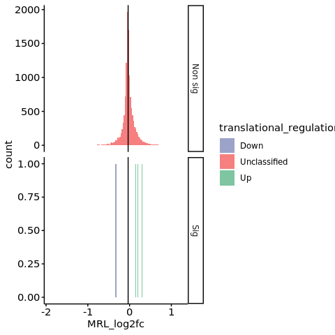

s8-1-1 gene level translationa analysis
================
Yoichiro Sugimoto
18 May, 2022

  - [Overview](#overview)
  - [Read raw and normalize count
    table](#read-raw-and-normalize-count-table)
  - [Data pre-processing](#data-pre-processing)
  - [Preparation of data necessary for running
    DESEeq2](#preparation-of-data-necessary-for-running-deseeq2)
      - [Rdata for development](#rdata-for-development)
  - [Analysis of the effect of VHL](#analysis-of-the-effect-of-vhl)
      - [RCC-4 noVHL vs RCC-4 VHL](#rcc-4-novhl-vs-rcc-4-vhl)
      - [RCC-4 noVHL Torin-1 vs no
        treatment](#rcc-4-novhl-torin-1-vs-no-treatment)
      - [RCC-4 VHL treated with Torin-1 vs no
        treatment](#rcc-4-vhl-treated-with-torin-1-vs-no-treatment)
      - [786-O noVHL vs 786-O VHL](#o-novhl-vs-786-o-vhl)
  - [EIF4E2 dependent translation
    changes](#eif4e2-dependent-translation-changes)
      - [786-O vs 786-O EIF4E2 KO](#o-vs-786-o-eif4e2-ko)
      - [786-O VHL vs 786-O VHL EIF4E2
        KO](#o-vhl-vs-786-o-vhl-eif4e2-ko)
  - [Session information](#session-information)

# Overview

Gene level changes in translation upon VHL loss or Torin 1 treatment
will be examined.

``` r
knitr::opts_chunk$set(collapse = TRUE)
```

``` r

## Data analysis
library("tidymodels")
library("matrixStats")
## Data visualization
library("ggrepel")
## Bioconductor
library("DESeq2")
## Parallelization
## Specify the number of CPUs to be used
processors <- 8
library("BiocParallel")
register(MulticoreParam(processors))

temp <- sapply(list.files("../functions", full.names = TRUE), source)
temp <- sapply(list.files("./functions", full.names = TRUE), source, chdir = TRUE)
## [1] "Sample file used: /camp/lab/ratcliffep/home/users/sugimoy/CAMP_HPC/projects/20211102_HP5_HIF_mTOR/data/sample_data/processed_sample_file.csv"
## [1] "The following objects are exported: poly.coldata.df, poly.sample.dt, translation.comparison.dt"
## [1] "In translation.comparison.dt, xx specifies the factor compared where the comparison is specified after __, while yy is a wildcard. From left, each factor specifies cell, VHL, EIF4E2, clone, and treatment"
## [1] "The following functions were exported: analyzeDtg(), subsetColdata()"

set.seed(0)
```

``` r

## sample.file <- file.path("../../data/sample_data/processed_sample_file.csv")
annot.dir <- normalizePath(file.path("../../annotation/"))
annot.ps.dir <- file.path(annot.dir, "hg38_annotation/processed_data/")
annot.R.file <- list.files(
    annot.ps.dir,
    pattern = glob2rx("*primary_transcript_annotation*.rdata"),
    full.names = TRUE
)
load(annot.R.file)

results.dir <- file.path("../../results")

s3.alignment.stats.dir <- file.path(results.dir, "s3-alignment-statistics")
s3.4.poly.size.factor.dir <- file.path(s3.alignment.stats.dir, "polysome_size_factor")

s4.tss.dir <- file.path(results.dir, "s4-tss-definition-and-tx-assignment")
s4.1.tss.def.dir <- file.path(s4.tss.dir, "s4-1-tss-definition")
s4.1.7.count.per.tss.dir <- file.path(s4.1.tss.def.dir, "s4-1-7-count-per-tss")
s4.2.tx.assignment.dir <- file.path(s4.tss.dir, "s4-2-transcript-assignment")
s4.2.1.tss.tx.map.RCC4.dir <- file.path(s4.2.tx.assignment.dir, "s4-2-1-tss-transcript-mapping-RCC4")

s8.dir <- file.path(results.dir, "s8-analysis-of-translation")
s8.1.dir <- file.path(s8.dir, "s8-1-differentially-translated-mRNAs")
s8.1.1.dir <- file.path(s8.1.dir, "gene-level-dte")

create.dirs(c(
  s8.dir,
  s8.1.dir,
  s8.1.1.dir
))
```

# Read raw and normalize count table

``` r

## Order should match the order of poly.sample.dt
poly.coldata.df <- poly.coldata.df[
    rownames(poly.coldata.df) %in% poly.sample.dt[, sample_name],
    ]
poly.coldata.df <- poly.coldata.df[
    order(match(rownames(poly.coldata.df), poly.sample.dt[, sample_name])), 
    ]

sample.names <- poly.sample.dt[, sample_name]

count.per.tss.file <- file.path(s4.1.7.count.per.tss.dir, "count-per-confident-tss.csv")
count.per.tss.dt <- fread(count.per.tss.file)

poly.count.per.tss.dt <- count.per.tss.dt[
  , c("tss_name", grep("polysome_", colnames(count.per.tss.dt), value = TRUE)),
    with = FALSE
]

colnames(poly.count.per.tss.dt) <- colnames(poly.count.per.tss.dt) %>%
    gsub("polysome_", "", .)

poly.count.per.tss.dt <- poly.count.per.tss.dt[
  , c("tss_name", poly.sample.dt[, sample_name]), with = FALSE
]


## Summarize the count by gene
poly.count.per.gene.dt <- countByGeneFromTss(poly.count.per.tss.dt)

## Read normalization factor
poly.sizefactor.dt <- fread(
    file = file.path(
        s3.4.poly.size.factor.dir,
        "library_size_factor_by_ERCC.csv"
    )
)

poly.sizefactor.with.ribo0.dt <- fread(
    file = file.path(
        s3.4.poly.size.factor.dir,
        "library_size_factor_with_ribo0_by_ERCC.csv"
    )
)
```

# Data pre-processing

``` r

ref.column.name <- "gene_id"
annot.cols <- c("gene_name", "biotype")

poly.count.per.gene.with.meta.dt <- merge(
    primary.tx.dt[!duplicated(gene_id), .(gene_id, gene_name, biotype)],
    poly.count.per.gene.dt,
    by = "gene_id"
)

poly.tss.count.dt <- cbind(
  poly.count.per.gene.with.meta.dt[, c(ref.column.name, annot.cols), with = FALSE], 
  poly.count.per.gene.with.meta.dt[, colnames(poly.count.per.gene.with.meta.dt) %in% poly.sample.dt[, sample_name], with = FALSE]
)
```

# Preparation of data necessary for running DESEeq2

``` r

countDt2Df <- function(count.dt, coldata.df, ref.column.name = "tss_name", annot.cols){
    count.df <- as.data.frame(count.dt)
    rownames(count.df) <- count.df[, ref.column.name]
    annot.df <- count.df[, c(ref.column.name, annot.cols)]
    count.df <- count.df[, rownames(coldata.df)]
    return(list(count.df = count.df, annot.df = annot.df))
}

deseq2.poly.in.list <- countDt2Df(
    poly.tss.count.dt,
    poly.coldata.df,
    ref.column.name = ref.column.name, annot.cols = annot.cols
)

if(!all(colnames(deseq2.poly.in.list$count.df) == rownames(poly.coldata.df))){
    stop("colnames of count.df does not match with rownames of poly.coldata.df")
} else {"OK"}
## [1] "OK"

annot.dt <- data.table(deseq2.poly.in.list$annot.df)
setkeyv(annot.dt, ref.column.name)
```

## Rdata for development

``` r

s8.1.rdata <- file.path(s8.1.dir, "s8.1.test.analyzeDtg.Rdata")

save(
    deseq2.poly.in.list,
    translation.comparison.dt,
    poly.coldata.df,
    s8.1.dir,
    file = s8.1.rdata
)
```

# Analysis of the effect of VHL

## RCC-4 noVHL vs RCC-4 VHL

``` r

## Select necessary data frame
sl.translation.comparison.dt <- translation.comparison.dt[1, ]
print("The following data will be analyzed:")
## [1] "The following data will be analyzed:"
print(sl.translation.comparison.dt)
##                            comparison                    exp_formula
## 1: RCC4_xx_EIF4E2_yy_NA__noVHL_vs_VHL ~fraction + VHL + fraction:VHL

test.poly.coldata.df <- subsetColdata(sl.translation.comparison.dt[, comparison], poly.coldata.df)

temp <- analyzeDtg(
    count.df = deseq2.poly.in.list$count.df,
    annot.df = deseq2.poly.in.list$annot.df,
    ref.column.name = ref.column.name,
    comparison.name = sl.translation.comparison.dt[1, comparison],
    deseq2.formula = sl.translation.comparison.dt[, exp_formula][[1]],
    input.sample.data.df = test.poly.coldata.df,
    poly.sizefactor.dt = poly.sizefactor.dt,
    sizefactor.col = "size_factor",
    s8.1.dir = s8.1.1.dir,
    processors = processors
)
## [1] "The data that will be used for this analysis"
##                                 cell   VHL EIF4E2 gRNA_id clone treatment
## RCC4_VHL_EIF4E2_NA_1_NA_ribo1   RCC4   VHL EIF4E2      NA    11        NA
## RCC4_VHL_EIF4E2_NA_1_NA_ribo2   RCC4   VHL EIF4E2      NA    11        NA
## RCC4_VHL_EIF4E2_NA_1_NA_ribo3   RCC4   VHL EIF4E2      NA    11        NA
## RCC4_VHL_EIF4E2_NA_1_NA_ribo4   RCC4   VHL EIF4E2      NA    11        NA
## RCC4_VHL_EIF4E2_NA_1_NA_ribo5   RCC4   VHL EIF4E2      NA    11        NA
## RCC4_VHL_EIF4E2_NA_1_NA_ribo6   RCC4   VHL EIF4E2      NA    11        NA
## RCC4_VHL_EIF4E2_NA_1_NA_ribo7   RCC4   VHL EIF4E2      NA    11        NA
## RCC4_VHL_EIF4E2_NA_1_NA_ribo8   RCC4   VHL EIF4E2      NA    11        NA
## RCC4_VHL_EIF4E2_NA_3_NA_ribo1   RCC4   VHL EIF4E2      NA    13        NA
## RCC4_VHL_EIF4E2_NA_3_NA_ribo2   RCC4   VHL EIF4E2      NA    13        NA
## RCC4_VHL_EIF4E2_NA_3_NA_ribo3   RCC4   VHL EIF4E2      NA    13        NA
## RCC4_VHL_EIF4E2_NA_3_NA_ribo4   RCC4   VHL EIF4E2      NA    13        NA
## RCC4_VHL_EIF4E2_NA_3_NA_ribo5   RCC4   VHL EIF4E2      NA    13        NA
## RCC4_VHL_EIF4E2_NA_3_NA_ribo6   RCC4   VHL EIF4E2      NA    13        NA
## RCC4_VHL_EIF4E2_NA_3_NA_ribo7   RCC4   VHL EIF4E2      NA    13        NA
## RCC4_VHL_EIF4E2_NA_3_NA_ribo8   RCC4   VHL EIF4E2      NA    13        NA
## RCC4_VHL_EIF4E2_NA_4_NA_ribo1   RCC4   VHL EIF4E2      NA    14        NA
## RCC4_VHL_EIF4E2_NA_4_NA_ribo2   RCC4   VHL EIF4E2      NA    14        NA
## RCC4_VHL_EIF4E2_NA_4_NA_ribo3   RCC4   VHL EIF4E2      NA    14        NA
## RCC4_VHL_EIF4E2_NA_4_NA_ribo4   RCC4   VHL EIF4E2      NA    14        NA
## RCC4_VHL_EIF4E2_NA_4_NA_ribo5   RCC4   VHL EIF4E2      NA    14        NA
## RCC4_VHL_EIF4E2_NA_4_NA_ribo6   RCC4   VHL EIF4E2      NA    14        NA
## RCC4_VHL_EIF4E2_NA_4_NA_ribo7   RCC4   VHL EIF4E2      NA    14        NA
## RCC4_VHL_EIF4E2_NA_4_NA_ribo8   RCC4   VHL EIF4E2      NA    14        NA
## RCC4_noVHL_EIF4E2_NA_1_NA_ribo1 RCC4 noVHL EIF4E2      NA     1        NA
## RCC4_noVHL_EIF4E2_NA_1_NA_ribo2 RCC4 noVHL EIF4E2      NA     1        NA
## RCC4_noVHL_EIF4E2_NA_1_NA_ribo3 RCC4 noVHL EIF4E2      NA     1        NA
## RCC4_noVHL_EIF4E2_NA_1_NA_ribo4 RCC4 noVHL EIF4E2      NA     1        NA
## RCC4_noVHL_EIF4E2_NA_1_NA_ribo5 RCC4 noVHL EIF4E2      NA     1        NA
## RCC4_noVHL_EIF4E2_NA_1_NA_ribo6 RCC4 noVHL EIF4E2      NA     1        NA
## RCC4_noVHL_EIF4E2_NA_1_NA_ribo7 RCC4 noVHL EIF4E2      NA     1        NA
## RCC4_noVHL_EIF4E2_NA_1_NA_ribo8 RCC4 noVHL EIF4E2      NA     1        NA
## RCC4_noVHL_EIF4E2_NA_3_NA_ribo1 RCC4 noVHL EIF4E2      NA     3        NA
## RCC4_noVHL_EIF4E2_NA_3_NA_ribo2 RCC4 noVHL EIF4E2      NA     3        NA
## RCC4_noVHL_EIF4E2_NA_3_NA_ribo3 RCC4 noVHL EIF4E2      NA     3        NA
## RCC4_noVHL_EIF4E2_NA_3_NA_ribo4 RCC4 noVHL EIF4E2      NA     3        NA
## RCC4_noVHL_EIF4E2_NA_3_NA_ribo5 RCC4 noVHL EIF4E2      NA     3        NA
## RCC4_noVHL_EIF4E2_NA_3_NA_ribo6 RCC4 noVHL EIF4E2      NA     3        NA
## RCC4_noVHL_EIF4E2_NA_3_NA_ribo7 RCC4 noVHL EIF4E2      NA     3        NA
## RCC4_noVHL_EIF4E2_NA_3_NA_ribo8 RCC4 noVHL EIF4E2      NA     3        NA
## RCC4_noVHL_EIF4E2_NA_4_NA_ribo1 RCC4 noVHL EIF4E2      NA     4        NA
## RCC4_noVHL_EIF4E2_NA_4_NA_ribo2 RCC4 noVHL EIF4E2      NA     4        NA
## RCC4_noVHL_EIF4E2_NA_4_NA_ribo3 RCC4 noVHL EIF4E2      NA     4        NA
## RCC4_noVHL_EIF4E2_NA_4_NA_ribo4 RCC4 noVHL EIF4E2      NA     4        NA
## RCC4_noVHL_EIF4E2_NA_4_NA_ribo5 RCC4 noVHL EIF4E2      NA     4        NA
## RCC4_noVHL_EIF4E2_NA_4_NA_ribo6 RCC4 noVHL EIF4E2      NA     4        NA
## RCC4_noVHL_EIF4E2_NA_4_NA_ribo7 RCC4 noVHL EIF4E2      NA     4        NA
## RCC4_noVHL_EIF4E2_NA_4_NA_ribo8 RCC4 noVHL EIF4E2      NA     4        NA
##                                 fraction
## RCC4_VHL_EIF4E2_NA_1_NA_ribo1      ribo1
## RCC4_VHL_EIF4E2_NA_1_NA_ribo2      ribo2
## RCC4_VHL_EIF4E2_NA_1_NA_ribo3      ribo3
## RCC4_VHL_EIF4E2_NA_1_NA_ribo4      ribo4
## RCC4_VHL_EIF4E2_NA_1_NA_ribo5      ribo5
## RCC4_VHL_EIF4E2_NA_1_NA_ribo6      ribo6
## RCC4_VHL_EIF4E2_NA_1_NA_ribo7      ribo7
## RCC4_VHL_EIF4E2_NA_1_NA_ribo8      ribo8
## RCC4_VHL_EIF4E2_NA_3_NA_ribo1      ribo1
## RCC4_VHL_EIF4E2_NA_3_NA_ribo2      ribo2
## RCC4_VHL_EIF4E2_NA_3_NA_ribo3      ribo3
## RCC4_VHL_EIF4E2_NA_3_NA_ribo4      ribo4
## RCC4_VHL_EIF4E2_NA_3_NA_ribo5      ribo5
## RCC4_VHL_EIF4E2_NA_3_NA_ribo6      ribo6
## RCC4_VHL_EIF4E2_NA_3_NA_ribo7      ribo7
## RCC4_VHL_EIF4E2_NA_3_NA_ribo8      ribo8
## RCC4_VHL_EIF4E2_NA_4_NA_ribo1      ribo1
## RCC4_VHL_EIF4E2_NA_4_NA_ribo2      ribo2
## RCC4_VHL_EIF4E2_NA_4_NA_ribo3      ribo3
## RCC4_VHL_EIF4E2_NA_4_NA_ribo4      ribo4
## RCC4_VHL_EIF4E2_NA_4_NA_ribo5      ribo5
## RCC4_VHL_EIF4E2_NA_4_NA_ribo6      ribo6
## RCC4_VHL_EIF4E2_NA_4_NA_ribo7      ribo7
## RCC4_VHL_EIF4E2_NA_4_NA_ribo8      ribo8
## RCC4_noVHL_EIF4E2_NA_1_NA_ribo1    ribo1
## RCC4_noVHL_EIF4E2_NA_1_NA_ribo2    ribo2
## RCC4_noVHL_EIF4E2_NA_1_NA_ribo3    ribo3
## RCC4_noVHL_EIF4E2_NA_1_NA_ribo4    ribo4
## RCC4_noVHL_EIF4E2_NA_1_NA_ribo5    ribo5
## RCC4_noVHL_EIF4E2_NA_1_NA_ribo6    ribo6
## RCC4_noVHL_EIF4E2_NA_1_NA_ribo7    ribo7
## RCC4_noVHL_EIF4E2_NA_1_NA_ribo8    ribo8
## RCC4_noVHL_EIF4E2_NA_3_NA_ribo1    ribo1
## RCC4_noVHL_EIF4E2_NA_3_NA_ribo2    ribo2
## RCC4_noVHL_EIF4E2_NA_3_NA_ribo3    ribo3
## RCC4_noVHL_EIF4E2_NA_3_NA_ribo4    ribo4
## RCC4_noVHL_EIF4E2_NA_3_NA_ribo5    ribo5
## RCC4_noVHL_EIF4E2_NA_3_NA_ribo6    ribo6
## RCC4_noVHL_EIF4E2_NA_3_NA_ribo7    ribo7
## RCC4_noVHL_EIF4E2_NA_3_NA_ribo8    ribo8
## RCC4_noVHL_EIF4E2_NA_4_NA_ribo1    ribo1
## RCC4_noVHL_EIF4E2_NA_4_NA_ribo2    ribo2
## RCC4_noVHL_EIF4E2_NA_4_NA_ribo3    ribo3
## RCC4_noVHL_EIF4E2_NA_4_NA_ribo4    ribo4
## RCC4_noVHL_EIF4E2_NA_4_NA_ribo5    ribo5
## RCC4_noVHL_EIF4E2_NA_4_NA_ribo6    ribo6
## RCC4_noVHL_EIF4E2_NA_4_NA_ribo7    ribo7
## RCC4_noVHL_EIF4E2_NA_4_NA_ribo8    ribo8
## [1] "MRL calculation"
## [1] "QC stats for library size normalization"
##                         sample_name size_factor original_libsize int_libsize
##  1:   RCC4_VHL_EIF4E2_NA_1_NA_ribo1   1.1063566          2766668   2500701.8
##  2:   RCC4_VHL_EIF4E2_NA_1_NA_ribo2   0.8781723          2131050   2426687.9
##  3:   RCC4_VHL_EIF4E2_NA_1_NA_ribo3   1.0814933          2885407   2667984.2
##  4:   RCC4_VHL_EIF4E2_NA_1_NA_ribo4   1.4437862          3912317   2709762.0
##  5:   RCC4_VHL_EIF4E2_NA_1_NA_ribo5   2.2634766          4596016   2030511.8
##  6:   RCC4_VHL_EIF4E2_NA_1_NA_ribo6   1.5445005          2813446   1821589.6
##  7:   RCC4_VHL_EIF4E2_NA_1_NA_ribo7   1.3413964          2010118   1498526.4
##  8:   RCC4_VHL_EIF4E2_NA_1_NA_ribo8   1.2478055          2479874   1987388.2
##  9:   RCC4_VHL_EIF4E2_NA_3_NA_ribo1   0.8483924          2977331   3509379.6
## 10:   RCC4_VHL_EIF4E2_NA_3_NA_ribo2   1.2692252          2493389   1964496.9
## 11:   RCC4_VHL_EIF4E2_NA_3_NA_ribo3   1.3170192          3122923   2371205.4
## 12:   RCC4_VHL_EIF4E2_NA_3_NA_ribo4   1.3745954          3277438   2384292.8
## 13:   RCC4_VHL_EIF4E2_NA_3_NA_ribo5   1.2145968          2005800   1651412.3
## 14:   RCC4_VHL_EIF4E2_NA_3_NA_ribo6   1.2721342          2056568   1616628.2
## 15:   RCC4_VHL_EIF4E2_NA_3_NA_ribo7   1.9860740          2340543   1178477.2
## 16:   RCC4_VHL_EIF4E2_NA_3_NA_ribo8   1.4989680          2144760   1430824.4
## 17:   RCC4_VHL_EIF4E2_NA_4_NA_ribo1   0.8263641          3501594   4237350.1
## 18:   RCC4_VHL_EIF4E2_NA_4_NA_ribo2   0.7760036          2652737   3418459.5
## 19:   RCC4_VHL_EIF4E2_NA_4_NA_ribo3   0.7965285          2418539   3036349.6
## 20:   RCC4_VHL_EIF4E2_NA_4_NA_ribo4   0.7525625          2528416   3359742.2
## 21:   RCC4_VHL_EIF4E2_NA_4_NA_ribo5   1.0570272          2683358   2538589.3
## 22:   RCC4_VHL_EIF4E2_NA_4_NA_ribo6   1.1085307          2242676   2023106.8
## 23:   RCC4_VHL_EIF4E2_NA_4_NA_ribo7   1.2778822          2050467   1604582.2
## 24:   RCC4_VHL_EIF4E2_NA_4_NA_ribo8   0.7259219          1249056   1720647.8
## 25: RCC4_noVHL_EIF4E2_NA_1_NA_ribo1   1.5607112          4876596   3124598.5
## 26: RCC4_noVHL_EIF4E2_NA_1_NA_ribo2   1.8067549          4182162   2314736.7
## 27: RCC4_noVHL_EIF4E2_NA_1_NA_ribo3   1.2706537          2954162   2324915.1
## 28: RCC4_noVHL_EIF4E2_NA_1_NA_ribo4   1.4447116          2074640   1436023.6
## 29: RCC4_noVHL_EIF4E2_NA_1_NA_ribo5   1.6267255          2691049   1654273.6
## 30: RCC4_noVHL_EIF4E2_NA_1_NA_ribo6   1.5920121          1919886   1205949.4
## 31: RCC4_noVHL_EIF4E2_NA_1_NA_ribo7   1.8819237          1864488    990735.2
## 32: RCC4_noVHL_EIF4E2_NA_1_NA_ribo8   1.2702308          1486229   1170046.4
## 33: RCC4_noVHL_EIF4E2_NA_3_NA_ribo1   0.8085163          3249272   4018808.2
## 34: RCC4_noVHL_EIF4E2_NA_3_NA_ribo2   0.9069361          2741826   3023174.5
## 35: RCC4_noVHL_EIF4E2_NA_3_NA_ribo3   1.1309970          2569527   2271913.1
## 36: RCC4_noVHL_EIF4E2_NA_3_NA_ribo4   1.5060570          3434355   2280361.9
## 37: RCC4_noVHL_EIF4E2_NA_3_NA_ribo5   1.2592626          2499982   1985274.6
## 38: RCC4_noVHL_EIF4E2_NA_3_NA_ribo6   1.4750154          2245113   1522094.6
## 39: RCC4_noVHL_EIF4E2_NA_3_NA_ribo7   1.3774621          1927014   1398959.7
## 40: RCC4_noVHL_EIF4E2_NA_3_NA_ribo8   1.2151485          1709447   1406780.4
## 41: RCC4_noVHL_EIF4E2_NA_4_NA_ribo1   0.9415605          4890889   5194450.0
## 42: RCC4_noVHL_EIF4E2_NA_4_NA_ribo2   0.6656061          2433736   3656420.8
## 43: RCC4_noVHL_EIF4E2_NA_4_NA_ribo3   1.0494507          2466978   2350732.6
## 44: RCC4_noVHL_EIF4E2_NA_4_NA_ribo4   1.1417216          2586975   2265854.5
## 45: RCC4_noVHL_EIF4E2_NA_4_NA_ribo5   1.3212339          2608452   1974254.6
## 46: RCC4_noVHL_EIF4E2_NA_4_NA_ribo6   1.1054383          1612131   1458363.6
## 47: RCC4_noVHL_EIF4E2_NA_4_NA_ribo7   1.4213778          1383911    973640.5
## 48: RCC4_noVHL_EIF4E2_NA_4_NA_ribo8   0.8054037           948946   1178224.0
##                         sample_name size_factor original_libsize int_libsize
##     norm_libsize
##  1:    1123182.3
##  2:    1089939.2
##  3:    1198316.6
##  4:    1217081.0
##  5:     911998.0
##  6:     818161.2
##  7:     673058.4
##  8:     892629.1
##  9:    1576226.7
## 10:     882347.6
## 11:    1065019.4
## 12:    1070897.6
## 13:     741726.6
## 14:     726103.5
## 15:     529309.3
## 16:     642650.2
## 17:    1903192.4
## 18:    1535390.3
## 19:    1363766.8
## 20:    1509017.6
## 21:    1140199.4
## 22:     908672.0
## 23:     720693.0
## 24:     772823.5
## 25:    1403403.5
## 26:    1039656.7
## 27:    1044228.3
## 28:     644985.5
## 29:     743011.7
## 30:     541648.4
## 31:     444985.6
## 32:     525522.6
## 33:    1805035.0
## 34:    1357849.3
## 35:    1020422.6
## 36:    1024217.3
## 37:     891679.8
## 38:     683644.0
## 39:     628338.3
## 40:     631850.9
## 41:    2333070.8
## 42:    1642269.8
## 43:    1055824.1
## 44:    1017701.4
## 45:     886730.2
## 46:     655019.4
## 47:     437307.5
## 48:     529195.6
##     norm_libsize
## [1] "no analysis with ribo0 fractions"
## [1] "LRT comparison"
## [1] "Formula for LRT comparison: ~fraction + VHL + fraction:VHL"
## [1] "Reduced formula for LRT comparison: ~fraction + VHL"
## Warning in DESeqDataSet(se, design = design, ignoreRank): some variables in
## design formula are characters, converting to factors
## Warning: Removed 1 rows containing non-finite values (stat_bin).
```

<!-- -->

## RCC-4 noVHL Torin-1 vs no treatment

``` r

## Select necessary data frame
sl.translation.comparison.dt <- translation.comparison.dt[2, ]
print("The following data will be analyzed:")
## [1] "The following data will be analyzed:"
print(sl.translation.comparison.dt)
##                               comparison
## 1: RCC4_noVHL_EIF4E2_yy_xx__Torin1_vs_NA
##                                   exp_formula
## 1: ~fraction + treatment + fraction:treatment

test.poly.coldata.df <- subsetColdata(sl.translation.comparison.dt[, comparison], poly.coldata.df)
test.poly.coldata.df <- test.poly.coldata.df[
    !grepl(
         "RCC4_noVHL_EIF4E2_NA_1_Torin1_(cyto|ribo[[:digit:]]|ribo[[:digit:]](A|B))_1",
         rownames(test.poly.coldata.df)
     ), ]

temp <- analyzeDtg(
    count.df = deseq2.poly.in.list$count.df,
    annot.df = deseq2.poly.in.list$annot.df,
    ref.column.name = ref.column.name,
    comparison.name = sl.translation.comparison.dt[1, comparison],
    deseq2.formula = sl.translation.comparison.dt[, exp_formula][[1]],
    input.sample.data.df = test.poly.coldata.df,
    poly.sizefactor.dt = poly.sizefactor.dt,
    sizefactor.col = "size_factor",
    s8.1.dir = s8.1.1.dir,
    processors = processors
)
## [1] "The data that will be used for this analysis"
##                                     cell   VHL EIF4E2 gRNA_id clone treatment
## RCC4_noVHL_EIF4E2_NA_1_NA_ribo1     RCC4 noVHL EIF4E2      NA     1        NA
## RCC4_noVHL_EIF4E2_NA_1_NA_ribo2     RCC4 noVHL EIF4E2      NA     1        NA
## RCC4_noVHL_EIF4E2_NA_1_NA_ribo3     RCC4 noVHL EIF4E2      NA     1        NA
## RCC4_noVHL_EIF4E2_NA_1_NA_ribo4     RCC4 noVHL EIF4E2      NA     1        NA
## RCC4_noVHL_EIF4E2_NA_1_NA_ribo5     RCC4 noVHL EIF4E2      NA     1        NA
## RCC4_noVHL_EIF4E2_NA_1_NA_ribo6     RCC4 noVHL EIF4E2      NA     1        NA
## RCC4_noVHL_EIF4E2_NA_1_NA_ribo7     RCC4 noVHL EIF4E2      NA     1        NA
## RCC4_noVHL_EIF4E2_NA_1_NA_ribo8     RCC4 noVHL EIF4E2      NA     1        NA
## RCC4_noVHL_EIF4E2_NA_3_NA_ribo1     RCC4 noVHL EIF4E2      NA     3        NA
## RCC4_noVHL_EIF4E2_NA_3_NA_ribo2     RCC4 noVHL EIF4E2      NA     3        NA
## RCC4_noVHL_EIF4E2_NA_3_NA_ribo3     RCC4 noVHL EIF4E2      NA     3        NA
## RCC4_noVHL_EIF4E2_NA_3_NA_ribo4     RCC4 noVHL EIF4E2      NA     3        NA
## RCC4_noVHL_EIF4E2_NA_3_NA_ribo5     RCC4 noVHL EIF4E2      NA     3        NA
## RCC4_noVHL_EIF4E2_NA_3_NA_ribo6     RCC4 noVHL EIF4E2      NA     3        NA
## RCC4_noVHL_EIF4E2_NA_3_NA_ribo7     RCC4 noVHL EIF4E2      NA     3        NA
## RCC4_noVHL_EIF4E2_NA_3_NA_ribo8     RCC4 noVHL EIF4E2      NA     3        NA
## RCC4_noVHL_EIF4E2_NA_4_NA_ribo1     RCC4 noVHL EIF4E2      NA     4        NA
## RCC4_noVHL_EIF4E2_NA_4_NA_ribo2     RCC4 noVHL EIF4E2      NA     4        NA
## RCC4_noVHL_EIF4E2_NA_4_NA_ribo3     RCC4 noVHL EIF4E2      NA     4        NA
## RCC4_noVHL_EIF4E2_NA_4_NA_ribo4     RCC4 noVHL EIF4E2      NA     4        NA
## RCC4_noVHL_EIF4E2_NA_4_NA_ribo5     RCC4 noVHL EIF4E2      NA     4        NA
## RCC4_noVHL_EIF4E2_NA_4_NA_ribo6     RCC4 noVHL EIF4E2      NA     4        NA
## RCC4_noVHL_EIF4E2_NA_4_NA_ribo7     RCC4 noVHL EIF4E2      NA     4        NA
## RCC4_noVHL_EIF4E2_NA_4_NA_ribo8     RCC4 noVHL EIF4E2      NA     4        NA
## RCC4_noVHL_EIF4E2_NA_3_Torin1_ribo1 RCC4 noVHL EIF4E2      NA     3    Torin1
## RCC4_noVHL_EIF4E2_NA_3_Torin1_ribo2 RCC4 noVHL EIF4E2      NA     3    Torin1
## RCC4_noVHL_EIF4E2_NA_3_Torin1_ribo3 RCC4 noVHL EIF4E2      NA     3    Torin1
## RCC4_noVHL_EIF4E2_NA_3_Torin1_ribo4 RCC4 noVHL EIF4E2      NA     3    Torin1
## RCC4_noVHL_EIF4E2_NA_3_Torin1_ribo5 RCC4 noVHL EIF4E2      NA     3    Torin1
## RCC4_noVHL_EIF4E2_NA_3_Torin1_ribo6 RCC4 noVHL EIF4E2      NA     3    Torin1
## RCC4_noVHL_EIF4E2_NA_3_Torin1_ribo7 RCC4 noVHL EIF4E2      NA     3    Torin1
## RCC4_noVHL_EIF4E2_NA_3_Torin1_ribo8 RCC4 noVHL EIF4E2      NA     3    Torin1
## RCC4_noVHL_EIF4E2_NA_4_Torin1_ribo1 RCC4 noVHL EIF4E2      NA     4    Torin1
## RCC4_noVHL_EIF4E2_NA_4_Torin1_ribo2 RCC4 noVHL EIF4E2      NA     4    Torin1
## RCC4_noVHL_EIF4E2_NA_4_Torin1_ribo3 RCC4 noVHL EIF4E2      NA     4    Torin1
## RCC4_noVHL_EIF4E2_NA_4_Torin1_ribo4 RCC4 noVHL EIF4E2      NA     4    Torin1
## RCC4_noVHL_EIF4E2_NA_4_Torin1_ribo5 RCC4 noVHL EIF4E2      NA     4    Torin1
## RCC4_noVHL_EIF4E2_NA_4_Torin1_ribo6 RCC4 noVHL EIF4E2      NA     4    Torin1
## RCC4_noVHL_EIF4E2_NA_4_Torin1_ribo7 RCC4 noVHL EIF4E2      NA     4    Torin1
## RCC4_noVHL_EIF4E2_NA_4_Torin1_ribo8 RCC4 noVHL EIF4E2      NA     4    Torin1
##                                     fraction
## RCC4_noVHL_EIF4E2_NA_1_NA_ribo1        ribo1
## RCC4_noVHL_EIF4E2_NA_1_NA_ribo2        ribo2
## RCC4_noVHL_EIF4E2_NA_1_NA_ribo3        ribo3
## RCC4_noVHL_EIF4E2_NA_1_NA_ribo4        ribo4
## RCC4_noVHL_EIF4E2_NA_1_NA_ribo5        ribo5
## RCC4_noVHL_EIF4E2_NA_1_NA_ribo6        ribo6
## RCC4_noVHL_EIF4E2_NA_1_NA_ribo7        ribo7
## RCC4_noVHL_EIF4E2_NA_1_NA_ribo8        ribo8
## RCC4_noVHL_EIF4E2_NA_3_NA_ribo1        ribo1
## RCC4_noVHL_EIF4E2_NA_3_NA_ribo2        ribo2
## RCC4_noVHL_EIF4E2_NA_3_NA_ribo3        ribo3
## RCC4_noVHL_EIF4E2_NA_3_NA_ribo4        ribo4
## RCC4_noVHL_EIF4E2_NA_3_NA_ribo5        ribo5
## RCC4_noVHL_EIF4E2_NA_3_NA_ribo6        ribo6
## RCC4_noVHL_EIF4E2_NA_3_NA_ribo7        ribo7
## RCC4_noVHL_EIF4E2_NA_3_NA_ribo8        ribo8
## RCC4_noVHL_EIF4E2_NA_4_NA_ribo1        ribo1
## RCC4_noVHL_EIF4E2_NA_4_NA_ribo2        ribo2
## RCC4_noVHL_EIF4E2_NA_4_NA_ribo3        ribo3
## RCC4_noVHL_EIF4E2_NA_4_NA_ribo4        ribo4
## RCC4_noVHL_EIF4E2_NA_4_NA_ribo5        ribo5
## RCC4_noVHL_EIF4E2_NA_4_NA_ribo6        ribo6
## RCC4_noVHL_EIF4E2_NA_4_NA_ribo7        ribo7
## RCC4_noVHL_EIF4E2_NA_4_NA_ribo8        ribo8
## RCC4_noVHL_EIF4E2_NA_3_Torin1_ribo1    ribo1
## RCC4_noVHL_EIF4E2_NA_3_Torin1_ribo2    ribo2
## RCC4_noVHL_EIF4E2_NA_3_Torin1_ribo3    ribo3
## RCC4_noVHL_EIF4E2_NA_3_Torin1_ribo4    ribo4
## RCC4_noVHL_EIF4E2_NA_3_Torin1_ribo5    ribo5
## RCC4_noVHL_EIF4E2_NA_3_Torin1_ribo6    ribo6
## RCC4_noVHL_EIF4E2_NA_3_Torin1_ribo7    ribo7
## RCC4_noVHL_EIF4E2_NA_3_Torin1_ribo8    ribo8
## RCC4_noVHL_EIF4E2_NA_4_Torin1_ribo1    ribo1
## RCC4_noVHL_EIF4E2_NA_4_Torin1_ribo2    ribo2
## RCC4_noVHL_EIF4E2_NA_4_Torin1_ribo3    ribo3
## RCC4_noVHL_EIF4E2_NA_4_Torin1_ribo4    ribo4
## RCC4_noVHL_EIF4E2_NA_4_Torin1_ribo5    ribo5
## RCC4_noVHL_EIF4E2_NA_4_Torin1_ribo6    ribo6
## RCC4_noVHL_EIF4E2_NA_4_Torin1_ribo7    ribo7
## RCC4_noVHL_EIF4E2_NA_4_Torin1_ribo8    ribo8
## [1] "MRL calculation"
## [1] "QC stats for library size normalization"
##                             sample_name size_factor original_libsize
##  1:     RCC4_noVHL_EIF4E2_NA_1_NA_ribo1   1.5607112          4876596
##  2:     RCC4_noVHL_EIF4E2_NA_1_NA_ribo2   1.8067549          4182162
##  3:     RCC4_noVHL_EIF4E2_NA_1_NA_ribo3   1.2706537          2954162
##  4:     RCC4_noVHL_EIF4E2_NA_1_NA_ribo4   1.4447116          2074640
##  5:     RCC4_noVHL_EIF4E2_NA_1_NA_ribo5   1.6267255          2691049
##  6:     RCC4_noVHL_EIF4E2_NA_1_NA_ribo6   1.5920121          1919886
##  7:     RCC4_noVHL_EIF4E2_NA_1_NA_ribo7   1.8819237          1864488
##  8:     RCC4_noVHL_EIF4E2_NA_1_NA_ribo8   1.2702308          1486229
##  9:     RCC4_noVHL_EIF4E2_NA_3_NA_ribo1   0.8085163          3249272
## 10:     RCC4_noVHL_EIF4E2_NA_3_NA_ribo2   0.9069361          2741826
## 11:     RCC4_noVHL_EIF4E2_NA_3_NA_ribo3   1.1309970          2569527
## 12:     RCC4_noVHL_EIF4E2_NA_3_NA_ribo4   1.5060570          3434355
## 13:     RCC4_noVHL_EIF4E2_NA_3_NA_ribo5   1.2592626          2499982
## 14:     RCC4_noVHL_EIF4E2_NA_3_NA_ribo6   1.4750154          2245113
## 15:     RCC4_noVHL_EIF4E2_NA_3_NA_ribo7   1.3774621          1927014
## 16:     RCC4_noVHL_EIF4E2_NA_3_NA_ribo8   1.2151485          1709447
## 17:     RCC4_noVHL_EIF4E2_NA_4_NA_ribo1   0.9415605          4890889
## 18:     RCC4_noVHL_EIF4E2_NA_4_NA_ribo2   0.6656061          2433736
## 19:     RCC4_noVHL_EIF4E2_NA_4_NA_ribo3   1.0494507          2466978
## 20:     RCC4_noVHL_EIF4E2_NA_4_NA_ribo4   1.1417216          2586975
## 21:     RCC4_noVHL_EIF4E2_NA_4_NA_ribo5   1.3212339          2608452
## 22:     RCC4_noVHL_EIF4E2_NA_4_NA_ribo6   1.1054383          1612131
## 23:     RCC4_noVHL_EIF4E2_NA_4_NA_ribo7   1.4213778          1383911
## 24:     RCC4_noVHL_EIF4E2_NA_4_NA_ribo8   0.8054037           948946
## 25: RCC4_noVHL_EIF4E2_NA_3_Torin1_ribo1   0.6177490          5709118
## 26: RCC4_noVHL_EIF4E2_NA_3_Torin1_ribo2   0.4914492          3042886
## 27: RCC4_noVHL_EIF4E2_NA_3_Torin1_ribo3   0.5563112          2311030
## 28: RCC4_noVHL_EIF4E2_NA_3_Torin1_ribo4   0.8127871          1723321
## 29: RCC4_noVHL_EIF4E2_NA_3_Torin1_ribo5   0.7438574          1050971
## 30: RCC4_noVHL_EIF4E2_NA_3_Torin1_ribo6   0.7400477           728823
## 31: RCC4_noVHL_EIF4E2_NA_3_Torin1_ribo7   1.2132175           483268
## 32: RCC4_noVHL_EIF4E2_NA_3_Torin1_ribo8   0.4836332           435545
## 33: RCC4_noVHL_EIF4E2_NA_4_Torin1_ribo1   0.6731371          5391667
## 34: RCC4_noVHL_EIF4E2_NA_4_Torin1_ribo2   0.4819827          2604435
## 35: RCC4_noVHL_EIF4E2_NA_4_Torin1_ribo3   0.7251222          1400455
## 36: RCC4_noVHL_EIF4E2_NA_4_Torin1_ribo4   0.8041843          1075206
## 37: RCC4_noVHL_EIF4E2_NA_4_Torin1_ribo5   1.0468952           717365
## 38: RCC4_noVHL_EIF4E2_NA_4_Torin1_ribo6   1.0251902           314135
## 39: RCC4_noVHL_EIF4E2_NA_4_Torin1_ribo7   1.0840835           209244
## 40: RCC4_noVHL_EIF4E2_NA_4_Torin1_ribo8   0.7419179           327217
##                             sample_name size_factor original_libsize
##     int_libsize norm_libsize
##  1:   3124598.5   1317110.50
##  2:   2314736.7    975729.86
##  3:   2324915.1    980020.34
##  4:   1436023.6    605326.35
##  5:   1654273.6    697325.14
##  6:   1205949.4    508343.26
##  7:    990735.2    417624.11
##  8:   1170046.4    493209.09
##  9:   4018808.2   1694046.28
## 10:   3023174.5   1274357.28
## 11:   2271913.1    957678.43
## 12:   2280361.9    961239.86
## 13:   1985274.6    836851.85
## 14:   1522094.6    641607.82
## 15:   1398959.7    589702.80
## 16:   1406780.4    592999.45
## 17:   5194450.0   2189614.00
## 18:   3656420.8   1541289.30
## 19:   2350732.6    990903.20
## 20:   2265854.5    955124.55
## 21:   1974254.6    832206.58
## 22:   1458363.6    614743.30
## 23:    973640.5    410418.21
## 24:   1178224.0    496656.19
## 25:   9241808.8   3895695.21
## 26:   6191658.9   2609966.99
## 27:   4154203.9   1751119.56
## 28:   2120261.3    893752.73
## 29:   1412866.2    595564.81
## 30:    984832.5    415135.96
## 31:    398335.8    167910.32
## 32:    900568.9    379616.37
## 33:   8009760.5   3376350.47
## 34:   5403586.5   2277771.22
## 35:   1931336.4    814115.32
## 36:   1337014.4    563591.04
## 37:    685231.0    288845.09
## 38:    306416.3    129163.52
## 39:    193014.7     81361.38
## 40:    441042.1    185912.25
##     int_libsize norm_libsize
## [1] "no analysis with ribo0 fractions"
## [1] "LRT comparison"
## [1] "Formula for LRT comparison: ~fraction + treatment + fraction:treatment"
## [1] "Reduced formula for LRT comparison: ~fraction + treatment"
## Warning in DESeqDataSet(se, design = design, ignoreRank): some variables in
## design formula are characters, converting to factors
## factor levels were dropped which had no samples
## Warning: Removed 16 rows containing non-finite values (stat_bin).
```

<!-- -->

## RCC-4 VHL treated with Torin-1 vs no treatment

``` r

## Select necessary data frame
sl.translation.comparison.dt <- translation.comparison.dt[3, ]
print("The following data will be analyzed:")
## [1] "The following data will be analyzed:"
print(sl.translation.comparison.dt)
##                             comparison
## 1: RCC4_VHL_EIF4E2_yy_xx__Torin1_vs_NA
##                                   exp_formula
## 1: ~fraction + treatment + fraction:treatment

test.poly.coldata.df <- subsetColdata(sl.translation.comparison.dt[, comparison], poly.coldata.df)

test.poly.coldata.df <- subsetColdata(sl.translation.comparison.dt[, comparison], poly.coldata.df)
test.poly.coldata.df <- test.poly.coldata.df[
    !grepl(
         "RCC4_VHL_EIF4E2_NA_1_Torin1_(cyto|ribo[[:digit:]]|ribo[[:digit:]](A|B))_1",
         rownames(test.poly.coldata.df)
     ), ]

temp <- analyzeDtg(
    count.df = deseq2.poly.in.list$count.df,
    annot.df = deseq2.poly.in.list$annot.df,
    ref.column.name = ref.column.name,
    comparison.name = sl.translation.comparison.dt[1, comparison],
    deseq2.formula = sl.translation.comparison.dt[, exp_formula][[1]],
    input.sample.data.df = test.poly.coldata.df,
    poly.sizefactor.dt = poly.sizefactor.dt,
    poly.sizefactor.with.ribo0.dt = poly.sizefactor.with.ribo0.dt,
    sizefactor.col = "size_factor",
    s8.1.dir = s8.1.1.dir,
    processors = processors
)
## [1] "The data that will be used for this analysis"
##                                   cell VHL EIF4E2 gRNA_id clone treatment
## RCC4_VHL_EIF4E2_NA_1_NA_ribo1     RCC4 VHL EIF4E2      NA    11        NA
## RCC4_VHL_EIF4E2_NA_1_NA_ribo2     RCC4 VHL EIF4E2      NA    11        NA
## RCC4_VHL_EIF4E2_NA_1_NA_ribo3     RCC4 VHL EIF4E2      NA    11        NA
## RCC4_VHL_EIF4E2_NA_1_NA_ribo4     RCC4 VHL EIF4E2      NA    11        NA
## RCC4_VHL_EIF4E2_NA_1_NA_ribo5     RCC4 VHL EIF4E2      NA    11        NA
## RCC4_VHL_EIF4E2_NA_1_NA_ribo6     RCC4 VHL EIF4E2      NA    11        NA
## RCC4_VHL_EIF4E2_NA_1_NA_ribo7     RCC4 VHL EIF4E2      NA    11        NA
## RCC4_VHL_EIF4E2_NA_1_NA_ribo8     RCC4 VHL EIF4E2      NA    11        NA
## RCC4_VHL_EIF4E2_NA_3_NA_ribo1     RCC4 VHL EIF4E2      NA    13        NA
## RCC4_VHL_EIF4E2_NA_3_NA_ribo2     RCC4 VHL EIF4E2      NA    13        NA
## RCC4_VHL_EIF4E2_NA_3_NA_ribo3     RCC4 VHL EIF4E2      NA    13        NA
## RCC4_VHL_EIF4E2_NA_3_NA_ribo4     RCC4 VHL EIF4E2      NA    13        NA
## RCC4_VHL_EIF4E2_NA_3_NA_ribo5     RCC4 VHL EIF4E2      NA    13        NA
## RCC4_VHL_EIF4E2_NA_3_NA_ribo6     RCC4 VHL EIF4E2      NA    13        NA
## RCC4_VHL_EIF4E2_NA_3_NA_ribo7     RCC4 VHL EIF4E2      NA    13        NA
## RCC4_VHL_EIF4E2_NA_3_NA_ribo8     RCC4 VHL EIF4E2      NA    13        NA
## RCC4_VHL_EIF4E2_NA_4_NA_ribo1     RCC4 VHL EIF4E2      NA    14        NA
## RCC4_VHL_EIF4E2_NA_4_NA_ribo2     RCC4 VHL EIF4E2      NA    14        NA
## RCC4_VHL_EIF4E2_NA_4_NA_ribo3     RCC4 VHL EIF4E2      NA    14        NA
## RCC4_VHL_EIF4E2_NA_4_NA_ribo4     RCC4 VHL EIF4E2      NA    14        NA
## RCC4_VHL_EIF4E2_NA_4_NA_ribo5     RCC4 VHL EIF4E2      NA    14        NA
## RCC4_VHL_EIF4E2_NA_4_NA_ribo6     RCC4 VHL EIF4E2      NA    14        NA
## RCC4_VHL_EIF4E2_NA_4_NA_ribo7     RCC4 VHL EIF4E2      NA    14        NA
## RCC4_VHL_EIF4E2_NA_4_NA_ribo8     RCC4 VHL EIF4E2      NA    14        NA
## RCC4_VHL_EIF4E2_NA_3_Torin1_ribo1 RCC4 VHL EIF4E2      NA    13    Torin1
## RCC4_VHL_EIF4E2_NA_3_Torin1_ribo2 RCC4 VHL EIF4E2      NA    13    Torin1
## RCC4_VHL_EIF4E2_NA_3_Torin1_ribo3 RCC4 VHL EIF4E2      NA    13    Torin1
## RCC4_VHL_EIF4E2_NA_3_Torin1_ribo4 RCC4 VHL EIF4E2      NA    13    Torin1
## RCC4_VHL_EIF4E2_NA_3_Torin1_ribo5 RCC4 VHL EIF4E2      NA    13    Torin1
## RCC4_VHL_EIF4E2_NA_3_Torin1_ribo6 RCC4 VHL EIF4E2      NA    13    Torin1
## RCC4_VHL_EIF4E2_NA_3_Torin1_ribo7 RCC4 VHL EIF4E2      NA    13    Torin1
## RCC4_VHL_EIF4E2_NA_3_Torin1_ribo8 RCC4 VHL EIF4E2      NA    13    Torin1
## RCC4_VHL_EIF4E2_NA_4_Torin1_ribo1 RCC4 VHL EIF4E2      NA    14    Torin1
## RCC4_VHL_EIF4E2_NA_4_Torin1_ribo2 RCC4 VHL EIF4E2      NA    14    Torin1
## RCC4_VHL_EIF4E2_NA_4_Torin1_ribo3 RCC4 VHL EIF4E2      NA    14    Torin1
## RCC4_VHL_EIF4E2_NA_4_Torin1_ribo4 RCC4 VHL EIF4E2      NA    14    Torin1
## RCC4_VHL_EIF4E2_NA_4_Torin1_ribo5 RCC4 VHL EIF4E2      NA    14    Torin1
## RCC4_VHL_EIF4E2_NA_4_Torin1_ribo6 RCC4 VHL EIF4E2      NA    14    Torin1
## RCC4_VHL_EIF4E2_NA_4_Torin1_ribo7 RCC4 VHL EIF4E2      NA    14    Torin1
## RCC4_VHL_EIF4E2_NA_4_Torin1_ribo8 RCC4 VHL EIF4E2      NA    14    Torin1
##                                   fraction
## RCC4_VHL_EIF4E2_NA_1_NA_ribo1        ribo1
## RCC4_VHL_EIF4E2_NA_1_NA_ribo2        ribo2
## RCC4_VHL_EIF4E2_NA_1_NA_ribo3        ribo3
## RCC4_VHL_EIF4E2_NA_1_NA_ribo4        ribo4
## RCC4_VHL_EIF4E2_NA_1_NA_ribo5        ribo5
## RCC4_VHL_EIF4E2_NA_1_NA_ribo6        ribo6
## RCC4_VHL_EIF4E2_NA_1_NA_ribo7        ribo7
## RCC4_VHL_EIF4E2_NA_1_NA_ribo8        ribo8
## RCC4_VHL_EIF4E2_NA_3_NA_ribo1        ribo1
## RCC4_VHL_EIF4E2_NA_3_NA_ribo2        ribo2
## RCC4_VHL_EIF4E2_NA_3_NA_ribo3        ribo3
## RCC4_VHL_EIF4E2_NA_3_NA_ribo4        ribo4
## RCC4_VHL_EIF4E2_NA_3_NA_ribo5        ribo5
## RCC4_VHL_EIF4E2_NA_3_NA_ribo6        ribo6
## RCC4_VHL_EIF4E2_NA_3_NA_ribo7        ribo7
## RCC4_VHL_EIF4E2_NA_3_NA_ribo8        ribo8
## RCC4_VHL_EIF4E2_NA_4_NA_ribo1        ribo1
## RCC4_VHL_EIF4E2_NA_4_NA_ribo2        ribo2
## RCC4_VHL_EIF4E2_NA_4_NA_ribo3        ribo3
## RCC4_VHL_EIF4E2_NA_4_NA_ribo4        ribo4
## RCC4_VHL_EIF4E2_NA_4_NA_ribo5        ribo5
## RCC4_VHL_EIF4E2_NA_4_NA_ribo6        ribo6
## RCC4_VHL_EIF4E2_NA_4_NA_ribo7        ribo7
## RCC4_VHL_EIF4E2_NA_4_NA_ribo8        ribo8
## RCC4_VHL_EIF4E2_NA_3_Torin1_ribo1    ribo1
## RCC4_VHL_EIF4E2_NA_3_Torin1_ribo2    ribo2
## RCC4_VHL_EIF4E2_NA_3_Torin1_ribo3    ribo3
## RCC4_VHL_EIF4E2_NA_3_Torin1_ribo4    ribo4
## RCC4_VHL_EIF4E2_NA_3_Torin1_ribo5    ribo5
## RCC4_VHL_EIF4E2_NA_3_Torin1_ribo6    ribo6
## RCC4_VHL_EIF4E2_NA_3_Torin1_ribo7    ribo7
## RCC4_VHL_EIF4E2_NA_3_Torin1_ribo8    ribo8
## RCC4_VHL_EIF4E2_NA_4_Torin1_ribo1    ribo1
## RCC4_VHL_EIF4E2_NA_4_Torin1_ribo2    ribo2
## RCC4_VHL_EIF4E2_NA_4_Torin1_ribo3    ribo3
## RCC4_VHL_EIF4E2_NA_4_Torin1_ribo4    ribo4
## RCC4_VHL_EIF4E2_NA_4_Torin1_ribo5    ribo5
## RCC4_VHL_EIF4E2_NA_4_Torin1_ribo6    ribo6
## RCC4_VHL_EIF4E2_NA_4_Torin1_ribo7    ribo7
## RCC4_VHL_EIF4E2_NA_4_Torin1_ribo8    ribo8
## [1] "MRL calculation"
## [1] "QC stats for library size normalization"
##                           sample_name size_factor original_libsize int_libsize
##  1:     RCC4_VHL_EIF4E2_NA_1_NA_ribo1   1.1063566          2766668   2500701.8
##  2:     RCC4_VHL_EIF4E2_NA_1_NA_ribo2   0.8781723          2131050   2426687.9
##  3:     RCC4_VHL_EIF4E2_NA_1_NA_ribo3   1.0814933          2885407   2667984.2
##  4:     RCC4_VHL_EIF4E2_NA_1_NA_ribo4   1.4437862          3912317   2709762.0
##  5:     RCC4_VHL_EIF4E2_NA_1_NA_ribo5   2.2634766          4596016   2030511.8
##  6:     RCC4_VHL_EIF4E2_NA_1_NA_ribo6   1.5445005          2813446   1821589.6
##  7:     RCC4_VHL_EIF4E2_NA_1_NA_ribo7   1.3413964          2010118   1498526.4
##  8:     RCC4_VHL_EIF4E2_NA_1_NA_ribo8   1.2478055          2479874   1987388.2
##  9:     RCC4_VHL_EIF4E2_NA_3_NA_ribo1   0.8483924          2977331   3509379.6
## 10:     RCC4_VHL_EIF4E2_NA_3_NA_ribo2   1.2692252          2493389   1964496.9
## 11:     RCC4_VHL_EIF4E2_NA_3_NA_ribo3   1.3170192          3122923   2371205.4
## 12:     RCC4_VHL_EIF4E2_NA_3_NA_ribo4   1.3745954          3277438   2384292.8
## 13:     RCC4_VHL_EIF4E2_NA_3_NA_ribo5   1.2145968          2005800   1651412.3
## 14:     RCC4_VHL_EIF4E2_NA_3_NA_ribo6   1.2721342          2056568   1616628.2
## 15:     RCC4_VHL_EIF4E2_NA_3_NA_ribo7   1.9860740          2340543   1178477.2
## 16:     RCC4_VHL_EIF4E2_NA_3_NA_ribo8   1.4989680          2144760   1430824.4
## 17:     RCC4_VHL_EIF4E2_NA_4_NA_ribo1   0.8263641          3501594   4237350.1
## 18:     RCC4_VHL_EIF4E2_NA_4_NA_ribo2   0.7760036          2652737   3418459.5
## 19:     RCC4_VHL_EIF4E2_NA_4_NA_ribo3   0.7965285          2418539   3036349.6
## 20:     RCC4_VHL_EIF4E2_NA_4_NA_ribo4   0.7525625          2528416   3359742.2
## 21:     RCC4_VHL_EIF4E2_NA_4_NA_ribo5   1.0570272          2683358   2538589.3
## 22:     RCC4_VHL_EIF4E2_NA_4_NA_ribo6   1.1085307          2242676   2023106.8
## 23:     RCC4_VHL_EIF4E2_NA_4_NA_ribo7   1.2778822          2050467   1604582.2
## 24:     RCC4_VHL_EIF4E2_NA_4_NA_ribo8   0.7259219          1249056   1720647.8
## 25: RCC4_VHL_EIF4E2_NA_3_Torin1_ribo1   0.3581119          3687681  10297566.9
## 26: RCC4_VHL_EIF4E2_NA_3_Torin1_ribo2   0.5904388          3419328   5791163.9
## 27: RCC4_VHL_EIF4E2_NA_3_Torin1_ribo3   0.8234084          2418347   2936995.8
## 28: RCC4_VHL_EIF4E2_NA_3_Torin1_ribo4   0.7596192          1804606   2375671.9
## 29: RCC4_VHL_EIF4E2_NA_3_Torin1_ribo5   0.8824265           897051   1016573.0
## 30: RCC4_VHL_EIF4E2_NA_3_Torin1_ribo6   0.8692281           871927   1003104.9
## 31: RCC4_VHL_EIF4E2_NA_3_Torin1_ribo7   0.9800042           754662    770060.0
## 32: RCC4_VHL_EIF4E2_NA_3_Torin1_ribo8   0.8630203          1089167   1262041.0
## 33: RCC4_VHL_EIF4E2_NA_4_Torin1_ribo1   0.6727370          6814659  10129751.8
## 34: RCC4_VHL_EIF4E2_NA_4_Torin1_ribo2   0.7772402          3045712   3918623.7
## 35: RCC4_VHL_EIF4E2_NA_4_Torin1_ribo3   0.5333295          1352111   2535226.6
## 36: RCC4_VHL_EIF4E2_NA_4_Torin1_ribo4   1.0011773          1086409   1085131.5
## 37: RCC4_VHL_EIF4E2_NA_4_Torin1_ribo5   1.1932300          1148917    962863.0
## 38: RCC4_VHL_EIF4E2_NA_4_Torin1_ribo6   1.4234695           970002    681435.0
## 39: RCC4_VHL_EIF4E2_NA_4_Torin1_ribo7   1.4543200           756220    519981.8
## 40: RCC4_VHL_EIF4E2_NA_4_Torin1_ribo8   0.5795129           387163    668083.5
##                           sample_name size_factor original_libsize int_libsize
##     norm_libsize
##  1:     984112.1
##  2:     954985.0
##  3:    1049943.4
##  4:    1066384.4
##  5:     799076.1
##  6:     716858.1
##  7:     589721.6
##  8:     782105.5
##  9:    1381061.4
## 10:     773097.0
## 11:     933150.8
## 12:     938301.1
## 13:     649887.4
## 14:     636198.7
## 15:     463771.3
## 16:     563078.5
## 17:    1667542.8
## 18:    1345281.2
## 19:    1194907.9
## 20:    1322174.0
## 21:     999022.1
## 22:     796162.0
## 23:     631458.2
## 24:     677134.0
## 25:    4052446.3
## 26:    2279021.9
## 27:    1155808.7
## 28:     934908.5
## 29:     400056.4
## 30:     394756.3
## 31:     303045.1
## 32:     496656.5
## 33:    3986405.3
## 34:    1542113.0
## 35:     997698.7
## 36:     427036.5
## 37:     378919.7
## 38:     268168.1
## 39:     204630.7
## 40:     262913.8
##     norm_libsize
## [1] "QC stats for library size normalization"
##                            sample_name size_factor original_libsize int_libsize
##  1:     RCC4_VHL_EIF4E2_NA_1_NA_ribo0A   0.2323909           712552   3066178.7
##  2:     RCC4_VHL_EIF4E2_NA_1_NA_ribo0B   1.8074909          3344229   1850205.1
##  3:      RCC4_VHL_EIF4E2_NA_1_NA_ribo1   1.1624665          2766668   2379998.1
##  4:      RCC4_VHL_EIF4E2_NA_1_NA_ribo2   0.9233071          2131050   2308062.0
##  5:      RCC4_VHL_EIF4E2_NA_1_NA_ribo3   1.1348750          2885407   2542488.8
##  6:      RCC4_VHL_EIF4E2_NA_1_NA_ribo4   1.5168053          3912317   2579313.9
##  7:      RCC4_VHL_EIF4E2_NA_1_NA_ribo5   2.3833765          4596016   1928363.4
##  8:      RCC4_VHL_EIF4E2_NA_1_NA_ribo6   1.5887081          2813446   1770901.8
##  9:      RCC4_VHL_EIF4E2_NA_1_NA_ribo7   1.4127985          2010118   1422791.7
## 10:      RCC4_VHL_EIF4E2_NA_1_NA_ribo8   1.3162452          2479874   1884051.8
## 11:     RCC4_VHL_EIF4E2_NA_3_NA_ribo0A   0.3658781          1063595   2906965.5
## 12:     RCC4_VHL_EIF4E2_NA_3_NA_ribo0B   2.4004603          4267156   1777640.7
## 13:      RCC4_VHL_EIF4E2_NA_3_NA_ribo1   0.8623911          2977331   3452413.9
## 14:      RCC4_VHL_EIF4E2_NA_3_NA_ribo2   1.3077404          2493389   1906639.2
## 15:      RCC4_VHL_EIF4E2_NA_3_NA_ribo3   1.3698648          3122923   2279730.9
## 16:      RCC4_VHL_EIF4E2_NA_3_NA_ribo4   1.4455287          3277438   2267293.6
## 17:      RCC4_VHL_EIF4E2_NA_3_NA_ribo5   1.2734151          2005800   1575134.4
## 18:      RCC4_VHL_EIF4E2_NA_3_NA_ribo6   1.3237414          2056568   1553602.5
## 19:      RCC4_VHL_EIF4E2_NA_3_NA_ribo7   2.0841052          2340543   1123044.6
## 20:      RCC4_VHL_EIF4E2_NA_3_NA_ribo8   1.6128905          2144760   1329761.7
## 21:     RCC4_VHL_EIF4E2_NA_4_NA_ribo0A   0.2633080           740441   2812072.0
## 22:     RCC4_VHL_EIF4E2_NA_4_NA_ribo0B   2.9521871          4475970   1516153.9
## 23:      RCC4_VHL_EIF4E2_NA_4_NA_ribo1   0.8438214          3501594   4149686.1
## 24:      RCC4_VHL_EIF4E2_NA_4_NA_ribo2   0.8180001          2652737   3242954.3
## 25:      RCC4_VHL_EIF4E2_NA_4_NA_ribo3   0.8390272          2418539   2882551.5
## 26:      RCC4_VHL_EIF4E2_NA_4_NA_ribo4   0.7917637          2528416   3193397.4
## 27:      RCC4_VHL_EIF4E2_NA_4_NA_ribo5   1.1337859          2683358   2366723.7
## 28:      RCC4_VHL_EIF4E2_NA_4_NA_ribo6   1.1229701          2242676   1997093.2
## 29:      RCC4_VHL_EIF4E2_NA_4_NA_ribo7   1.3461952          2050467   1523157.3
## 30:      RCC4_VHL_EIF4E2_NA_4_NA_ribo8   0.7694350          1249056   1623341.8
## 31: RCC4_VHL_EIF4E2_NA_3_Torin1_ribo0A   0.1372123           494817   3606213.4
## 32: RCC4_VHL_EIF4E2_NA_3_Torin1_ribo0B   0.9908986          4401606   4442034.6
## 33:  RCC4_VHL_EIF4E2_NA_3_Torin1_ribo1   0.3773842          3687681   9771689.7
## 34:  RCC4_VHL_EIF4E2_NA_3_Torin1_ribo2   0.5684995          3419328   6014654.2
## 35:  RCC4_VHL_EIF4E2_NA_3_Torin1_ribo3   0.8474043          2418347   2853828.9
## 36:  RCC4_VHL_EIF4E2_NA_3_Torin1_ribo4   0.7987039          1804606   2259417.9
## 37:  RCC4_VHL_EIF4E2_NA_3_Torin1_ribo5   0.9271796           897051    967505.1
## 38:  RCC4_VHL_EIF4E2_NA_3_Torin1_ribo6   0.9210506           871927    946665.7
## 39:  RCC4_VHL_EIF4E2_NA_3_Torin1_ribo7   1.0061285           754662    750065.2
## 40:  RCC4_VHL_EIF4E2_NA_3_Torin1_ribo8   0.8497876          1089167   1281693.2
## 41: RCC4_VHL_EIF4E2_NA_4_Torin1_ribo0A   0.2525049           923967   3659204.0
## 42: RCC4_VHL_EIF4E2_NA_4_Torin1_ribo0B   1.1559093          3713243   3212399.9
## 43:  RCC4_VHL_EIF4E2_NA_4_Torin1_ribo1   0.6978372          6814659   9765399.1
## 44:  RCC4_VHL_EIF4E2_NA_4_Torin1_ribo2   0.8156043          3045712   3734301.3
## 45:  RCC4_VHL_EIF4E2_NA_4_Torin1_ribo3   0.5612141          1352111   2409260.6
## 46:  RCC4_VHL_EIF4E2_NA_4_Torin1_ribo4   1.0472921          1086409   1037350.5
## 47:  RCC4_VHL_EIF4E2_NA_4_Torin1_ribo5   1.1959780          1148917    960650.6
## 48:  RCC4_VHL_EIF4E2_NA_4_Torin1_ribo6   1.4843526           970002    653484.9
## 49:  RCC4_VHL_EIF4E2_NA_4_Torin1_ribo7   1.5660015           756220    482898.6
## 50:  RCC4_VHL_EIF4E2_NA_4_Torin1_ribo8   0.6117268           387163    632901.8
##                            sample_name size_factor original_libsize int_libsize
##     norm_libsize
##  1:    1210461.1
##  2:     730421.0
##  3:     939571.9
##  4:     911173.0
##  5:    1003719.6
##  6:    1018257.4
##  7:     761276.2
##  8:     699113.8
##  9:     561687.4
## 10:     743782.9
## 11:    1147607.2
## 12:     701774.2
## 13:    1362938.4
## 14:     752700.0
## 15:     899988.5
## 16:     895078.6
## 17:     621829.0
## 18:     613328.7
## 19:     443353.7
## 20:     524961.2
## 21:    1110145.3
## 22:     598544.8
## 23:    1638206.4
## 24:    1280248.3
## 25:    1137969.1
## 26:    1260684.3
## 27:     934331.4
## 28:     788409.3
## 29:     601309.6
## 30:     640860.3
## 31:    1423655.2
## 32:    1753619.3
## 33:    3857652.0
## 34:    2374455.6
## 35:    1126630.0
## 36:     891969.4
## 37:     381950.1
## 38:     373723.2
## 39:     296109.6
## 40:     505984.8
## 41:    1444574.7
## 42:    1268186.1
## 43:    3855168.6
## 44:    1474221.5
## 45:     951124.1
## 46:     409523.6
## 47:     379244.1
## 48:     257981.7
## 49:     190637.9
## 50:     249855.9
##     norm_libsize
## [1] "LRT comparison"
## [1] "Formula for LRT comparison: ~fraction + treatment + fraction:treatment"
## [1] "Reduced formula for LRT comparison: ~fraction + treatment"
## Warning in DESeqDataSet(se, design = design, ignoreRank): some variables in
## design formula are characters, converting to factors
## factor levels were dropped which had no samples
## Warning: Removed 7 rows containing non-finite values (stat_bin).
```

<!-- -->

## 786-O noVHL vs 786-O VHL

``` r

## Select necessary data frame
sl.translation.comparison.dt <- translation.comparison.dt[4, ]
print("The following data will be analyzed:")
## [1] "The following data will be analyzed:"
print(sl.translation.comparison.dt)
##                            comparison                    exp_formula
## 1: 786O_xx_EIF4E2_yy_NA__noVHL_vs_VHL ~fraction + VHL + fraction:VHL

test.poly.coldata.df <- subsetColdata(sl.translation.comparison.dt[, comparison], poly.coldata.df)

temp <- analyzeDtg(
    count.df = deseq2.poly.in.list$count.df,
    annot.df = deseq2.poly.in.list$annot.df,
    ref.column.name = ref.column.name,
    comparison.name = sl.translation.comparison.dt[1, comparison],
    deseq2.formula = sl.translation.comparison.dt[, exp_formula][[1]],
    input.sample.data.df = test.poly.coldata.df,
    poly.sizefactor.dt = poly.sizefactor.dt,
    sizefactor.col = "size_factor",
    s8.1.dir = s8.1.1.dir,
    processors = processors
)
## [1] "The data that will be used for this analysis"
##                                 cell   VHL EIF4E2 gRNA_id clone treatment
## 786O_VHL_EIF4E2_NA_1_NA_ribo1   786O   VHL EIF4E2      NA    11        NA
## 786O_VHL_EIF4E2_NA_1_NA_ribo2   786O   VHL EIF4E2      NA    11        NA
## 786O_VHL_EIF4E2_NA_1_NA_ribo3   786O   VHL EIF4E2      NA    11        NA
## 786O_VHL_EIF4E2_NA_1_NA_ribo4   786O   VHL EIF4E2      NA    11        NA
## 786O_VHL_EIF4E2_NA_1_NA_ribo5   786O   VHL EIF4E2      NA    11        NA
## 786O_VHL_EIF4E2_NA_1_NA_ribo6   786O   VHL EIF4E2      NA    11        NA
## 786O_VHL_EIF4E2_NA_1_NA_ribo7   786O   VHL EIF4E2      NA    11        NA
## 786O_VHL_EIF4E2_NA_1_NA_ribo8   786O   VHL EIF4E2      NA    11        NA
## 786O_VHL_EIF4E2_NA_2_NA_ribo1   786O   VHL EIF4E2      NA    12        NA
## 786O_VHL_EIF4E2_NA_2_NA_ribo2   786O   VHL EIF4E2      NA    12        NA
## 786O_VHL_EIF4E2_NA_2_NA_ribo3   786O   VHL EIF4E2      NA    12        NA
## 786O_VHL_EIF4E2_NA_2_NA_ribo4   786O   VHL EIF4E2      NA    12        NA
## 786O_VHL_EIF4E2_NA_2_NA_ribo5   786O   VHL EIF4E2      NA    12        NA
## 786O_VHL_EIF4E2_NA_2_NA_ribo6   786O   VHL EIF4E2      NA    12        NA
## 786O_VHL_EIF4E2_NA_2_NA_ribo7   786O   VHL EIF4E2      NA    12        NA
## 786O_VHL_EIF4E2_NA_2_NA_ribo8   786O   VHL EIF4E2      NA    12        NA
## 786O_VHL_EIF4E2_NA_4_NA_ribo1   786O   VHL EIF4E2      NA    14        NA
## 786O_VHL_EIF4E2_NA_4_NA_ribo2   786O   VHL EIF4E2      NA    14        NA
## 786O_VHL_EIF4E2_NA_4_NA_ribo3   786O   VHL EIF4E2      NA    14        NA
## 786O_VHL_EIF4E2_NA_4_NA_ribo4   786O   VHL EIF4E2      NA    14        NA
## 786O_VHL_EIF4E2_NA_4_NA_ribo5   786O   VHL EIF4E2      NA    14        NA
## 786O_VHL_EIF4E2_NA_4_NA_ribo6   786O   VHL EIF4E2      NA    14        NA
## 786O_VHL_EIF4E2_NA_4_NA_ribo7   786O   VHL EIF4E2      NA    14        NA
## 786O_VHL_EIF4E2_NA_4_NA_ribo8   786O   VHL EIF4E2      NA    14        NA
## 786O_noVHL_EIF4E2_NA_1_NA_ribo1 786O noVHL EIF4E2      NA     1        NA
## 786O_noVHL_EIF4E2_NA_1_NA_ribo2 786O noVHL EIF4E2      NA     1        NA
## 786O_noVHL_EIF4E2_NA_1_NA_ribo3 786O noVHL EIF4E2      NA     1        NA
## 786O_noVHL_EIF4E2_NA_1_NA_ribo4 786O noVHL EIF4E2      NA     1        NA
## 786O_noVHL_EIF4E2_NA_1_NA_ribo5 786O noVHL EIF4E2      NA     1        NA
## 786O_noVHL_EIF4E2_NA_1_NA_ribo6 786O noVHL EIF4E2      NA     1        NA
## 786O_noVHL_EIF4E2_NA_1_NA_ribo7 786O noVHL EIF4E2      NA     1        NA
## 786O_noVHL_EIF4E2_NA_1_NA_ribo8 786O noVHL EIF4E2      NA     1        NA
## 786O_noVHL_EIF4E2_NA_2_NA_ribo1 786O noVHL EIF4E2      NA     2        NA
## 786O_noVHL_EIF4E2_NA_2_NA_ribo2 786O noVHL EIF4E2      NA     2        NA
## 786O_noVHL_EIF4E2_NA_2_NA_ribo3 786O noVHL EIF4E2      NA     2        NA
## 786O_noVHL_EIF4E2_NA_2_NA_ribo4 786O noVHL EIF4E2      NA     2        NA
## 786O_noVHL_EIF4E2_NA_2_NA_ribo5 786O noVHL EIF4E2      NA     2        NA
## 786O_noVHL_EIF4E2_NA_2_NA_ribo6 786O noVHL EIF4E2      NA     2        NA
## 786O_noVHL_EIF4E2_NA_2_NA_ribo7 786O noVHL EIF4E2      NA     2        NA
## 786O_noVHL_EIF4E2_NA_2_NA_ribo8 786O noVHL EIF4E2      NA     2        NA
## 786O_noVHL_EIF4E2_NA_4_NA_ribo1 786O noVHL EIF4E2      NA     4        NA
## 786O_noVHL_EIF4E2_NA_4_NA_ribo2 786O noVHL EIF4E2      NA     4        NA
## 786O_noVHL_EIF4E2_NA_4_NA_ribo3 786O noVHL EIF4E2      NA     4        NA
## 786O_noVHL_EIF4E2_NA_4_NA_ribo4 786O noVHL EIF4E2      NA     4        NA
## 786O_noVHL_EIF4E2_NA_4_NA_ribo5 786O noVHL EIF4E2      NA     4        NA
## 786O_noVHL_EIF4E2_NA_4_NA_ribo6 786O noVHL EIF4E2      NA     4        NA
## 786O_noVHL_EIF4E2_NA_4_NA_ribo7 786O noVHL EIF4E2      NA     4        NA
## 786O_noVHL_EIF4E2_NA_4_NA_ribo8 786O noVHL EIF4E2      NA     4        NA
##                                 fraction
## 786O_VHL_EIF4E2_NA_1_NA_ribo1      ribo1
## 786O_VHL_EIF4E2_NA_1_NA_ribo2      ribo2
## 786O_VHL_EIF4E2_NA_1_NA_ribo3      ribo3
## 786O_VHL_EIF4E2_NA_1_NA_ribo4      ribo4
## 786O_VHL_EIF4E2_NA_1_NA_ribo5      ribo5
## 786O_VHL_EIF4E2_NA_1_NA_ribo6      ribo6
## 786O_VHL_EIF4E2_NA_1_NA_ribo7      ribo7
## 786O_VHL_EIF4E2_NA_1_NA_ribo8      ribo8
## 786O_VHL_EIF4E2_NA_2_NA_ribo1      ribo1
## 786O_VHL_EIF4E2_NA_2_NA_ribo2      ribo2
## 786O_VHL_EIF4E2_NA_2_NA_ribo3      ribo3
## 786O_VHL_EIF4E2_NA_2_NA_ribo4      ribo4
## 786O_VHL_EIF4E2_NA_2_NA_ribo5      ribo5
## 786O_VHL_EIF4E2_NA_2_NA_ribo6      ribo6
## 786O_VHL_EIF4E2_NA_2_NA_ribo7      ribo7
## 786O_VHL_EIF4E2_NA_2_NA_ribo8      ribo8
## 786O_VHL_EIF4E2_NA_4_NA_ribo1      ribo1
## 786O_VHL_EIF4E2_NA_4_NA_ribo2      ribo2
## 786O_VHL_EIF4E2_NA_4_NA_ribo3      ribo3
## 786O_VHL_EIF4E2_NA_4_NA_ribo4      ribo4
## 786O_VHL_EIF4E2_NA_4_NA_ribo5      ribo5
## 786O_VHL_EIF4E2_NA_4_NA_ribo6      ribo6
## 786O_VHL_EIF4E2_NA_4_NA_ribo7      ribo7
## 786O_VHL_EIF4E2_NA_4_NA_ribo8      ribo8
## 786O_noVHL_EIF4E2_NA_1_NA_ribo1    ribo1
## 786O_noVHL_EIF4E2_NA_1_NA_ribo2    ribo2
## 786O_noVHL_EIF4E2_NA_1_NA_ribo3    ribo3
## 786O_noVHL_EIF4E2_NA_1_NA_ribo4    ribo4
## 786O_noVHL_EIF4E2_NA_1_NA_ribo5    ribo5
## 786O_noVHL_EIF4E2_NA_1_NA_ribo6    ribo6
## 786O_noVHL_EIF4E2_NA_1_NA_ribo7    ribo7
## 786O_noVHL_EIF4E2_NA_1_NA_ribo8    ribo8
## 786O_noVHL_EIF4E2_NA_2_NA_ribo1    ribo1
## 786O_noVHL_EIF4E2_NA_2_NA_ribo2    ribo2
## 786O_noVHL_EIF4E2_NA_2_NA_ribo3    ribo3
## 786O_noVHL_EIF4E2_NA_2_NA_ribo4    ribo4
## 786O_noVHL_EIF4E2_NA_2_NA_ribo5    ribo5
## 786O_noVHL_EIF4E2_NA_2_NA_ribo6    ribo6
## 786O_noVHL_EIF4E2_NA_2_NA_ribo7    ribo7
## 786O_noVHL_EIF4E2_NA_2_NA_ribo8    ribo8
## 786O_noVHL_EIF4E2_NA_4_NA_ribo1    ribo1
## 786O_noVHL_EIF4E2_NA_4_NA_ribo2    ribo2
## 786O_noVHL_EIF4E2_NA_4_NA_ribo3    ribo3
## 786O_noVHL_EIF4E2_NA_4_NA_ribo4    ribo4
## 786O_noVHL_EIF4E2_NA_4_NA_ribo5    ribo5
## 786O_noVHL_EIF4E2_NA_4_NA_ribo6    ribo6
## 786O_noVHL_EIF4E2_NA_4_NA_ribo7    ribo7
## 786O_noVHL_EIF4E2_NA_4_NA_ribo8    ribo8
## [1] "MRL calculation"
## [1] "QC stats for library size normalization"
##                         sample_name size_factor original_libsize int_libsize
##  1:   786O_VHL_EIF4E2_NA_1_NA_ribo1   1.2725335          1983824   1558956.2
##  2:   786O_VHL_EIF4E2_NA_1_NA_ribo2   1.3419467          1889004   1407659.5
##  3:   786O_VHL_EIF4E2_NA_1_NA_ribo3   1.4273315          2504850   1754918.1
##  4:   786O_VHL_EIF4E2_NA_1_NA_ribo4   1.4687382          2612218   1778545.7
##  5:   786O_VHL_EIF4E2_NA_1_NA_ribo5   2.2790580          3374776   1480776.7
##  6:   786O_VHL_EIF4E2_NA_1_NA_ribo6   1.8533213          2494183   1345790.9
##  7:   786O_VHL_EIF4E2_NA_1_NA_ribo7   2.5353297          2391737    943363.3
##  8:   786O_VHL_EIF4E2_NA_1_NA_ribo8   1.2410857          2149042   1731582.3
##  9:   786O_VHL_EIF4E2_NA_2_NA_ribo1   0.5084560           430001    845699.5
## 10:   786O_VHL_EIF4E2_NA_2_NA_ribo2   0.6775276           784157   1157380.2
## 11:   786O_VHL_EIF4E2_NA_2_NA_ribo3   0.6798297           890945   1310541.4
## 12:   786O_VHL_EIF4E2_NA_2_NA_ribo4   1.0819278          1433164   1324639.2
## 13:   786O_VHL_EIF4E2_NA_2_NA_ribo5   0.6518766           763739   1171600.6
## 14:   786O_VHL_EIF4E2_NA_2_NA_ribo6   0.8022453           585311    729591.0
## 15:   786O_VHL_EIF4E2_NA_2_NA_ribo7   1.0612533           815051    768008.0
## 16:   786O_VHL_EIF4E2_NA_2_NA_ribo8   0.6975796           953984   1367563.0
## 17:   786O_VHL_EIF4E2_NA_4_NA_ribo1   0.8316934          1134682   1364303.2
## 18:   786O_VHL_EIF4E2_NA_4_NA_ribo2   0.5695033           810245   1422722.1
## 19:   786O_VHL_EIF4E2_NA_4_NA_ribo3   0.7374200           837086   1135155.1
## 20:   786O_VHL_EIF4E2_NA_4_NA_ribo4   0.6876071           900859   1310136.4
## 21:   786O_VHL_EIF4E2_NA_4_NA_ribo5   0.9450389          1169462   1237475.0
## 22:   786O_VHL_EIF4E2_NA_4_NA_ribo6   1.0886804           926989    851479.5
## 23:   786O_VHL_EIF4E2_NA_4_NA_ribo7   1.1278454           942001    835221.8
## 24:   786O_VHL_EIF4E2_NA_4_NA_ribo8   0.4789741           603416   1259809.3
## 25: 786O_noVHL_EIF4E2_NA_1_NA_ribo1   1.1787520          2088427   1771727.2
## 26: 786O_noVHL_EIF4E2_NA_1_NA_ribo2   1.2255813          2186796   1784292.9
## 27: 786O_noVHL_EIF4E2_NA_1_NA_ribo3   1.1575323          2672345   2308656.9
## 28: 786O_noVHL_EIF4E2_NA_1_NA_ribo4   1.2067028          2722164   2255869.5
## 29: 786O_noVHL_EIF4E2_NA_1_NA_ribo5   1.7566901          3158356   1797901.6
## 30: 786O_noVHL_EIF4E2_NA_1_NA_ribo6   1.7570036          2411017   1372232.2
## 31: 786O_noVHL_EIF4E2_NA_1_NA_ribo7   1.8025902          2144865   1189879.4
## 32: 786O_noVHL_EIF4E2_NA_1_NA_ribo8   1.0365186          2334833   2252572.3
## 33: 786O_noVHL_EIF4E2_NA_2_NA_ribo1   0.4283260           639828   1493787.3
## 34: 786O_noVHL_EIF4E2_NA_2_NA_ribo2   0.6774688           880774   1300095.4
## 35: 786O_noVHL_EIF4E2_NA_2_NA_ribo3   0.8526936          1260800   1478608.6
## 36: 786O_noVHL_EIF4E2_NA_2_NA_ribo4   0.8771151          1447662   1650481.3
## 37: 786O_noVHL_EIF4E2_NA_2_NA_ribo5   0.8831810          1078741   1221426.8
## 38: 786O_noVHL_EIF4E2_NA_2_NA_ribo6   0.7155339           646084    902939.8
## 39: 786O_noVHL_EIF4E2_NA_2_NA_ribo7   0.7769805           563933    725800.7
## 40: 786O_noVHL_EIF4E2_NA_2_NA_ribo8   0.6573738           662995   1008551.0
## 41: 786O_noVHL_EIF4E2_NA_4_NA_ribo1   0.3689818           594338   1610751.6
## 42: 786O_noVHL_EIF4E2_NA_4_NA_ribo2   0.2635927           482322   1829800.6
## 43: 786O_noVHL_EIF4E2_NA_4_NA_ribo3   0.4895535           811988   1658629.8
## 44: 786O_noVHL_EIF4E2_NA_4_NA_ribo4   0.4386067           816535   1861656.4
## 45: 786O_noVHL_EIF4E2_NA_4_NA_ribo5   0.6963575          1181003   1695972.2
## 46: 786O_noVHL_EIF4E2_NA_4_NA_ribo6   0.5622753           767473   1364941.7
## 47: 786O_noVHL_EIF4E2_NA_4_NA_ribo7   0.6162191           728007   1181409.4
## 48: 786O_noVHL_EIF4E2_NA_4_NA_ribo8   0.3239073           630218   1945673.8
##                         sample_name size_factor original_libsize int_libsize
##     norm_libsize
##  1:    1104393.2
##  2:     997211.8
##  3:    1243216.2
##  4:    1259954.3
##  5:    1049009.3
##  6:     953383.0
##  7:     668295.8
##  8:    1226684.6
##  9:     599109.0
## 10:     819909.3
## 11:     928411.5
## 12:     938398.7
## 13:     829983.3
## 14:     516855.7
## 15:     544070.9
## 16:     968806.7
## 17:     966497.4
## 18:    1007882.4
## 19:     804164.7
## 20:     928124.6
## 21:     876650.0
## 22:     603203.7
## 23:     591686.4
## 24:     892472.0
## 25:    1255124.0
## 26:    1264025.7
## 27:    1635494.9
## 28:    1598099.3
## 29:    1273666.5
## 30:     972114.5
## 31:     842932.4
## 32:    1595763.5
## 33:    1058226.3
## 34:     921011.4
## 35:    1047473.4
## 36:    1169231.2
## 37:     865281.1
## 38:     639659.1
## 39:     514170.5
## 40:     714476.0
## 41:    1141085.9
## 42:    1296264.3
## 43:    1175003.7
## 44:    1318831.5
## 45:    1201457.8
## 46:     966949.7
## 47:     836932.1
## 48:    1378351.0
##     norm_libsize
## [1] "no analysis with ribo0 fractions"
## [1] "LRT comparison"
## [1] "Formula for LRT comparison: ~fraction + VHL + fraction:VHL"
## [1] "Reduced formula for LRT comparison: ~fraction + VHL"
## Warning in DESeqDataSet(se, design = design, ignoreRank): some variables in
## design formula are characters, converting to factors
## Warning: Removed 1539 rows containing non-finite values (stat_bin).
```

<!-- -->

# EIF4E2 dependent translation changes

## 786-O vs 786-O EIF4E2 KO

``` r

sl.translation.comparison.dt <- translation.comparison.dt[5, ]
print("The following data will be analyzed:")
## [1] "The following data will be analyzed:"
print(sl.translation.comparison.dt)
##                                 comparison                          exp_formula
## 1: 786O_noVHL_xx_yy_NA__noEIF4E2_vs_EIF4E2 ~fraction + EIF4E2 + fraction:EIF4E2

test.poly.coldata.df <- subsetColdata(sl.translation.comparison.dt[, comparison], poly.coldata.df)

temp <- analyzeDtg(
    count.df = deseq2.poly.in.list$count.df,
    annot.df = deseq2.poly.in.list$annot.df,
    ref.column.name = ref.column.name,
    comparison.name = sl.translation.comparison.dt[1, comparison],
    deseq2.formula = sl.translation.comparison.dt[, exp_formula][[1]],
    input.sample.data.df = test.poly.coldata.df,
    poly.sizefactor.dt = poly.sizefactor.dt,
    sizefactor.col = "size_factor",
    s8.1.dir = s8.1.1.dir,
    processors = processors
)
## [1] "The data that will be used for this analysis"
##                                   cell   VHL   EIF4E2 gRNA_id clone treatment
## 786O_noVHL_EIF4E2_NA_1_NA_ribo1   786O noVHL   EIF4E2      NA     1        NA
## 786O_noVHL_EIF4E2_NA_1_NA_ribo2   786O noVHL   EIF4E2      NA     1        NA
## 786O_noVHL_EIF4E2_NA_1_NA_ribo3   786O noVHL   EIF4E2      NA     1        NA
## 786O_noVHL_EIF4E2_NA_1_NA_ribo4   786O noVHL   EIF4E2      NA     1        NA
## 786O_noVHL_EIF4E2_NA_1_NA_ribo5   786O noVHL   EIF4E2      NA     1        NA
## 786O_noVHL_EIF4E2_NA_1_NA_ribo6   786O noVHL   EIF4E2      NA     1        NA
## 786O_noVHL_EIF4E2_NA_1_NA_ribo7   786O noVHL   EIF4E2      NA     1        NA
## 786O_noVHL_EIF4E2_NA_1_NA_ribo8   786O noVHL   EIF4E2      NA     1        NA
## 786O_noVHL_EIF4E2_NA_2_NA_ribo1   786O noVHL   EIF4E2      NA     2        NA
## 786O_noVHL_EIF4E2_NA_2_NA_ribo2   786O noVHL   EIF4E2      NA     2        NA
## 786O_noVHL_EIF4E2_NA_2_NA_ribo3   786O noVHL   EIF4E2      NA     2        NA
## 786O_noVHL_EIF4E2_NA_2_NA_ribo4   786O noVHL   EIF4E2      NA     2        NA
## 786O_noVHL_EIF4E2_NA_2_NA_ribo5   786O noVHL   EIF4E2      NA     2        NA
## 786O_noVHL_EIF4E2_NA_2_NA_ribo6   786O noVHL   EIF4E2      NA     2        NA
## 786O_noVHL_EIF4E2_NA_2_NA_ribo7   786O noVHL   EIF4E2      NA     2        NA
## 786O_noVHL_EIF4E2_NA_2_NA_ribo8   786O noVHL   EIF4E2      NA     2        NA
## 786O_noVHL_EIF4E2_NA_4_NA_ribo1   786O noVHL   EIF4E2      NA     4        NA
## 786O_noVHL_EIF4E2_NA_4_NA_ribo2   786O noVHL   EIF4E2      NA     4        NA
## 786O_noVHL_EIF4E2_NA_4_NA_ribo3   786O noVHL   EIF4E2      NA     4        NA
## 786O_noVHL_EIF4E2_NA_4_NA_ribo4   786O noVHL   EIF4E2      NA     4        NA
## 786O_noVHL_EIF4E2_NA_4_NA_ribo5   786O noVHL   EIF4E2      NA     4        NA
## 786O_noVHL_EIF4E2_NA_4_NA_ribo6   786O noVHL   EIF4E2      NA     4        NA
## 786O_noVHL_EIF4E2_NA_4_NA_ribo7   786O noVHL   EIF4E2      NA     4        NA
## 786O_noVHL_EIF4E2_NA_4_NA_ribo8   786O noVHL   EIF4E2      NA     4        NA
## 786O_noVHL_noEIF4E2_g1_1_NA_ribo1 786O noVHL noEIF4E2      g1     1        NA
## 786O_noVHL_noEIF4E2_g1_1_NA_ribo2 786O noVHL noEIF4E2      g1     1        NA
## 786O_noVHL_noEIF4E2_g1_1_NA_ribo3 786O noVHL noEIF4E2      g1     1        NA
## 786O_noVHL_noEIF4E2_g1_1_NA_ribo4 786O noVHL noEIF4E2      g1     1        NA
## 786O_noVHL_noEIF4E2_g1_1_NA_ribo5 786O noVHL noEIF4E2      g1     1        NA
## 786O_noVHL_noEIF4E2_g1_1_NA_ribo6 786O noVHL noEIF4E2      g1     1        NA
## 786O_noVHL_noEIF4E2_g1_1_NA_ribo7 786O noVHL noEIF4E2      g1     1        NA
## 786O_noVHL_noEIF4E2_g1_1_NA_ribo8 786O noVHL noEIF4E2      g1     1        NA
## 786O_noVHL_noEIF4E2_g2_1_NA_ribo1 786O noVHL noEIF4E2      g2     1        NA
## 786O_noVHL_noEIF4E2_g2_1_NA_ribo2 786O noVHL noEIF4E2      g2     1        NA
## 786O_noVHL_noEIF4E2_g2_1_NA_ribo3 786O noVHL noEIF4E2      g2     1        NA
## 786O_noVHL_noEIF4E2_g2_1_NA_ribo4 786O noVHL noEIF4E2      g2     1        NA
## 786O_noVHL_noEIF4E2_g2_1_NA_ribo5 786O noVHL noEIF4E2      g2     1        NA
## 786O_noVHL_noEIF4E2_g2_1_NA_ribo6 786O noVHL noEIF4E2      g2     1        NA
## 786O_noVHL_noEIF4E2_g2_1_NA_ribo7 786O noVHL noEIF4E2      g2     1        NA
## 786O_noVHL_noEIF4E2_g2_1_NA_ribo8 786O noVHL noEIF4E2      g2     1        NA
##                                   fraction
## 786O_noVHL_EIF4E2_NA_1_NA_ribo1      ribo1
## 786O_noVHL_EIF4E2_NA_1_NA_ribo2      ribo2
## 786O_noVHL_EIF4E2_NA_1_NA_ribo3      ribo3
## 786O_noVHL_EIF4E2_NA_1_NA_ribo4      ribo4
## 786O_noVHL_EIF4E2_NA_1_NA_ribo5      ribo5
## 786O_noVHL_EIF4E2_NA_1_NA_ribo6      ribo6
## 786O_noVHL_EIF4E2_NA_1_NA_ribo7      ribo7
## 786O_noVHL_EIF4E2_NA_1_NA_ribo8      ribo8
## 786O_noVHL_EIF4E2_NA_2_NA_ribo1      ribo1
## 786O_noVHL_EIF4E2_NA_2_NA_ribo2      ribo2
## 786O_noVHL_EIF4E2_NA_2_NA_ribo3      ribo3
## 786O_noVHL_EIF4E2_NA_2_NA_ribo4      ribo4
## 786O_noVHL_EIF4E2_NA_2_NA_ribo5      ribo5
## 786O_noVHL_EIF4E2_NA_2_NA_ribo6      ribo6
## 786O_noVHL_EIF4E2_NA_2_NA_ribo7      ribo7
## 786O_noVHL_EIF4E2_NA_2_NA_ribo8      ribo8
## 786O_noVHL_EIF4E2_NA_4_NA_ribo1      ribo1
## 786O_noVHL_EIF4E2_NA_4_NA_ribo2      ribo2
## 786O_noVHL_EIF4E2_NA_4_NA_ribo3      ribo3
## 786O_noVHL_EIF4E2_NA_4_NA_ribo4      ribo4
## 786O_noVHL_EIF4E2_NA_4_NA_ribo5      ribo5
## 786O_noVHL_EIF4E2_NA_4_NA_ribo6      ribo6
## 786O_noVHL_EIF4E2_NA_4_NA_ribo7      ribo7
## 786O_noVHL_EIF4E2_NA_4_NA_ribo8      ribo8
## 786O_noVHL_noEIF4E2_g1_1_NA_ribo1    ribo1
## 786O_noVHL_noEIF4E2_g1_1_NA_ribo2    ribo2
## 786O_noVHL_noEIF4E2_g1_1_NA_ribo3    ribo3
## 786O_noVHL_noEIF4E2_g1_1_NA_ribo4    ribo4
## 786O_noVHL_noEIF4E2_g1_1_NA_ribo5    ribo5
## 786O_noVHL_noEIF4E2_g1_1_NA_ribo6    ribo6
## 786O_noVHL_noEIF4E2_g1_1_NA_ribo7    ribo7
## 786O_noVHL_noEIF4E2_g1_1_NA_ribo8    ribo8
## 786O_noVHL_noEIF4E2_g2_1_NA_ribo1    ribo1
## 786O_noVHL_noEIF4E2_g2_1_NA_ribo2    ribo2
## 786O_noVHL_noEIF4E2_g2_1_NA_ribo3    ribo3
## 786O_noVHL_noEIF4E2_g2_1_NA_ribo4    ribo4
## 786O_noVHL_noEIF4E2_g2_1_NA_ribo5    ribo5
## 786O_noVHL_noEIF4E2_g2_1_NA_ribo6    ribo6
## 786O_noVHL_noEIF4E2_g2_1_NA_ribo7    ribo7
## 786O_noVHL_noEIF4E2_g2_1_NA_ribo8    ribo8
## [1] "MRL calculation"
## [1] "QC stats for library size normalization"
##                           sample_name size_factor original_libsize int_libsize
##  1:   786O_noVHL_EIF4E2_NA_1_NA_ribo1   1.1787520          2088427   1771727.2
##  2:   786O_noVHL_EIF4E2_NA_1_NA_ribo2   1.2255813          2186796   1784292.9
##  3:   786O_noVHL_EIF4E2_NA_1_NA_ribo3   1.1575323          2672345   2308656.9
##  4:   786O_noVHL_EIF4E2_NA_1_NA_ribo4   1.2067028          2722164   2255869.5
##  5:   786O_noVHL_EIF4E2_NA_1_NA_ribo5   1.7566901          3158356   1797901.6
##  6:   786O_noVHL_EIF4E2_NA_1_NA_ribo6   1.7570036          2411017   1372232.2
##  7:   786O_noVHL_EIF4E2_NA_1_NA_ribo7   1.8025902          2144865   1189879.4
##  8:   786O_noVHL_EIF4E2_NA_1_NA_ribo8   1.0365186          2334833   2252572.3
##  9:   786O_noVHL_EIF4E2_NA_2_NA_ribo1   0.4283260           639828   1493787.3
## 10:   786O_noVHL_EIF4E2_NA_2_NA_ribo2   0.6774688           880774   1300095.4
## 11:   786O_noVHL_EIF4E2_NA_2_NA_ribo3   0.8526936          1260800   1478608.6
## 12:   786O_noVHL_EIF4E2_NA_2_NA_ribo4   0.8771151          1447662   1650481.3
## 13:   786O_noVHL_EIF4E2_NA_2_NA_ribo5   0.8831810          1078741   1221426.8
## 14:   786O_noVHL_EIF4E2_NA_2_NA_ribo6   0.7155339           646084    902939.8
## 15:   786O_noVHL_EIF4E2_NA_2_NA_ribo7   0.7769805           563933    725800.7
## 16:   786O_noVHL_EIF4E2_NA_2_NA_ribo8   0.6573738           662995   1008551.0
## 17:   786O_noVHL_EIF4E2_NA_4_NA_ribo1   0.3689818           594338   1610751.6
## 18:   786O_noVHL_EIF4E2_NA_4_NA_ribo2   0.2635927           482322   1829800.6
## 19:   786O_noVHL_EIF4E2_NA_4_NA_ribo3   0.4895535           811988   1658629.8
## 20:   786O_noVHL_EIF4E2_NA_4_NA_ribo4   0.4386067           816535   1861656.4
## 21:   786O_noVHL_EIF4E2_NA_4_NA_ribo5   0.6963575          1181003   1695972.2
## 22:   786O_noVHL_EIF4E2_NA_4_NA_ribo6   0.5622753           767473   1364941.7
## 23:   786O_noVHL_EIF4E2_NA_4_NA_ribo7   0.6162191           728007   1181409.4
## 24:   786O_noVHL_EIF4E2_NA_4_NA_ribo8   0.3239073           630218   1945673.8
## 25: 786O_noVHL_noEIF4E2_g1_1_NA_ribo1   1.1303356          1816937   1607431.5
## 26: 786O_noVHL_noEIF4E2_g1_1_NA_ribo2   1.1501720          1869022   1624993.5
## 27: 786O_noVHL_noEIF4E2_g1_1_NA_ribo3   1.0131763          2038694   2012180.9
## 28: 786O_noVHL_noEIF4E2_g1_1_NA_ribo4   1.2209167          2244786   1838607.0
## 29: 786O_noVHL_noEIF4E2_g1_1_NA_ribo5   1.2261596          2009619   1638953.8
## 30: 786O_noVHL_noEIF4E2_g1_1_NA_ribo6   1.1562818          1242202   1074307.3
## 31: 786O_noVHL_noEIF4E2_g1_1_NA_ribo7   1.2570943          1261921   1003839.6
## 32: 786O_noVHL_noEIF4E2_g1_1_NA_ribo8   0.8338834          1211598   1452958.4
## 33: 786O_noVHL_noEIF4E2_g2_1_NA_ribo1   1.0103271          2474210   2448919.7
## 34: 786O_noVHL_noEIF4E2_g2_1_NA_ribo2   1.0644177          2335561   2194214.8
## 35: 786O_noVHL_noEIF4E2_g2_1_NA_ribo3   1.1826677          3454631   2921049.5
## 36: 786O_noVHL_noEIF4E2_g2_1_NA_ribo4   1.5108330          3994859   2644143.4
## 37: 786O_noVHL_noEIF4E2_g2_1_NA_ribo5   2.1483669          4767474   2219115.4
## 38: 786O_noVHL_noEIF4E2_g2_1_NA_ribo6   1.6472816          3191534   1937455.0
## 39: 786O_noVHL_noEIF4E2_g2_1_NA_ribo7   1.7742149          2390060   1347108.5
## 40: 786O_noVHL_noEIF4E2_g2_1_NA_ribo8   1.0625759          2227213   2096050.6
##                           sample_name size_factor original_libsize int_libsize
##     norm_libsize
##  1:    1046424.5
##  2:    1053846.1
##  3:    1363548.1
##  4:    1332370.6
##  5:    1061883.8
##  6:     810473.2
##  7:     702771.3
##  8:    1330423.1
##  9:     882266.6
## 10:     767867.5
## 11:     873301.6
## 12:     974813.8
## 13:     721403.9
## 14:     533297.9
## 15:     428675.3
## 16:     595674.4
## 17:     951348.5
## 18:    1080724.1
## 19:     979626.5
## 20:    1099538.9
## 21:    1001681.8
## 22:     806167.3
## 23:     697768.7
## 24:    1149161.6
## 25:     949387.5
## 26:     959760.1
## 27:    1188442.2
## 28:    1085925.3
## 29:     968005.4
## 30:     634511.6
## 31:     592891.7
## 32:     858152.1
## 33:    1446390.7
## 34:    1295955.8
## 35:    1725241.8
## 36:    1561694.4
## 37:    1310662.7
## 38:    1144307.3
## 39:     795634.6
## 40:    1237977.7
##     norm_libsize
## [1] "no analysis with ribo0 fractions"
## [1] "LRT comparison"
## [1] "Formula for LRT comparison: ~fraction + EIF4E2 + fraction:EIF4E2"
## [1] "Reduced formula for LRT comparison: ~fraction + EIF4E2"
## Warning in DESeqDataSet(se, design = design, ignoreRank): some variables in
## design formula are characters, converting to factors
```

## 786-O VHL vs 786-O VHL EIF4E2 KO

``` r

sl.translation.comparison.dt <- translation.comparison.dt[6, ]
print("The following data will be analyzed:")
## [1] "The following data will be analyzed:"
print(sl.translation.comparison.dt)
##                               comparison                          exp_formula
## 1: 786O_VHL_xx_yy_NA__noEIF4E2_vs_EIF4E2 ~fraction + EIF4E2 + fraction:EIF4E2

test.poly.coldata.df <- subsetColdata(sl.translation.comparison.dt[, comparison], poly.coldata.df)

temp <- analyzeDtg(
    count.df = deseq2.poly.in.list$count.df,
    annot.df = deseq2.poly.in.list$annot.df,
    ref.column.name = ref.column.name,
    comparison.name = sl.translation.comparison.dt[1, comparison],
    deseq2.formula = sl.translation.comparison.dt[, exp_formula][[1]],
    input.sample.data.df = test.poly.coldata.df,
    poly.sizefactor.dt = poly.sizefactor.dt,
    sizefactor.col = "size_factor",
    s8.1.dir = s8.1.1.dir,
    processors = processors
)
## [1] "The data that will be used for this analysis"
##                                 cell VHL   EIF4E2 gRNA_id clone treatment
## 786O_VHL_EIF4E2_NA_1_NA_ribo1   786O VHL   EIF4E2      NA    11        NA
## 786O_VHL_EIF4E2_NA_1_NA_ribo2   786O VHL   EIF4E2      NA    11        NA
## 786O_VHL_EIF4E2_NA_1_NA_ribo3   786O VHL   EIF4E2      NA    11        NA
## 786O_VHL_EIF4E2_NA_1_NA_ribo4   786O VHL   EIF4E2      NA    11        NA
## 786O_VHL_EIF4E2_NA_1_NA_ribo5   786O VHL   EIF4E2      NA    11        NA
## 786O_VHL_EIF4E2_NA_1_NA_ribo6   786O VHL   EIF4E2      NA    11        NA
## 786O_VHL_EIF4E2_NA_1_NA_ribo7   786O VHL   EIF4E2      NA    11        NA
## 786O_VHL_EIF4E2_NA_1_NA_ribo8   786O VHL   EIF4E2      NA    11        NA
## 786O_VHL_EIF4E2_NA_2_NA_ribo1   786O VHL   EIF4E2      NA    12        NA
## 786O_VHL_EIF4E2_NA_2_NA_ribo2   786O VHL   EIF4E2      NA    12        NA
## 786O_VHL_EIF4E2_NA_2_NA_ribo3   786O VHL   EIF4E2      NA    12        NA
## 786O_VHL_EIF4E2_NA_2_NA_ribo4   786O VHL   EIF4E2      NA    12        NA
## 786O_VHL_EIF4E2_NA_2_NA_ribo5   786O VHL   EIF4E2      NA    12        NA
## 786O_VHL_EIF4E2_NA_2_NA_ribo6   786O VHL   EIF4E2      NA    12        NA
## 786O_VHL_EIF4E2_NA_2_NA_ribo7   786O VHL   EIF4E2      NA    12        NA
## 786O_VHL_EIF4E2_NA_2_NA_ribo8   786O VHL   EIF4E2      NA    12        NA
## 786O_VHL_EIF4E2_NA_4_NA_ribo1   786O VHL   EIF4E2      NA    14        NA
## 786O_VHL_EIF4E2_NA_4_NA_ribo2   786O VHL   EIF4E2      NA    14        NA
## 786O_VHL_EIF4E2_NA_4_NA_ribo3   786O VHL   EIF4E2      NA    14        NA
## 786O_VHL_EIF4E2_NA_4_NA_ribo4   786O VHL   EIF4E2      NA    14        NA
## 786O_VHL_EIF4E2_NA_4_NA_ribo5   786O VHL   EIF4E2      NA    14        NA
## 786O_VHL_EIF4E2_NA_4_NA_ribo6   786O VHL   EIF4E2      NA    14        NA
## 786O_VHL_EIF4E2_NA_4_NA_ribo7   786O VHL   EIF4E2      NA    14        NA
## 786O_VHL_EIF4E2_NA_4_NA_ribo8   786O VHL   EIF4E2      NA    14        NA
## 786O_VHL_noEIF4E2_g1_1_NA_ribo1 786O VHL noEIF4E2      g1    11        NA
## 786O_VHL_noEIF4E2_g1_1_NA_ribo2 786O VHL noEIF4E2      g1    11        NA
## 786O_VHL_noEIF4E2_g1_1_NA_ribo3 786O VHL noEIF4E2      g1    11        NA
## 786O_VHL_noEIF4E2_g1_1_NA_ribo4 786O VHL noEIF4E2      g1    11        NA
## 786O_VHL_noEIF4E2_g1_1_NA_ribo5 786O VHL noEIF4E2      g1    11        NA
## 786O_VHL_noEIF4E2_g1_1_NA_ribo6 786O VHL noEIF4E2      g1    11        NA
## 786O_VHL_noEIF4E2_g1_1_NA_ribo7 786O VHL noEIF4E2      g1    11        NA
## 786O_VHL_noEIF4E2_g1_1_NA_ribo8 786O VHL noEIF4E2      g1    11        NA
## 786O_VHL_noEIF4E2_g2_1_NA_ribo1 786O VHL noEIF4E2      g2    11        NA
## 786O_VHL_noEIF4E2_g2_1_NA_ribo2 786O VHL noEIF4E2      g2    11        NA
## 786O_VHL_noEIF4E2_g2_1_NA_ribo3 786O VHL noEIF4E2      g2    11        NA
## 786O_VHL_noEIF4E2_g2_1_NA_ribo4 786O VHL noEIF4E2      g2    11        NA
## 786O_VHL_noEIF4E2_g2_1_NA_ribo5 786O VHL noEIF4E2      g2    11        NA
## 786O_VHL_noEIF4E2_g2_1_NA_ribo6 786O VHL noEIF4E2      g2    11        NA
## 786O_VHL_noEIF4E2_g2_1_NA_ribo7 786O VHL noEIF4E2      g2    11        NA
## 786O_VHL_noEIF4E2_g2_1_NA_ribo8 786O VHL noEIF4E2      g2    11        NA
##                                 fraction
## 786O_VHL_EIF4E2_NA_1_NA_ribo1      ribo1
## 786O_VHL_EIF4E2_NA_1_NA_ribo2      ribo2
## 786O_VHL_EIF4E2_NA_1_NA_ribo3      ribo3
## 786O_VHL_EIF4E2_NA_1_NA_ribo4      ribo4
## 786O_VHL_EIF4E2_NA_1_NA_ribo5      ribo5
## 786O_VHL_EIF4E2_NA_1_NA_ribo6      ribo6
## 786O_VHL_EIF4E2_NA_1_NA_ribo7      ribo7
## 786O_VHL_EIF4E2_NA_1_NA_ribo8      ribo8
## 786O_VHL_EIF4E2_NA_2_NA_ribo1      ribo1
## 786O_VHL_EIF4E2_NA_2_NA_ribo2      ribo2
## 786O_VHL_EIF4E2_NA_2_NA_ribo3      ribo3
## 786O_VHL_EIF4E2_NA_2_NA_ribo4      ribo4
## 786O_VHL_EIF4E2_NA_2_NA_ribo5      ribo5
## 786O_VHL_EIF4E2_NA_2_NA_ribo6      ribo6
## 786O_VHL_EIF4E2_NA_2_NA_ribo7      ribo7
## 786O_VHL_EIF4E2_NA_2_NA_ribo8      ribo8
## 786O_VHL_EIF4E2_NA_4_NA_ribo1      ribo1
## 786O_VHL_EIF4E2_NA_4_NA_ribo2      ribo2
## 786O_VHL_EIF4E2_NA_4_NA_ribo3      ribo3
## 786O_VHL_EIF4E2_NA_4_NA_ribo4      ribo4
## 786O_VHL_EIF4E2_NA_4_NA_ribo5      ribo5
## 786O_VHL_EIF4E2_NA_4_NA_ribo6      ribo6
## 786O_VHL_EIF4E2_NA_4_NA_ribo7      ribo7
## 786O_VHL_EIF4E2_NA_4_NA_ribo8      ribo8
## 786O_VHL_noEIF4E2_g1_1_NA_ribo1    ribo1
## 786O_VHL_noEIF4E2_g1_1_NA_ribo2    ribo2
## 786O_VHL_noEIF4E2_g1_1_NA_ribo3    ribo3
## 786O_VHL_noEIF4E2_g1_1_NA_ribo4    ribo4
## 786O_VHL_noEIF4E2_g1_1_NA_ribo5    ribo5
## 786O_VHL_noEIF4E2_g1_1_NA_ribo6    ribo6
## 786O_VHL_noEIF4E2_g1_1_NA_ribo7    ribo7
## 786O_VHL_noEIF4E2_g1_1_NA_ribo8    ribo8
## 786O_VHL_noEIF4E2_g2_1_NA_ribo1    ribo1
## 786O_VHL_noEIF4E2_g2_1_NA_ribo2    ribo2
## 786O_VHL_noEIF4E2_g2_1_NA_ribo3    ribo3
## 786O_VHL_noEIF4E2_g2_1_NA_ribo4    ribo4
## 786O_VHL_noEIF4E2_g2_1_NA_ribo5    ribo5
## 786O_VHL_noEIF4E2_g2_1_NA_ribo6    ribo6
## 786O_VHL_noEIF4E2_g2_1_NA_ribo7    ribo7
## 786O_VHL_noEIF4E2_g2_1_NA_ribo8    ribo8
## [1] "MRL calculation"
## [1] "QC stats for library size normalization"
##                         sample_name size_factor original_libsize int_libsize
##  1:   786O_VHL_EIF4E2_NA_1_NA_ribo1   1.2725335          1983824   1558956.2
##  2:   786O_VHL_EIF4E2_NA_1_NA_ribo2   1.3419467          1889004   1407659.5
##  3:   786O_VHL_EIF4E2_NA_1_NA_ribo3   1.4273315          2504850   1754918.1
##  4:   786O_VHL_EIF4E2_NA_1_NA_ribo4   1.4687382          2612218   1778545.7
##  5:   786O_VHL_EIF4E2_NA_1_NA_ribo5   2.2790580          3374776   1480776.7
##  6:   786O_VHL_EIF4E2_NA_1_NA_ribo6   1.8533213          2494183   1345790.9
##  7:   786O_VHL_EIF4E2_NA_1_NA_ribo7   2.5353297          2391737    943363.3
##  8:   786O_VHL_EIF4E2_NA_1_NA_ribo8   1.2410857          2149042   1731582.3
##  9:   786O_VHL_EIF4E2_NA_2_NA_ribo1   0.5084560           430001    845699.5
## 10:   786O_VHL_EIF4E2_NA_2_NA_ribo2   0.6775276           784157   1157380.2
## 11:   786O_VHL_EIF4E2_NA_2_NA_ribo3   0.6798297           890945   1310541.4
## 12:   786O_VHL_EIF4E2_NA_2_NA_ribo4   1.0819278          1433164   1324639.2
## 13:   786O_VHL_EIF4E2_NA_2_NA_ribo5   0.6518766           763739   1171600.6
## 14:   786O_VHL_EIF4E2_NA_2_NA_ribo6   0.8022453           585311    729591.0
## 15:   786O_VHL_EIF4E2_NA_2_NA_ribo7   1.0612533           815051    768008.0
## 16:   786O_VHL_EIF4E2_NA_2_NA_ribo8   0.6975796           953984   1367563.0
## 17:   786O_VHL_EIF4E2_NA_4_NA_ribo1   0.8316934          1134682   1364303.2
## 18:   786O_VHL_EIF4E2_NA_4_NA_ribo2   0.5695033           810245   1422722.1
## 19:   786O_VHL_EIF4E2_NA_4_NA_ribo3   0.7374200           837086   1135155.1
## 20:   786O_VHL_EIF4E2_NA_4_NA_ribo4   0.6876071           900859   1310136.4
## 21:   786O_VHL_EIF4E2_NA_4_NA_ribo5   0.9450389          1169462   1237475.0
## 22:   786O_VHL_EIF4E2_NA_4_NA_ribo6   1.0886804           926989    851479.5
## 23:   786O_VHL_EIF4E2_NA_4_NA_ribo7   1.1278454           942001    835221.8
## 24:   786O_VHL_EIF4E2_NA_4_NA_ribo8   0.4789741           603416   1259809.3
## 25: 786O_VHL_noEIF4E2_g1_1_NA_ribo1   1.0870858          1519369   1397653.3
## 26: 786O_VHL_noEIF4E2_g1_1_NA_ribo2   1.0164831          1580470   1554841.5
## 27: 786O_VHL_noEIF4E2_g1_1_NA_ribo3   1.1524586          1910213   1657511.1
## 28: 786O_VHL_noEIF4E2_g1_1_NA_ribo4   1.3739576          2440437   1776209.8
## 29: 786O_VHL_noEIF4E2_g1_1_NA_ribo5   1.5840106          2222279   1402944.6
## 30: 786O_VHL_noEIF4E2_g1_1_NA_ribo6   1.1453023          1418587   1238613.5
## 31: 786O_VHL_noEIF4E2_g1_1_NA_ribo7   1.5660709          1243915    794290.3
## 32: 786O_VHL_noEIF4E2_g1_1_NA_ribo8   0.9075275          1330316   1465868.5
## 33: 786O_VHL_noEIF4E2_g2_1_NA_ribo1   1.2282254          2545831   2072771.9
## 34: 786O_VHL_noEIF4E2_g2_1_NA_ribo2   1.3639382          2530108   1855001.9
## 35: 786O_VHL_noEIF4E2_g2_1_NA_ribo3   1.0218866          2228603   2180871.0
## 36: 786O_VHL_noEIF4E2_g2_1_NA_ribo4   1.5261013          2766968   1813095.8
## 37: 786O_VHL_noEIF4E2_g2_1_NA_ribo5   1.6794923          3061614   1822940.2
## 38: 786O_VHL_noEIF4E2_g2_1_NA_ribo6   1.9713328          2478850   1257448.7
## 39: 786O_VHL_noEIF4E2_g2_1_NA_ribo7   2.2317176          2431701   1089609.6
## 40: 786O_VHL_noEIF4E2_g2_1_NA_ribo8   0.9774887          1602725   1639635.4
##                         sample_name size_factor original_libsize int_libsize
##     norm_libsize
##  1:    1131477.6
##  2:    1021667.7
##  3:    1273705.2
##  4:    1290853.8
##  5:    1074735.6
##  6:     976764.0
##  7:     684685.3
##  8:    1256768.2
##  9:     613801.7
## 10:     840017.0
## 11:     951180.2
## 12:     961412.3
## 13:     850338.1
## 14:     529531.2
## 15:     557413.9
## 16:     992566.0
## 17:     990200.0
## 18:    1032600.0
## 19:     823886.2
## 20:     950886.2
## 21:     898149.2
## 22:     617996.8
## 23:     606197.1
## 24:     914359.2
## 25:    1014405.3
## 26:    1128491.2
## 27:    1203007.9
## 28:    1289158.5
## 29:    1018245.6
## 30:     898975.5
## 31:     576489.4
## 32:    1063915.3
## 33:    1504400.8
## 34:    1346345.2
## 35:    1582858.3
## 36:    1315930.1
## 37:    1323075.0
## 38:     912646.0
## 39:     790829.7
## 40:    1190033.9
##     norm_libsize
## [1] "no analysis with ribo0 fractions"
## [1] "LRT comparison"
## [1] "Formula for LRT comparison: ~fraction + EIF4E2 + fraction:EIF4E2"
## [1] "Reduced formula for LRT comparison: ~fraction + EIF4E2"
## Warning in DESeqDataSet(se, design = design, ignoreRank): some variables in
## design formula are characters, converting to factors
## Warning: Removed 1134 rows containing non-finite values (stat_bin).
```

<!-- -->

# Session information

``` r

sessionInfo()
## R version 4.0.0 (2020-04-24)
## Platform: x86_64-conda_cos6-linux-gnu (64-bit)
## Running under: CentOS Linux 7 (Core)
## 
## Matrix products: default
## BLAS/LAPACK: /camp/lab/ratcliffep/home/users/sugimoy/CAMP_HPC/software/miniconda3_20200606/envs/five_prime_seq_for_VHL_loss_v0.2.1/lib/libopenblasp-r0.3.10.so
## 
## locale:
##  [1] LC_CTYPE=en_GB.UTF-8       LC_NUMERIC=C              
##  [3] LC_TIME=en_GB.UTF-8        LC_COLLATE=en_GB.UTF-8    
##  [5] LC_MONETARY=en_GB.UTF-8    LC_MESSAGES=en_GB.UTF-8   
##  [7] LC_PAPER=en_GB.UTF-8       LC_NAME=C                 
##  [9] LC_ADDRESS=C               LC_TELEPHONE=C            
## [11] LC_MEASUREMENT=en_GB.UTF-8 LC_IDENTIFICATION=C       
## 
## attached base packages:
## [1] parallel  stats4    stats     graphics  grDevices utils     datasets 
## [8] methods   base     
## 
## other attached packages:
##  [1] pheatmap_1.0.12             knitr_1.28                 
##  [3] stringr_1.4.0               magrittr_1.5               
##  [5] data.table_1.12.8           khroma_1.3.0               
##  [7] BiocParallel_1.22.0         DESeq2_1.28.0              
##  [9] SummarizedExperiment_1.18.1 DelayedArray_0.14.0        
## [11] Biobase_2.48.0              GenomicRanges_1.40.0       
## [13] GenomeInfoDb_1.24.0         IRanges_2.22.1             
## [15] S4Vectors_0.26.0            BiocGenerics_0.34.0        
## [17] ggrepel_0.8.2               matrixStats_0.56.0         
## [19] yardstick_0.0.6             workflows_0.1.2            
## [21] tune_0.1.0                  tibble_3.0.1               
## [23] rsample_0.0.7               recipes_0.1.12             
## [25] purrr_0.3.4                 parsnip_0.1.2              
## [27] infer_0.5.2                 ggplot2_3.3.1              
## [29] dplyr_1.0.0                 dials_0.0.7                
## [31] scales_1.1.1                broom_0.5.6                
## [33] tidymodels_0.1.0            rmarkdown_2.2              
## 
## loaded via a namespace (and not attached):
##   [1] backports_1.1.7        tidytext_0.2.4         plyr_1.8.6            
##   [4] igraph_1.2.5           splines_4.0.0          crosstalk_1.1.0.1     
##   [7] listenv_0.8.0          SnowballC_0.7.0        rstantools_2.1.1      
##  [10] inline_0.3.15          digest_0.6.25          foreach_1.5.0         
##  [13] htmltools_0.4.0        rsconnect_0.8.16       fansi_0.4.1           
##  [16] memoise_1.1.0          annotate_1.66.0        globals_0.12.5        
##  [19] gower_0.2.1            RcppParallel_5.0.2     xts_0.12-0            
##  [22] prettyunits_1.1.1      colorspace_1.4-1       blob_1.2.1            
##  [25] xfun_0.14              RCurl_1.98-1.2         callr_3.5.1           
##  [28] crayon_1.3.4           genefilter_1.70.0      lme4_1.1-23           
##  [31] survival_3.1-12        zoo_1.8-8              iterators_1.0.12      
##  [34] glue_1.4.1             gtable_0.3.0           zlibbioc_1.34.0       
##  [37] XVector_0.28.0         ipred_0.9-9            pkgbuild_1.2.0        
##  [40] rstan_2.19.3           DBI_1.1.0              miniUI_0.1.1.1        
##  [43] Rcpp_1.0.4.6           xtable_1.8-4           bit_1.1-15.2          
##  [46] GPfit_1.0-8            lava_1.6.7             StanHeaders_2.21.0-5  
##  [49] prodlim_2019.11.13     DT_0.17                htmlwidgets_1.5.1     
##  [52] threejs_0.3.3          RColorBrewer_1.1-2     ellipsis_0.3.1        
##  [55] farver_2.0.3           XML_3.99-0.3           pkgconfig_2.0.3       
##  [58] loo_2.3.0              nnet_7.3-14            locfit_1.5-9.4        
##  [61] labeling_0.3           AnnotationDbi_1.50.0   tidyselect_1.1.0      
##  [64] rlang_0.4.10           DiceDesign_1.8-1       reshape2_1.4.4        
##  [67] later_1.1.0.1          munsell_0.5.0          tools_4.0.0           
##  [70] cli_2.0.2              RSQLite_2.2.0          generics_0.0.2        
##  [73] ggridges_0.5.2         evaluate_0.14          fastmap_1.0.1         
##  [76] yaml_2.2.1             bit64_0.9-7            processx_3.4.5        
##  [79] future_1.17.0          nlme_3.1-148           mime_0.9              
##  [82] rstanarm_2.19.3        tokenizers_0.2.1       compiler_4.0.0        
##  [85] bayesplot_1.7.2        shinythemes_1.1.2      rstudioapi_0.11       
##  [88] tidyposterior_0.0.3    geneplotter_1.66.0     lhs_1.0.2             
##  [91] statmod_1.4.34         stringi_1.4.6          ps_1.3.3              
##  [94] lattice_0.20-41        Matrix_1.2-18          nloptr_1.2.2.1        
##  [97] markdown_1.1           ggsci_2.9              shinyjs_1.1           
## [100] vctrs_0.3.1            pillar_1.4.4           lifecycle_0.2.0       
## [103] furrr_0.1.0            bitops_1.0-6           httpuv_1.5.4          
## [106] R6_2.4.1               promises_1.1.0         gridExtra_2.3         
## [109] janeaustenr_0.1.5      codetools_0.2-16       boot_1.3-25           
## [112] colourpicker_1.0       MASS_7.3-51.6          gtools_3.8.2          
## [115] assertthat_0.2.1       withr_2.4.1            shinystan_2.5.0       
## [118] GenomeInfoDbData_1.2.3 grid_4.0.0             rpart_4.1-15          
## [121] timeDate_3043.102      tidyr_1.1.0            class_7.3-17          
## [124] minqa_1.2.4            pROC_1.16.2            tidypredict_0.4.5     
## [127] shiny_1.4.0.2          lubridate_1.7.8        base64enc_0.1-3       
## [130] dygraphs_1.1.1.6
```
