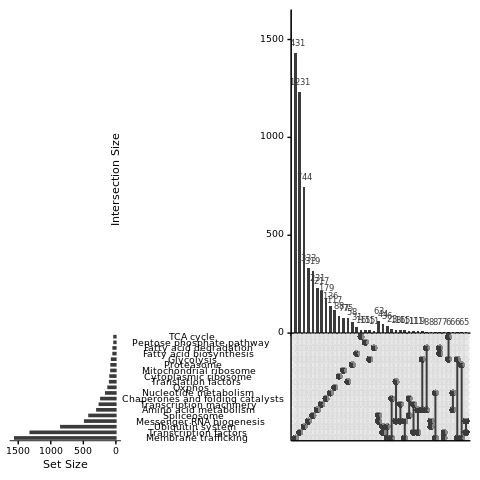

s8-3-0 Validation of method (data preprocessing)
================
Yoichiro Sugimoto
21 May, 2022

  - [Overview](#overview)
  - [KEGG information extraction](#kegg-information-extraction)
      - [Metabolism related genes](#metabolism-related-genes)
      - [Gene expression regulation](#gene-expression-regulation)
      - [Merge KEGG data](#merge-kegg-data)
      - [Plot intersection of KEGG
        terms](#plot-intersection-of-kegg-terms)
  - [GO information extraction](#go-information-extraction)
  - [Data filtration for HP5 data
    analysis](#data-filtration-for-hp5-data-analysis)
      - [Data preprocessing](#data-preprocessing)
      - [Gene level data filtration](#gene-level-data-filtration)
      - [TSS level filtration](#tss-level-filtration)
  - [Session information](#session-information)

# Overview

``` r
## Bioconductor database package
library("org.Hs.eg.db")
## Data visualization packages
library("ggrepel")
library("cowplot")

## Specify the number of CPUs to be used
processors <- 8

temp <- sapply(list.files("../functions", full.names = TRUE), source)
temp <- sapply(list.files("../s8-analysis-of-translation/functions", full.names = TRUE), source, chdir = TRUE)
```

    ## [1] "Sample file used: /camp/lab/ratcliffep/home/users/sugimoy/CAMP_HPC/projects/20211102_HP5_HIF_mTOR/data/sample_data/processed_sample_file.csv"
    ## [1] "The following objects are exported: poly.coldata.df, poly.sample.dt, translation.comparison.dt"
    ## [1] "In translation.comparison.dt, xx specifies the factor compared where the comparison is specified after __, while yy is a wildcard. From left, each factor specifies cell, VHL, EIF4E2, clone, and treatment"
    ## [1] "The following functions were exported: analyzeDtg(), subsetColdata()"

``` r
source("../s6-differential-expression-and-tss-usage/functions/load_total_analysis_results.R", chdir = TRUE)
```

    ## [1] "Sample file used: /camp/lab/ratcliffep/home/users/sugimoy/CAMP_HPC/projects/20211102_HP5_HIF_mTOR/data/sample_data/processed_sample_file.csv"
    ## [1] "The following R objects were exported: total.sample.dt, total.coldata.df, total.comparison.dt"
    ## [1] "Comparison information was loaded"
    ## [1] "/camp/lab/ratcliffep/home/users/sugimoy/CAMP_HPC/projects/20211102_HP5_HIF_mTOR/results"
    ## [1] "The following objects were loaded: tss.de.res.dt, tss.ratio.res.dt, diff.tss.res.dt"

``` r
set.seed(0)
```

``` r
annot.dir <- normalizePath(file.path("../../annotation/"))
annot.ps.dir <- file.path(annot.dir, "hg38_annotation/processed_data/")
annot.R.file <- list.files(
    annot.ps.dir,
    pattern = glob2rx("*primary_transcript_annotation*.rdata"),
    full.names = TRUE
)
load(annot.R.file)

results.dir <- file.path("../../results")
s4.tss.dir <- file.path(results.dir, "s4-tss-definition-and-tx-assignment")
s4.1.tss.def.dir <- file.path(s4.tss.dir, "s4-1-tss-definition")
s4.1.7.count.per.tss.dir <- file.path(s4.1.tss.def.dir, "s4-1-7-count-per-tss") 

s6.dir <- file.path(results.dir, "s6-differential-regulation-analysis")
s6.1.dir <- file.path(s6.dir, "s6-1-differentially-expressed-genes")

s8.dir <- file.path(results.dir, "s8-analysis-of-translation")
s8.1.dir <- file.path(s8.dir, "s8-1-differentially-translated-mRNAs")
s8.1.1.dir <- file.path(s8.1.dir, "gene-level-dte")

s8.3.dir <- file.path(s8.dir, "s8-3-validation-of-method")

create.dirs(
    c(
        s8.3.dir
    )
)

sample.file <- file.path("../../data/sample_data/processed_sample_file.csv")
sample.dt <- fread(sample.file)
sample.names <- sample.dt[, sample_name]

all.primary.tx.dt <- file.path(
    annot.ps.dir,
    "all_GENCODE_RefSeq_transcript_info.csv"
) %>% fread
```

# KEGG information extraction

The information from [KEGG summary
page](https://www.genome.jp/kegg-bin/show_brite?query=01100&htext=br08901.keg&option=-a&node_proc=br08901_org&proc_enabled=map)
was used.

## Metabolism related genes

``` r
kegg.dir <- file.path(annot.dir, "hg38_annotation/KEGG")

## Genes involved in metabolism were defined by KEGG pathway
kegg.data.dt <- file.path(
    kegg.dir, "KEGG-gene_id-link.csv"
) %>%
    fread

nucleotide.metabolisms <- c(
    "Purine metabolism",
    "Pyrimidine metabolism"    
)

amino.acids.metabolisms <- c(
    ## Amino acid metabolism
    "Alanine, aspartate and glutamate metabolism",
    "Glycine, serine and threonine metabolism",
    "Cysteine and methionine metabolism",
    "Valine, leucine and isoleucine degradation",
    "Valine, leucine and isoleucine biosynthesis",
    "Lysine biosynthesis",
    "Lysine degradation",
    "Arginine biosynthesis",
    "Arginine and proline metabolism",
    "Histidine metabolism",
    "Tyrosine metabolism",
    "Phenylalanine metabolism",
    "Tryptophan metabolism",
    "Phenylalanine, tyrosine and tryptophan biosynthesis"#,
    ## Metabolism of other amino acids
    ## "beta-Alanine metabolism",
    ## "Taurine and hypotaurine metabolism",
    ## "Phosphonate and phosphinate metabolism",
    ## "Selenocompound metabolism",
    ## "Cyanoamino acid metabolism",
    ## "D-Glutamine and D-glutamate metabolism",
    ## "D-Arginine and D-ornithine metabolism",
    ## "D-Alanine metabolism",
    ## "Glutathione metabolism"
)

kegg.metabolic.gene.dt <- kegg.data.dt[
    KEGG_description %in% c(
                              "Glycolysis / Gluconeogenesis",
                              "Pentose phosphate pathway",
                              "Citrate cycle (TCA cycle)",
                              "Fatty acid biosynthesis",
                              "Fatty acid elongation",
                              "Fatty acid degradation",
                              "Oxidative phosphorylation",
                              nucleotide.metabolisms,
                              amino.acids.metabolisms
                          )
] %>%
    {.[, `:=`(
         GO_name = case_when(
             KEGG_description == "Glycolysis / Gluconeogenesis" ~ "Glycolysis",
             KEGG_description == "Pentose phosphate pathway" ~ "Pentose phosphate pathway",
             KEGG_description == "Citrate cycle (TCA cycle)" ~ "TCA cycle",
             KEGG_description %in% c(
                                       "Fatty acid biosynthesis",
                                       "Fatty acid elongation"
                                   ) ~ "Fatty acid biosynthesis",
             KEGG_description == "Fatty acid degradation" ~ "Fatty acid degradation",
             KEGG_description == "Oxidative phosphorylation" ~ "Oxphos",
             KEGG_description %in% nucleotide.metabolisms ~ "Nucleotide metabolism",
             KEGG_description %in% amino.acids.metabolisms ~ "Amino acid metabolism"
         )  %>%
             factor(levels = c(
                        "Glycolysis",
                        "Pentose phosphate pathway",
                        "TCA cycle",
                        "Fatty acid biosynthesis",
                        "Fatty acid degradation",
                        "Oxphos",
                        "Nucleotide metabolism",
                        "Amino acid metabolism"
                    ))        
     )]} %>%
    {cbind(., data.table(GO_group = "Metabolism"))}

kegg.metabolic.gene.dt[!duplicated(KEGG_description)][
    order(GO_name, KEGG_description)
][
    , .(KEGG_id, KEGG_description, GO_name)
]
```

    ##           KEGG_id                                    KEGG_description
    ##  1: path:hsa00010                        Glycolysis / Gluconeogenesis
    ##  2: path:hsa00030                           Pentose phosphate pathway
    ##  3: path:hsa00020                           Citrate cycle (TCA cycle)
    ##  4: path:hsa00061                             Fatty acid biosynthesis
    ##  5: path:hsa00062                               Fatty acid elongation
    ##  6: path:hsa00071                              Fatty acid degradation
    ##  7: path:hsa00190                           Oxidative phosphorylation
    ##  8: path:hsa00230                                   Purine metabolism
    ##  9: path:hsa00240                               Pyrimidine metabolism
    ## 10: path:hsa00250         Alanine, aspartate and glutamate metabolism
    ## 11: path:hsa00330                     Arginine and proline metabolism
    ## 12: path:hsa00220                               Arginine biosynthesis
    ## 13: path:hsa00270                  Cysteine and methionine metabolism
    ## 14: path:hsa00260            Glycine, serine and threonine metabolism
    ## 15: path:hsa00340                                Histidine metabolism
    ## 16: path:hsa00310                                  Lysine degradation
    ## 17: path:hsa00360                            Phenylalanine metabolism
    ## 18: path:hsa00400 Phenylalanine, tyrosine and tryptophan biosynthesis
    ## 19: path:hsa00380                               Tryptophan metabolism
    ## 20: path:hsa00350                                 Tyrosine metabolism
    ## 21: path:hsa00290         Valine, leucine and isoleucine biosynthesis
    ## 22: path:hsa00280          Valine, leucine and isoleucine degradation
    ##           KEGG_id                                    KEGG_description
    ##                       GO_name
    ##  1:                Glycolysis
    ##  2: Pentose phosphate pathway
    ##  3:                 TCA cycle
    ##  4:   Fatty acid biosynthesis
    ##  5:   Fatty acid biosynthesis
    ##  6:    Fatty acid degradation
    ##  7:                    Oxphos
    ##  8:     Nucleotide metabolism
    ##  9:     Nucleotide metabolism
    ## 10:     Amino acid metabolism
    ## 11:     Amino acid metabolism
    ## 12:     Amino acid metabolism
    ## 13:     Amino acid metabolism
    ## 14:     Amino acid metabolism
    ## 15:     Amino acid metabolism
    ## 16:     Amino acid metabolism
    ## 17:     Amino acid metabolism
    ## 18:     Amino acid metabolism
    ## 19:     Amino acid metabolism
    ## 20:     Amino acid metabolism
    ## 21:     Amino acid metabolism
    ## 22:     Amino acid metabolism
    ##                       GO_name

``` r
## Sanity check
kegg.metabolic.gene.dt[GO_name == "Fatty acid biosynthesis", unique(KEGG_description)]
```

    ## [1] "Fatty acid elongation"   "Fatty acid biosynthesis"

``` r
kegg.metabolic.gene.dt[GO_name == "Nucleotide metabolism", unique(KEGG_description)]
```

    ## [1] "Purine metabolism"     "Pyrimidine metabolism"

``` r
kegg.metabolic.gene.dt[GO_name == "Amino acid metabolism", unique(KEGG_description)]
```

    ##  [1] "Arginine biosynthesis"                              
    ##  [2] "Lysine degradation"                                 
    ##  [3] "Glycine, serine and threonine metabolism"           
    ##  [4] "Cysteine and methionine metabolism"                 
    ##  [5] "Arginine and proline metabolism"                    
    ##  [6] "Valine, leucine and isoleucine degradation"         
    ##  [7] "Histidine metabolism"                               
    ##  [8] "Valine, leucine and isoleucine biosynthesis"        
    ##  [9] "Tryptophan metabolism"                              
    ## [10] "Alanine, aspartate and glutamate metabolism"        
    ## [11] "Tyrosine metabolism"                                
    ## [12] "Phenylalanine metabolism"                           
    ## [13] "Phenylalanine, tyrosine and tryptophan biosynthesis"

``` r
print("The following terms were not found in human database")
```

    ## [1] "The following terms were not found in human database"

``` r
amino.acids.metabolisms[!(amino.acids.metabolisms %in% kegg.metabolic.gene.dt[GO_name == "Amino acid metabolism", unique(KEGG_description)])]
```

    ## [1] "Lysine biosynthesis"

``` r
kegg.metabolic.gene.dt <- merge(
    kegg.metabolic.gene.dt,
    primary.tx.dt[!duplicated(gene_id), .(gene_id, chromosome_name)],
    by = "gene_id"
)

kegg.metabolic.gene.dt <- kegg.metabolic.gene.dt[chromosome_name != "chrM"]
kegg.metabolic.gene.dt[, term_name := GO_name]
```

## Gene expression regulation

``` r
kegg.brite.link.dt <- file.path(
    kegg.dir,
    "KEGG_BRITE-gene_id-link.csv"
) %>%
    fread

kegg.brite.link.dt <- merge(
    kegg.brite.link.dt,
    primary.tx.dt[!duplicated(gene_id), .(gene_id, chromosome_name)],
    by = "gene_id"
)

kegg.brite.link.dt[, `:=`(
    term_name = case_when(
        BRITE_name == "Ribosome" & grepl("^MRP", SYMBOL) ~ "Mitochondrial ribosome",
        BRITE_name == "Ribosome" & SYMBOL == "DAP3" ~ "Mitochondrial ribosome",
        BRITE_name == "Ribosome" & grepl("^RNA", SYMBOL) ~ NA_character_,
        BRITE_name == "Ribosome" ~ "Cytoplasmic ribosome",
        chromosome_name == "chrM" ~ NA_character_,
        TRUE ~ BRITE_name
    )
)]
```

## Merge KEGG data

``` r
kegg.all.dt <- rbind(
    kegg.metabolic.gene.dt[, .(gene_id, term_name)],
    kegg.brite.link.dt[!is.na(term_name), .(gene_id, term_name)]
)

all.sl.terms <- c(
    "Transcription factors" = "Gene expression",
    "Transcription machinery" = "Gene expression",
    "Messenger RNA biogenesis" = "Gene expression",
    "Spliceosome" = "Gene expression",
    "Cytoplasmic ribosome" = "Gene expression",
    "Mitochondrial ribosome" = "Gene expression",
    "Translation factors" = "Gene expression",
    "Chaperones and folding catalysts" = "Gene expression",
    "Membrane trafficking" = "Gene expression",
    "Ubiquitin system" = "Gene expression",
    "Proteasome" = "Gene expression",
    "Glycolysis" = "Metabolism",
    "Pentose phosphate pathway" = "Metabolism",
    "TCA cycle"  = "Metabolism",
    "Fatty acid biosynthesis" = "Metabolism",
    "Fatty acid degradation" = "Metabolism",
    "Oxphos" = "Metabolism",
    "Nucleotide metabolism" = "Metabolism",
    "Amino acid metabolism" = "Metabolism"    
)

kegg.all.dt <- kegg.all.dt[term_name %in% names(all.sl.terms)]
kegg.all.dt <- kegg.all.dt[!duplicated(paste(gene_id, term_name))]

kegg.all.dt[, `:=`(
    term_name = factor(term_name, levels = names(all.sl.terms)),
    term_group = all.sl.terms[as.character(term_name)] %>%
        factor(levels = unique(all.sl.terms))
)]

kegg.all.dt <- kegg.all.dt[order(term_name)]

fwrite(
    kegg.all.dt,
    file.path(s8.3.dir, "key_KEGG_genes.csv")
)
```

## Plot intersection of KEGG terms

``` r
library("UpSetR")

upset.keg.all.dt <- dcast(
    kegg.all.dt,
    gene_id ~ term_name,
    value.var = "gene_id",
    fun.aggregate = length
)

upset(
    upset.keg.all.dt,
    sets = names(all.sl.terms)
)
```

<!-- -->

# GO information extraction

``` r
extractGO <- function(go.id, go.name){
    GO.dt <- mget(go.id, org.Hs.egGO2ALLEGS) %>%
    {AnnotationDbi::select(
         org.Hs.eg.db,
         key = .[[1]],
         keytype = "ENTREZID",
         columns = c("ENSEMBL", "SYMBOL"),
         multiVals = "list"
     )} %>%
    data.table %>%
    {.[!duplicated(ENSEMBL)]}

    GO.dt[, `:=`(
        gene_id = ENSEMBL,
        gene_name = SYMBOL,
        GO_id = go.id,
        GO_name = go.name
    )]

    return(GO.dt)
}

## Extract angiogenesis related terms
angiongenesis.go.vec <- c(
    "Vascular Process" = "GO:0003018", #vascular process in circulatory system
    "Angiogenesis" = "GO:0001525" #angiogenesis
)

angiogenesis.go.dt <- mapply(
    extractGO,
    go.id = angiongenesis.go.vec,
    go.name = names(angiongenesis.go.vec),
    SIMPLIFY = FALSE
) %>% rbindlist %>%
{cbind(., data.table(GO_group = "Angiogenesis"))}
```

    ## 'select()' returned many:many mapping between keys and columns
    ## 'select()' returned many:many mapping between keys and columns

``` r
all.GO.dt <- rbindlist(
    list(
        kegg.metabolic.gene.dt,
        angiogenesis.go.dt
    ),
    use.names = TRUE,
    fill = TRUE
)

all.GO.dt[, `:=`(
    ENSEMBL = NULL,
    SYMBOL = NULL
)]

fwrite(
    all.GO.dt,
    file.path(s8.3.dir, "key_GO_genes.csv")
)
```

# Data filtration for HP5 data analysis

In order to reliably calculate log2 fold change of MRL, genes /
transcripts with very little expression will be filtered out.

## Data preprocessing

``` r
## For filtering of the results
count.dt <- fread(file.path(
    s4.1.7.count.per.tss.dir, "count-per-confident-tss.csv"
))
## Ignore non genic data
count.dt <- count.dt[!grepl("^NA_", tss_name)]
## Only analyze protein coding genes
count.dt <- count.dt[
    str_split_fixed(tss_name, "_", n = 2)[, 1] %in%
    all.primary.tx.dt[biotype == "protein_coding", gene_id]
]

poly.count.dt <- count.dt[, c(
    "tss_name", grep("^polysome", colnames(count.dt), value = TRUE)
), with = FALSE]

## For gene level analysis
poly.gene.count.dt <- countByGeneFromTss(poly.count.dt)

gene.filter.vec.1 <- c(
    ## RCC4
    "RCC4_noVHL_NA" = "polysome_RCC4_noVHL_EIF4E2_NA_[[:digit:]]_NA_ribo[[:digit:]]$",
    "RCC4_VHL_NA" = "polysome_RCC4_VHL_EIF4E2_NA_[[:digit:]]_NA_ribo[[:digit:]]$",
    "RCC4_noVHL_Torin1" = "polysome_RCC4_noVHL_EIF4E2_NA_(3|4)_Torin1_ribo[[:digit:]]$",
    "RCC4_VHL_Torin1" = "polysome_RCC4_VHL_EIF4E2_NA_(3|4)_Torin1_ribo[[:digit:]]$",
    ## 786O VHL loss
    "c786O_noVHL_EIF4E2_yy_NA" =
        "polysome_786O_noVHL_EIF4E2_NA_[[:digit:]]_NA_ribo[[:digit:]]$",
    "c786O_VHL_EIF4E2_yy_NA" =
        "polysome_786O_VHL_EIF4E2_NA_[[:digit:]]_NA_ribo[[:digit:]]$",
    ## 786O EIF4E2 KO
    "c786O_noVHL_noEIF4E2_yy_NA" =
        "polysome_786O_noVHL_noEIF4E2_g[[:digit:]]_[[:digit:]]_NA_ribo[[:digit:]]$",
    "c786O_VHL_noEIF4E2_yy_NA" =
        "polysome_786O_VHL_noEIF4E2_g[[:digit:]]_[[:digit:]]_NA_ribo[[:digit:]]$"  
)

wrapFilterPolysomeByCount <- function(match.pattern, count.dt, ref.colname = "tss_name", min.count.th = 10, min.datapoint.th = 6, filter.name){
    print("------------------------")
    print(paste0(filter.name, ":", match.pattern))
    print("The following data are used to filter data")
    grep(
        match.pattern, colnames(count.dt), value = TRUE
    ) %>% print
    
    out <- filterPolysomeByCount(match.pattern, count.dt, ref.colname, min.count.th, min.datapoint.th)
    out.dt <- data.table(ref = out, filtered = TRUE)
    setnames(
        out.dt,
        old = c("ref", "filtered"),
        new = c(ref.colname, filter.name)
    )
    print("------------------------")
    return(out.dt)
}
```

## Gene level data filtration

``` r
all.filtered.gene.dt <- mapply(
    wrapFilterPolysomeByCount,
    match.pattern = gene.filter.vec.1,
    count.dt = list(poly.gene.count.dt),
    ref.colname = "gene_id",
    filter.name = names(gene.filter.vec.1),
    min.count.th = 5,
    SIMPLIFY = FALSE
) %>%
    {Reduce(function(...) merge(..., all = TRUE, by = "gene_id"), .)}
```

    ## [1] "------------------------"
    ## [1] "RCC4_noVHL_NA:polysome_RCC4_noVHL_EIF4E2_NA_[[:digit:]]_NA_ribo[[:digit:]]$"
    ## [1] "The following data are used to filter data"
    ##  [1] "polysome_RCC4_noVHL_EIF4E2_NA_1_NA_ribo1"
    ##  [2] "polysome_RCC4_noVHL_EIF4E2_NA_1_NA_ribo2"
    ##  [3] "polysome_RCC4_noVHL_EIF4E2_NA_1_NA_ribo3"
    ##  [4] "polysome_RCC4_noVHL_EIF4E2_NA_1_NA_ribo4"
    ##  [5] "polysome_RCC4_noVHL_EIF4E2_NA_1_NA_ribo5"
    ##  [6] "polysome_RCC4_noVHL_EIF4E2_NA_1_NA_ribo6"
    ##  [7] "polysome_RCC4_noVHL_EIF4E2_NA_1_NA_ribo7"
    ##  [8] "polysome_RCC4_noVHL_EIF4E2_NA_1_NA_ribo8"
    ##  [9] "polysome_RCC4_noVHL_EIF4E2_NA_3_NA_ribo1"
    ## [10] "polysome_RCC4_noVHL_EIF4E2_NA_3_NA_ribo2"
    ## [11] "polysome_RCC4_noVHL_EIF4E2_NA_3_NA_ribo3"
    ## [12] "polysome_RCC4_noVHL_EIF4E2_NA_3_NA_ribo4"
    ## [13] "polysome_RCC4_noVHL_EIF4E2_NA_3_NA_ribo5"
    ## [14] "polysome_RCC4_noVHL_EIF4E2_NA_3_NA_ribo6"
    ## [15] "polysome_RCC4_noVHL_EIF4E2_NA_3_NA_ribo7"
    ## [16] "polysome_RCC4_noVHL_EIF4E2_NA_3_NA_ribo8"
    ## [17] "polysome_RCC4_noVHL_EIF4E2_NA_4_NA_ribo1"
    ## [18] "polysome_RCC4_noVHL_EIF4E2_NA_4_NA_ribo2"
    ## [19] "polysome_RCC4_noVHL_EIF4E2_NA_4_NA_ribo3"
    ## [20] "polysome_RCC4_noVHL_EIF4E2_NA_4_NA_ribo4"
    ## [21] "polysome_RCC4_noVHL_EIF4E2_NA_4_NA_ribo5"
    ## [22] "polysome_RCC4_noVHL_EIF4E2_NA_4_NA_ribo6"
    ## [23] "polysome_RCC4_noVHL_EIF4E2_NA_4_NA_ribo7"
    ## [24] "polysome_RCC4_noVHL_EIF4E2_NA_4_NA_ribo8"
    ## [1] "The number of genes/transcripts after minimum count across fraction filtering: 10047"
    ## [1] "------------------------"
    ## [1] "------------------------"
    ## [1] "RCC4_VHL_NA:polysome_RCC4_VHL_EIF4E2_NA_[[:digit:]]_NA_ribo[[:digit:]]$"
    ## [1] "The following data are used to filter data"
    ##  [1] "polysome_RCC4_VHL_EIF4E2_NA_1_NA_ribo1"
    ##  [2] "polysome_RCC4_VHL_EIF4E2_NA_1_NA_ribo2"
    ##  [3] "polysome_RCC4_VHL_EIF4E2_NA_1_NA_ribo3"
    ##  [4] "polysome_RCC4_VHL_EIF4E2_NA_1_NA_ribo4"
    ##  [5] "polysome_RCC4_VHL_EIF4E2_NA_1_NA_ribo5"
    ##  [6] "polysome_RCC4_VHL_EIF4E2_NA_1_NA_ribo6"
    ##  [7] "polysome_RCC4_VHL_EIF4E2_NA_1_NA_ribo7"
    ##  [8] "polysome_RCC4_VHL_EIF4E2_NA_1_NA_ribo8"
    ##  [9] "polysome_RCC4_VHL_EIF4E2_NA_3_NA_ribo1"
    ## [10] "polysome_RCC4_VHL_EIF4E2_NA_3_NA_ribo2"
    ## [11] "polysome_RCC4_VHL_EIF4E2_NA_3_NA_ribo3"
    ## [12] "polysome_RCC4_VHL_EIF4E2_NA_3_NA_ribo4"
    ## [13] "polysome_RCC4_VHL_EIF4E2_NA_3_NA_ribo5"
    ## [14] "polysome_RCC4_VHL_EIF4E2_NA_3_NA_ribo6"
    ## [15] "polysome_RCC4_VHL_EIF4E2_NA_3_NA_ribo7"
    ## [16] "polysome_RCC4_VHL_EIF4E2_NA_3_NA_ribo8"
    ## [17] "polysome_RCC4_VHL_EIF4E2_NA_4_NA_ribo1"
    ## [18] "polysome_RCC4_VHL_EIF4E2_NA_4_NA_ribo2"
    ## [19] "polysome_RCC4_VHL_EIF4E2_NA_4_NA_ribo3"
    ## [20] "polysome_RCC4_VHL_EIF4E2_NA_4_NA_ribo4"
    ## [21] "polysome_RCC4_VHL_EIF4E2_NA_4_NA_ribo5"
    ## [22] "polysome_RCC4_VHL_EIF4E2_NA_4_NA_ribo6"
    ## [23] "polysome_RCC4_VHL_EIF4E2_NA_4_NA_ribo7"
    ## [24] "polysome_RCC4_VHL_EIF4E2_NA_4_NA_ribo8"
    ## [1] "The number of genes/transcripts after minimum count across fraction filtering: 10215"
    ## [1] "------------------------"
    ## [1] "------------------------"
    ## [1] "RCC4_noVHL_Torin1:polysome_RCC4_noVHL_EIF4E2_NA_(3|4)_Torin1_ribo[[:digit:]]$"
    ## [1] "The following data are used to filter data"
    ##  [1] "polysome_RCC4_noVHL_EIF4E2_NA_3_Torin1_ribo1"
    ##  [2] "polysome_RCC4_noVHL_EIF4E2_NA_3_Torin1_ribo2"
    ##  [3] "polysome_RCC4_noVHL_EIF4E2_NA_3_Torin1_ribo3"
    ##  [4] "polysome_RCC4_noVHL_EIF4E2_NA_3_Torin1_ribo4"
    ##  [5] "polysome_RCC4_noVHL_EIF4E2_NA_3_Torin1_ribo5"
    ##  [6] "polysome_RCC4_noVHL_EIF4E2_NA_3_Torin1_ribo6"
    ##  [7] "polysome_RCC4_noVHL_EIF4E2_NA_3_Torin1_ribo7"
    ##  [8] "polysome_RCC4_noVHL_EIF4E2_NA_3_Torin1_ribo8"
    ##  [9] "polysome_RCC4_noVHL_EIF4E2_NA_4_Torin1_ribo1"
    ## [10] "polysome_RCC4_noVHL_EIF4E2_NA_4_Torin1_ribo2"
    ## [11] "polysome_RCC4_noVHL_EIF4E2_NA_4_Torin1_ribo3"
    ## [12] "polysome_RCC4_noVHL_EIF4E2_NA_4_Torin1_ribo4"
    ## [13] "polysome_RCC4_noVHL_EIF4E2_NA_4_Torin1_ribo5"
    ## [14] "polysome_RCC4_noVHL_EIF4E2_NA_4_Torin1_ribo6"
    ## [15] "polysome_RCC4_noVHL_EIF4E2_NA_4_Torin1_ribo7"
    ## [16] "polysome_RCC4_noVHL_EIF4E2_NA_4_Torin1_ribo8"
    ## [1] "The number of genes/transcripts after minimum count across fraction filtering: 9197"
    ## [1] "------------------------"
    ## [1] "------------------------"
    ## [1] "RCC4_VHL_Torin1:polysome_RCC4_VHL_EIF4E2_NA_(3|4)_Torin1_ribo[[:digit:]]$"
    ## [1] "The following data are used to filter data"
    ##  [1] "polysome_RCC4_VHL_EIF4E2_NA_3_Torin1_ribo1"
    ##  [2] "polysome_RCC4_VHL_EIF4E2_NA_3_Torin1_ribo2"
    ##  [3] "polysome_RCC4_VHL_EIF4E2_NA_3_Torin1_ribo3"
    ##  [4] "polysome_RCC4_VHL_EIF4E2_NA_3_Torin1_ribo4"
    ##  [5] "polysome_RCC4_VHL_EIF4E2_NA_3_Torin1_ribo5"
    ##  [6] "polysome_RCC4_VHL_EIF4E2_NA_3_Torin1_ribo6"
    ##  [7] "polysome_RCC4_VHL_EIF4E2_NA_3_Torin1_ribo7"
    ##  [8] "polysome_RCC4_VHL_EIF4E2_NA_3_Torin1_ribo8"
    ##  [9] "polysome_RCC4_VHL_EIF4E2_NA_4_Torin1_ribo1"
    ## [10] "polysome_RCC4_VHL_EIF4E2_NA_4_Torin1_ribo2"
    ## [11] "polysome_RCC4_VHL_EIF4E2_NA_4_Torin1_ribo3"
    ## [12] "polysome_RCC4_VHL_EIF4E2_NA_4_Torin1_ribo4"
    ## [13] "polysome_RCC4_VHL_EIF4E2_NA_4_Torin1_ribo5"
    ## [14] "polysome_RCC4_VHL_EIF4E2_NA_4_Torin1_ribo6"
    ## [15] "polysome_RCC4_VHL_EIF4E2_NA_4_Torin1_ribo7"
    ## [16] "polysome_RCC4_VHL_EIF4E2_NA_4_Torin1_ribo8"
    ## [1] "The number of genes/transcripts after minimum count across fraction filtering: 9617"
    ## [1] "------------------------"
    ## [1] "------------------------"
    ## [1] "c786O_noVHL_EIF4E2_yy_NA:polysome_786O_noVHL_EIF4E2_NA_[[:digit:]]_NA_ribo[[:digit:]]$"
    ## [1] "The following data are used to filter data"
    ##  [1] "polysome_786O_noVHL_EIF4E2_NA_1_NA_ribo1"
    ##  [2] "polysome_786O_noVHL_EIF4E2_NA_1_NA_ribo2"
    ##  [3] "polysome_786O_noVHL_EIF4E2_NA_1_NA_ribo3"
    ##  [4] "polysome_786O_noVHL_EIF4E2_NA_1_NA_ribo4"
    ##  [5] "polysome_786O_noVHL_EIF4E2_NA_1_NA_ribo5"
    ##  [6] "polysome_786O_noVHL_EIF4E2_NA_1_NA_ribo6"
    ##  [7] "polysome_786O_noVHL_EIF4E2_NA_1_NA_ribo7"
    ##  [8] "polysome_786O_noVHL_EIF4E2_NA_1_NA_ribo8"
    ##  [9] "polysome_786O_noVHL_EIF4E2_NA_2_NA_ribo1"
    ## [10] "polysome_786O_noVHL_EIF4E2_NA_2_NA_ribo2"
    ## [11] "polysome_786O_noVHL_EIF4E2_NA_2_NA_ribo3"
    ## [12] "polysome_786O_noVHL_EIF4E2_NA_2_NA_ribo4"
    ## [13] "polysome_786O_noVHL_EIF4E2_NA_2_NA_ribo5"
    ## [14] "polysome_786O_noVHL_EIF4E2_NA_2_NA_ribo6"
    ## [15] "polysome_786O_noVHL_EIF4E2_NA_2_NA_ribo7"
    ## [16] "polysome_786O_noVHL_EIF4E2_NA_2_NA_ribo8"
    ## [17] "polysome_786O_noVHL_EIF4E2_NA_4_NA_ribo1"
    ## [18] "polysome_786O_noVHL_EIF4E2_NA_4_NA_ribo2"
    ## [19] "polysome_786O_noVHL_EIF4E2_NA_4_NA_ribo3"
    ## [20] "polysome_786O_noVHL_EIF4E2_NA_4_NA_ribo4"
    ## [21] "polysome_786O_noVHL_EIF4E2_NA_4_NA_ribo5"
    ## [22] "polysome_786O_noVHL_EIF4E2_NA_4_NA_ribo6"
    ## [23] "polysome_786O_noVHL_EIF4E2_NA_4_NA_ribo7"
    ## [24] "polysome_786O_noVHL_EIF4E2_NA_4_NA_ribo8"
    ## [1] "The number of genes/transcripts after minimum count across fraction filtering: 8532"
    ## [1] "------------------------"
    ## [1] "------------------------"
    ## [1] "c786O_VHL_EIF4E2_yy_NA:polysome_786O_VHL_EIF4E2_NA_[[:digit:]]_NA_ribo[[:digit:]]$"
    ## [1] "The following data are used to filter data"
    ##  [1] "polysome_786O_VHL_EIF4E2_NA_1_NA_ribo1"
    ##  [2] "polysome_786O_VHL_EIF4E2_NA_1_NA_ribo2"
    ##  [3] "polysome_786O_VHL_EIF4E2_NA_1_NA_ribo3"
    ##  [4] "polysome_786O_VHL_EIF4E2_NA_1_NA_ribo4"
    ##  [5] "polysome_786O_VHL_EIF4E2_NA_1_NA_ribo5"
    ##  [6] "polysome_786O_VHL_EIF4E2_NA_1_NA_ribo6"
    ##  [7] "polysome_786O_VHL_EIF4E2_NA_1_NA_ribo7"
    ##  [8] "polysome_786O_VHL_EIF4E2_NA_1_NA_ribo8"
    ##  [9] "polysome_786O_VHL_EIF4E2_NA_2_NA_ribo1"
    ## [10] "polysome_786O_VHL_EIF4E2_NA_2_NA_ribo2"
    ## [11] "polysome_786O_VHL_EIF4E2_NA_2_NA_ribo3"
    ## [12] "polysome_786O_VHL_EIF4E2_NA_2_NA_ribo4"
    ## [13] "polysome_786O_VHL_EIF4E2_NA_2_NA_ribo5"
    ## [14] "polysome_786O_VHL_EIF4E2_NA_2_NA_ribo6"
    ## [15] "polysome_786O_VHL_EIF4E2_NA_2_NA_ribo7"
    ## [16] "polysome_786O_VHL_EIF4E2_NA_2_NA_ribo8"
    ## [17] "polysome_786O_VHL_EIF4E2_NA_4_NA_ribo1"
    ## [18] "polysome_786O_VHL_EIF4E2_NA_4_NA_ribo2"
    ## [19] "polysome_786O_VHL_EIF4E2_NA_4_NA_ribo3"
    ## [20] "polysome_786O_VHL_EIF4E2_NA_4_NA_ribo4"
    ## [21] "polysome_786O_VHL_EIF4E2_NA_4_NA_ribo5"
    ## [22] "polysome_786O_VHL_EIF4E2_NA_4_NA_ribo6"
    ## [23] "polysome_786O_VHL_EIF4E2_NA_4_NA_ribo7"
    ## [24] "polysome_786O_VHL_EIF4E2_NA_4_NA_ribo8"
    ## [1] "The number of genes/transcripts after minimum count across fraction filtering: 8614"
    ## [1] "------------------------"
    ## [1] "------------------------"
    ## [1] "c786O_noVHL_noEIF4E2_yy_NA:polysome_786O_noVHL_noEIF4E2_g[[:digit:]]_[[:digit:]]_NA_ribo[[:digit:]]$"
    ## [1] "The following data are used to filter data"
    ##  [1] "polysome_786O_noVHL_noEIF4E2_g1_1_NA_ribo1"
    ##  [2] "polysome_786O_noVHL_noEIF4E2_g1_1_NA_ribo2"
    ##  [3] "polysome_786O_noVHL_noEIF4E2_g1_1_NA_ribo3"
    ##  [4] "polysome_786O_noVHL_noEIF4E2_g1_1_NA_ribo4"
    ##  [5] "polysome_786O_noVHL_noEIF4E2_g1_1_NA_ribo5"
    ##  [6] "polysome_786O_noVHL_noEIF4E2_g1_1_NA_ribo6"
    ##  [7] "polysome_786O_noVHL_noEIF4E2_g1_1_NA_ribo7"
    ##  [8] "polysome_786O_noVHL_noEIF4E2_g1_1_NA_ribo8"
    ##  [9] "polysome_786O_noVHL_noEIF4E2_g2_1_NA_ribo1"
    ## [10] "polysome_786O_noVHL_noEIF4E2_g2_1_NA_ribo2"
    ## [11] "polysome_786O_noVHL_noEIF4E2_g2_1_NA_ribo3"
    ## [12] "polysome_786O_noVHL_noEIF4E2_g2_1_NA_ribo4"
    ## [13] "polysome_786O_noVHL_noEIF4E2_g2_1_NA_ribo5"
    ## [14] "polysome_786O_noVHL_noEIF4E2_g2_1_NA_ribo6"
    ## [15] "polysome_786O_noVHL_noEIF4E2_g2_1_NA_ribo7"
    ## [16] "polysome_786O_noVHL_noEIF4E2_g2_1_NA_ribo8"
    ## [1] "The number of genes/transcripts after minimum count across fraction filtering: 9064"
    ## [1] "------------------------"
    ## [1] "------------------------"
    ## [1] "c786O_VHL_noEIF4E2_yy_NA:polysome_786O_VHL_noEIF4E2_g[[:digit:]]_[[:digit:]]_NA_ribo[[:digit:]]$"
    ## [1] "The following data are used to filter data"
    ##  [1] "polysome_786O_VHL_noEIF4E2_g1_1_NA_ribo1"
    ##  [2] "polysome_786O_VHL_noEIF4E2_g1_1_NA_ribo2"
    ##  [3] "polysome_786O_VHL_noEIF4E2_g1_1_NA_ribo3"
    ##  [4] "polysome_786O_VHL_noEIF4E2_g1_1_NA_ribo4"
    ##  [5] "polysome_786O_VHL_noEIF4E2_g1_1_NA_ribo5"
    ##  [6] "polysome_786O_VHL_noEIF4E2_g1_1_NA_ribo6"
    ##  [7] "polysome_786O_VHL_noEIF4E2_g1_1_NA_ribo7"
    ##  [8] "polysome_786O_VHL_noEIF4E2_g1_1_NA_ribo8"
    ##  [9] "polysome_786O_VHL_noEIF4E2_g2_1_NA_ribo1"
    ## [10] "polysome_786O_VHL_noEIF4E2_g2_1_NA_ribo2"
    ## [11] "polysome_786O_VHL_noEIF4E2_g2_1_NA_ribo3"
    ## [12] "polysome_786O_VHL_noEIF4E2_g2_1_NA_ribo4"
    ## [13] "polysome_786O_VHL_noEIF4E2_g2_1_NA_ribo5"
    ## [14] "polysome_786O_VHL_noEIF4E2_g2_1_NA_ribo6"
    ## [15] "polysome_786O_VHL_noEIF4E2_g2_1_NA_ribo7"
    ## [16] "polysome_786O_VHL_noEIF4E2_g2_1_NA_ribo8"
    ## [1] "The number of genes/transcripts after minimum count across fraction filtering: 8998"
    ## [1] "------------------------"

``` r
all.filtered.gene.dt[is.na(all.filtered.gene.dt)] <- FALSE

fwrite(
    all.filtered.gene.dt,
    file.path(
        s8.3.dir,
        "filtered_gene_for_polysome_analysis.csv"
    )
)
```

## TSS level filtration

``` r
all.filtered.tss.dt <- mapply(
    wrapFilterPolysomeByCount,
    match.pattern = gene.filter.vec.1,
    count.dt = list(poly.count.dt),
    ref.colname = "tss_name",
    filter.name = names(gene.filter.vec.1),
    min.count.th = 5,
    SIMPLIFY = FALSE
) %>%
    {Reduce(function(...) merge(..., all = TRUE, by = "tss_name"), .)}
```

    ## [1] "------------------------"
    ## [1] "RCC4_noVHL_NA:polysome_RCC4_noVHL_EIF4E2_NA_[[:digit:]]_NA_ribo[[:digit:]]$"
    ## [1] "The following data are used to filter data"
    ##  [1] "polysome_RCC4_noVHL_EIF4E2_NA_1_NA_ribo1"
    ##  [2] "polysome_RCC4_noVHL_EIF4E2_NA_1_NA_ribo2"
    ##  [3] "polysome_RCC4_noVHL_EIF4E2_NA_1_NA_ribo3"
    ##  [4] "polysome_RCC4_noVHL_EIF4E2_NA_1_NA_ribo4"
    ##  [5] "polysome_RCC4_noVHL_EIF4E2_NA_1_NA_ribo5"
    ##  [6] "polysome_RCC4_noVHL_EIF4E2_NA_1_NA_ribo6"
    ##  [7] "polysome_RCC4_noVHL_EIF4E2_NA_1_NA_ribo7"
    ##  [8] "polysome_RCC4_noVHL_EIF4E2_NA_1_NA_ribo8"
    ##  [9] "polysome_RCC4_noVHL_EIF4E2_NA_3_NA_ribo1"
    ## [10] "polysome_RCC4_noVHL_EIF4E2_NA_3_NA_ribo2"
    ## [11] "polysome_RCC4_noVHL_EIF4E2_NA_3_NA_ribo3"
    ## [12] "polysome_RCC4_noVHL_EIF4E2_NA_3_NA_ribo4"
    ## [13] "polysome_RCC4_noVHL_EIF4E2_NA_3_NA_ribo5"
    ## [14] "polysome_RCC4_noVHL_EIF4E2_NA_3_NA_ribo6"
    ## [15] "polysome_RCC4_noVHL_EIF4E2_NA_3_NA_ribo7"
    ## [16] "polysome_RCC4_noVHL_EIF4E2_NA_3_NA_ribo8"
    ## [17] "polysome_RCC4_noVHL_EIF4E2_NA_4_NA_ribo1"
    ## [18] "polysome_RCC4_noVHL_EIF4E2_NA_4_NA_ribo2"
    ## [19] "polysome_RCC4_noVHL_EIF4E2_NA_4_NA_ribo3"
    ## [20] "polysome_RCC4_noVHL_EIF4E2_NA_4_NA_ribo4"
    ## [21] "polysome_RCC4_noVHL_EIF4E2_NA_4_NA_ribo5"
    ## [22] "polysome_RCC4_noVHL_EIF4E2_NA_4_NA_ribo6"
    ## [23] "polysome_RCC4_noVHL_EIF4E2_NA_4_NA_ribo7"
    ## [24] "polysome_RCC4_noVHL_EIF4E2_NA_4_NA_ribo8"
    ## [1] "The number of genes/transcripts after minimum count across fraction filtering: 15243"
    ## [1] "------------------------"
    ## [1] "------------------------"
    ## [1] "RCC4_VHL_NA:polysome_RCC4_VHL_EIF4E2_NA_[[:digit:]]_NA_ribo[[:digit:]]$"
    ## [1] "The following data are used to filter data"
    ##  [1] "polysome_RCC4_VHL_EIF4E2_NA_1_NA_ribo1"
    ##  [2] "polysome_RCC4_VHL_EIF4E2_NA_1_NA_ribo2"
    ##  [3] "polysome_RCC4_VHL_EIF4E2_NA_1_NA_ribo3"
    ##  [4] "polysome_RCC4_VHL_EIF4E2_NA_1_NA_ribo4"
    ##  [5] "polysome_RCC4_VHL_EIF4E2_NA_1_NA_ribo5"
    ##  [6] "polysome_RCC4_VHL_EIF4E2_NA_1_NA_ribo6"
    ##  [7] "polysome_RCC4_VHL_EIF4E2_NA_1_NA_ribo7"
    ##  [8] "polysome_RCC4_VHL_EIF4E2_NA_1_NA_ribo8"
    ##  [9] "polysome_RCC4_VHL_EIF4E2_NA_3_NA_ribo1"
    ## [10] "polysome_RCC4_VHL_EIF4E2_NA_3_NA_ribo2"
    ## [11] "polysome_RCC4_VHL_EIF4E2_NA_3_NA_ribo3"
    ## [12] "polysome_RCC4_VHL_EIF4E2_NA_3_NA_ribo4"
    ## [13] "polysome_RCC4_VHL_EIF4E2_NA_3_NA_ribo5"
    ## [14] "polysome_RCC4_VHL_EIF4E2_NA_3_NA_ribo6"
    ## [15] "polysome_RCC4_VHL_EIF4E2_NA_3_NA_ribo7"
    ## [16] "polysome_RCC4_VHL_EIF4E2_NA_3_NA_ribo8"
    ## [17] "polysome_RCC4_VHL_EIF4E2_NA_4_NA_ribo1"
    ## [18] "polysome_RCC4_VHL_EIF4E2_NA_4_NA_ribo2"
    ## [19] "polysome_RCC4_VHL_EIF4E2_NA_4_NA_ribo3"
    ## [20] "polysome_RCC4_VHL_EIF4E2_NA_4_NA_ribo4"
    ## [21] "polysome_RCC4_VHL_EIF4E2_NA_4_NA_ribo5"
    ## [22] "polysome_RCC4_VHL_EIF4E2_NA_4_NA_ribo6"
    ## [23] "polysome_RCC4_VHL_EIF4E2_NA_4_NA_ribo7"
    ## [24] "polysome_RCC4_VHL_EIF4E2_NA_4_NA_ribo8"
    ## [1] "The number of genes/transcripts after minimum count across fraction filtering: 15774"
    ## [1] "------------------------"
    ## [1] "------------------------"
    ## [1] "RCC4_noVHL_Torin1:polysome_RCC4_noVHL_EIF4E2_NA_(3|4)_Torin1_ribo[[:digit:]]$"
    ## [1] "The following data are used to filter data"
    ##  [1] "polysome_RCC4_noVHL_EIF4E2_NA_3_Torin1_ribo1"
    ##  [2] "polysome_RCC4_noVHL_EIF4E2_NA_3_Torin1_ribo2"
    ##  [3] "polysome_RCC4_noVHL_EIF4E2_NA_3_Torin1_ribo3"
    ##  [4] "polysome_RCC4_noVHL_EIF4E2_NA_3_Torin1_ribo4"
    ##  [5] "polysome_RCC4_noVHL_EIF4E2_NA_3_Torin1_ribo5"
    ##  [6] "polysome_RCC4_noVHL_EIF4E2_NA_3_Torin1_ribo6"
    ##  [7] "polysome_RCC4_noVHL_EIF4E2_NA_3_Torin1_ribo7"
    ##  [8] "polysome_RCC4_noVHL_EIF4E2_NA_3_Torin1_ribo8"
    ##  [9] "polysome_RCC4_noVHL_EIF4E2_NA_4_Torin1_ribo1"
    ## [10] "polysome_RCC4_noVHL_EIF4E2_NA_4_Torin1_ribo2"
    ## [11] "polysome_RCC4_noVHL_EIF4E2_NA_4_Torin1_ribo3"
    ## [12] "polysome_RCC4_noVHL_EIF4E2_NA_4_Torin1_ribo4"
    ## [13] "polysome_RCC4_noVHL_EIF4E2_NA_4_Torin1_ribo5"
    ## [14] "polysome_RCC4_noVHL_EIF4E2_NA_4_Torin1_ribo6"
    ## [15] "polysome_RCC4_noVHL_EIF4E2_NA_4_Torin1_ribo7"
    ## [16] "polysome_RCC4_noVHL_EIF4E2_NA_4_Torin1_ribo8"
    ## [1] "The number of genes/transcripts after minimum count across fraction filtering: 12658"
    ## [1] "------------------------"
    ## [1] "------------------------"
    ## [1] "RCC4_VHL_Torin1:polysome_RCC4_VHL_EIF4E2_NA_(3|4)_Torin1_ribo[[:digit:]]$"
    ## [1] "The following data are used to filter data"
    ##  [1] "polysome_RCC4_VHL_EIF4E2_NA_3_Torin1_ribo1"
    ##  [2] "polysome_RCC4_VHL_EIF4E2_NA_3_Torin1_ribo2"
    ##  [3] "polysome_RCC4_VHL_EIF4E2_NA_3_Torin1_ribo3"
    ##  [4] "polysome_RCC4_VHL_EIF4E2_NA_3_Torin1_ribo4"
    ##  [5] "polysome_RCC4_VHL_EIF4E2_NA_3_Torin1_ribo5"
    ##  [6] "polysome_RCC4_VHL_EIF4E2_NA_3_Torin1_ribo6"
    ##  [7] "polysome_RCC4_VHL_EIF4E2_NA_3_Torin1_ribo7"
    ##  [8] "polysome_RCC4_VHL_EIF4E2_NA_3_Torin1_ribo8"
    ##  [9] "polysome_RCC4_VHL_EIF4E2_NA_4_Torin1_ribo1"
    ## [10] "polysome_RCC4_VHL_EIF4E2_NA_4_Torin1_ribo2"
    ## [11] "polysome_RCC4_VHL_EIF4E2_NA_4_Torin1_ribo3"
    ## [12] "polysome_RCC4_VHL_EIF4E2_NA_4_Torin1_ribo4"
    ## [13] "polysome_RCC4_VHL_EIF4E2_NA_4_Torin1_ribo5"
    ## [14] "polysome_RCC4_VHL_EIF4E2_NA_4_Torin1_ribo6"
    ## [15] "polysome_RCC4_VHL_EIF4E2_NA_4_Torin1_ribo7"
    ## [16] "polysome_RCC4_VHL_EIF4E2_NA_4_Torin1_ribo8"
    ## [1] "The number of genes/transcripts after minimum count across fraction filtering: 13612"
    ## [1] "------------------------"
    ## [1] "------------------------"
    ## [1] "c786O_noVHL_EIF4E2_yy_NA:polysome_786O_noVHL_EIF4E2_NA_[[:digit:]]_NA_ribo[[:digit:]]$"
    ## [1] "The following data are used to filter data"
    ##  [1] "polysome_786O_noVHL_EIF4E2_NA_1_NA_ribo1"
    ##  [2] "polysome_786O_noVHL_EIF4E2_NA_1_NA_ribo2"
    ##  [3] "polysome_786O_noVHL_EIF4E2_NA_1_NA_ribo3"
    ##  [4] "polysome_786O_noVHL_EIF4E2_NA_1_NA_ribo4"
    ##  [5] "polysome_786O_noVHL_EIF4E2_NA_1_NA_ribo5"
    ##  [6] "polysome_786O_noVHL_EIF4E2_NA_1_NA_ribo6"
    ##  [7] "polysome_786O_noVHL_EIF4E2_NA_1_NA_ribo7"
    ##  [8] "polysome_786O_noVHL_EIF4E2_NA_1_NA_ribo8"
    ##  [9] "polysome_786O_noVHL_EIF4E2_NA_2_NA_ribo1"
    ## [10] "polysome_786O_noVHL_EIF4E2_NA_2_NA_ribo2"
    ## [11] "polysome_786O_noVHL_EIF4E2_NA_2_NA_ribo3"
    ## [12] "polysome_786O_noVHL_EIF4E2_NA_2_NA_ribo4"
    ## [13] "polysome_786O_noVHL_EIF4E2_NA_2_NA_ribo5"
    ## [14] "polysome_786O_noVHL_EIF4E2_NA_2_NA_ribo6"
    ## [15] "polysome_786O_noVHL_EIF4E2_NA_2_NA_ribo7"
    ## [16] "polysome_786O_noVHL_EIF4E2_NA_2_NA_ribo8"
    ## [17] "polysome_786O_noVHL_EIF4E2_NA_4_NA_ribo1"
    ## [18] "polysome_786O_noVHL_EIF4E2_NA_4_NA_ribo2"
    ## [19] "polysome_786O_noVHL_EIF4E2_NA_4_NA_ribo3"
    ## [20] "polysome_786O_noVHL_EIF4E2_NA_4_NA_ribo4"
    ## [21] "polysome_786O_noVHL_EIF4E2_NA_4_NA_ribo5"
    ## [22] "polysome_786O_noVHL_EIF4E2_NA_4_NA_ribo6"
    ## [23] "polysome_786O_noVHL_EIF4E2_NA_4_NA_ribo7"
    ## [24] "polysome_786O_noVHL_EIF4E2_NA_4_NA_ribo8"
    ## [1] "The number of genes/transcripts after minimum count across fraction filtering: 11471"
    ## [1] "------------------------"
    ## [1] "------------------------"
    ## [1] "c786O_VHL_EIF4E2_yy_NA:polysome_786O_VHL_EIF4E2_NA_[[:digit:]]_NA_ribo[[:digit:]]$"
    ## [1] "The following data are used to filter data"
    ##  [1] "polysome_786O_VHL_EIF4E2_NA_1_NA_ribo1"
    ##  [2] "polysome_786O_VHL_EIF4E2_NA_1_NA_ribo2"
    ##  [3] "polysome_786O_VHL_EIF4E2_NA_1_NA_ribo3"
    ##  [4] "polysome_786O_VHL_EIF4E2_NA_1_NA_ribo4"
    ##  [5] "polysome_786O_VHL_EIF4E2_NA_1_NA_ribo5"
    ##  [6] "polysome_786O_VHL_EIF4E2_NA_1_NA_ribo6"
    ##  [7] "polysome_786O_VHL_EIF4E2_NA_1_NA_ribo7"
    ##  [8] "polysome_786O_VHL_EIF4E2_NA_1_NA_ribo8"
    ##  [9] "polysome_786O_VHL_EIF4E2_NA_2_NA_ribo1"
    ## [10] "polysome_786O_VHL_EIF4E2_NA_2_NA_ribo2"
    ## [11] "polysome_786O_VHL_EIF4E2_NA_2_NA_ribo3"
    ## [12] "polysome_786O_VHL_EIF4E2_NA_2_NA_ribo4"
    ## [13] "polysome_786O_VHL_EIF4E2_NA_2_NA_ribo5"
    ## [14] "polysome_786O_VHL_EIF4E2_NA_2_NA_ribo6"
    ## [15] "polysome_786O_VHL_EIF4E2_NA_2_NA_ribo7"
    ## [16] "polysome_786O_VHL_EIF4E2_NA_2_NA_ribo8"
    ## [17] "polysome_786O_VHL_EIF4E2_NA_4_NA_ribo1"
    ## [18] "polysome_786O_VHL_EIF4E2_NA_4_NA_ribo2"
    ## [19] "polysome_786O_VHL_EIF4E2_NA_4_NA_ribo3"
    ## [20] "polysome_786O_VHL_EIF4E2_NA_4_NA_ribo4"
    ## [21] "polysome_786O_VHL_EIF4E2_NA_4_NA_ribo5"
    ## [22] "polysome_786O_VHL_EIF4E2_NA_4_NA_ribo6"
    ## [23] "polysome_786O_VHL_EIF4E2_NA_4_NA_ribo7"
    ## [24] "polysome_786O_VHL_EIF4E2_NA_4_NA_ribo8"
    ## [1] "The number of genes/transcripts after minimum count across fraction filtering: 11569"
    ## [1] "------------------------"
    ## [1] "------------------------"
    ## [1] "c786O_noVHL_noEIF4E2_yy_NA:polysome_786O_noVHL_noEIF4E2_g[[:digit:]]_[[:digit:]]_NA_ribo[[:digit:]]$"
    ## [1] "The following data are used to filter data"
    ##  [1] "polysome_786O_noVHL_noEIF4E2_g1_1_NA_ribo1"
    ##  [2] "polysome_786O_noVHL_noEIF4E2_g1_1_NA_ribo2"
    ##  [3] "polysome_786O_noVHL_noEIF4E2_g1_1_NA_ribo3"
    ##  [4] "polysome_786O_noVHL_noEIF4E2_g1_1_NA_ribo4"
    ##  [5] "polysome_786O_noVHL_noEIF4E2_g1_1_NA_ribo5"
    ##  [6] "polysome_786O_noVHL_noEIF4E2_g1_1_NA_ribo6"
    ##  [7] "polysome_786O_noVHL_noEIF4E2_g1_1_NA_ribo7"
    ##  [8] "polysome_786O_noVHL_noEIF4E2_g1_1_NA_ribo8"
    ##  [9] "polysome_786O_noVHL_noEIF4E2_g2_1_NA_ribo1"
    ## [10] "polysome_786O_noVHL_noEIF4E2_g2_1_NA_ribo2"
    ## [11] "polysome_786O_noVHL_noEIF4E2_g2_1_NA_ribo3"
    ## [12] "polysome_786O_noVHL_noEIF4E2_g2_1_NA_ribo4"
    ## [13] "polysome_786O_noVHL_noEIF4E2_g2_1_NA_ribo5"
    ## [14] "polysome_786O_noVHL_noEIF4E2_g2_1_NA_ribo6"
    ## [15] "polysome_786O_noVHL_noEIF4E2_g2_1_NA_ribo7"
    ## [16] "polysome_786O_noVHL_noEIF4E2_g2_1_NA_ribo8"
    ## [1] "The number of genes/transcripts after minimum count across fraction filtering: 12795"
    ## [1] "------------------------"
    ## [1] "------------------------"
    ## [1] "c786O_VHL_noEIF4E2_yy_NA:polysome_786O_VHL_noEIF4E2_g[[:digit:]]_[[:digit:]]_NA_ribo[[:digit:]]$"
    ## [1] "The following data are used to filter data"
    ##  [1] "polysome_786O_VHL_noEIF4E2_g1_1_NA_ribo1"
    ##  [2] "polysome_786O_VHL_noEIF4E2_g1_1_NA_ribo2"
    ##  [3] "polysome_786O_VHL_noEIF4E2_g1_1_NA_ribo3"
    ##  [4] "polysome_786O_VHL_noEIF4E2_g1_1_NA_ribo4"
    ##  [5] "polysome_786O_VHL_noEIF4E2_g1_1_NA_ribo5"
    ##  [6] "polysome_786O_VHL_noEIF4E2_g1_1_NA_ribo6"
    ##  [7] "polysome_786O_VHL_noEIF4E2_g1_1_NA_ribo7"
    ##  [8] "polysome_786O_VHL_noEIF4E2_g1_1_NA_ribo8"
    ##  [9] "polysome_786O_VHL_noEIF4E2_g2_1_NA_ribo1"
    ## [10] "polysome_786O_VHL_noEIF4E2_g2_1_NA_ribo2"
    ## [11] "polysome_786O_VHL_noEIF4E2_g2_1_NA_ribo3"
    ## [12] "polysome_786O_VHL_noEIF4E2_g2_1_NA_ribo4"
    ## [13] "polysome_786O_VHL_noEIF4E2_g2_1_NA_ribo5"
    ## [14] "polysome_786O_VHL_noEIF4E2_g2_1_NA_ribo6"
    ## [15] "polysome_786O_VHL_noEIF4E2_g2_1_NA_ribo7"
    ## [16] "polysome_786O_VHL_noEIF4E2_g2_1_NA_ribo8"
    ## [1] "The number of genes/transcripts after minimum count across fraction filtering: 12396"
    ## [1] "------------------------"

``` r
all.filtered.tss.dt[is.na(all.filtered.tss.dt)] <- FALSE

fwrite(
    all.filtered.tss.dt,
    file.path(
        s8.3.dir,
        "filtered_tss_for_polysome_analysis.csv"
    )
)
```

# Session information

``` r
sessionInfo()
```

    ## R version 4.0.0 (2020-04-24)
    ## Platform: x86_64-conda_cos6-linux-gnu (64-bit)
    ## Running under: CentOS Linux 7 (Core)
    ## 
    ## Matrix products: default
    ## BLAS/LAPACK: /camp/lab/ratcliffep/home/users/sugimoy/CAMP_HPC/software/miniconda3_20200606/envs/five_prime_seq_for_VHL_loss_v0.2.1/lib/libopenblasp-r0.3.10.so
    ## 
    ## locale:
    ##  [1] LC_CTYPE=en_GB.UTF-8       LC_NUMERIC=C              
    ##  [3] LC_TIME=en_GB.UTF-8        LC_COLLATE=en_GB.UTF-8    
    ##  [5] LC_MONETARY=en_GB.UTF-8    LC_MESSAGES=en_GB.UTF-8   
    ##  [7] LC_PAPER=en_GB.UTF-8       LC_NAME=C                 
    ##  [9] LC_ADDRESS=C               LC_TELEPHONE=C            
    ## [11] LC_MEASUREMENT=en_GB.UTF-8 LC_IDENTIFICATION=C       
    ## 
    ## attached base packages:
    ## [1] parallel  stats4    stats     graphics  grDevices utils     datasets 
    ## [8] methods   base     
    ## 
    ## other attached packages:
    ##  [1] UpSetR_1.4.0         knitr_1.28           stringr_1.4.0       
    ##  [4] magrittr_1.5         data.table_1.12.8    dplyr_1.0.0         
    ##  [7] khroma_1.3.0         cowplot_1.0.0        ggrepel_0.8.2       
    ## [10] ggplot2_3.3.1        org.Hs.eg.db_3.11.4  AnnotationDbi_1.50.0
    ## [13] IRanges_2.22.1       S4Vectors_0.26.0     Biobase_2.48.0      
    ## [16] BiocGenerics_0.34.0  rmarkdown_2.2       
    ## 
    ## loaded via a namespace (and not attached):
    ##  [1] Rcpp_1.0.4.6     plyr_1.8.6       compiler_4.0.0   pillar_1.4.4    
    ##  [5] tools_4.0.0      digest_0.6.25    bit_1.1-15.2     RSQLite_2.2.0   
    ##  [9] evaluate_0.14    memoise_1.1.0    lifecycle_0.2.0  tibble_3.0.1    
    ## [13] gtable_0.3.0     pkgconfig_2.0.3  rlang_0.4.10     DBI_1.1.0       
    ## [17] yaml_2.2.1       xfun_0.14        gridExtra_2.3    withr_2.4.1     
    ## [21] generics_0.0.2   vctrs_0.3.1      tidyselect_1.1.0 bit64_0.9-7     
    ## [25] grid_4.0.0       glue_1.4.1       R6_2.4.1         farver_2.0.3    
    ## [29] purrr_0.3.4      blob_1.2.1       scales_1.1.1     htmltools_0.4.0 
    ## [33] ellipsis_0.3.1   colorspace_1.4-1 labeling_0.3     stringi_1.4.6   
    ## [37] munsell_0.5.0    crayon_1.3.4
