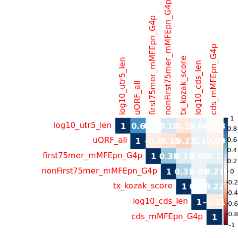

s8-3-1-1 Validation of method (single condition / prediction of MRL by
GAM)
================
Yoichiro Sugimoto
19 May, 2022

  - [Overview](#overview)
  - [Master table preparation](#master-table-preparation)
      - [Data import](#data-import)
      - [Functions](#functions)
      - [Data preparation for TSS isoform level
        analysis](#data-preparation-for-tss-isoform-level-analysis)
  - [Evaluation of the contribution of an individual mRNA feature on
    translation](#evaluation-of-the-contribution-of-an-individual-mrna-feature-on-translation)
  - [MRL prediction from the selected mRNA features using
    GAM](#mrl-prediction-from-the-selected-mrna-features-using-gam)
      - [Preliminary analysis of variable
        correlations](#preliminary-analysis-of-variable-correlations)
      - [Prediction with the four most significantly predictive mRNA
        features](#prediction-with-the-four-most-significantly-predictive-mrna-features)
  - [Analysis of the association of an individual mRNA feature and
    MRL](#analysis-of-the-association-of-an-individual-mrna-feature-and-mrl)
      - [uAUG](#uaug)
      - [CDS length](#cds-length)
      - [RNA structure near cap](#rna-structure-near-cap)
      - [Kozak sequence score](#kozak-sequence-score)
  - [Session information](#session-information)

# Overview

Validation of HP5 by analysing the relationship of mRNA features and MRL
will be performed.

``` r
## Additional packages for parallelization
## Specify the number of CPUs to be used
processors <- 8
## library("BiocParallel")
## register(MulticoreParam(processors))

## Significance threshold
sig.th <- 0.05

temp <- sapply(list.files("../functions", full.names = TRUE), source)
source(
    "../s6-differential-expression-and-tss-usage/functions/load_total_analysis_results.R",
    chdir = TRUE
)
```

    ## [1] "Sample file used: /camp/lab/ratcliffep/home/users/sugimoy/CAMP_HPC/projects/20211102_HP5_HIF_mTOR/data/sample_data/processed_sample_file.csv"
    ## [1] "The following R objects were exported: total.sample.dt, total.coldata.df, total.comparison.dt"
    ## [1] "Comparison information was loaded"
    ## [1] "/camp/lab/ratcliffep/home/users/sugimoy/CAMP_HPC/projects/20211102_HP5_HIF_mTOR/results"
    ## [1] "The following objects were loaded: tss.de.res.dt, tss.ratio.res.dt, diff.tss.res.dt"

``` r
RNGkind("L'Ecuyer-CMRG") # Random number for parallel process
set.seed(0)
```

``` r
annot.dir <- normalizePath(file.path("../../annotation/"))
annot.ps.dir <- file.path(annot.dir, "hg38_annotation/processed_data/")

results.dir <- file.path("../../results")
s4.tss.dir <- file.path(results.dir, "s4-tss-definition-and-tx-assignment")

s4.2.tx.assignment.dir <- file.path(s4.tss.dir, "s4-2-transcript-assignment")
s4.2.1.tss.tx.map.RCC4.dir <- file.path(s4.2.tx.assignment.dir, "s4-2-1-tss-transcript-mapping-RCC4")

s4.3.tx.info.dir <- file.path(s4.tss.dir, "s4-3-transcript-info")
s4.3.1.tx.info.rcc4.dir <- file.path(s4.3.tx.info.dir, "s4-3-1-transcript-info-for-RCC4")

s6.dir <- file.path(results.dir, "s6-differential-regulation-analysis")
s6.1.dir <- file.path(s6.dir, "s6-1-differentially-expressed-genes")

s8.dir <- file.path(results.dir, "s8-analysis-of-translation")
s8.1.dir <- file.path(s8.dir, "s8-1-differentially-translated-mRNAs")
s8.1.1.dir <- file.path(s8.1.dir, "gene-level-dte")
s8.1.2.dir <- file.path(s8.1.dir, "tx-level-dte")

s8.2.dte.iso.dir <- file.path(s8.dir, "s8-2-differentially-translated-isoforms")
s8.3.dir <- file.path(s8.dir, "s8-3-validation-of-method")

sq.dir <- file.path(results.dir, "sq-for-publication")
source.data.dir <- file.path(sq.dir, "sq1-source-data")
source.data.by.panel.dir <- file.path(source.data.dir, "by_panel")

sample.file <- file.path("../../data/sample_data/processed_sample_file.csv")
sample.dt <- fread(sample.file)
sample.names <- sample.dt[, sample_name]
```

# Master table preparation

## Data import

``` r
all.primary.tx.dt <- file.path(
    annot.ps.dir,
    "all_GENCODE_RefSeq_transcript_info.csv"
) %>% fread

all.primary.tx.dt <- all.primary.tx.dt[, c(
    "gene_id", "gene_name", "transcript_id", "chromosome_name",
    "biotype", "transcript_type",
    "basic_tag", "refseq_tag", "MANE_Select_tag", "appris_tag",
    "mRNA_start_NF_tag", "mRNA_end_NF_tag", "cds_start_NF_tag", "cds_end_NF_tag",
    "bicistronic_tag", "readthrough_transcript_tag", "fusion_gene_flag"
), with = FALSE]

r4.vhl.mrl.file <- "RCC4_xx_EIF4E2_yy_NA__noVHL_vs_VHL-mean_ribosome_loading.csv" 
```

## Functions

``` r
processMetaInfoDt <- function(dt){
    dt[, `:=`(
        first75mer_mMFEpn_G4p = - first75mer_MFE_G4p / 75,
        nonFirst75mer_mMFEpn_G4p = - nonFirst75mer_MFE_G4p /
            if_else(min_utr5_len > 85, mean_utr5_len - 75, NA_real_),
        cds_mMFEpn_G4p = - cds_MFE_G4p / cds_len,
        uORF_all_capped = round(uORF_all) %>%
            {case_when(
                 . >= 3 ~ "3+",
                 TRUE ~ as.character(.)
             )} %>% factor
        ,
        TOP_motif_length = tss_p1_pTOP,
        log10_cds_len = log10(cds_len),
        log10_utr5_len = log10(mean_utr5_len)
    )]
    return(dt)
}

filterMrlData <- function(dt, ref.colname, all.primary.tx.dt, filter.vals){
    dt <- dt[
        transcript_id %in% all.primary.tx.dt[
                               mRNA_start_NF_tag == "N/A" &
                               mRNA_end_NF_tag == "N/A" &
                               cds_start_NF_tag == "N/A" &
                               cds_end_NF_tag == "N/A" &
                               fusion_gene_flag == FALSE,
                               transcript_id
                           ]
    ][
        is.finite(log10_utr5_len) &
        cds_len > 100
    ][
        get(ref.colname) %in% filter.vals
    ]

    dt <- merge(
        all.primary.tx.dt[
          , c("transcript_id", "gene_name", "chromosome_name"), with = FALSE
        ],
        dt,
        by = "transcript_id"
    )
    
    return(dt)
}

target.var <- "MRL_base"

all.test.features <- c(
    "log10_utr5_len", "uORF_all",
    "first75mer_mMFEpn_G4p", "nonFirst75mer_mMFEpn_G4p", 
    "tx_kozak_score", "log10_cds_len", "cds_mMFEpn_G4p"
)

minMrlData <- function(dt, ref.colname, target.var, test.features){

    dt <- dt[, c(
        ref.colname, "gene_id", "transcript_id", "min_utr5_len", "cds_len",
        "meanNormCount_base",
        target.var, test.features
    ), with = FALSE]

    return(dt)
}
```

## Data preparation for TSS isoform level analysis

``` r
## Load mRNA meta information
tss.tx.assignment.dt <- file.path(
    s4.2.1.tss.tx.map.RCC4.dir,
    "transcripts-per-TSS-for-RCC4.gtf"
) %>%
    {rtracklayer::import(.)} %>%
as.data.frame %>% data.table

tss.tx.assignment.dt <- tss.tx.assignment.dt[!duplicated(transcript_id)]
tss.tx.assignment.dt[, transcript_id := original_transcript_id]

tx.meta.info.dt <- file.path(
  s4.3.1.tx.info.rcc4.dir,
  "transcript-meta-information-RCC4-VHL.csv"
) %>%
    fread

tx.meta.info.dt <- merge(
    tss.tx.assignment.dt[, .(tss_name, transcript_id)],
    tx.meta.info.dt,
    by = "tss_name"
)

tx.meta.info.dt <- processMetaInfoDt(tx.meta.info.dt)

fwrite(
    tx.meta.info.dt,
    file.path(s8.3.dir, "processed-tx-meta-info.csv")
)

## Import MRL data
tx.level.mrl.dt <- file.path(
    s8.1.2.dir,
    r4.vhl.mrl.file
) %>% fread

tx.level.mrl.master.dt <- merge(
    tx.level.mrl.dt[, c(
        "tss_name",
        "MRL_base", "totalRLRsd_base"
    ), with = FALSE],
    tx.meta.info.dt,
    by = "tss_name"
) %>%
    merge(
        y = tss.de.res.dt[
            comparison_name == "RCC4_xx_HIF1B_N__noVHL_vs_VHL",
            .(tss_name, meanNormCount_base)
        ],
        by = "tss_name"
    )

## Import gene filteration data
all.filtered.tss.dt <- file.path(
    s8.3.dir,
    "filtered_tss_for_polysome_analysis.csv"
) %>%
    fread

tss.level.mrl.master.dt <- minMrlData(
    tx.level.mrl.master.dt,
    ref.colname = "tss_name",
    target.var = target.var,
    test.features = all.test.features
)

tx.level.mrl.master.dt <- NULL

## Print basic stats to report
tss.level.mrl.master.dt[
    gene_id %in% all.primary.tx.dt[biotype == "protein_coding", gene_id] &
    tss_name %in% all.filtered.tss.dt[RCC4_VHL_NA == TRUE, tss_name]
] %T>%
    {print(
         paste0("The # of tx with MRL measurement: ", nrow(.))
     )} %>%
    {print(
         paste0("The # of gene with MRL measurement: ", nrow(.[!duplicated(gene_id)]))
     )}
```

    ## [1] "The # of tx with MRL measurement: 12459"
    ## [1] "The # of gene with MRL measurement: 7815"

``` r
tss.level.mrl.master.dt <- filterMrlData(
    dt = tss.level.mrl.master.dt,
    ref.colname = "tss_name",
    all.primary.tx.dt = all.primary.tx.dt,
    filter.vals = all.filtered.tss.dt[RCC4_VHL_NA == TRUE, tss_name]
)

fwrite(
    tss.level.mrl.master.dt,
    file = file.path(s8.3.dir, "tss_level_MRL_summary.csv")
)
```

# Evaluation of the contribution of an individual mRNA feature on translation

``` r
library("mgcv")
```

    ## Loading required package: nlme

    ## 
    ## Attaching package: 'nlme'

    ## The following object is masked from 'package:dplyr':
    ## 
    ##     collapse

    ## This is mgcv 1.8-31. For overview type 'help("mgcv-package")'.

``` r
createGamFormula <- function(test.features, target.var){
    gam.formula <- paste0(
        "s(",
        test.features,
        ', bs = "ts")', #bs="ts" is as "tp" but with a modification to the smoothing penalty, so that the null space is also penalized slightly and the whole term can therefore be shrunk to zero
        collapse = " + "
    ) %>%
        {paste0(c(target.var, .), collapse = " ~ ")} %>%
        as.formula
    return(gam.formula)
}


uniFeatureGam <- function(test.feature, sl.mrl.master.dt, target.var, quite = FALSE){

    sl.mrl.master.dt <- sl.mrl.master.dt[, c(
        "tss_name", "gene_id", target.var, test.feature
    ), with = FALSE] %>%
        {.[complete.cases(.)]} %>%
        {.[is.finite(get(test.feature))]}

    if(quite == FALSE){
        print(test.feature)
        
        print(paste0(
            "The number of tx for the analysis: ", nrow(sl.mrl.master.dt)
        ))
        print(paste0(
            "The number of genes for the analysis: ",
            nrow(sl.mrl.master.dt[!duplicated(gene_id)])
        ))
    } else {"No print"}
    
    uni.gam.formula <- createGamFormula(
        test.feature, target.var = target.var
    )

    gam.uni.fit <- gam(
        formula = uni.gam.formula,
        data = sl.mrl.master.dt,
        select = FALSE,
        method = "REML"
    )

    dev.summary.dt <- data.table(
        feature_name = test.feature,
        r_sq_model = summary(gam.uni.fit)$r.sq,        
        dev_explained_by_uni =  summary(gam.uni.fit)$dev.expl,
        p_value = summary(gam.uni.fit)$s.table[, "p-value"]
    )

    return(dev.summary.dt)    
}

runAllUniGam <- function(sl.mrl.master.dt, input.name, all.test.features, target.var, quite = FALSE){

    if(quite == FALSE){
        print("----------------------------------------------")
    } else {"No print"}
    
    all.uni.dev.dt <- lapply(
        all.test.features,
        uniFeatureGam,
        sl.mrl.master.dt = sl.mrl.master.dt,
        target.var = target.var,
        quite = quite
    ) %>%
        rbindlist

    all.uni.dev.dt[, `:=`(
        input_name = input.name
    )]

    return(all.uni.dev.dt)
}


all.uni.dev.dt <- runAllUniGam(
    sl.mrl.master.dt = tss.level.mrl.master.dt,
    input.name = "TSS resolution",
    all.test.features = all.test.features,
    target.var = "MRL_base"
)
```

    ## [1] "----------------------------------------------"
    ## [1] "log10_utr5_len"
    ## [1] "The number of tx for the analysis: 12268"
    ## [1] "The number of genes for the analysis: 7743"
    ## [1] "uORF_all"
    ## [1] "The number of tx for the analysis: 12268"
    ## [1] "The number of genes for the analysis: 7743"
    ## [1] "first75mer_mMFEpn_G4p"
    ## [1] "The number of tx for the analysis: 12266"
    ## [1] "The number of genes for the analysis: 7743"
    ## [1] "nonFirst75mer_mMFEpn_G4p"
    ## [1] "The number of tx for the analysis: 7325"
    ## [1] "The number of genes for the analysis: 4793"
    ## [1] "tx_kozak_score"
    ## [1] "The number of tx for the analysis: 12268"
    ## [1] "The number of genes for the analysis: 7743"
    ## [1] "log10_cds_len"
    ## [1] "The number of tx for the analysis: 12268"
    ## [1] "The number of genes for the analysis: 7743"
    ## [1] "cds_mMFEpn_G4p"
    ## [1] "The number of tx for the analysis: 12268"
    ## [1] "The number of genes for the analysis: 7743"

``` r
all.uni.dev.dt[, padj := p.adjust(p_value, method = "holm")]

print(all.uni.dev.dt)
```

    ##                feature_name  r_sq_model dev_explained_by_uni       p_value
    ## 1:           log10_utr5_len 0.004802846          0.005001412  2.864444e-15
    ## 2:                 uORF_all 0.077303068          0.077869910 3.069135e-234
    ## 3:    first75mer_mMFEpn_G4p 0.019862596          0.020373243  4.234402e-57
    ## 4: nonFirst75mer_mMFEpn_G4p 0.004560059          0.005169834  1.940279e-07
    ## 5:           tx_kozak_score 0.012577349          0.012858430  2.697437e-38
    ## 6:            log10_cds_len 0.190967144          0.191498958  0.000000e+00
    ## 7:           cds_mMFEpn_G4p 0.009710028          0.010109633  4.236869e-28
    ##        input_name          padj
    ## 1: TSS resolution  5.728889e-15
    ## 2: TSS resolution 1.841481e-233
    ## 3: TSS resolution  2.117201e-56
    ## 4: TSS resolution  1.940279e-07
    ## 5: TSS resolution  1.078975e-37
    ## 6: TSS resolution  0.000000e+00
    ## 7: TSS resolution  1.271061e-27

``` r
uniFeatureGamCV <- function(test.feature, train.mrl.master.dt, test.mrl.master.dt, target.var, quite = FALSE){
    
    train.mrl.master.dt <- train.mrl.master.dt[, c(
        "tss_name", "chromosome_name", "meanNormCount_base", target.var, test.feature
    ), with = FALSE] %>%
        {.[complete.cases(.)]} %>%
        {.[is.finite(get(test.feature))]}

    test.mrl.master.dt <- test.mrl.master.dt[, c(
        "tss_name", "chromosome_name", "meanNormCount_base", target.var, test.feature
    ), with = FALSE] %>%
        {.[complete.cases(.)]} %>%
        {.[is.finite(get(test.feature))]}
    
    
    if(quite == FALSE){
        print(test.feature)
        
        print(paste0(
            "The number of tx for training: ", nrow(train.mrl.master.dt)
        ))
        print(paste0(
            "The number of tx for test: ",
            nrow(test.mrl.master.dt)
        ))
    } else {"No print"}
    
    uni.gam.formula <- createGamFormula(
        test.feature, target.var = target.var
    )

    gam.uni.train.fit <- gam(
        formula = uni.gam.formula,
        data = train.mrl.master.dt,
        select = FALSE,
        method = "REML"
    )

    test.mrl.master.dt[, `:=`(
        prediced_MRL_base = predict(gam.uni.train.fit, newdata = test.mrl.master.dt)
    )]

    r.sq <- test.mrl.master.dt %$% 
        cor(prediced_MRL_base, MRL_base)^2

    
    dev.summary.dt <- data.table(
        feature_name = test.feature,
        r_sq_model = summary(gam.uni.train.fit)$r.sq,
        r_sq_cv = r.sq,
        dev_explained_by_uni =  summary(gam.uni.train.fit)$dev.expl,
        p_value = summary(gam.uni.train.fit)$s.table[, "p-value"]
    )

    return(dev.summary.dt)    
}


runAllUniGamCV <- function(run.index, sl.mrl.master.dt, input.name, all.test.features, target.var, quite = FALSE){

    if(quite == FALSE){
        print("----------------------------------------------")
    } else {"No print"}

    all.chrs <- unique(sl.mrl.master.dt[, chromosome_name])
    train.chrs <- sample(all.chrs, size = length(all.chrs) - 4, replace = FALSE)
    mrna.quantile <- quantile(sl.mrl.master.dt[, meanNormCount_base], probs = 0.5)

    train.tss.names <- sl.mrl.master.dt[
        chromosome_name %in% train.chrs,
        tss_name
    ]
    test.tss.names <- sl.mrl.master.dt[
        meanNormCount_base > mrna.quantile &
        !(chromosome_name %in% train.chrs),
        tss_name
    ]
    train.mrl.master.dt <- sl.mrl.master.dt[tss_name %in% train.tss.names]
    test.mrl.master.dt <- sl.mrl.master.dt[tss_name %in% test.tss.names]    
    
    all.uni.dev.dt <- lapply(
        all.test.features,
        uniFeatureGamCV,
        train.mrl.master.dt = train.mrl.master.dt,
        test.mrl.master.dt = test.mrl.master.dt,
        target.var = target.var,
        quite = quite
    ) %>%
        rbindlist

    all.uni.dev.dt[, `:=`(
        input_name = input.name,
        iteration_n = run.index
    )]

    return(all.uni.dev.dt)
}

all.uni.dev.cv.dt <- lapply(
    1:10,
    runAllUniGamCV,
    sl.mrl.master.dt = tss.level.mrl.master.dt,
    input.name = "TSS resolution",
    all.test.features = all.test.features,
    target.var = "MRL_base"
) %>%
    rbindlist
```

    ## [1] "----------------------------------------------"
    ## [1] "log10_utr5_len"
    ## [1] "The number of tx for training: 9469"
    ## [1] "The number of tx for test: 1457"
    ## [1] "uORF_all"
    ## [1] "The number of tx for training: 9469"
    ## [1] "The number of tx for test: 1457"
    ## [1] "first75mer_mMFEpn_G4p"
    ## [1] "The number of tx for training: 9468"
    ## [1] "The number of tx for test: 1457"
    ## [1] "nonFirst75mer_mMFEpn_G4p"
    ## [1] "The number of tx for training: 5607"
    ## [1] "The number of tx for test: 766"
    ## [1] "tx_kozak_score"
    ## [1] "The number of tx for training: 9469"
    ## [1] "The number of tx for test: 1457"
    ## [1] "log10_cds_len"
    ## [1] "The number of tx for training: 9469"
    ## [1] "The number of tx for test: 1457"
    ## [1] "cds_mMFEpn_G4p"
    ## [1] "The number of tx for training: 9469"
    ## [1] "The number of tx for test: 1457"
    ## [1] "----------------------------------------------"
    ## [1] "log10_utr5_len"
    ## [1] "The number of tx for training: 9863"
    ## [1] "The number of tx for test: 1156"
    ## [1] "uORF_all"
    ## [1] "The number of tx for training: 9863"
    ## [1] "The number of tx for test: 1156"
    ## [1] "first75mer_mMFEpn_G4p"
    ## [1] "The number of tx for training: 9861"
    ## [1] "The number of tx for test: 1156"
    ## [1] "nonFirst75mer_mMFEpn_G4p"
    ## [1] "The number of tx for training: 5909"
    ## [1] "The number of tx for test: 547"
    ## [1] "tx_kozak_score"
    ## [1] "The number of tx for training: 9863"
    ## [1] "The number of tx for test: 1156"
    ## [1] "log10_cds_len"
    ## [1] "The number of tx for training: 9863"
    ## [1] "The number of tx for test: 1156"
    ## [1] "cds_mMFEpn_G4p"
    ## [1] "The number of tx for training: 9863"
    ## [1] "The number of tx for test: 1156"
    ## [1] "----------------------------------------------"
    ## [1] "log10_utr5_len"
    ## [1] "The number of tx for training: 9119"
    ## [1] "The number of tx for test: 1660"
    ## [1] "uORF_all"
    ## [1] "The number of tx for training: 9119"
    ## [1] "The number of tx for test: 1660"
    ## [1] "first75mer_mMFEpn_G4p"
    ## [1] "The number of tx for training: 9117"
    ## [1] "The number of tx for test: 1660"
    ## [1] "nonFirst75mer_mMFEpn_G4p"
    ## [1] "The number of tx for training: 5427"
    ## [1] "The number of tx for test: 844"
    ## [1] "tx_kozak_score"
    ## [1] "The number of tx for training: 9119"
    ## [1] "The number of tx for test: 1660"
    ## [1] "log10_cds_len"
    ## [1] "The number of tx for training: 9119"
    ## [1] "The number of tx for test: 1660"
    ## [1] "cds_mMFEpn_G4p"
    ## [1] "The number of tx for training: 9119"
    ## [1] "The number of tx for test: 1660"
    ## [1] "----------------------------------------------"
    ## [1] "log10_utr5_len"
    ## [1] "The number of tx for training: 10289"
    ## [1] "The number of tx for test: 972"
    ## [1] "uORF_all"
    ## [1] "The number of tx for training: 10289"
    ## [1] "The number of tx for test: 972"
    ## [1] "first75mer_mMFEpn_G4p"
    ## [1] "The number of tx for training: 10287"
    ## [1] "The number of tx for test: 972"
    ## [1] "nonFirst75mer_mMFEpn_G4p"
    ## [1] "The number of tx for training: 6150"
    ## [1] "The number of tx for test: 468"
    ## [1] "tx_kozak_score"
    ## [1] "The number of tx for training: 10289"
    ## [1] "The number of tx for test: 972"
    ## [1] "log10_cds_len"
    ## [1] "The number of tx for training: 10289"
    ## [1] "The number of tx for test: 972"
    ## [1] "cds_mMFEpn_G4p"
    ## [1] "The number of tx for training: 10289"
    ## [1] "The number of tx for test: 972"
    ## [1] "----------------------------------------------"
    ## [1] "log10_utr5_len"
    ## [1] "The number of tx for training: 9503"
    ## [1] "The number of tx for test: 1464"
    ## [1] "uORF_all"
    ## [1] "The number of tx for training: 9503"
    ## [1] "The number of tx for test: 1464"
    ## [1] "first75mer_mMFEpn_G4p"
    ## [1] "The number of tx for training: 9501"
    ## [1] "The number of tx for test: 1464"
    ## [1] "nonFirst75mer_mMFEpn_G4p"
    ## [1] "The number of tx for training: 5713"
    ## [1] "The number of tx for test: 749"
    ## [1] "tx_kozak_score"
    ## [1] "The number of tx for training: 9503"
    ## [1] "The number of tx for test: 1464"
    ## [1] "log10_cds_len"
    ## [1] "The number of tx for training: 9503"
    ## [1] "The number of tx for test: 1464"
    ## [1] "cds_mMFEpn_G4p"
    ## [1] "The number of tx for training: 9503"
    ## [1] "The number of tx for test: 1464"
    ## [1] "----------------------------------------------"
    ## [1] "log10_utr5_len"
    ## [1] "The number of tx for training: 10190"
    ## [1] "The number of tx for test: 1023"
    ## [1] "uORF_all"
    ## [1] "The number of tx for training: 10190"
    ## [1] "The number of tx for test: 1023"
    ## [1] "first75mer_mMFEpn_G4p"
    ## [1] "The number of tx for training: 10188"
    ## [1] "The number of tx for test: 1023"
    ## [1] "nonFirst75mer_mMFEpn_G4p"
    ## [1] "The number of tx for training: 6070"
    ## [1] "The number of tx for test: 504"
    ## [1] "tx_kozak_score"
    ## [1] "The number of tx for training: 10190"
    ## [1] "The number of tx for test: 1023"
    ## [1] "log10_cds_len"
    ## [1] "The number of tx for training: 10190"
    ## [1] "The number of tx for test: 1023"
    ## [1] "cds_mMFEpn_G4p"
    ## [1] "The number of tx for training: 10190"
    ## [1] "The number of tx for test: 1023"
    ## [1] "----------------------------------------------"
    ## [1] "log10_utr5_len"
    ## [1] "The number of tx for training: 8956"
    ## [1] "The number of tx for test: 1757"
    ## [1] "uORF_all"
    ## [1] "The number of tx for training: 8956"
    ## [1] "The number of tx for test: 1757"
    ## [1] "first75mer_mMFEpn_G4p"
    ## [1] "The number of tx for training: 8954"
    ## [1] "The number of tx for test: 1757"
    ## [1] "nonFirst75mer_mMFEpn_G4p"
    ## [1] "The number of tx for training: 5317"
    ## [1] "The number of tx for test: 945"
    ## [1] "tx_kozak_score"
    ## [1] "The number of tx for training: 8956"
    ## [1] "The number of tx for test: 1757"
    ## [1] "log10_cds_len"
    ## [1] "The number of tx for training: 8956"
    ## [1] "The number of tx for test: 1757"
    ## [1] "cds_mMFEpn_G4p"
    ## [1] "The number of tx for training: 8956"
    ## [1] "The number of tx for test: 1757"
    ## [1] "----------------------------------------------"
    ## [1] "log10_utr5_len"
    ## [1] "The number of tx for training: 9581"
    ## [1] "The number of tx for test: 1380"
    ## [1] "uORF_all"
    ## [1] "The number of tx for training: 9581"
    ## [1] "The number of tx for test: 1380"
    ## [1] "first75mer_mMFEpn_G4p"
    ## [1] "The number of tx for training: 9579"
    ## [1] "The number of tx for test: 1380"
    ## [1] "nonFirst75mer_mMFEpn_G4p"
    ## [1] "The number of tx for training: 5706"
    ## [1] "The number of tx for test: 693"
    ## [1] "tx_kozak_score"
    ## [1] "The number of tx for training: 9581"
    ## [1] "The number of tx for test: 1380"
    ## [1] "log10_cds_len"
    ## [1] "The number of tx for training: 9581"
    ## [1] "The number of tx for test: 1380"
    ## [1] "cds_mMFEpn_G4p"
    ## [1] "The number of tx for training: 9581"
    ## [1] "The number of tx for test: 1380"
    ## [1] "----------------------------------------------"
    ## [1] "log10_utr5_len"
    ## [1] "The number of tx for training: 9578"
    ## [1] "The number of tx for test: 1391"
    ## [1] "uORF_all"
    ## [1] "The number of tx for training: 9578"
    ## [1] "The number of tx for test: 1391"
    ## [1] "first75mer_mMFEpn_G4p"
    ## [1] "The number of tx for training: 9576"
    ## [1] "The number of tx for test: 1391"
    ## [1] "nonFirst75mer_mMFEpn_G4p"
    ## [1] "The number of tx for training: 5681"
    ## [1] "The number of tx for test: 751"
    ## [1] "tx_kozak_score"
    ## [1] "The number of tx for training: 9578"
    ## [1] "The number of tx for test: 1391"
    ## [1] "log10_cds_len"
    ## [1] "The number of tx for training: 9578"
    ## [1] "The number of tx for test: 1391"
    ## [1] "cds_mMFEpn_G4p"
    ## [1] "The number of tx for training: 9578"
    ## [1] "The number of tx for test: 1391"
    ## [1] "----------------------------------------------"
    ## [1] "log10_utr5_len"
    ## [1] "The number of tx for training: 9009"
    ## [1] "The number of tx for test: 1621"
    ## [1] "uORF_all"
    ## [1] "The number of tx for training: 9009"
    ## [1] "The number of tx for test: 1621"
    ## [1] "first75mer_mMFEpn_G4p"
    ## [1] "The number of tx for training: 9007"
    ## [1] "The number of tx for test: 1621"
    ## [1] "nonFirst75mer_mMFEpn_G4p"
    ## [1] "The number of tx for training: 5400"
    ## [1] "The number of tx for test: 809"
    ## [1] "tx_kozak_score"
    ## [1] "The number of tx for training: 9009"
    ## [1] "The number of tx for test: 1621"
    ## [1] "log10_cds_len"
    ## [1] "The number of tx for training: 9009"
    ## [1] "The number of tx for test: 1621"
    ## [1] "cds_mMFEpn_G4p"
    ## [1] "The number of tx for training: 9009"
    ## [1] "The number of tx for test: 1621"

``` r
std.error <- function(x) sd(x)/sqrt(length(x))

all.uni.dev.cv.summary.dt <- all.uni.dev.cv.dt[, list(
    rsq_mean = mean(r_sq_cv),
    rsq_sem = std.error(r_sq_cv)
), by = feature_name] %>%
    merge(
        all.uni.dev.dt[, .(feature_name, padj)],
        by = "feature_name"
    )

all.uni.dev.cv.summary.dt <- all.uni.dev.cv.summary.dt[
  , feature_name := factor(
        feature_name,
        levels = all.test.features 
    )][order(feature_name)]

all.uni.dev.cv.summary.dt[, `:=`(
    simplified_feature_name = c(
        "Length",
        "uORF number",
        "Structure (near cap)",
        "Structure (distal to cap)",
        "Kozak sequence",
        "Length",
        "Structure"
    )  %>%
        factor(levels = c(
                   "Kozak sequence",
                   "Length",
                   "uORF number",
                   "Structure (near cap)",
                   "Structure (distal to cap)",
                   "Structure"                   
               )),
    segment = c(rep("5' UTR", times = 4), rep("CDS", times = 3)),
    sig_mark = case_when(
        padj < sig.th * 0.1 ~ "**",
        padj < sig.th ~ "*",
        TRUE ~ NA_character_
    )
)]

all.uni.dev.cv.dt <- all.uni.dev.cv.dt[
  , feature_name := factor(
        feature_name,
        levels = all.test.features 
    )][order(feature_name)]

all.uni.dev.cv.dt[, `:=`(
    simplified_feature_name = c(
        "Length",
        "uORF number",
        "Structure (near cap)",
        "Structure (distal to cap)",
        "Kozak sequence",
        "Length",
        "Structure"
    )  %>%
        {rep(., each = 10)} %>%
        factor(levels = c(
                   "Kozak sequence",
                   "Length",
                   "uORF number",
                   "Structure (near cap)",
                   "Structure (distal to cap)",
                   "Structure"                   
               )),
    segment = c(rep("5' UTR", times = 4*10), rep("CDS", times = 3*10))
)]

library("ggbeeswarm")

all.uni.dev.cv.summary.dt %T>%
    print %>%
    ggplot(
        aes(
            y = rsq_mean,
            x = simplified_feature_name
        )
    ) +
    geom_bar(stat = "identity", position = "dodge") +
    geom_quasirandom(
        data = all.uni.dev.cv.dt,
        aes(y = r_sq_cv),
        shape = 21,
        fill = "gray60",
        color = "black"
    ) +
    geom_errorbar(
        aes(ymin = rsq_mean - rsq_sem, ymax = rsq_mean + rsq_sem),
        width = 0.5
    ) +
    stat_summary(
        geom = 'text', aes(label = sig_mark),
        fun = max, 
        vjust = -0.75, color = "black", size = 6
    ) +
    facet_grid(~ segment, space = "free", scale = "free") +
    ggsci::scale_fill_jama() +
    scale_x_discrete(guide = guide_axis(angle = 90)) +
    scale_y_continuous(
        labels = scales::percent_format(accuracy = 1), limits = c(0, 0.35)
    ) +
    xlab("mRNA features") +
    ylab("R2") +
    theme(
        legend.position = "bottom"
    )
```

    ##                feature_name    rsq_mean      rsq_sem          padj
    ## 1:           log10_utr5_len 0.002901122 0.0009366751  5.728889e-15
    ## 2:                 uORF_all 0.061670490 0.0056026713 1.841481e-233
    ## 3:    first75mer_mMFEpn_G4p 0.021705075 0.0026741240  2.117201e-56
    ## 4: nonFirst75mer_mMFEpn_G4p 0.003560954 0.0011440945  1.940279e-07
    ## 5:           tx_kozak_score 0.009947763 0.0014667043  1.078975e-37
    ## 6:            log10_cds_len 0.278747902 0.0058808348  0.000000e+00
    ## 7:           cds_mMFEpn_G4p 0.007577202 0.0019463763  1.271061e-27
    ##      simplified_feature_name segment sig_mark
    ## 1:                    Length  5' UTR       **
    ## 2:               uORF number  5' UTR       **
    ## 3:      Structure (near cap)  5' UTR       **
    ## 4: Structure (distal to cap)  5' UTR       **
    ## 5:            Kozak sequence     CDS       **
    ## 6:                    Length     CDS       **
    ## 7:                 Structure     CDS       **

<!-- -->

``` r
temp <- exportSourceData(
    dt = all.uni.dev.cv.dt,
    original.colnames = c("segment", "simplified_feature_name", "iteration_n", "r_sq_cv"),
    export.colnames = c("Segment", "Feature_name", "Iteration", "R2"),
    export.file.name = "Extended Data Fig. 3b raw.csv"
)

temp <- exportSourceData(
    dt = all.uni.dev.cv.summary.dt,
    original.colnames = c("segment", "simplified_feature_name", "rsq_mean", "rsq_sem"),
    export.colnames = c("Segment", "Feature_name", "R2 (mean)", "R2 (s.e.m)"),
    export.file.name = "Extended Data Fig. 3b stats.csv"
)
```

# MRL prediction from the selected mRNA features using GAM

## Preliminary analysis of variable correlations

``` r
library("corrplot")
```

    ## corrplot 0.84 loaded

``` r
corrplot(
    tss.level.mrl.master.dt[, all.test.features, with = FALSE] %>%
    {.[complete.cases(.)]} %>% cor,
    type = "upper",
    method = "color",
    addCoef.col = "white"
)
```

<!-- -->

## Prediction with the four most significantly predictive mRNA features

``` r
## Extract necessary data
sl.test.features <- c(
    "uORF_all", "first75mer_mMFEpn_G4p", "tx_kozak_score", "log10_cds_len"
)

if(all(sl.test.features %in% all.uni.dev.dt[order(p_value)][1:4, feature_name])){
    "OK"
} else {stop("Check the 3 most significant features")}
```

    ## [1] "OK"

``` r
print(
    paste0(
        "All ",
        length(tss.level.mrl.master.dt[, chromosome_name] %>% unique),
        " chromosomes used here"
    )
)
```

    ## [1] "All 23 chromosomes used here"

``` r
print(tss.level.mrl.master.dt[, chromosome_name] %>% unique %>% sort)
```

    ##  [1] "chr1"  "chr10" "chr11" "chr12" "chr13" "chr14" "chr15" "chr16" "chr17"
    ## [10] "chr18" "chr19" "chr2"  "chr20" "chr21" "chr22" "chr3"  "chr4"  "chr5" 
    ## [19] "chr6"  "chr7"  "chr8"  "chr9"  "chrX"

``` r
predictMRL <- function(sl.mrl.master.dt, target.var, test.features, ref.colname, plot.result = FALSE){

    sl.mrl.master.dt <- sl.mrl.master.dt[, c(
        ref.colname, target.var, test.features, "chromosome_name", "meanNormCount_base"
    ), with = FALSE] %>%
        {.[complete.cases(.)]}

    all.chrs <- unique(sl.mrl.master.dt[, chromosome_name])
    train.chrs <- sample(all.chrs, size = length(all.chrs) - 4, replace = FALSE)

    mrna.quantile <- quantile(sl.mrl.master.dt[, meanNormCount_base], probs = 0.5)

    train.tss.names <- sl.mrl.master.dt[
        chromosome_name %in% train.chrs,
        get(ref.colname)
    ]

    test.tss.names <- sl.mrl.master.dt[
        meanNormCount_base > mrna.quantile &
        !(chromosome_name %in% train.chrs),
        get(ref.colname)
    ]

    train.mrl.master.dt <- sl.mrl.master.dt[get(ref.colname) %in% train.tss.names]
    test.mrl.master.dt <- sl.mrl.master.dt[get(ref.colname) %in% test.tss.names]

    gam.fm.train.fit <- gam(
        formula = createGamFormula(test.features = sl.test.features, target.var),
        data = train.mrl.master.dt,
        method = "REML"
    )

    test.mrl.master.dt[, `:=`(
        prediced_MRL_base = predict(gam.fm.train.fit, newdata = test.mrl.master.dt)
    )]

    r.sq <- test.mrl.master.dt %$% 
        cor(prediced_MRL_base, MRL_base)^2

    print(round(r.sq, digits = 3))
    
    if(plot.result){

        g1 <- ggplot(
            data = test.mrl.master.dt,
            aes(
                x = MRL_base,
                y = prediced_MRL_base
            )
        ) +
            geom_point() +
            coord_cartesian(xlim = c(2, 7), ylim = c(2, 7)) +
            xlab("Measured MRL") +
            ylab("Predicted MRL")

        print(g1)

        print(paste0(
            "The number of tx for training: ", nrow(train.mrl.master.dt), "\n",
            "The number of tx for test: ", nrow(test.mrl.master.dt)
        ))

    } else {"No plot"}

    return(r.sq)
}

tx.r.sqs <- mclapply(
    1:10,
    function(x){
        predictMRL(
            sl.mrl.master.dt = tss.level.mrl.master.dt,
            target.var = target.var,
            test.features = sl.test.features,
            ref.colname = "tss_name",
            plot.result = FALSE
        )        
    },
    mc.cores = processors
) %>% unlist

summary(tx.r.sqs)
```

    ##    Min. 1st Qu.  Median    Mean 3rd Qu.    Max. 
    ##  0.3160  0.3487  0.3627  0.3609  0.3767  0.3968

# Analysis of the association of an individual mRNA feature and MRL

## uAUG

``` r
## Plot individual fit
tss.level.mrl.master.dt[, uORF_capped := factor(
                              round(uORF_all) %>%
                              {case_when(
                                  . >= 3 ~ "3+",
                                  TRUE ~ as.character(.)
                              )}
                          )]

uorf.test.res.dt <- tss.level.mrl.master.dt[!is.na(MRL_base)] %$%
    pairwise.wilcox.test(
        x = MRL_base,
        g = uORF_capped,
        p.adjust.method = "none",
        alternative = "two.sided"
    )$p.value[, 1] %>%
    p.adjust(method = "holm") %>%
    {data.table(stack(.))}

setnames(uorf.test.res.dt, old = c("values", "ind"), new = c("padj", "uORF_capped"))

uorf.test.res.dt[, sig_mark := case_when(
                       padj < sig.th * 0.1 ~ "**",
                       padj < sig.th ~ "*",
                       TRUE ~ NA_character_
                   )]

print(uorf.test.res.dt)
```

    ##             padj uORF_capped sig_mark
    ## 1:  2.802657e-63           1       **
    ## 2:  1.635234e-85           2       **
    ## 3: 4.425246e-127          3+       **

``` r
merge(
    tss.level.mrl.master.dt[!is.na(MRL_base)],
    uorf.test.res.dt,
    by = "uORF_capped",
    all.x = TRUE
) %>%
    ggplot(
        aes(
            x = uORF_capped,
            y = MRL_base
        )
    ) +
    geom_boxplot(
        fill = "#4477AA",
        outlier.shape = NA
    ) +
    stat_summary(
        geom = 'text', aes(label = sig_mark),
        fun = function(x){boxplot.stats(x)$stats[5]}, 
        vjust = -0.8, color = "black", size = 6
    ) +
    theme(
        aspect.ratio = 2
    ) +
    ylab("MRL in RCC4 VHL") +
    xlab("uORF number")
```

    ## Warning: Removed 1 rows containing missing values (geom_text).

<!-- -->

``` r
print("The sample numbers for the boxplots")
```

    ## [1] "The sample numbers for the boxplots"

``` r
tss.level.mrl.master.dt[
    !is.na(MRL_base),
    table(uORF_capped)
]
```

    ## uORF_capped
    ##    0    1    2   3+ 
    ## 6794 2706 1325 1443

## CDS length

``` r
tss.level.mrl.master.dt[, `:=`(
    cds_len_bin = cut(
        log10_cds_len,
        breaks = seq(2, 5, by = 0.25),
        labels = paste0(
            "(",
            seq(2, 5, by = 0.25) %>% {.[1:(length(.) - 1)]} %>% {round(10^.)},
            ", ",
            seq(2, 5, by = 0.25) %>% {.[2:length(.)]} %>% {round(10^.)},
            "]"
        )
    )
)]

all.cds.len.bins <- tss.level.mrl.master.dt[, unique(cds_len_bin)]

ref.bin <- "(1000, 1778]"
all.non.ref.bins <- all.cds.len.bins[all.cds.len.bins != ref.bin]

runWilcoxForCds <- function(sl.bin, mrl.master.dt){
    data.table(
        cds_len_bin = sl.bin,
        wil_p = wilcox.test(
            x = mrl.master.dt[!is.na(MRL_base) & cds_len_bin == ref.bin, MRL_base],
            y = mrl.master.dt[!is.na(MRL_base) & cds_len_bin == sl.bin, MRL_base],
            alternative = "two.sided"
        )$p.value
    )
}

cds.bin.wilp.dt <- lapply(
    sort(all.non.ref.bins),
    runWilcoxForCds,
    mrl.master.dt = tss.level.mrl.master.dt[!is.na(MRL_base)]
) %>%
    rbindlist %>%
{.[, padj := p.adjust(wil_p, method = "holm")]} %>%
{.[, sig_mark := case_when(
         padj < sig.th * 0.1 ~ "**",
         padj < sig.th ~ "*",
         TRUE ~ NA_character_
     )
]} %T>%
print %>%
rbind(
    data.table(cds_len_bin = ref.bin, sig_mark = "(NA)"),
    use.names = TRUE, fill = TRUE
) %>% {.[order(cds_len_bin)]}
```

    ##       cds_len_bin         wil_p          padj sig_mark
    ## 1:     (100, 178]  5.841272e-21  2.336509e-20       **
    ## 2:     (178, 316] 2.586630e-179 2.069304e-178       **
    ## 3:     (316, 562] 1.711674e-188 1.540506e-187       **
    ## 4:    (562, 1000]  3.495210e-04  6.990419e-04       **
    ## 5:   (1778, 3162]  4.686491e-63  2.811894e-62       **
    ## 6:   (3162, 5623]  1.994648e-72  1.396254e-71       **
    ## 7:  (5623, 10000]  1.437175e-37  7.185875e-37       **
    ## 8: (10000, 17783]  1.524225e-06  4.572675e-06       **
    ## 9: (17783, 31623]  5.751682e-01  5.751682e-01     <NA>

``` r
for.plot.cds.len.tss.level.mrl.master.dt <- merge(
    tss.level.mrl.master.dt[
        !is.na(cds_len_bin) & !is.na(MRL_base) &
        !(cds_len_bin %in% c("(17783, 31623]", "(31623, 56234]", "(56234, 1e+05]"))
    ],
    cds.bin.wilp.dt,
    by = "cds_len_bin", all.x = TRUE
)

ggplot(
    for.plot.cds.len.tss.level.mrl.master.dt,
    aes(
        x = cds_len_bin,
        y = MRL_base
    )
) +
    geom_boxplot(
        aes(
            group = cds_len_bin
        ),
        fill = "#4477AA",
        outlier.shape = NA
    ) +
    stat_summary(
        geom = 'text', aes(label = sig_mark),
        fun = function(x){boxplot.stats(x)$stats[5]}, 
        vjust = -0.25, color = "black", size = 5
    ) +
    theme(
        aspect.ratio = 1,
        axis.text.x = element_text(angle = 90, vjust = 0.5, hjust = 1)
    ) +
    ylab("MRL in RCC4 VHL") +
    xlab("CDS length [nts]")
```

<!-- -->

``` r
print("The sample numbers for the boxplots")
```

    ## [1] "The sample numbers for the boxplots"

``` r
tss.level.mrl.master.dt[!is.na(MRL_base), table(cds_len_bin)]
```

    ## cds_len_bin
    ##     (100, 178]     (178, 316]     (316, 562]    (562, 1000]   (1000, 1778] 
    ##             41            468           1344           3082           4100 
    ##   (1778, 3162]   (3162, 5623]  (5623, 10000] (10000, 17783] (17783, 31623] 
    ##           2309            731            162             30              1 
    ## (31623, 56234] (56234, 1e+05] 
    ##              0              0

## RNA structure near cap

``` r
tss.level.mrl.master.dt[, `:=`(
    rna_structure_bin = cut_number(
        first75mer_mMFEpn_G4p, n = 5
    )
)]

ggplot(
    data = tss.level.mrl.master.dt[!is.na(rna_structure_bin)],
    aes(
        x = rna_structure_bin,
        y = MRL_base
    )
) +
    geom_boxplot(
        fill = "#4477AA",
        outlier.shape = NA,
        notch = TRUE,
        alpha = 0.8
    ) +
    theme(
        aspect.ratio = 1,
        axis.text.x = element_text(angle = 90, vjust = 0.5, hjust = 1)
    ) +
    ylab("MRL in RCC4 VHL") +
    xlab("RNA structure (near cap)")
```

    ## Warning: Removed 3 rows containing non-finite values (stat_boxplot).

<!-- -->

``` r
## In comparison to the most structured bin
tss.level.mrl.master.dt %$%
    pairwise.wilcox.test(
        x = MRL_base,
        g = rna_structure_bin,
        p.adjust.method = "none",
        alternative = "two.sided"
    )$p.value[4, ] %>%
    p.adjust(method = "holm")
```

    ## [0.0064,0.278]  (0.278,0.344]  (0.344,0.402]  (0.402,0.474] 
    ##   5.945435e-16   2.040951e-30   5.900179e-38   5.816111e-24

``` r
ref.structure.bin <- tss.level.mrl.master.dt[
    order(rna_structure_bin, decreasing = TRUE)
][
    1, rna_structure_bin
]

tss.level.mrl.master.dt %$%
pairwise.wilcox.test(
    x = MRL_base,
    g = (ref.structure.bin == rna_structure_bin),
    alternative = "two.sided"
)
```

    ## 
    ##  Pairwise comparisons using Wilcoxon rank sum test with continuity correction 
    ## 
    ## data:  MRL_base and (ref.structure.bin == rna_structure_bin) 
    ## 
    ##      FALSE 
    ## TRUE <2e-16
    ## 
    ## P value adjustment method: holm

``` r
print("The number of mRNAs per bin")
```

    ## [1] "The number of mRNAs per bin"

``` r
tss.level.mrl.master.dt[!is.na(MRL_base), table(rna_structure_bin)]
```

    ## rna_structure_bin
    ## [0.0064,0.278]  (0.278,0.344]  (0.344,0.402]  (0.402,0.474]    (0.474,1.1] 
    ##           2454           2454           2450           2454           2454

``` r
tss.level.mrl.master.dt[
    !is.na(MRL_base),
    table(ref.structure.bin == rna_structure_bin)
]
```

    ## 
    ## FALSE  TRUE 
    ##  9812  2454

## Kozak sequence score

``` r
tss.level.mrl.master.dt[, `:=`(
    kozak_bin = cut_number(
        tx_kozak_score, n = 5
    )
)]

all.kozak.bins <- tss.level.mrl.master.dt[, unique(kozak_bin) %>% sort]
ref.kozak.bin <- all.kozak.bins[3]
comp.kozak.bins <- all.kozak.bins[all.kozak.bins != ref.kozak.bin]

kozak.sig.dt <- lapply(
    sort(comp.kozak.bins),
    function(x){
        data.table(
            kozak_bin = x,
            wil_p = wilcox.test(
                x = tss.level.mrl.master.dt[kozak_bin == ref.kozak.bin, MRL_base],
                y = tss.level.mrl.master.dt[kozak_bin == x, MRL_base],
                alternative = "two.sided"
            )$p.value,
            N = nrow(tss.level.mrl.master.dt[kozak_bin == x]),
            N_ref = nrow(tss.level.mrl.master.dt[kozak_bin == ref.kozak.bin])
        )
    }
) %>%
    rbindlist %>%
    {.[, padj := p.adjust(wil_p, method = "holm")]} %>%
    {.[, sig_mark := case_when(
             padj < sig.th * 0.1 ~ "**",
             padj < sig.th ~ "*",
             TRUE ~ NA_character_
         )
       ]} %T>%
    print
```

    ##        kozak_bin        wil_p    N N_ref         padj sig_mark
    ## 1:  [0.164,0.56] 3.014643e-12 2455  2455 1.205857e-11       **
    ## 2:  (0.56,0.642] 6.749512e-04 2454  2455 2.024854e-03       **
    ## 3: (0.712,0.785] 2.732757e-02 2453  2455 2.732757e-02        *
    ## 4: (0.785,0.989] 7.783236e-03 2454  2455 1.556647e-02        *

``` r
print("The number of mRNAs per bin")
```

    ## [1] "The number of mRNAs per bin"

``` r
tss.level.mrl.master.dt[!is.na(MRL_base), table(kozak_bin)]
```

    ## kozak_bin
    ##  [0.164,0.56]  (0.56,0.642] (0.642,0.712] (0.712,0.785] (0.785,0.989] 
    ##          2454          2454          2453          2453          2454

``` r
merge(
    tss.level.mrl.master.dt,
    kozak.sig.dt,
    by = "kozak_bin",
    all.x = TRUE
) %>%
    ggplot(
        aes(
            x = kozak_bin,
            y = MRL_base
        )
    ) +
    geom_boxplot(
        fill = "#4477AA",
        alpha = 0.8,
        outlier.shape = NA,
        notch = TRUE
    ) +
    geom_hline(
        yintercept = tss.level.mrl.master.dt[, median(MRL_base, na.rm = TRUE)],
        color = "gray20", linetype = "dashed", size = 0.8
    ) +
    stat_summary(
        geom = 'text', aes(label = sig_mark),
        fun = function(x){boxplot.stats(x)$stats[5]}, 
        vjust = -0.25, color = "black", size = 5
    ) +
    theme(
        aspect.ratio = 1,
        axis.text.x = element_text(angle = 90, vjust = 0.5, hjust = 1)
    ) +
    ylab("MRL in RCC4 VHL") +
    xlab("Kozak consensus")
```

    ## Warning: Removed 3 rows containing non-finite values (stat_boxplot).

    ## Warning: Removed 3 rows containing non-finite values (stat_summary).

    ## Warning: Removed 1 rows containing missing values (geom_text).

<!-- -->

# Session information

``` r
sessionInfo()
```

    ## R version 4.0.0 (2020-04-24)
    ## Platform: x86_64-conda_cos6-linux-gnu (64-bit)
    ## Running under: CentOS Linux 7 (Core)
    ## 
    ## Matrix products: default
    ## BLAS/LAPACK: /camp/lab/ratcliffep/home/users/sugimoy/CAMP_HPC/software/miniconda3_20200606/envs/five_prime_seq_for_VHL_loss_v0.2.1/lib/libopenblasp-r0.3.10.so
    ## 
    ## Random number generation:
    ##  RNG:     L'Ecuyer-CMRG 
    ##  Normal:  Inversion 
    ##  Sample:  Rejection 
    ##  
    ## locale:
    ##  [1] LC_CTYPE=en_GB.UTF-8       LC_NUMERIC=C              
    ##  [3] LC_TIME=en_GB.UTF-8        LC_COLLATE=en_GB.UTF-8    
    ##  [5] LC_MONETARY=en_GB.UTF-8    LC_MESSAGES=en_GB.UTF-8   
    ##  [7] LC_PAPER=en_GB.UTF-8       LC_NAME=C                 
    ##  [9] LC_ADDRESS=C               LC_TELEPHONE=C            
    ## [11] LC_MEASUREMENT=en_GB.UTF-8 LC_IDENTIFICATION=C       
    ## 
    ## attached base packages:
    ## [1] parallel  stats     graphics  grDevices utils     datasets  methods  
    ## [8] base     
    ## 
    ## other attached packages:
    ##  [1] corrplot_0.84     ggbeeswarm_0.6.0  mgcv_1.8-31       nlme_3.1-148     
    ##  [5] knitr_1.28        stringr_1.4.0     magrittr_1.5      data.table_1.12.8
    ##  [9] dplyr_1.0.0       khroma_1.3.0      ggplot2_3.3.1     rmarkdown_2.2    
    ## 
    ## loaded via a namespace (and not attached):
    ##  [1] Rcpp_1.0.4.6                lattice_0.20-41            
    ##  [3] Rsamtools_2.4.0             Biostrings_2.56.0          
    ##  [5] digest_0.6.25               R6_2.4.1                   
    ##  [7] GenomeInfoDb_1.24.0         stats4_4.0.0               
    ##  [9] evaluate_0.14               pillar_1.4.4               
    ## [11] zlibbioc_1.34.0             rlang_0.4.10               
    ## [13] S4Vectors_0.26.0            Matrix_1.2-18              
    ## [15] labeling_0.3                splines_4.0.0              
    ## [17] BiocParallel_1.22.0         RCurl_1.98-1.2             
    ## [19] munsell_0.5.0               DelayedArray_0.14.0        
    ## [21] compiler_4.0.0              vipor_0.4.5                
    ## [23] rtracklayer_1.48.0          xfun_0.14                  
    ## [25] pkgconfig_2.0.3             BiocGenerics_0.34.0        
    ## [27] htmltools_0.4.0             tidyselect_1.1.0           
    ## [29] SummarizedExperiment_1.18.1 tibble_3.0.1               
    ## [31] GenomeInfoDbData_1.2.3      IRanges_2.22.1             
    ## [33] matrixStats_0.56.0          XML_3.99-0.3               
    ## [35] crayon_1.3.4                withr_2.4.1                
    ## [37] GenomicAlignments_1.24.0    bitops_1.0-6               
    ## [39] grid_4.0.0                  gtable_0.3.0               
    ## [41] lifecycle_0.2.0             scales_1.1.1               
    ## [43] stringi_1.4.6               farver_2.0.3               
    ## [45] XVector_0.28.0              ellipsis_0.3.1             
    ## [47] generics_0.0.2              vctrs_0.3.1                
    ## [49] ggsci_2.9                   tools_4.0.0                
    ## [51] Biobase_2.48.0              glue_1.4.1                 
    ## [53] beeswarm_0.2.3              purrr_0.3.4                
    ## [55] yaml_2.2.1                  colorspace_1.4-1           
    ## [57] GenomicRanges_1.40.0
