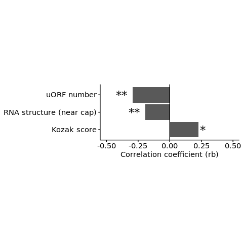

s8-3-1-2 Validation of method (single condition / comparisons between
isoforms)
================
Yoichiro Sugimoto
03 March, 2022

  - [Overview](#overview)
  - [Data import](#data-import)
  - [Data preparation for binary
    comparisons](#data-preparation-for-binary-comparisons)
  - [Analysis of the enrichment of mRNA features in more or less
    efficiently translated
    isoforms](#analysis-of-the-enrichment-of-mrna-features-in-more-or-less-efficiently-translated-isoforms)
  - [Session information](#session-information)

# Overview

Binary comparisons of the two most differentially translated mRNA
isoforms from same gene will be performed.

``` r
## Additional packages for parallelization
## Specify the number of CPUs to be used
processors <- 8
## library("BiocParallel")
## register(MulticoreParam(processors))

sig.th <- 0.05

temp <- sapply(list.files("../functions", full.names = TRUE), source)
source(
    "../s6-differential-expression-and-tss-usage/functions/load_total_analysis_results.R",
    chdir = TRUE
)
```

    ## [1] "Sample file used: /camp/lab/ratcliffep/home/users/sugimoy/CAMP_HPC/projects/20211102_HP5_HIF_mTOR/data/sample_data/processed_sample_file.csv"
    ## [1] "The following R objects were exported: total.sample.dt, total.coldata.df, total.comparison.dt"
    ## [1] "Comparison information was loaded"
    ## [1] "/camp/lab/ratcliffep/home/users/sugimoy/CAMP_HPC/projects/20211102_HP5_HIF_mTOR/results"
    ## [1] "The following objects were loaded: tss.de.res.dt, tss.ratio.res.dt, diff.tss.res.dt"

``` r
set.seed(0)
```

``` r
sample.file <- file.path("../../data/sample_data/processed_sample_file.csv")

annot.dir <- normalizePath(file.path("../../annotation/"))
annot.ps.dir <- file.path(annot.dir, "hg38_annotation/processed_data/")
annot.R.file <- list.files(
    annot.ps.dir,
    pattern = glob2rx("*primary_transcript_annotation*.rdata"),
    full.names = TRUE
)
load(annot.R.file)

results.dir <- file.path("../../results")

s8.dir <- file.path(results.dir, "s8-analysis-of-translation")
s8.2.dte.iso.dir <- file.path(s8.dir, "s8-2-differentially-translated-isoforms")
s8.3.dir <- file.path(s8.dir, "s8-3-validation-of-method")

sample.dt <- fread(sample.file)
sample.names <- sample.dt[, sample_name]
```

# Data import

``` r
tss.level.mrl.master.dt <- fread(
    file = file.path(s8.3.dir, "tss_level_MRL_summary.csv")
)

dte.iso.dt <- file.path(
    s8.2.dte.iso.dir, "RCC4_VHL_EIF4E2_NA.csv"
) %>%
    fread

tss.level.mrl.master.dt <- merge(
    tss.level.mrl.master.dt,
    dte.iso.dt[, .(tss_name, biotype, gene_FDR, tx_FDR)],
    by = "tss_name"
)
```

# Data preparation for binary comparisons

``` r
## Select isoform with statistically significant TE differences
mrna.quantile <- tss.level.mrl.master.dt[, quantile(meanNormCount_base, probs = 0.25)]

mrl.iso.master.dt <- tss.level.mrl.master.dt[tx_FDR < 0.1]

data.cols <- c(
    "MRL_base",
    "meanNormCount_base",
    "uORF_all", "first75mer_mMFEpn_G4p", 
    "tx_kozak_score"
)


## Select two isoforms with the largest translation differences
bin.mrl.iso.master.dt <- mrl.iso.master.dt[, `:=`(
    max_MRL = max(MRL_base),
    min_MRL = min(MRL_base)
), by = gene_id][
    max_MRL != min_MRL &
    (MRL_base == max_MRL | MRL_base == min_MRL)
][
  , `:=`(
        TE_flag = case_when(
            MRL_base == max_MRL ~ "higher_TE",
            MRL_base == min_MRL ~ "lower_TE"
        )
    )] %>%
    dcast(
    gene_id ~ TE_flag,
    value.var = data.cols
)

## Filter by expression level
bin.mrl.iso.master.dt <- bin.mrl.iso.master.dt[
    meanNormCount_base_higher_TE > mrna.quantile &
    meanNormCount_base_lower_TE > mrna.quantile
]
```

# Analysis of the enrichment of mRNA features in more or less efficiently translated isoforms

``` r
wilcoxTestForIsoformComparison <- function(sl.feature, bin.mrl.iso.master.dt){
    print(sl.feature)

    diff.bin.mrl.iso.master.dt <- 
        bin.mrl.iso.master.dt[
            get(paste0(sl.feature, "_higher_TE")) !=
            get(paste0(sl.feature, "_lower_TE"))
        ]

    diff.bin.mrl.iso.master.dt%>%
        nrow %>%
        {print(paste0("The number of genes analyzed: ", .))}

    wil.p <- diff.bin.mrl.iso.master.dt %$%
        wilcox.test(
            get(paste0(sl.feature, "_higher_TE")),
            get(paste0(sl.feature, "_lower_TE")),
            paired = TRUE,
            alternative = "two.sided"
        )$p.value

    long.bin.mrl.iso.master.dt <- melt(
        diff.bin.mrl.iso.master.dt,
        id.vars = "gene_id",
        measure.vars = c(paste0(sl.feature, "_higher_TE"), paste0(sl.feature, "_lower_TE"))
    ) %>%
        {.[
           , TE_higher := variable == paste0(sl.feature, "_higher_TE")
         ]}

    qylim.max <- long.bin.mrl.iso.master.dt[
      , boxplot.stats(value)$stats[5], by = TE_higher
    ][
        , max(V1)
    ]

    qylim.min <- long.bin.mrl.iso.master.dt[
      , boxplot.stats(value)$stats[1], by = TE_higher
    ][
        , min(V1)
    ]
    
    medan.sum <- long.bin.mrl.iso.master.dt[, median(value), by = TE_higher] 

    wil.r <- rcompanion::wilcoxonPairedRC(
                             x = long.bin.mrl.iso.master.dt[, value],
                             g = long.bin.mrl.iso.master.dt[, TE_higher] == FALSE,
                             paired = TRUE
                         )

    ## RBCC: rank biserial correlation coefficient
 
    res.sum.dt <- data.table(
        feature_name = sl.feature,
        p_value = wil.p,
        feature_value_higher_TE_median = medan.sum[TE_higher == TRUE, V1],
        feature_value_lower_TE_median = medan.sum[TE_higher == FALSE, V1],
        rbcc = unlist(wil.r["rc"])
    )

    return(res.sum.dt)
}

wil.test.res.dt <- lapply(
    data.cols[3:5],
    wilcoxTestForIsoformComparison,
    bin.mrl.iso.master.dt = bin.mrl.iso.master.dt
) %>%
    rbindlist
```

    ## [1] "uORF_all"
    ## [1] "The number of genes analyzed: 445"
    ## [1] "first75mer_mMFEpn_G4p"
    ## [1] "The number of genes analyzed: 945"
    ## [1] "tx_kozak_score"
    ## [1] "The number of genes analyzed: 161"

``` r
disp.f.name <- c("uORF number", "RNA structure (near cap)", "Kozak score")

wil.test.res.dt[, `:=`(
    display_feature_name = factor(disp.f.name, levels = rev(disp.f.name)),
    padj = p.adjust(p_value, method = "holm")
)] %>%
    {.[, sig_mark := case_when(
             padj < sig.th * 0.1 ~ "**",
             padj < sig.th ~ "*",
             TRUE ~ NA_character_
         )
     ]}

print(wil.test.res.dt)
```

    ##             feature_name      p_value feature_value_higher_TE_median
    ## 1:              uORF_all 7.724240e-08                      0.1789883
    ## 2: first75mer_mMFEpn_G4p 2.412500e-07                      0.3633641
    ## 3:        tx_kozak_score 1.225311e-02                      0.6687031
    ##    feature_value_lower_TE_median   rbcc     display_feature_name         padj
    ## 1:                     1.0000000 -0.294              uORF number 2.317272e-07
    ## 2:                     0.3816862 -0.194 RNA structure (near cap) 4.825001e-07
    ## 3:                     0.6294385  0.228              Kozak score 1.225311e-02
    ##    sig_mark
    ## 1:       **
    ## 2:       **
    ## 3:        *

``` r
ggplot(
    data = wil.test.res.dt,
    aes(
        x = rbcc,
        y = display_feature_name
    )
) +
    geom_bar(stat = "identity") +
    geom_vline(xintercept = 0, color = "black") +
    stat_summary(
        geom = 'text', aes(label = sig_mark),
        fun = max, hjust = c(-0.25, 1.5, 1.5), color = "black", size = 6
    ) +
    theme(
        aspect.ratio = 0.4,
        axis.title.y = element_blank()
    ) +
    xlab("Correlation coefficient (rb)") +
    coord_cartesian(xlim = c(-0.5, 0.5))
```

<!-- -->

# Session information

``` r
sessionInfo()
```

    ## R version 4.0.0 (2020-04-24)
    ## Platform: x86_64-conda_cos6-linux-gnu (64-bit)
    ## Running under: CentOS Linux 7 (Core)
    ## 
    ## Matrix products: default
    ## BLAS/LAPACK: /camp/lab/ratcliffep/home/users/sugimoy/CAMP_HPC/software/miniconda3_20200606/envs/five_prime_seq_for_VHL_loss_v0.2.1/lib/libopenblasp-r0.3.10.so
    ## 
    ## locale:
    ##  [1] LC_CTYPE=en_GB.UTF-8       LC_NUMERIC=C              
    ##  [3] LC_TIME=en_GB.UTF-8        LC_COLLATE=en_GB.UTF-8    
    ##  [5] LC_MONETARY=en_GB.UTF-8    LC_MESSAGES=en_GB.UTF-8   
    ##  [7] LC_PAPER=en_GB.UTF-8       LC_NAME=C                 
    ##  [9] LC_ADDRESS=C               LC_TELEPHONE=C            
    ## [11] LC_MEASUREMENT=en_GB.UTF-8 LC_IDENTIFICATION=C       
    ## 
    ## attached base packages:
    ## [1] parallel  stats     graphics  grDevices utils     datasets  methods  
    ## [8] base     
    ## 
    ## other attached packages:
    ## [1] knitr_1.28        stringr_1.4.0     magrittr_1.5      data.table_1.12.8
    ## [5] dplyr_1.0.0       khroma_1.3.0      ggplot2_3.3.1     rmarkdown_2.2    
    ## 
    ## loaded via a namespace (and not attached):
    ##  [1] rcompanion_2.3.26  nortest_1.0-4      zoo_1.8-8          modeltools_0.2-23 
    ##  [5] tidyselect_1.1.0   xfun_0.14          coin_1.3-1         purrr_0.3.4       
    ##  [9] splines_4.0.0      lattice_0.20-41    colorspace_1.4-1   vctrs_0.3.1       
    ## [13] generics_0.0.2     expm_0.999-5       stats4_4.0.0       htmltools_0.4.0   
    ## [17] yaml_2.2.1         survival_3.1-12    rlang_0.4.10       e1071_1.7-3       
    ## [21] pillar_1.4.4       glue_1.4.1         withr_2.4.1        plyr_1.8.6        
    ## [25] multcomp_1.4-15    matrixStats_0.56.0 lifecycle_0.2.0    rootSolve_1.8.2.1 
    ## [29] multcompView_0.1-8 munsell_0.5.0      gtable_0.3.0       mvtnorm_1.1-1     
    ## [33] codetools_0.2-16   evaluate_0.14      labeling_0.3       lmtest_0.9-37     
    ## [37] lmom_2.8           class_7.3-17       TH.data_1.0-10     Rcpp_1.0.4.6      
    ## [41] scales_1.1.1       farver_2.0.3       gld_2.6.2          Exact_2.1         
    ## [45] digest_0.6.25      stringi_1.4.6      grid_4.0.0         tools_4.0.0       
    ## [49] sandwich_3.0-0     DescTools_0.99.38  tibble_3.0.1       crayon_1.3.4      
    ## [53] pkgconfig_2.0.3    ellipsis_0.3.1     MASS_7.3-51.6      libcoin_1.0-6     
    ## [57] Matrix_1.2-18      rstudioapi_0.11    R6_2.4.1           boot_1.3-25       
    ## [61] EMT_1.1            compiler_4.0.0
