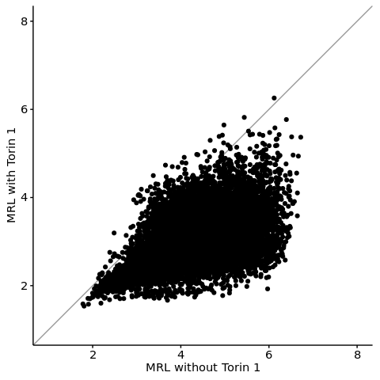
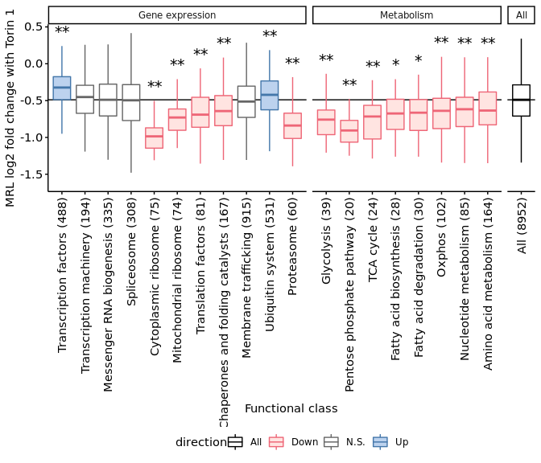

s8-3-2-1 Analysis of mTOR-dependent translational regulation (1/2)
================
Yoichiro Sugimoto
21 May, 2022

  - [Overview](#overview)
  - [Evaluation of translation changes by mTOR inhibition (gene
    level)](#evaluation-of-translation-changes-by-mtor-inhibition-gene-level)
      - [VHL status for the analysis](#vhl-status-for-the-analysis)
      - [Data import](#data-import)
      - [Analysis of the absolute changes in translation upon mTOR
        inhibition](#analysis-of-the-absolute-changes-in-translation-upon-mtor-inhibition)
  - [Analysis of changes in translational efficiency as a function of
    the functional classes of
    mRNAs](#analysis-of-changes-in-translational-efficiency-as-a-function-of-the-functional-classes-of-mrnas)
  - [Translational targets of mTOR defined by previous
    studies](#translational-targets-of-mtor-defined-by-previous-studies)
      - [Map mouse genes in the data by Thoreen et al. to human
        genes](#map-mouse-genes-in-the-data-by-thoreen-et-al.-to-human-genes)
      - [Other data](#other-data)
  - [Session information](#session-information)

# Overview

The translational effect of mTOR inhibition in RCC-4 VHL will be
examined here.

``` r
## Specify the number of CPUs to be used
processors <- 8
## library("BiocParallel")
## register(MulticoreParam(processors))

temp <- sapply(list.files("../functions", full.names = TRUE), source)
source("../s6-differential-expression-and-tss-usage/functions/load_total_analysis_results.R", chdir = TRUE)
```

    ## [1] "Sample file used: /camp/lab/ratcliffep/home/users/sugimoy/CAMP_HPC/projects/20211102_HP5_HIF_mTOR/data/sample_data/processed_sample_file.csv"
    ## [1] "The following R objects were exported: total.sample.dt, total.coldata.df, total.comparison.dt"
    ## [1] "Comparison information was loaded"
    ## [1] "/camp/lab/ratcliffep/home/users/sugimoy/CAMP_HPC/projects/20211102_HP5_HIF_mTOR/results"
    ## [1] "The following objects were loaded: tss.de.res.dt, tss.ratio.res.dt, diff.tss.res.dt"

``` r
set.seed(0)
```

``` r
sample.file <- file.path("../../data/sample_data/processed_sample_file.csv")

annot.dir <- normalizePath(file.path("../../annotation/"))
annot.ps.dir <- file.path(annot.dir, "hg38_annotation/processed_data/")
annot.R.file <- list.files(
    annot.ps.dir,
    pattern = glob2rx("*primary_transcript_annotation*.rdata"),
    full.names = TRUE
)
load(annot.R.file)

results.dir <- file.path("../../results")

s4.tss.dir <- file.path(results.dir, "s4-tss-definition-and-tx-assignment")
s4.1.tss.def.dir <- file.path(s4.tss.dir, "s4-1-tss-definition")
s4.1.6.filtered.tss.dir <- file.path(s4.1.tss.def.dir, "s4-1-6-filtered-tss")
s4.1.7.count.per.tss.dir <- file.path(s4.1.tss.def.dir, "s4-1-7-count-per-tss") 
s4.3.tx.info.dir <- file.path(s4.tss.dir, "s4-3-transcript-info")
s4.3.1.tx.info.rcc4.dir <- file.path(s4.3.tx.info.dir, "s4-3-1-transcript-info-for-RCC4")

s8.dir <- file.path(results.dir, "s8-analysis-of-translation")
s8.1.dir <- file.path(s8.dir, "s8-1-differentially-translated-mRNAs")
s8.1.1.dir <- file.path(s8.1.dir, "gene-level-dte")
s8.1.2.dir <- file.path(s8.1.dir, "tx-level-dte")
s8.3.dir <- file.path(s8.dir, "s8-3-validation-of-method")

sq.dir <- file.path(results.dir, "sq-for-publication")
source.data.dir <- file.path(sq.dir, "sq1-source-data")
source.data.by.panel.dir <- file.path(source.data.dir, "by_panel")

sample.dt <- fread(sample.file)
sample.names <- sample.dt[, sample_name]
```

# Evaluation of translation changes by mTOR inhibition (gene level)

## VHL status for the analysis

``` r
vhl.status <- "VHL"
```

## Data import

``` r
all.filtered.gene.dt <- file.path(
    s8.3.dir,
    "filtered_gene_for_polysome_analysis.csv"
) %>% fread


all.filtered.gene.dt[RCC4_VHL_NA == TRUE & RCC4_VHL_Torin1 == TRUE][
    gene_id %in%
    primary.tx.dt[!duplicated(gene_id)][biotype == "protein_coding", gene_id]    
] %>%
    nrow
```

    ## [1] 8952

``` r
torin.gene.trsl.dt <- file.path(
    s8.1.1.dir,
    paste0(
        "RCC4_",
        vhl.status,
        "_EIF4E2_yy_xx__Torin1_vs_NA.csv"
    )
) %>% fread

torin.gene.trsl.dt[
  , trsl_reg_class := case_when(
        translational_regulation %in% "Up" ~ "Preserved",
        translational_regulation %in% "Down" ~ "Repressed",
        TRUE ~ "Not significant"
    ) %>%
        factor(levels = c("Preserved", "Not significant", "Repressed"))
]
```

## Analysis of the absolute changes in translation upon mTOR inhibition

``` r
torin.gene.trsl.dt <- torin.gene.trsl.dt[
    gene_id %in% all.filtered.gene.dt[RCC4_VHL_NA == TRUE & RCC4_VHL_Torin1 == TRUE, gene_id] &
    gene_id %in% primary.tx.dt[!duplicated(gene_id)][biotype == "protein_coding", gene_id]
]

ggplot(
    data = torin.gene.trsl.dt,
    aes(
        x = MRL_base,
        y = MRL_treated
    )
) +
    geom_abline(slope = 1, intercept = 0, color = "gray60") +
    geom_point() +
    xlab("MRL without Torin 1") +
    ylab("MRL with Torin 1") +
    xlim(c(1, 8)) + ylim(c(1, 8)) +
    theme(
        aspect.ratio = 1,
        legend.position = "bottom"
    )
```

<!-- -->

``` r
source.data.base.cols <- c("gene_id", "gene_name")

temp <- exportSourceData(
    dt = torin.gene.trsl.dt,
    original.colnames = c(source.data.base.cols, "MRL_base", "MRL_treated"),
    export.colnames = c(source.data.base.cols, "without Torin 1", "with Torin 1"),
    export.file.name = "Fig. 2b.csv"
)
```

# Analysis of changes in translational efficiency as a function of the functional classes of mRNAs

``` r
## Plot translation changes by mRNA classes
plotTrslChangeByClass <- function(trsl.dt, s8.3.dir, plot.ylab, sig.th = 0.05){
    ## trsl.dt must have 2 columns: gene_id and MRL_log2fc

    trsl.dt <- trsl.dt[!is.na(MRL_log2fc)]

    kegg.all.dt <- file.path(s8.3.dir, "key_KEGG_genes.csv") %>%
        fread

    all.sl.terms <- kegg.all.dt[, unique(term_name)]
    all.sl.term.groups <- kegg.all.dt[, unique(term_group)]

    mrna.class.trsl.dt <- merge(
        kegg.all.dt,
        trsl.dt,
        by = "gene_id"
    )

    all.trsl.dt <- copy(trsl.dt) %>%
        {.[, `:=`(
             term_name = "All",
             term_group = "All"
         )]}

    mrna.class.trsl.dt <- rbind(
        mrna.class.trsl.dt,
        all.trsl.dt,
        use.names = TRUE
    )

    temp <- exportSourceData(
        dt = mrna.class.trsl.dt,
        original.colnames = c(source.data.base.cols, "term_name", "term_group", "MRL_log2fc"),
        export.colnames = c(source.data.base.cols, "functional class", "group", "MRL_log2fc"),
        export.file.name = "Fig. 2c.csv"
    )
        
    calcWilP <- function(sl.term, mrna.class.trsl.dt){
        dt <- data.table(
            term_name = sl.term,
            p_value = wilcox.test(
                mrna.class.trsl.dt[term_name == sl.term, MRL_log2fc],
                mrna.class.trsl.dt[
                    term_name == "All" &
                    !(gene_id %in% mrna.class.trsl.dt[term_name == sl.term, gene_id]),
                    MRL_log2fc
                ],
                alternative = "two.sided"
            )$p.value,
            rg =
                mrna.class.trsl.dt[order(
                    term_name == "All"
                )][term_name %in% c(sl.term, "All")][
                    !duplicated(gene_id)
                ] %$%
                rcompanion::wilcoxonRG(
                                x = MRL_log2fc,
                                g = term_name == "All"
                            ),
            N = nrow(mrna.class.trsl.dt[term_name == sl.term]),
            N_all = nrow(mrna.class.trsl.dt[term_name == "All"])
        )
        
        return(dt)
    }

    all.term.sig.dt <- lapply(
        all.sl.terms,
        calcWilP,
        mrna.class.trsl.dt = mrna.class.trsl.dt
    ) %>%
        rbindlist

    all.term.sig.dt[, `:=`(
        padj = p.adjust(p_value, method = "holm")
    )]

    all.term.sig.dt[, `:=`(
        direction = case_when(
            padj < sig.th & rg > 0 ~ "Up",
            padj < sig.th & rg < 0 ~ "Down",
            TRUE ~ "N.S."
        ),
        sig_mark = case_when(
            padj < sig.th * 0.1 ~ "**",
            padj < sig.th ~ "*",
            TRUE ~ NA_character_
        )
    )]
    
    print(all.term.sig.dt)

    all.term.sig.dt <- rbind(
        all.term.sig.dt,
        data.table(
            term_name = "All", direction = "All",
            N = nrow(mrna.class.trsl.dt[term_name == "All"])
        ),
        use.names = TRUE, fill = TRUE
    )

    all.term.sig.dt[, term_name_n := paste0(
                          term_name, " (", N, ")"
                      )]
    
    mrna.class.trsl.dt <- merge(
        mrna.class.trsl.dt,
        all.term.sig.dt,
        by = "term_name"
    )

    mrna.class.trsl.dt[, `:=`(
        term_name = factor(term_name, levels = c(all.sl.terms, "All")),
        term_group = factor(term_group, levels = c(all.sl.term.groups, "All")),
        term_name_n = factor(term_name_n, levels = all.term.sig.dt[, term_name_n])
    )]
    
    g1 <- ggplot(
        data = mrna.class.trsl.dt,
        aes(
            x = term_name_n,
            y = MRL_log2fc,
            color = direction,
            fill = direction
        )
    ) +
        geom_hline(
            yintercept = median(trsl.dt[, MRL_log2fc], na.rm = TRUE)
        ) +
        geom_boxplot(outlier.shape = NA) +
        stat_summary(
            geom = 'text', aes(label = sig_mark),
            fun = function(x){boxplot.stats(x)$stats[5]}, 
            vjust = -0.8, color = "black", size = 5
        ) +
        facet_grid(
            ~ term_group,
            scales = "free",
            space = "free"
        ) +
        scale_color_manual(
            values = c(
                "Up" = "#4477AA", "Down" = "#EE6677",
                "N.S." = "gray40", "All" = "black"
            )
        ) +
        scale_fill_manual(
            values = c(
                "Up" = "lightsteelblue2", "Down" = "mistyrose",
                "N.S." = "white", "All" = "white"
            )
        ) +
        xlab("Functional class") +
        ylab(plot.ylab) +
        theme(
            legend.position = "bottom"
        ) +
        scale_x_discrete(guide = guide_axis(angle = 90))

    print(g1)

    return(all.term.sig.dt)
}


all.term.sig.dt <- plotTrslChangeByClass(
    trsl.dt = torin.gene.trsl.dt,
    s8.3.dir = s8.3.dir,
    plot.ylab = "MRL log2 fold change with Torin 1",
    sig.th = 0.05
)
```

    ##                            term_name      p_value       rg   N N_all
    ##  1:            Transcription factors 1.363366e-33  0.32500 488  8952
    ##  2:          Transcription machinery 5.725644e-01  0.02360 194  8952
    ##  3:         Messenger RNA biogenesis 7.677865e-01  0.00949 335  8952
    ##  4:                      Spliceosome 4.187770e-01 -0.02710 308  8952
    ##  5:             Cytoplasmic ribosome 8.007361e-32 -0.78600  75  8952
    ##  6:           Mitochondrial ribosome 1.379340e-13 -0.49900  74  8952
    ##  7:              Translation factors 1.142642e-06 -0.31400  81  8952
    ##  8: Chaperones and folding catalysts 1.820175e-08 -0.25400 167  8952
    ##  9:             Membrane trafficking 6.242661e-02 -0.03750 915  8952
    ## 10:                 Ubiquitin system 7.086448e-08  0.14000 526  8952
    ## 11:                       Proteasome 7.389658e-13 -0.53600  60  8952
    ## 12:                       Glycolysis 1.486860e-08 -0.52500  39  8952
    ## 13:        Pentose phosphate pathway 4.652497e-08 -0.70600  20  8952
    ## 14:                        TCA cycle 2.192175e-04 -0.43600  24  8952
    ## 15:          Fatty acid biosynthesis 1.822160e-03 -0.34100  28  8952
    ## 16:           Fatty acid degradation 2.470674e-03 -0.32000  30  8952
    ## 17:                           Oxphos 2.451842e-07 -0.29700 102  8952
    ## 18:            Nucleotide metabolism 1.099762e-05 -0.27700  85  8952
    ## 19:            Amino acid metabolism 1.091083e-06 -0.22200 164  8952
    ##             padj direction sig_mark
    ##  1: 2.590396e-32        Up       **
    ##  2: 1.000000e+00      N.S.     <NA>
    ##  3: 1.000000e+00      N.S.     <NA>
    ##  4: 1.000000e+00      N.S.     <NA>
    ##  5: 1.441325e-30      Down       **
    ##  6: 2.344879e-12      Down       **
    ##  7: 1.091083e-05      Down       **
    ##  8: 2.548245e-07      Down       **
    ##  9: 2.497064e-01      N.S.     <NA>
    ## 10: 8.503738e-07        Up       **
    ## 11: 1.182345e-11      Down       **
    ## 12: 2.230290e-07      Down       **
    ## 13: 6.048246e-07      Down       **
    ## 14: 1.534523e-03      Down       **
    ## 15: 1.093296e-02      Down        *
    ## 16: 1.235337e-02      Down        *
    ## 17: 2.697026e-06      Down       **
    ## 18: 8.798097e-05      Down       **
    ## 19: 1.091083e-05      Down       **

    ## Warning: Removed 5 rows containing missing values (geom_text).

<!-- -->

# Translational targets of mTOR defined by previous studies

Known mTOR hypersensitive classes were defined based on previous
genome-wide studies.

## Map mouse genes in the data by Thoreen et al. to human genes

``` r
library("readxl")
library("gprofiler2")
set_base_url("https://biit.cs.ut.ee/gprofiler_archive3/e102_eg49_p15") # For reproducibility, use archive version

Thoreen.all.dt <- read_excel("../../data/others/PMID22552098_ST1.xls", skip = 2) %>%
    data.table

Thoreen.key.cols <- c("refseq_id", "trsl_eff_log2fc")

setnames(
    Thoreen.all.dt,
    old = c("Refseq Accession", "WT Efficiency: log2(Torin1/Vehicle)"),
    new = Thoreen.key.cols
)

Thoreen.all.dt <- Thoreen.all.dt[, Thoreen.key.cols, with = FALSE]

topN.down.refseq_ids <- Thoreen.all.dt[
    order(trsl_eff_log2fc)
][, head(.SD, n = 253)][, refseq_id]

topN.up.refseq_ids <- Thoreen.all.dt[
    order(trsl_eff_log2fc, decreasing = TRUE)
][, head(.SD, n = 198)][, refseq_id]

Thoreen.all.dt[
  , translational_regulation := case_when(
        refseq_id %in% topN.down.refseq_ids ~ "Down",
        refseq_id %in% topN.up.refseq_ids ~ "Up",
        TRUE ~ "Unclassified"
    )
]

ms2hs.dt <- gorth(
    query = Thoreen.all.dt[, refseq_id],
    source_organism = "mmusculus", 
    target_organism = "hsapiens",
    mthreshold = Inf, filter_na = TRUE,
    numeric_ns = "ENTREZGENE_ACC"    
) %>%
    data.table

setnames(
    ms2hs.dt,
    old = c("input", "input_ensg", "ortholog_ensg"),
    new = c("refseq_id", "ms_gene_id", "gene_id")
)

ms2hs.dt <- ms2hs.dt %>%
    group_by(refseq_id) %>%
    filter(n() == 1) %>%
    ungroup %>%
    group_by(ms_gene_id) %>%
    filter(n() == 1) %>%
    ungroup %>%
    group_by(gene_id) %>%
    filter(n() == 1) %>%
    data.table

Thoreen.all.dt <- merge(
    ms2hs.dt[, c("refseq_id", "ms_gene_id", "gene_id"), with = FALSE],
    Thoreen.all.dt,
    by = "refseq_id"
)

fwrite(Thoreen.all.dt, file.path(s8.3.dir, "Thoreen_et_al_with_human_gene_id.csv"))
```

## Other data

``` r
known.mtor.target.dt <- file.path(
    "../../data/others/20201127_previously_reported_mTOR_target_genes.csv"
) %>%
    fread

known.mtor.target.dt <- known.mtor.target.dt[
    (method == "Ribosome profiling"  & reported_gene_name != "C3ORF38") |
    (method == "Polysome profiling" & PP242_log2fc < -log2(1.5) & PP242_FDR < 0.15)
][, .(gene_id, method)]

Thoreen.all.dt[, method := paste0("RP_Thoreen_", translational_regulation)]

known.mtor.target.dt <- rbind(
    known.mtor.target.dt,
    copy(Thoreen.all.dt)[
        , method := paste0("RP_Thoreen_", translational_regulation)
    ][translational_regulation != "Unclassified", .(gene_id, method)],
    use.names = TRUE, fill = TRUE
)

kegg.all.dt <- file.path(s8.3.dir, "key_KEGG_genes.csv") %>%
    fread

kegg.all.dt[, term_count := .N, by = term_name]

known.mtor.target.kegg.dt <- merge(
    kegg.all.dt,
    known.mtor.target.dt[, .(gene_id, method)],
    by = "gene_id"
)

known.mtor.target.kegg.dt[, target_count := .N, by = list(term_name, method)]

target.count.per.term.dt <- known.mtor.target.kegg.dt[
    !duplicated(paste(term_name, method)),
    .(term_group, term_name, method, target_count, term_count)
]

target.count.per.term.dt <- merge(
    target.count.per.term.dt,
    all.term.sig.dt[, .(term_name, N)],
    by = "term_name"
)

target.count.per.term.dt[, `:=`(
    target_ratio = target_count / term_count,
    target_ratio_to_N_RCC4VHL = target_count / N
)]

target.count.per.term.dt[, `:=`(
    systematic_flag = target_ratio >= 0.1
)]

target.count.per.term.dt[
    order(term_name, method, -target_ratio_to_N_RCC4VHL)
][systematic_flag == TRUE]
```

    ##                    term_name      term_group             method target_count
    ## 1:      Cytoplasmic ribosome Gene expression    RP_Thoreen_Down           35
    ## 2:      Cytoplasmic ribosome Gene expression Ribosome profiling           71
    ## 3:    Mitochondrial ribosome Gene expression Polysome profiling           11
    ## 4: Pentose phosphate pathway      Metabolism Ribosome profiling            3
    ## 5:       Translation factors Gene expression    RP_Thoreen_Down           11
    ## 6:       Translation factors Gene expression Ribosome profiling           10
    ##    term_count  N target_ratio target_ratio_to_N_RCC4VHL systematic_flag
    ## 1:         91 75    0.3846154                 0.4666667            TRUE
    ## 2:         91 75    0.7802198                 0.9466667            TRUE
    ## 3:         77 74    0.1428571                 0.1486486            TRUE
    ## 4:         30 20    0.1000000                 0.1500000            TRUE
    ## 5:         97 81    0.1134021                 0.1358025            TRUE
    ## 6:         97 81    0.1030928                 0.1234568            TRUE

# Session information

``` r
sessionInfo()
```

    ## R version 4.0.0 (2020-04-24)
    ## Platform: x86_64-conda_cos6-linux-gnu (64-bit)
    ## Running under: CentOS Linux 7 (Core)
    ## 
    ## Matrix products: default
    ## BLAS/LAPACK: /camp/lab/ratcliffep/home/users/sugimoy/CAMP_HPC/software/miniconda3_20200606/envs/five_prime_seq_for_VHL_loss_v0.2.1/lib/libopenblasp-r0.3.10.so
    ## 
    ## locale:
    ##  [1] LC_CTYPE=en_GB.UTF-8       LC_NUMERIC=C              
    ##  [3] LC_TIME=en_GB.UTF-8        LC_COLLATE=en_GB.UTF-8    
    ##  [5] LC_MONETARY=en_GB.UTF-8    LC_MESSAGES=en_GB.UTF-8   
    ##  [7] LC_PAPER=en_GB.UTF-8       LC_NAME=C                 
    ##  [9] LC_ADDRESS=C               LC_TELEPHONE=C            
    ## [11] LC_MEASUREMENT=en_GB.UTF-8 LC_IDENTIFICATION=C       
    ## 
    ## attached base packages:
    ## [1] parallel  stats     graphics  grDevices utils     datasets  methods  
    ## [8] base     
    ## 
    ## other attached packages:
    ##  [1] gprofiler2_0.1.9  readxl_1.3.1      knitr_1.28        stringr_1.4.0    
    ##  [5] magrittr_1.5      data.table_1.12.8 dplyr_1.0.0       khroma_1.3.0     
    ##  [9] ggplot2_3.3.1     rmarkdown_2.2    
    ## 
    ## loaded via a namespace (and not attached):
    ##  [1] Rcpp_1.0.4.6       mvtnorm_1.1-1      lattice_0.20-41    tidyr_1.1.0       
    ##  [5] class_7.3-17       multcompView_0.1-8 zoo_1.8-8          digest_0.6.25     
    ##  [9] lmtest_0.9-37      cellranger_1.1.0   R6_2.4.1           plyr_1.8.6        
    ## [13] EMT_1.1            stats4_4.0.0       evaluate_0.14      rootSolve_1.8.2.1 
    ## [17] e1071_1.7-3        httr_1.4.2         pillar_1.4.4       rlang_0.4.10      
    ## [21] lazyeval_0.2.2     Exact_2.1          multcomp_1.4-15    rstudioapi_0.11   
    ## [25] Matrix_1.2-18      labeling_0.3       splines_4.0.0      htmlwidgets_1.5.1 
    ## [29] RCurl_1.98-1.2     munsell_0.5.0      compiler_4.0.0     xfun_0.14         
    ## [33] pkgconfig_2.0.3    libcoin_1.0-6      DescTools_0.99.38  htmltools_0.4.0   
    ## [37] tidyselect_1.1.0   tibble_3.0.1       lmom_2.8           expm_0.999-5      
    ## [41] coin_1.3-1         codetools_0.2-16   matrixStats_0.56.0 viridisLite_0.3.0 
    ## [45] crayon_1.3.4       withr_2.4.1        rcompanion_2.3.26  bitops_1.0-6      
    ## [49] MASS_7.3-51.6      grid_4.0.0         jsonlite_1.7.2     gtable_0.3.0      
    ## [53] lifecycle_0.2.0    scales_1.1.1       gld_2.6.2          stringi_1.4.6     
    ## [57] farver_2.0.3       ellipsis_0.3.1     generics_0.0.2     vctrs_0.3.1       
    ## [61] boot_1.3-25        sandwich_3.0-0     nortest_1.0-4      TH.data_1.0-10    
    ## [65] tools_4.0.0        glue_1.4.1         purrr_0.3.4        survival_3.1-12   
    ## [69] yaml_2.2.1         colorspace_1.4-1   plotly_4.9.2.1     modeltools_0.2-23
