s8-3-2-2 Analysis of mTOR-dependent translational regulation (2/2)
================
Yoichiro Sugimoto
19 May, 2022

  - [Overview](#overview)
  - [Evaluation of translation changes by mTOR inhibition (gene
    level)](#evaluation-of-translation-changes-by-mtor-inhibition-gene-level)
      - [VHL status for the analysis](#vhl-status-for-the-analysis)
      - [Import filtration information](#import-filtration-information)
      - [Read translation analysis
        data](#read-translation-analysis-data)
  - [Import mRNA feature data](#import-mrna-feature-data)
  - [Analysis of the effect of individual
    features](#analysis-of-the-effect-of-individual-features)
      - [CDS length](#cds-length)
      - [uORF](#uorf)
      - [TOP motif](#top-motif)
      - [The effect of TOP motif
        position](#the-effect-of-top-motif-position)
  - [Session information](#session-information)

# Overview

The translational effect of mTOR inhibition in RCC-4 VHL will be
examined here.

``` r
## Specify the number of CPUs to be used
processors <- 8

sig.th <- 0.05

temp <- sapply(list.files("../functions", full.names = TRUE), source)
source("../s6-differential-expression-and-tss-usage/functions/load_total_analysis_results.R", chdir = TRUE)
```

    ## [1] "Sample file used: /camp/lab/ratcliffep/home/users/sugimoy/CAMP_HPC/projects/20211102_HP5_HIF_mTOR/data/sample_data/processed_sample_file.csv"
    ## [1] "The following R objects were exported: total.sample.dt, total.coldata.df, total.comparison.dt"
    ## [1] "Comparison information was loaded"
    ## [1] "/camp/lab/ratcliffep/home/users/sugimoy/CAMP_HPC/projects/20211102_HP5_HIF_mTOR/results"
    ## [1] "The following objects were loaded: tss.de.res.dt, tss.ratio.res.dt, diff.tss.res.dt"

``` r
set.seed(0)
```

``` r
sample.file <- file.path("../../data/sample_data/processed_sample_file.csv")

annot.dir <- normalizePath(file.path("../../annotation/"))
annot.ps.dir <- file.path(annot.dir, "hg38_annotation/processed_data/")
annot.R.file <- list.files(
    annot.ps.dir,
    pattern = glob2rx("*primary_transcript_annotation*.rdata"),
    full.names = TRUE
)
load(annot.R.file)

results.dir <- file.path("../../results")

s4.tss.dir <- file.path(results.dir, "s4-tss-definition-and-tx-assignment")
s4.1.tss.def.dir <- file.path(s4.tss.dir, "s4-1-tss-definition")
s4.1.6.filtered.tss.dir <- file.path(s4.1.tss.def.dir, "s4-1-6-filtered-tss")
s4.1.7.count.per.tss.dir <- file.path(s4.1.tss.def.dir, "s4-1-7-count-per-tss")
s4.2.tx.assignment.dir <- file.path(s4.tss.dir, "s4-2-transcript-assignment")
s4.2.1.tss.tx.map.RCC4.dir <- file.path(s4.2.tx.assignment.dir, "s4-2-1-tss-transcript-mapping-RCC4")
s4.3.tx.info.dir <- file.path(s4.tss.dir, "s4-3-transcript-info")
s4.3.1.tx.info.rcc4.dir <- file.path(s4.3.tx.info.dir, "s4-3-1-transcript-info-for-RCC4")

s8.dir <- file.path(results.dir, "s8-analysis-of-translation")
s8.1.dir <- file.path(s8.dir, "s8-1-differentially-translated-mRNAs")
s8.1.1.dir <- file.path(s8.1.dir, "gene-level-dte")
s8.1.2.dir <- file.path(s8.1.dir, "tx-level-dte")
s8.3.dir <- file.path(s8.dir, "s8-3-validation-of-method")

sample.dt <- fread(sample.file)
sample.names <- sample.dt[, sample_name]
```

# Evaluation of translation changes by mTOR inhibition (gene level)

## VHL status for the analysis

``` r
vhl.status <- "VHL"
```

## Import filtration information

``` r
all.filtered.tss.dt <- file.path(
    s8.3.dir,
    "filtered_tss_for_polysome_analysis.csv"
) %>% fread

all.filtered.tss.dt[, gene_id := str_split_fixed(tss_name, "_", n = 2)[, 1]]

all.filtered.tss.dt[RCC4_VHL_NA == TRUE & RCC4_VHL_Torin1 == TRUE][
    gene_id %in%
    primary.tx.dt[!duplicated(gene_id)][biotype == "protein_coding", gene_id]    
] %>%
    nrow
```

    ## [1] 12449

## Read translation analysis data

``` r
torin.tx.trsl.dt <- file.path(
    s8.1.2.dir,
    paste0(
        "RCC4_",
        vhl.status,
        "_EIF4E2_yy_xx__Torin1_vs_NA.csv"
    )
) %>% fread

torin.tx.trsl.dt[
  , trsl_reg_class := case_when(
        translational_regulation %in% "Up" ~ "Preserved",
        translational_regulation %in% "Down" ~ "Repressed",
        TRUE ~ "Not significant"
    ) %>%
        factor(levels = c("Preserved", "Not significant", "Repressed"))
]


torin.tx.trsl.dt <- torin.tx.trsl.dt[
    tss_name %in% all.filtered.tss.dt[
                      RCC4_VHL_NA == TRUE & RCC4_VHL_Torin1 == TRUE, tss_name
                  ] &
    gene_id %in% primary.tx.dt[!duplicated(gene_id)][biotype == "protein_coding", gene_id]
]
```

# Import mRNA feature data

``` r
tss.tx.assignment.dt <- file.path(
    s4.2.1.tss.tx.map.RCC4.dir,
    "transcripts-per-TSS-for-RCC4.gtf"
) %>%
    {rtracklayer::import(.)} %>%
as.data.frame %>% data.table

tss.tx.assignment.dt <- tss.tx.assignment.dt[!duplicated(transcript_id)]
tss.tx.assignment.dt[, transcript_id := original_transcript_id]

tx.meta.dt <- file.path(
  s4.3.1.tx.info.rcc4.dir,
  "transcript-meta-information-RCC4-VHL.csv"
) %>%
    fread

tx.meta.dt <- merge(
    tss.tx.assignment.dt[, .(tss_name, transcript_id)],
    tx.meta.dt,
    by = "tss_name"
)

torin.tx.trsl.dt <- merge(
    tx.meta.dt[cds_len > 100],
    torin.tx.trsl.dt[, .(tss_name, gene_name, biotype, MRL_log2fc, MRL_treated, MRL_base, trsl_reg_class)],
    by = "tss_name"
)

all.primary.tx.dt <- file.path(
    annot.ps.dir,
    "all_GENCODE_RefSeq_transcript_info.csv"
) %>% fread

all.primary.tx.dt <- all.primary.tx.dt[, c(
    "gene_id", "gene_name", "transcript_id", "chromosome_name",
    "biotype", "transcript_type",
    "basic_tag", "refseq_tag", "MANE_Select_tag", "appris_tag",
    "mRNA_start_NF_tag", "mRNA_end_NF_tag", "cds_start_NF_tag", "cds_end_NF_tag",
    "bicistronic_tag", "readthrough_transcript_tag", "fusion_gene_flag"
), with = FALSE]

torin.tx.trsl.dt <- torin.tx.trsl.dt[
    transcript_id %in% all.primary.tx.dt[
                           mRNA_start_NF_tag == "N/A" &
                           mRNA_end_NF_tag == "N/A" &
                           cds_start_NF_tag == "N/A" &
                           cds_end_NF_tag == "N/A" &
                           fusion_gene_flag == FALSE,
                           transcript_id
                       ]
][
    cds_len > 100
]

fwrite(
    torin.tx.trsl.dt,
    file.path(s8.3.dir, "torin-1-translation-change-summary.csv")
)
```

# Analysis of the effect of individual features

``` r
m.torin.tx.trsl.dt <- melt(
    torin.tx.trsl.dt,
    id.vars = c(
        "tss_name",
        "gene_name",
        "MRL_log2fc", "trsl_reg_class",
        "mean_utr5_len", "cds_len", "mean_tx_len",
        "tx_kozak_score",
        "tss_p1_TOP", "tss_p2_TOP", "tss_p3_TOP",
        "tss_p1_tTOP", "tss_p2_tTOP", "tss_p3_tTOP",
        "tss_p1_pTOP", "tss_p2_pTOP", "tss_p3_pTOP",
        "tss_PRTE_score",
        "uORF_all"
    ),
    measure.vars = c("MRL_treated", "MRL_base"),
    value.name = "MRL"
) %>%
    {.[, `:=`(
         treatment = case_when(
             variable == "MRL_treated" ~ "Torin_1",
             variable == "MRL_base" ~ "No_treatment"
         ),
         log10_cds_len = log10(cds_len),
         log10_tx_len = log10(mean_tx_len)
     )]}
```

## CDS length

``` r
m.torin.tx.trsl.dt[, `:=`(
    cds_len_bin = cut(
        log10_cds_len,
        breaks = seq(2, 5, by = 0.25),
        labels = paste0(
            "(",
            seq(2, 5, by = 0.25) %>% {.[1:(length(.) - 1)]} %>% {round(10^.)},
            ", ",
            seq(2, 5, by = 0.25) %>% {.[2:length(.)]} %>% {round(10^.)},
            "]"
        )
    )
)]

fwrite(
    m.torin.tx.trsl.dt,
    file.path(s8.3.dir, "long-torin-1-translation-change-summary.csv")
)

ggplot(
    data = m.torin.tx.trsl.dt[!is.na(cds_len_bin)],
    aes(
        x = cds_len_bin,
        y = MRL,
        fill = treatment
    )
) +
    geom_boxplot(outlier.shape = NA) +
    theme(
        legend.position = "bottom",
        aspect.ratio = 1,
        axis.text.x = element_text(angle = 90, vjust = 0.5, hjust = 1)
    ) +
    scale_fill_manual(values = c(
                          "No_treatment" = "#4477AA",
                          "Torin_1" = "#AA3377"
                      )) +
    xlab("CDS length [nts]")
```

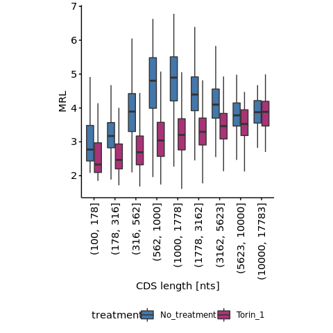<!-- -->

``` r
print("The number of samples for the boxplots")
```

    ## [1] "The number of samples for the boxplots"

``` r
m.torin.tx.trsl.dt[!is.na(MRL)][
    , table(treatment, cds_len_bin)
] %>% print
```

    ##               cds_len_bin
    ## treatment      (100, 178] (178, 316] (316, 562] (562, 1000] (1000, 1778]
    ##   No_treatment         27        376       1087        2461         3143
    ##   Torin_1              27        376       1087        2461         3143
    ##               cds_len_bin
    ## treatment      (1778, 3162] (3162, 5623] (5623, 10000] (10000, 17783]
    ##   No_treatment         1791          556           126             22
    ##   Torin_1              1791          556           126             22
    ##               cds_len_bin
    ## treatment      (17783, 31623] (31623, 56234] (56234, 1e+05]
    ##   No_treatment              0              0              0
    ##   Torin_1                   0              0              0

``` r
cds.len.sig.dt <- lapply(
    m.torin.tx.trsl.dt[, unique(cds_len_bin) %>% sort],
    function(x){
        data.table(
            cds_len_bin = x,
            wil_p = wilcox.test(
                x = m.torin.tx.trsl.dt[
                    treatment == "No_treatment" & cds_len_bin == x, MRL_log2fc],
                y = m.torin.tx.trsl.dt[
                    treatment == "No_treatment" & cds_len_bin != x, MRL_log2fc],
                alternative = "two.sided"
            )$p.value,
            rg = rcompanion::wilcoxonRG(
                                 x = m.torin.tx.trsl.dt[
                                   treatment == "No_treatment", MRL_log2fc],
                                 g = m.torin.tx.trsl.dt[
                                   treatment == "No_treatment", cds_len_bin != x]
                             ),
            N = nrow(m.torin.tx.trsl.dt[
                treatment == "No_treatment" & cds_len_bin == x]),
            N_others = nrow(m.torin.tx.trsl.dt[
                treatment == "No_treatment" & cds_len_bin != x])
        )
    }
) %>%
    rbindlist %>%
{.[, padj := p.adjust(wil_p, method = "holm")]} %>%
{.[, `:=`(
     mTOR_sensitivity = case_when(
         padj < sig.th & rg > 0 ~ "Resistent",
         padj < sig.th & rg < 0 ~ "Hypersensitive",
         TRUE ~ "N.S."
     ),
     sig_mark = case_when(
         padj < sig.th * 0.1 ~ "**",
         padj < sig.th ~ "*",
         TRUE ~ NA_character_
     )
)] }%T>%
print
```

    ##       cds_len_bin        wil_p     rg    N N_others         padj
    ## 1:     (100, 178] 8.477009e-06  0.495   27     9562 1.695402e-05
    ## 2:     (178, 316] 9.260584e-38  0.390  376     9213 4.630292e-37
    ## 3:     (316, 562] 4.738318e-04  0.065 1087     8502 4.738318e-04
    ## 4:    (562, 1000] 6.755669e-67 -0.233 2461     7128 5.404535e-66
    ## 5:   (1000, 1778] 8.441570e-56 -0.198 3143     6446 5.909099e-55
    ## 6:   (1778, 3162] 4.320952e-35  0.187 1791     7798 1.728381e-34
    ## 7:   (3162, 5623] 3.438632e-80  0.478  556     9033 3.094768e-79
    ## 8:  (5623, 10000] 7.900029e-42  0.702  126     9463 4.740017e-41
    ## 9: (10000, 17783] 1.773463e-10  0.786   22     9567 5.320390e-10
    ##    mTOR_sensitivity sig_mark
    ## 1:        Resistent       **
    ## 2:        Resistent       **
    ## 3:        Resistent       **
    ## 4:   Hypersensitive       **
    ## 5:   Hypersensitive       **
    ## 6:        Resistent       **
    ## 7:        Resistent       **
    ## 8:        Resistent       **
    ## 9:        Resistent       **

``` r
for.comp.m.torin.tx.trsl.dt <- rbind(
    copy(m.torin.tx.trsl.dt[!is.na(cds_len_bin) & treatment == "No_treatment"])[
        , cds_gp := "Binned by CDS length"
    ],
    copy(m.torin.tx.trsl.dt[treatment == "No_treatment"])[, `:=`(
            cds_len_bin = "All",
            cds_gp = "All"
        )]
) %>%
    {.[, cds_gp := factor(cds_gp, levels = c("Binned by CDS length", "All"))]}


merge(
    for.comp.m.torin.tx.trsl.dt,
    cds.len.sig.dt,
    by = "cds_len_bin",
    all.x = TRUE
) %>%
    ggplot(
        aes(
            x = cds_len_bin,
            y = MRL_log2fc,
            color = mTOR_sensitivity,
            fill = mTOR_sensitivity
        )
    ) +
    geom_hline(yintercept = for.comp.m.torin.tx.trsl.dt[
                   cds_len_bin == "All", median(MRL_log2fc)
               ]) + 
    geom_boxplot(outlier.shape = NA) +
    stat_summary(
        geom = 'text', aes(label = sig_mark),
        fun = function(x){boxplot.stats(x)$stats[5]},
        vjust = -0.1, color = "black", size = 5
    ) +
    facet_grid(~ cds_gp, space = "free_x", scales = "free_x") +
    theme(
        ##legend.position = "bottom",
        axis.text.x = element_text(angle = 90, vjust = 0.5, hjust = 1)
    ) +
    scale_fill_manual(
        values = c(
            "Resistent" = "lightsteelblue2",
            "Hypersensitive" = "mistyrose",
            "N.S." = "gray60"
        ),
        na.value = "white"
    ) +
    scale_color_manual(
        values = c(
            "Resistent" = "#4477AA",
            "Hypersensitive" = "#EE6677",
            "N.S." = "gray20"
        ),
        na.value = "black"
    ) +
    xlab("CDS length [nts]") +
    ylab("MRL log2 fold change with Torin 1")
```

    ## Warning: Removed 1 rows containing missing values (geom_text).

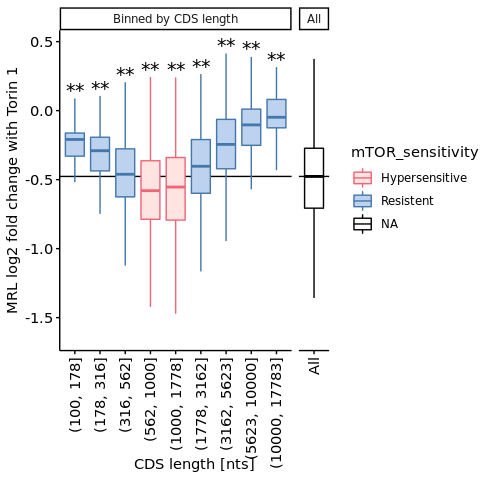<!-- -->

``` r
## Confirm that this is not the effct of TOP motif length differences
ggplot(
    data = m.torin.tx.trsl.dt[!is.na(cds_len_bin) & treatment == "No_treatment"],
    aes(
        x = cds_len_bin,
        y = tss_p1_pTOP
    )
) +
    geom_boxplot(outlier.shape = NA) +
    theme(
        legend.position = "bottom",
        aspect.ratio = 1,
        axis.text.x = element_text(angle = 90, vjust = 0.5, hjust = 1)
    ) +
    coord_cartesian(ylim = c(0, 2)) +
    xlab("CDS length [nts]") +
    ylab("TOP motif length")
```

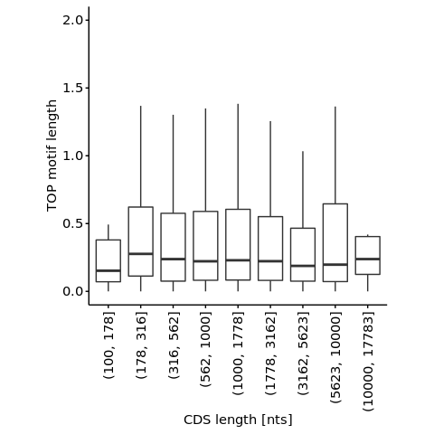<!-- -->

### Transcript length

``` r
m.torin.tx.trsl.dt[, `:=`(
    tx_len_bin = cut(
        log10_tx_len,
        breaks = seq(2, 5, by = 0.25),
        labels = paste0(
            "(",
            seq(2, 5, by = 0.25) %>% {.[1:(length(.) - 1)]} %>% {round(10^.)},
            ", ",
            seq(2, 5, by = 0.25) %>% {.[2:length(.)]} %>% {round(10^.)},
            "]"
        )
    )
)]

ggplot(
    data = m.torin.tx.trsl.dt[
        !is.na(tx_len_bin)
    ],
    aes(
        x = tx_len_bin,
        y = MRL,
        fill = treatment
    )
) +
    geom_boxplot(
        outlier.shape = NA
    ) +
    theme(
        legend.position = "bottom",
        aspect.ratio = 1,
        axis.text.x = element_text(angle = 90, vjust = 0.5, hjust = 1)
    ) +
    scale_fill_manual(values = c(
                          "No_treatment" = "#4477AA",
                          "Torin_1" = "#AA3377"
                      )) +
    xlab("Transcript length [nts]")
```

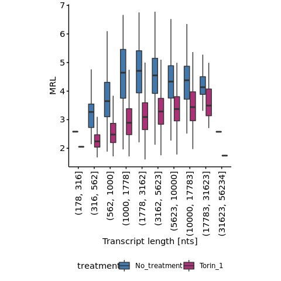<!-- -->

``` r
print("The number of samples for the boxplots")
```

    ## [1] "The number of samples for the boxplots"

``` r
m.torin.tx.trsl.dt[!is.na(MRL)][
    , table(treatment, tx_len_bin)
] %>% print
```

    ##               tx_len_bin
    ## treatment      (100, 178] (178, 316] (316, 562] (562, 1000] (1000, 1778]
    ##   No_treatment          0          1        103         521         1636
    ##   Torin_1               0          1        103         521         1636
    ##               tx_len_bin
    ## treatment      (1778, 3162] (3162, 5623] (5623, 10000] (10000, 17783]
    ##   No_treatment         2994         2718          1326            265
    ##   Torin_1              2994         2718          1326            265
    ##               tx_len_bin
    ## treatment      (17783, 31623] (31623, 56234] (56234, 1e+05]
    ##   No_treatment             24              1              0
    ##   Torin_1                  24              1              0

## uORF

``` r
m.torin.tx.trsl.dt[, uORF_capped := factor(
                              round(uORF_all) %>%
                              {case_when(
                                  . >= 3 ~ "3+",
                                  TRUE ~ as.character(.)
                              )}
                     )
                   ]

uorf.sig.dt <- rbind(
    m.torin.tx.trsl.dt[treatment == "No_treatment"] %$%
    pairwise.wilcox.test(
        x = MRL,
        g = uORF_capped,
        p.adjust.method = "none",
        alternative = "two.sided"
    )$p.value[, 1] %>% stack %>% {data.table(., treatment = "No_treatment")},
    m.torin.tx.trsl.dt[treatment == "Torin_1"] %$%
    pairwise.wilcox.test(
        x = MRL,
        g = uORF_capped,
        p.adjust.method = "none",
        alternative = "two.sided"
    )$p.value[, 1] %>% stack %>% {data.table(., treatment = "Torin_1")}
) %>%
    {.[, padj := p.adjust(values)]} %>%
    {.[, `:=`(
         sig_mark = case_when(
             padj < sig.th * 0.1 ~ "**",
             padj < sig.th ~ "*",
             TRUE ~ NA_character_
         ),
         uORF_capped = ind
     )]} %T>%
    print
```

    ##          values ind    treatment         padj sig_mark uORF_capped
    ## 1: 3.205706e-46   1 No_treatment 1.282282e-45       **           1
    ## 2: 1.715486e-69   2 No_treatment 8.577429e-69       **           2
    ## 3: 6.838523e-95  3+ No_treatment 4.103114e-94       **          3+
    ## 4: 1.133953e-04   1      Torin_1 2.267906e-04       **           1
    ## 5: 4.101634e-02   2      Torin_1 4.101634e-02        *           2
    ## 6: 3.426884e-08  3+      Torin_1 1.028065e-07       **          3+

``` r
merge(
    m.torin.tx.trsl.dt,
    uorf.sig.dt,
    by = c("uORF_capped", "treatment"), all.x = TRUE
) %>%
    ggplot(
        aes(
            x = uORF_capped,
            y = MRL,
            fill = treatment
        )
    ) +
    geom_boxplot(outlier.shape = NA) +
    stat_summary(
        geom = 'text', aes(label = sig_mark),
        fun = function(x){boxplot.stats(x)$stats[5]}, 
        vjust = -0.8, color = "black", size = 6,
        position = position_dodge(width = 0.8)
    ) +
    theme(
        legend.position = "bottom",
        aspect.ratio = 1.5
    ) +
    scale_fill_manual(values = c(
                          "No_treatment" = "#4477AA",
                          "Torin_1" = "#AA3377"
                      )) +
    xlab("uORF number")
```

    ## Warning: Removed 2 rows containing missing values (geom_text).

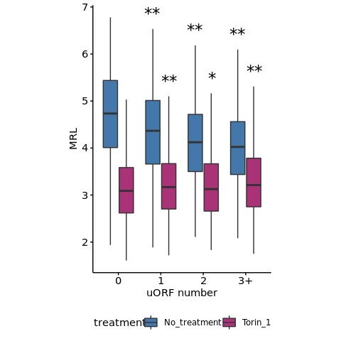<!-- -->

``` r
print("The number of samples for the boxplots")
```

    ## [1] "The number of samples for the boxplots"

``` r
m.torin.tx.trsl.dt[!is.na(MRL)][
    , table(treatment, uORF_capped)
] %>% print
```

    ##               uORF_capped
    ## treatment         0    1    2   3+
    ##   No_treatment 5635 2037  948  969
    ##   Torin_1      5635 2037  948  969

``` r
ggplot(
    data = m.torin.tx.trsl.dt,
    aes(
        x = factor(uORF_capped),
        y = tss_p1_pTOP,
    )
) +
    geom_boxplot(outlier.shape = NA) +
    theme(
        legend.position = "bottom",
        aspect.ratio = 1.5,
        axis.text.x = element_text(angle = 90, vjust = 0.5, hjust = 1)
    ) +
    coord_cartesian(ylim = c(0, 2)) + 
    scale_fill_manual(values = c(
                          "No_treatment" = "#4477AA",
                          "Torin_1" = "#AA3377"
                      )) +
    xlab("uORF number") +
    ylab("TOP motif length")
```

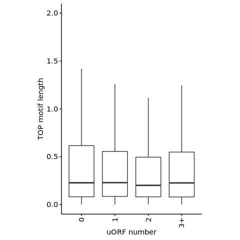<!-- -->

``` r
ggplot(
    data = m.torin.tx.trsl.dt,
    aes(
        x = uORF_capped,
        y = MRL_log2fc
    )
) +
    geom_boxplot(outlier.shape = NA) +
    theme(
        legend.position = "bottom",
        aspect.ratio = 1.5,
        axis.text.x = element_text(angle = 90, vjust = 0.5, hjust = 1)
    ) +
    scale_fill_manual(values = c(
                          "No_treatment" = "#4477AA",
                          "Torin_1" = "#AA3377"
                      )) +
    xlab("uORF number")
```

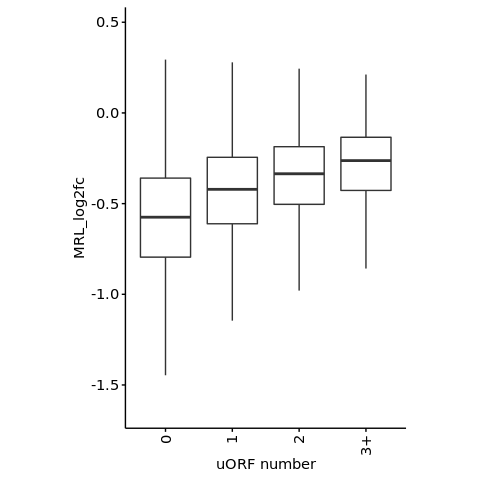<!-- -->

## TOP motif

``` r
top.long.dt <- melt(
    torin.tx.trsl.dt,
    id.vars = c("tss_name", "MRL_log2fc"),
    measure.vars = c("tss_p1_pTOP", "tss_p2_pTOP", "tss_p3_pTOP"),
    value.name = "TOP_motif_length"
) %>%
    {.[, `:=`(
         TOP_start = str_extract(variable, "[[:digit:]]") %>%
             {paste0("+", .)},
         rd_TOP_motif_length = round(TOP_motif_length) %>%
             {if_else(. >= 8, "8+", as.character(.))}
       )]}

print("The number of mRNAs analysed here")
```

    ## [1] "The number of mRNAs analysed here"

``` r
top.long.dt[, table(TOP_start, rd_TOP_motif_length)]
```

    ##          rd_TOP_motif_length
    ## TOP_start    0    1    2    3    4    5    6    7   8+
    ##        +1 6883 1835  449  178  101   53   36   22   32
    ##        +2 3507 4675 1066  240   72   17    7    3    2
    ##        +3 6731 2488  276   64   22    4    3    1    0

``` r
top.long.dt[, mRNA_N := .N, by = list(TOP_start, rd_TOP_motif_length)]

top.pos.sig.dt <- lapply(
    c("+1", "+2", "+3"),
    function(x){
        data.table(
            TOP_start = x,
            top.long.dt[TOP_start == x] %$%
            pairwise.wilcox.test(
                x = MRL_log2fc,
                g = rd_TOP_motif_length,
                p.adjust.method = "none",
                alternative = "two.sided"
            )$p.value[, 1] %>%
             stack %>% data.table
        )
    }
) %>% rbindlist %>%
{.[, padj := p.adjust(values, method = "holm")]} %>%
{.[, `:=`(
     sig_mark = case_when(
         padj < sig.th * 0.1 ~ "**",
         padj < sig.th ~ "*",
         TRUE ~ NA_character_
     ),
     rd_TOP_motif_length = ind
 )]} %T>% print
```

    ##     TOP_start       values ind         padj sig_mark rd_TOP_motif_length
    ##  1:        +1 8.142142e-43   1 1.872693e-41       **                   1
    ##  2:        +1 7.867442e-37   2 1.730837e-35       **                   2
    ##  3:        +1 2.316844e-26   3 4.865371e-25       **                   3
    ##  4:        +1 5.925411e-25   4 1.185082e-23       **                   4
    ##  5:        +1 5.859988e-17   5 1.113398e-15       **                   5
    ##  6:        +1 4.871196e-12   6 8.281033e-11       **                   6
    ##  7:        +1 3.010129e-06   7 4.515193e-05       **                   7
    ##  8:        +1 1.554106e-12  8+ 2.797390e-11       **                  8+
    ##  9:        +2 2.340243e-03   1 3.042316e-02        *                   1
    ## 10:        +2 6.220880e-12   2 9.953408e-11       **                   2
    ## 11:        +2 7.483667e-06   3 1.047713e-04       **                   3
    ## 12:        +2 8.902957e-02   4 1.000000e+00     <NA>                   4
    ## 13:        +2 9.202469e-01   5 1.000000e+00     <NA>                   5
    ## 14:        +2 1.453271e-01   6 1.000000e+00     <NA>                   6
    ## 15:        +2 7.233786e-01   7 1.000000e+00     <NA>                   7
    ## 16:        +2 4.590589e-01  8+ 1.000000e+00     <NA>                  8+
    ## 17:        +3 3.764791e-01   1 1.000000e+00     <NA>                   1
    ## 18:        +3 9.217899e-02   2 1.000000e+00     <NA>                   2
    ## 19:        +3 2.775421e-01   3 1.000000e+00     <NA>                   3
    ## 20:        +3 4.323289e-01   4 1.000000e+00     <NA>                   4
    ## 21:        +3 8.238222e-01   5 1.000000e+00     <NA>                   5
    ## 22:        +3 3.081273e-01   6 1.000000e+00     <NA>                   6
    ## 23:        +3 2.189543e-01   7 1.000000e+00     <NA>                   7
    ##     TOP_start       values ind         padj sig_mark rd_TOP_motif_length

``` r
count.th <- 10

merge(
    top.long.dt,
    top.pos.sig.dt,
    by = c("TOP_start", "rd_TOP_motif_length"), all.x = TRUE
) %>%
    ggplot(
        aes(
            x = rd_TOP_motif_length,
            y = MRL_log2fc,
            color = mRNA_N < count.th
        )
    ) +
    geom_hline(
        yintercept = median(torin.tx.trsl.dt[, MRL_log2fc]), color = "gray60"
    ) +
    geom_boxplot(outlier.shape = NA) +
    stat_summary(
        geom = 'text', aes(label = sig_mark),
        fun = function(x){boxplot.stats(x)$stats[5]},
        vjust = -0.8, color = "black", size = 6
    ) +
    scale_color_manual(values = c("TRUE" = "gray60", "FALSE" = "black")) +
    facet_grid(~ TOP_start) +
    theme(
        aspect.ratio = 1,
        legend.position = "none"
    ) +
    ylab("MRL log2 fold change with Torin 1") +
    xlab("TOP motif length")
```

    ## Warning: Removed 15 rows containing missing values (geom_text).

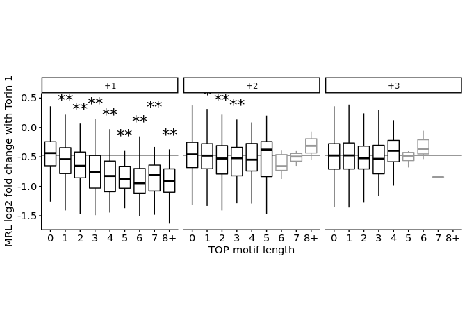<!-- -->

### Proportion of mRNAs with TOP motif

``` r
print(paste0(
    "Proportion of mRNAs with TOP motif length > 2: ",
    round(
        torin.tx.trsl.dt[!is.na(tss_p1_pTOP), sum(tss_p1_pTOP > 2)] /
        nrow(torin.tx.trsl.dt[!is.na(tss_p1_pTOP)]) * 100
    ),
    "% (",
    torin.tx.trsl.dt[!is.na(tss_p1_pTOP), sum(tss_p1_pTOP > 2)],
    "/",
    nrow(torin.tx.trsl.dt[!is.na(tss_p1_pTOP)]),
    ")"
))
```

    ## [1] "Proportion of mRNAs with TOP motif length > 2: 6% (563/9589)"

``` r
ggplot(
    torin.tx.trsl.dt,
    aes(
        x = 1,
        group = round(tss_p1_pTOP) %>% factor,
        fill = round(tss_p1_pTOP)
    )
) +
    geom_bar(position = "fill") +
    scale_fill_gradient2(
        high = scales::muted("red"),
        mid = "slategray1",
        low = "lightblue",
        midpoint = 0,
        breaks = 0:10
    ) +
    coord_polar(theta = "y") +
    theme_void(16) +
    theme(aspect.ratio = 1) +
    guides(fill=guide_legend(title = "TOP motif length"))
```

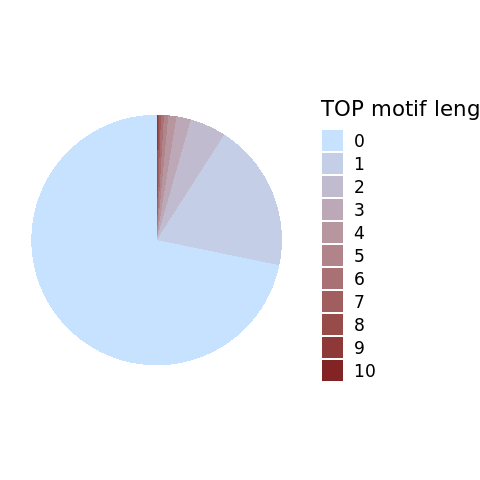<!-- -->

### Does TOP motif starting from C / U differ in the sensitivity to mTOR

``` r
ggplot(
    data = m.torin.tx.trsl.dt,
    aes(
        x = tss_p1_pTOP %>%
            {if_else(. > 8.5, "9+", as.character(round(.)))},
        y = MRL,
        fill = treatment
    )
) +
    geom_boxplot(outlier.shape = NA) +
    theme(
        legend.position = "bottom",
        aspect.ratio = 1,
        axis.text.x = element_text(angle = 90, vjust = 0.5, hjust = 1)
    ) +
    scale_fill_manual(values = c(
                          "No_treatment" = "#4477AA",
                          "Torin_1" = "#AA3377"
                      )) +
    xlab("TOP motif length (+1 Py)")
```

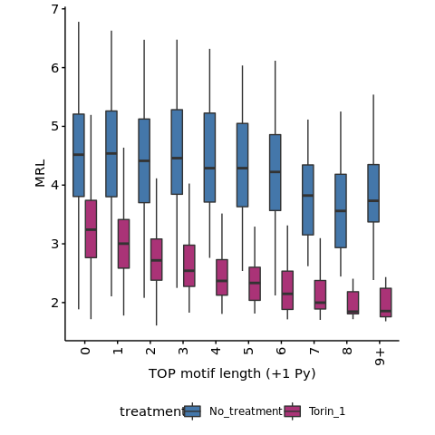<!-- -->

``` r
print("The number of samples for the boxplots")
```

    ## [1] "The number of samples for the boxplots"

``` r
m.torin.tx.trsl.dt[!is.na(MRL)][
  , table(
        treatment,
        if_else(tss_p1_pTOP > 8.5, "9+", as.character(round(tss_p1_pTOP)))
    )
] %>% print
```

    ##               
    ## treatment         0    1    2    3    4    5    6    7    8   9+
    ##   No_treatment 6883 1835  449  178  101   53   36   22   17   15
    ##   Torin_1      6883 1835  449  178  101   53   36   22   17   15

``` r
m.torin.tx.trsl.dt[treatment == "No_treatment"] %$%
    pairwise.wilcox.test(
        x = MRL,
        g = if_else(tss_p1_pTOP > 8.5, 9, round(tss_p1_pTOP)),
        p.adjust.method = "none",
        alternative = "two.sided"
    )$p.value[, 1] %>%
    p.adjust(method = "holm")
```

    ##           1           2           3           4           5           6 
    ## 1.000000000 0.463692408 1.000000000 0.961418683 0.534513257 0.463692408 
    ##           7           8           9 
    ## 0.005429276 0.002085558 0.205782156

``` r
m.torin.tx.trsl.dt[treatment == "Torin_1"] %$%
    pairwise.wilcox.test(
        x = MRL,
        g = if_else(tss_p1_pTOP > 8.5, 9, round(tss_p1_pTOP)),
        p.adjust.method = "none",
        alternative = "two.sided"
    )$p.value[, 1] %>%
    p.adjust(method = "holm")
```

    ##            1            2            3            4            5            6 
    ## 1.772892e-41 5.526530e-54 1.940151e-33 1.500550e-29 8.627529e-20 1.232084e-15 
    ##            7            8            9 
    ## 2.095241e-11 2.095241e-11 1.899611e-10

``` r
ggplot(
    data = torin.tx.trsl.dt,
    aes(
        x = tss_p1_pTOP %>%
            {if_else(. > 8.5, "9+", as.character(round(.)))},
        y = MRL_log2fc
    )
) +
    geom_boxplot(outlier.shape = NA) +
    theme(
        legend.position = "bottom",
        aspect.ratio = 1,
        axis.text.x = element_text(angle = 90, vjust = 0.5, hjust = 1)
    ) +
    xlab("TOP motif length (+1 Py)") +
    ylab("MRL log2 fold change with Torin 1")
```

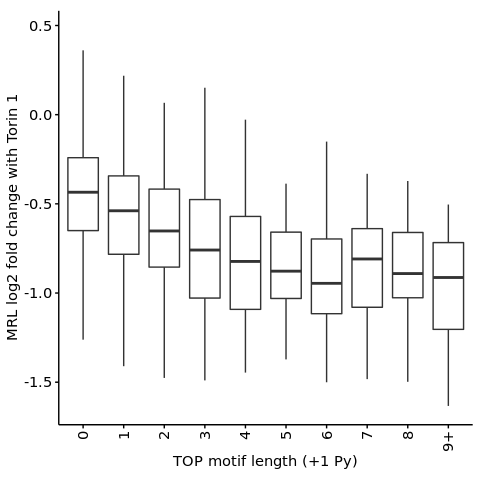<!-- -->

``` r
torin.tx.trsl.dt %$%
    pairwise.wilcox.test(
        x = MRL_log2fc,
        g = if_else(tss_p1_pTOP > 8.5, 9, round(tss_p1_pTOP)),
        p.adjust.method = "none",
        alternative = "two.sided"
    )$p.value[, 1] %>%
    p.adjust(method = "holm")
```

    ##            1            2            3            4            5            6 
    ## 7.327927e-42 6.293953e-36 1.621790e-25 3.555247e-24 2.929994e-16 1.948478e-11 
    ##            7            8            9 
    ## 3.010129e-06 2.512232e-06 6.724632e-07

``` r
## The followings are preliminary validations that both TOP motif stating C and U are likly to be targetted by mTOR
ggplot(
    data = m.torin.tx.trsl.dt,
    aes(
        x = (tss_p1_TOP)%>%
            {if_else(. > 8.5, "9+", as.character(round(.)))} %>%
            factor,
        y = MRL,
        fill = treatment
    )
) +
    geom_boxplot(outlier.shape = NA) +
    theme(
        legend.position = "bottom",
        aspect.ratio = 1,
        axis.text.x = element_text(angle = 90, vjust = 0.5, hjust = 1)
    ) +
    scale_fill_manual(values = c(
                          "No_treatment" = "#4477AA",
                          "Torin_1" = "#AA3377"
                      )) +
    xlab("TOP motif length (+1 C)")
```

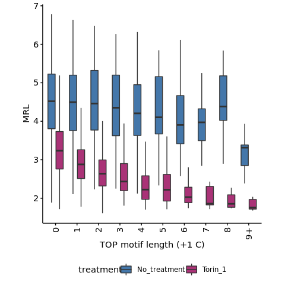<!-- -->

``` r
ggplot(
    data = m.torin.tx.trsl.dt,
    aes(
        x = (tss_p1_tTOP) %>%
            {if_else(. > 2.5, "3+", as.character(round(.)))} %>%
            factor,
        y = MRL,
        fill = treatment
    )
) +
    geom_boxplot(outlier.shape = NA) +
    theme(
        legend.position = "bottom",
        aspect.ratio = 1,
        axis.text.x = element_text(angle = 90, vjust = 0.5, hjust = 1)
    ) +
    scale_fill_manual(values = c(
                          "No_treatment" = "#4477AA",
                          "Torin_1" = "#AA3377"
                      )) +
    xlab("TOP motif length (+1 U)")
```

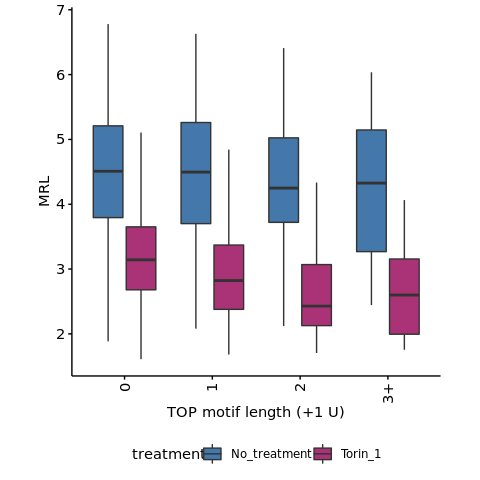<!-- -->

## The effect of TOP motif position

Validation the TOP motif not starting from +1 does not affect mTOR
sensitivity of mRNAs is first performed using GAM.

``` r
library("mgcv")
```

    ## Loading required package: nlme

    ## 
    ## Attaching package: 'nlme'

    ## The following object is masked from 'package:dplyr':
    ## 
    ##     collapse

    ## This is mgcv 1.8-31. For overview type 'help("mgcv-package")'.

``` r
gam.fit <- gam(
    MRL_log2fc ~ s(tss_p1_pTOP, bs = "ts") + s(tss_p2_pTOP, bs = "ts") + s(tss_p3_pTOP, bs = "ts"),
    method = "REML",
    select = TRUE,
    data = torin.tx.trsl.dt
)

library("mgcViz")
```

    ## Loading required package: qgam

    ## Loading required package: rgl

    ## This build of rgl does not include OpenGL functions.  Use
    ##  rglwidget() to display results, e.g. via options(rgl.printRglwidget = TRUE).

    ## Registered S3 method overwritten by 'GGally':
    ##   method from   
    ##   +.gg   ggplot2

    ## Registered S3 method overwritten by 'mgcViz':
    ##   method from  
    ##   +.gg   GGally

    ## 
    ## Attaching package: 'mgcViz'

    ## The following objects are masked from 'package:stats':
    ## 
    ##     qqline, qqnorm, qqplot

``` r
b <- getViz(gam.fit)
print(plot(b, allTerms = T) + coord_cartesian(ylim = c(-0.6, 0.2)), pages = 1)
```

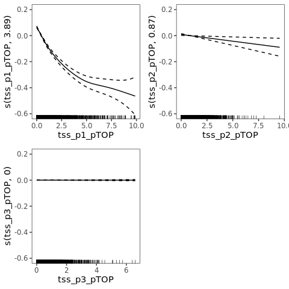<!-- -->

# Session information

``` r
sessionInfo()
```

    ## R version 4.0.0 (2020-04-24)
    ## Platform: x86_64-conda_cos6-linux-gnu (64-bit)
    ## Running under: CentOS Linux 7 (Core)
    ## 
    ## Matrix products: default
    ## BLAS/LAPACK: /camp/lab/ratcliffep/home/users/sugimoy/CAMP_HPC/software/miniconda3_20200606/envs/five_prime_seq_for_VHL_loss_v0.2.1/lib/libopenblasp-r0.3.10.so
    ## 
    ## locale:
    ##  [1] LC_CTYPE=en_GB.UTF-8       LC_NUMERIC=C              
    ##  [3] LC_TIME=en_GB.UTF-8        LC_COLLATE=en_GB.UTF-8    
    ##  [5] LC_MONETARY=en_GB.UTF-8    LC_MESSAGES=en_GB.UTF-8   
    ##  [7] LC_PAPER=en_GB.UTF-8       LC_NAME=C                 
    ##  [9] LC_ADDRESS=C               LC_TELEPHONE=C            
    ## [11] LC_MEASUREMENT=en_GB.UTF-8 LC_IDENTIFICATION=C       
    ## 
    ## attached base packages:
    ## [1] parallel  stats     graphics  grDevices utils     datasets  methods  
    ## [8] base     
    ## 
    ## other attached packages:
    ##  [1] mgcViz_0.1.6      rgl_0.104.16      qgam_1.3.2        mgcv_1.8-31      
    ##  [5] nlme_3.1-148      knitr_1.28        stringr_1.4.0     magrittr_1.5     
    ##  [9] data.table_1.12.8 dplyr_1.0.0       khroma_1.3.0      ggplot2_3.3.1    
    ## [13] rmarkdown_2.2    
    ## 
    ## loaded via a namespace (and not attached):
    ##   [1] minqa_1.2.4                 TH.data_1.0-10             
    ##   [3] colorspace_1.4-1            ellipsis_0.3.1             
    ##   [5] class_7.3-17                modeltools_0.2-23          
    ##   [7] XVector_0.28.0              GenomicRanges_1.40.0       
    ##   [9] gld_2.6.2                   rstudioapi_0.11            
    ##  [11] farver_2.0.3                mvtnorm_1.1-1              
    ##  [13] coin_1.3-1                  codetools_0.2-16           
    ##  [15] splines_4.0.0               doParallel_1.0.16          
    ##  [17] rootSolve_1.8.2.1           libcoin_1.0-6              
    ##  [19] jsonlite_1.7.2              nloptr_1.2.2.1             
    ##  [21] Rsamtools_2.4.0             shiny_1.4.0.2              
    ##  [23] compiler_4.0.0              Matrix_1.2-18              
    ##  [25] fastmap_1.0.1               later_1.1.0.1              
    ##  [27] htmltools_0.4.0             tools_4.0.0                
    ##  [29] gtable_0.3.0                glue_1.4.1                 
    ##  [31] lmom_2.8                    GenomeInfoDbData_1.2.3     
    ##  [33] Rcpp_1.0.4.6                Biobase_2.48.0             
    ##  [35] vctrs_0.3.1                 Biostrings_2.56.0          
    ##  [37] rtracklayer_1.48.0          iterators_1.0.12           
    ##  [39] crosstalk_1.1.0.1           lmtest_0.9-37              
    ##  [41] xfun_0.14                   lme4_1.1-23                
    ##  [43] mime_0.9                    miniUI_0.1.1.1             
    ##  [45] lifecycle_0.2.0             statmod_1.4.34             
    ##  [47] XML_3.99-0.3                zlibbioc_1.34.0            
    ##  [49] MASS_7.3-51.6               zoo_1.8-8                  
    ##  [51] scales_1.1.1                promises_1.1.0             
    ##  [53] SummarizedExperiment_1.18.1 sandwich_3.0-0             
    ##  [55] expm_0.999-5                RColorBrewer_1.1-2         
    ##  [57] gamm4_0.2-6                 yaml_2.2.1                 
    ##  [59] Exact_2.1                   gridExtra_2.3              
    ##  [61] EMT_1.1                     reshape_0.8.8              
    ##  [63] stringi_1.4.6               S4Vectors_0.26.0           
    ##  [65] foreach_1.5.0               nortest_1.0-4              
    ##  [67] e1071_1.7-3                 BiocGenerics_0.34.0        
    ##  [69] boot_1.3-25                 BiocParallel_1.22.0        
    ##  [71] manipulateWidget_0.10.1     GenomeInfoDb_1.24.0        
    ##  [73] rlang_0.4.10                pkgconfig_2.0.3            
    ##  [75] matrixStats_0.56.0          bitops_1.0-6               
    ##  [77] evaluate_0.14               lattice_0.20-41            
    ##  [79] purrr_0.3.4                 GenomicAlignments_1.24.0   
    ##  [81] htmlwidgets_1.5.1           labeling_0.3               
    ##  [83] tidyselect_1.1.0            GGally_2.0.0               
    ##  [85] plyr_1.8.6                  R6_2.4.1                   
    ##  [87] IRanges_2.22.1              DescTools_0.99.38          
    ##  [89] generics_0.0.2              multcompView_0.1-8         
    ##  [91] multcomp_1.4-15             DelayedArray_0.14.0        
    ##  [93] pillar_1.4.4                withr_2.4.1                
    ##  [95] survival_3.1-12             RCurl_1.98-1.2             
    ##  [97] tibble_3.0.1                crayon_1.3.4               
    ##  [99] rcompanion_2.3.26           KernSmooth_2.23-17         
    ## [101] viridis_0.5.1               grid_4.0.0                 
    ## [103] digest_0.6.25               webshot_0.5.2              
    ## [105] xtable_1.8-4                httpuv_1.5.4               
    ## [107] stats4_4.0.0                munsell_0.5.0              
    ## [109] viridisLite_0.3.0
