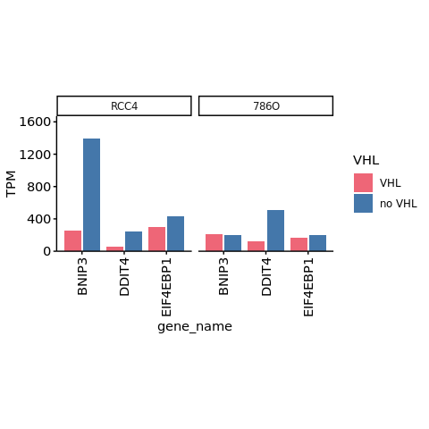
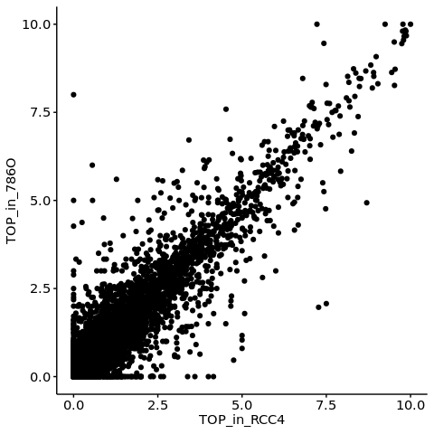

s9-1-2 Intersection of transcriptional and translational regulation by
the HIF pathway
================
Yoichiro Sugimoto
10 February, 2022

  - [Overview](#overview)
  - [Pre-processed data import](#pre-processed-data-import)
  - [Analysis of VHL dependent transcriptional and translational
    regulation](#analysis-of-vhl-dependent-transcriptional-and-translational-regulation)
      - [Analysis for RCC-4](#analysis-for-rcc-4)
      - [Analysis of 786-O](#analysis-of-786-o)
  - [Comparison of the effect size of translational regulation by the
    HIF and mTOR
    pathway](#comparison-of-the-effect-size-of-translational-regulation-by-the-hif-and-mtor-pathway)
  - [Analysis of the effect of HIF activation on the mTOR pathway
    activity](#analysis-of-the-effect-of-hif-activation-on-the-mtor-pathway-activity)
      - [Expression level changes of mTOR regulators / target upon VHL
        loss](#expression-level-changes-of-mtor-regulators-target-upon-vhl-loss)
      - [Analysis of the changes in translation upon VHL loss vs those
        upon mTOR
        inhibition](#analysis-of-the-changes-in-translation-upon-vhl-loss-vs-those-upon-mtor-inhibition)
  - [Analysis of the association of TOP motif length and changes in
    translation upon VHL
    loss](#analysis-of-the-association-of-top-motif-length-and-changes-in-translation-upon-vhl-loss)
      - [QC for the TOP motif length
        assignment](#qc-for-the-top-motif-length-assignment)
      - [Analysis](#analysis)
  - [Session information](#session-information)

# Overview

``` r
## Specify the number of CPUs to be used
processors <- 8

temp <- sapply(list.files("../functions", full.names = TRUE), source)
temp <- sapply(list.files("../s8-analysis-of-translation/functions", full.names = TRUE), source, chdir = TRUE)
```

    ## [1] "Sample file used: /camp/lab/ratcliffep/home/users/sugimoy/CAMP_HPC/projects/20211102_HP5_HIF_mTOR/data/sample_data/processed_sample_file.csv"
    ## [1] "The following objects are exported: poly.coldata.df, poly.sample.dt, translation.comparison.dt"
    ## [1] "In translation.comparison.dt, xx specifies the factor compared where the comparison is specified after __, while yy is a wildcard. From left, each factor specifies cell, VHL, EIF4E2, clone, and treatment"
    ## [1] "The following functions were exported: analyzeDtg(), subsetColdata()"

``` r
temp <- sapply(list.files("./functions", full.names = TRUE), source, chdir = TRUE)
source("../s6-differential-expression-and-tss-usage/functions/load_total_analysis_results.R", chdir = TRUE)
```

    ## [1] "Sample file used: /camp/lab/ratcliffep/home/users/sugimoy/CAMP_HPC/projects/20211102_HP5_HIF_mTOR/data/sample_data/processed_sample_file.csv"
    ## [1] "The following R objects were exported: total.sample.dt, total.coldata.df, total.comparison.dt"
    ## [1] "Comparison information was loaded"
    ## [1] "/camp/lab/ratcliffep/home/users/sugimoy/CAMP_HPC/projects/20211102_HP5_HIF_mTOR/results"
    ## [1] "The following objects were loaded: tss.de.res.dt, tss.ratio.res.dt, diff.tss.res.dt"

``` r
set.seed(0)

sig.th <- 0.05
```

``` r
annot.dir <- normalizePath(file.path("../../annotation/"))
annot.ps.dir <- file.path(annot.dir, "hg38_annotation/processed_data/")
annot.R.file <- list.files(
    annot.ps.dir,
    pattern = glob2rx("*primary_transcript_annotation*.rdata"),
    full.names = TRUE
)
load(annot.R.file)

results.dir <- file.path("../../results")
s4.tss.dir <- file.path(results.dir, "s4-tss-definition-and-tx-assignment")
s4.1.tss.def.dir <- file.path(s4.tss.dir, "s4-1-tss-definition")
s4.1.7.count.per.tss.dir <- file.path(s4.1.tss.def.dir, "s4-1-7-count-per-tss")
s4.3.tx.info.dir <- file.path(s4.tss.dir, "s4-3-transcript-info")
s4.3.1.tx.info.rcc4.dir <- file.path(s4.3.tx.info.dir, "s4-3-1-transcript-info-for-RCC4")


s6.dir <- file.path(results.dir, "s6-differential-regulation-analysis")
s6.1.dir <- file.path(s6.dir, "s6-1-differentially-expressed-genes")

s8.dir <- file.path(results.dir, "s8-analysis-of-translation")
s8.1.dir <- file.path(s8.dir, "s8-1-differentially-translated-mRNAs")
s8.1.1.dir <- file.path(s8.1.dir, "gene-level-dte")
s8.1.2.dir <- file.path(s8.1.dir, "tx-level-dte")
s8.3.dir <- file.path(s8.dir, "s8-3-validation-of-method")

s9.dir <- file.path(results.dir, "s9-integrative-analysis")

sample.file <- file.path("../../data/sample_data/processed_sample_file.csv")
sample.dt <- fread(sample.file)
sample.names <- sample.dt[, sample_name]
```

# Pre-processed data import

``` r
all.de.dte.res.dt <- fread(
    file.path(
        s9.dir,
        "all-differential-expression-and-translation-data.csv"
    ),
    na.strings = ""
)

all.de.dte.res.dt[, `:=`(
    VHL_target_RCC4 = factor(
        VHL_target_RCC4,
        levels = c("VHL_loss_repressed", "non_VHL_target", "VHL_loss_induced")
    ),
    mRNA_trsl_intersection_by_functions =  factor(
        mRNA_trsl_intersection_by_functions,
        levels = c("Glycolysis", "Vascular Process or Angiogenesis",
                   "Vascular Process", "Angiogenesis", "Others")
    )
)]

all.filtered.gene.dt <- fread(
    file.path(
        s8.3.dir,
        "filtered_gene_for_polysome_analysis.csv"
    )
)

## Reported EIF4E2/HIF2A targets
reported.eif4e2.target.dt <- fread(
    "../../data/others/20220210_previously_reported_HIF2A-EIF4E2_target_genes.csv"
)
```

# Analysis of VHL dependent transcriptional and translational regulation

``` r
library("gghighlight")

plotMRL_mRNA_analysis <- function(
                                  input.de.dte.res.dt,
                                  mrl.log2fc.colname,
                                  abs.mrl.colname,
                                  mrna.log2fc.colname,
                                  filtered.gene.ids,
                                  mrnafc.xlim = c(-4, 5),
                                  mrlfc.ylim = c(-1, 0.5),
                                  absmrl.ylim = c(1.5, 7.5),
                                  EIF4E2.targets
                                  ){

    trsl.input.dt <- input.de.dte.res.dt[
        gene_id %in% filtered.gene.ids
    ]
    
    print("------------------------------------")
    print("mRNA FC vs translation FC")
    print(
        cor.test(
            trsl.input.dt[, get(mrna.log2fc.colname)],
            trsl.input.dt[, get(mrl.log2fc.colname)],
            method = "spearman",
            alternative = "two.sided"
        )
    )
    trsl.input.dt[, c(mrna.log2fc.colname, mrl.log2fc.colname), with = FALSE] %>%
        {.[complete.cases(.)]} %>% nrow %>%
        {print(paste0("The number of samples is: ", .))}
    
    trsl.scatter.g <- ggplot(
        data = trsl.input.dt,
        aes_string(
            x = mrna.log2fc.colname,
            y = mrl.log2fc.colname
        )
    ) +
        geom_hline(yintercept = 0, color = "gray60") +
        geom_vline(xintercept = 0, color = "gray60") +
        geom_point(
            aes_string(x = mrna.log2fc.colname)
        ) +
        scale_color_manual(
            values = c(
                "Up" = "#4477AA",
                "Down" = "#EE6677",
                "Uncertain" = "gray60"
            ),
            na.value = "gray60"
        ) +
        coord_cartesian(
            xlim = mrnafc.xlim, ylim = mrlfc.ylim
        ) +
        theme(
            legend.position = "bottom",
            legend.title = element_blank(),
            aspect.ratio = 1
        ) +
        xlab("mRNA abundance log2 fold change upon VHL loss") +
        ylab("MRL log2 fold change upon VHL loss")

    print(trsl.scatter.g)

    trsl.scatter.g2 <- trsl.scatter.g +
        gghighlight(
            gene_id %in% EIF4E2.targets,
            ## unhighlighted_params = list(size = 0.25),
            label_key = gene_name,
            label_params = list(size = 6, box.padding = 2)
        )

    print(trsl.scatter.g2)

    ## Absolute MRL
    print("mRNA FC vs absolute MRL")
    print(
        cor.test(
            input.de.dte.res.dt[, get(abs.mrl.colname)],
            input.de.dte.res.dt[, get(mrna.log2fc.colname)],
            method = "spearman",
            alternative = "two.sided"
        )
    )    
    input.de.dte.res.dt[, c(mrna.log2fc.colname, abs.mrl.colname), with = FALSE] %>%
        {.[complete.cases(.)]} %>% nrow %>%
        {print(paste0("The number of samples is: ", .))}

    
    absmrl.base.g <- ggplot(
        data = input.de.dte.res.dt,
        aes_string(
            y = abs.mrl.colname
        )
    )

    absmrl.scatter.g <- absmrl.base.g +
        geom_vline(xintercept = 0, color = "gray60") +
        geom_point(
            aes_string(
                x = mrna.log2fc.colname
            )
        ) +
        theme(
            aspect.ratio = 1
        )+
        xlab("mRNA abundance log2 fold change upon VHL loss") +
        ylab("MRL in VHL negative cell") +
        coord_cartesian(ylim = absmrl.ylim, xlim = c(-4, 12))

    print(absmrl.scatter.g)

    return()
}
```

## Analysis for RCC-4

``` r
t1.all.de.dte.res.dt <- all.de.dte.res.dt[
    gene_id %in% all.filtered.gene.dt[RCC4_noVHL_NA == TRUE, gene_id]
]

temp <- plotMRL_mRNA_analysis(
    input.de.dte.res.dt = t1.all.de.dte.res.dt,
    mrl.log2fc.colname = "MRL_log2fc_RCC4_xx_EIF4E2_yy_NA__noVHL_vs_VHL",
    abs.mrl.colname = "MRL_treated_RCC4_xx_EIF4E2_yy_NA__noVHL_vs_VHL",
    mrna.log2fc.colname = "log2fc_RCC4_xx_HIF1B_N__noVHL_vs_VHL",
    filtered.gene.ids = all.filtered.gene.dt[RCC4_VHL_NA == TRUE, gene_id],
    EIF4E2.targets = reported.eif4e2.target.dt[, gene_id]
)
```

    ## [1] "------------------------------------"
    ## [1] "mRNA FC vs translation FC"
    ## 
    ##  Spearman's rank correlation rho
    ## 
    ## data:  trsl.input.dt[, get(mrna.log2fc.colname)] and trsl.input.dt[, get(mrl.log2fc.colname)]
    ## S = 1.3266e+11, p-value = 0.1193
    ## alternative hypothesis: true rho is not equal to 0
    ## sample estimates:
    ##        rho 
    ## 0.01613937 
    ## 
    ## [1] "The number of samples is: 9318"

    ## Warning: Removed 4 rows containing missing values (geom_point).

    ## Warning: Could not calculate the predicate for layer 1, layer 2; ignored

<!-- -->

    ## Warning: Removed 4 rows containing missing values (geom_point).

<!-- -->

    ## [1] "mRNA FC vs absolute MRL"
    ## 
    ##  Spearman's rank correlation rho
    ## 
    ## data:  input.de.dte.res.dt[, get(abs.mrl.colname)] and input.de.dte.res.dt[, get(mrna.log2fc.colname)]
    ## S = 1.4881e+11, p-value = 2.083e-05
    ## alternative hypothesis: true rho is not equal to 0
    ## sample estimates:
    ##         rho 
    ## -0.04366511 
    ## 
    ## [1] "The number of samples is: 9493"

    ## Warning: Removed 4 rows containing missing values (geom_point).

<!-- -->

## Analysis of 786-O

``` r
h2a.all.de.dte.res.dt <- copy(all.de.dte.res.dt)

h2a.all.de.dte.res.dt <- h2a.all.de.dte.res.dt[
    gene_id %in% all.filtered.gene.dt[c786O_noVHL_EIF4E2_yy_NA == TRUE, gene_id]
]

temp <- plotMRL_mRNA_analysis(
    input.de.dte.res.dt = h2a.all.de.dte.res.dt,
    mrl.log2fc.colname = "MRL_log2fc_786O_xx_EIF4E2_yy_NA__noVHL_vs_VHL",
    abs.mrl.colname = "MRL_treated_786O_xx_EIF4E2_yy_NA__noVHL_vs_VHL",
    mrna.log2fc.colname = "log2fc_786O_xx_HIF1B_N__noVHL_vs_VHL",
    filtered.gene.ids = all.filtered.gene.dt[c786O_VHL_EIF4E2_yy_NA == TRUE, gene_id],
    EIF4E2.targets = reported.eif4e2.target.dt[, gene_id]
)
```

    ## [1] "------------------------------------"
    ## [1] "mRNA FC vs translation FC"
    ## 
    ##  Spearman's rank correlation rho
    ## 
    ## data:  trsl.input.dt[, get(mrna.log2fc.colname)] and trsl.input.dt[, get(mrl.log2fc.colname)]
    ## S = 8.0708e+10, p-value = 0.7659
    ## alternative hypothesis: true rho is not equal to 0
    ## sample estimates:
    ##          rho 
    ## -0.003361797 
    ## 
    ## [1] "The number of samples is: 7844"

    ## Warning: Removed 4 rows containing missing values (geom_point).

    ## Warning: Could not calculate the predicate for layer 1, layer 2; ignored

<!-- -->

    ## Warning: Removed 4 rows containing missing values (geom_point).

<!-- -->

    ## [1] "mRNA FC vs absolute MRL"
    ## 
    ##  Spearman's rank correlation rho
    ## 
    ## data:  input.de.dte.res.dt[, get(abs.mrl.colname)] and input.de.dte.res.dt[, get(mrna.log2fc.colname)]
    ## S = 9.3194e+10, p-value = 3.117e-09
    ## alternative hypothesis: true rho is not equal to 0
    ## sample estimates:
    ##         rho 
    ## -0.06591821 
    ## 
    ## [1] "The number of samples is: 8065"

    ## Warning: Removed 5 rows containing missing values (geom_point).

<!-- -->

# Comparison of the effect size of translational regulation by the HIF and mTOR pathway

``` r
sl.comp.names <- c(
    "RCC4_xx_EIF4E2_yy_NA__noVHL_vs_VHL",
    "786O_xx_EIF4E2_yy_NA__noVHL_vs_VHL",
    "RCC4_VHL_EIF4E2_yy_xx__Torin1_vs_NA"
)

intervention.names <- c(
    "RCC-4:\nVHL loss",
    "786-O:\nVHL loss",
    "RCC-4 VHL:\nTorin 1"
)

m.all.de.dte.res.dt <- trslWideToLong(
    all.de.dte.res.dt, sl.comp.names, intervention.names
)

m.all.de.dte.res.dt[, `:=`(
    filter_flag = case_when(
        variable == "MRL_log2fc_RCC4_xx_EIF4E2_yy_NA__noVHL_vs_VHL" ~
            gene_id %in%
            intersect(
                all.filtered.gene.dt[RCC4_noVHL_NA == TRUE, gene_id],
                all.filtered.gene.dt[RCC4_VHL_NA == TRUE, gene_id]
            ),
        variable == "MRL_log2fc_786O_xx_EIF4E2_yy_NA__noVHL_vs_VHL" ~
            gene_id %in%
            intersect(
                all.filtered.gene.dt[c786O_noVHL_EIF4E2_yy_NA == TRUE, gene_id],
                all.filtered.gene.dt[c786O_VHL_EIF4E2_yy_NA == TRUE, gene_id]
            ),
        variable == "MRL_log2fc_RCC4_VHL_EIF4E2_yy_xx__Torin1_vs_NA" ~
            gene_id %in%
            intersect(
                all.filtered.gene.dt[RCC4_VHL_NA == TRUE, gene_id],
                all.filtered.gene.dt[RCC4_VHL_Torin1 == TRUE, gene_id]
            )             
    )
)]

m.all.de.dte.res.dt <- m.all.de.dte.res.dt[filter_flag == TRUE]

table(m.all.de.dte.res.dt[, .(Intervention)])
```

    ## 
    ##    RCC-4:\nVHL loss    786-O:\nVHL loss RCC-4 VHL:\nTorin 1 
    ##                9322                7848                8952

``` r
## Sanity check
if(nrow(m.all.de.dte.res.dt[duplicated(paste(gene_id, Intervention))]) == 0){
    "OK"
} else {stop("point 1")}
```

    ## [1] "OK"

``` r
temp <- plotTrslDistByIntervention(
    m.all.de.dte.res.dt = m.all.de.dte.res.dt,
    show.quantile = TRUE
)
```

    ## Warning: Removed 8 rows containing non-finite values (stat_bin).

<!-- -->

# Analysis of the effect of HIF activation on the mTOR pathway activity

## Expression level changes of mTOR regulators / target upon VHL loss

``` r
sl.comparison.names <- c("RCC4_xx_HIF1B_N__noVHL_vs_VHL", "786O_xx_HIF1B_N__noVHL_vs_VHL")

gene.de.res.dt <- lapply(
    sl.comparison.names,
    readTssDeRes,
    file.path("../../results/s6-differential-regulation-analysis/s6-1-differentially-expressed-genes")
) %>%
    rbindlist

sl.mtor.regulators <- c("BNIP3", "DDIT4", "EIF4EBP1")

gene.de.res.dt <- gene.de.res.dt[
    gene_name %in% sl.mtor.regulators
] %>%
    {.[, `:=`(
         cell_line = str_split_fixed(comparison_name, "_", n = 2)[, 1] %>%
             factor(levels = c("RCC4", "786O")),
         gene_name = factor(gene_name, levels = sl.mtor.regulators)
     )]}

m.gene.de.res.dt <- melt(
    gene.de.res.dt,
    id.vars = c(
        "gene_id", "gene_name",
        "cell_line"
    ),
    measure.vars = c("meanNormCount_treated", "meanNormCount_base"),
    value.name = "TPM"
) %>%
    {.[, `:=`(
         VHL = case_when(
             variable == "meanNormCount_treated" ~ "no VHL",
             variable == "meanNormCount_base" ~ "VHL"
         ) %>% factor(levels = c("VHL", "no VHL"))
     )]}

ggplot(
    data = m.gene.de.res.dt,
    aes(
        x = gene_name,
        y = TPM,
        fill = VHL
    )
) +
    geom_bar(stat = "identity", position = "dodge2") +
    facet_grid(~ cell_line) +
    scale_fill_manual(values = c(
                          "no VHL" = "#4477AA",
                          "VHL" = "#EE6677"
                      )) +
    theme(
        aspect.ratio = 1
    ) +
    scale_x_discrete(guide = guide_axis(angle = 90)) +
    scale_y_continuous(expand = c(0, 0, 0.2, 0))
```

<!-- -->

``` r
gene.de.res.dt[
  , .(gene_name, padj, shrlog2fc, treated_basename, base_basename, cell_line)
]
```

    ##    gene_name         padj   shrlog2fc   treated_basename    base_basename
    ## 1:     DDIT4 1.296347e-06  1.89377358 RCC4_noVHL_HIF1B_N RCC4_VHL_HIF1B_N
    ## 2:     BNIP3 8.261304e-78  2.43326250 RCC4_noVHL_HIF1B_N RCC4_VHL_HIF1B_N
    ## 3:  EIF4EBP1 1.653125e-03  0.48149581 RCC4_noVHL_HIF1B_N RCC4_VHL_HIF1B_N
    ## 4:     DDIT4 4.871546e-03  1.82794854 786O_noVHL_HIF1B_N 786O_VHL_HIF1B_N
    ## 5:     BNIP3 9.387046e-01 -0.03396988 786O_noVHL_HIF1B_N 786O_VHL_HIF1B_N
    ## 6:  EIF4EBP1 3.805218e-01  0.14070850 786O_noVHL_HIF1B_N 786O_VHL_HIF1B_N
    ##    cell_line
    ## 1:      RCC4
    ## 2:      RCC4
    ## 3:      RCC4
    ## 4:      786O
    ## 5:      786O
    ## 6:      786O

## Analysis of the changes in translation upon VHL loss vs those upon mTOR inhibition

### RCC-4

``` r
t2.all.de.dte.res.dt <- all.de.dte.res.dt[
    gene_id %in% Reduce(
                     intersect,
                     list(
                         all.filtered.gene.dt[RCC4_noVHL_NA == TRUE, gene_id],
                         all.filtered.gene.dt[RCC4_VHL_NA == TRUE, gene_id],
                         all.filtered.gene.dt[RCC4_VHL_Torin1 == TRUE, gene_id]
                     ))
]

ggplot(
    data = t2.all.de.dte.res.dt,
    aes(
        y = MRL_log2fc_RCC4_xx_EIF4E2_yy_NA__noVHL_vs_VHL,
        x = MRL_log2fc_RCC4_VHL_EIF4E2_yy_xx__Torin1_vs_NA
    )
) +
    geom_hline(yintercept = 0, color = "gray60") +
    geom_vline(xintercept = 0, color = "gray60") +
    geom_point() +
    geom_smooth(formula = y ~ x, method = "lm") +
    theme(
        aspect.ratio = 1
    ) +
    xlab("MRL log2 fold change with Torin 1") +
    ylab("MRL log2 fold change upon VHL loss") +
    coord_cartesian(xlim = c(-1.5, 0.5), ylim = c(-0.6, 0.6))
```

    ## Warning: Removed 2 rows containing non-finite values (stat_smooth).

    ## Warning: Removed 2 rows containing missing values (geom_point).

<!-- -->

``` r
t2.all.de.dte.res.dt %$%
    cor.test(
        x = MRL_log2fc_RCC4_xx_EIF4E2_yy_NA__noVHL_vs_VHL,
        y = MRL_log2fc_RCC4_VHL_EIF4E2_yy_xx__Torin1_vs_NA,
        method = "pearson",
        alternative = "two.sided"
    )
```

    ## 
    ##  Pearson's product-moment correlation
    ## 
    ## data:  MRL_log2fc_RCC4_xx_EIF4E2_yy_NA__noVHL_vs_VHL and MRL_log2fc_RCC4_VHL_EIF4E2_yy_xx__Torin1_vs_NA
    ## t = 33.052, df = 8827, p-value < 2.2e-16
    ## alternative hypothesis: true correlation is not equal to 0
    ## 95 percent confidence interval:
    ##  0.3131687 0.3502949
    ## sample estimates:
    ##       cor 
    ## 0.3318603

``` r
t2.all.de.dte.res.dt[
  , .(
        MRL_log2fc_RCC4_xx_EIF4E2_yy_NA__noVHL_vs_VHL,
        MRL_log2fc_RCC4_VHL_EIF4E2_yy_xx__Torin1_vs_NA
    )] %>%
    {.[complete.cases(.)]} %>% nrow %>%
    {print(paste0("The number of samples was: ", .))}
```

    ## [1] "The number of samples was: 8829"

### 786-O

``` r
t4.all.de.dte.res.dt <- all.de.dte.res.dt[
    gene_id %in%
    Reduce(
        intersect,
        list(
            all.filtered.gene.dt[c786O_noVHL_EIF4E2_yy_NA == TRUE, gene_id],
            all.filtered.gene.dt[c786O_VHL_EIF4E2_yy_NA == TRUE, gene_id],
            all.filtered.gene.dt[RCC4_VHL_NA == TRUE, gene_id],
            all.filtered.gene.dt[RCC4_VHL_Torin1 == TRUE, gene_id]
        ))
]

ggplot(
    data = t4.all.de.dte.res.dt,
    aes(
        y = MRL_log2fc_786O_xx_EIF4E2_yy_NA__noVHL_vs_VHL,
        x = MRL_log2fc_RCC4_VHL_EIF4E2_yy_xx__Torin1_vs_NA
    )
) +
    geom_hline(yintercept = 0, color = "gray60") +
    geom_vline(xintercept = 0, color = "gray60") +
    geom_point() +
    geom_smooth(formula = y ~ x, method = "lm") +
    theme(
        aspect.ratio = 1
    ) +
    xlab("MRL log2 fold change with Torin 1") +
    ylab("MRL log2 fold change upon VHL loss in 786-O") +
    coord_cartesian(xlim = c(-1.5, 0.5), ylim = c(-0.6, 0.6))
```

    ## Warning: Removed 3 rows containing non-finite values (stat_smooth).

    ## Warning: Removed 3 rows containing missing values (geom_point).

<!-- -->

``` r
t4.all.de.dte.res.dt %$%
    cor.test(
        x = MRL_log2fc_786O_xx_EIF4E2_yy_NA__noVHL_vs_VHL,
        y = MRL_log2fc_RCC4_VHL_EIF4E2_yy_xx__Torin1_vs_NA,
        method = "pearson",
        alternative = "two.sided"
    )
```

    ## 
    ##  Pearson's product-moment correlation
    ## 
    ## data:  MRL_log2fc_786O_xx_EIF4E2_yy_NA__noVHL_vs_VHL and MRL_log2fc_RCC4_VHL_EIF4E2_yy_xx__Torin1_vs_NA
    ## t = 16.779, df = 7510, p-value < 2.2e-16
    ## alternative hypothesis: true correlation is not equal to 0
    ## 95 percent confidence interval:
    ##  0.1681993 0.2117944
    ## sample estimates:
    ##       cor 
    ## 0.1900905

``` r
t4.all.de.dte.res.dt[
  , .(
        MRL_log2fc_786O_xx_EIF4E2_yy_NA__noVHL_vs_VHL,
        MRL_log2fc_RCC4_VHL_EIF4E2_yy_xx__Torin1_vs_NA
    )] %>%
    {.[complete.cases(.)]} %>% nrow %>%
    {print(paste0("The number of samples was: ", .))}
```

    ## [1] "The number of samples was: 7512"

# Analysis of the association of TOP motif length and changes in translation upon VHL loss

## QC for the TOP motif length assignment

``` r
tx.meta.data.rcc4.dt <- file.path(
    s4.3.1.tx.info.rcc4.dir,
    "transcript-meta-information-RCC4-VHL.csv"
) %>% fread

tx.meta.data.786o.dt <- file.path(
    s4.3.tx.info.dir, "s4-3-2-transcript-info-for-786O",
    "transcript-meta-information-786O-VHL.csv"
) %>% fread


## QC
r4.temp.dt <- copy(tx.meta.data.rcc4.dt)
setnames(r4.temp.dt, old = "tss_p1_pTOP", new = "TOP_in_RCC4")

c7o.temp.dt <- copy(tx.meta.data.786o.dt)
setnames(c7o.temp.dt, old = "tss_p1_pTOP", new = "TOP_in_786O")

temp.qc.dt <- merge(
    r4.temp.dt[, .(tss_name, TOP_in_RCC4)],
    c7o.temp.dt[, .(tss_name, TOP_in_786O)],
    by = "tss_name"
)

ggplot(
    data = temp.qc.dt,
    aes(
        x = TOP_in_RCC4,
        y = TOP_in_786O
    )
) +
    geom_point()
```

<!-- -->

## Analysis

``` r
all.filtered.tss.dt <- file.path(
    s8.3.dir,
    "filtered_tss_for_polysome_analysis.csv"
) %>% fread

s8.3.dir <- file.path(s8.dir, "s8-3-validation-of-method")

mergeTranslationAndMetaData <- function(input.diff.trsl.file, filtered.tss.names, tx.meta.data.dt, cell.name){
    diff.trsl.dt <- file.path(
        s8.1.2.dir,
        input.diff.trsl.file
    ) %>% fread

    diff.trsl.dt <- diff.trsl.dt[
        tss_name %in% filtered.tss.names 
    ]

    diff.trsl.dt <- merge(
        diff.trsl.dt,
        tx.meta.data.dt[, .(tss_name, tss_p1_pTOP)],
        by = "tss_name"
    )
    
    diff.trsl.dt <- diff.trsl.dt[
        !is.na(tss_p1_pTOP) & !is.na(MRL_log2fc)
    ]

    diff.trsl.dt[, `:=`(
        rd_TOP_motif_length = round(tss_p1_pTOP) %>%
            {if_else(. >= 8, "8+", as.character(.))},
        cell_name = cell.name
    )]

    diff.trsl.dt[, mRNA_N := .N, by = list(rd_TOP_motif_length)]

    return(diff.trsl.dt)
}


r4.filtered.tx <- all.filtered.tss.dt[
    (RCC4_noVHL_NA == TRUE) & (RCC4_VHL_NA == TRUE), tss_name
]

c7.filtered.tx <- all.filtered.tss.dt[
    (c786O_noVHL_EIF4E2_yy_NA == TRUE) & (c786O_VHL_EIF4E2_yy_NA == TRUE), tss_name
]


top.vhl.loss.dt <- mapply(
    FUN = mergeTranslationAndMetaData,
    input.diff.trsl.file = c("RCC4_xx_EIF4E2_yy_NA__noVHL_vs_VHL.csv",
      "786O_xx_EIF4E2_yy_NA__noVHL_vs_VHL.csv"),
    filtered.tss.names = list(r4.filtered.tx, c7.filtered.tx),
    tx.meta.data.dt = list(tx.meta.data.rcc4.dt, tx.meta.data.786o.dt),
    cell.name = c("RCC4", "786-O"),
    SIMPLIFY = FALSE
) %>%
    rbindlist

top.vhl.loss.sig.dt <- lapply(
    c("RCC4", "786-O"),
    function(x){
        data.table(
            cell_name = x,
            top.vhl.loss.dt[cell_name == x] %$%
            pairwise.wilcox.test(
                x = MRL_log2fc,
                g = rd_TOP_motif_length,
                p.adjust.method = "none",
                alternative = "two.sided"
            )$p.value[, 1] %>% stack %>% data.table            
        )
    }
) %>% rbindlist %>%
{.[, padj := p.adjust(values, method = "holm")]} %>%
{.[, `:=`(
     sig_mark = case_when(
         padj < sig.th * 0.1 ~ "**",
         padj < sig.th ~ "*",
         TRUE ~ NA_character_
     ),
     rd_TOP_motif_length = ind
 )]} %>%
merge(
    y = top.vhl.loss.dt[, .N, by = list(cell_name, rd_TOP_motif_length)],
    by = c("cell_name", "rd_TOP_motif_length"),
    all.y = TRUE
) %>%
{.[
   , cell_name := factor(cell_name, levels = c("RCC4", "786-O"))
 ][order(cell_name)]} %T>%
    print
```

    ##     cell_name rd_TOP_motif_length       values  ind         padj sig_mark    N
    ##  1:      RCC4                   0           NA <NA>           NA     <NA> 8206
    ##  2:      RCC4                   1 4.094319e-16    1 4.913183e-15       ** 2211
    ##  3:      RCC4                   2 7.812630e-24    2 1.250021e-22       **  532
    ##  4:      RCC4                   3 7.155881e-22    3 1.073382e-20       **  213
    ##  5:      RCC4                   4 5.807648e-18    4 8.130707e-17       **  120
    ##  6:      RCC4                   5 3.030494e-16    5 3.939642e-15       **   63
    ##  7:      RCC4                   6 2.392472e-15    6 2.631719e-14       **   38
    ##  8:      RCC4                   7 2.211537e-07    7 1.990383e-06       **   29
    ##  9:      RCC4                  8+ 4.715210e-12   8+ 4.715210e-11       **   35
    ## 10:     786-O                   0           NA <NA>           NA     <NA> 5902
    ## 11:     786-O                   1 9.645340e-01    1 1.000000e+00     <NA> 1723
    ## 12:     786-O                   2 2.949822e-01    2 1.000000e+00     <NA>  374
    ## 13:     786-O                   3 4.466501e-01    3 1.000000e+00     <NA>  135
    ## 14:     786-O                   4 7.958384e-01    4 1.000000e+00     <NA>  105
    ## 15:     786-O                   5 2.584423e-01    5 1.000000e+00     <NA>   46
    ## 16:     786-O                   6 3.664289e-01    6 1.000000e+00     <NA>   30
    ## 17:     786-O                   7 4.401296e-01    7 1.000000e+00     <NA>   21
    ## 18:     786-O                  8+ 2.807646e-01   8+ 1.000000e+00     <NA>   27

``` r
merge(
    top.vhl.loss.dt,
    top.vhl.loss.sig.dt,
    by = c("cell_name", "rd_TOP_motif_length"),
    all.x = TRUE
) %>%
    {.[, cell_name := factor(cell_name, levels = c("RCC4", "786-O"))]} %>%
    ggplot(
        aes(
            x = rd_TOP_motif_length,
            y = MRL_log2fc,
            color = mRNA_N < 10
        )
    ) +
    geom_hline(yintercept = 0, color = "gray60") +
    geom_boxplot(outlier.shape = NA) +
    stat_summary(
        geom = 'text', aes(label = sig_mark),
        fun = function(x){boxplot.stats(x)$stats[5]}, 
        vjust = -0.8, color = "black", size = 6
    ) +
    facet_grid(cell_name ~ .) +
    theme(
        aspect.ratio = 1,
        legend.position = "none"
    ) +
    scale_color_manual(values = c("TRUE" = "gray60", "FALSE" = "black")) +
    xlab("TOP motif length") +
    ylab("MRL log2 fold change upon VHL loss")
```

    ## Warning: Removed 10 rows containing missing values (geom_text).

<!-- -->

# Session information

``` r
sessionInfo()
```

    ## R version 4.0.0 (2020-04-24)
    ## Platform: x86_64-conda_cos6-linux-gnu (64-bit)
    ## Running under: CentOS Linux 7 (Core)
    ## 
    ## Matrix products: default
    ## BLAS/LAPACK: /camp/lab/ratcliffep/home/users/sugimoy/CAMP_HPC/software/miniconda3_20200606/envs/five_prime_seq_for_VHL_loss_v0.2.1/lib/libopenblasp-r0.3.10.so
    ## 
    ## locale:
    ##  [1] LC_CTYPE=en_GB.UTF-8       LC_NUMERIC=C              
    ##  [3] LC_TIME=en_GB.UTF-8        LC_COLLATE=en_GB.UTF-8    
    ##  [5] LC_MONETARY=en_GB.UTF-8    LC_MESSAGES=en_GB.UTF-8   
    ##  [7] LC_PAPER=en_GB.UTF-8       LC_NAME=C                 
    ##  [9] LC_ADDRESS=C               LC_TELEPHONE=C            
    ## [11] LC_MEASUREMENT=en_GB.UTF-8 LC_IDENTIFICATION=C       
    ## 
    ## attached base packages:
    ## [1] parallel  stats     graphics  grDevices utils     datasets  methods  
    ## [8] base     
    ## 
    ## other attached packages:
    ## [1] gghighlight_0.3.0 knitr_1.28        stringr_1.4.0     magrittr_1.5     
    ## [5] data.table_1.12.8 dplyr_1.0.0       khroma_1.3.0      ggplot2_3.3.1    
    ## [9] rmarkdown_2.2    
    ## 
    ## loaded via a namespace (and not attached):
    ##  [1] Rcpp_1.0.4.6     pillar_1.4.4     compiler_4.0.0   tools_4.0.0     
    ##  [5] digest_0.6.25    lattice_0.20-41  nlme_3.1-148     evaluate_0.14   
    ##  [9] lifecycle_0.2.0  tibble_3.0.1     gtable_0.3.0     mgcv_1.8-31     
    ## [13] pkgconfig_2.0.3  rlang_0.4.10     Matrix_1.2-18    cli_2.0.2       
    ## [17] ggrepel_0.8.2    yaml_2.2.1       xfun_0.14        withr_2.4.1     
    ## [21] generics_0.0.2   vctrs_0.3.1      grid_4.0.0       tidyselect_1.1.0
    ## [25] glue_1.4.1       R6_2.4.1         fansi_0.4.1      farver_2.0.3    
    ## [29] purrr_0.3.4      splines_4.0.0    scales_1.1.1     ellipsis_0.3.1  
    ## [33] htmltools_0.4.0  assertthat_0.2.1 colorspace_1.4-1 labeling_0.3    
    ## [37] stringi_1.4.6    munsell_0.5.0    crayon_1.3.4
