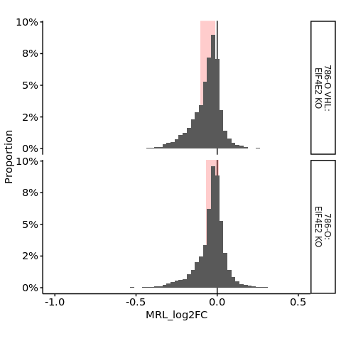

s9-1-3 Analysis of translational regulation by the HIF2A/EIF4E2 axis
================
Yoichiro Sugimoto
30 April, 2022

  - [Overview](#overview)
  - [Pre-processed data import](#pre-processed-data-import)
  - [Analysis of the effect of EIF4E2 KO on global translational
    efficiency](#analysis-of-the-effect-of-eif4e2-ko-on-global-translational-efficiency)
  - [Comparison of the effect of EIF4E2 KO with or without
    VHL](#comparison-of-the-effect-of-eif4e2-ko-with-or-without-vhl)
  - [Session information](#session-information)

# Overview

``` r
## Data visualization packages
library("ggrepel")
library("cowplot")
library("gghighlight")
## Parallelization oackages
## Specify the number of CPUs to be used
processors <- 8

temp <- sapply(list.files("../functions", full.names = TRUE), source)
temp <- sapply(list.files("../s8-analysis-of-translation/functions", full.names = TRUE), source, chdir = TRUE)
```

    ## [1] "Sample file used: /camp/lab/ratcliffep/home/users/sugimoy/CAMP_HPC/projects/20211102_HP5_HIF_mTOR/data/sample_data/processed_sample_file.csv"
    ## [1] "The following objects are exported: poly.coldata.df, poly.sample.dt, translation.comparison.dt"
    ## [1] "In translation.comparison.dt, xx specifies the factor compared where the comparison is specified after __, while yy is a wildcard. From left, each factor specifies cell, VHL, EIF4E2, clone, and treatment"
    ## [1] "The following functions were exported: analyzeDtg(), subsetColdata()"

``` r
temp <- sapply(list.files("../s9-integrative-analysis/functions", full.names = TRUE), source)
source("../s6-differential-expression-and-tss-usage/functions/load_total_analysis_results.R", chdir = TRUE)
```

    ## [1] "Sample file used: /camp/lab/ratcliffep/home/users/sugimoy/CAMP_HPC/projects/20211102_HP5_HIF_mTOR/data/sample_data/processed_sample_file.csv"
    ## [1] "The following R objects were exported: total.sample.dt, total.coldata.df, total.comparison.dt"
    ## [1] "Comparison information was loaded"
    ## [1] "/camp/lab/ratcliffep/home/users/sugimoy/CAMP_HPC/projects/20211102_HP5_HIF_mTOR/results"
    ## [1] "The following objects were loaded: tss.de.res.dt, tss.ratio.res.dt, diff.tss.res.dt"

``` r
set.seed(0)
```

``` r
annot.dir <- normalizePath(file.path("../../annotation/"))
annot.ps.dir <- file.path(annot.dir, "hg38_annotation/processed_data/")
annot.R.file <- list.files(
    annot.ps.dir,
    pattern = glob2rx("*primary_transcript_annotation*.rdata"),
    full.names = TRUE
)
load(annot.R.file)

results.dir <- file.path("../../results")
s4.tss.dir <- file.path(results.dir, "s4-tss-definition-and-tx-assignment")
s4.1.tss.def.dir <- file.path(s4.tss.dir, "s4-1-tss-definition")
s4.1.7.count.per.tss.dir <- file.path(s4.1.tss.def.dir, "s4-1-7-count-per-tss") 

s6.dir <- file.path(results.dir, "s6-differential-regulation-analysis")
s6.1.dir <- file.path(s6.dir, "s6-1-differentially-expressed-genes")

s8.dir <- file.path(results.dir, "s8-analysis-of-translation")
s8.1.dir <- file.path(s8.dir, "s8-1-differentially-translated-mRNAs")
s8.1.1.dir <- file.path(s8.1.dir, "gene-level-dte")
s8.3.dir <- file.path(s8.dir, "s8-3-validation-of-method")

s9.dir <- file.path(results.dir, "s9-integrative-analysis")

create.dirs(
    c(
        s9.dir
    )
)

sample.file <- file.path("../../data/sample_data/processed_sample_file.csv")
sample.dt <- fread(sample.file)
sample.names <- sample.dt[, sample_name]
```

# Pre-processed data import

``` r
all.de.dte.res.dt <- fread(
    file.path(
        s9.dir,
        "all-differential-expression-and-translation-data.csv"
    ),
    na.strings = ""
)

all.de.dte.res.dt[, `:=`(
    VHL_target_RCC4 = factor(
        VHL_target_RCC4,
        levels = c("VHL_loss_repressed", "non_VHL_target", "VHL_loss_induced")
    ),
    mRNA_trsl_intersection_by_functions =  factor(
        mRNA_trsl_intersection_by_functions,
        levels = c("Glycolysis", "Vascular Process or Angiogenesis",
                   "Vascular Process", "Angiogenesis", "Others")
    )
)]

all.filtered.gene.dt <- fread(
    file.path(
        s8.3.dir,
        "filtered_gene_for_polysome_analysis.csv"
    )
)

## Reported EIF4E2/HIF2A targets
reported.eif4e2.target.dt <- fread(
    "../../data/others/20220210_previously_reported_HIF2A-EIF4E2_target_genes.csv"
)
```

# Analysis of the effect of EIF4E2 KO on global translational efficiency

``` r
sl.comp.names <- c(
    "786O_VHL_xx_yy_NA__noEIF4E2_vs_EIF4E2",
    "786O_noVHL_xx_yy_NA__noEIF4E2_vs_EIF4E2"
)


intervention.names <- c(
    "786-O VHL:\nEIF4E2 KO",
    "786-O:\nEIF4E2 KO"
)

m.all.de.dte.res.dt <- trslWideToLong(
    all.de.dte.res.dt, sl.comp.names, intervention.names
)

m.all.de.dte.res.dt[, `:=`(
    filter_flag = case_when(
        variable == "MRL_log2fc_786O_VHL_xx_yy_NA__noEIF4E2_vs_EIF4E2" ~
            gene_id %in%
            intersect(
                all.filtered.gene.dt[c786O_VHL_EIF4E2_yy_NA == TRUE, gene_id],
                all.filtered.gene.dt[c786O_VHL_noEIF4E2_yy_NA == TRUE, gene_id]
            ),
        variable == "MRL_log2fc_786O_noVHL_xx_yy_NA__noEIF4E2_vs_EIF4E2" ~
            gene_id %in%
            intersect(
                all.filtered.gene.dt[c786O_noVHL_EIF4E2_yy_NA == TRUE, gene_id],
                all.filtered.gene.dt[c786O_noVHL_noEIF4E2_yy_NA == TRUE, gene_id]
            )
    )
)]

m.all.de.dte.res.dt <- m.all.de.dte.res.dt[filter_flag == TRUE]

temp <- plotTrslDistByIntervention(
    m.all.de.dte.res.dt = m.all.de.dte.res.dt,
    show.quantile = TRUE
)
```

    ## Warning: Removed 4 rows containing non-finite values (stat_bin).

<!-- -->

``` r
print("The numbers of genes analysed:")
```

    ## [1] "The numbers of genes analysed:"

``` r
m.all.de.dte.res.dt[, table(Intervention)] %>% print
```

    ## Intervention
    ## 786-O VHL:\nEIF4E2 KO     786-O:\nEIF4E2 KO 
    ##                  8040                  8008

# Comparison of the effect of EIF4E2 KO with or without VHL

``` r
eif4e2.dte.res.dt <- all.de.dte.res.dt[
    gene_id %in% all.filtered.gene.dt[
                     c786O_noVHL_EIF4E2_yy_NA == TRUE &
                     c786O_VHL_EIF4E2_yy_NA == TRUE &
                     c786O_noVHL_noEIF4E2_yy_NA == TRUE &
                     c786O_VHL_noEIF4E2_yy_NA == TRUE,
                     gene_id
                 ]
]

print(
    paste0(
        "The number of genes analysed: ",
        nrow(eif4e2.dte.res.dt[
            !is.na(MRL_log2fc_786O_VHL_xx_yy_NA__noEIF4E2_vs_EIF4E2) &
            !is.na(MRL_log2fc_786O_noVHL_xx_yy_NA__noEIF4E2_vs_EIF4E2)
        ])
    )
)
```

    ## [1] "The number of genes analysed: 7753"

``` r
eif4e2.dte.res.dt %$%
    cor.test(
        x = MRL_log2fc_786O_VHL_xx_yy_NA__noEIF4E2_vs_EIF4E2,
        y = MRL_log2fc_786O_noVHL_xx_yy_NA__noEIF4E2_vs_EIF4E2,
        method = "pearson"
    )
```

    ## 
    ##  Pearson's product-moment correlation
    ## 
    ## data:  MRL_log2fc_786O_VHL_xx_yy_NA__noEIF4E2_vs_EIF4E2 and MRL_log2fc_786O_noVHL_xx_yy_NA__noEIF4E2_vs_EIF4E2
    ## t = 38.394, df = 7751, p-value < 2.2e-16
    ## alternative hypothesis: true correlation is not equal to 0
    ## 95 percent confidence interval:
    ##  0.3808725 0.4182814
    ## sample estimates:
    ##       cor 
    ## 0.3997434

``` r
ggplot(
    eif4e2.dte.res.dt,
    aes(
        x = MRL_log2fc_786O_VHL_xx_yy_NA__noEIF4E2_vs_EIF4E2,
        y = MRL_log2fc_786O_noVHL_xx_yy_NA__noEIF4E2_vs_EIF4E2
    )
) +
    geom_hline(yintercept = 0, color = "gray60") +
    geom_vline(xintercept = 0, color = "gray60") +
    geom_abline(slope = 1, intercept = 0, color = "gray60") +
    geom_point() +
    coord_cartesian(
        xlim = c(-1, 0.5), ylim = c(-1, 0.5)
    ) +
    gghighlight(
        gene_id %in% reported.eif4e2.target.dt[, gene_id],
        label_key = gene_name,
        label_params = list(size = 6, box.padding = 2)
    ) +
    theme(
        aspect.ratio = 1
    ) +
    xlab("MRL log2 fold change\nupon EIF4E2 inactivation in 786-O VHL") +
    ylab("MRL log2 fold change\nupon EIF4E2 inactivation in 786-O")
```

    ## Warning: Could not calculate the predicate for layer 1, layer 2, layer 3;
    ## ignored

    ## Warning: Removed 1 rows containing missing values (geom_point).

<!-- -->

# Session information

``` r
sessionInfo()
```

    ## R version 4.0.0 (2020-04-24)
    ## Platform: x86_64-conda_cos6-linux-gnu (64-bit)
    ## Running under: CentOS Linux 7 (Core)
    ## 
    ## Matrix products: default
    ## BLAS/LAPACK: /camp/lab/ratcliffep/home/users/sugimoy/CAMP_HPC/software/miniconda3_20200606/envs/five_prime_seq_for_VHL_loss_v0.2.1/lib/libopenblasp-r0.3.10.so
    ## 
    ## locale:
    ##  [1] LC_CTYPE=en_GB.UTF-8       LC_NUMERIC=C              
    ##  [3] LC_TIME=en_GB.UTF-8        LC_COLLATE=en_GB.UTF-8    
    ##  [5] LC_MONETARY=en_GB.UTF-8    LC_MESSAGES=en_GB.UTF-8   
    ##  [7] LC_PAPER=en_GB.UTF-8       LC_NAME=C                 
    ##  [9] LC_ADDRESS=C               LC_TELEPHONE=C            
    ## [11] LC_MEASUREMENT=en_GB.UTF-8 LC_IDENTIFICATION=C       
    ## 
    ## attached base packages:
    ## [1] parallel  stats     graphics  grDevices utils     datasets  methods  
    ## [8] base     
    ## 
    ## other attached packages:
    ##  [1] knitr_1.28        stringr_1.4.0     magrittr_1.5      data.table_1.12.8
    ##  [5] dplyr_1.0.0       khroma_1.3.0      gghighlight_0.3.0 cowplot_1.0.0    
    ##  [9] ggrepel_0.8.2     ggplot2_3.3.1     rmarkdown_2.2    
    ## 
    ## loaded via a namespace (and not attached):
    ##  [1] Rcpp_1.0.4.6     pillar_1.4.4     compiler_4.0.0   tools_4.0.0     
    ##  [5] digest_0.6.25    evaluate_0.14    lifecycle_0.2.0  tibble_3.0.1    
    ##  [9] gtable_0.3.0     pkgconfig_2.0.3  rlang_0.4.10     cli_2.0.2       
    ## [13] yaml_2.2.1       xfun_0.14        withr_2.4.1      generics_0.0.2  
    ## [17] vctrs_0.3.1      grid_4.0.0       tidyselect_1.1.0 glue_1.4.1      
    ## [21] R6_2.4.1         fansi_0.4.1      farver_2.0.3     purrr_0.3.4     
    ## [25] scales_1.1.1     ellipsis_0.3.1   htmltools_0.4.0  assertthat_0.2.1
    ## [29] colorspace_1.4-1 labeling_0.3     stringi_1.4.6    munsell_0.5.0   
    ## [33] crayon_1.3.4
