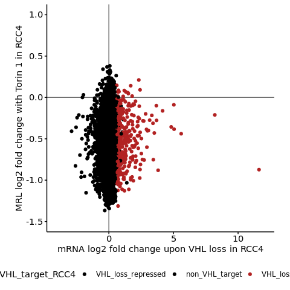
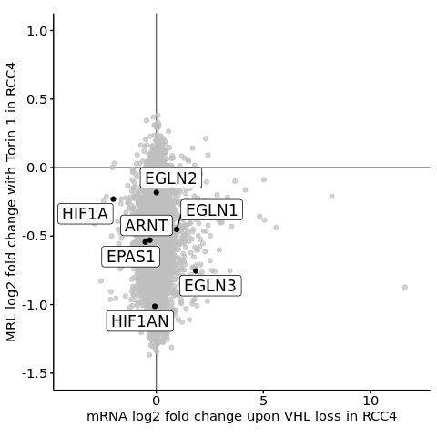
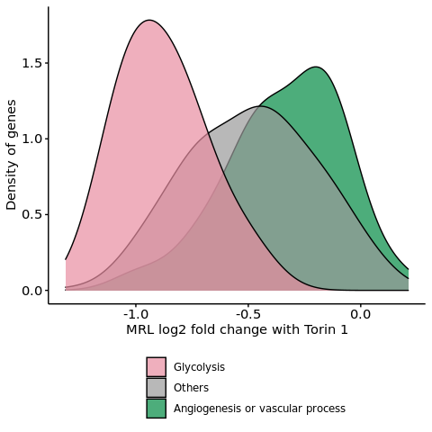
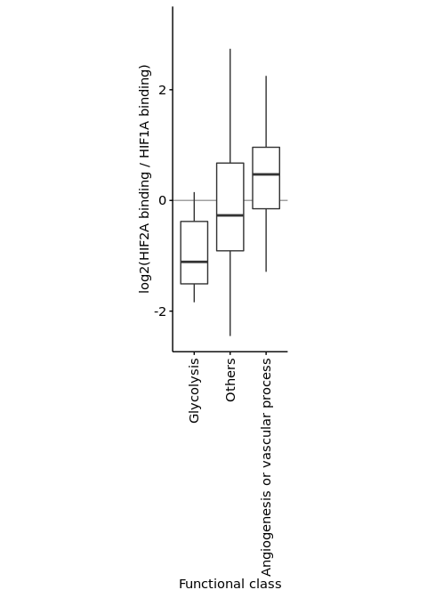
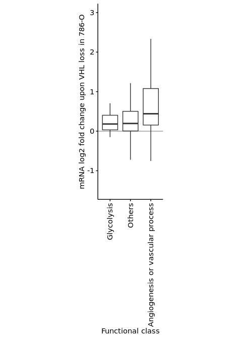
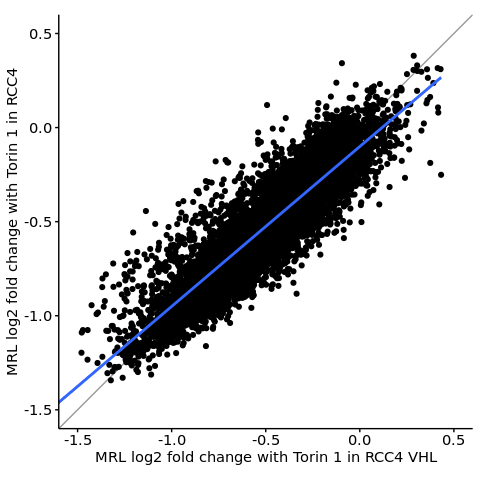
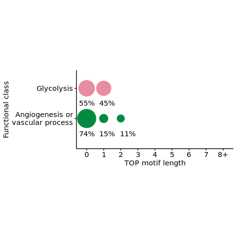
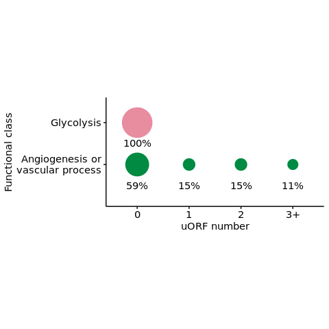
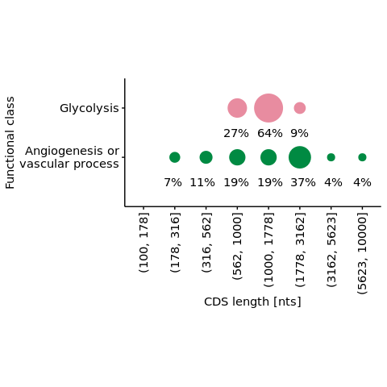

s9-1-4 Interplay of the HIF and mTOR pathways
================
Yoichiro Sugimoto
30 April, 2022

  - [Overview](#overview)
  - [Pre-processed data import](#pre-processed-data-import)
  - [GO term enrichment analysis of HIF target genes by their changes in
    translation upon mTOR
    inhibition](#go-term-enrichment-analysis-of-hif-target-genes-by-their-changes-in-translation-upon-mtor-inhibition)
  - [HIF and mTOR dependent regulation of glycolytic
    genes](#hif-and-mtor-dependent-regulation-of-glycolytic-genes)
  - [Analysis of HIF dependent transcriptional regulation and mTOR
    dependent translational
    regulation](#analysis-of-hif-dependent-transcriptional-regulation-and-mtor-dependent-translational-regulation)
  - [Differential sensitivity to mTOR inhibition of HIF-target mRNAs by
    their functional classes and HIFA
    isoforms](#differential-sensitivity-to-mtor-inhibition-of-hif-target-mrnas-by-their-functional-classes-and-hifa-isoforms)
      - [Analysis of mTOR sensitivity of HIF-target mRNAs by their
        functional
        classes](#analysis-of-mtor-sensitivity-of-hif-target-mrnas-by-their-functional-classes)
      - [Analysis of HIF2A/HIF1A binding ratio of HIF-target mRNAs by
        their functional
        classes](#analysis-of-hif2ahif1a-binding-ratio-of-hif-target-mrnas-by-their-functional-classes)
      - [Analysis of HIF2A-dependent induction of HIF-target mRNAs by
        their functional
        classes](#analysis-of-hif2a-dependent-induction-of-hif-target-mrnas-by-their-functional-classes)
  - [Analysis of mTOR dependent translational regulation as a function
    of HIF pathway
    acivitity](#analysis-of-mtor-dependent-translational-regulation-as-a-function-of-hif-pathway-acivitity)
  - [Sequence features of HIF induced glycolytic genes and angiogenesis
    genes](#sequence-features-of-hif-induced-glycolytic-genes-and-angiogenesis-genes)
  - [Session information](#session-information)

# Overview

``` r
sig.th <- 0.05

## Data visualization packages
library("ggrepel")
library("cowplot")
## Library("kableExtra")
## Parallelization oackages
## Specify the number of CPUs to be used
processors <- 8

temp <- sapply(list.files("../functions", full.names = TRUE), source)
temp <- sapply(list.files("../s8-analysis-of-translation/functions", full.names = TRUE), source, chdir = TRUE)
```

    ## [1] "Sample file used: /camp/lab/ratcliffep/home/users/sugimoy/CAMP_HPC/projects/20211102_HP5_HIF_mTOR/data/sample_data/processed_sample_file.csv"
    ## [1] "The following objects are exported: poly.coldata.df, poly.sample.dt, translation.comparison.dt"
    ## [1] "In translation.comparison.dt, xx specifies the factor compared where the comparison is specified after __, while yy is a wildcard. From left, each factor specifies cell, VHL, EIF4E2, clone, and treatment"
    ## [1] "The following functions were exported: analyzeDtg(), subsetColdata()"

``` r
temp <- sapply(list.files("../s9-integrative-analysis/functions", full.names = TRUE), source, chdir = TRUE)
source("../s6-differential-expression-and-tss-usage/functions/load_total_analysis_results.R", chdir = TRUE)
```

    ## [1] "Sample file used: /camp/lab/ratcliffep/home/users/sugimoy/CAMP_HPC/projects/20211102_HP5_HIF_mTOR/data/sample_data/processed_sample_file.csv"
    ## [1] "The following R objects were exported: total.sample.dt, total.coldata.df, total.comparison.dt"
    ## [1] "Comparison information was loaded"
    ## [1] "/camp/lab/ratcliffep/home/users/sugimoy/CAMP_HPC/projects/20211102_HP5_HIF_mTOR/results"
    ## [1] "The following objects were loaded: tss.de.res.dt, tss.ratio.res.dt, diff.tss.res.dt"

``` r
set.seed(0)
```

``` r
results.dir <- file.path("../../results")
s7.dir <- file.path(results.dir, "s7-HIF-binding-site")
s7.2.hif1.2a.dir <- file.path(s7.dir, "s7-2-HIF1A-and-HIF2A-ratio")

s8.dir <- file.path(results.dir, "s8-analysis-of-translation")
s8.1.dir <- file.path(s8.dir, "s8-1-differentially-translated-mRNAs")
s8.1.1.dir <- file.path(s8.1.dir, "gene-level-dte")
s8.3.dir <- file.path(s8.dir, "s8-3-validation-of-method")

s9.dir <- file.path(results.dir, "s9-integrative-analysis")

sample.file <- file.path("../../data/sample_data/processed_sample_file.csv")
sample.dt <- fread(sample.file)
sample.names <- sample.dt[, sample_name]
```

# Pre-processed data import

``` r
all.de.dte.res.dt <- fread(
    file.path(
        s9.dir,
        "all-differential-expression-and-translation-data.csv"
    ),
    na.strings = ""
)

all.de.dte.res.dt[, `:=`(
    VHL_target_RCC4 = factor(
        VHL_target_RCC4,
        levels = c("VHL_loss_repressed", "non_VHL_target", "VHL_loss_induced")
    ),
    mRNA_trsl_intersection_by_functions =  factor(
        mRNA_trsl_intersection_by_functions,
        levels = c("Glycolysis", "Others", "Angiogenesis or vascular process")
    )
)]

all.filtered.gene.dt <- fread(
    file.path(
        s8.3.dir,
        "filtered_gene_for_polysome_analysis.csv"
    )
)

th.all.de.dte.res.dt <- all.de.dte.res.dt[
        gene_id %in% intersect(
                         all.filtered.gene.dt[RCC4_noVHL_NA == TRUE, gene_id],
                         all.filtered.gene.dt[RCC4_noVHL_Torin1== TRUE, gene_id]
                     )
]
```

# GO term enrichment analysis of HIF target genes by their changes in translation upon mTOR inhibition

``` r
library("gprofiler2")
set_base_url("https://biit.cs.ut.ee/gprofiler_archive3/e102_eg49_p15") # For reproducibility, use archive version

print("The number of genes for GO term analysis")
```

    ## [1] "The number of genes for GO term analysis"

``` r
th.all.de.dte.res.dt[, table(RCC4_mRNA_mTOR_trsl_group)]
```

    ## RCC4_mRNA_mTOR_trsl_group
    ## mRNA_down_and_translation_down   mRNA_down_and_translation_up 
    ##                            100                             68 
    ##   mRNA_up_and_translation_down     mRNA_up_and_translation_up 
    ##                            124                            122 
    ##                         Others 
    ##                           8167

``` r
print(paste0("Total number of genes in the background: ", nrow(th.all.de.dte.res.dt)))
```

    ## [1] "Total number of genes in the background: 8581"

``` r
gostres.hif.up.mtor.preserved <- gost(
    query = th.all.de.dte.res.dt[
        RCC4_mRNA_mTOR_trsl_group == "mRNA_up_and_translation_up",
        gene_id
    ],
    custom_bg = th.all.de.dte.res.dt[, gene_id],
    organism = "hsapiens"
)
```

    ## Detected custom background input, domain scope is set to 'custom'

``` r
gostres.hif.up.mtor.preserved.res.dt <-
    gostres.hif.up.mtor.preserved$result %>% data.table


gostres.hif.up.mtor.down <- gost(
    query = th.all.de.dte.res.dt[
        RCC4_mRNA_mTOR_trsl_group == "mRNA_up_and_translation_down",
        gene_id
    ],
    custom_bg = th.all.de.dte.res.dt[, gene_id],
    organism = "hsapiens"
)
```

    ## Detected custom background input, domain scope is set to 'custom'

``` r
gostres.hif.up.mtor.down.res.dt <-
    gostres.hif.up.mtor.down$result %>% data.table


mrna.mtor.go.res.dt <- rbindlist(list(
    gostres.hif.up.mtor.preserved.res.dt[
      , regulation_type := "VHL_loss_induced_and_translation_preserved"],
    gostres.hif.up.mtor.down.res.dt[
      , regulation_type := "VHL_loss_induced_and_translation_down-regulated"]
))

sl.mrna.mtor.go.res.dt <- mrna.mtor.go.res.dt[order(p_value)] %>%
    {.[!(source %in% c("MIRNA", "WP", "HP"))]} %>%
    {.[, head(.SD, 5), by = regulation_type]}

sl.mrna.mtor.go.res.dt[order(regulation_type), .(
    regulation_type,
    term_name, source, p_value 
)] %>% print
```

    ##                                     regulation_type
    ##  1: VHL_loss_induced_and_translation_down-regulated
    ##  2: VHL_loss_induced_and_translation_down-regulated
    ##  3: VHL_loss_induced_and_translation_down-regulated
    ##  4: VHL_loss_induced_and_translation_down-regulated
    ##  5: VHL_loss_induced_and_translation_down-regulated
    ##  6:      VHL_loss_induced_and_translation_preserved
    ##  7:      VHL_loss_induced_and_translation_preserved
    ##  8:      VHL_loss_induced_and_translation_preserved
    ##  9:      VHL_loss_induced_and_translation_preserved
    ## 10:      VHL_loss_induced_and_translation_preserved
    ##                                          term_name source      p_value
    ##  1:                   Glycolysis / Gluconeogenesis   KEGG 4.026975e-12
    ##  2:          glucose catabolic process to pyruvate  GO:BP 3.778940e-11
    ##  3:                           canonical glycolysis  GO:BP 3.778940e-11
    ##  4:                              NADH regeneration  GO:BP 3.778940e-11
    ##  5: glycolytic process through glucose-6-phosphate  GO:BP 9.955663e-11
    ##  6:                       receptor ligand activity  GO:MF 4.711697e-03
    ##  7:          signaling receptor activator activity  GO:MF 6.497860e-03
    ##  8:                    receptor regulator activity  GO:MF 9.802736e-03
    ##  9:         vascular process in circulatory system  GO:BP 1.445643e-02
    ## 10:                                   angiogenesis  GO:BP 1.852260e-02

``` r
file.path(
    s9.dir, "VHL-mTOR-GO-term-analysis-result.csv"
) %>% {fwrite(sl.mrna.mtor.go.res.dt, .)}
```

# HIF and mTOR dependent regulation of glycolytic genes

``` r
to.show.th.dt <- copy(th.all.de.dte.res.dt)

to.show.th.dt <- to.show.th.dt[
    (mRNA_trsl_intersection_by_functions == "Glycolysis") | gene_name %in% c("TYMP", "PGM2", "DERA")
][, .(gene_name,
      ##RCC4_mRNA_mTOR_trsl_group,
      translational_regulation_RCC4_noVHL_EIF4E2_yy_xx__Torin1_vs_NA,
      VHL_target_RCC4,
      log2fc_RCC4_xx_HIF1B_N__noVHL_vs_VHL,
      padj_RCC4_xx_HIF1B_N__noVHL_vs_VHL
      )
  ][order(gene_name)]

setnames(
    to.show.th.dt,
    old = c(
        "VHL_target_RCC4",
        "translational_regulation_RCC4_noVHL_EIF4E2_yy_xx__Torin1_vs_NA",
        "log2fc_RCC4_xx_HIF1B_N__noVHL_vs_VHL",
        "padj_RCC4_xx_HIF1B_N__noVHL_vs_VHL"),
    new = c("mRNA_by_VHL_loss", "mTOR_inh_noVHL", "mRNA_log2fc", "mRNA_padj")
)

typical.glycolytic.genes <- c(
    "HK1", "GPI", "PFKL", "PFKM", "ALDOA", "ALDOC",
    "GAPDH", "TPI1", "PGK1", "PGAM1", "ENO1", "ENO2",
    "PKM", "LDHA", "LDHB"
)

to.show.th.dt[gene_name %in% typical.glycolytic.genes][
    order(match(gene_name, typical.glycolytic.genes)),
    .(gene_name, mRNA_by_VHL_loss, mTOR_inh_noVHL, mRNA_log2fc, mRNA_padj)
]
```

    ##     gene_name mRNA_by_VHL_loss mTOR_inh_noVHL mRNA_log2fc    mRNA_padj
    ##  1:       HK1 VHL_loss_induced           Down   0.7505663 2.263907e-08
    ##  2:       GPI VHL_loss_induced           Down   0.8756418 4.491237e-13
    ##  3:      PFKL   non_VHL_target           Down   0.4586248 1.775392e-03
    ##  4:      PFKM   non_VHL_target           Down  -0.4132255 9.683110e-02
    ##  5:     ALDOA VHL_loss_induced           Down   0.8479827 4.146663e-15
    ##  6:     ALDOC VHL_loss_induced           Down   1.8963358 8.593404e-30
    ##  7:     GAPDH VHL_loss_induced           Down   0.8604502 3.002562e-17
    ##  8:      TPI1 VHL_loss_induced           Down   1.2090488 2.898235e-34
    ##  9:      PGK1 VHL_loss_induced           Down   1.7581884 3.655407e-66
    ## 10:     PGAM1 VHL_loss_induced           Down   0.9267487 4.836565e-07
    ## 11:      ENO1 VHL_loss_induced           Down   0.8302405 1.708302e-17
    ## 12:      ENO2 VHL_loss_induced           Down   1.6308024 4.924151e-35
    ## 13:       PKM   non_VHL_target           Down   0.4543095 1.076139e-04
    ## 14:      LDHA VHL_loss_induced           Down   1.7982049 4.918895e-98
    ## 15:      LDHB   non_VHL_target           Down  -0.1786611 2.427047e-01

# Analysis of HIF dependent transcriptional regulation and mTOR dependent translational regulation

``` r
print("Sanity check")
```

    ## [1] "Sanity check"

``` r
nrow(th.all.de.dte.res.dt[duplicated(gene_id)])
```

    ## [1] 0

``` r
ggplot(
    th.all.de.dte.res.dt,
    aes(
        x = log2fc_RCC4_xx_HIF1B_N__noVHL_vs_VHL,
        y = MRL_log2fc_RCC4_noVHL_EIF4E2_yy_xx__Torin1_vs_NA,
        color = VHL_target_RCC4
    )
) +
    geom_hline(yintercept = 0, color = "gray40") +
    geom_vline(xintercept = 0, color = "gray40") +
    scale_color_manual(values = c(
                           "VHL_loss_induced" = "firebrick",
                           "non_VHL_target" = "black",
                           "VHL_loss_repressed" = "black"
                       )) +
    geom_point() +
    theme(
        legend.position = "bottom",
        aspect.ratio = 1
    ) +
    xlim(c(-4, 12)) + ylim(c(-1.5, 1)) +
    xlab("mRNA log2 fold change upon VHL loss in RCC4") +
    ylab("MRL log2 fold change with Torin 1 in RCC4")
```

    ## Warning: Removed 1 rows containing missing values (geom_point).

<!-- -->

``` r
hif.related.genes <- c(
    "HIF1A", "EPAS1", "ARNT",
    "EGLN1", "EGLN2", "EGLN3", "HIF1AN"   
)

ggplot(
    th.all.de.dte.res.dt,
    aes(
        x = log2fc_RCC4_xx_HIF1B_N__noVHL_vs_VHL,
        y = MRL_log2fc_RCC4_noVHL_EIF4E2_yy_xx__Torin1_vs_NA
    )
) +
    geom_hline(yintercept = 0, color = "gray40") +
    geom_vline(xintercept = 0, color = "gray40") +
    scale_color_manual(values = c(
                           "VHL_loss_induced" = "firebrick",
                           "non_VHL_target" = "black",
                           "VHL_loss_repressed" = "black"
                       )) +
    geom_point() +
    gghighlight::gghighlight(
                     gene_name %in% hif.related.genes,
                     label_key = gene_name,
                     label_params = list(size = 4.5)
                 ) +
    theme(
        legend.position = "bottom",
        aspect.ratio = 1
    ) +
    xlim(c(-4, 12)) + ylim(c(-1.5, 1)) +
    xlab("mRNA log2 fold change upon VHL loss in RCC4") +
    ylab("MRL log2 fold change with Torin 1 in RCC4")
```

    ## Warning: Could not calculate the predicate for layer 1, layer 2; ignored
    
    ## Warning: Removed 1 rows containing missing values (geom_point).

<!-- -->

``` r
th.all.de.dte.res.dt %$%
    cor.test(
        x = log2fc_RCC4_xx_HIF1B_N__noVHL_vs_VHL,
        y = MRL_log2fc_RCC4_noVHL_EIF4E2_yy_xx__Torin1_vs_NA,
        method = "spearman",
        alternative = "two.sided"
    )
```

    ## 
    ##  Spearman's rank correlation rho
    ## 
    ## data:  log2fc_RCC4_xx_HIF1B_N__noVHL_vs_VHL and MRL_log2fc_RCC4_noVHL_EIF4E2_yy_xx__Torin1_vs_NA
    ## S = 1.0123e+11, p-value = 0.0003771
    ## alternative hypothesis: true rho is not equal to 0
    ## sample estimates:
    ##        rho 
    ## 0.03837724

``` r
print(paste0(
    "The number of samples for this analysis was: ",
    nrow(th.all.de.dte.res.dt[
        !is.na(MRL_log2fc_RCC4_noVHL_EIF4E2_yy_xx__Torin1_vs_NA)
    ])
))
```

    ## [1] "The number of samples for this analysis was: 8580"

``` r
trsl.change.by.class.dt <- copy(th.all.de.dte.res.dt[, .(
    gene_id, gene_name,
    mRNA_trsl_intersection_by_functions,
    VHL_target_RCC4,
    log2fc_RCC4_xx_HIF1B_N__noVHL_vs_VHL,
    ## padj_RCC4_xx_HIF1B_N__noVHL_vs_VHL,
    MRL_log2fc_RCC4_noVHL_EIF4E2_yy_xx__Torin1_vs_NA
)])[
    ## mRNA_trsl_intersection_by_functions != "Others" &
    VHL_target_RCC4 == "VHL_loss_induced"
][, VHL_target_RCC4 := NULL][
    order(
        ## mRNA_trsl_intersection_by_functions,,
        - log2fc_RCC4_xx_HIF1B_N__noVHL_vs_VHL
    )
]

setnames(
    trsl.change.by.class.dt,
    old = c(
        "mRNA_trsl_intersection_by_functions", 
        "log2fc_RCC4_xx_HIF1B_N__noVHL_vs_VHL",
        "MRL_log2fc_RCC4_noVHL_EIF4E2_yy_xx__Torin1_vs_NA"
    ),
    new = c(
        "Functional_classes",
        "mRNA_log2FC_upon_VHL_loss",
        "MRL_log2FC_with_Torin_1"
    )
)

fwrite(
    trsl.change.by.class.dt,
    file.path(s9.dir, "mTOR_sensitivity_of_HIF_targets_by_class.csv")    
)
```

# Differential sensitivity to mTOR inhibition of HIF-target mRNAs by their functional classes and HIFA isoforms

## Analysis of mTOR sensitivity of HIF-target mRNAs by their functional classes

``` r
unhighlighted.color <- "gray60" #"#BEBEBEB2"

go.annot.colors <- c(
    "Glycolysis" = "#E88CA0",
    "Angiogenesis or vascular process" = "#008A42",
    "Others" = unhighlighted.color
)

## Density plot version
ggplot(
    data = th.all.de.dte.res.dt[VHL_target_RCC4 == "VHL_loss_induced"],
    aes(
        x = MRL_log2fc_RCC4_noVHL_EIF4E2_yy_xx__Torin1_vs_NA,
        color = forcats::fct_rev(mRNA_trsl_intersection_by_functions),
        fill = forcats::fct_rev(mRNA_trsl_intersection_by_functions)
    )
) +
    geom_density(
        alpha = 0.7,
        color = "black",
        bw = "SJ"
    ) +
    ## geom_rug(
    ##     data = th.all.de.dte.res.dt[
    ##         VHL_target_RCC4 == "VHL_loss_induced" &
    ##         mRNA_trsl_intersection_by_functions != "Others"
    ##     ],
    ##     size = 1
    ## ) +
    scale_fill_manual(values = go.annot.colors) +
    scale_color_manual(
        values = go.annot.colors,
        guide = "none"
    ) +
    guides(
        fill = guide_legend(reverse = TRUE, ncol = 1)
    ) +
    xlab("MRL log2 fold change with Torin 1") +
    ylab("Density of genes") +
    theme(
        legend.position = "bottom",
        legend.title = element_blank()
    )
```

<!-- -->

``` r
print("The number of genes for this analysis")
```

    ## [1] "The number of genes for this analysis"

``` r
th.all.de.dte.res.dt[
    VHL_target_RCC4 == "VHL_loss_induced" &
    !is.na(MRL_log2fc_RCC4_noVHL_EIF4E2_yy_xx__Torin1_vs_NA),
    .N, by = mRNA_trsl_intersection_by_functions
]
```

    ##    mRNA_trsl_intersection_by_functions   N
    ## 1:                              Others 333
    ## 2:    Angiogenesis or vascular process  29
    ## 3:                          Glycolysis  12

``` r
print("in RCC4")
```

    ## [1] "in RCC4"

``` r
th.all.de.dte.res.dt[VHL_target_RCC4 == "VHL_loss_induced"] %$%
    pairwise.wilcox.test(
        x = MRL_log2fc_RCC4_noVHL_EIF4E2_yy_xx__Torin1_vs_NA,
        g = mRNA_trsl_intersection_by_functions,
        p.adjust.method = "none",
        alternative = "two.sided"
    )
```

    ## 
    ##  Pairwise comparisons using Wilcoxon rank sum test with continuity correction 
    ## 
    ## data:  MRL_log2fc_RCC4_noVHL_EIF4E2_yy_xx__Torin1_vs_NA and mRNA_trsl_intersection_by_functions 
    ## 
    ##                                  Glycolysis Others
    ## Others                           1.1e-05    -     
    ## Angiogenesis or vascular process 2.3e-07    0.0056
    ## 
    ## P value adjustment method: none

``` r
## Just to confirm the robustness
print("in RCC4 VHL")
```

    ## [1] "in RCC4 VHL"

``` r
th.all.de.dte.res.dt[VHL_target_RCC4 == "VHL_loss_induced"] %$%
    pairwise.wilcox.test(
        x = MRL_log2fc_RCC4_VHL_EIF4E2_yy_xx__Torin1_vs_NA,
        g = mRNA_trsl_intersection_by_functions,
        p.adjust.method = "none",
        alternative = "two.sided"
    )
```

    ## 
    ##  Pairwise comparisons using Wilcoxon rank sum test with continuity correction 
    ## 
    ## data:  MRL_log2fc_RCC4_VHL_EIF4E2_yy_xx__Torin1_vs_NA and mRNA_trsl_intersection_by_functions 
    ## 
    ##                                  Glycolysis Others
    ## Others                           4.5e-06    -     
    ## Angiogenesis or vascular process 8.4e-07    0.0095
    ## 
    ## P value adjustment method: none

## Analysis of HIF2A/HIF1A binding ratio of HIF-target mRNAs by their functional classes

``` r
## Here I focus on the comparison of angiogenesis and vasucular process genes vs others
th.all.de.dte.res.dt[, `:=`(
    angiogenesis_or_others = case_when(
        mRNA_trsl_intersection_by_functions == "Angiogenesis or vascular process" ~
            "Angiogenesis or vascular process",
        TRUE ~ "Others"
    )
)]

## Load HIF binding data
tss.hif.pos.dt <- file.path(
    s7.2.hif1.2a.dir,
    "filtered-tss-and-nearest-hif-binding-position.csv"
) %>%
    fread

hif.induced.tss.hif.pos.dt <- tss.hif.pos.dt[
    tss_name %in%
    tss.de.res.dt[
        comparison_name == "RCC4_xx_HIF1B_N__noVHL_vs_VHL" &
        padj < 0.1 &  log2fc > 0
    ][order(shrlog2fc, decreasing = TRUE)][!duplicated(gene_id), tss_name]
]

hif.binding.and.trsl.dt <- merge(
    th.all.de.dte.res.dt,
    hif.induced.tss.hif.pos.dt[, .(gene_id, Fold, HIF2A_enrichment_with_dist_th)],
    by = "gene_id"
)

ggplot(
    data = hif.binding.and.trsl.dt[
        VHL_target_RCC4 == "VHL_loss_induced"
    ],
    aes(
        y = HIF2A_enrichment_with_dist_th,
        x = mRNA_trsl_intersection_by_functions
    )
) +
    geom_hline(yintercept = 0, color = "gray60") +
    geom_boxplot(outlier.shape = NA) +
    scale_x_discrete(guide = guide_axis(angle = 90)) +
    ggsci::scale_fill_jama() +
    ggsci::scale_color_jama() +
    theme(
        aspect.ratio = 3,
        legend.position = "bottom",
        legend.title = element_blank()
    ) +
    xlab("Functional class") +
    ylab("log2(HIF2A binding / HIF1A binding)")
```

    ## Warning: Removed 51 rows containing non-finite values (stat_boxplot).

<!-- -->

``` r
stats.hif.binding.and.trsl.dt <- hif.binding.and.trsl.dt[
    !is.na(HIF2A_enrichment_with_dist_th) &
    VHL_target_RCC4 == "VHL_loss_induced"    
]

stats.hif.binding.and.trsl.dt[
  , .N, by = mRNA_trsl_intersection_by_functions
]
```

    ##    mRNA_trsl_intersection_by_functions   N
    ## 1:                              Others 268
    ## 2:    Angiogenesis or vascular process  25
    ## 3:                          Glycolysis  12

``` r
stats.hif.binding.and.trsl.dt %$%
    pairwise.wilcox.test(
        x = HIF2A_enrichment_with_dist_th,
        g = angiogenesis_or_others,
        p.adjust.method = "none",
        alternative = "two.sided"
    )
```

    ## 
    ##  Pairwise comparisons using Wilcoxon rank sum test with continuity correction 
    ## 
    ## data:  HIF2A_enrichment_with_dist_th and angiogenesis_or_others 
    ## 
    ##        Angiogenesis or vascular process
    ## Others 0.0092                          
    ## 
    ## P value adjustment method: none

``` r
lapply(
    stats.hif.binding.and.trsl.dt[
        , levels(mRNA_trsl_intersection_by_functions)
    ],
    function(x){
        data.table(
            functional_class = x,
            wil_p = wilcox.test(
                x = stats.hif.binding.and.trsl.dt[
                    mRNA_trsl_intersection_by_functions == x,
                    HIF2A_enrichment_with_dist_th
                ],
                y = stats.hif.binding.and.trsl.dt[
                    mRNA_trsl_intersection_by_functions != x,
                    HIF2A_enrichment_with_dist_th
                ],
                alternative = "two.sided"
            )$p.value             
        )
    }
) %>%
    rbindlist %>%
    {.[functional_class != "Others"]} %>%
    {.[, padj := p.adjust(wil_p, method = "holm")]} %>%
    print
```

    ##                    functional_class       wil_p        padj
    ## 1:                       Glycolysis 0.003136758 0.006273517
    ## 2: Angiogenesis or vascular process 0.009223798 0.009223798

## Analysis of HIF2A-dependent induction of HIF-target mRNAs by their functional classes

``` r
ggplot(
    data = th.all.de.dte.res.dt[
        VHL_target_RCC4 == "VHL_loss_induced" &
        !is.na(padj_786O_xx_HIF1B_N__noVHL_vs_VHL)
    ],
    aes(
        x = mRNA_trsl_intersection_by_functions,
        y = log2fc_786O_xx_HIF1B_N__noVHL_vs_VHL
    )
) +
    geom_hline(yintercept = 0, color = "gray60") +
    geom_boxplot(outlier.shape = NA) +
    scale_x_discrete(guide = guide_axis(angle = 90)) +
    coord_cartesian(ylim = c(-1.5, 3)) +
    theme(
        legend.position = "bottom",
        legend.title = element_blank(),
        aspect.ratio = 3
    ) +
    ylab("mRNA log2 fold change upon VHL loss in 786-O") +
    xlab("Functional class")
```

<!-- -->

``` r
## For statisitical analysis of mRNA induction in 786-O
for.stat.th.all.de.dte.res.dt <- copy(
    th.all.de.dte.res.dt[
        VHL_target_RCC4 == "VHL_loss_induced",
        .(gene_id, gene_name,
          mRNA_trsl_intersection_by_functions,
          angiogenesis_or_others,
          translational_regulation_RCC4_noVHL_EIF4E2_yy_xx__Torin1_vs_NA,
          padj_RCC4_xx_HIF1B_N__noVHL_vs_VHL, log2fc_RCC4_xx_HIF1B_N__noVHL_vs_VHL,
          padj_786O_xx_HIF1B_N__noVHL_vs_VHL, log2fc_786O_xx_HIF1B_N__noVHL_vs_VHL,
          meanNormCount_treated_786O_xx_HIF1B_N__noVHL_vs_VHL,
          meanNormCount_base_786O_xx_HIF1B_N__noVHL_vs_VHL)
    ]
)

for.stat.th.all.de.dte.res.dt[!is.na(padj_786O_xx_HIF1B_N__noVHL_vs_VHL)] %$%
    pairwise.wilcox.test(
        x = log2fc_786O_xx_HIF1B_N__noVHL_vs_VHL,
        g = angiogenesis_or_others,
        p.adjust.method = "none",
        alternative = "two.sided"
    )
```

    ## 
    ##  Pairwise comparisons using Wilcoxon rank sum test with continuity correction 
    ## 
    ## data:  log2fc_786O_xx_HIF1B_N__noVHL_vs_VHL and angiogenesis_or_others 
    ## 
    ##        Angiogenesis or vascular process
    ## Others 0.0068                          
    ## 
    ## P value adjustment method: none

``` r
## Show the number of samples, and the sample with missing value
for.stat.th.all.de.dte.res.dt[
    !is.na(padj_786O_xx_HIF1B_N__noVHL_vs_VHL),
    table(angiogenesis_or_others)
]
```

    ## angiogenesis_or_others
    ## Angiogenesis or vascular process                           Others 
    ##                               27                              305

``` r
for.stat.th.all.de.dte.res.dt[
    is.na(padj_786O_xx_HIF1B_N__noVHL_vs_VHL),
    table(angiogenesis_or_others)
]
```

    ## angiogenesis_or_others
    ## Angiogenesis or vascular process                           Others 
    ##                                2                               40

# Analysis of mTOR dependent translational regulation as a function of HIF pathway acivitity

``` r
th2.all.de.dte.res.dt <- th.all.de.dte.res.dt[
    gene_id %in% Reduce(
                     intersect,
                     list(
                         all.filtered.gene.dt[RCC4_noVHL_NA == TRUE, gene_id],
                         all.filtered.gene.dt[RCC4_noVHL_Torin1== TRUE, gene_id],
                         all.filtered.gene.dt[RCC4_VHL_NA == TRUE, gene_id],
                         all.filtered.gene.dt[RCC4_VHL_Torin1== TRUE, gene_id]
                     ))
]

ggplot(
    data = th2.all.de.dte.res.dt,
    aes(
        x = MRL_log2fc_RCC4_VHL_EIF4E2_yy_xx__Torin1_vs_NA,
        y = MRL_log2fc_RCC4_noVHL_EIF4E2_yy_xx__Torin1_vs_NA
    )
) +
    geom_abline(intercept = 0, slope = 1, color = "gray60") +
    geom_point() +
    geom_smooth(method = "lm") +
    coord_cartesian(xlim = c(-1.5, 0.5), ylim = c(-1.5, 0.5)) +
    xlab("MRL log2 fold change with Torin 1 in RCC4 VHL") +
    ylab("MRL log2 fold change with Torin 1 in RCC4") +
    theme(
        aspect.ratio = 1
    )
```

    ## `geom_smooth()` using formula 'y ~ x'

    ## Warning: Removed 1 rows containing non-finite values (stat_smooth).

    ## Warning: Removed 1 rows containing missing values (geom_point).

<!-- -->

``` r
th2.all.de.dte.res.dt %$%
    cor.test(
        x = MRL_log2fc_RCC4_VHL_EIF4E2_yy_xx__Torin1_vs_NA,
        y = MRL_log2fc_RCC4_noVHL_EIF4E2_yy_xx__Torin1_vs_NA,
        method = "pearson",
        alternative = "two.sided"
    )
```

    ## 
    ##  Pearson's product-moment correlation
    ## 
    ## data:  MRL_log2fc_RCC4_VHL_EIF4E2_yy_xx__Torin1_vs_NA and MRL_log2fc_RCC4_noVHL_EIF4E2_yy_xx__Torin1_vs_NA
    ## t = 175.97, df = 8426, p-value < 2.2e-16
    ## alternative hypothesis: true correlation is not equal to 0
    ## 95 percent confidence interval:
    ##  0.8819617 0.8910990
    ## sample estimates:
    ##       cor 
    ## 0.8866168

``` r
print(
    paste0(
        "The number of genes analysed was: ",
        nrow(
            th2.all.de.dte.res.dt[, .(
            MRL_log2fc_RCC4_VHL_EIF4E2_yy_xx__Torin1_vs_NA,
            MRL_log2fc_RCC4_noVHL_EIF4E2_yy_xx__Torin1_vs_NA
            ) %>% {.[complete.cases(.)]}]
        )
    )
)
```

    ## [1] "The number of genes analysed was: 8429"

``` r
th2.all.de.dte.res.dt %$%
    lm(
        MRL_log2fc_RCC4_noVHL_EIF4E2_yy_xx__Torin1_vs_NA ~
            MRL_log2fc_RCC4_VHL_EIF4E2_yy_xx__Torin1_vs_NA,
    ) %>% summary
```

    ## 
    ## Call:
    ## lm(formula = MRL_log2fc_RCC4_noVHL_EIF4E2_yy_xx__Torin1_vs_NA ~ 
    ##     MRL_log2fc_RCC4_VHL_EIF4E2_yy_xx__Torin1_vs_NA)
    ## 
    ## Residuals:
    ##      Min       1Q   Median       3Q      Max 
    ## -0.51770 -0.08800 -0.00803  0.08157  0.63928 
    ## 
    ## Coefficients:
    ##                                                 Estimate Std. Error t value
    ## (Intercept)                                    -0.100511   0.002854  -35.21
    ## MRL_log2fc_RCC4_VHL_EIF4E2_yy_xx__Torin1_vs_NA  0.850008   0.004831  175.97
    ##                                                Pr(>|t|)    
    ## (Intercept)                                      <2e-16 ***
    ## MRL_log2fc_RCC4_VHL_EIF4E2_yy_xx__Torin1_vs_NA   <2e-16 ***
    ## ---
    ## Signif. codes:  0 '***' 0.001 '**' 0.01 '*' 0.05 '.' 0.1 ' ' 1
    ## 
    ## Residual standard error: 0.1317 on 8426 degrees of freedom
    ##   (1 observation deleted due to missingness)
    ## Multiple R-squared:  0.7861, Adjusted R-squared:  0.7861 
    ## F-statistic: 3.096e+04 on 1 and 8426 DF,  p-value: < 2.2e-16

``` r
## Additional confirmation of the offset from the line of identity
th2.all.de.dte.res.dt %$%
    lm(
        MRL_log2fc_RCC4_noVHL_EIF4E2_yy_xx__Torin1_vs_NA ~
            MRL_log2fc_RCC4_VHL_EIF4E2_yy_xx__Torin1_vs_NA +
            offset(MRL_log2fc_RCC4_VHL_EIF4E2_yy_xx__Torin1_vs_NA),
    ) %>% summary
```

    ## 
    ## Call:
    ## lm(formula = MRL_log2fc_RCC4_noVHL_EIF4E2_yy_xx__Torin1_vs_NA ~ 
    ##     MRL_log2fc_RCC4_VHL_EIF4E2_yy_xx__Torin1_vs_NA + offset(MRL_log2fc_RCC4_VHL_EIF4E2_yy_xx__Torin1_vs_NA))
    ## 
    ## Residuals:
    ##      Min       1Q   Median       3Q      Max 
    ## -0.51770 -0.08800 -0.00803  0.08157  0.63928 
    ## 
    ## Coefficients:
    ##                                                 Estimate Std. Error t value
    ## (Intercept)                                    -0.100511   0.002854  -35.21
    ## MRL_log2fc_RCC4_VHL_EIF4E2_yy_xx__Torin1_vs_NA -0.149992   0.004831  -31.05
    ##                                                Pr(>|t|)    
    ## (Intercept)                                      <2e-16 ***
    ## MRL_log2fc_RCC4_VHL_EIF4E2_yy_xx__Torin1_vs_NA   <2e-16 ***
    ## ---
    ## Signif. codes:  0 '***' 0.001 '**' 0.01 '*' 0.05 '.' 0.1 ' ' 1
    ## 
    ## Residual standard error: 0.1317 on 8426 degrees of freedom
    ##   (1 observation deleted due to missingness)
    ## Multiple R-squared:  0.7861, Adjusted R-squared:  0.7861 
    ## F-statistic: 3.096e+04 on 1 and 8426 DF,  p-value: < 2.2e-16

# Sequence features of HIF induced glycolytic genes and angiogenesis genes

``` r
tss.prop.dt <- copy(tss.de.res.dt[
    comparison_name == "RCC4_xx_HIF1B_N__noVHL_vs_VHL"
])[
  , meanNormCount_treated_gene := sum(meanNormCount_treated), by = gene_id
]

tss.prop.dt[
  , proportion_treated := meanNormCount_treated / meanNormCount_treated_gene
]

tx.meta.info.dt <- file.path(s8.3.dir, "processed-tx-meta-info.csv") %>%
    fread %>% merge(
                  y = th.all.de.dte.res.dt[
                      VHL_target_RCC4 == "VHL_loss_induced" &
                      mRNA_trsl_intersection_by_functions != "Others"
                  ][
                    , .(
                          gene_id, gene_name,
                          VHL_target_RCC4,
                          mRNA_trsl_intersection_by_functions
                      )],
                  by = "gene_id"
) %>%
    merge(
        y = tss.prop.dt[
            , .(tss_name, meanNormCount_treated, proportion_treated)
        ],
        by = "tss_name"
    )

## For the calculation of values for mRNA features, isoforms not annotated are ignored
tx.meta.info.dt[
  , meanNormCount_treated_annotated_gene := sum(meanNormCount_treated),
    by = gene_id
]
tx.meta.info.dt[
  , proportion_treated_annotated := meanNormCount_treated / meanNormCount_treated_annotated_gene,
]


tx.meta.info.by.class.dt <- tx.meta.info.dt[, .(
    gene_name,
    VHL_target_RCC4,
    mRNA_trsl_intersection_by_functions,
    cds_len = sum(cds_len * proportion_treated_annotated),
    uORF_all = sum(uORF_all * proportion_treated_annotated),
    TOP_motif_length = sum(TOP_motif_length * proportion_treated_annotated),
    total_proportion = sum(proportion_treated)
), by = gene_id][!duplicated(gene_id)]


print("Before filtration by feature assigned isoform ratio")
```

    ## [1] "Before filtration by feature assigned isoform ratio"

``` r
tx.meta.info.by.class.dt[
    , table(mRNA_trsl_intersection_by_functions)
]
```

    ## mRNA_trsl_intersection_by_functions
    ##                       Glycolysis                           Others 
    ##                               11                                0 
    ## Angiogenesis or vascular process 
    ##                               29

``` r
print("After filtration by feature assigned isoform ratio")
```

    ## [1] "After filtration by feature assigned isoform ratio"

``` r
tx.meta.info.by.class.dt[
    total_proportion > 0.5
][, table(mRNA_trsl_intersection_by_functions)]
```

    ## mRNA_trsl_intersection_by_functions
    ##                       Glycolysis                           Others 
    ##                               11                                0 
    ## Angiogenesis or vascular process 
    ##                               27

``` r
tx.meta.info.by.class.dt <- tx.meta.info.by.class.dt[total_proportion > 0.5]

## TOP motif length
tx.meta.info.by.class.dt[
  , TOP_motif_length_capped := round(TOP_motif_length) %>%
        {case_when(
             . >= 8 ~ "8+",
             TRUE ~ as.character(.)
         )} %>% factor(levels = c(as.character(0:7), "8+"))
]

top.count.dt <- tx.meta.info.by.class.dt[
  , .N, by = list(mRNA_trsl_intersection_by_functions, TOP_motif_length_capped)
]

top.count.dt[, class_sum := sum(N), by = mRNA_trsl_intersection_by_functions]
top.count.dt[, proportion := N/class_sum]
print(top.count.dt[order(mRNA_trsl_intersection_by_functions, TOP_motif_length_capped)])
```

    ##    mRNA_trsl_intersection_by_functions TOP_motif_length_capped  N class_sum
    ## 1:                          Glycolysis                       0  6        11
    ## 2:                          Glycolysis                       1  5        11
    ## 3:    Angiogenesis or vascular process                       0 20        27
    ## 4:    Angiogenesis or vascular process                       1  4        27
    ## 5:    Angiogenesis or vascular process                       2  3        27
    ##    proportion
    ## 1:  0.5454545
    ## 2:  0.4545455
    ## 3:  0.7407407
    ## 4:  0.1481481
    ## 5:  0.1111111

``` r
ggplot(
    data = top.count.dt,
    aes(
        x = TOP_motif_length_capped,
        y = gsub("or ", "or\n", mRNA_trsl_intersection_by_functions)
    )
) +
    geom_point(
        aes(
            size = proportion,
            color = mRNA_trsl_intersection_by_functions
        )
    ) +
    geom_text_repel(
        aes(label = paste0(round(proportion * 100), "%")),
        nudge_x = 0,
        nudge_y = -0.5,
        min.segment.length = Inf
    ) +
    scale_color_manual(values = go.annot.colors, guide = "none") +
    scale_size_area(limits = c(0, 1), max_size = 15) +
    scale_x_discrete(drop = FALSE) +
    theme(
        aspect.ratio = 1/2,
        legend.position = "none"
    ) +
    xlab("TOP motif length") +
    ylab("Functional class") +
    expand_limits(y = c(0, 1.25))
```

<!-- -->

``` r
## uORF number
tx.meta.info.by.class.dt[
  , uORF_all_capped := round(uORF_all) %>%
        {case_when(
             . >= 3 ~ "3+",
             TRUE ~ as.character(.)
         )} %>% factor
]

uORF.count.dt <- tx.meta.info.by.class.dt[
  , .N, by = list(mRNA_trsl_intersection_by_functions, uORF_all_capped)
]

uORF.count.dt[, class_sum := sum(N), by = mRNA_trsl_intersection_by_functions]
uORF.count.dt[, proportion := N/class_sum]
print(uORF.count.dt[order(mRNA_trsl_intersection_by_functions, uORF_all_capped)])
```

    ##    mRNA_trsl_intersection_by_functions uORF_all_capped  N class_sum proportion
    ## 1:                          Glycolysis               0 11        11  1.0000000
    ## 2:    Angiogenesis or vascular process               0 16        27  0.5925926
    ## 3:    Angiogenesis or vascular process               1  4        27  0.1481481
    ## 4:    Angiogenesis or vascular process               2  4        27  0.1481481
    ## 5:    Angiogenesis or vascular process              3+  3        27  0.1111111

``` r
ggplot(
    data = uORF.count.dt,
    aes(
        x = uORF_all_capped,
        y = gsub("or ", "or\n", mRNA_trsl_intersection_by_functions)
    )
) +
    geom_point(
        aes(
            size = proportion,
            color = mRNA_trsl_intersection_by_functions
        )
    ) +
    geom_text_repel(
        aes(label = paste0(round(proportion * 100), "%")),
        nudge_x = 0,
        nudge_y = -0.5,
        min.segment.length = Inf
    ) +
    scale_color_manual(values = go.annot.colors, guide = "none") +
    scale_size_area(limits = c(0, 1), max_size = 15) +
    theme(
        aspect.ratio = 1/2,
        legend.position = "none"
    ) +
    xlab("uORF number") +
    ylab("Functional class") +
    expand_limits(y = c(0, 1.25))
```

<!-- -->

``` r
## CDS length
tx.meta.info.by.class.dt[, `:=`(
    cds_len_bin = cut(
        log10(cds_len),
        breaks = seq(2, 4, by = 0.25),
        labels = paste0(
            "(",
            seq(2, 4, by = 0.25) %>% {.[1:(length(.) - 1)]} %>% {round(10^.)},
            ", ",
            seq(2, 4, by = 0.25) %>% {.[2:length(.)]} %>% {round(10^.)},
            "]"
        )
    )
)]

CDS.count.dt <- tx.meta.info.by.class.dt[
  , .N, by = list(mRNA_trsl_intersection_by_functions, cds_len_bin)
]
CDS.count.dt[, class_sum := sum(N), by = mRNA_trsl_intersection_by_functions]
CDS.count.dt[, proportion := N/class_sum]

print(CDS.count.dt[order(mRNA_trsl_intersection_by_functions, cds_len_bin)])
```

    ##     mRNA_trsl_intersection_by_functions   cds_len_bin  N class_sum proportion
    ##  1:                          Glycolysis   (562, 1000]  2        11 0.18181818
    ##  2:                          Glycolysis  (1000, 1778]  8        11 0.72727273
    ##  3:                          Glycolysis  (1778, 3162]  1        11 0.09090909
    ##  4:    Angiogenesis or vascular process    (178, 316]  2        27 0.07407407
    ##  5:    Angiogenesis or vascular process    (316, 562]  3        27 0.11111111
    ##  6:    Angiogenesis or vascular process   (562, 1000]  4        27 0.14814815
    ##  7:    Angiogenesis or vascular process  (1000, 1778]  6        27 0.22222222
    ##  8:    Angiogenesis or vascular process  (1778, 3162] 10        27 0.37037037
    ##  9:    Angiogenesis or vascular process  (3162, 5623]  1        27 0.03703704
    ## 10:    Angiogenesis or vascular process (5623, 10000]  1        27 0.03703704

``` r
ggplot(
    data = CDS.count.dt,
    aes(
        x = cds_len_bin,
        y = gsub("or ", "or\n", mRNA_trsl_intersection_by_functions)
    )
) +
    geom_point(
        aes(
            size = proportion,
            color = mRNA_trsl_intersection_by_functions
        )
    ) +
    geom_text_repel(
        aes(label = paste0(round(proportion * 100), "%")),
        nudge_x = 0,
        nudge_y = -0.5,
        min.segment.length = Inf
    ) +
    scale_color_manual(values = go.annot.colors, guide = "none") +
    scale_size_area(limits = c(0, 1), max_size = 15) +
    theme(
        aspect.ratio = 1/2,
        legend.position = "none"
    ) +
    xlab("CDS length [nts]") +
    ylab("Functional class") +
    scale_x_discrete(guide = guide_axis(angle = 90), drop = FALSE) +
    expand_limits(y = c(0, 1.25))
```

<!-- -->

# Session information

``` r
sessionInfo()
```

    ## R version 4.0.0 (2020-04-24)
    ## Platform: x86_64-conda_cos6-linux-gnu (64-bit)
    ## Running under: CentOS Linux 7 (Core)
    ## 
    ## Matrix products: default
    ## BLAS/LAPACK: /camp/lab/ratcliffep/home/users/sugimoy/CAMP_HPC/software/miniconda3_20200606/envs/five_prime_seq_for_VHL_loss_v0.2.1/lib/libopenblasp-r0.3.10.so
    ## 
    ## locale:
    ##  [1] LC_CTYPE=en_GB.UTF-8       LC_NUMERIC=C              
    ##  [3] LC_TIME=en_GB.UTF-8        LC_COLLATE=en_GB.UTF-8    
    ##  [5] LC_MONETARY=en_GB.UTF-8    LC_MESSAGES=en_GB.UTF-8   
    ##  [7] LC_PAPER=en_GB.UTF-8       LC_NAME=C                 
    ##  [9] LC_ADDRESS=C               LC_TELEPHONE=C            
    ## [11] LC_MEASUREMENT=en_GB.UTF-8 LC_IDENTIFICATION=C       
    ## 
    ## attached base packages:
    ## [1] parallel  stats     graphics  grDevices utils     datasets  methods  
    ## [8] base     
    ## 
    ## other attached packages:
    ##  [1] gprofiler2_0.1.9  knitr_1.28        stringr_1.4.0     magrittr_1.5     
    ##  [5] data.table_1.12.8 dplyr_1.0.0       khroma_1.3.0      cowplot_1.0.0    
    ##  [9] ggrepel_0.8.2     ggplot2_3.3.1     rmarkdown_2.2    
    ## 
    ## loaded via a namespace (and not attached):
    ##  [1] tidyselect_1.1.0  xfun_0.14         purrr_0.3.4       lattice_0.20-41  
    ##  [5] splines_4.0.0     colorspace_1.4-1  vctrs_0.3.1       generics_0.0.2   
    ##  [9] htmltools_0.4.0   viridisLite_0.3.0 yaml_2.2.1        mgcv_1.8-31      
    ## [13] plotly_4.9.2.1    rlang_0.4.10      pillar_1.4.4      glue_1.4.1       
    ## [17] withr_2.4.1       lifecycle_0.2.0   munsell_0.5.0     gtable_0.3.0     
    ## [21] ggsci_2.9         htmlwidgets_1.5.1 evaluate_0.14     labeling_0.3     
    ## [25] forcats_0.5.0     fansi_0.4.1       Rcpp_1.0.4.6      scales_1.1.1     
    ## [29] jsonlite_1.7.2    farver_2.0.3      digest_0.6.25     stringi_1.4.6    
    ## [33] grid_4.0.0        cli_2.0.2         tools_4.0.0       bitops_1.0-6     
    ## [37] gghighlight_0.3.0 lazyeval_0.2.2    RCurl_1.98-1.2    tibble_3.0.1     
    ## [41] crayon_1.3.4      tidyr_1.1.0       pkgconfig_2.0.3   Matrix_1.2-18    
    ## [45] ellipsis_0.3.1    assertthat_0.2.1  httr_1.4.2        R6_2.4.1         
    ## [49] nlme_3.1-148      compiler_4.0.0
