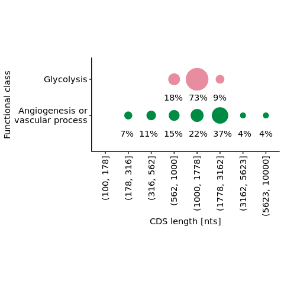

s9-1-4 Interplay of the HIF and mTOR pathways
================
Yoichiro Sugimoto
24 May, 2022

  - [Overview](#overview)
  - [Pre-processed data import](#pre-processed-data-import)
  - [GO term enrichment analysis of HIF target genes by their changes in
    translation upon mTOR
    inhibition](#go-term-enrichment-analysis-of-hif-target-genes-by-their-changes-in-translation-upon-mtor-inhibition)
  - [HIF and mTOR dependent regulation of glycolytic
    genes](#hif-and-mtor-dependent-regulation-of-glycolytic-genes)
  - [Analysis of HIF dependent transcriptional regulation and mTOR
    dependent translational
    regulation](#analysis-of-hif-dependent-transcriptional-regulation-and-mtor-dependent-translational-regulation)
  - [Differential sensitivity to mTOR inhibition of HIF-target mRNAs by
    their functional classes and HIFA
    isoforms](#differential-sensitivity-to-mtor-inhibition-of-hif-target-mrnas-by-their-functional-classes-and-hifa-isoforms)
      - [Analysis of mTOR sensitivity of HIF-target mRNAs by their
        functional
        classes](#analysis-of-mtor-sensitivity-of-hif-target-mrnas-by-their-functional-classes)
      - [Analysis of HIF2A/HIF1A binding ratio of HIF-target mRNAs by
        their functional
        classes](#analysis-of-hif2ahif1a-binding-ratio-of-hif-target-mrnas-by-their-functional-classes)
      - [Analysis of HIF2A-dependent induction of HIF-target mRNAs by
        their functional
        classes](#analysis-of-hif2a-dependent-induction-of-hif-target-mrnas-by-their-functional-classes)
  - [Analysis of mTOR dependent translational regulation as a function
    of HIF pathway
    acivitity](#analysis-of-mtor-dependent-translational-regulation-as-a-function-of-hif-pathway-acivitity)
  - [Sequence features of HIF induced glycolytic genes and angiogenesis
    genes](#sequence-features-of-hif-induced-glycolytic-genes-and-angiogenesis-genes)
  - [Session information](#session-information)

# Overview

``` r
sig.th <- 0.05

## Data visualization packages
library("ggrepel")
library("cowplot")
## Library("kableExtra")
## Parallelization oackages
## Specify the number of CPUs to be used
processors <- 8

temp <- sapply(list.files("../functions", full.names = TRUE), source)
temp <- sapply(list.files("../s8-analysis-of-translation/functions", full.names = TRUE), source, chdir = TRUE)
```

    ## [1] "Sample file used: /camp/lab/ratcliffep/home/users/sugimoy/CAMP_HPC/projects/20211102_HP5_HIF_mTOR/data/sample_data/processed_sample_file.csv"
    ## [1] "The following objects are exported: poly.coldata.df, poly.sample.dt, translation.comparison.dt"
    ## [1] "In translation.comparison.dt, xx specifies the factor compared where the comparison is specified after __, while yy is a wildcard. From left, each factor specifies cell, VHL, EIF4E2, clone, and treatment"
    ## [1] "The following functions were exported: analyzeDtg(), subsetColdata()"

``` r
temp <- sapply(list.files("../s9-integrative-analysis/functions", full.names = TRUE), source, chdir = TRUE)
source("../s6-differential-expression-and-tss-usage/functions/load_total_analysis_results.R", chdir = TRUE)
```

    ## [1] "Sample file used: /camp/lab/ratcliffep/home/users/sugimoy/CAMP_HPC/projects/20211102_HP5_HIF_mTOR/data/sample_data/processed_sample_file.csv"
    ## [1] "The following R objects were exported: total.sample.dt, total.coldata.df, total.comparison.dt"
    ## [1] "Comparison information was loaded"
    ## [1] "/camp/lab/ratcliffep/home/users/sugimoy/CAMP_HPC/projects/20211102_HP5_HIF_mTOR/results"
    ## [1] "The following objects were loaded: tss.de.res.dt, tss.ratio.res.dt, diff.tss.res.dt"

``` r
set.seed(0)
```

``` r
results.dir <- file.path("../../results")
s7.dir <- file.path(results.dir, "s7-HIF-binding-site")
s7.2.hif1.2a.dir <- file.path(s7.dir, "s7-2-HIF1A-and-HIF2A-ratio")

s8.dir <- file.path(results.dir, "s8-analysis-of-translation")
s8.1.dir <- file.path(s8.dir, "s8-1-differentially-translated-mRNAs")
s8.1.1.dir <- file.path(s8.1.dir, "gene-level-dte")
s8.3.dir <- file.path(s8.dir, "s8-3-validation-of-method")

s9.dir <- file.path(results.dir, "s9-integrative-analysis")

sq.dir <- file.path(results.dir, "sq-for-publication")
source.data.dir <- file.path(sq.dir, "sq1-source-data")
source.data.by.panel.dir <- file.path(source.data.dir, "by_panel")

sample.file <- file.path("../../data/sample_data/processed_sample_file.csv")
sample.dt <- fread(sample.file)
sample.names <- sample.dt[, sample_name]
```

# Pre-processed data import

``` r
all.de.dte.res.dt <- fread(
    file.path(
        s9.dir,
        "all-differential-expression-and-translation-data.csv"
    ),
    na.strings = ""
)

all.de.dte.res.dt[, `:=`(
    VHL_target_RCC4 = factor(
        VHL_target_RCC4,
        levels = c("VHL_loss_repressed", "non_VHL_target", "VHL_loss_induced")
    ),
    mRNA_trsl_intersection_by_functions =  factor(
        mRNA_trsl_intersection_by_functions,
        levels = c("Glycolysis", "Others", "Angiogenesis or vascular process")
    )
)]

all.filtered.gene.dt <- fread(
    file.path(
        s8.3.dir,
        "filtered_gene_for_polysome_analysis.csv"
    )
)

th.all.de.dte.res.dt <- all.de.dte.res.dt[
        gene_id %in% intersect(
                         all.filtered.gene.dt[RCC4_noVHL_NA == TRUE, gene_id],
                         all.filtered.gene.dt[RCC4_noVHL_Torin1== TRUE, gene_id]
                     )
]
```

# GO term enrichment analysis of HIF target genes by their changes in translation upon mTOR inhibition

``` r
library("gprofiler2")
set_base_url("https://biit.cs.ut.ee/gprofiler_archive3/e102_eg49_p15") # For reproducibility, use archive version

print("The number of genes for GO term analysis")
```

    ## [1] "The number of genes for GO term analysis"

``` r
th.all.de.dte.res.dt[, table(RCC4_mRNA_mTOR_trsl_group)]
```

    ## RCC4_mRNA_mTOR_trsl_group
    ## mRNA_down_and_translation_down   mRNA_down_and_translation_up 
    ##                            100                             68 
    ##   mRNA_up_and_translation_down     mRNA_up_and_translation_up 
    ##                            124                            122 
    ##                         Others 
    ##                           8167

``` r
print(paste0("Total number of genes in the background: ", nrow(th.all.de.dte.res.dt)))
```

    ## [1] "Total number of genes in the background: 8581"

``` r
gostres.hif.up.mtor.preserved <- gost(
    query = th.all.de.dte.res.dt[
        RCC4_mRNA_mTOR_trsl_group == "mRNA_up_and_translation_up",
        gene_id
    ],
    custom_bg = th.all.de.dte.res.dt[, gene_id],
    organism = "hsapiens"
)
```

    ## Detected custom background input, domain scope is set to 'custom'

``` r
gostres.hif.up.mtor.preserved.res.dt <-
    gostres.hif.up.mtor.preserved$result %>% data.table


gostres.hif.up.mtor.down <- gost(
    query = th.all.de.dte.res.dt[
        RCC4_mRNA_mTOR_trsl_group == "mRNA_up_and_translation_down",
        gene_id
    ],
    custom_bg = th.all.de.dte.res.dt[, gene_id],
    organism = "hsapiens"
)
```

    ## Detected custom background input, domain scope is set to 'custom'

``` r
gostres.hif.up.mtor.down.res.dt <-
    gostres.hif.up.mtor.down$result %>% data.table


mrna.mtor.go.res.dt <- rbindlist(list(
    gostres.hif.up.mtor.preserved.res.dt[
      , regulation_type := "VHL_loss_induced_and_translation_preserved"],
    gostres.hif.up.mtor.down.res.dt[
      , regulation_type := "VHL_loss_induced_and_translation_down-regulated"]
))

sl.mrna.mtor.go.res.dt <- mrna.mtor.go.res.dt[order(p_value)] %>%
    {.[!(source %in% c("MIRNA", "WP", "HP"))]} %>%
    {.[, head(.SD, 5), by = regulation_type]}

sl.mrna.mtor.go.res.dt[order(regulation_type), .(
    regulation_type,
    term_name, source, p_value 
)] %>% print
```

    ##                                     regulation_type
    ##  1: VHL_loss_induced_and_translation_down-regulated
    ##  2: VHL_loss_induced_and_translation_down-regulated
    ##  3: VHL_loss_induced_and_translation_down-regulated
    ##  4: VHL_loss_induced_and_translation_down-regulated
    ##  5: VHL_loss_induced_and_translation_down-regulated
    ##  6:      VHL_loss_induced_and_translation_preserved
    ##  7:      VHL_loss_induced_and_translation_preserved
    ##  8:      VHL_loss_induced_and_translation_preserved
    ##  9:      VHL_loss_induced_and_translation_preserved
    ## 10:      VHL_loss_induced_and_translation_preserved
    ##                                          term_name source      p_value
    ##  1:                   Glycolysis / Gluconeogenesis   KEGG 4.026975e-12
    ##  2:          glucose catabolic process to pyruvate  GO:BP 3.778940e-11
    ##  3:                           canonical glycolysis  GO:BP 3.778940e-11
    ##  4:                              NADH regeneration  GO:BP 3.778940e-11
    ##  5: glycolytic process through glucose-6-phosphate  GO:BP 9.955663e-11
    ##  6:                       receptor ligand activity  GO:MF 4.711697e-03
    ##  7:          signaling receptor activator activity  GO:MF 6.497860e-03
    ##  8:                    receptor regulator activity  GO:MF 9.802736e-03
    ##  9:         vascular process in circulatory system  GO:BP 1.445643e-02
    ## 10:                                   angiogenesis  GO:BP 1.852260e-02

``` r
file.path(
    s9.dir, "VHL-mTOR-GO-term-analysis-result.csv"
) %>% {fwrite(sl.mrna.mtor.go.res.dt, .)}
```

# HIF and mTOR dependent regulation of glycolytic genes

``` r
to.show.th.dt <- copy(th.all.de.dte.res.dt)

to.show.th.dt <- to.show.th.dt[
    (mRNA_trsl_intersection_by_functions == "Glycolysis") | gene_name %in% c("TYMP", "PGM2", "DERA")
][, .(gene_name,
      ##RCC4_mRNA_mTOR_trsl_group,
      translational_regulation_RCC4_noVHL_EIF4E2_yy_xx__Torin1_vs_NA,
      VHL_target_RCC4,
      log2fc_RCC4_xx_HIF1B_N__noVHL_vs_VHL,
      padj_RCC4_xx_HIF1B_N__noVHL_vs_VHL
      )
  ][order(gene_name)]

setnames(
    to.show.th.dt,
    old = c(
        "VHL_target_RCC4",
        "translational_regulation_RCC4_noVHL_EIF4E2_yy_xx__Torin1_vs_NA",
        "log2fc_RCC4_xx_HIF1B_N__noVHL_vs_VHL",
        "padj_RCC4_xx_HIF1B_N__noVHL_vs_VHL"),
    new = c("mRNA_by_VHL_loss", "mTOR_inh_noVHL", "mRNA_log2fc", "mRNA_padj")
)

typical.glycolytic.genes <- c(
    "HK1", "GPI", "PFKL", "PFKM", "ALDOA", "ALDOC",
    "GAPDH", "TPI1", "PGK1", "PGAM1", "ENO1", "ENO2",
    "PKM", "LDHA", "LDHB"
)

to.show.th.dt[gene_name %in% typical.glycolytic.genes][
    order(match(gene_name, typical.glycolytic.genes)),
    .(gene_name, mRNA_by_VHL_loss, mTOR_inh_noVHL, mRNA_log2fc, mRNA_padj)
]
```

    ##     gene_name mRNA_by_VHL_loss mTOR_inh_noVHL mRNA_log2fc    mRNA_padj
    ##  1:       HK1 VHL_loss_induced           Down   0.7505663 2.263907e-08
    ##  2:       GPI VHL_loss_induced           Down   0.8756418 4.491237e-13
    ##  3:      PFKL   non_VHL_target           Down   0.4586248 1.775392e-03
    ##  4:      PFKM   non_VHL_target           Down  -0.4132255 9.683110e-02
    ##  5:     ALDOA VHL_loss_induced           Down   0.8479827 4.146663e-15
    ##  6:     ALDOC VHL_loss_induced           Down   1.8963358 8.593404e-30
    ##  7:     GAPDH VHL_loss_induced           Down   0.8604502 3.002562e-17
    ##  8:      TPI1 VHL_loss_induced           Down   1.2090488 2.898235e-34
    ##  9:      PGK1 VHL_loss_induced           Down   1.7581884 3.655407e-66
    ## 10:     PGAM1 VHL_loss_induced           Down   0.9267487 4.836565e-07
    ## 11:      ENO1 VHL_loss_induced           Down   0.8302405 1.708302e-17
    ## 12:      ENO2 VHL_loss_induced           Down   1.6308024 4.924151e-35
    ## 13:       PKM   non_VHL_target           Down   0.4543095 1.076139e-04
    ## 14:      LDHA VHL_loss_induced           Down   1.7982049 4.918895e-98
    ## 15:      LDHB   non_VHL_target           Down  -0.1786611 2.427047e-01

# Analysis of HIF dependent transcriptional regulation and mTOR dependent translational regulation

``` r
print("Sanity check")
```

    ## [1] "Sanity check"

``` r
nrow(th.all.de.dte.res.dt[duplicated(gene_id)])
```

    ## [1] 0

``` r
ggplot(
    th.all.de.dte.res.dt,
    aes(
        x = log2fc_RCC4_xx_HIF1B_N__noVHL_vs_VHL,
        y = MRL_log2fc_RCC4_noVHL_EIF4E2_yy_xx__Torin1_vs_NA,
        color = VHL_target_RCC4
    )
) +
    geom_hline(yintercept = 0, color = "gray40") +
    geom_vline(xintercept = 0, color = "gray40") +
    scale_color_manual(values = c(
                           "VHL_loss_induced" = "firebrick",
                           "non_VHL_target" = "black",
                           "VHL_loss_repressed" = "black"
                       )) +
    geom_point() +
    theme(
        legend.position = "bottom",
        aspect.ratio = 1
    ) +
    xlim(c(-4, 12)) + ylim(c(-1.5, 1)) +
    xlab("mRNA log2 fold change upon VHL loss in RCC4") +
    ylab("MRL log2 fold change with Torin 1 in RCC4")
```

    ## Warning: Removed 1 rows containing missing values (geom_point).

<!-- -->

``` r
for.source.data.cols.1 <- c("gene_id", "gene_name", "log2fc_RCC4_xx_HIF1B_N__noVHL_vs_VHL", "MRL_log2fc_RCC4_noVHL_EIF4E2_yy_xx__Torin1_vs_NA", "VHL_target_RCC4")

temp <- exportSourceData(
    dt = th.all.de.dte.res.dt[, for.source.data.cols.1, with = FALSE] %>%
        {.[complete.cases(.)]},
    original.colnames = for.source.data.cols.1,
    export.colnames = c("gene_id", "gene_name", "mRNA log2fc upon VHL loss", "MRL log2fc with Torin 1", "HIF target class"),
    export.file.name = "Fig. 5b.csv"
)

hif.related.genes <- c(
    "HIF1A", "EPAS1", "ARNT",
    "EGLN1", "EGLN2", "EGLN3", "HIF1AN"   
)

ggplot(
    th.all.de.dte.res.dt,
    aes(
        x = log2fc_RCC4_xx_HIF1B_N__noVHL_vs_VHL,
        y = MRL_log2fc_RCC4_noVHL_EIF4E2_yy_xx__Torin1_vs_NA
    )
) +
    geom_hline(yintercept = 0, color = "gray40") +
    geom_vline(xintercept = 0, color = "gray40") +
    scale_color_manual(values = c(
                           "VHL_loss_induced" = "firebrick",
                           "non_VHL_target" = "black",
                           "VHL_loss_repressed" = "black"
                       )) +
    geom_point() +
    gghighlight::gghighlight(
                     gene_name %in% hif.related.genes,
                     label_key = gene_name,
                     label_params = list(size = 4.5)
                 ) +
    theme(
        legend.position = "bottom",
        aspect.ratio = 1
    ) +
    xlim(c(-4, 12)) + ylim(c(-1.5, 1)) +
    xlab("mRNA log2 fold change upon VHL loss in RCC4") +
    ylab("MRL log2 fold change with Torin 1 in RCC4")
```

    ## Warning: Could not calculate the predicate for layer 1, layer 2; ignored
    
    ## Warning: Removed 1 rows containing missing values (geom_point).

<!-- -->

``` r
th.all.de.dte.res.dt %$%
    cor.test(
        x = log2fc_RCC4_xx_HIF1B_N__noVHL_vs_VHL,
        y = MRL_log2fc_RCC4_noVHL_EIF4E2_yy_xx__Torin1_vs_NA,
        method = "spearman",
        alternative = "two.sided"
    )
```

    ## 
    ##  Spearman's rank correlation rho
    ## 
    ## data:  log2fc_RCC4_xx_HIF1B_N__noVHL_vs_VHL and MRL_log2fc_RCC4_noVHL_EIF4E2_yy_xx__Torin1_vs_NA
    ## S = 1.0123e+11, p-value = 0.0003771
    ## alternative hypothesis: true rho is not equal to 0
    ## sample estimates:
    ##        rho 
    ## 0.03837724

``` r
print(paste0(
    "The number of samples for this analysis was: ",
    nrow(th.all.de.dte.res.dt[
        !is.na(MRL_log2fc_RCC4_noVHL_EIF4E2_yy_xx__Torin1_vs_NA)
    ])
))
```

    ## [1] "The number of samples for this analysis was: 8580"

``` r
trsl.change.by.class.dt <- copy(th.all.de.dte.res.dt[, .(
    gene_id, gene_name,
    mRNA_trsl_intersection_by_functions,
    VHL_target_RCC4,
    log2fc_RCC4_xx_HIF1B_N__noVHL_vs_VHL,
    ## padj_RCC4_xx_HIF1B_N__noVHL_vs_VHL,
    MRL_log2fc_RCC4_noVHL_EIF4E2_yy_xx__Torin1_vs_NA
)])[
    ## mRNA_trsl_intersection_by_functions != "Others" &
    VHL_target_RCC4 == "VHL_loss_induced"
][, VHL_target_RCC4 := NULL][
    order(
        ## mRNA_trsl_intersection_by_functions,,
        - log2fc_RCC4_xx_HIF1B_N__noVHL_vs_VHL
    )
]

setnames(
    trsl.change.by.class.dt,
    old = c(
        "mRNA_trsl_intersection_by_functions", 
        "log2fc_RCC4_xx_HIF1B_N__noVHL_vs_VHL",
        "MRL_log2fc_RCC4_noVHL_EIF4E2_yy_xx__Torin1_vs_NA"
    ),
    new = c(
        "Functional_classes",
        "mRNA_log2FC_upon_VHL_loss",
        "MRL_log2FC_with_Torin_1"
    )
)

fwrite(
    trsl.change.by.class.dt,
    file.path(s9.dir, "Supplementary Data 3.csv")    
)
```

# Differential sensitivity to mTOR inhibition of HIF-target mRNAs by their functional classes and HIFA isoforms

## Analysis of mTOR sensitivity of HIF-target mRNAs by their functional classes

``` r
unhighlighted.color <- "gray60" #"#BEBEBEB2"

go.annot.colors <- c(
    "Glycolysis" = "#E88CA0",
    "Angiogenesis or vascular process" = "#008A42",
    "Others" = unhighlighted.color
)

## Density plot version
ggplot(
    data = th.all.de.dte.res.dt[VHL_target_RCC4 == "VHL_loss_induced"],
    aes(
        x = MRL_log2fc_RCC4_noVHL_EIF4E2_yy_xx__Torin1_vs_NA,
        color = forcats::fct_rev(mRNA_trsl_intersection_by_functions),
        fill = forcats::fct_rev(mRNA_trsl_intersection_by_functions)
    )
) +
    geom_density(
        alpha = 0.7,
        color = "black",
        bw = "SJ"
    ) +
    ## geom_rug(
    ##     data = th.all.de.dte.res.dt[
    ##         VHL_target_RCC4 == "VHL_loss_induced" &
    ##         mRNA_trsl_intersection_by_functions != "Others"
    ##     ],
    ##     size = 1
    ## ) +
    scale_fill_manual(values = go.annot.colors) +
    scale_color_manual(
        values = go.annot.colors,
        guide = "none"
    ) +
    guides(
        fill = guide_legend(reverse = TRUE, ncol = 1)
    ) +
    xlab("MRL log2 fold change with Torin 1") +
    ylab("Density of genes") +
    theme(
        legend.position = "bottom",
        legend.title = element_blank()
    )
```

<!-- -->

``` r
print("The number of genes for this analysis")
```

    ## [1] "The number of genes for this analysis"

``` r
th.all.de.dte.res.dt[
    VHL_target_RCC4 == "VHL_loss_induced" &
    !is.na(MRL_log2fc_RCC4_noVHL_EIF4E2_yy_xx__Torin1_vs_NA),
    .N, by = mRNA_trsl_intersection_by_functions
]
```

    ##    mRNA_trsl_intersection_by_functions   N
    ## 1:                              Others 333
    ## 2:    Angiogenesis or vascular process  29
    ## 3:                          Glycolysis  12

``` r
print("in RCC4")
```

    ## [1] "in RCC4"

``` r
th.all.de.dte.res.dt[VHL_target_RCC4 == "VHL_loss_induced"] %$%
    pairwise.wilcox.test(
        x = MRL_log2fc_RCC4_noVHL_EIF4E2_yy_xx__Torin1_vs_NA,
        g = mRNA_trsl_intersection_by_functions,
        p.adjust.method = "none",
        alternative = "two.sided"
    )
```

    ## 
    ##  Pairwise comparisons using Wilcoxon rank sum test with continuity correction 
    ## 
    ## data:  MRL_log2fc_RCC4_noVHL_EIF4E2_yy_xx__Torin1_vs_NA and mRNA_trsl_intersection_by_functions 
    ## 
    ##                                  Glycolysis Others
    ## Others                           1.1e-05    -     
    ## Angiogenesis or vascular process 2.3e-07    0.0056
    ## 
    ## P value adjustment method: none

``` r
## Just to confirm the robustness
print("in RCC4 VHL")
```

    ## [1] "in RCC4 VHL"

``` r
th.all.de.dte.res.dt[VHL_target_RCC4 == "VHL_loss_induced"] %$%
    pairwise.wilcox.test(
        x = MRL_log2fc_RCC4_VHL_EIF4E2_yy_xx__Torin1_vs_NA,
        g = mRNA_trsl_intersection_by_functions,
        p.adjust.method = "none",
        alternative = "two.sided"
    )
```

    ## 
    ##  Pairwise comparisons using Wilcoxon rank sum test with continuity correction 
    ## 
    ## data:  MRL_log2fc_RCC4_VHL_EIF4E2_yy_xx__Torin1_vs_NA and mRNA_trsl_intersection_by_functions 
    ## 
    ##                                  Glycolysis Others
    ## Others                           4.5e-06    -     
    ## Angiogenesis or vascular process 8.4e-07    0.0095
    ## 
    ## P value adjustment method: none

## Analysis of HIF2A/HIF1A binding ratio of HIF-target mRNAs by their functional classes

``` r
## Here I focus on the comparison of angiogenesis and vasucular process genes vs others
th.all.de.dte.res.dt[, `:=`(
    angiogenesis_or_others = case_when(
        mRNA_trsl_intersection_by_functions == "Angiogenesis or vascular process" ~
            "Angiogenesis or vascular process",
        TRUE ~ "Others"
    )
)]

## Load HIF binding data
tss.hif.pos.dt <- file.path(
    s7.2.hif1.2a.dir,
    "filtered-tss-and-nearest-hif-binding-position.csv"
) %>%
    fread

hif.induced.tss.hif.pos.dt <- tss.hif.pos.dt[
    tss_name %in%
    tss.de.res.dt[
        comparison_name == "RCC4_xx_HIF1B_N__noVHL_vs_VHL" &
        padj < 0.1 &  log2fc > 0
    ][order(shrlog2fc, decreasing = TRUE)][!duplicated(gene_id), tss_name]
]

hif.binding.and.trsl.dt <- merge(
    th.all.de.dte.res.dt,
    hif.induced.tss.hif.pos.dt[, .(gene_id, Fold, HIF2A_enrichment_with_dist_th)],
    by = "gene_id"
)

ggplot(
    data = hif.binding.and.trsl.dt[
        VHL_target_RCC4 == "VHL_loss_induced"
    ],
    aes(
        y = HIF2A_enrichment_with_dist_th,
        x = mRNA_trsl_intersection_by_functions
    )
) +
    geom_hline(yintercept = 0, color = "gray60") +
    geom_boxplot(outlier.shape = NA) +
    scale_x_discrete(guide = guide_axis(angle = 90)) +
    ggsci::scale_fill_jama() +
    ggsci::scale_color_jama() +
    theme(
        aspect.ratio = 3,
        legend.position = "bottom",
        legend.title = element_blank()
    ) +
    xlab("Functional class") +
    ylab("log2(HIF2A binding / HIF1A binding)")
```

    ## Warning: Removed 51 rows containing non-finite values (stat_boxplot).

<!-- -->

``` r
hif.binding.and.trsl.dt[!is.na(HIF2A_enrichment_with_dist_th)][VHL_target_RCC4 == "VHL_loss_induced"]
```

    ##              gene_id  gene_name        biotype chromosome_name
    ##   1: ENSG00000005448      WDR54 protein_coding            chr2
    ##   2: ENSG00000019505      SYT13 protein_coding           chr11
    ##   3: ENSG00000020577     SAMD4A protein_coding           chr14
    ##   4: ENSG00000023697       DERA protein_coding           chr12
    ##   5: ENSG00000025039      RRAGD protein_coding            chr6
    ##  ---                                                          
    ## 301: ENSG00000242114      MTFP1 protein_coding           chr22
    ## 302: ENSG00000243927      MRPS6 protein_coding           chr21
    ## 303: ENSG00000248098     BCKDHA protein_coding           chr19
    ## 304: ENSG00000258818     RNASE4 protein_coding           chr14
    ## 305: ENSG00000285043 AC093512.2 protein_coding           chr16
    ##      log2fc_RCC4_xx_HIF1B_N__noVHL_vs_VHL
    ##   1:                            1.4171817
    ##   2:                            2.3919156
    ##   3:                            0.7991808
    ##   4:                            0.7697475
    ##   5:                            1.1133788
    ##  ---                                     
    ## 301:                            0.6534116
    ## 302:                            0.7190270
    ## 303:                            0.7719385
    ## 304:                            1.8717719
    ## 305:                            0.7912616
    ##      shrlog2fc_RCC4_xx_HIF1B_N__noVHL_vs_VHL padj_RCC4_xx_HIF1B_N__noVHL_vs_VHL
    ##   1:                               1.3922038                       6.697353e-23
    ##   2:                               2.0907544                       7.480066e-04
    ##   3:                               0.6700740                       1.001222e-02
    ##   4:                               0.7453648                       3.248113e-11
    ##   5:                               1.0612763                       1.556624e-08
    ##  ---                                                                           
    ## 301:                               0.6241119                       1.649653e-07
    ## 302:                               0.5430889                       5.178156e-02
    ## 303:                               0.7273932                       1.481921e-06
    ## 304:                               1.8463629                       2.552486e-30
    ## 305:                               0.6624519                       1.042494e-02
    ##      meanNormCount_treated_RCC4_xx_HIF1B_N__noVHL_vs_VHL
    ##   1:                                           91.140092
    ##   2:                                           96.428043
    ##   3:                                            9.090884
    ##   4:                                          166.623521
    ##   5:                                           31.688644
    ##  ---                                                    
    ## 301:                                          147.804796
    ## 302:                                            7.786678
    ## 303:                                           73.409185
    ## 304:                                           35.023021
    ## 305:                                            9.483836
    ##      meanNormCount_base_RCC4_xx_HIF1B_N__noVHL_vs_VHL
    ##   1:                                        34.127337
    ##   2:                                        18.373590
    ##   3:                                         5.248121
    ##   4:                                        97.662721
    ##   5:                                        14.675305
    ##  ---                                                 
    ## 301:                                        93.954664
    ## 302:                                         4.699554
    ## 303:                                        42.948528
    ## 304:                                         9.563186
    ## 305:                                         5.466124
    ##      mRNA_regulation_RCC4_xx_HIF1B_N__noVHL_vs_VHL
    ##   1:                                            Up
    ##   2:                                            Up
    ##   3:                                            Up
    ##   4:                                            Up
    ##   5:                                            Up
    ##  ---                                              
    ## 301:                                            Up
    ## 302:                                            Up
    ## 303:                                            Up
    ## 304:                                            Up
    ## 305:                                            Up
    ##      log2fc_786O_xx_HIF1B_N__noVHL_vs_VHL
    ##   1:                           0.06860629
    ##   2:                           1.43031628
    ##   3:                           0.29303036
    ##   4:                           0.39821934
    ##   5:                          -0.46151484
    ##  ---                                     
    ## 301:                           0.20105686
    ## 302:                           0.06034487
    ## 303:                           0.18286565
    ## 304:                           0.92104193
    ## 305:                           0.58336816
    ##      shrlog2fc_786O_xx_HIF1B_N__noVHL_vs_VHL padj_786O_xx_HIF1B_N__noVHL_vs_VHL
    ##   1:                            0.0064253130                          0.9978074
    ##   2:                            0.0063767942                          0.8461949
    ##   3:                            0.0291347149                          0.8682888
    ##   4:                            0.0565881659                          0.5834324
    ##   5:                           -0.0008731673                                 NA
    ##  ---                                                                           
    ## 301:                            0.0293101827                          0.9121492
    ## 302:                            0.0037737921                          0.9978074
    ## 303:                            0.0191437020                          0.9516208
    ## 304:                            0.0500109756                          0.2250898
    ## 305:                            0.0388265076                          0.5638208
    ##      meanNormCount_treated_786O_xx_HIF1B_N__noVHL_vs_VHL
    ##   1:                                           22.582839
    ##   2:                                            6.989492
    ##   3:                                            8.628696
    ##   4:                                           68.997334
    ##   5:                                            0.000000
    ##  ---                                                    
    ## 301:                                          111.103086
    ## 302:                                            5.835930
    ## 303:                                           26.418414
    ## 304:                                            5.014844
    ## 305:                                            6.320721
    ##      meanNormCount_base_786O_xx_HIF1B_N__noVHL_vs_VHL
    ##   1:                                       21.5387648
    ##   2:                                        2.5991615
    ##   3:                                        7.0573622
    ##   4:                                       52.3492904
    ##   5:                                        0.0394366
    ##  ---                                                 
    ## 301:                                       96.6662802
    ## 302:                                        5.5900715
    ## 303:                                       23.2453726
    ## 304:                                        2.6652705
    ## 305:                                        4.1812781
    ##      mRNA_regulation_786O_xx_HIF1B_N__noVHL_vs_VHL
    ##   1:                               Not_significant
    ##   2:                               Not_significant
    ##   3:                               Not_significant
    ##   4:                               Not_significant
    ##   5:                               Not_significant
    ##  ---                                              
    ## 301:                               Not_significant
    ## 302:                               Not_significant
    ## 303:                               Not_significant
    ## 304:                               Not_significant
    ## 305:                               Not_significant
    ##      log2fc_786O_xx_noHIF1B_N__noVHL_vs_VHL
    ##   1:                           -0.424882387
    ##   2:                            1.479077146
    ##   3:                           -0.559845703
    ##   4:                            0.468933327
    ##   5:                           -7.925443648
    ##  ---                                       
    ## 301:                            0.189406619
    ## 302:                            0.211743339
    ## 303:                            0.250312690
    ## 304:                           -0.007603417
    ## 305:                            0.816300876
    ##      shrlog2fc_786O_xx_noHIF1B_N__noVHL_vs_VHL
    ##   1:                             -3.368913e-06
    ##   2:                              2.189013e-06
    ##   3:                             -2.643737e-06
    ##   4:                              4.651801e-06
    ##   5:                             -2.154156e-07
    ##  ---                                          
    ## 301:                              3.026331e-06
    ## 302:                              6.379381e-07
    ## 303:                              4.665904e-06
    ## 304:                             -4.047915e-09
    ## 305:                              2.228506e-06
    ##      padj_786O_xx_noHIF1B_N__noVHL_vs_VHL
    ##   1:                            0.9998926
    ##   2:                            0.9998926
    ##   3:                            0.9998926
    ##   4:                            0.9998926
    ##   5:                            0.9998926
    ##  ---                                     
    ## 301:                            0.9998926
    ## 302:                            0.9998926
    ## 303:                            0.9998926
    ## 304:                            0.9998926
    ## 305:                            0.9998926
    ##      meanNormCount_treated_786O_xx_noHIF1B_N__noVHL_vs_VHL
    ##   1:                                             22.242180
    ##   2:                                              7.348630
    ##   3:                                              7.294374
    ##   4:                                             85.086144
    ##   5:                                              0.000000
    ##  ---                                                      
    ## 301:                                             82.399689
    ## 302:                                              4.128242
    ## 303:                                             32.212246
    ## 304:                                              4.416822
    ## 305:                                              4.128525
    ##      meanNormCount_base_786O_xx_noHIF1B_N__noVHL_vs_VHL
    ##   1:                                          29.931047
    ##   2:                                           2.629366
    ##   3:                                          10.802625
    ##   4:                                          61.432991
    ##   5:                                           5.592584
    ##  ---                                                   
    ## 301:                                          72.274684
    ## 302:                                           3.588258
    ## 303:                                          27.036297
    ## 304:                                           4.476428
    ## 305:                                           2.322343
    ##      mRNA_regulation_786O_xx_noHIF1B_N__noVHL_vs_VHL
    ##   1:                                 Not_significant
    ##   2:                                 Not_significant
    ##   3:                                 Not_significant
    ##   4:                                 Not_significant
    ##   5:                                 Not_significant
    ##  ---                                                
    ## 301:                                 Not_significant
    ## 302:                                 Not_significant
    ## 303:                                 Not_significant
    ## 304:                                 Not_significant
    ## 305:                                 Not_significant
    ##      log2fc_RCC4_noVHL_HIF1B_xx__H_vs_N shrlog2fc_RCC4_noVHL_HIF1B_xx__H_vs_N
    ##   1:                         0.07982199                           0.028675277
    ##   2:                         0.52150626                           0.488448446
    ##   3:                        -0.06316608                          -0.004022901
    ##   4:                         0.13922024                           0.078698908
    ##   5:                        -0.02832853                          -0.005334059
    ##  ---                                                                         
    ## 301:                         0.07100695                           0.027273417
    ## 302:                        -0.30873775                          -0.015017594
    ## 303:                         0.25263754                           0.175095464
    ## 304:                         0.42147157                           0.342878850
    ## 305:                         0.20859474                           0.014949906
    ##      padj_RCC4_noVHL_HIF1B_xx__H_vs_N
    ##   1:                     6.902178e-01
    ##   2:                     1.003121e-06
    ##   3:                               NA
    ##   4:                     3.188749e-01
    ##   5:                               NA
    ##  ---                                 
    ## 301:                     6.924659e-01
    ## 302:                               NA
    ## 303:                     9.709657e-02
    ## 304:                     1.671986e-02
    ## 305:                               NA
    ##      meanNormCount_treated_RCC4_noVHL_HIF1B_xx__H_vs_N
    ##   1:                                         92.404311
    ##   2:                                        132.758723
    ##   3:                                          8.348200
    ##   4:                                        175.827291
    ##   5:                                         29.844278
    ##  ---                                                  
    ## 301:                                        148.621248
    ## 302:                                          5.937958
    ## 303:                                         83.663790
    ## 304:                                         44.949352
    ## 305:                                         10.481391
    ##      meanNormCount_base_RCC4_noVHL_HIF1B_xx__H_vs_N
    ##   1:                                      87.422946
    ##   2:                                      92.489624
    ##   3:                                       8.719819
    ##   4:                                     159.834415
    ##   5:                                      30.395016
    ##  ---                                               
    ## 301:                                     141.776814
    ## 302:                                       7.469494
    ## 303:                                      70.419701
    ## 304:                                      33.595022
    ## 305:                                       9.097682
    ##      mRNA_regulation_RCC4_noVHL_HIF1B_xx__H_vs_N
    ##   1:                             Not_significant
    ##   2:                             Not_significant
    ##   3:                             Not_significant
    ##   4:                             Not_significant
    ##   5:                             Not_significant
    ##  ---                                            
    ## 301:                             Not_significant
    ## 302:                             Not_significant
    ## 303:                             Not_significant
    ## 304:                             Not_significant
    ## 305:                             Not_significant
    ##      log2fc_RCC4_VHL_HIF1B_xx__H_vs_N shrlog2fc_RCC4_VHL_HIF1B_xx__H_vs_N
    ##   1:                        0.9870940                          0.96548265
    ##   2:                        1.4440784                          1.42347408
    ##   3:                        0.1732528                          0.04654216
    ##   4:                        0.4881731                          0.47208302
    ##   5:                        0.6094385                          0.53529255
    ##  ---                                                                     
    ## 301:                        0.5674857                          0.55188592
    ## 302:                        0.3308769                          0.08972311
    ## 303:                        0.6029147                          0.57644178
    ## 304:                        2.0300579                          2.00859462
    ## 305:                        0.8662368                          0.72583997
    ##      padj_RCC4_VHL_HIF1B_xx__H_vs_N
    ##   1:                   4.146326e-19
    ##   2:                   7.016913e-30
    ##   3:                   7.717480e-01
    ##   4:                   1.048346e-10
    ##   5:                   1.033430e-03
    ##  ---                               
    ## 301:                   8.672174e-14
    ## 302:                   5.260392e-01
    ## 303:                   5.065747e-09
    ## 304:                   9.883253e-40
    ## 305:                   3.341325e-03
    ##      meanNormCount_treated_RCC4_VHL_HIF1B_xx__H_vs_N
    ##   1:                                       68.200278
    ##   2:                                       50.326811
    ##   3:                                        5.957567
    ##   4:                                      137.749292
    ##   5:                                       22.728606
    ##  ---                                                
    ## 301:                                      139.972625
    ## 302:                                        5.950403
    ## 303:                                       65.530469
    ## 304:                                       39.507386
    ## 305:                                        9.979924
    ##      meanNormCount_base_RCC4_VHL_HIF1B_xx__H_vs_N
    ##   1:                                    34.332917
    ##   2:                                    18.479941
    ##   3:                                     5.278348
    ##   4:                                    98.232708
    ##   5:                                    14.759393
    ##  ---                                             
    ## 301:                                    94.507400
    ## 302:                                     4.727686
    ## 303:                                    43.197705
    ## 304:                                     9.619885
    ## 305:                                     5.497372
    ##      mRNA_regulation_RCC4_VHL_HIF1B_xx__H_vs_N
    ##   1:                                        Up
    ##   2:                                        Up
    ##   3:                           Not_significant
    ##   4:                           Not_significant
    ##   5:                                        Up
    ##  ---                                          
    ## 301:                           Not_significant
    ## 302:                           Not_significant
    ## 303:                                        Up
    ## 304:                                        Up
    ## 305:                                        Up
    ##      MRL_log2fc_786O_VHL_xx_yy_NA__noEIF4E2_vs_EIF4E2
    ##   1:                                     -0.034846160
    ##   2:                                      0.009914405
    ##   3:                                     -0.111796648
    ##   4:                                     -0.029574624
    ##   5:                                               NA
    ##  ---                                                 
    ## 301:                                      0.002279783
    ## 302:                                      0.084930221
    ## 303:                                     -0.078992058
    ## 304:                                      0.104750828
    ## 305:                                     -0.117984618
    ##      MRL_log2fc_786O_noVHL_xx_yy_NA__noEIF4E2_vs_EIF4E2
    ##   1:                                       -0.085629507
    ##   2:                                       -0.602934453
    ##   3:                                        0.073850278
    ##   4:                                        0.016444304
    ##   5:                                                 NA
    ##  ---                                                   
    ## 301:                                       -0.003867832
    ## 302:                                        0.070093149
    ## 303:                                       -0.110966350
    ## 304:                                       -0.057984635
    ## 305:                                        0.035332371
    ##      MRL_log2fc_786O_xx_EIF4E2_yy_NA__noVHL_vs_VHL
    ##   1:                                    0.02530597
    ##   2:                                   -0.07323313
    ##   3:                                   -0.13955444
    ##   4:                                   -0.10252748
    ##   5:                                            NA
    ##  ---                                              
    ## 301:                                   -0.02228523
    ## 302:                                   -0.07218272
    ## 303:                                    0.05821817
    ## 304:                                    0.08988840
    ## 305:                                   -0.05024650
    ##      MRL_log2fc_RCC4_VHL_EIF4E2_yy_xx__Torin1_vs_NA
    ##   1:                                     -0.8658508
    ##   2:                                     -1.0073063
    ##   3:                                     -0.2211068
    ##   4:                                     -0.8694226
    ##   5:                                     -0.5862947
    ##  ---                                               
    ## 301:                                     -0.4802040
    ## 302:                                     -0.3348496
    ## 303:                                     -0.7373183
    ## 304:                                     -0.4024913
    ## 305:                                     -0.6862163
    ##      MRL_log2fc_RCC4_noVHL_EIF4E2_yy_xx__Torin1_vs_NA
    ##   1:                                       -0.8917375
    ##   2:                                       -0.9747814
    ##   3:                                       -0.2901430
    ##   4:                                       -0.7357002
    ##   5:                                       -0.4650574
    ##  ---                                                 
    ## 301:                                       -0.4480557
    ## 302:                                       -0.1608489
    ## 303:                                       -0.9122670
    ## 304:                                       -0.7108269
    ## 305:                                       -0.6709457
    ##      MRL_log2fc_RCC4_xx_EIF4E2_yy_NA__noVHL_vs_VHL
    ##   1:                                  -0.062251302
    ##   2:                                   0.003484561
    ##   3:                                  -0.098996154
    ##   4:                                  -0.101355524
    ##   5:                                  -0.060031719
    ##  ---                                              
    ## 301:                                  -0.044258103
    ## 302:                                  -0.116359877
    ## 303:                                  -0.117269737
    ## 304:                                  -0.018934127
    ## 305:                                  -0.006457016
    ##      padj_translation_786O_VHL_xx_yy_NA__noEIF4E2_vs_EIF4E2
    ##   1:                                                      1
    ##   2:                                                      1
    ##   3:                                                      1
    ##   4:                                                      1
    ##   5:                                                      1
    ##  ---                                                       
    ## 301:                                                      1
    ## 302:                                                      1
    ## 303:                                                      1
    ## 304:                                                      1
    ## 305:                                                      1
    ##      padj_translation_786O_noVHL_xx_yy_NA__noEIF4E2_vs_EIF4E2
    ##   1:                                                        1
    ##   2:                                                        1
    ##   3:                                                        1
    ##   4:                                                        1
    ##   5:                                                        1
    ##  ---                                                         
    ## 301:                                                        1
    ## 302:                                                        1
    ## 303:                                                        1
    ## 304:                                                        1
    ## 305:                                                        1
    ##      padj_translation_786O_xx_EIF4E2_yy_NA__noVHL_vs_VHL
    ##   1:                                                   1
    ##   2:                                                   1
    ##   3:                                                   1
    ##   4:                                                   1
    ##   5:                                                   1
    ##  ---                                                    
    ## 301:                                                   1
    ## 302:                                                   1
    ## 303:                                                   1
    ## 304:                                                   1
    ## 305:                                                   1
    ##      padj_translation_RCC4_VHL_EIF4E2_yy_xx__Torin1_vs_NA
    ##   1:                                         1.927300e-19
    ##   2:                                         1.032150e-01
    ##   3:                                         8.672080e-02
    ##   4:                                         1.034522e-19
    ##   5:                                         6.103387e-01
    ##  ---                                                     
    ## 301:                                         1.706935e-07
    ## 302:                                         5.336316e-01
    ## 303:                                         4.061466e-16
    ## 304:                                         1.380516e-01
    ## 305:                                         8.139944e-01
    ##      padj_translation_RCC4_noVHL_EIF4E2_yy_xx__Torin1_vs_NA
    ##   1:                                           7.341463e-21
    ##   2:                                           1.932659e-16
    ##   3:                                           4.612567e-02
    ##   4:                                           7.147713e-17
    ##   5:                                           5.428962e-05
    ##  ---                                                       
    ## 301:                                           6.453723e-22
    ## 302:                                           1.918555e-01
    ## 303:                                           9.080413e-26
    ## 304:                                           5.871644e-06
    ## 305:                                           2.522897e-01
    ##      padj_translation_RCC4_xx_EIF4E2_yy_NA__noVHL_vs_VHL
    ##   1:                                           0.6747727
    ##   2:                                           0.9999995
    ##   3:                                                  NA
    ##   4:                                           0.9354023
    ##   5:                                           0.9999995
    ##  ---                                                    
    ## 301:                                           0.9999995
    ## 302:                                                  NA
    ## 303:                                           0.9999995
    ## 304:                                           0.9796633
    ## 305:                                           0.9999995
    ##      MRL_treated_786O_VHL_xx_yy_NA__noEIF4E2_vs_EIF4E2
    ##   1:                                          5.403137
    ##   2:                                          5.182633
    ##   3:                                          4.384669
    ##   4:                                          4.544968
    ##   5:                                                NA
    ##  ---                                                  
    ## 301:                                          3.615817
    ## 302:                                          3.770198
    ## 303:                                          6.201441
    ## 304:                                          6.060155
    ## 305:                                          3.768763
    ##      MRL_treated_786O_noVHL_xx_yy_NA__noEIF4E2_vs_EIF4E2
    ##   1:                                            5.308557
    ##   2:                                            3.221211
    ##   3:                                            4.527016
    ##   4:                                            4.370389
    ##   5:                                                  NA
    ##  ---                                                    
    ## 301:                                            3.545253
    ## 302:                                            3.549511
    ## 303:                                            6.315283
    ## 304:                                            5.761753
    ## 305:                                            4.047867
    ##      MRL_treated_786O_xx_EIF4E2_yy_NA__noVHL_vs_VHL
    ##   1:                                       5.633179
    ##   2:                                       4.892384
    ##   3:                                       4.301114
    ##   4:                                       4.320857
    ##   5:                                             NA
    ##  ---                                               
    ## 301:                                       3.554771
    ## 302:                                       3.381181
    ## 303:                                       6.820199
    ## 304:                                       5.998045
    ## 305:                                       3.949936
    ##      MRL_treated_RCC4_VHL_EIF4E2_yy_xx__Torin1_vs_NA
    ##   1:                                        3.027214
    ##   2:                                        2.471637
    ##   3:                                        3.244354
    ##   4:                                        2.401117
    ##   5:                                        2.319923
    ##  ---                                                
    ## 301:                                        2.375959
    ## 302:                                        2.819730
    ## 303:                                        3.570616
    ## 304:                                        4.362800
    ## 305:                                        2.323299
    ##      MRL_treated_RCC4_noVHL_EIF4E2_yy_xx__Torin1_vs_NA
    ##   1:                                          2.847810
    ##   2:                                          2.534105
    ##   3:                                          2.887656
    ##   4:                                          2.455595
    ##   5:                                          2.420462
    ##  ---                                                  
    ## 301:                                          2.356099
    ## 302:                                          2.934669
    ## 303:                                          2.915927
    ## 304:                                          3.477341
    ## 305:                                          2.337536
    ##      MRL_treated_RCC4_xx_EIF4E2_yy_NA__noVHL_vs_VHL
    ##   1:                                       5.283853
    ##   2:                                       4.980387
    ##   3:                                       3.530914
    ##   4:                                       4.089070
    ##   5:                                       3.341138
    ##  ---                                               
    ## 301:                                       3.214191
    ## 302:                                       3.280798
    ## 303:                                       5.487776
    ## 304:                                       5.691510
    ## 305:                                       3.721629
    ##      MRL_base_786O_VHL_xx_yy_NA__noEIF4E2_vs_EIF4E2
    ##   1:                                       5.535230
    ##   2:                                       5.147139
    ##   3:                                       4.737956
    ##   4:                                       4.639100
    ##   5:                                             NA
    ##  ---                                               
    ## 301:                                       3.610107
    ## 302:                                       3.554656
    ## 303:                                       6.550457
    ## 304:                                       5.635736
    ## 305:                                       4.089929
    ##      MRL_base_786O_noVHL_xx_yy_NA__noEIF4E2_vs_EIF4E2
    ##   1:                                         5.633179
    ##   2:                                         4.892384
    ##   3:                                         4.301114
    ##   4:                                         4.320857
    ##   5:                                               NA
    ##  ---                                                 
    ## 301:                                         3.554771
    ## 302:                                         3.381181
    ## 303:                                         6.820199
    ## 304:                                         5.998045
    ## 305:                                         3.949936
    ##      MRL_base_786O_xx_EIF4E2_yy_NA__noVHL_vs_VHL
    ##   1:                                    5.535230
    ##   2:                                    5.147139
    ##   3:                                    4.737956
    ##   4:                                    4.639100
    ##   5:                                          NA
    ##  ---                                            
    ## 301:                                    3.610107
    ## 302:                                    3.554656
    ## 303:                                    6.550457
    ## 304:                                    5.635736
    ## 305:                                    4.089929
    ##      MRL_base_RCC4_VHL_EIF4E2_yy_xx__Torin1_vs_NA
    ##   1:                                     5.516838
    ##   2:                                     4.968372
    ##   3:                                     3.781708
    ##   4:                                     4.386676
    ##   5:                                     3.483099
    ##  ---                                             
    ## 301:                                     3.314322
    ## 302:                                     3.556373
    ## 303:                                     5.952482
    ## 304:                                     5.766698
    ## 305:                                     3.738323
    ##      MRL_base_RCC4_noVHL_EIF4E2_yy_xx__Torin1_vs_NA
    ##   1:                                       5.283853
    ##   2:                                       4.980387
    ##   3:                                       3.530914
    ##   4:                                       4.089070
    ##   5:                                       3.341138
    ##  ---                                               
    ## 301:                                       3.214191
    ## 302:                                       3.280798
    ## 303:                                       5.487776
    ## 304:                                       5.691510
    ## 305:                                       3.721629
    ##      MRL_base_RCC4_xx_EIF4E2_yy_NA__noVHL_vs_VHL
    ##   1:                                    5.516838
    ##   2:                                    4.968372
    ##   3:                                    3.781708
    ##   4:                                    4.386676
    ##   5:                                    3.483099
    ##  ---                                            
    ## 301:                                    3.314322
    ## 302:                                    3.556373
    ## 303:                                    5.952482
    ## 304:                                    5.766698
    ## 305:                                    3.738323
    ##      translational_regulation_786O_VHL_xx_yy_NA__noEIF4E2_vs_EIF4E2
    ##   1:                                                   Unclassified
    ##   2:                                                   Unclassified
    ##   3:                                                   Unclassified
    ##   4:                                                   Unclassified
    ##   5:                                                   Unclassified
    ##  ---                                                               
    ## 301:                                                   Unclassified
    ## 302:                                                   Unclassified
    ## 303:                                                   Unclassified
    ## 304:                                                   Unclassified
    ## 305:                                                   Unclassified
    ##      translational_regulation_786O_noVHL_xx_yy_NA__noEIF4E2_vs_EIF4E2
    ##   1:                                                     Unclassified
    ##   2:                                                     Unclassified
    ##   3:                                                     Unclassified
    ##   4:                                                     Unclassified
    ##   5:                                                     Unclassified
    ##  ---                                                                 
    ## 301:                                                     Unclassified
    ## 302:                                                     Unclassified
    ## 303:                                                     Unclassified
    ## 304:                                                     Unclassified
    ## 305:                                                     Unclassified
    ##      translational_regulation_786O_xx_EIF4E2_yy_NA__noVHL_vs_VHL
    ##   1:                                                Unclassified
    ##   2:                                                Unclassified
    ##   3:                                                Unclassified
    ##   4:                                                Unclassified
    ##   5:                                                Unclassified
    ##  ---                                                            
    ## 301:                                                Unclassified
    ## 302:                                                Unclassified
    ## 303:                                                Unclassified
    ## 304:                                                Unclassified
    ## 305:                                                Unclassified
    ##      translational_regulation_RCC4_VHL_EIF4E2_yy_xx__Torin1_vs_NA
    ##   1:                                                         Down
    ##   2:                                                 Unclassified
    ##   3:                                                           Up
    ##   4:                                                         Down
    ##   5:                                                 Unclassified
    ##  ---                                                             
    ## 301:                                                         Down
    ## 302:                                                 Unclassified
    ## 303:                                                         Down
    ## 304:                                                 Unclassified
    ## 305:                                                 Unclassified
    ##      translational_regulation_RCC4_noVHL_EIF4E2_yy_xx__Torin1_vs_NA
    ##   1:                                                           Down
    ##   2:                                                           Down
    ##   3:                                                             Up
    ##   4:                                                           Down
    ##   5:                                                           Down
    ##  ---                                                               
    ## 301:                                                             Up
    ## 302:                                                   Unclassified
    ## 303:                                                           Down
    ## 304:                                                           Down
    ## 305:                                                   Unclassified
    ##      translational_regulation_RCC4_xx_EIF4E2_yy_NA__noVHL_vs_VHL
    ##   1:                                                Unclassified
    ##   2:                                                Unclassified
    ##   3:                                                Unclassified
    ##   4:                                                Unclassified
    ##   5:                                                Unclassified
    ##  ---                                                            
    ## 301:                                                Unclassified
    ## 302:                                                Unclassified
    ## 303:                                                Unclassified
    ## 304:                                                Unclassified
    ## 305:                                                Unclassified
    ##       VHL_target_RCC4    RCC4_mRNA_mTOR_trsl_group
    ##   1: VHL_loss_induced mRNA_up_and_translation_down
    ##   2: VHL_loss_induced mRNA_up_and_translation_down
    ##   3: VHL_loss_induced   mRNA_up_and_translation_up
    ##   4: VHL_loss_induced mRNA_up_and_translation_down
    ##   5: VHL_loss_induced mRNA_up_and_translation_down
    ##  ---                                              
    ## 301: VHL_loss_induced   mRNA_up_and_translation_up
    ## 302: VHL_loss_induced                       Others
    ## 303: VHL_loss_induced mRNA_up_and_translation_down
    ## 304: VHL_loss_induced mRNA_up_and_translation_down
    ## 305: VHL_loss_induced                       Others
    ##      mRNA_trsl_intersection_by_functions angiogenesis_or_others  Fold
    ##   1:                              Others                 Others  1.38
    ##   2:                              Others                 Others -1.46
    ##   3:                              Others                 Others  0.39
    ##   4:                              Others                 Others -0.29
    ##   5:                              Others                 Others -2.29
    ##  ---                                                                 
    ## 301:                              Others                 Others  0.79
    ## 302:                              Others                 Others -1.88
    ## 303:                              Others                 Others  1.23
    ## 304:                              Others                 Others  1.50
    ## 305:                              Others                 Others  0.18
    ##      HIF2A_enrichment_with_dist_th
    ##   1:                         -1.38
    ##   2:                          1.46
    ##   3:                         -0.39
    ##   4:                          0.29
    ##   5:                          2.29
    ##  ---                              
    ## 301:                         -0.79
    ## 302:                          1.88
    ## 303:                         -1.23
    ## 304:                         -1.50
    ## 305:                         -0.18

``` r
for.source.data.cols.2 <- c("gene_id", "gene_name", "mRNA_trsl_intersection_by_functions", "HIF2A_enrichment_with_dist_th")

temp <- exportSourceData(
    dt = hif.binding.and.trsl.dt[
        VHL_target_RCC4 == "VHL_loss_induced" &
        !is.na(HIF2A_enrichment_with_dist_th)
    ][
      , for.source.data.cols.2, with = FALSE
    ] %>%
        {.[complete.cases(.)]},
    original.colnames = for.source.data.cols.2,
    export.colnames = c("gene_id", "gene_name", "functional class", "log2(HIF2A/HIF1A)"),
    export.file.name = "Fig. 5d.csv"
)


stats.hif.binding.and.trsl.dt <- hif.binding.and.trsl.dt[
    !is.na(HIF2A_enrichment_with_dist_th) &
    VHL_target_RCC4 == "VHL_loss_induced"    
]

stats.hif.binding.and.trsl.dt[
  , .N, by = mRNA_trsl_intersection_by_functions
]
```

    ##    mRNA_trsl_intersection_by_functions   N
    ## 1:                              Others 268
    ## 2:    Angiogenesis or vascular process  25
    ## 3:                          Glycolysis  12

``` r
stats.hif.binding.and.trsl.dt %$%
    pairwise.wilcox.test(
        x = HIF2A_enrichment_with_dist_th,
        g = angiogenesis_or_others,
        p.adjust.method = "none",
        alternative = "two.sided"
    )
```

    ## 
    ##  Pairwise comparisons using Wilcoxon rank sum test with continuity correction 
    ## 
    ## data:  HIF2A_enrichment_with_dist_th and angiogenesis_or_others 
    ## 
    ##        Angiogenesis or vascular process
    ## Others 0.0092                          
    ## 
    ## P value adjustment method: none

``` r
lapply(
    stats.hif.binding.and.trsl.dt[
        , levels(mRNA_trsl_intersection_by_functions)
    ],
    function(x){
        data.table(
            functional_class = x,
            wil_p = wilcox.test(
                x = stats.hif.binding.and.trsl.dt[
                    mRNA_trsl_intersection_by_functions == x,
                    HIF2A_enrichment_with_dist_th
                ],
                y = stats.hif.binding.and.trsl.dt[
                    mRNA_trsl_intersection_by_functions != x,
                    HIF2A_enrichment_with_dist_th
                ],
                alternative = "two.sided"
            )$p.value             
        )
    }
) %>%
    rbindlist %>%
    {.[functional_class != "Others"]} %>%
    print
```

    ##                    functional_class       wil_p
    ## 1:                       Glycolysis 0.003136758
    ## 2: Angiogenesis or vascular process 0.009223798

## Analysis of HIF2A-dependent induction of HIF-target mRNAs by their functional classes

``` r
ggplot(
    data = th.all.de.dte.res.dt[
        VHL_target_RCC4 == "VHL_loss_induced" &
        !is.na(padj_786O_xx_HIF1B_N__noVHL_vs_VHL)
    ],
    aes(
        x = mRNA_trsl_intersection_by_functions,
        y = log2fc_786O_xx_HIF1B_N__noVHL_vs_VHL
    )
) +
    geom_hline(yintercept = 0, color = "gray60") +
    geom_boxplot(outlier.shape = NA) +
    scale_x_discrete(guide = guide_axis(angle = 90)) +
    coord_cartesian(ylim = c(-1.5, 3)) +
    theme(
        legend.position = "bottom",
        legend.title = element_blank(),
        aspect.ratio = 3
    ) +
    ylab("mRNA log2 fold change upon VHL loss in 786-O") +
    xlab("Functional class")
```

<!-- -->

``` r
for.source.data.cols.3 <- c("gene_id", "gene_name", "mRNA_trsl_intersection_by_functions", "log2fc_786O_xx_HIF1B_N__noVHL_vs_VHL")

temp <- exportSourceData(
    dt = th.all.de.dte.res.dt[
        !is.na(padj_786O_xx_HIF1B_N__noVHL_vs_VHL) &
        VHL_target_RCC4 == "VHL_loss_induced"
    ][
      , for.source.data.cols.3, with = FALSE
    ],
    original.colnames = for.source.data.cols.3,
    export.colnames = c("gene_id", "gene_name", "functional class", "mRNA log2fc"),
    export.file.name = "Extended Data Fig. 10f.csv"
)


## For statisitical analysis of mRNA induction in 786-O
for.stat.th.all.de.dte.res.dt <- copy(
    th.all.de.dte.res.dt[
        VHL_target_RCC4 == "VHL_loss_induced",
        .(gene_id, gene_name,
          mRNA_trsl_intersection_by_functions,
          angiogenesis_or_others,
          translational_regulation_RCC4_noVHL_EIF4E2_yy_xx__Torin1_vs_NA,
          padj_RCC4_xx_HIF1B_N__noVHL_vs_VHL, log2fc_RCC4_xx_HIF1B_N__noVHL_vs_VHL,
          padj_786O_xx_HIF1B_N__noVHL_vs_VHL, log2fc_786O_xx_HIF1B_N__noVHL_vs_VHL,
          meanNormCount_treated_786O_xx_HIF1B_N__noVHL_vs_VHL,
          meanNormCount_base_786O_xx_HIF1B_N__noVHL_vs_VHL)
    ]
)

for.stat.th.all.de.dte.res.dt[!is.na(padj_786O_xx_HIF1B_N__noVHL_vs_VHL)] %$%
    pairwise.wilcox.test(
        x = log2fc_786O_xx_HIF1B_N__noVHL_vs_VHL,
        g = angiogenesis_or_others,
        p.adjust.method = "none",
        alternative = "two.sided"
    )
```

    ## 
    ##  Pairwise comparisons using Wilcoxon rank sum test with continuity correction 
    ## 
    ## data:  log2fc_786O_xx_HIF1B_N__noVHL_vs_VHL and angiogenesis_or_others 
    ## 
    ##        Angiogenesis or vascular process
    ## Others 0.0068                          
    ## 
    ## P value adjustment method: none

``` r
## Show the number of samples, and the sample with missing value
for.stat.th.all.de.dte.res.dt[
    !is.na(padj_786O_xx_HIF1B_N__noVHL_vs_VHL),
    table(angiogenesis_or_others)
]
```

    ## angiogenesis_or_others
    ## Angiogenesis or vascular process                           Others 
    ##                               27                              305

``` r
for.stat.th.all.de.dte.res.dt[
    is.na(padj_786O_xx_HIF1B_N__noVHL_vs_VHL),
    table(angiogenesis_or_others)
]
```

    ## angiogenesis_or_others
    ## Angiogenesis or vascular process                           Others 
    ##                                2                               40

# Analysis of mTOR dependent translational regulation as a function of HIF pathway acivitity

``` r
th2.all.de.dte.res.dt <- th.all.de.dte.res.dt[
    gene_id %in% Reduce(
                     intersect,
                     list(
                         all.filtered.gene.dt[RCC4_noVHL_NA == TRUE, gene_id],
                         all.filtered.gene.dt[RCC4_noVHL_Torin1== TRUE, gene_id],
                         all.filtered.gene.dt[RCC4_VHL_NA == TRUE, gene_id],
                         all.filtered.gene.dt[RCC4_VHL_Torin1== TRUE, gene_id]
                     ))
]

ggplot(
    data = th2.all.de.dte.res.dt,
    aes(
        x = MRL_log2fc_RCC4_VHL_EIF4E2_yy_xx__Torin1_vs_NA,
        y = MRL_log2fc_RCC4_noVHL_EIF4E2_yy_xx__Torin1_vs_NA
    )
) +
    geom_abline(intercept = 0, slope = 1, color = "gray60") +
    geom_point() +
    geom_smooth(method = "lm") +
    coord_cartesian(xlim = c(-1.5, 0.5), ylim = c(-1.5, 0.5)) +
    xlab("MRL log2 fold change with Torin 1 in RCC4 VHL") +
    ylab("MRL log2 fold change with Torin 1 in RCC4") +
    theme(
        aspect.ratio = 1
    )
```

    ## `geom_smooth()` using formula 'y ~ x'

    ## Warning: Removed 1 rows containing non-finite values (stat_smooth).

    ## Warning: Removed 1 rows containing missing values (geom_point).

<!-- -->

``` r
for.source.data.cols.4 <- c("gene_id", "gene_name", "MRL_log2fc_RCC4_VHL_EIF4E2_yy_xx__Torin1_vs_NA", "MRL_log2fc_RCC4_noVHL_EIF4E2_yy_xx__Torin1_vs_NA")

temp <- exportSourceData(
    dt = th2.all.de.dte.res.dt[, for.source.data.cols.4, with = FALSE],
    original.colnames = for.source.data.cols.4,
    export.colnames = c("gene_id", "gene_name", "MRL log2fc (RCC4 VHL)", "MRL log2fc (RCC4)"),
    export.file.name = "Fig. 5a.csv"
)

th2.all.de.dte.res.dt %$%
    cor.test(
        x = MRL_log2fc_RCC4_VHL_EIF4E2_yy_xx__Torin1_vs_NA,
        y = MRL_log2fc_RCC4_noVHL_EIF4E2_yy_xx__Torin1_vs_NA,
        method = "pearson",
        alternative = "two.sided"
    )
```

    ## 
    ##  Pearson's product-moment correlation
    ## 
    ## data:  MRL_log2fc_RCC4_VHL_EIF4E2_yy_xx__Torin1_vs_NA and MRL_log2fc_RCC4_noVHL_EIF4E2_yy_xx__Torin1_vs_NA
    ## t = 175.97, df = 8426, p-value < 2.2e-16
    ## alternative hypothesis: true correlation is not equal to 0
    ## 95 percent confidence interval:
    ##  0.8819617 0.8910990
    ## sample estimates:
    ##       cor 
    ## 0.8866168

``` r
print(
    paste0(
        "The number of genes analysed was: ",
        nrow(
            th2.all.de.dte.res.dt[, .(
            MRL_log2fc_RCC4_VHL_EIF4E2_yy_xx__Torin1_vs_NA,
            MRL_log2fc_RCC4_noVHL_EIF4E2_yy_xx__Torin1_vs_NA
            ) %>% {.[complete.cases(.)]}]
        )
    )
)
```

    ## [1] "The number of genes analysed was: 8429"

``` r
th2.all.de.dte.res.dt %$%
    lm(
        MRL_log2fc_RCC4_noVHL_EIF4E2_yy_xx__Torin1_vs_NA ~
            MRL_log2fc_RCC4_VHL_EIF4E2_yy_xx__Torin1_vs_NA,
    ) %>% summary
```

    ## 
    ## Call:
    ## lm(formula = MRL_log2fc_RCC4_noVHL_EIF4E2_yy_xx__Torin1_vs_NA ~ 
    ##     MRL_log2fc_RCC4_VHL_EIF4E2_yy_xx__Torin1_vs_NA)
    ## 
    ## Residuals:
    ##      Min       1Q   Median       3Q      Max 
    ## -0.51770 -0.08800 -0.00803  0.08157  0.63928 
    ## 
    ## Coefficients:
    ##                                                 Estimate Std. Error t value
    ## (Intercept)                                    -0.100511   0.002854  -35.21
    ## MRL_log2fc_RCC4_VHL_EIF4E2_yy_xx__Torin1_vs_NA  0.850008   0.004831  175.97
    ##                                                Pr(>|t|)    
    ## (Intercept)                                      <2e-16 ***
    ## MRL_log2fc_RCC4_VHL_EIF4E2_yy_xx__Torin1_vs_NA   <2e-16 ***
    ## ---
    ## Signif. codes:  0 '***' 0.001 '**' 0.01 '*' 0.05 '.' 0.1 ' ' 1
    ## 
    ## Residual standard error: 0.1317 on 8426 degrees of freedom
    ##   (1 observation deleted due to missingness)
    ## Multiple R-squared:  0.7861, Adjusted R-squared:  0.7861 
    ## F-statistic: 3.096e+04 on 1 and 8426 DF,  p-value: < 2.2e-16

``` r
## Additional confirmation of the offset from the line of identity
th2.all.de.dte.res.dt %$%
    lm(
        MRL_log2fc_RCC4_noVHL_EIF4E2_yy_xx__Torin1_vs_NA ~
            MRL_log2fc_RCC4_VHL_EIF4E2_yy_xx__Torin1_vs_NA +
            offset(MRL_log2fc_RCC4_VHL_EIF4E2_yy_xx__Torin1_vs_NA),
    ) %>% summary
```

    ## 
    ## Call:
    ## lm(formula = MRL_log2fc_RCC4_noVHL_EIF4E2_yy_xx__Torin1_vs_NA ~ 
    ##     MRL_log2fc_RCC4_VHL_EIF4E2_yy_xx__Torin1_vs_NA + offset(MRL_log2fc_RCC4_VHL_EIF4E2_yy_xx__Torin1_vs_NA))
    ## 
    ## Residuals:
    ##      Min       1Q   Median       3Q      Max 
    ## -0.51770 -0.08800 -0.00803  0.08157  0.63928 
    ## 
    ## Coefficients:
    ##                                                 Estimate Std. Error t value
    ## (Intercept)                                    -0.100511   0.002854  -35.21
    ## MRL_log2fc_RCC4_VHL_EIF4E2_yy_xx__Torin1_vs_NA -0.149992   0.004831  -31.05
    ##                                                Pr(>|t|)    
    ## (Intercept)                                      <2e-16 ***
    ## MRL_log2fc_RCC4_VHL_EIF4E2_yy_xx__Torin1_vs_NA   <2e-16 ***
    ## ---
    ## Signif. codes:  0 '***' 0.001 '**' 0.01 '*' 0.05 '.' 0.1 ' ' 1
    ## 
    ## Residual standard error: 0.1317 on 8426 degrees of freedom
    ##   (1 observation deleted due to missingness)
    ## Multiple R-squared:  0.7861, Adjusted R-squared:  0.7861 
    ## F-statistic: 3.096e+04 on 1 and 8426 DF,  p-value: < 2.2e-16

# Sequence features of HIF induced glycolytic genes and angiogenesis genes

``` r
tss.prop.dt <- copy(tss.de.res.dt[
    comparison_name == "RCC4_xx_HIF1B_N__noVHL_vs_VHL"
])[
  , meanNormCount_treated_gene := sum(meanNormCount_treated), by = gene_id
]

tss.prop.dt[
  , proportion_treated := meanNormCount_treated / meanNormCount_treated_gene
]

tx.meta.info.dt <- file.path(s8.3.dir, "processed-tx-meta-info.csv") %>%
    fread %>% merge(
                  y = th.all.de.dte.res.dt[
                      VHL_target_RCC4 == "VHL_loss_induced" &
                      mRNA_trsl_intersection_by_functions != "Others"
                  ][
                    , .(
                          gene_id, gene_name,
                          VHL_target_RCC4,
                          mRNA_trsl_intersection_by_functions
                      )],
                  by = "gene_id"
) %>%
    merge(
        y = tss.prop.dt[
            , .(tss_name, meanNormCount_treated, proportion_treated)
        ],
        by = "tss_name"
    )

## For the calculation of values for mRNA features, isoforms not annotated are ignored
tx.meta.info.dt[
  , meanNormCount_treated_annotated_gene := sum(meanNormCount_treated),
    by = gene_id
]
tx.meta.info.dt[
  , proportion_treated_annotated := meanNormCount_treated / meanNormCount_treated_annotated_gene,
]


tx.meta.info.by.class.dt <- tx.meta.info.dt[, .(
    gene_name,
    VHL_target_RCC4,
    mRNA_trsl_intersection_by_functions,
    cds_len = sum(cds_len * proportion_treated_annotated),
    uORF_all = sum(uORF_all * proportion_treated_annotated),
    TOP_motif_length = sum(TOP_motif_length * proportion_treated_annotated),
    total_proportion = sum(proportion_treated)
), by = gene_id][!duplicated(gene_id)]


print("Before filtration by feature assigned isoform ratio")
```

    ## [1] "Before filtration by feature assigned isoform ratio"

``` r
tx.meta.info.by.class.dt[
    , table(mRNA_trsl_intersection_by_functions)
]
```

    ## mRNA_trsl_intersection_by_functions
    ##                       Glycolysis                           Others 
    ##                               11                                0 
    ## Angiogenesis or vascular process 
    ##                               29

``` r
print("After filtration by feature assigned isoform ratio")
```

    ## [1] "After filtration by feature assigned isoform ratio"

``` r
tx.meta.info.by.class.dt[
    total_proportion > 0.5
][, table(mRNA_trsl_intersection_by_functions)]
```

    ## mRNA_trsl_intersection_by_functions
    ##                       Glycolysis                           Others 
    ##                               11                                0 
    ## Angiogenesis or vascular process 
    ##                               27

``` r
tx.meta.info.by.class.dt <- tx.meta.info.by.class.dt[total_proportion > 0.5]

## TOP motif length
tx.meta.info.by.class.dt[
  , TOP_motif_length_capped := round(TOP_motif_length) %>%
        {case_when(
             . >= 8 ~ "8+",
             TRUE ~ as.character(.)
         )} %>% factor(levels = c(as.character(0:7), "8+"))
]

top.count.dt <- tx.meta.info.by.class.dt[
  , .N, by = list(mRNA_trsl_intersection_by_functions, TOP_motif_length_capped)
]

top.count.dt[, class_sum := sum(N), by = mRNA_trsl_intersection_by_functions]
top.count.dt[, proportion := N/class_sum]
print(top.count.dt[order(mRNA_trsl_intersection_by_functions, TOP_motif_length_capped)])
```

    ##    mRNA_trsl_intersection_by_functions TOP_motif_length_capped  N class_sum
    ## 1:                          Glycolysis                       0  6        11
    ## 2:                          Glycolysis                       1  5        11
    ## 3:    Angiogenesis or vascular process                       0 20        27
    ## 4:    Angiogenesis or vascular process                       1  4        27
    ## 5:    Angiogenesis or vascular process                       2  3        27
    ##    proportion
    ## 1:  0.5454545
    ## 2:  0.4545455
    ## 3:  0.7407407
    ## 4:  0.1481481
    ## 5:  0.1111111

``` r
ggplot(
    data = top.count.dt,
    aes(
        x = TOP_motif_length_capped,
        y = gsub("or ", "or\n", mRNA_trsl_intersection_by_functions)
    )
) +
    geom_point(
        aes(
            size = proportion,
            color = mRNA_trsl_intersection_by_functions
        )
    ) +
    geom_text_repel(
        aes(label = paste0(round(proportion * 100), "%")),
        nudge_x = 0,
        nudge_y = -0.5,
        min.segment.length = Inf
    ) +
    scale_color_manual(values = go.annot.colors, guide = "none") +
    scale_size_area(limits = c(0, 1), max_size = 15) +
    scale_x_discrete(drop = FALSE) +
    theme(
        aspect.ratio = 1/2,
        legend.position = "none"
    ) +
    xlab("TOP motif length") +
    ylab("Functional class") +
    expand_limits(y = c(0, 1.25))
```

<!-- -->

``` r
## uORF number
tx.meta.info.by.class.dt[
  , uORF_all_capped := round(uORF_all) %>%
        {case_when(
             . >= 3 ~ "3+",
             TRUE ~ as.character(.)
         )} %>% factor
]

uORF.count.dt <- tx.meta.info.by.class.dt[
  , .N, by = list(mRNA_trsl_intersection_by_functions, uORF_all_capped)
]

uORF.count.dt[, class_sum := sum(N), by = mRNA_trsl_intersection_by_functions]
uORF.count.dt[, proportion := N/class_sum]
print(uORF.count.dt[order(mRNA_trsl_intersection_by_functions, uORF_all_capped)])
```

    ##    mRNA_trsl_intersection_by_functions uORF_all_capped  N class_sum proportion
    ## 1:                          Glycolysis               0 11        11  1.0000000
    ## 2:    Angiogenesis or vascular process               0 16        27  0.5925926
    ## 3:    Angiogenesis or vascular process               1  4        27  0.1481481
    ## 4:    Angiogenesis or vascular process               2  4        27  0.1481481
    ## 5:    Angiogenesis or vascular process              3+  3        27  0.1111111

``` r
ggplot(
    data = uORF.count.dt,
    aes(
        x = uORF_all_capped,
        y = gsub("or ", "or\n", mRNA_trsl_intersection_by_functions)
    )
) +
    geom_point(
        aes(
            size = proportion,
            color = mRNA_trsl_intersection_by_functions
        )
    ) +
    geom_text_repel(
        aes(label = paste0(round(proportion * 100), "%")),
        nudge_x = 0,
        nudge_y = -0.5,
        min.segment.length = Inf
    ) +
    scale_color_manual(values = go.annot.colors, guide = "none") +
    scale_size_area(limits = c(0, 1), max_size = 15) +
    theme(
        aspect.ratio = 1/2,
        legend.position = "none"
    ) +
    xlab("uORF number") +
    ylab("Functional class") +
    expand_limits(y = c(0, 1.25))
```

<!-- -->

``` r
## CDS length
tx.meta.info.by.class.dt[, `:=`(
    cds_len_bin = cut(
        log10(cds_len),
        breaks = seq(2, 4, by = 0.25),
        labels = paste0(
            "(",
            seq(2, 4, by = 0.25) %>% {.[1:(length(.) - 1)]} %>% {round(10^.)},
            ", ",
            seq(2, 4, by = 0.25) %>% {.[2:length(.)]} %>% {round(10^.)},
            "]"
        )
    )
)]

CDS.count.dt <- tx.meta.info.by.class.dt[
  , .N, by = list(mRNA_trsl_intersection_by_functions, cds_len_bin)
]
CDS.count.dt[, class_sum := sum(N), by = mRNA_trsl_intersection_by_functions]
CDS.count.dt[, proportion := N/class_sum]

print(CDS.count.dt[order(mRNA_trsl_intersection_by_functions, cds_len_bin)])
```

    ##     mRNA_trsl_intersection_by_functions   cds_len_bin  N class_sum proportion
    ##  1:                          Glycolysis   (562, 1000]  2        11 0.18181818
    ##  2:                          Glycolysis  (1000, 1778]  8        11 0.72727273
    ##  3:                          Glycolysis  (1778, 3162]  1        11 0.09090909
    ##  4:    Angiogenesis or vascular process    (178, 316]  2        27 0.07407407
    ##  5:    Angiogenesis or vascular process    (316, 562]  3        27 0.11111111
    ##  6:    Angiogenesis or vascular process   (562, 1000]  4        27 0.14814815
    ##  7:    Angiogenesis or vascular process  (1000, 1778]  6        27 0.22222222
    ##  8:    Angiogenesis or vascular process  (1778, 3162] 10        27 0.37037037
    ##  9:    Angiogenesis or vascular process  (3162, 5623]  1        27 0.03703704
    ## 10:    Angiogenesis or vascular process (5623, 10000]  1        27 0.03703704

``` r
ggplot(
    data = CDS.count.dt,
    aes(
        x = cds_len_bin,
        y = gsub("or ", "or\n", mRNA_trsl_intersection_by_functions)
    )
) +
    geom_point(
        aes(
            size = proportion,
            color = mRNA_trsl_intersection_by_functions
        )
    ) +
    geom_text_repel(
        aes(label = paste0(round(proportion * 100), "%")),
        nudge_x = 0,
        nudge_y = -0.5,
        min.segment.length = Inf
    ) +
    scale_color_manual(values = go.annot.colors, guide = "none") +
    scale_size_area(limits = c(0, 1), max_size = 15) +
    theme(
        aspect.ratio = 1/2,
        legend.position = "none"
    ) +
    xlab("CDS length [nts]") +
    ylab("Functional class") +
    scale_x_discrete(guide = guide_axis(angle = 90), drop = FALSE) +
    expand_limits(y = c(0, 1.25))
```

<!-- -->

``` r
source.data.base.cols <- c("gene_id", "gene_name")

temp <- exportSourceData(
    dt = tx.meta.info.by.class.dt,
    original.colnames = c(
        source.data.base.cols, "mRNA_trsl_intersection_by_functions",
        "uORF_all", "cds_len", "TOP_motif_length"
    ),
    export.colnames = c(
        source.data.base.cols, "Functional class",
        "uORF number", "CDS length", "TOP motif length"
    ),
    export.file.name = "Extended Data Fig. 10e.csv"
)
```

# Session information

``` r
sessionInfo()
```

    ## R version 4.0.0 (2020-04-24)
    ## Platform: x86_64-conda_cos6-linux-gnu (64-bit)
    ## Running under: CentOS Linux 7 (Core)
    ## 
    ## Matrix products: default
    ## BLAS/LAPACK: /camp/lab/ratcliffep/home/users/sugimoy/CAMP_HPC/software/miniconda3_20200606/envs/five_prime_seq_for_VHL_loss_v0.2.1/lib/libopenblasp-r0.3.10.so
    ## 
    ## locale:
    ##  [1] LC_CTYPE=en_GB.UTF-8       LC_NUMERIC=C              
    ##  [3] LC_TIME=en_GB.UTF-8        LC_COLLATE=en_GB.UTF-8    
    ##  [5] LC_MONETARY=en_GB.UTF-8    LC_MESSAGES=en_GB.UTF-8   
    ##  [7] LC_PAPER=en_GB.UTF-8       LC_NAME=C                 
    ##  [9] LC_ADDRESS=C               LC_TELEPHONE=C            
    ## [11] LC_MEASUREMENT=en_GB.UTF-8 LC_IDENTIFICATION=C       
    ## 
    ## attached base packages:
    ## [1] parallel  stats     graphics  grDevices utils     datasets  methods  
    ## [8] base     
    ## 
    ## other attached packages:
    ##  [1] gprofiler2_0.1.9  knitr_1.28        stringr_1.4.0     magrittr_1.5     
    ##  [5] data.table_1.12.8 dplyr_1.0.0       khroma_1.3.0      cowplot_1.0.0    
    ##  [9] ggrepel_0.8.2     ggplot2_3.3.1     rmarkdown_2.2    
    ## 
    ## loaded via a namespace (and not attached):
    ##  [1] tidyselect_1.1.0  xfun_0.14         purrr_0.3.4       lattice_0.20-41  
    ##  [5] splines_4.0.0     colorspace_1.4-1  vctrs_0.3.1       generics_0.0.2   
    ##  [9] htmltools_0.4.0   viridisLite_0.3.0 yaml_2.2.1        mgcv_1.8-31      
    ## [13] plotly_4.9.2.1    rlang_0.4.10      pillar_1.4.4      glue_1.4.1       
    ## [17] withr_2.4.1       lifecycle_0.2.0   munsell_0.5.0     gtable_0.3.0     
    ## [21] ggsci_2.9         htmlwidgets_1.5.1 evaluate_0.14     labeling_0.3     
    ## [25] forcats_0.5.0     fansi_0.4.1       Rcpp_1.0.4.6      scales_1.1.1     
    ## [29] jsonlite_1.7.2    farver_2.0.3      digest_0.6.25     stringi_1.4.6    
    ## [33] grid_4.0.0        cli_2.0.2         tools_4.0.0       bitops_1.0-6     
    ## [37] gghighlight_0.3.0 lazyeval_0.2.2    RCurl_1.98-1.2    tibble_3.0.1     
    ## [41] crayon_1.3.4      tidyr_1.1.0       pkgconfig_2.0.3   Matrix_1.2-18    
    ## [45] ellipsis_0.3.1    assertthat_0.2.1  httr_1.4.2        R6_2.4.1         
    ## [49] nlme_3.1-148      compiler_4.0.0
