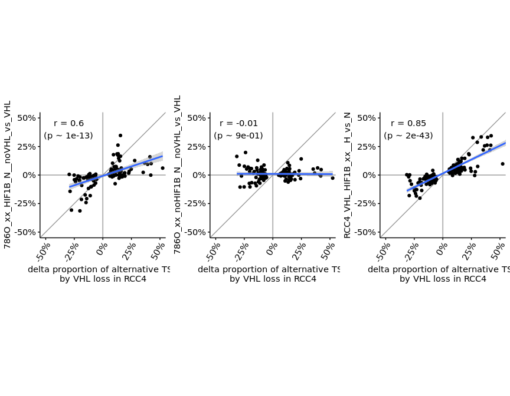

s9-2-1 Analysis of HIF dependent alternate TSS usage
================
Yoichiro Sugimoto
24 May, 2022

  - [Overview](#overview)
  - [Environment setup and data
    preprocessing](#environment-setup-and-data-preprocessing)
  - [Data import](#data-import)
  - [Comparisons of alternate TSS usage across
    conditions](#comparisons-of-alternate-tss-usage-across-conditions)
  - [Session information](#session-information)

# Overview

The changes in TSS usage of VHL dependent alternate TSS identified by
the comparisons of RCC4 versus RCC4 will be compared against the changes
in other comparisons to examine the mode of action.

# Environment setup and data preprocessing

``` r
## Specify the number of CPUs to be used
processors <- 8

## library("BiocParallel")
## register(MulticoreParam(processors))

temp <- sapply(list.files("../functions", full.names = TRUE), source)
source(file.path("../s6-differential-expression-and-tss-usage/functions/load_total_analysis_results.R"), chdir = TRUE)
```

    ## [1] "Sample file used: /camp/lab/ratcliffep/home/users/sugimoy/CAMP_HPC/projects/20211102_HP5_HIF_mTOR/data/sample_data/processed_sample_file.csv"
    ## [1] "The following R objects were exported: total.sample.dt, total.coldata.df, total.comparison.dt"
    ## [1] "Comparison information was loaded"
    ## [1] "/camp/lab/ratcliffep/home/users/sugimoy/CAMP_HPC/projects/20211102_HP5_HIF_mTOR/results"
    ## [1] "The following objects were loaded: tss.de.res.dt, tss.ratio.res.dt, diff.tss.res.dt"

``` r
s4.tss.dir <- file.path(results.dir, "s4-tss-definition-and-tx-assignment")
s4.3.tx.info.dir <- file.path(s4.tss.dir, "s4-3-transcript-info")
s4.3.1.tx.info.rcc4.dir <- file.path(s4.3.tx.info.dir, "s4-3-1-transcript-info-for-RCC4")

s9.dir <- file.path(results.dir, "s9-integrative-analysis")

sq.dir <- file.path(results.dir, "sq-for-publication")
source.data.dir <- file.path(sq.dir, "sq1-source-data")
source.data.by.panel.dir <- file.path(source.data.dir, "by_panel")

set.seed(0)
```

# Data import

``` r
rcc4.vhl.loss.comparison.name <- "RCC4_xx_HIF1B_N__noVHL_vs_VHL"

sl.tss.de.res.dt <- tss.de.res.dt[
    comparison_name == rcc4.vhl.loss.comparison.name
]

sl.tss.de.res.dt[, `:=`(
    meanNormCount_treated_gene_sum = sum(meanNormCount_treated),
    meanNormCount_base_gene_sum = sum(meanNormCount_base)
), by = gene_id]

sl.tss.ratio.res.dt <- tss.ratio.res.dt[
    comparison_name == rcc4.vhl.loss.comparison.name
]

sl.diff.tss.res.dt <- diff.tss.res.dt[
    comparison_name == rcc4.vhl.loss.comparison.name
]

setnames(
    sl.tss.de.res.dt,
    old = c("log2fc", "shrlog2fc", "padj"),
    new = c("de_log2fc", "de_shrlog2fc", "de_padj")
)

sl.tss.all.res.dt <- merge(
    sl.tss.ratio.res.dt[, .(
        tss_name, gene_id, gene_name, 
        gene_FDR, tx_FDR, padj,
        proportion_treated, proportion_base,
        treated_basename, base_basename
    )],
    sl.tss.de.res.dt[, .(
        tss_name, de_log2fc, de_shrlog2fc, de_padj,
        meanNormCount_treated, meanNormCount_base,
        meanNormCount_treated_gene_sum, meanNormCount_base_gene_sum
    )],
    by = "tss_name"
) %>%
    merge(
        y = sl.diff.tss.res.dt[, .(
            gene_id, biotype, 
            diff_tss_with_threshold, alt_tss_reg_mode,
            tss_name_base, tss_name_alternative, discordant_flag
        )],
        by = "gene_id"
    ) %>%
    merge(
        y = filtered.tss.with.quantile.dt[, .(tss_name, annot, chr, strand, q50)],
        by = "tss_name"
    )

sl.tss.all.res.dt <- sl.tss.all.res.dt[biotype == "protein_coding"]
sl.tss.de.res.dt <- sl.tss.de.res.dt[biotype == "protein_coding"]

print("The number of significant events")
```

    ## [1] "The number of significant events"

``` r
sl.tss.all.res.dt[!duplicated(gene_id), table(alt_tss_reg_mode)]
```

    ## alt_tss_reg_mode
    ## Down   Up 
    ##   64   85

``` r
print("Discordant regulation")
```

    ## [1] "Discordant regulation"

``` r
sl.tss.all.res.dt[!duplicated(gene_id), table(discordant_flag)]
```

    ## discordant_flag
    ## FALSE  TRUE 
    ##   140     9

``` r
sl.tss.all.res.dt[, `:=`(
    dProportion = proportion_treated - proportion_base,
    base_alt_TSS_flag = case_when(
        tss_name == tss_name_base ~ "base_TSS",
        tss_name == tss_name_alternative ~ "alternative_TSS",
        TRUE ~ NA_character_
    ) %>%
        factor(levels = c("base_TSS", "alternative_TSS"))
)]

fwrite(
    sl.tss.all.res.dt,
    file.path(
        s9.dir,
        "alternative-vs-base-TSS-expression-regulation.csv"
    )
)
```

# Comparisons of alternate TSS usage across conditions

``` r
tss.ratio.res.dt[, dProportion := proportion_treated - proportion_base]

base.comparison <- rcc4.vhl.loss.comparison.name

compared.comparisons <- c(
    "786O_xx_HIF1B_N__noVHL_vs_VHL",
    "786O_xx_noHIF1B_N__noVHL_vs_VHL",
    "RCC4_VHL_HIF1B_xx__H_vs_N"
)

base.tss.ratio.res.dt <- tss.ratio.res.dt[
    comparison_name == base.comparison &
    tss_name %in% sl.tss.all.res.dt[base_alt_TSS_flag == "alternative_TSS", tss_name]
]

setnames(
    base.tss.ratio.res.dt,
    old = "dProportion",
    new = "base_dProportion"
)

compared.tss.ratio.res.dt <- tss.ratio.res.dt[
    comparison_name %in% compared.comparisons &
    tss_name %in% diff.tss.res.dt[comparison_name == base.comparison, tss_name_alternative]
]

base.comp.tss.ratio.res.dt <- merge(
    compared.tss.ratio.res.dt,
    base.tss.ratio.res.dt[, .(tss_name, base_dProportion)],
    by = "tss_name"
)

base.comp.tss.ratio.res.dt[, `:=`(
    plot_label = factor(
        plot_label,
        levels = paste0(
            str_split_fixed(compared.comparisons, "__", n = 2)[, 1],
            "\n(",
            str_split_fixed(compared.comparisons, "__", n = 2)[, 2],
            ")"
        )
    ),
    comparison_base = factor(
        comparison_base,
        levels = c(
            "RCC4_VHL_HIF1B", "786O_HIF1B_N", "786O_VHL_HIF1B",
            "786O_noHIF1B_N", "786O_VHL_noHIF1B"
        )
    )
)]

cor.dt <- base.comp.tss.ratio.res.dt[, list(
    cor.coef = cor.test(
        base_dProportion, dProportion,
        method = "pearson",
        alternative = "two.sided"
    )$estimate %>% round(digits = 2),
    cor.pvalue = cor.test(
        base_dProportion, dProportion,
        method = "pearson",
        alternative = "two.sided"
    )$p.value,
    plot_label = plot_label,
    comparison_base = comparison_base,
    sample_number = .N
),
    by = comparison_name
][!duplicated(comparison_name)]

print(cor.dt[, .(plot_label, cor.coef, cor.pvalue, sample_number)])
```

    ##                           plot_label cor.coef   cor.pvalue sample_number
    ## 1:   786O_xx_HIF1B_N\n(noVHL_vs_VHL)     0.60 1.147978e-13           124
    ## 2: 786O_xx_noHIF1B_N\n(noVHL_vs_VHL)    -0.01 8.913691e-01           126
    ## 3:       RCC4_VHL_HIF1B_xx\n(H_vs_N)     0.85 2.212236e-43           148

``` r
plotAltBaseTssChange <- function(c.comparison, base.comp.tss.ratio.res.dt){

    g1 <- ggplot(
        data = base.comp.tss.ratio.res.dt[
            comparison_name == c.comparison
        ],
        aes(
            x = base_dProportion,
            y = dProportion
        )
    ) +
        geom_vline(xintercept = 0, color = "gray60") +
        geom_hline(yintercept = 0, color = "gray60") +
        geom_abline(slope = 1, intercept = 0, color = "gray60") +
        geom_point(size = 1.5) +
        geom_smooth(method = "lm") +
        geom_text(
            data = cor.dt[comparison_name == c.comparison],
            aes(label = paste0(
                    "r = ", cor.coef, "\n(p ~ ",
                    formatC(cor.pvalue, format = "e", digits = 0) ,")"
                )),
            x = -0.3, y = 0.4
        ) +
        theme(
            aspect.ratio = 1
        ) +
        coord_cartesian(xlim = c(-0.5, 0.5), ylim = c(-0.5, 0.5)) +
        xlab("delta proportion of alternative TSS\nby VHL loss in RCC4") +
        ylab(c.comparison) +
        scale_x_continuous(guide = guide_axis(angle = 60), labels = scales::percent_format(accuracy = 1)) +
        scale_y_continuous(labels = scales::percent_format(accuracy = 1))

    return(g1)
}

temp <- lapply(
    compared.comparisons,
    plotAltBaseTssChange,
    base.comp.tss.ratio.res.dt = base.comp.tss.ratio.res.dt
)

cowplot::plot_grid(plotlist = temp, nrow = 1)
```

    ## `geom_smooth()` using formula 'y ~ x'
    ## `geom_smooth()` using formula 'y ~ x'
    ## `geom_smooth()` using formula 'y ~ x'

<!-- -->

``` r
for.export.base.comp.tss.ratio.res.dt <- copy(base.comp.tss.ratio.res.dt)
for.export.base.comp.tss.ratio.res.dt[, `:=`(
    cell = gsub("_HIF1B_N$", "", comparison_base) %>%
        {gsub("_HIF1B$", "", .)} %>%
        {gsub("_N$", "", .)}
)]

temp <- exportSourceData(
    dt = for.export.base.comp.tss.ratio.res.dt[order(cell)],
    original.colnames = c("gene_id", "gene_name", "tss_name", "cell", "compared_elements", "dProportion", "base_dProportion"),
    export.colnames = c("gene_id", "gene_name", "alternate_tss_name", "cell", "comparison", "delta_roportion", "delta_proportion_RCC4"),
    export.file.name = "Extended Data Fig. 7.csv"
)
```

# Session information

``` r
sessionInfo()
```

    ## R version 4.0.0 (2020-04-24)
    ## Platform: x86_64-conda_cos6-linux-gnu (64-bit)
    ## Running under: CentOS Linux 7 (Core)
    ## 
    ## Matrix products: default
    ## BLAS/LAPACK: /camp/lab/ratcliffep/home/users/sugimoy/CAMP_HPC/software/miniconda3_20200606/envs/five_prime_seq_for_VHL_loss_v0.2.1/lib/libopenblasp-r0.3.10.so
    ## 
    ## locale:
    ##  [1] LC_CTYPE=en_GB.UTF-8       LC_NUMERIC=C              
    ##  [3] LC_TIME=en_GB.UTF-8        LC_COLLATE=en_GB.UTF-8    
    ##  [5] LC_MONETARY=en_GB.UTF-8    LC_MESSAGES=en_GB.UTF-8   
    ##  [7] LC_PAPER=en_GB.UTF-8       LC_NAME=C                 
    ##  [9] LC_ADDRESS=C               LC_TELEPHONE=C            
    ## [11] LC_MEASUREMENT=en_GB.UTF-8 LC_IDENTIFICATION=C       
    ## 
    ## attached base packages:
    ## [1] parallel  stats     graphics  grDevices utils     datasets  methods  
    ## [8] base     
    ## 
    ## other attached packages:
    ## [1] knitr_1.28        stringr_1.4.0     magrittr_1.5      data.table_1.12.8
    ## [5] dplyr_1.0.0       khroma_1.3.0      ggplot2_3.3.1     rmarkdown_2.2    
    ## 
    ## loaded via a namespace (and not attached):
    ##  [1] Rcpp_1.0.4.6     pillar_1.4.4     compiler_4.0.0   tools_4.0.0     
    ##  [5] digest_0.6.25    lattice_0.20-41  nlme_3.1-148     evaluate_0.14   
    ##  [9] lifecycle_0.2.0  tibble_3.0.1     gtable_0.3.0     mgcv_1.8-31     
    ## [13] pkgconfig_2.0.3  rlang_0.4.10     Matrix_1.2-18    yaml_2.2.1      
    ## [17] xfun_0.14        withr_2.4.1      generics_0.0.2   vctrs_0.3.1     
    ## [21] grid_4.0.0       tidyselect_1.1.0 cowplot_1.0.0    glue_1.4.1      
    ## [25] R6_2.4.1         farver_2.0.3     purrr_0.3.4      splines_4.0.0   
    ## [29] scales_1.1.1     ellipsis_0.3.1   htmltools_0.4.0  colorspace_1.4-1
    ## [33] labeling_0.3     stringi_1.4.6    munsell_0.5.0    crayon_1.3.4
