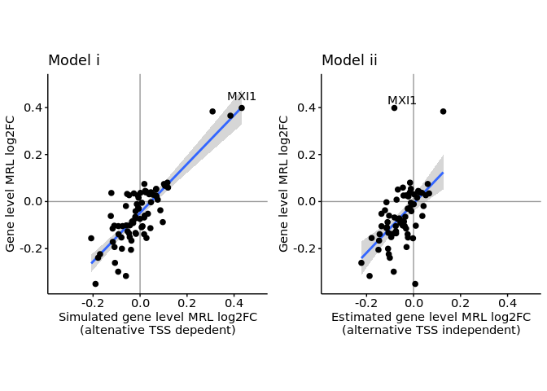
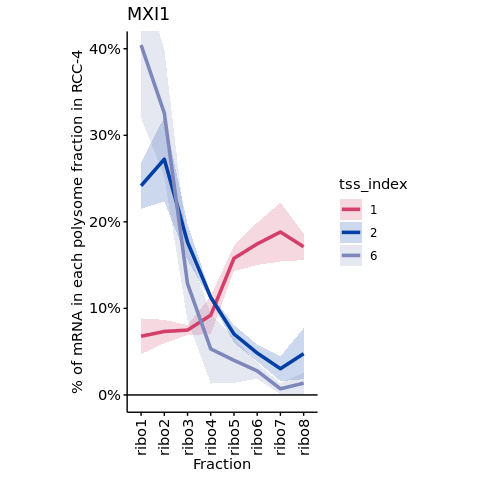
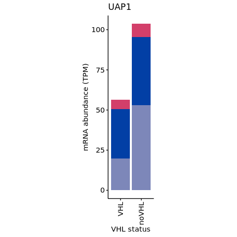
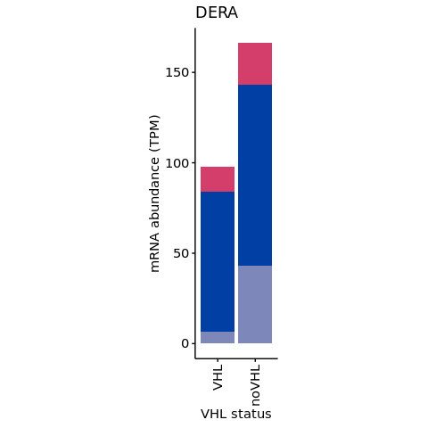

s9-2-2 The effect of alternate TSS usage on translation
================
Yoichiro Sugimoto
10 February, 2022

  - [Environment setup and data
    preprocessing](#environment-setup-and-data-preprocessing)
  - [Data preparation](#data-preparation)
      - [Data import](#data-import)
      - [TSS isoform annotation](#tss-isoform-annotation)
      - [Extract meta information for alternate and base
        TSS](#extract-meta-information-for-alternate-and-base-tss)
      - [Data for filtration](#data-for-filtration)
  - [Translational efficiency differences between alternate TSS isoforms
    against other isoforms of same
    gene](#translational-efficiency-differences-between-alternate-tss-isoforms-against-other-isoforms-of-same-gene)
      - [Calculate translational efficiency difference between alternate
        TSS vs all other
        TSS](#calculate-translational-efficiency-difference-between-alternate-tss-vs-all-other-tss)
      - [Data visualization](#data-visualization)
  - [Sequence features of alternate TSS for translationally upregulated
    genes vs downregulated
    genes](#sequence-features-of-alternate-tss-for-translationally-upregulated-genes-vs-downregulated-genes)
  - [Simulate MRL change with omitting a
    parameter](#simulate-mrl-change-with-omitting-a-parameter)
      - [Data export for publication](#data-export-for-publication)
      - [Simulation](#simulation)
      - [Plot range of gene level MRL log2
        FC](#plot-range-of-gene-level-mrl-log2-fc)
  - [Examples](#examples)
      - [Preprocess data for gene and TSS level
        analysis](#preprocess-data-for-gene-and-tss-level-analysis)
      - [Import TSS expression data](#import-tss-expression-data)
      - [Plot data for the selected
        examples](#plot-data-for-the-selected-examples)
      - [Plot examples](#plot-examples)
  - [Session information](#session-information)

# Environment setup and data preprocessing

``` r
## Specify the number of CPUs to be used
processors <- 8

## library("BiocParallel")
## register(MulticoreParam(processors))

temp <- sapply(list.files("../functions", full.names = TRUE), source)
temp <- sapply(list.files("./functions", full.names = TRUE), source)  
source(file.path("../s6-differential-expression-and-tss-usage/functions/load_total_analysis_results.R"), chdir = TRUE)
```

    ## [1] "Sample file used: /camp/lab/ratcliffep/home/users/sugimoy/CAMP_HPC/projects/20211102_HP5_HIF_mTOR/data/sample_data/processed_sample_file.csv"
    ## [1] "The following R objects were exported: total.sample.dt, total.coldata.df, total.comparison.dt"
    ## [1] "Comparison information was loaded"
    ## [1] "/camp/lab/ratcliffep/home/users/sugimoy/CAMP_HPC/projects/20211102_HP5_HIF_mTOR/results"
    ## [1] "The following objects were loaded: tss.de.res.dt, tss.ratio.res.dt, diff.tss.res.dt"

``` r
source(file.path("../s8-analysis-of-translation/functions/test_differential_translation-v2.R"))
```

    ## [1] "The following functions were exported: analyzeDtg(), subsetColdata()"

``` r
s4.tss.dir <- file.path(results.dir, "s4-tss-definition-and-tx-assignment")
s4.2.tx.assignment.dir <- file.path(s4.tss.dir, "s4-2-transcript-assignment")
s4.2.1.tss.tx.map.RCC4.dir <- file.path(s4.2.tx.assignment.dir, "s4-2-1-tss-transcript-mapping-RCC4")

s8.dir <- file.path(results.dir, "s8-analysis-of-translation")
s8.1.dir <- file.path(s8.dir, "s8-1-differentially-translated-mRNAs")
s8.1.1.dir <- file.path(s8.1.dir, "gene-level-dte")
s8.1.2.dir <- file.path(s8.1.dir, "tx-level-dte")
s8.2.dte.iso.dir <- file.path(s8.dir, "s8-2-differentially-translated-isoforms")
s8.3.dir <- file.path(s8.dir, "s8-3-validation-of-method")

s9.dir <- file.path(results.dir, "s9-integrative-analysis")

set.seed(0)
```

# Data preparation

## Data import

Alternate TSS usage data will be imported.

``` r
## Alternative TSS usage data of all alternative TSS genes
sl.tss.all.res.dt <- fread(
    file.path(
        s9.dir,
        "alternative-vs-base-TSS-expression-regulation.csv"
    )
)

## Translation change data of RCC4 VHL loss
## Tx level
dte.res.dt <- fread(
    file.path(
        s8.1.2.dir,
        "RCC4_xx_EIF4E2_yy_NA__noVHL_vs_VHL.csv"
    )
)
 
## Gene level
dte.gene.res.dt <- fread(
    file.path(
        s8.1.1.dir,
        "RCC4_xx_EIF4E2_yy_NA__noVHL_vs_VHL.csv"
    )
)

setnames(
    dte.gene.res.dt,
    old = c("MRL_log2fc", "MRL_treated", "MRL_base"),
    new = c("gene_MRL_log2fc", "gene_MRL_treated", "gene_MRL_base")
)


## Isoform dependent translation efficiency difference test
dte.iso.dt <- fread(
    file.path(
        s8.2.dte.iso.dir,
        "RCC4_noVHL_EIF4E2_NA.csv"
    )
)

setnames(
    dte.iso.dt,
    old = c("gene_FDR", "tx_FDR"),
    new = c("gene_FDR_for_isoDTE", "tx_FDR_for_isoDTE")
)

sl.tss.all.trsl.res.dt <- merge(
    sl.tss.all.res.dt,
    dte.gene.res.dt[, .(
        gene_id,
        padj_translation, translational_regulation,
        gene_MRL_log2fc, gene_MRL_treated, gene_MRL_base
    )],
    by = "gene_id"
) %>%
    merge(
        y = dte.res.dt[
            , .(tss_name, MRL_log2fc, MRL_treated, MRL_base)
        ],
        by = "tss_name"
    ) %>%
    merge(
        y = dte.iso.dt[!duplicated(gene_id), .(gene_id, gene_FDR_for_isoDTE)],
        all.x = TRUE,
        by = "gene_id"
    ) %>%
    merge(
        y = dte.iso.dt[, .(tss_name, tx_FDR_for_isoDTE)],
        all.x = TRUE,
        by = "tss_name"
    )


sl.tss.all.trsl.res.dt[, `:=`(
    proportion_treated_sum = sum(proportion_treated),
    proportion_base_sum = sum(proportion_base)
), by = gene_id]

sl.tss.all.trsl.res.dt[, `:=`(
    corrected_proportion_treated = proportion_treated / proportion_treated_sum,
    corrected_proportion_base = proportion_base / proportion_base_sum
)]

sl.tss.all.trsl.res.dt[, `:=`(
    dProportion = corrected_proportion_treated - corrected_proportion_base
)]

fwrite(
    sl.tss.all.trsl.res.dt,
    file.path(
        s9.dir,
        "VHL-dependent-alternate-TSS-and-translation-long.csv"
    )    
)
```

## TSS isoform annotation

``` r
## Tx annotation data
tss.tx.assignment.dt <- file.path(
    s4.2.1.tss.tx.map.RCC4.dir,
    "transcripts-per-TSS-for-RCC4.gtf"
) %>%
    {rtracklayer::import(.)} %>%
as.data.frame %>% data.table

tss.startcodon.dt <- tss.tx.assignment.dt[type == "CDS"][
  , list(
        start_codon_start = case_when(
            strand == "+" ~ min(start),
            strand == "-" ~ max(end)
        ),
        CDS_canonical
    ), by = tss_name][!duplicated(tss_name)]

tx.meta.info.dt <- file.path(
    s8.3.dir,
    "processed-tx-meta-info.csv"
) %>%
    fread %>%
{merge(tss.startcodon.dt, ., by = "tss_name", all = TRUE)}

meta.cols <- c(
    "start_codon_start", "CDS_canonical",
    "cds_len", "mean_utr5_len", "uORF_all", "TOP_motif_length"
)

tx.meta.info.dt <- tx.meta.info.dt[, c(
    "tss_name", meta.cols
), with = FALSE]
```

## Extract meta information for alternate and base TSS

``` r
alt.vs.base.dt <- sl.tss.all.trsl.res.dt[base_alt_TSS_flag != ""]

alt.vs.base.dt <- merge(
    alt.vs.base.dt,
    tx.meta.info.dt,
    by = "tss_name",
    all.x = TRUE
)

d.alt.vs.base.dt <- dcast(
    alt.vs.base.dt,
    gene_id + strand ~ base_alt_TSS_flag,
    value.var = c("MRL_treated", "MRL_base", "q50", meta.cols)
)

d.alt.vs.base.dt[, `:=`(
    MRL_log2fc_alt_vs_base = log2(
        MRL_treated_alternative_TSS / MRL_treated_base_TSS
    ),
    d_utr5_len = mean_utr5_len_alternative_TSS - mean_utr5_len_base_TSS,
    d_uORF = uORF_all_alternative_TSS - uORF_all_base_TSS,
    base_vs_alternate_CDS = case_when(
        start_codon_start_alternative_TSS != start_codon_start_base_TSS ~
            "Different",
        start_codon_start_alternative_TSS == start_codon_start_base_TSS ~
            "Same"
    )
)]

d.alt.vs.base.dt <- d.alt.vs.base.dt[, .(
    gene_id, base_vs_alternate_CDS, d_utr5_len, d_uORF
)]
```

## Data for filtration

``` r
all.filtered.tss.dt <- fread(
    file.path(
        s8.3.dir,
        "filtered_tss_for_polysome_analysis.csv"
    )
)
```

# Translational efficiency differences between alternate TSS isoforms against other isoforms of same gene

``` r
alt.tss.res.dt <- sl.tss.all.trsl.res.dt[base_alt_TSS_flag == "alternative_TSS"]
alt.tss.res.dt[, `:=`(
    alt_TSS_diff_poly = if_else(
        gene_FDR_for_isoDTE < 0.1 & tx_FDR_for_isoDTE < 0.1,
        true = "Different", false = "Not different",
        missing = "Not different"
    )
)]

alt.tss.res.dt <- merge(
    alt.tss.res.dt,
    d.alt.vs.base.dt,
    by = "gene_id",
    all.x = TRUE
)

print(paste0(
    "The number of alternative TSS genes before filteration: ",
    nrow(alt.tss.res.dt)
))
```

    ## [1] "The number of alternative TSS genes before filteration: 149"

``` r
print("Differentially CDS isoforms (between alternate TSS and base TSS isoforms)")
```

    ## [1] "Differentially CDS isoforms (between alternate TSS and base TSS isoforms)"

``` r
alt.tss.res.dt[, table(base_vs_alternate_CDS, useNA = "always")] %T>%
    print %>%
    {prop.table(.[!is.na(names(.))])} %>%
    round(digits = 2)
```

    ## base_vs_alternate_CDS
    ## Different      Same      <NA> 
    ##        65        60        24

    ## base_vs_alternate_CDS
    ## Different      Same 
    ##      0.52      0.48

``` r
print("The number of genes after filtration for translational efficiency analysis:")
```

    ## [1] "The number of genes after filtration for translational efficiency analysis:"

``` r
alt.tss.res.dt <- alt.tss.res.dt[
    tss_name %in% all.filtered.tss.dt[RCC4_noVHL_NA == TRUE, tss_name]
] %T>% {print(nrow(.))}
```

    ## [1] 117

``` r
print("The number and proportion of genes where the alternate TSS mRNA isoforms had different polysome distribution compared to other isoforms of same gene")
```

    ## [1] "The number and proportion of genes where the alternate TSS mRNA isoforms had different polysome distribution compared to other isoforms of same gene"

``` r
alt.tss.res.dt[, table(alt_TSS_diff_poly)] %T>%
    print %>%
    prop.table %>%
    round(digit = 2)
```

    ## alt_TSS_diff_poly
    ##     Different Not different 
    ##            75            42

    ## alt_TSS_diff_poly
    ##     Different Not different 
    ##          0.64          0.36

## Calculate translational efficiency difference between alternate TSS vs all other TSS

``` r
## From here MRL of isoforms from alternate TSS and other isoforms will be calculated
normalized.polysome.count.dt <- file.path(
    s8.1.2.dir, "RCC4_xx_EIF4E2_yy_NA__noVHL_vs_VHL-normalized_count.csv"
) %>%
    fread

ref.column.name <- "tss_name"
base.input.names <- c("RCC4_noVHL", "RCC4_VHL")

sample.colnames <- grep("^RCC4", colnames(normalized.polysome.count.dt), value = TRUE)
normalized.polysome.count.dt <- normalized.polysome.count.dt[
  , c(ref.column.name, sample.colnames), with = FALSE
]

## Classify alternate vs other TSS
normalized.polysome.count.dt <- normalized.polysome.count.dt[
    tss_name %in% sl.tss.all.res.dt[, tss_name]
]

normalized.polysome.count.dt[, `:=`(
    gene_id = str_split_fixed(tss_name, "_", 2)[, 1],
    alt_tss_flag =
        tss_name %in% sl.tss.all.res.dt[
                          base_alt_TSS_flag == "alternative_TSS", tss_name
                      ]
)]

normalized.polysome.count.dt[, `:=`(
    tss_name = if_else(
        alt_tss_flag == TRUE, paste0(gene_id, "_alternate"), paste0(gene_id, "_others")
    ),
    gene_id = NULL,
    alt_tss_flag = NULL
)]

cl.normalized.polysome.count.dt <- normalized.polysome.count.dt[
    , lapply(.SD, sum), by = tss_name,
    .SDcols = sample.colnames
]

sl.ribo.sample.groups <- grep(
    "ribo1", sample.colnames, value = TRUE
) %>%
    gsub("ribo1", "ribo[[:digit:]]$", .)

mrl.count.dt <- calculateWeightedMRL(
    normalized.polysome.count.dt = cl.normalized.polysome.count.dt,
    sl.ribo.sample.groups = sl.ribo.sample.groups,
    ref.column.name = ref.column.name
)

mrl.count4export.dt <- calcMrlStat(
    mrl.count.dt = mrl.count.dt,
    annot.df = mrl.count.dt[, "tss_name", with = FALSE],
    ref.column.name = ref.column.name,
    base.input.names = base.input.names
)

mrl.count4export.dt[, `:=`(
    gene_id = str_split_fixed(tss_name, "_", n = 2)[, 1],
    tss_group = str_split_fixed(tss_name, "_", n = 2)[, 2]
)]

bin.mrl.alt.other.dt <- dcast(
    mrl.count4export.dt,
    gene_id ~ tss_group,
    value.var = "MRL_treated"
)

bin.mrl.alt.other.dt[, MRL_log2fc_alt_others := log2(alternate / others)]

bin.mrl.alt.other.dt <- merge(
    alt.tss.res.dt[, .(
        gene_id, gene_name, alt_TSS_diff_poly,
        dProportion, alt_tss_reg_mode,
        base_vs_alternate_CDS, d_utr5_len, d_uORF
    )],
    bin.mrl.alt.other.dt,
    by = "gene_id"
) %>% {
    .[order(
        alt_tss_reg_mode,
        if_else(
            alt_tss_reg_mode == "Up",
            MRL_log2fc_alt_others, -MRL_log2fc_alt_others
        )
    )][, `:=`(
         gene_name = factor(gene_name, levels = gene_name),
         alt_tss_reg_mode = factor(alt_tss_reg_mode, levels = c("Up", "Down"))
     )]
}
```

## Data visualization

``` r
ggplot(
    data = bin.mrl.alt.other.dt,
    aes(
        y = gene_name,
        x = MRL_log2fc_alt_others,
        color = alt_TSS_diff_poly
    )
) +
    geom_vline(xintercept = 0, color = "gray60") +
    geom_point(
        aes(
            size = abs(dProportion)
        )
    ) +
    scale_y_discrete(expand = expansion(mult = c(0.04))) +
    scale_color_manual(values = c(
                           "Different" = "black",
                           "Not different" = "gray60"
                       )) +
    facet_grid(alt_tss_reg_mode ~ ., scales = "free_y", space = "free_y") +
    theme_bw(12) +
    theme(
        legend.box = "vertical"
    ) +
    guides(
        size = guide_legend(
            title = "d% of alternate TSS usage\nupon VHL loss"
        ),
        color = guide_legend(
            title = "Diff. polysome distribution"
        )
    ) +
    ylab("Gene name") +
    xlab("MRL log2 fold change (alternate TSS mRNA isoform / other TSS mRNA isoform")
```

<!-- -->

# Sequence features of alternate TSS for translationally upregulated genes vs downregulated genes

UTR5\_len = ifelse(d\_utr5\_len \> 0, “longer”, “shorter”)

``` r
library("ggrepel")

## uORF
uORF.count.dt <- bin.mrl.alt.other.dt[
    alt_TSS_diff_poly == "Different",
    .N,
    by = list(
        dMRL = ifelse(
            MRL_log2fc_alt_others > 0,
            "alternative TSS\n> base TSS",
            "alternative TSS\n< base TSS"
        ),
        uORF_num = case_when(
            d_uORF > 0 ~ "alternative TSS\n> base TSS",
            d_uORF == 0 ~ "alternative TSS\n= base TSS",
                d_uORF < 0 ~ "alternative TSS\n< base TSS"
        )
    )
][order(dMRL, uORF_num)] %T>%
    {print(copy(.)[, class_sum := sum(N), by = dMRL])}
```

    ##                           dMRL                    uORF_num  N class_sum
    ## 1: alternative TSS\n< base TSS alternative TSS\n< base TSS  5        42
    ## 2: alternative TSS\n< base TSS alternative TSS\n= base TSS  4        42
    ## 3: alternative TSS\n< base TSS alternative TSS\n> base TSS 11        42
    ## 4: alternative TSS\n< base TSS                        <NA> 22        42
    ## 5: alternative TSS\n> base TSS alternative TSS\n< base TSS 10        33
    ## 6: alternative TSS\n> base TSS alternative TSS\n= base TSS  9        33
    ## 7: alternative TSS\n> base TSS alternative TSS\n> base TSS  3        33
    ## 8: alternative TSS\n> base TSS                        <NA> 11        33

``` r
uORF.count.dt <- uORF.count.dt[!is.na(uORF_num)]

uORF.count.dt[, class_sum := sum(N), by = dMRL]
uORF.count.dt[, proportion := N/class_sum]
print(uORF.count.dt)
```

    ##                           dMRL                    uORF_num  N class_sum
    ## 1: alternative TSS\n< base TSS alternative TSS\n< base TSS  5        20
    ## 2: alternative TSS\n< base TSS alternative TSS\n= base TSS  4        20
    ## 3: alternative TSS\n< base TSS alternative TSS\n> base TSS 11        20
    ## 4: alternative TSS\n> base TSS alternative TSS\n< base TSS 10        22
    ## 5: alternative TSS\n> base TSS alternative TSS\n= base TSS  9        22
    ## 6: alternative TSS\n> base TSS alternative TSS\n> base TSS  3        22
    ##    proportion
    ## 1:  0.2500000
    ## 2:  0.2000000
    ## 3:  0.5500000
    ## 4:  0.4545455
    ## 5:  0.4090909
    ## 6:  0.1363636

``` r
ggplot(
    data = uORF.count.dt,
    aes(
        x = uORF_num,
        y = dMRL
    )
) +
    geom_point(
        aes(
            size = proportion
        )
    ) +
    geom_text_repel(
        aes(label = paste0(round(proportion * 100), "%")),
        nudge_x = 0,
        nudge_y = -0.5,
        min.segment.length = Inf
    ) +
    ## scale_color_manual(values = go.annot.colors, guide = "none") +
    scale_size_area(max_size = 15) +
    scale_x_discrete(guide = guide_axis(angle = 90)) +
    theme(
        aspect.ratio = 1/2,
        legend.position = "none"
    ) +
    xlab("uORF number") +
    ylab("dMRL") +
    expand_limits(y = c(0, 1.25))
```

<!-- -->

``` r
## utr5_len
utr5_len.count.dt <- bin.mrl.alt.other.dt[
    alt_TSS_diff_poly == "Different",
    .N,
    by = list(
        dMRL = ifelse(
            MRL_log2fc_alt_others > 0,
            "alternative TSS\n> base TSS",
            "alternative TSS\n< base TSS"
        ),
        utr5_len_num = case_when(
            d_utr5_len > 0 ~ "alternative TSS\n> base TSS",
            d_utr5_len == 0 ~ "alternative TSS\n= base TSS",
            d_utr5_len < 0 ~ "alternative TSS\n< base TSS"
        )
    )
][order(dMRL, utr5_len_num)] %T>%
    {print(copy(.)[, class_sum := sum(N), by = dMRL])}
```

    ##                           dMRL                utr5_len_num  N class_sum
    ## 1: alternative TSS\n< base TSS alternative TSS\n< base TSS  8        42
    ## 2: alternative TSS\n< base TSS alternative TSS\n> base TSS 12        42
    ## 3: alternative TSS\n< base TSS                        <NA> 22        42
    ## 4: alternative TSS\n> base TSS alternative TSS\n< base TSS 14        33
    ## 5: alternative TSS\n> base TSS alternative TSS\n> base TSS  8        33
    ## 6: alternative TSS\n> base TSS                        <NA> 11        33

``` r
utr5_len.count.dt <- utr5_len.count.dt[!is.na(utr5_len_num)]

utr5_len.count.dt[, class_sum := sum(N), by = dMRL]
utr5_len.count.dt[, proportion := N/class_sum]
print(utr5_len.count.dt)
```

    ##                           dMRL                utr5_len_num  N class_sum
    ## 1: alternative TSS\n< base TSS alternative TSS\n< base TSS  8        20
    ## 2: alternative TSS\n< base TSS alternative TSS\n> base TSS 12        20
    ## 3: alternative TSS\n> base TSS alternative TSS\n< base TSS 14        22
    ## 4: alternative TSS\n> base TSS alternative TSS\n> base TSS  8        22
    ##    proportion
    ## 1:  0.4000000
    ## 2:  0.6000000
    ## 3:  0.6363636
    ## 4:  0.3636364

``` r
ggplot(
    data = utr5_len.count.dt,
    aes(
        x = utr5_len_num,
        y = dMRL
    )
) +
    geom_point(
        aes(
            size = proportion
        )
    ) +
    geom_text_repel(
        aes(label = paste0(round(proportion * 100), "%")),
        nudge_x = 0,
        nudge_y = -0.5,
        min.segment.length = Inf
    ) +
    ## scale_color_manual(values = go.annot.colors, guide = "none") +
    scale_size_area(max_size = 15) +
    scale_x_discrete(guide = guide_axis(angle = 90)) +
    theme(
        aspect.ratio = 1/2,
        legend.position = "none"
    ) +
    xlab("5' UTR length") +
    ylab("dMRL") +
    expand_limits(y = c(0, 1.25))
```

<!-- -->

# Simulate MRL change with omitting a parameter

Only genes with alternate TSS mRNA isoforms whose polysome distribution
was significantly different from that of other isoforms from the same
genes (FDR \< 0.1) were analysed.

Two models will be considered here:

1.  Omitting MRL change in each mRNA isoform
2.  Omitting mRNA abundance change in each mRNA isoform

<!-- end list -->

``` r
sl.tss.all.trsl.res.dt[, `:=`(
    ## Upon VHL loss
    mean_MRL = rowMeans(cbind(
        MRL_treated, MRL_base
    ), na.rm = TRUE),
    mean_proportion = rowMeans(cbind(
        corrected_proportion_treated, corrected_proportion_base
    ), na.rm = TRUE),
    alt_TSS_diff_trsl =
        gene_id %in%
        alt.tss.res.dt[alt_TSS_diff_poly == "Different", gene_id]
)]


## Calculate necessary values
sl.tss.all.trsl.res.dt[, `:=`(
    ## Upon VHL loss
    ## Model 1
    dMRL_alt_TSS_dep_noVHL = mean_MRL * proportion_treated,
    dMRL_alt_TSS_dep_VHL = mean_MRL * proportion_base,
    ## Model 2
    dMRL_alt_TSS_indep_noVHL = MRL_treated * mean_proportion,
    dMRL_alt_TSS_indep_VHL = MRL_base * mean_proportion
)]
```

## Data export for publication

``` r
for.export.dt <- merge(
    sl.tss.all.trsl.res.dt,
    d.alt.vs.base.dt[, .(gene_id, base_vs_alternate_CDS)],
    by = "gene_id",
    all.x = TRUE
) %>% {.[, .(
           tss_name,
           alt_tss_reg_mode, 
           base_alt_TSS_flag,
           base_vs_alternate_CDS,
           de_log2fc,
           tx_FDR,                         
           corrected_proportion_base, corrected_proportion_treated,
           dProportion,
           meanNormCount_base, meanNormCount_treated,
           alt_TSS_diff_trsl,
           gene_FDR_for_isoDTE, tx_FDR_for_isoDTE,
           gene_MRL_log2fc, MRL_log2fc, MRL_base, MRL_treated
       )]}

for.export.dt <- merge(
    filtered.tss.with.quantile.dt[, .(
        tss_name, gene_id, gene_name,
        chr, strand, start, end 
    )],
    for.export.dt,
    by = "tss_name"
)

for.export.dt[, `:=`(
    base_alt_TSS_flag = case_when(
        base_alt_TSS_flag == "alternative_TSS" ~ "alternate_TSS",
        base_alt_TSS_flag == "base_TSS" ~ "base_TSS",
        TRUE ~ base_alt_TSS_flag
    )
)]

for.export.dt <- for.export.dt[order(
    - alt_tss_reg_mode,
    - alt_TSS_diff_trsl,
    - gene_MRL_log2fc
)]

for.export.dt[
  , alt_TSS_diff_trsl := case_when(
        gene_id %in% alt.tss.res.dt[, gene_id] ~ alt_TSS_diff_trsl
        ## Genes with too little alternate TSS expression for robust MRL calculation will be ignored
    )
]

for.export.dt <- for.export.dt[, .(
    gene_id, gene_name,
    tss_name,
    chr, strand, start, end,
    base_alt_TSS_flag,
    base_vs_alternate_CDS,
    de_log2fc,
    tx_FDR,                         
    corrected_proportion_base, corrected_proportion_treated,
    dProportion,
    meanNormCount_base, meanNormCount_treated,
    gene_MRL_log2fc, MRL_log2fc, MRL_base, MRL_treated,
    alt_TSS_diff_trsl,
    gene_FDR_for_isoDTE, tx_FDR_for_isoDTE
)]

setnames(
    for.export.dt,
    old = c(
        "chr", "base_alt_TSS_flag",
        "base_vs_alternate_CDS",
        "de_log2fc",
        "tx_FDR",
        "corrected_proportion_base", "corrected_proportion_treated", "dProportion",
        "meanNormCount_base", "meanNormCount_treated",
        "alt_TSS_diff_trsl",
        "gene_FDR_for_isoDTE", "tx_FDR_for_isoDTE",
        "gene_MRL_log2fc", "MRL_log2fc",
        "MRL_base", "MRL_treated"
    ),
    new = c(
        "chromosome", "TSS class",
        "CDS of alternate TSS vs CDS of base TSS",
        "mRNA log2FC",
        "FDR (TSS usage change)",
        "TSS usage (RCC4 VHL)", "TSS usage (RCC4)", "delta TSS usage",
        "TPM (RCC4 VHL)", "TPM (RCC4)",
        "class (isoform dependent polysome distribution diff.)",
        "FDR (gene level)",
        "FDR (isoform level)",
        "MRL log2FC (gene level)", "MRL log2FC (isoform level)",
        "MRL (RCC4 VHL)", "MRL (RCC4)"
    )
)

fwrite(
    for.export.dt,
    file.path(
        s9.dir, "alteranate_TSS_and_translation_in_RCC4.csv"
    )
)
```

## Simulation

``` r
## The analysis will be performed for genes with an alternate TSS isoform differentially translated compared to other isoforms of the same gene
sl.tss.all.trsl.res.dt <- sl.tss.all.trsl.res.dt[alt_TSS_diff_trsl == TRUE]

print("Confirmation")
```

    ## [1] "Confirmation"

``` r
sl.tss.all.trsl.res.dt[, .(
    tss_name, gene_name,
    gene_MRL_log2fc, mean_MRL, mean_proportion
)] %>%
    {.[!complete.cases(.)]}
```

    ## Empty data.table (0 rows and 5 cols): tss_name,gene_name,gene_MRL_log2fc,mean_MRL,mean_proportion

``` r
measured.vs.estimated.dt <- sl.tss.all.trsl.res.dt[
    ,
    list(
        gene_name,
        gene_MRL_log2fc,        
        ## For VHL loss
        simulated_gene_MRL_alt_TSS_dep_noVHL = sum(dMRL_alt_TSS_dep_noVHL),
        simulated_gene_MRL_alt_TSS_dep_VHL = sum(dMRL_alt_TSS_dep_VHL),
        simulated_gene_MRL_alt_TSS_indep_noVHL = sum(dMRL_alt_TSS_indep_noVHL),
        simulated_gene_MRL_alt_TSS_indep_VHL = sum(dMRL_alt_TSS_indep_VHL)
    ),
    by = gene_id
][!duplicated(gene_id)]

measured.vs.estimated.dt[, `:=`(
    simulated_gene_MRL_log2fc_alt_TSS_dep = log2(
        simulated_gene_MRL_alt_TSS_dep_noVHL / simulated_gene_MRL_alt_TSS_dep_VHL
    ),
    simulated_gene_MRL_log2fc_alt_TSS_indep = log2(
        simulated_gene_MRL_alt_TSS_indep_noVHL / simulated_gene_MRL_alt_TSS_indep_VHL
    )
)]

vhl.loss.lim.range <- c(-0.35, 0.5)

g1 <- ggplot(
    data = measured.vs.estimated.dt,
    aes(
        x = simulated_gene_MRL_log2fc_alt_TSS_dep,
        y = gene_MRL_log2fc,
    )
) +
    geom_vline(xintercept = 0, color = "gray60") +
    geom_hline(yintercept = 0, color = "gray60") +
    geom_smooth(method = "lm") +
    geom_point(size = 2) +
    ggrepel::geom_text_repel(aes(
                 label = ifelse(gene_name == "MXI1", gene_name, NA)
             ), direction = "y", nudge_y = 0.05, min.segment.length = 10) +
    theme(aspect.ratio = 1) +
    coord_cartesian(xlim = vhl.loss.lim.range, ylim = vhl.loss.lim.range) +
    xlab("Simulated gene level MRL log2FC\n(altenative TSS depedent)") +
    ylab("Gene level MRL log2FC") +
    ggtitle("Model i")

g2 <- ggplot(
    data = measured.vs.estimated.dt,
    aes(
        x = simulated_gene_MRL_log2fc_alt_TSS_indep,
        y = gene_MRL_log2fc,
    )
) +
    geom_vline(xintercept = 0, color = "gray60") +
    geom_hline(yintercept = 0, color = "gray60") +
    geom_smooth(method = "lm") +
    geom_point(size = 2) +
    ggrepel::geom_text_repel(aes(
                 label = ifelse(gene_name == "MXI1", gene_name, NA)
             )) +
    theme(aspect.ratio = 1) +
    coord_cartesian(xlim = vhl.loss.lim.range, ylim = vhl.loss.lim.range) +
    xlab("Estimated gene level MRL log2FC\n(alternative TSS independent)") +
    ylab("Gene level MRL log2FC") +
    ggtitle("Model ii")

cowplot::plot_grid(g1, g2)
```

    ## `geom_smooth()` using formula 'y ~ x'

    ## Warning: Removed 74 rows containing missing values (geom_text_repel).

    ## `geom_smooth()` using formula 'y ~ x'

    ## Warning: Removed 5 rows containing non-finite values (stat_smooth).

    ## Warning: Removed 5 rows containing missing values (geom_point).

    ## Warning: Removed 74 rows containing missing values (geom_text_repel).

<!-- -->

``` r
print("The number of genes analysed for model i")
```

    ## [1] "The number of genes analysed for model i"

``` r
measured.vs.estimated.dt[
  , .(simulated_gene_MRL_log2fc_alt_TSS_dep, gene_MRL_log2fc)
] %>% {nrow(.[complete.cases(.)])}
```

    ## [1] 75

``` r
measured.vs.estimated.dt %$%
    cor.test(
        x = simulated_gene_MRL_log2fc_alt_TSS_dep,
        y = gene_MRL_log2fc,
        method = "pearson",
        alternative = "two.sided"
    )
```

    ## 
    ##  Pearson's product-moment correlation
    ## 
    ## data:  simulated_gene_MRL_log2fc_alt_TSS_dep and gene_MRL_log2fc
    ## t = 12.688, df = 73, p-value < 2.2e-16
    ## alternative hypothesis: true correlation is not equal to 0
    ## 95 percent confidence interval:
    ##  0.7422396 0.8890586
    ## sample estimates:
    ##       cor 
    ## 0.8294691

``` r
print("The number of genes analysed for model ii")
```

    ## [1] "The number of genes analysed for model ii"

``` r
measured.vs.estimated.dt[
  , .(simulated_gene_MRL_log2fc_alt_TSS_indep, gene_MRL_log2fc)
] %>% {nrow(.[complete.cases(.)])}
```

    ## [1] 70

``` r
measured.vs.estimated.dt %$%
    cor.test(
        x = simulated_gene_MRL_log2fc_alt_TSS_indep,
        y = gene_MRL_log2fc,
        method = "pearson",
        alternative = "two.sided"
    )
```

    ## 
    ##  Pearson's product-moment correlation
    ## 
    ## data:  simulated_gene_MRL_log2fc_alt_TSS_indep and gene_MRL_log2fc
    ## t = 5.3558, df = 68, p-value = 1.09e-06
    ## alternative hypothesis: true correlation is not equal to 0
    ## 95 percent confidence interval:
    ##  0.3551665 0.6911944
    ## sample estimates:
    ##      cor 
    ## 0.544684

``` r
cocor::cocor(
           formula = ~ gene_MRL_log2fc + simulated_gene_MRL_log2fc_alt_TSS_indep |
               gene_MRL_log2fc + simulated_gene_MRL_log2fc_alt_TSS_dep,
           data = measured.vs.estimated.dt,
           alternative = "two.sided",
           test = "williams1959"
       )
```

    ## 
    ##   Results of a comparison of two overlapping correlations based on dependent groups
    ## 
    ## Comparison between r.jk (gene_MRL_log2fc, simulated_gene_MRL_log2fc_alt_TSS_indep) = 0.5447 and r.jh (gene_MRL_log2fc, simulated_gene_MRL_log2fc_alt_TSS_dep) = 0.8
    ## Difference: r.jk - r.jh = -0.2553
    ## Related correlation: r.kh = 0.0729
    ## Data: measured.vs.estimated.dt: j = gene_MRL_log2fc, k = simulated_gene_MRL_log2fc_alt_TSS_indep, h = simulated_gene_MRL_log2fc_alt_TSS_dep
    ## Group size: n = 70
    ## Null hypothesis: r.jk is equal to r.jh
    ## Alternative hypothesis: r.jk is not equal to r.jh (two-sided)
    ## Alpha: 0.05
    ## 
    ## williams1959: Williams' t (1959)
    ##   t = -2.8114, df = 67, p-value = 0.0065
    ##   Null hypothesis rejected

## Plot range of gene level MRL log2 FC

``` r
all.filtered.gene.dt <- fread(
    file.path(
        s8.3.dir,
        "filtered_gene_for_polysome_analysis.csv"
    )
)

dte.gene.res.dt[
    gene_id %in% all.filtered.gene.dt[
                      RCC4_noVHL_NA == TRUE & RCC4_VHL_NA == TRUE,
                      gene_id
                  ]
] %>%
    ggplot(
        aes(
            x = gene_MRL_log2fc,
            y = stat(count / sum(count))
        )
    ) +
    geom_vline(xintercept = 0, color = "gray60") +
    geom_histogram(
        binwidth = 0.025
    ) +
    coord_flip(xlim = vhl.loss.lim.range) +
    theme(
        aspect.ratio = 4
    ) +
    scale_y_continuous(labels = scales::percent_format(accuracy = 1)) +
    ylab("Proportion") +
    xlab("MRL log2 fold change upon VHL loss")
```

    ## Warning: Removed 4 rows containing non-finite values (stat_bin).

<!-- -->

# Examples

The following genes are candidate of interesting examples.

``` r
measured.vs.estimated.dt[order(gene_MRL_log2fc)][
  , .(gene_id, gene_name, gene_MRL_log2fc, simulated_gene_MRL_log2fc_alt_TSS_dep)
] %>% slice_max(gene_MRL_log2fc, n = 15)
```

    ##             gene_id gene_name gene_MRL_log2fc
    ##  1: ENSG00000119950      MXI1      0.39799207
    ##  2: ENSG00000124116     WFDC3      0.38316097
    ##  3: ENSG00000069667      RORA      0.36508677
    ##  4: ENSG00000213625    LEPROT      0.08042369
    ##  5: ENSG00000185187    SIGIRR      0.07488427
    ##  6: ENSG00000171703     TCEA2      0.07461482
    ##  7: ENSG00000109794   FAM149A      0.06725542
    ##  8: ENSG00000181458   TMEM45A      0.05948671
    ##  9: ENSG00000160972  PPP1R16A      0.05426869
    ## 10: ENSG00000147601     TERF1      0.05104341
    ## 11: ENSG00000186918    ZNF395      0.04525139
    ## 12: ENSG00000101255     TRIB3      0.04299649
    ## 13: ENSG00000104723     TUSC3      0.03961246
    ## 14: ENSG00000180992    MRPL14      0.03903721
    ## 15: ENSG00000105518   TMEM205      0.03693868
    ##     simulated_gene_MRL_log2fc_alt_TSS_dep
    ##  1:                           0.432631569
    ##  2:                           0.308561171
    ##  3:                           0.384577250
    ##  4:                           0.116373171
    ##  5:                           0.018274172
    ##  6:                           0.101854274
    ##  7:                           0.105941313
    ##  8:                           0.118949371
    ##  9:                           0.068726153
    ## 10:                           0.067665935
    ## 11:                           0.021688316
    ## 12:                           0.025561920
    ## 13:                           0.046007833
    ## 14:                           0.024506094
    ## 15:                           0.001630542

``` r
measured.vs.estimated.dt[order(gene_MRL_log2fc)][
  , .(gene_id, gene_name, gene_MRL_log2fc, simulated_gene_MRL_log2fc_alt_TSS_dep)
] %>% slice_min(gene_MRL_log2fc, n = 15)
```

    ##             gene_id gene_name gene_MRL_log2fc
    ##  1: ENSG00000157240      FZD1      -0.3501599
    ##  2: ENSG00000130810      PPAN      -0.3163398
    ##  3: ENSG00000196305     IARS1      -0.2981772
    ##  4: ENSG00000108963      DPH1      -0.2606048
    ##  5: ENSG00000061656     SPAG4      -0.2391029
    ##  6: ENSG00000145014    TMEM44      -0.2236591
    ##  7: ENSG00000156113    KCNMA1      -0.2050631
    ##  8: ENSG00000110435      PDHX      -0.2005365
    ##  9: ENSG00000111880     RNGTT      -0.1933481
    ## 10: ENSG00000137135  ARHGEF39      -0.1716565
    ## 11: ENSG00000153066   TXNDC11      -0.1660380
    ## 12: ENSG00000143248      RGS5      -0.1560906
    ## 13: ENSG00000140694      PARN      -0.1548473
    ## 14: ENSG00000115363     EVA1A      -0.1526994
    ## 15: ENSG00000170231     FABP6      -0.1511630
    ##     simulated_gene_MRL_log2fc_alt_TSS_dep
    ##  1:                           -0.18956816
    ##  2:                           -0.06016121
    ##  3:                           -0.09308076
    ##  4:                           -0.10673604
    ##  5:                           -0.17855509
    ##  6:                           -0.17029968
    ##  7:                           -0.03853995
    ##  8:                           -0.07724793
    ##  9:                           -0.10870378
    ## 10:                           -0.11613373
    ## 11:                           -0.03672298
    ## 12:                           -0.20791373
    ## 13:                            0.02714386
    ## 14:                           -0.07930509
    ## 15:                           -0.04389502

## Preprocess data for gene and TSS level analysis

``` r
## Gene level data
count.per.fraction.dt <- fread(file.path(
    s8.1.1.dir,
    "RCC4_xx_EIF4E2_yy_NA__noVHL_vs_VHL-normalized_count.csv"
))

m.count.per.fraction.dt <- proportionPerFraction(
    count.per.fraction.dt = count.per.fraction.dt,
    ref.col = "gene_id",
    data.col.grep = "^RCC4"
)

## TSS level data
tss.count.per.fraction.dt <- fread(file.path(
    s8.1.2.dir,
    "RCC4_xx_EIF4E2_yy_NA__noVHL_vs_VHL-normalized_count.csv"
))

m.tss.count.per.fraction.dt <- proportionPerFraction(
    count.per.fraction.dt = tss.count.per.fraction.dt,
    ref.col = "tss_name",
    data.col.grep = "^RCC4"
)
```

## Import TSS expression data

``` r
total.rcc4.vhl.loss.comp.name <- "RCC4_xx_HIF1B_N__noVHL_vs_VHL"
rcc4.tss.de.res.dt <- tss.de.res.dt[comparison_name == total.rcc4.vhl.loss.comp.name]

m.rcc4.tss.de.res.dt <- melt(
    rcc4.tss.de.res.dt,
    id.vars = c("tss_name", "gene_id", "gene_name"),
    measure.vars = c("meanNormCount_treated", "meanNormCount_base"),
    value.name = "TPM",
    variable.name = "data_source"
)

top3.tss.dt <- sl.tss.all.trsl.res.dt[
  , rowMeans(.SD), .SDcols = c("proportion_treated", "proportion_base"),
    by = list(gene_id, gene_name, tss_name)
][order(V1, decreasing = TRUE)][, head(.SD, 3), by = list(gene_id)]
```

Only the top3 the most expressed TSS will be analysed.

``` r
m.rcc4.tss.de.res.dt[
  , tss_name := case_when(
        tss_name %in% top3.tss.dt[, tss_name] ~ tss_name,
        TRUE ~ paste0(gene_id, "_", "others")
    )
]

## Only plot top 3
m.rcc4.tss.de.res.dt <- m.rcc4.tss.de.res.dt[!grepl("_others$", tss_name)]

m.rcc4.tss.de.res.dt <- m.rcc4.tss.de.res.dt[, list(
    gene_id, gene_name, TPM = sum(TPM)
), by = list(tss_name, data_source)][!duplicated(paste0(data_source, "_", tss_name))]


m.rcc4.tss.de.res.dt[, `:=`(
    VHL = case_when(
        data_source == "meanNormCount_treated" ~ "noVHL",
        data_source == "meanNormCount_base" ~ "VHL"
    ) %>% factor(levels = c("VHL", "noVHL")),
    tss_index = str_split_fixed(tss_name, "_", n = 2)[, 2]
)]
```

## Plot data for the selected examples

``` r
plotExamples <- function(gene.id, m.count.per.fraction.dt, m.tss.count.per.fraction.dt, m.rcc4.tss.de.res.dt){

    gene.name <- m.count.per.fraction.dt[gene_id == gene.id][1, gene_name]
    ## Gene level
    g <- m.count.per.fraction.dt[gene_id == gene.id] %>%
        ggplot(
            aes(
                x = fraction,
                y = mean_ratio,
                color = VHL,
                group = VHL
            )
        ) +
        geom_ribbon(
            aes(
                ymin = lower_ratio_range, ymax = upper_ratio_range, fill = VHL
            ),
            color = NA, alpha = 0.2
        ) +
        geom_line(
            size = 1.25
        ) +
        ylab("% of mRNA in each polysome fraction in RCC-4") +
        xlab("Fraction") +
        ggsci::scale_color_npg() +
        ggsci::scale_fill_npg() +
        scale_y_continuous(labels = scales::percent_format(accuracy = 1)) +
        geom_hline(yintercept = 0) +
        coord_cartesian(ylim = c(0, 0.4)) +
        theme(
            axis.text.x = element_text(angle = 90, vjust = 0.5, hjust = 1),
            aspect.ratio = 2
        ) +
        ggtitle(paste0(gene.name, " (gene level)"))

    print(g)

    ## TSS level
    tss.to.plot.dt <- data.table(
        tss_name = unique(m.rcc4.tss.de.res.dt[gene_id == gene.id, tss_name])
    )[order(tss_name)]

    tss.to.plot.dt[, `:=`(
        tss_index = str_split_fixed(tss_name, "_", n = 2)[, 2],
        assigned_color = c("#D33F6A", "#023FA5", "#7D87B9")[1:nrow(tss.to.plot.dt)]#, "gray40")
    )]

    tss.exp.dt <- m.rcc4.tss.de.res.dt[tss_name %in% tss.to.plot.dt[, tss_name]]

    tss.poly.dt <- m.tss.count.per.fraction.dt[
    (tss_name %in% tss.to.plot.dt[, tss_name]) &
    (VHL == "noVHL")
    ]

    tss.poly.dt[, tss_index := str_split_fixed(tss_name, "_", 2)[, 2]]

    g2 <- ggplot(
        data = tss.exp.dt,
        aes(
            x = VHL,
            y = TPM,
            fill = tss_index
        )
    ) +
        geom_bar(stat = "identity") +
        scale_fill_manual(
            values = setNames(tss.to.plot.dt[, assigned_color], nm = tss.to.plot.dt[, tss_index])
        ) +
        xlab("VHL status") +
        ylab("mRNA abundance (TPM)") +
        theme(
            legend.position = "none",
            axis.text.x = element_text(angle = 90, vjust = 0.5, hjust = 1),
            aspect.ratio = 4
        )

    g3 <- ggplot(
        data = tss.poly.dt,
        aes(
            x = fraction,
            y = mean_ratio,
            color = tss_index,
            group = tss_index
        )
    ) +
        geom_ribbon(
            aes(
                ymin = lower_ratio_range, ymax = upper_ratio_range, fill = tss_index
            ),
            color = NA, alpha = 0.2
        ) +
        geom_line(
            size = 1.25
        ) +
        ylab("% of mRNA in each polysome fraction in RCC-4") +
        xlab("Fraction") +
        scale_y_continuous(labels = scales::percent_format(accuracy = 1)) +
        scale_fill_manual(
            values = setNames(tss.to.plot.dt[, assigned_color], nm = tss.to.plot.dt[, tss_index])
        ) +
        geom_hline(yintercept = 0) +
        coord_cartesian(ylim = c(0, 0.4)) +
        scale_color_manual(
            values = setNames(tss.to.plot.dt[, assigned_color], nm = tss.to.plot.dt[, tss_index])
        ) +
        theme(
            axis.text.x = element_text(angle = 90, vjust = 0.5, hjust = 1),
            aspect.ratio = 2
        )

    print(g2)
    print(g3)

    return()
}
```

## Plot examples

The following genes were selected as the examples.

  - Translationally up-regulated genes
      - Dispropotionally upregulated: MXI1, WFDC3
  - Translationally down-regulated genes
      - Dispropotionally upregulated: DERA
      - Dispropotionally downregulated: RGS5

<!-- end list -->

``` r
selected.gene.id <- c(
    "MXI1" = "ENSG00000119950",
    "WFDC3" = "ENSG00000124116",
    "DERA" = "ENSG00000023697",
    "RGS5" = "ENSG00000143248"
)

temp <- lapply(
    selected.gene.id,
    plotExamples,
    m.count.per.fraction.dt = m.count.per.fraction.dt,
    m.tss.count.per.fraction.dt = m.tss.count.per.fraction.dt,
    m.rcc4.tss.de.res.dt = m.rcc4.tss.de.res.dt
)
```

<!-- --><!-- --><!-- --><!-- --><!-- --><!-- --><!-- --><!-- --><!-- --><!-- --><!-- --><!-- -->

# Session information

``` r
sessionInfo()
```

    ## R version 4.0.0 (2020-04-24)
    ## Platform: x86_64-conda_cos6-linux-gnu (64-bit)
    ## Running under: CentOS Linux 7 (Core)
    ## 
    ## Matrix products: default
    ## BLAS/LAPACK: /camp/lab/ratcliffep/home/users/sugimoy/CAMP_HPC/software/miniconda3_20200606/envs/five_prime_seq_for_VHL_loss_v0.2.1/lib/libopenblasp-r0.3.10.so
    ## 
    ## locale:
    ##  [1] LC_CTYPE=en_GB.UTF-8       LC_NUMERIC=C              
    ##  [3] LC_TIME=en_GB.UTF-8        LC_COLLATE=en_GB.UTF-8    
    ##  [5] LC_MONETARY=en_GB.UTF-8    LC_MESSAGES=en_GB.UTF-8   
    ##  [7] LC_PAPER=en_GB.UTF-8       LC_NAME=C                 
    ##  [9] LC_ADDRESS=C               LC_TELEPHONE=C            
    ## [11] LC_MEASUREMENT=en_GB.UTF-8 LC_IDENTIFICATION=C       
    ## 
    ## attached base packages:
    ## [1] parallel  stats     graphics  grDevices utils     datasets  methods  
    ## [8] base     
    ## 
    ## other attached packages:
    ## [1] ggrepel_0.8.2     knitr_1.28        stringr_1.4.0     magrittr_1.5     
    ## [5] data.table_1.12.8 dplyr_1.0.0       khroma_1.3.0      ggplot2_3.3.1    
    ## [9] rmarkdown_2.2    
    ## 
    ## loaded via a namespace (and not attached):
    ##  [1] Rcpp_1.0.4.6                lattice_0.20-41            
    ##  [3] Rsamtools_2.4.0             Biostrings_2.56.0          
    ##  [5] digest_0.6.25               R6_2.4.1                   
    ##  [7] GenomeInfoDb_1.24.0         stats4_4.0.0               
    ##  [9] evaluate_0.14               pillar_1.4.4               
    ## [11] zlibbioc_1.34.0             rlang_0.4.10               
    ## [13] S4Vectors_0.26.0            Matrix_1.2-18              
    ## [15] labeling_0.3                splines_4.0.0              
    ## [17] BiocParallel_1.22.0         cocor_1.1-3                
    ## [19] RCurl_1.98-1.2              munsell_0.5.0              
    ## [21] DelayedArray_0.14.0         compiler_4.0.0             
    ## [23] rtracklayer_1.48.0          xfun_0.14                  
    ## [25] pkgconfig_2.0.3             BiocGenerics_0.34.0        
    ## [27] mgcv_1.8-31                 htmltools_0.4.0            
    ## [29] tidyselect_1.1.0            SummarizedExperiment_1.18.1
    ## [31] tibble_3.0.1                GenomeInfoDbData_1.2.3     
    ## [33] IRanges_2.22.1              matrixStats_0.56.0         
    ## [35] XML_3.99-0.3                crayon_1.3.4               
    ## [37] withr_2.4.1                 GenomicAlignments_1.24.0   
    ## [39] bitops_1.0-6                grid_4.0.0                 
    ## [41] nlme_3.1-148                gtable_0.3.0               
    ## [43] lifecycle_0.2.0             scales_1.1.1               
    ## [45] stringi_1.4.6               farver_2.0.3               
    ## [47] XVector_0.28.0              ellipsis_0.3.1             
    ## [49] generics_0.0.2              vctrs_0.3.1                
    ## [51] cowplot_1.0.0               ggsci_2.9                  
    ## [53] tools_4.0.0                 Biobase_2.48.0             
    ## [55] glue_1.4.1                  purrr_0.3.4                
    ## [57] yaml_2.2.1                  colorspace_1.4-1           
    ## [59] GenomicRanges_1.40.0
