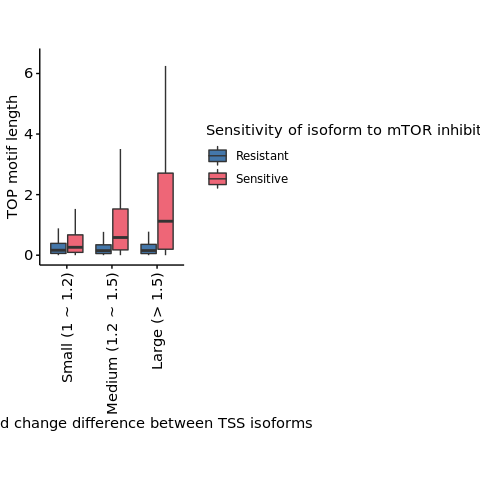
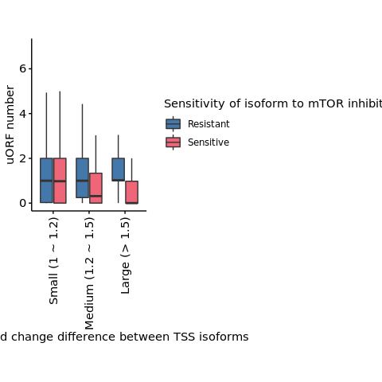

s9-3-1 mTOR and TSS isoforms
================
Yoichiro Sugimoto
28 February, 2022

  - [Environment setup and data
    preprocessing](#environment-setup-and-data-preprocessing)
  - [Data import](#data-import)
  - [Analysis of TSS isoforms with differential sensitivity to mTOR in
    relation to the sequence
    features](#analysis-of-tss-isoforms-with-differential-sensitivity-to-mtor-in-relation-to-the-sequence-features)
  - [Session information](#session-information)

# Environment setup and data preprocessing

``` r
## Specify the number of CPUs to be used
processors <- 8

## library("BiocParallel")
## register(MulticoreParam(processors))

temp <- sapply(list.files("../functions", full.names = TRUE), source)
temp <- sapply(list.files("./functions", full.names = TRUE), source)  
source(file.path("../s6-differential-expression-and-tss-usage/functions/load_total_analysis_results.R"), chdir = TRUE)
```

    ## [1] "Sample file used: /camp/lab/ratcliffep/home/users/sugimoy/CAMP_HPC/projects/20211102_HP5_HIF_mTOR/data/sample_data/processed_sample_file.csv"
    ## [1] "The following R objects were exported: total.sample.dt, total.coldata.df, total.comparison.dt"
    ## [1] "Comparison information was loaded"
    ## [1] "/camp/lab/ratcliffep/home/users/sugimoy/CAMP_HPC/projects/20211102_HP5_HIF_mTOR/results"
    ## [1] "The following objects were loaded: tss.de.res.dt, tss.ratio.res.dt, diff.tss.res.dt"

``` r
source(file.path("../s8-analysis-of-translation/functions/test_differential_translation-v2.R"))
```

    ## [1] "The following functions were exported: analyzeDtg(), subsetColdata()"

``` r
s4.tss.dir <- file.path(results.dir, "s4-tss-definition-and-tx-assignment")
s4.2.tx.assignment.dir <- file.path(s4.tss.dir, "s4-2-transcript-assignment")
s4.2.1.tss.tx.map.RCC4.dir <- file.path(s4.2.tx.assignment.dir, "s4-2-1-tss-transcript-mapping-RCC4")

s8.dir <- file.path(results.dir, "s8-analysis-of-translation")
s8.1.dir <- file.path(s8.dir, "s8-1-differentially-translated-mRNAs")
s8.1.1.dir <- file.path(s8.1.dir, "gene-level-dte")
s8.1.2.dir <- file.path(s8.1.dir, "tx-level-dte")
s8.2.dte.iso.dir <- file.path(s8.dir, "s8-2-differentially-translated-isoforms")
s8.3.dir <- file.path(s8.dir, "s8-3-validation-of-method")

s9.dir <- file.path(results.dir, "s9-integrative-analysis")

set.seed(0)
```

# Data import

``` r
all.filtered.tss.dt <- file.path(
    s8.3.dir,
    "filtered_tss_for_polysome_analysis.csv"
) %>%
    fread


rcc4.vhl.mrl.dt <- file.path(
    s8.1.2.dir,
    "RCC4_VHL_EIF4E2_yy_xx__Torin1_vs_NA-mean_ribosome_loading.csv"
) %>%
    fread

tx.meta.info.dt <- file.path(s8.3.dir, "processed-tx-meta-info.csv") %>%
    fread

sig.rcc4.vhl.mrl.dt <- merge(
    rcc4.vhl.mrl.dt[
        biotype == "protein_coding",
        .(tss_name, gene_id, gene_name, MRL_treated, MRL_base, MRL_log2fc)],
    y = tx.meta.info.dt[
      , .(tss_name, TOP_motif_length, uORF_all, uORF_all_capped, cds_len)
    ],
    by = "tss_name"
)

sig.rcc4.vhl.mrl.dt <- sig.rcc4.vhl.mrl.dt[
        tss_name %in% all.filtered.tss.dt[
                      RCC4_VHL_NA == TRUE & RCC4_VHL_Torin1 == TRUE, tss_name
                  ]
]
```

# Analysis of TSS isoforms with differential sensitivity to mTOR in relation to the sequence features

``` r
sig.rcc4.vhl.mrl.dt[, `:=`(
    max_MRL_log2fc = max(MRL_log2fc),
    min_MRL_log2fc = min(MRL_log2fc)
), by = gene_id]

sig.rcc4.vhl.mrl.dt[, `:=`(
    TSS_mTOR_group = case_when(
        MRL_log2fc == max_MRL_log2fc ~ "Resistant",
        MRL_log2fc == min_MRL_log2fc ~ "Hypersensitive"
    ),
    dMRL_log2fc = max_MRL_log2fc - min_MRL_log2fc
)]

sl.sig.rcc4.vhl.mrl.dt <- sig.rcc4.vhl.mrl.dt[
    !is.na(TSS_mTOR_group) & abs(dMRL_log2fc) > 0
][order(gene_name, TSS_mTOR_group)]

te.diff.classes <- c(
    "Small (1 ~ 1.2)", "Medium (1.2 ~ 1.5)", "Large (> 1.5)"
)

sl.sig.rcc4.vhl.mrl.dt[, `:=`(
    te_diff_by_tss = case_when(
        abs(dMRL_log2fc) > log2(1.5) ~ "Large (> 1.5)",
        abs(dMRL_log2fc) > log2(1.2) ~ "Medium (1.2 ~ 1.5)",
        abs(dMRL_log2fc) > 0 ~ "Small (1 ~ 1.2)"
    ) %>% factor(levels = te.diff.classes)
)]

d.sl.sig.rcc4.vhl.mrl.dt <- dcast(
    sl.sig.rcc4.vhl.mrl.dt,
    gene_id + gene_name + te_diff_by_tss ~ TSS_mTOR_group,
    value.var = c(
        "tss_name", "MRL_log2fc", "TOP_motif_length", "uORF_all", "cds_len"
    )
)

print("All genes with annotation of multiple TSS available")
```

    ## [1] "All genes with annotation of multiple TSS available"

``` r
d.sl.sig.rcc4.vhl.mrl.dt[, table(te_diff_by_tss) %>% addmargins]
```

    ## te_diff_by_tss
    ##    Small (1 ~ 1.2) Medium (1.2 ~ 1.5)      Large (> 1.5)                Sum 
    ##               1327                627                159               2113

``` r
## Test function
runWilcox <- function(te.diff.class, d.sl.sig.rcc4.vhl.mrl.dt, sl.genes, test.col){
    all.dt <- d.sl.sig.rcc4.vhl.mrl.dt[gene_id %in% sl.genes] 
    
    test.dt <- all.dt[te_diff_by_tss == te.diff.class] 
    
    wil.p <-  test.dt %>%
    {wilcox.test(
         .[, get(paste0(test.col, "_Hypersensitive"))],
         .[, get(paste0(test.col, "_Resistant"))],
         alternative = "two.sided",
         paired = TRUE
     )$p.value}

    wil.res.dt <- data.table(
        tested_data = test.col,
        te_diff_by_tss = te.diff.class,
        N = nrow(test.dt),
        all_N = nrow(all.dt),
        wilcox_p = wil.p
    )
    return(wil.res.dt)
}

sig.th <- 0.05

## TOP mptof length
print("TOP motif length")
```

    ## [1] "TOP motif length"

``` r
diff.top.genes <- d.sl.sig.rcc4.vhl.mrl.dt[
  TOP_motif_length_Hypersensitive != TOP_motif_length_Resistant, gene_id
]

top.test.res.dt <- lapply(
    te.diff.classes,
    runWilcox,
    d.sl.sig.rcc4.vhl.mrl.dt = d.sl.sig.rcc4.vhl.mrl.dt,
    sl.genes = diff.top.genes,
    test.col = "TOP_motif_length"
) %>%
    rbindlist

top.test.res.dt[, padj := p.adjust(wilcox_p, method = "holm")]
top.test.res.dt[, sig_mark := case_when(
                      padj < sig.th * 0.1 ~ "**",
                      padj < sig.th ~ "*",
                      TRUE ~ NA_character_
                  )
                ]
print(top.test.res.dt)
```

    ##         tested_data     te_diff_by_tss    N all_N     wilcox_p         padj
    ## 1: TOP_motif_length    Small (1 ~ 1.2) 1327  2113 2.111702e-18 4.223404e-18
    ## 2: TOP_motif_length Medium (1.2 ~ 1.5)  627  2113 1.718310e-46 5.154931e-46
    ## 3: TOP_motif_length      Large (> 1.5)  159  2113 2.712438e-17 2.712438e-17
    ##    sig_mark
    ## 1:       **
    ## 2:       **
    ## 3:       **

``` r
ggplot(
    data = sl.sig.rcc4.vhl.mrl.dt[gene_id %in% diff.top.genes],
    aes(
        x = te_diff_by_tss,
        y = TOP_motif_length
    )
) +
    geom_boxplot(aes(fill = TSS_mTOR_group), outlier.shape = NA) +
    theme(aspect.ratio = 1.5) +
    scale_fill_bright(name = "Sensitivity of isoform to mTOR inhibition") +
    scale_x_discrete(guide = guide_axis(angle = 90)) +
    coord_cartesian(ylim = c(0, 4.5)) +
    xlab("MRL log2 fold change difference between TSS isoforms") +
    ylab("TOP motif length")
```

<!-- -->

``` r
## uORF length
print("uORF length")
```

    ## [1] "uORF length"

``` r
diff.uorf.genes <- d.sl.sig.rcc4.vhl.mrl.dt[
  uORF_all_Hypersensitive != uORF_all_Resistant, gene_id
]

uorf.test.res.dt <- lapply(
    te.diff.classes,
    runWilcox,
    d.sl.sig.rcc4.vhl.mrl.dt = d.sl.sig.rcc4.vhl.mrl.dt,
    sl.genes = diff.uorf.genes,
    test.col = "uORF_all"
) %>%
    rbindlist

uorf.test.res.dt[, padj := p.adjust(wilcox_p, method = "holm")]
uorf.test.res.dt[, sig_mark := case_when(
                      padj < sig.th * 0.1 ~ "**",
                      padj < sig.th ~ "*",
                      TRUE ~ NA_character_
                  )
                ]
print(uorf.test.res.dt)
```

    ##    tested_data     te_diff_by_tss   N all_N     wilcox_p         padj sig_mark
    ## 1:    uORF_all    Small (1 ~ 1.2) 572   966 2.158136e-04 2.158136e-04       **
    ## 2:    uORF_all Medium (1.2 ~ 1.5) 302   966 2.615496e-10 7.846489e-10       **
    ## 3:    uORF_all      Large (> 1.5)  92   966 1.232559e-08 2.465118e-08       **

``` r
ggplot(
    data = sl.sig.rcc4.vhl.mrl.dt[gene_id %in% diff.uorf.genes],
    aes(
        x = te_diff_by_tss,
        y = uORF_all,
        fill = TSS_mTOR_group
    )
) +
    geom_boxplot(outlier.shape = NA) +
    theme(aspect.ratio = 1.5) +
    scale_fill_bright(name = "Sensitivity of isoform to mTOR inhibition") +
    scale_x_discrete(guide = guide_axis(angle = 90)) +
    coord_cartesian(ylim = c(0, 7)) +
    xlab("MRL log2 fold change difference between TSS isoforms") +
    ylab("uORF number")
```

<!-- -->

# Session information

``` r
sessionInfo()
```

    ## R version 4.0.0 (2020-04-24)
    ## Platform: x86_64-conda_cos6-linux-gnu (64-bit)
    ## Running under: CentOS Linux 7 (Core)
    ## 
    ## Matrix products: default
    ## BLAS/LAPACK: /camp/lab/ratcliffep/home/users/sugimoy/CAMP_HPC/software/miniconda3_20200606/envs/five_prime_seq_for_VHL_loss_v0.2.1/lib/libopenblasp-r0.3.10.so
    ## 
    ## locale:
    ##  [1] LC_CTYPE=en_GB.UTF-8       LC_NUMERIC=C              
    ##  [3] LC_TIME=en_GB.UTF-8        LC_COLLATE=en_GB.UTF-8    
    ##  [5] LC_MONETARY=en_GB.UTF-8    LC_MESSAGES=en_GB.UTF-8   
    ##  [7] LC_PAPER=en_GB.UTF-8       LC_NAME=C                 
    ##  [9] LC_ADDRESS=C               LC_TELEPHONE=C            
    ## [11] LC_MEASUREMENT=en_GB.UTF-8 LC_IDENTIFICATION=C       
    ## 
    ## attached base packages:
    ## [1] parallel  stats     graphics  grDevices utils     datasets  methods  
    ## [8] base     
    ## 
    ## other attached packages:
    ## [1] knitr_1.28        stringr_1.4.0     magrittr_1.5      data.table_1.12.8
    ## [5] dplyr_1.0.0       khroma_1.3.0      ggplot2_3.3.1     rmarkdown_2.2    
    ## 
    ## loaded via a namespace (and not attached):
    ##  [1] Rcpp_1.0.4.6     pillar_1.4.4     compiler_4.0.0   tools_4.0.0     
    ##  [5] digest_0.6.25    evaluate_0.14    lifecycle_0.2.0  tibble_3.0.1    
    ##  [9] gtable_0.3.0     pkgconfig_2.0.3  rlang_0.4.10     yaml_2.2.1      
    ## [13] xfun_0.14        withr_2.4.1      generics_0.0.2   vctrs_0.3.1     
    ## [17] grid_4.0.0       tidyselect_1.1.0 glue_1.4.1       R6_2.4.1        
    ## [21] purrr_0.3.4      farver_2.0.3     scales_1.1.1     ellipsis_0.3.1  
    ## [25] htmltools_0.4.0  colorspace_1.4-1 labeling_0.3     stringi_1.4.6   
    ## [29] munsell_0.5.0    crayon_1.3.4
